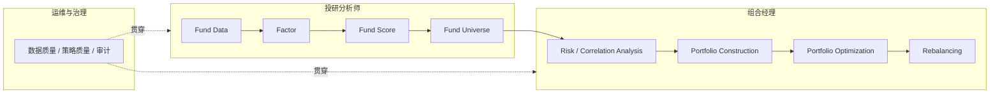
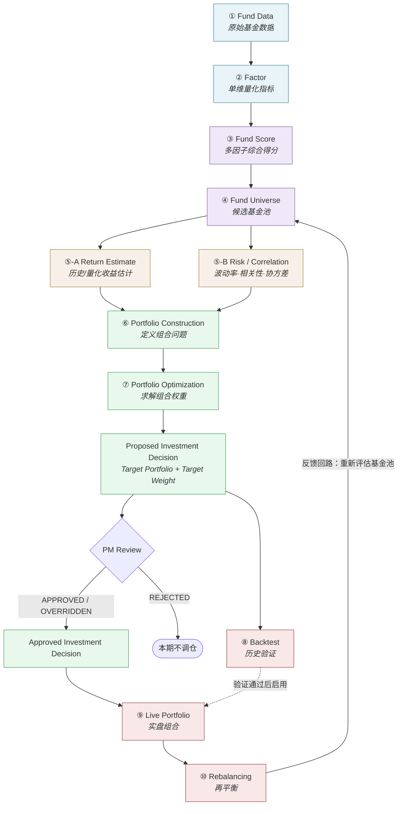
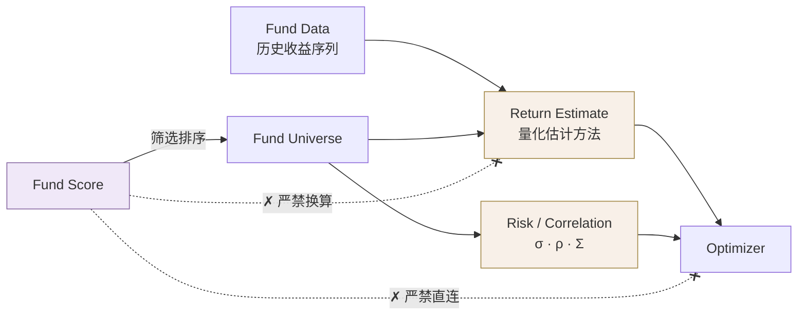
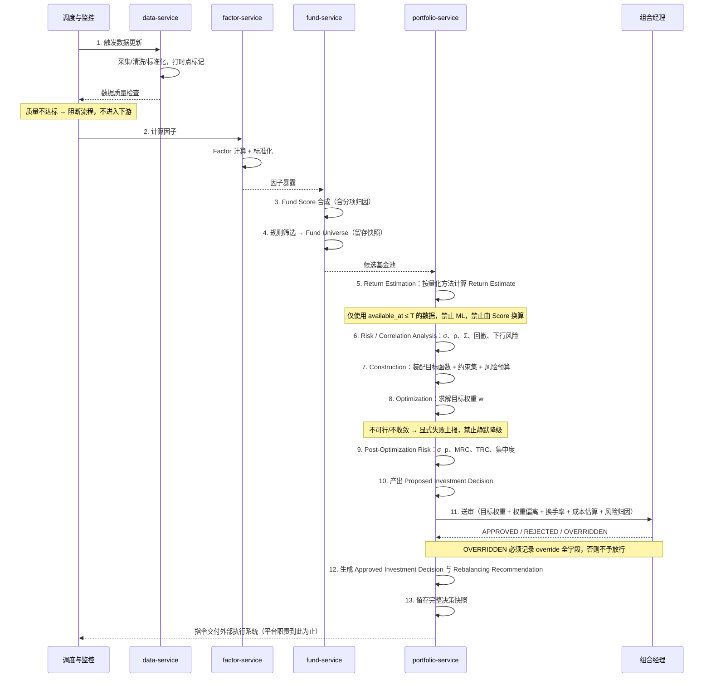
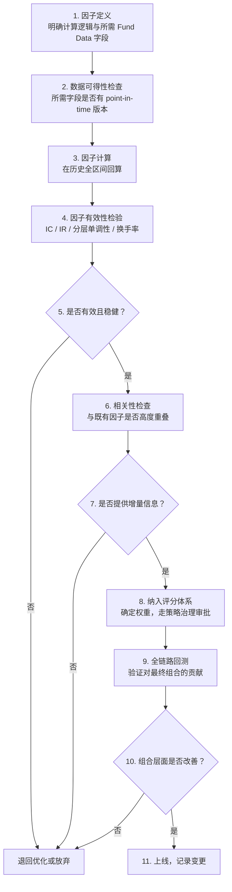

# 产品总览 · Product Overview

> **文档版本**：v2.6
> **产品阶段**：第一阶段 —— 纯 Quant 基金投资组合决策系统（不引入 ML / AI）
> **文档定位**：本文件是 `fund-investment-platform` 全部文档的**唯一上游文档（Single Source of Truth）**
> **适用范围**：`docs/` 目录下全部 13 个文档域

---

## 1. 文档定位与阅读约定

### 1.1 本文档是什么

本文档定义 `fund-investment-platform` 的**产品目标、系统边界与全平台统一概念**。

它不是功能清单，也不是需求说明书。它的唯一职责是：**让所有后续文档在同一套概念和边界下写作**。

具体来说，本文档回答四个问题：

1. 这个系统解决什么问题、给谁用
2. 数据如何一路流到最终组合（核心概念链路）
3. 每个概念的精确定义，以及**它不是什么**
4. 各模块的职责边界划在哪里

### 1.2 文档编写协议（Documentation Protocol）

> **本节为强制条款，适用于 `docs/` 下的每一份文档。**

**第一条｜前置阅读**
编写或修改 `docs/` 下的任何文档前，**必须先完整读取本文档**（`docs/01-product/01-product-overview.md`）。

**第二条｜只能细化，不能重定义**
下游文档**只能细化**本文档定义的概念，**不得重新定义、不得改名、不得扩大或收窄边界**。

例如：`docs/04-factor/01-factor-overview.md` 可以详细展开 `Factor` 有哪些类别、如何计算、如何标准化；但**不得**把 `Factor` 重新定义为"包含综合评分的指标体系"——因为综合评分在本文档中属于 `Fund Score`。

**第三条｜新概念必须先登记**
下游文档中出现的每一个核心概念，必须能在本文档第 4 章「核心概念链路」或第 11 章「术语表」中找到对应定义。

找不到的概念视为**新概念**，必须**先回本文档登记**（补充定义、说明它在链路中的位置、与既有概念的边界），再在下游使用。**严禁在下游文档中直接引入未登记的核心概念。**

**第四条｜冲突以上游为准**
若下游设计与本文档冲突，**以本文档为准**。

确需变更时，流程是：修改本文档 → 升版本号 → 在第 13 章变更记录中登记影响范围 → 同步修改受影响的下游文档。
**不得在下游文档中"就地修正"上游概念。**

**第五条｜上游依赖声明**
每份下游文档开头必须包含一段上游依赖声明，格式固定：

```markdown
> 上游文档：docs/01-product/01-product-overview.md（v2.4）｜本文细化环节：<链路阶段名>
```

其中 `<链路阶段名>` 取自第 4 章定义的 10 个业务链路阶段之一，或填写 `支撑层`。

### 1.3 协议适用清单

该协议适用于 `docs/` 下的**全部**文档。以下是几份最容易与上游产生概念偏移、需要格外注意的文档：

| 文档 | 细化环节 | 最易偏移的概念 |
|---|---|---|
| `docs/01-product/02-business-requirements.md` | 全链路 | 系统边界（In/Out of Scope） |
| `docs/02-architecture/01-system-architecture.md` | 支撑层 | 服务划分与链路环节的对应关系 |
| `docs/04-factor/01-factor-overview.md` | Factor | `Factor` 与 `Fund Score` 的边界 |
| `docs/05-fund-evaluation/02-fund-scoring.md` | Fund Score | `Fund Score` 与 `Return Estimate` 的边界 |
| `docs/06-portfolio/01-portfolio-construction.md` | Portfolio Construction | `Construction` 与 `Optimization` 的边界 |
| `docs/07-return-risk/02-return-estimate.md` | Risk / Correlation Analysis | 收益估计的量纲与可加总性；**不得引入 ML** |
| `docs/08-backtest/01-backtest-engine.md` | Backtest | `Backtest` 与 `Live Portfolio` 的策略实现一致性 |

### 1.4 阅读约定

- **术语不翻译**：`Fund Score`、`Fund Universe`、`Return Estimate` 等英文术语在全平台文档中保持英文原样，不使用中文译名，不使用同义词。中文说明可以有，但术语本身不替换。
- **一次定义原则**：每个概念只在本文档定义一次。下游文档重复出现时应引用而非复述。
- **待定项标记**：本文档中所有尚未确认的量化指标以 `<TBD: …>` 标记，并在第 14 章统一汇总。下游文档不得自行填充 TBD 项。

---

## 2. 产品定位

### 2.1 一句话定义

`fund-investment-platform` 是一个**面向基金的量化投研与组合管理平台**：把标准化基金数据，经由因子计算、基金评价、候选池筛选、风险分析、组合构建、组合优化与回测验证，转化为**可执行、可复现、可追溯的目标组合与再平衡指令**。

### 2.1.1 第一阶段定位

第一阶段建设的是一个 **Rule-based / Quantitative Fund Investment Portfolio Decision System**：

> 全部投资决策必须能够仅凭**量化方法与历史数据**独立完成，**不依赖 Machine Learning、AI、LLM 或 RAG**。

这不是能力缺失，而是刻意的阶段选择——先建立一个**完全可解释、可复现、可回测**的量化基线（Quant Baseline）。未来引入 ML 时，只需将 `Return Estimate` 扩展为 `Quant Estimate + ML Estimate` 的组合，无需推翻架构。详见 §9 原则九至十四、§6.2 Out of Scope。

### 2.2 要解决的问题

| 问题 | 现状痛点 | 平台的解法 |
|---|---|---|
| **数据不可比** | 不同来源的基金数据口径不一，净值复权方式、分类标准、费率口径各异 | 统一数据域模型与标准化流程（`03-data`），所有下游只消费标准化后的数据 |
| **评价靠经验** | 基金筛选依赖人工经验与单一指标（如近一年收益），缺乏系统性 | 多因子体系（`04-factor`）+ 可解释的综合评分（`05-fund-evaluation`） |
| **选基与建仓脱节** | 选出"好基金"之后，如何配权重仍靠拍脑袋 | 由历史收益特征、风险特征、基金间相关性与协方差结构，加上投资约束与风险预算，交由 `Portfolio Optimization` 求解目标权重，而非人工指定 |
| **策略无法验证** | 策略效果无法在历史上严格复现，回测结果不可信 | 回测引擎强制 Point-in-Time（`available_at ≤ decision_at`），显式处理前视偏差与幸存者偏差（`08-backtest`） |
| **实盘与回测不一致** | 回测跑一套逻辑、实盘跑另一套，结果无法归因 | **单一策略实现原则**：回测与实盘共用同一套 Construction/Optimization 代码 |
| **过程不可追溯** | 某个持仓为什么被选中、权重为什么是这个数，无法回答 | 全链路血缘（`03-data/07-data-lineage`）+ 决策快照，任一持仓可回溯到原始数据 |

### 2.3 不解决什么问题

明确排除，避免下游文档扩大范围（详见第 6 章）：

- **不做交易执行与撮合**：平台输出的是**目标权重与再平衡指令**，实际下单由外部交易系统完成
- **不做客户资金账户与清算**：不涉及资金流、份额登记、TA 清算
- **不做面向 C 端投资者的投顾服务**：平台服务于机构内部投研与组合管理，不直接产出对外的投资建议
- **第一阶段不做 ML / AI 驱动的投资决策**：不实现机器学习收益预测、AI 信号、LLM 与 RAG。核心决策链路必须能在无这些能力的前提下完整运行（详见 §6.2）

---

## 3. 目标用户与使用场景

平台服务于三类角色。三者共享同一套数据与概念，但关注链路的不同区段。

### 3.1 投研分析师（Research Analyst）

**关注链路区段**：`Fund Data` → `Factor` → `Fund Score` → `Fund Universe`

**核心诉求**

- 设计、验证、迭代因子，判断某个因子与未来收益之间是否存在稳定的统计关系
- 调整评分权重，观察基金池构成如何变化
- 理解某只基金为什么得分高——需要因子级别的归因

**典型场景**：分析师新增一个"基金经理任职稳定性"因子，希望验证它在过去 5 年是否具备选基能力（IC 显著性），再决定是否纳入评分体系。

**对平台的要求**：因子可插拔、因子有效性检验工具（`04-factor/07-factor-validation`）、评分权重可配置且变更留痕。

**关于"因子的预测能力"**：因子有效性检验（IC、ICIR、分层单调性、因子稳定性、因子间相关性）衡量的是**因子值与未来收益之间的统计关系**，这是因子研究的固有内容，与系统是否使用 ML 无关。

> 第一阶段：因子有效性检验**保留**；基于 ML 的收益预测**不实现**。两者不可混为一谈。

### 3.2 组合经理（Portfolio Manager）

**关注链路区段**：`Fund Universe` → `Risk / Correlation Analysis` → `Portfolio Construction` → `Portfolio Optimization` → `Rebalancing`

**核心诉求**

- 在给定风险预算和约束下，得到一个可执行的目标组合
- 理解组合的风险来源（风险归因），确认没有隐含的集中暴露
- 判断这次调仓是否值得——换手率带来的成本 vs 收益改善

**关注的具体量**：历史收益、波动率、最大回撤、相关性、协方差、风险贡献、组合集中度、风险预算、目标权重、换手率、交易成本。

**典型场景**：组合经理在季度调仓时，需要在"单只基金权重不超过 10%、单一基金公司不超过 25%、换手率不超过 30%"的约束下，求解使风险调整后收益最大的权重方案，并对比调仓前后的风险敞口变化。

**对平台的要求**：约束集可配置（`06-portfolio/05-constraints`）、优化结果可解释、再平衡触发条件明确（`06-portfolio/06-rebalancing`）。

### 3.3 平台运维与治理（Platform Operations & Governance）

**关注链路区段**：贯穿全链路的数据质量、策略质量与合规审计

**核心诉求**

- 数据是否按时到达、是否完整、是否有异常值（`12-operations/03-data-monitoring`）
- 因子计算是否正常、评分与组合配置是否为预期版本（`12-operations/04-strategy-monitoring`）
- 优化器运行状态是否正常（是否收敛、是否可行）
- 回测与实盘是否一致，任一历史决策能否复现、变更是否留痕（`13-governance/04-audit`）

**典型场景**：某日净值数据源延迟，运维需要判断影响哪些因子、哪些基金评分失效、当日是否应该阻断调仓流程。

**对平台的要求**：数据血缘可查、任务依赖清晰、策略与配置版本明确、决策快照完整、异常可阻断而非静默降级。

> 第一阶段无 ML 模型，因此**不存在**模型漂移监控、预测精度监控、模型服务监控。取而代之的是**策略监控**与**配置版本治理**。

### 3.4 角色与链路的对应关系



---
## 4. 核心概念链路

### 4.1 主干链路

以下链路是**全平台的骨架**，共 **10 个业务链路阶段（Stage）**。所有架构设计、服务划分、表结构、API 分组都必须能映射到这条链上。

**链路顺序不可变更。**

### 4.0 三个层级：Stage / Concept / Output

本文档的概念分三层。混用这三层会让"到底有几个环节"这类问题无法回答，因此必须先区分：

| 层级 | 含义 | 数量 | 举例 |
|---|---|---|---|
| **Stage（业务链路阶段）** | 主干链路上的阶段，顺序固定不可变更 | **恰好 10 个** | ⑤ Risk / Correlation Analysis |
| **Concept（阶段内概念）** | 某个 Stage 内部的组成部分，可增删 | 不固定 | ⑤-A Return Estimate、⑤-B Risk / Correlation |
| **Output（阶段产出物）** | 某个 Stage 产出的业务对象，不占用 Stage 编号 | 不固定 | ⑦ 的产出：Proposed Investment Decision |

**规则**：

- "10 个阶段"指的是 **Stage**，这个数字是固定的
- `Return Estimate` 是 Stage ⑤ 内的 **Concept**，不是第 11 个 Stage
- `Investment Decision` 是 Stage ⑦ 的 **Output**，不是独立 Stage
- 新增 Concept 或 Output **不需要**升主版本；新增或调整 Stage **必须**升主版本并审查全部下游文档

```
Stage ⑤  Risk / Correlation Analysis
   ├── Concept ⑤-A  Return Estimate
   └── Concept ⑤-B  Risk / Correlation

Stage ⑦  Portfolio Optimization
   ├── Concept ⑦-R  Post-Optimization Portfolio Risk
   └── Output       Proposed Investment Decision
```

```
Fund Data
    ↓
Factor
    ↓
Fund Score
    ↓
Fund Universe
    ↓
Risk / Correlation Analysis
    ↓
Portfolio Construction
    ↓
Portfolio Optimization
    ↓
Backtest
    ↓
Live Portfolio
    ↓
Rebalancing
```



**关于反馈回路**：`Rebalancing → Fund Universe` 是这条链唯一的反向边。它表示再平衡不是简单地按旧权重恢复比例，而是**重新走一遍从基金池评估开始的下游流程**。这条边的存在意味着整个系统是一个周期性运行的闭环，而非一次性的线性管道。

**关于环节 ⑤ 的两条支路**：`Return Estimate` 与 `Risk / Correlation` 并列构成环节 ⑤，二者都基于**截至决策时点可得的历史数据**计算，共同汇入 `Portfolio Construction`。两者必须**逻辑独立**——收益估计不得由风险指标反推，风险估计也不得依赖收益估计的结果。

**关于 Investment Decision 的两个阶段**：优化器的产出与最终生效的决策**不是同一个对象**，必须分开命名：

```
Optimization Result           优化器的原始输出：w、求解状态、诊断信息
        ↓
Proposed Investment Decision  系统提出的目标组合（Target Portfolio + Target Weight）
        ↓
Portfolio Manager Review      APPROVED / REJECTED / OVERRIDDEN
        ↓
Approved Investment Decision  实际生效、可交付执行的决策
        ↓
Rebalancing Recommendation    买卖清单
```

三者都不是买卖信号，也不是任何单一指标，而是**组合层面的完整决策**（详见 §7.1.1、§11.2 术语表与 §9 原则十四）。

**这与"第一阶段全部投资决策由量化方法独立完成"不冲突**——原则九约束的是**决策如何生成**（不依赖 ML / AI），PM Review 属于**决策如何放行**的治理环节。系统始终能够独立产出 `Proposed Investment Decision`；人工审批不参与决策的生成过程。

但若 PM 可以修改权重（OVERRIDDEN），则必须按 §7.1.1 完整留痕，否则原则六（可复现）与原则七（可追溯）将被破坏。

**关于第一阶段不含 AI 层**：本阶段主干链路**不包含**任何 AI / ML / LLM / RAG 环节。`09-ai` 为**未来扩展域（Future Extension）**，不实现、不参与主链路（详见 §6.2、§12）。未来接入时，AI 信号只能作为 `Factor` 或 `Return Estimate` 的**增强项**进入既有环节，不得新增绕过主干的旁路。

### 4.2 阶段定义卡片

以下 10 张卡片是各 **Stage** 的权威定义。下游文档必须与之一致。

---

#### ① Fund Data

| 字段 | 内容 |
|---|---|
| **定义** | 经过采集、清洗与标准化后的基金原始事实数据，是全链路唯一的数据入口。包括净值序列、持仓明细、规模、费率、基金经理、基金分类、公告等。 |
| **输入** | 外部数据源（数据供应商、交易所、基金公司公告等），详见 `03-data/01-data-source` |
| **输出** | 标准化的基金数据域模型，每条事实均带 `effective_at` / `available_at` / `version` 三元时点标记，供 `Factor` 计算消费 |
| **归属** | `services/data-service` ｜ `docs/03-data` |
| **边界（它不是什么）** | **不是**任何加工指标——收益率、波动率、夏普比率都属于 `Factor`，不属于 `Fund Data`。<br/>**不是**未经标准化的原始落地文件——裸数据只存在于采集层内部，不对下游暴露。<br/>**不承担**任何评价或排序职责。 |

**关键约束**：所有 `Fund Data` 必须可回答"在历史某一时刻，当时**能看到**的数据是什么"。这是回测无前视偏差的前提。数据的**修订（restatement）**必须保留历史版本，不得原地覆盖。

##### ①-PIT：Point-in-Time 的判定标准

> **Point-in-Time = As-of Decision Time。对任意数据事实，当且仅当 `available_at ≤ decision_at` 时，才允许参与该次决策。**

每条数据事实必须携带三个时点属性：

| 属性 | 含义 | 举例 |
|---|---|---|
| `effective_at` | 该事实在业务上**生效**的日期 | 基金经理变更的生效日 |
| `available_at` | 该事实**首次对平台可见**的时刻（披露/公告/落库时点） | 该变更公告的发布时刻 |
| `version` | 该事实的修订版本；修订产生新版本，旧版本保留 | 净值第 2 次修订 |

**为什么不能用 `data_date ≤ decision_date`**：

```
基金经理变更  effective_at = 2026-08-20
              available_at = 2026-08-25   （公告发布）
决策日        decision_at  = 2026-08-22

按 effective_at ≤ decision_at 判断 → 通过 ✗   系统在 8/22 根本不知道此事
按 available_at ≤ decision_at 判断 → 拒绝 ✓   正确
```

`effective_at ≤ decision_at` **不等于**决策时点可获得。基金数据中生效日早于披露日是常态——经理变更、基金分类调整、定期报告持仓、规模数据、净值修订全都如此。若按生效日筛选数据，回测会稳定地使用当时不可能知道的信息，且这类前视偏差极其隐蔽。

**统一规则**：

- **筛选用 `available_at`**，判断该事实在决策时点是否可见
- **对齐用 `effective_at`**，判断该事实描述的是哪个业务时段
- **修订用 `version`**，同一 `effective_at` 可能有多个版本，取 `available_at ≤ decision_at` 中的最新版本

该规则适用于净值、持仓、规模、费率、经理、分类、公告等**全部**数据类型，也适用于下游一切派生量（Factor、Score、Universe、Return Estimate、Correlation、Covariance）。

##### ①-B：Benchmark Selection（基金基准的确定规则）

> **每只基金必须在指定 `decision_at` 下确定唯一的 Fund Benchmark Definition。**

**选取优先级**（按序执行，命中即止）：

| 优先级 | 来源 | 说明 |
|---|---|---|
| **1** | 基金官方业绩比较基准 | 招募说明书/合同声明的基准，最权威 |
| **2** | 官方业绩比较基准的组成指数及权重 | 官方基准为复合形式时，保留各 Component 及权重 |
| **3** | Strategy-specific Benchmark | 策略层显式指定的基准 |
| **4** | Fund Classification Default Benchmark | 按基金分类的默认基准映射 |
| **5** | System Default Benchmark | 系统兜底基准 |

**四条强制约束**：

1. **Benchmark Mapping 必须具备 PIT 属性**，并记录 `effective_at`、`available_at`、`source`、`mapping_rule_version` 四个字段。回测在 `T` 时点必须使用 `available_at ≤ T` 的映射版本。
2. **Composite Benchmark 不得简化为单一指数**。由多个指数构成的业绩比较基准，必须保留各 **Component 及其权重**。把"沪深300×80% + 中债综合×20%"压缩成"沪深300"会使 Alpha、Beta、超额收益全部失真。
3. **无法确定有效 Benchmark 时，依赖 Benchmark 的全部指标标记为 `UNAVAILABLE`**（Alpha、Beta、Information Ratio、Tracking Error、超额收益、Relative Performance Score）。
4. **严禁**使用未来信息确定 Benchmark，**严禁**使用未经声明的替代 Benchmark 填补缺口。

> **这条规则使 Benchmark 成为确定性算法而非待定配置**：优先级 1–2 从基金官方文件客观可得，无需人工判断；只有优先级 4 的分类默认映射需要配置。因此 Benchmark 不构成 `05-metric-specification` / `06-scoring-model` 的启动阻塞项。

---

#### ② Factor

| 字段 | 内容 |
|---|---|
| **定义** | 从 `Fund Data` 计算得出的、具有**明确经济含义、明确计算定义与明确研究假设**的**单一量化特征**。 |
| **输入** | `Fund Data`（按 `available_at ≤ decision_at` 筛选后的版本） |
| **输出** | 因子值矩阵（基金 × 因子 × 时间），以及标准化后的因子暴露 |
| **归属** | `services/factor-service` ｜ `docs/04-factor` |
| **边界（它不是什么）** | **不是**综合评价——多因子加权后的结果是 `Fund Score`，不是 Factor。<br/>**不做**排序——Factor 只产出数值，排序发生在 `Fund Score` 环节。<br/>**不是**收益估计——Factor 描述的是历史特征；用于优化器的收益估计属于 `Return Estimate`（环节 ⑤）。 |

**因子分类**（详见 `04-factor`）：收益因子、风险因子、风险调整因子、Alpha/Beta 因子、滚动因子。分类是**多标签**的组织方式，一个 Factor 可同时归入多个分类（如 risk-adjusted momentum 同时涉及收益与风险维度），这不违反"单一量化特征"——它刻画的仍是"单位风险下的动量强度"这**一个**经济含义。

> **不可放松的部分**：Factor 层**不做多因子加权合成**。任何形式的"综合因子""因子总分"本质上都是 `Fund Score`，必须放在 `05-fund-evaluation` 定义。这是 `Factor` / `Fund Score` 边界的根基（§5.1）。

**关键约束**：因子计算必须**可复现**——给定相同的输入数据版本和参数，任意时刻重算的结果必须一致。因子的标准化方法（`04-factor/05-factor-normalization`）必须显式声明，不得隐含在计算代码中。

---

#### ③ Fund Score

| 字段 | 内容 |
|---|---|
| **定义** | 多个 `Factor` 经标准化后按既定权重合成的**单只基金综合得分**，用于同类基金之间的**相对比较与排序**。 |
| **输入** | 标准化后的 `Factor` 暴露 + 评分权重配置 |
| **输出** | 每只基金在每个评估时点的综合得分与分项归因（各因子贡献了多少分） |
| **归属** | `services/fund-service` ｜ `docs/05-fund-evaluation` |
| **边界（它不是什么）** | **不是**收益估计——Score 是无量纲的相对量，`Return Estimate` 是有量纲的绝对量。**严禁把 Score 直接作为收益估计输入优化器**（详见 §5.2）。<br/>**不是**权重——得分高不等于该配多少仓位，权重由 `Portfolio Optimization` 求解。<br/>**不跨类可比**——不同分类的基金（如股票型与债券型）的 Score 默认不可直接比较，跨类比较需显式说明可比性依据。 |

##### ③-S：Fund Score 的五个子分

`Fund Score` 必须可拆解为五个子分，命名固定：

```
Total Score
 ├── Return Score                 收益表现
 ├── Risk Score                   风险水平
 ├── Risk-Adjusted Score          风险调整后收益
 ├── Stability Score              表现稳定性
 └── Relative Performance Score   相对 Benchmark 表现
```

**关键约束**：Score 必须**可归因**——任一得分都能拆解到子分、再拆解到具体因子的贡献，否则评价不可解释。评分权重的每次变更必须留痕（`13-governance/02-strategy-governance`）。

**Score 的计算范围**：Score 的标准化与排名必须在 `Peer Group` 内进行（见 §11.2）。**`Peer Group` 必须独立于 `Fund Score` 产生**，否则会形成 `Score → Universe → Peer Group → Score` 的循环依赖。

---

#### ④ Fund Universe

| 字段 | 内容 |
|---|---|
| **定义** | 在给定时点，通过 **Eligibility Rules（准入规则）** 后允许进入组合构建的基金集合（Eligible Assets）。它是组合构建的可选标的全集。 |
| **输入** | Eligibility Rules（规模下限、成立年限、流动性、合规限制、分类要求等）+ `Fund Score`（**可选**的进一步筛选/排序机制） |
| **输出** | 带时点标记的候选基金列表，及每只基金的入池/出池原因 |
| **归属** | `services/fund-service` ｜ `docs/05-fund-evaluation/05-fund-selection` |
| **边界（它不是什么）** | **不是**最终持仓——入池只代表"可以被选"，实际是否持有及持有多少由优化器决定。<br/>**不是**静态列表——Universe 随时点变化，历史每个调仓日都有各自的 Universe 快照。<br/>**不包含**权重信息。 |

**关键约束**：每个历史时点的 Universe 必须**留存快照**。这是避免幸存者偏差（`08-backtest/04-survivorship-bias`）的前提——回测时必须使用当时的池子，而不是用今天的池子回溯历史。

**关于 `Fund Score` 与 Universe 的关系**：Universe 的**必要定义**是 Eligibility Rules，`Fund Score` 排序只是**其中一种可选**的筛选机制（如"合格基金中取 Score 前 100"）。

这个区分是必要的——`Equal Weight`、`Minimum Volatility`、`Risk Parity` 等策略只需要一个合格标的集合，并不需要 Score 排序。把 Score 写进 Universe 的定义会让这些策略无法在本架构下表达。

---

#### ⑤ Risk / Correlation Analysis

| 字段 | 内容 |
|---|---|
| **定义** | 对 `Fund Universe` 内候选基金的历史收益、波动率、协方差、相关性与回撤进行分析，为 `Portfolio Construction` 与 `Portfolio Optimization` 提供**收益与风险输入**。本阶段包含两条并列支路：`Return Estimate` 与 `Risk / Correlation`。 |
| **输入** | `Fund Universe` + `Fund Data` + `Factor`（均按 `available_at ≤ decision_at` 筛选） |
| **输出** | Historical Return Matrix、Return Estimate（`μ`）、Volatility Vector、Downside Risk、Drawdown Metrics、Correlation Matrix、Covariance Matrix（`Σ`） |
| **归属** | `services/portfolio-service` ｜ `docs/06-portfolio`、`docs/07-return-risk` |
| **边界（它不是什么）** | **不是** ML 预测——第一阶段**不含**任何机器学习收益/风险预测模型（详见 §6.2）。<br/>**不是** `Fund Score` 的换算——`Return Estimate` 必须由历史收益数据独立计算，与 Score 逻辑独立（详见 §5.2）。<br/>**不做**权重分配——它只提供优化器所需的输入参数，权重由 `Portfolio Optimization` 求解。<br/>**不产出** Risk Contribution 与 Concentration——这两者依赖最终权重 `w`，属于 `Portfolio Optimization` 的产出（见下方说明与卡片 ⑦）。<br/>**不使用** `available_at > decision_at` 的任何数据。 |

> **⚠️ 本阶段产出的是 Pre-Optimization Risk（事前风险）**——只依赖历史收益序列，不依赖权重。
>
> `Risk Contribution` 与 `Concentration` 属于 **Post-Optimization Portfolio Risk**：
>
> ```
> Portfolio Volatility   σ_p  = sqrt(w'Σw)
> Marginal Risk Contrib  MRC_i = ∂σ_p / ∂w_i
> Total Risk Contrib     TRC_i = w_i × MRC_i
> ```
>
> 三者都需要 `w`。在 `Portfolio Optimization` 求出 `w` 之前，最终组合的风险贡献**在数学上不存在**，因此不能放在本阶段。

##### ⑤-A：Return Estimate（收益估计）

第一阶段的 `Return Estimate` 定义为：

> 基于截至决策时点可获得的历史收益数据，通过**预先定义的量化估计方法（Quantitative Estimation Method）**得到的持有期收益估计值。

**必须显式声明的三个口径**（缺一则估计值不可用）：

| 口径 | 说明 |
|---|---|
| **Estimation Window** | 用于估计的历史数据窗口长度（如过去 36 个月） |
| **Estimation Horizon** | 估计所指向的未来持有期长度（如未来 1 个季度） |
| **Return Basis** | 绝对收益（Absolute）还是相对基准的超额收益（Excess） |

第一阶段允许的估计方法（具体算法与参数由 `docs/07-return-risk` 定义，本文档不展开）：

| 方法 | 说明 | 使用时必须注意 |
|---|---|---|
| Historical Mean | 历史收益均值 | 需声明窗口与年化口径 |
| Historical CAGR | 历史几何年化收益 | **CAGR 是已实现（realized）收益率，不天然等于下一持有期的收益估计**。作为 `Return Estimate` 使用时，必须显式声明 Estimation Horizon 及"以历史 CAGR 外推该持有期"这一假设 |
| Rolling Mean | 滚动窗口收益均值（如 12M / 36M） | 需声明窗口与更新频率 |
| Benchmark-relative Return | 相对基准的历史超额收益 | **产出的是 Expected Excess Return，不是 Expected Absolute Return**。若优化器目标函数使用绝对收益，必须显式还原：`μ = benchmark return + expected excess return`，否则 `μ'w` 的金融含义不成立 |
| Shrinkage Estimate | 将历史收益向基准或总体均值收缩 | 需声明收缩目标与收缩强度 |

**强制约束**：

1. **不得以 ML 为必要条件**——`Return Estimate` 必须能够仅由上述量化方法独立产出。
2. **必须与 `Fund Score` 逻辑独立**——不得由 Score 换算、映射或缩放得到。
3. **不得使用未来信息**——决策日为 `T` 时，估计只能使用 `available_at ≤ T` 的数据（判定标准见 ①-PIT），否则构成 Look-ahead Bias。
4. **Return Basis 必须与优化器目标函数一致**——绝对收益与超额收益不可混用，混用会使 `μ'w` 失去金融含义。

##### ⑤-B：Risk / Correlation（风险与相关性）

产出 Volatility、Downside Risk、Maximum Drawdown、Correlation Matrix、Covariance Matrix 等**事前风险量**，全部基于历史收益序列计算，**不含 ML Risk Prediction**，**不含**依赖权重的 Risk Contribution 与 Concentration。

**关键约束**：`μ` 与 `Σ` 必须**时间尺度与年化口径一致**——即两者基于同一持有期、同一年化规则计算，使目标函数中的收益项与风险项具有明确的尺度关系。

> **注**：`μ` 与 `Σ` 本就**不是相同量纲**（`μ` 是收益率的一次量，`Σ` 是收益率的二次量）。要求的是口径一致，不是量纲一致。风险厌恶系数 `λ` 的取值依赖于这个口径，口径不一致会使 `λ` 失去可解释性。

估计方法必须显式声明并版本化，且有独立的稳定性评估流程（`07-return-risk`），不得以"回测组合表现好"倒推"估计准确"。全部估计必须满足 ①-PIT 约束。

---

#### ⑥ Portfolio Construction

| 字段 | 内容 |
|---|---|
| **定义** | 定义**组合问题本身**：确定组合的结构框架、资产配置逻辑、风险预算分配与约束集。它回答"我们要解一个什么样的问题"。 |
| **输入** | `Return Estimate` + `Risk / Correlation`（含 `Σ`）+ 投资目标 + 风险偏好 + 合规与运营约束 |
| **输出** | 一个**完整定义的优化问题**：目标函数形式、约束集、风险预算分配方案 |
| **归属** | `services/portfolio-service` ｜ `docs/06-portfolio/01-portfolio-construction`、`02-asset-allocation`、`04-risk-budgeting`、`05-constraints` |
| **边界（它不是什么）** | **不是**求解过程——具体权重的数学求解属于 `Portfolio Optimization`（详见 §5.3）。<br/>**不产出**权重数值。<br/>**不是**一次性设定——不同的组合产品可以有不同的 Construction 方案。 |

**关键约束**：Construction 的产出必须是**可被优化器直接消费的形式化问题描述**，而非自然语言描述的投资理念。约束集必须显式、可校验，且能判断问题是否可行（feasible）。

---

#### ⑦ Portfolio Optimization

| 字段 | 内容 |
|---|---|
| **定义** | 在 `Portfolio Construction` 定义的目标函数与约束集下，**求解得到具体的目标权重向量**的数学过程。 |
| **输入** | Return Estimate、Risk Estimate、Covariance Matrix、Constraint Set、Risk Budget、Optimization Objective |
| **输出** | Optimization Result：目标权重向量 `w`、求解状态（是否收敛、是否可行）、影子价格/敏感性等诊断信息；以及基于 `w` 计算的 **Post-Optimization Portfolio Risk** |
| **归属** | `services/portfolio-service` ｜ `docs/06-portfolio/03-portfolio-optimization` |
| **边界（它不是什么）** | **不定义**约束与目标——它只求解别人定义好的问题。若求解时需要修改约束才能可行，必须**返回不可行并上报**，而不是自行放松约束。<br/>**不是**实盘持仓——输出的是目标权重，实际持仓在 `Live Portfolio` 中。 |

##### ⑦-R：Post-Optimization Portfolio Risk（事后组合风险）

权重 `w` 求出后，本阶段负责计算依赖 `w` 的组合层风险量：

| 指标 | 说明 |
|---|---|
| Portfolio Volatility | `σ_p = sqrt(w'Σw)` |
| Marginal Risk Contribution | `MRC_i = ∂σ_p / ∂w_i` |
| Total Risk Contribution | `TRC_i = w_i × MRC_i` |
| Concentration | 权重 HHI、前 N 大权重占比 |
| Factor Exposure | 组合在各因子上的加权暴露 |

**与 `Portfolio Construction` 中 Risk Budget 的区别**——这是一组容易混淆的概念：

| | Risk Budget（事前） | Risk Contribution（事后） |
|---|---|---|
| 归属 | ⑥ Portfolio Construction | ⑦ Portfolio Optimization |
| 性质 | **目标/约束**——希望各部分承担多少风险 | **结果**——实际承担了多少风险 |
| 是否依赖 `w` | 否 | 是 |
| 用途 | 作为约束进入优化问题 | 检验优化结果是否达成风险预算 |

两者必须同时留存于决策快照，事后才能回答"风险预算是否被实际满足"。

**关键约束**：求解失败（不可行、不收敛）必须**显式失败并阻断流程**，严禁静默降级为等权或上期权重。求解过程必须可复现——相同输入必须得到相同输出（固定随机种子与求解器版本）。

---

#### ⑧ Backtest

| 字段 | 内容 |
|---|---|
| **定义** | 用**历史数据**重放完整链路（②→⑦），验证策略在历史上的表现与稳健性。 |
| **输入** | 历史 `Fund Data` 快照 + 与实盘**完全相同**的 Factor / Score / Universe / Return Estimation / Risk Analysis / Construction / Optimization 逻辑 |
| **输出** | 净值曲线、绩效指标、风险归因、换手率与交易成本、以及偏差检验报告 |
| **归属** | `services/backtest-service` ｜ `docs/08-backtest` |
| **边界（它不是什么）** | **不是**独立的策略实现——回测必须复用实盘的同一套代码（详见 §5.4）。<br/>**不是**参数搜索工具——反复调参直到回测好看属于过拟合，参数选择须有独立的样本外验证。<br/>**不产生**任何实盘指令。 |

**关键约束**：必须显式处理并在报告中声明四类问题——前视偏差（`03-look-ahead-bias`）、幸存者偏差（`04-survivorship-bias`）、交易成本（`05-transaction-cost`）、以及基金的申赎限制与到账时滞。任何未声明处理方式的回测结果**不得作为决策依据**。

---

#### ⑨ Live Portfolio

| 字段 | 内容 |
|---|---|
| **定义** | 在真实（或模拟盘）环境中**实际持有**的组合，包含当前持仓、权重漂移状态与历史决策快照。 |
| **输入** | Approved Investment Decision（目标权重）+ **外部执行/清算系统回报的成交（Fill）或持仓状态** |
| **输出** | 当前实际持仓与权重、组合绩效与风险指标、待执行的调仓指令 |
| **归属** | `services/portfolio-service` ｜ `docs/06-portfolio` |
| **边界（它不是什么）** | **不是**目标权重——实际权重会因净值波动持续漂移，与目标权重的偏离正是 `Rebalancing` 的触发依据。<br/>**不做**交易执行——平台输出指令，实际下单、成交、清算由外部交易系统负责（见第 6 章 Out of Scope）。<br/>**不是**回测的对立面——两者共用同一套策略领域逻辑，仅数据源与时间轴不同。 |

##### ⑨-S：Live Portfolio 的三个状态

> **`Live Portfolio` 不是单一状态，而是三个必须区分的组合状态的容器。**

| 状态 | 含义 | 来源 |
|---|---|---|
| **`Target Portfolio`** | 决策确定的目标持仓与权重 | `Approved Investment Decision` |
| **`Pending Execution`** | 已交付执行但**尚未收到回报**的调整 | Recommendation 已交付、Fill 未回 |
| **`Actual Portfolio`** | **实际持仓与权重** | 外部执行/清算系统的成交或持仓回报 |

**为什么必须区分**：若用单一状态表达三者，回报延迟时会以目标权重冒充实际权重，导致 **Drift 检测得出错误结论**（刚下单就显示"零偏离"），且无法表达部分成交。

**使用规则**：

| 用途 | 使用的状态 |
|---|---|
| Drift 检测（触发再平衡） | `Actual` vs `Target` |
| 事后组合风险（⑦-R 的实盘版） | `Actual` |
| 约束合规校验 | `Target`（决策时）+ `Actual`（持续监控） |
| Backtest-Live Deviation | `Actual` |
| 展示"当前持仓" | `Actual`，并标注是否存在 `Pending` |

> 回报缺失或延迟时，`Actual Portfolio` 标记为**待确认**，`Pending` 部分显式呈现；**不得**以 `Target` 冒充 `Actual`。

**Target Weight 如何变成 Actual Weight**：

```
Approved Investment Decision  (Target Weight)
            ↓  平台输出，职责边界到此
   External Execution System   （下单 · 成交 · 清算）
            ↓  成交回报 / 持仓回报
       Live Portfolio  (Actual Weight)
            ↓  净值波动导致持续漂移
       Weight Drift → Rebalance Trigger
```

`Live Portfolio` 是一个 **portfolio state（组合状态）**，其实际持仓来自外部交易/清算系统的成交回报或持仓回报，而非平台自行推算。平台不负责执行，但必须**消费执行结果**才能维护正确的组合状态。

**关键约束**：每一次实盘决策必须留存**完整快照**——Universe、Score、Return Estimate、Risk Metrics、Correlation Matrix、Covariance Matrix、Constraint Set、Risk Budget、Optimization Objective、Optimization Result、Target Weight。快照必须足以**完整重建**该次历史决策。这是事后归因与审计（`13-governance/04-audit`）的唯一依据。

---

#### ⑩ Rebalancing

| 字段 | 内容 |
|---|---|
| **定义** | 由 `Rebalance Trigger` 发起的一次 **Strategy Re-evaluation（策略重评估）**，其重算范围由触发类型决定，最终产出 Rebalancing Recommendation。 |
| **输入** | `Live Portfolio` 当前权重 + `Rebalance Trigger`（周期到期 / 偏离阈值 / 事件驱动） |
| **输出** | Rebalancing Recommendation（买卖清单与目标权重），以及一次按触发类型确定范围的链路重算请求 |
| **归属** | `services/portfolio-service` ｜ `docs/06-portfolio/06-rebalancing` |
| **边界（它不是什么）** | **不是**简单的比例复原——重算范围可能一直回溯到 `Fund Universe`，基金池本身可能已经变化。<br/>**不是**一律全链路重跑——重算深度由触发类型决定（见下表）。<br/>**不是**无成本操作——每次再平衡都产生换手成本，触发条件必须权衡成本与偏离收益。<br/>**不执行**交易。 |

##### ⑩-T：Rebalance Trigger 与重算范围

**再平衡触发 ≠ 必然重算整条链路。** 重算深度由触发类型决定：

| 触发类型 | 触发条件 | 重算范围 |
|---|---|---|
| **Periodic Rebalance** | 调仓周期到期（如季度末） | **Full Pipeline**：Factor → Score → Universe → Return/Risk → Construction → Optimization |
| **Drift Rebalance** | 实际权重偏离目标超过阈值 | Risk / Correlation → Construction → Optimization（Universe 与 Score 不变） |
| **Eligibility Event** | 基金清盘、合并、暂停申赎、不再满足准入规则 | Universe → Risk / Correlation → Construction → Optimization |
| **Constraint Breach** | 组合触碰合规或风险约束上限 | Construction → Optimization（仅重新求解） |

**为什么要分级**：全链路重跑代价高（因子全量重算）且会在无必要时改变基金池，引入非预期换手。权重漂移只需要重新优化，不应该顺带换掉一批基金。

**关键约束**：触发条件与其对应的重算范围必须**事先定义、可回测**，不得由人工临时决定，也不得在运行时动态调整重算深度。反馈回路的终点由触发类型决定——`Periodic` 与 `Eligibility Event` 回到 `Fund Universe`，`Drift` 与 `Constraint Breach` 回到 `Risk / Correlation Analysis` 或 `Construction`。

---
## 5. 概念边界说明

本章处理五组**最容易被写混**的概念。这五组边界一旦模糊，下游文档必然互相矛盾。

### 5.1 `Factor` vs `Fund Score`

| 维度 | Factor | Fund Score |
|---|---|---|
| **粒度** | 单一维度 | 多维度合成 |
| **数量** | 每只基金有 N 个 Factor 值 | 每只基金有 1 个 Score（每种评分方案） |
| **是否排序** | 否，只产出数值 | 是，Score 的用途就是排序 |
| **是否含主观权重** | 否，由计算规则确定 | 是，权重体现**选基**观点（组合观点在 Construction，见原则三） |
| **归属** | `factor-service` / `04-factor` | `fund-service` / `05-fund-evaluation` |

**判定口诀**：**Factor 不排序，Score 才排序。**

**常见错误**：在 `04-factor` 中引入"综合因子""因子总分"这类概念。这本质上是 `Fund Score`，必须放在 `05-fund-evaluation` 中定义。

### 5.2 `Fund Score` vs `Return Estimate` ⚠️

> **这是全平台最关键的一条边界。**

| 维度 | Fund Score | Return Estimate |
|---|---|---|
| **量纲** | 无量纲（如 z-score、百分位） | 有量纲（如年化收益率 %） |
| **性质** | **相对量**——只在同组内有意义 | **绝对量**——可加总、可与风险做权衡 |
| **用途** | 筛选与排序，决定谁进 `Fund Universe` | 作为 `μ` 输入优化器，参与目标函数计算 |
| **可加总性** | 否——两只基金 Score 相加没有意义 | 是——组合收益估计 = 权重加权求和 |
| **计算依据** | 多因子标准化后按主观权重合成 | 历史收益序列 + 预先定义的量化估计方法 |
| **评估方式** | 分层回测、IC 检验、区分度 | 估计稳定性、样本外偏差、对优化结果的敏感性 |

**强制规则**

> **`Fund Score` 用于基金筛选与排序，不得直接作为 `Return Estimate` 使用，也不得作为优化器的收益输入。**

原因有三：

1. **量纲错误**：优化器的目标函数需要在收益与风险之间做权衡（如 `μ'w - λ/2 · w'Σw`）。Score 无量纲，与 `Σ` 不在同一尺度上，风险厌恶系数 `λ` 将失去意义。
2. **不可加总**：均值-方差框架要求 `μ` 可线性加总。Score 作为排序量不具备这个性质，组合层面的"总分"没有金融含义。
3. **目标错配**：Score 表达的是"排序合理"，`Return Estimate` 表达的是"数值可用"。排序正确不代表数值可用——两只基金 Score 差 0.5，不能推出收益率差多少。

**正确做法**：`Fund Score` 的职责终止于确定 `Fund Universe`（谁进池子）。进池后，`Return Estimate` 由 `Fund Data` 的历史收益序列**独立计算**（环节 ⑤-A），与 Score **逻辑独立**——不由 Score 换算、映射或缩放得到。



**关于 `Score Weight` 策略**：`06-portfolio` 允许把 Score 作为一种**组合构建策略**直接映射为权重（如按 Score 排名分配权重），作为 baseline 使用。这**不违反**本条边界——因为它是在 Construction 层显式选择的一种加权规则，而不是把 Score 当作收益率喂进均值-方差优化器。两者必须在文档中明确区分。

### 5.3 `Portfolio Construction` vs `Portfolio Optimization`

| 维度 | Portfolio Construction | Portfolio Optimization |
|---|---|---|
| **职责** | **定义问题** | **求解问题** |
| **回答的问题** | "我们要优化什么？受什么限制？" | "在这些限制下最优解是什么？" |
| **产出** | 目标函数形式 + 约束集 + 风险预算 | 权重向量 `w` + 求解诊断 |
| **是否涉及投资观点** | 是——风险偏好、配置逻辑都是观点 | 否——纯数学求解，无观点 |
| **变更频率** | 低，属于策略设计层面 | 每个调仓周期运行一次 |
| **文档** | `06-portfolio/01`、`02`、`04`、`05` | `06-portfolio/03` |

**判定口诀**：**Construction 定义问题，Optimization 求解问题。**

**边界上的关键规则**：当优化问题**不可行**（约束互相冲突，无解）时，`Optimization` **必须返回失败并上报**，由 `Construction` 层决定如何修改约束。

优化器**不得自行放松约束**求得一个"差不多的解"——那等于让求解层悄悄改变了投资约束，会导致实际组合违反本应遵守的合规限制，且无人知晓。

### 5.4 `Backtest` vs `Live Portfolio`

| 维度 | Backtest | Live Portfolio |
|---|---|---|
| **数据源** | 历史数据快照（point-in-time） | 实时数据 |
| **时间轴** | 在历史上按调仓日逐期推进 | 沿真实时间前进 |
| **策略逻辑** | **与实盘完全相同** | **与回测完全相同** |
| **输出** | 绩效报告，用于验证 | 调仓指令，用于执行 |
| **文档** | `08-backtest` | `06-portfolio` |

**强制规则**

> **单一策略实现原则：`Backtest` 与 `Live Portfolio` 必须共用同一套 Strategy Domain Logic（策略领域逻辑）——Factor / Score / Universe / Return Estimation / Risk Analysis / Construction / Optimization。两者的差异只允许存在于数据源与时间轴。**

```
              Strategy Domain Logic
        （Factor · Score · Universe · Return
          Estimation · Risk · Construction ·
                  Optimization）
                       │
          ┌────────────┴────────────┐
          ▼                         ▼
    Backtest Runtime           Live Runtime
    历史数据 · 历史时间轴      实时数据 · 真实时间轴
```

`Backtest` 与 `Live` 是同一套领域逻辑的**两种运行模式（Runtime）**，而不是两条流程。

原因：如果存在两套实现，回测结果对实盘就失去了参考意义——实盘表现不及预期时，无法区分是策略失效还是实现不一致。这类问题在实践中极难定位。

**工程含义**：策略领域逻辑必须被封装成**与运行模式无关**的组件，通过注入不同的数据访问层（历史 vs 实时）来切换模式。任何 `if (is_backtest)` 形式的分支都是这条原则的破坏信号，必须在 code review 中拒绝。允许的差异仅限于：数据获取实现、日志与监控、以及不产生实盘指令。

> **本文档只规定"必须共用同一套领域逻辑"这一产品级约束，不规定其技术实现形态**（是共享库、共享服务，还是其他分层）。具体如何组织 Strategy Domain Logic 与两种 Runtime，由 `docs/02-architecture` 决定。

---

### 5.5 `Risk-free Rate` vs `MAR` ⚠️

> **两者都是"收益的比较基准"，数值上常常接近甚至相同——但它们是完全不同性质的对象。**

| 维度 | Risk-free Rate | MAR（Minimum Acceptable Return） |
|---|---|---|
| **本质** | **市场数据**（Market Reference Data） | **评价标准**（Evaluation Policy） |
| **回答** | 市场上的无风险收益**是多少** | 我们认为**多少才算可接受** |
| **来源** | 外部 Provider 观测所得 | 平台内部配置，由投研决定 |
| **是否随时间变化** | 是，随市场变化 | 否，除非评价政策变更 |
| **变化的性质** | **观测到新值**（新数据） | **改变了评价标准**（新配置） |
| **关键属性** | `Currency`、`Tenor`、`effective_at`、`available_at`、`version` | `Currency`、`Fund Category`、`Effective Date`、`Evaluation Policy Version` |
| **时点语义** | PIT：`available_at ≤ decision_at` | 版本：由 `Evaluation Policy Version` 确定 |
| **归属** | `data-service` / `03-data` | `fund-service` / `05-fund-evaluation` |
| **典型消费者** | `Sharpe`、`Alpha`、`Information Ratio` | `Sortino`、`Downside Volatility` |

**判定口诀**：**Risk-free Rate 是观测到的，MAR 是规定的。**

#### 5.5.1 强制约束

> **即使在某些场景下 `MAR = Risk-free Rate` 使配置值与市场值完全相同，两者也必须在数据模型、配置模型与计算语义上保持独立。**

理由是三者性质不同，且第三条决定了系统结构：

| # | 理由 |
|---|---|
| 1 | **变更语义不同** —— `Risk-free Rate` 变了是"市场变了"，属数据更新，不需要任何审批；`MAR` 变了是"我们改变了评价标准"，属策略变更，必须走版本治理与留痕 |
| 2 | **可配置维度不同** —— `MAR` 可按 `Fund Category` 差异化（股票型与货币型的"可接受"显然不同）；`Risk-free Rate` 不因基金类型而不同 |
| 3 | **对结果唯一性的影响不同** —— 见 §5.5.2 |

#### 5.5.2 MAR 使部分 Factor 的值不再唯一

> **这是本条边界最重要的下游后果，必须在 `04-factor` 与 `05-fund-evaluation` 中落实。**

```
Risk-free Rate 是市场数据 → 全平台唯一
    → (Fund, Sharpe, Window, Date) 对应唯一值

MAR 是评价配置 → 可随 Evaluation Policy 不同
    → (Fund, Sortino, Window, Date) 不足以确定唯一值
    → 必须再加上 Evaluation Policy Version
```

**因此**：依赖 `MAR` 的 Factor（`Sortino`、`Downside Volatility` 及其 Rolling 变体）其 Factor Result **必须携带 `Evaluation Policy Version`**，否则无法解释、无法复现。依赖 `Risk-free Rate` 的 Factor 不受此约束。

#### 5.5.3 MAR 的配置粒度必须与 Peer Group 对齐

> **若同一 `Peer Group` 内的基金使用了不同的 `MAR`，它们的 `Sortino` 不可比，分位排名失去意义。**

```
Peer Group 基于 Fund Classification 构建
MAR       可按 Fund Category 配置

若两者粒度不一致 → 同组内出现多个 MAR → 组内 Sortino 不可比
```

**约束**：`MAR` 的配置粒度必须**不细于** `Peer Group` 的划分粒度，即同一 `Peer Group` 内的全部基金必须适用同一个 `MAR`。该约束由 `05-fund-evaluation` 在构建 `Evaluation Policy` 时保证。

---

## 6. 系统能力边界

### 6.1 In Scope（平台负责）

| 能力 | 说明 | 归属链路环节 |
|---|---|---|
| 基金数据采集与标准化 | 多源接入、口径统一、时点版本管理 | Fund Data |
| 数据质量监控 | 完整性、时效性、异常值检测，异常可阻断下游 | 支撑层 |
| 因子计算与验证 | 因子库、因子有效性检验、因子标准化 | Factor |
| 基金评价与分类 | 多因子评分、同类排序、基金分类 | Fund Score |
| 基金池管理 | 规则筛选、池子快照、入池出池留痕 | Fund Universe |
| 历史收益与风险估计 | Return Estimate、波动率、最大回撤、下行风险 | Risk / Correlation Analysis ⑤-A/⑤-B |
| 风险与相关性分析 | 相关性矩阵、协方差矩阵（事前风险） | Risk / Correlation Analysis ⑤-B |
| 组合风险分析 | 组合波动率、风险贡献（MRC/TRC）、集中度、因子暴露（事后风险） | Portfolio Optimization ⑦-R |
| 组合构建与优化 | 约束管理、风险预算、权重求解 | Construction / Optimization |
| 回测验证 | 历史重放、偏差处理、绩效与归因报告 | Backtest |
| 组合监控与再平衡 | 持仓跟踪、偏离监控、调仓指令生成 | Live Portfolio / Rebalancing |
| 全链路可追溯 | 数据血缘、决策快照、变更审计 | 支撑层 |

**第一阶段状态说明**：上表全部为 In Scope。以下能力标记为 **Future**，第一阶段不实现、不参与主链路：AI 信号增强、ML Prediction、LLM / RAG。

### 6.2 Out of Scope（平台不负责）

每条都写明**排除理由**，防止下游文档扩大范围。

| 排除项 | 排除理由 |
|---|---|
| **交易执行与撮合** | 平台的产出是**决策**（目标权重与调仓指令），不是**执行**。交易执行涉及券商/销售渠道对接、成交回报、失败重试等完全不同的技术域与合规要求，应由专门的交易系统承担。平台只需接收成交回报以更新 `Live Portfolio`。 |
| **客户资金账户与份额登记** | 涉及资金流、TA 清算、监管报送，属于账务系统职责。平台只处理组合层面的**权重**，不处理**份额与金额**的账务真实性。 |
| **面向 C 端的投顾服务与销售** | 平台服务于机构内部投研与组合管理。对外投资建议涉及投顾牌照、适当性管理、信息披露等合规要求，超出本平台定位。 |
| **基金公司/管理人的尽调与定性研究** | 定性尽调（团队访谈、投资流程调研）依赖人工判断，无法量化建模。平台可以**存储**尽调结论作为筛选条件，但不生产尽调内容。 |
| **单只基金的底层持仓穿透归因** | 公募持仓披露频率低（通常季度）且有滞后，穿透到个股的归因结论时效性差、误导性强。平台以基金为最小分析单位。`<TBD: 若后续引入高频持仓数据源，需重新评估此项>` |
| **实时行情级别的日内决策** | 基金以净值交易（通常每日一次），不存在日内交易机会。平台按日频运行，不构建实时行情基础设施。 |
| **多资产类别的大类资产配置** | 当前平台聚焦**基金**这一资产类别内部的选择与配置。跨大类（股/债/商品/另类）的战略配置属于上层决策，平台接受其结果作为约束输入。`<TBD: 是否纳入下一阶段规划待产品确认>` |

### 6.2.1 第一阶段专项排除：ML / AI

以下能力在第一阶段**明确不实现**。它们不是被永久排除，而是**推迟到 Quant Baseline 建成之后**再评估。

| 排除项 | 排除理由 |
|---|---|
| **Machine Learning Prediction** | 第一阶段先建立完全可解释的 Quant Baseline。没有基线就无法判断 ML 是否真的带来增量 |
| **Expected Return ML Prediction** | 收益估计改由量化历史估计方法产出（环节 ⑤-A），不依赖 ML |
| **ML Risk Prediction** | 风险估计改由历史收益序列计算（环节 ⑤-B），不依赖 ML |
| **AI Investment Signal** | 不属于第一阶段核心决策链 |
| **LLM / RAG** | 不参与投资决策 |
| **News-based Prediction** | 第一阶段不使用非结构化信息预测收益 |
| **Model Training Platform** | 第一阶段没有 ML Model，无训练需求 |
| **Model Serving** | 第一阶段没有 ML Model，无在线推理需求 |
| **Model Drift Monitoring** | 第一阶段没有 ML Model。取而代之的是策略监控与估计稳定性监控（§10.1） |

**下游文档禁止出现的决策逻辑**（§9 原则十、十一的具体化）：

```
✗  ML Prediction  →  Buy / Sell
✗  LLM            →  Investment Decision
✗  AI Score       →  Portfolio Weight
✗  Fund Score     →  直接作为 Return Estimate
```

**未来接入路径**（供参考，第一阶段不实现）：第一阶段**保留 ML 插入点，但不预设 ML 未来只作用于某一个环节**。可能的插入位置包括但不限于：

| 插入点 | 形式 |
|---|---|
| `Return Estimate`（⑤-A） | `Quant Return Estimate + ML Return Estimate → Combined Return Estimate` |
| `Factor`（②） | ML 生成的衍生特征作为新增 Factor |
| `Fund Score`（③） | ML Ranking 作为评分方案的一种 |
| `Risk / Correlation`（⑤-B） | ML Risk Model 替代或补充历史协方差估计 |
| 全链路条件层 | Regime Detection——按市场环境切换策略参数 |

**共同约束**：无论插入哪一点，都必须作为既有 Stage 的**增强项**接入，不得新增绕过主干的旁路，且必须保留一条不依赖 ML 的量化基线路径作为对照与回退。主干 Stage 结构不变。

### 6.3 边界维护规则

- 任何下游文档若需要引入 Out of Scope 中的能力，**必须先修改本章**并说明理由，不得在下游文档中直接设计。
- In Scope 中每一项能力都必须能映射到第 4 章的某个链路环节或明确标为支撑层。无法映射的能力说明链路定义有缺口，应先补充链路。

---
## 7. 核心业务流程

本章用两个端到端流程串起整条链路，验证第 4 章的环节定义在实际运行中是自洽的。

### 7.1 流程一：一次完整的定期调仓

**触发**：调仓周期到期（如季度末）
**参与角色**：组合经理主导，投研分析师提供因子与评分支持，运维监控数据与任务状态



**标准步骤序列**（第一阶段固定为 13 步）

```
 1. Data Update
 2. Data Quality Check
 3. Factor Calculation
 4. Fund Score
 5. Fund Universe
 6. Historical Return / Risk Estimation
 7. Risk / Correlation Analysis
 8. Portfolio Construction
 9. Portfolio Optimization  (+ Post-Optimization Risk)
10. Proposed Investment Decision
11. Portfolio Manager Review   → APPROVED / REJECTED / OVERRIDDEN
12. Approved Investment Decision → Rebalancing Recommendation
13. Save Decision Snapshot
```

**关键控制点**

| 步骤 | 控制点 | 失败时的处理 |
|---|---|---|
| 2 | 数据完整性与时效性检查 | **阻断**，不允许用残缺数据跑下游 |
| 5 | Universe 快照落库 | 未落库则回测不可复现，**阻断** |
| 6 | Point-in-Time 校验（全部输入满足 `available_at ≤ decision_at`） | **阻断**，任何未来信息泄漏都会使决策无效 |
| 7 | 协方差矩阵可用性（正定性、样本充足度） | **阻断**或按既定规则收缩（shrinkage），规则须预先定义 |
| 9 | 优化问题可行性 | **显式失败**，退回 Construction 层调整约束 |
| 10 | 换手率与成本 vs 收益改善 | 由组合经理判断是否值得调仓 |
| 11 | PM 若选择 OVERRIDDEN，override 字段是否完整 | **阻断**，字段不全不得放行（见 §7.1.1） |
| 13 | 决策快照完整性 | 快照不完整则指令不得下发 |

**决策快照必须包含**（§9 原则七的具体化）：

```
Universe · Score · Return Estimate · Risk Metrics · Correlation Matrix
Covariance Matrix · Constraint Set · Risk Budget · Optimization Objective
Optimization Result · Target Weight
```

要求：任何一次历史决策**都必须能够被完整重建**。

#### 7.1.1 Portfolio Manager Review 与 Override 机制

PM 复核必须产出且仅产出三种结果之一：

| 结果 | 含义 | 后续动作 |
|---|---|---|
| **APPROVED** | 认可系统提出的目标权重 | `Proposed` 原样成为 `Approved Investment Decision` |
| **REJECTED** | 不认可，本期不调仓 | 流程终止，维持现有持仓，记录拒绝理由 |
| **OVERRIDDEN** | 认可方案但**修改了权重** | 修改后的权重成为 `Approved Investment Decision`，**必须完整留痕** |

**OVERRIDDEN 的强制留痕字段**（缺一不得放行）：

```
original_target_weight     系统提出的原始权重
approved_target_weight     PM 批准生效的权重
override_reason            修改理由（必填，不接受空值或占位符）
operator                   操作人身份
timestamp                  操作时刻
```

**为什么必须强制留痕**：`Approved Investment Decision` 是实际生效的决策。若 PM 可以在无记录的情况下修改权重，则：

- **原则六（全链路可复现）失效**——相同输入重跑得不到实盘的权重
- **原则七（决策可追溯）失效**——无法回答"这个权重为什么是这个数"
- **回测-实盘偏离度（§10.2）失去意义**——偏离究竟来自策略失效还是人工干预，无法区分

因此 override 留痕不是治理选项，而是维持这三条原则成立的**前提条件**。

**Override 频率本身是一个监控指标**：override 频繁发生说明策略与 PM 判断存在系统性分歧，应当回到策略设计层排查，而不是持续以人工修正掩盖。具体阈值与处置流程由 `13-governance` 定义。

### 7.2 流程二：一次因子上线

**触发**：投研分析师设计了一个新因子
**参与角色**：投研分析师主导，策略治理负责审核



**关键约束**：新因子必须通过**因子层验证**（步骤 4）与**组合层验证**（步骤 9）两道关。只在因子层有效但对最终组合无改善的因子不予上线——避免因子库无节制膨胀。

步骤 9 的回测必须使用与实盘相同的策略实现（§5.4），且不得为了让新因子表现更好而反复调整其他参数。

---

## 8. 模块地图

链路阶段 ↔ `services/` ↔ `docs/` 的完整对照。**5 个 service 与 13 个文档域全部有归属，无遗漏。**

### 8.1 主干映射

| # | 链路环节 | Service | 主文档域 | 核心文档 |
|---|---|---|---|---|
| ① | Fund Data | `data-service` | `03-data` | `01-data-source`、`02-data-domain-model`、`05-data-normalization` |
| ② | Factor | `factor-service` | `04-factor` | `01-factor-system`、`07-factor-normalization`、`08-factor-validation` |
| ③ | Fund Score | `fund-service` | `05-fund-evaluation` | `01-fund-evaluation`、`02-fund-scoring`、`03-fund-ranking` |
| ④ | Fund Universe | `fund-service` | `05-fund-evaluation` | `04-fund-classification`、`05-fund-selection` |
| ⑤ | Risk / Correlation Analysis | `portfolio-service` | `06-portfolio`、`07-return-risk` | `07-return-risk/01-estimation-framework`、`02-return-estimate`、`03-risk-estimate`、`04-correlation-covariance` |
| ⑥ | Portfolio Construction | `portfolio-service` | `06-portfolio` | `01-portfolio-construction`、`02-asset-allocation`、`04-risk-budgeting`、`05-constraints` |
| ⑦ | Portfolio Optimization<br/>（含 Post-Optimization Risk） | `portfolio-service` | `06-portfolio` | `03-portfolio-optimization` |
| ⑧ | Backtest | `backtest-service` | `08-backtest` | `01-backtest-engine`、`02-backtest-methodology` |
| ⑨ | Live Portfolio | `portfolio-service` | `06-portfolio` | `01-portfolio-construction`（实盘部分） |
| ⑩ | Rebalancing | `portfolio-service` | `06-portfolio` | `06-rebalancing` |

### 8.2 贯穿层与支撑层

| 文档域 | 职责 | 关联 Service |
|---|---|---|
| `01-product` | 产品定位、需求、场景、边界（**本域为上游**） | 全部 |
| `02-architecture` | 系统架构、服务架构、数据架构、集成架构、部署架构、技术栈（共 6 份） | 全部 |
| `09-ai` | **Future / Reserved**——未来扩展域，第一阶段不实现、不参与主链路 | 无（第一阶段） |
| `10-api` | 对外接口契约 | 全部（各 service 暴露各自 API） |
| `11-database` | 表结构、ERD、索引与分区策略、数据保留策略 | 全部 |
| `12-operations` | 部署、监控、数据监控、策略与优化器监控、灾备 | 全部 |
| `13-governance` | 风险管理、策略与配置治理、数据治理、决策审计 | 全部 |

### 8.3 Service 职责边界

第一阶段共 **5 个 service**（`prediction-service` 已移除，其职责并入 `portfolio-service`）。

| Service | 拥有的链路环节 | 明确不负责 |
|---|---|---|
| `data-service` | ① Fund Data | Factor、Score、Portfolio——任何指标计算 |
| `factor-service` | ② Factor | Score、Portfolio——综合评分与排序 |
| `fund-service` | ③ Fund Score、④ Fund Universe | Portfolio Weight——收益估计与权重分配 |
| `portfolio-service` | ⑤ Risk / Correlation Analysis（含 Return Estimation）<br/>⑥⑦ Construction / Optimization<br/>⑨⑩ Live Portfolio / Rebalancing | Data、Factor、Score 的计算；交易执行 |
| `backtest-service` | ⑧ Backtest（编排） | **独立的策略实现**（必须复用上述 service 的逻辑） |

**`portfolio-service` 承担的风险分析职责**分两处，不可混为一谈：

- **Stage ⑤（事前，不依赖 `w`）**：Historical Return Matrix、Return Estimate、Volatility、Downside Risk、Maximum Drawdown、Correlation、Covariance
- **Stage ⑦-R（事后，依赖 `w`）**：Portfolio Volatility、Marginal / Total Risk Contribution、Concentration、Factor Exposure

**关于 `backtest-service` 的特殊说明**：它承载的是 **Backtest Runtime**——按历史时间轴驱动同一套 Strategy Domain Logic 并收集结果，而**不是重新实现一遍策略**。

> 本文档不规定 Backtest Runtime 如何复用领域逻辑（共享库、共享服务或其他形态），只规定**不得存在第二套策略实现**。具体分层由 `docs/02-architecture` 决定（见 §5.4）。

### 8.4 数据存储归属

> **本节声明各类数据的存储特征要求，不指定具体存储产品。** 选型论证属 `02-architecture/06-technology-stack`，表结构与索引设计属 `11-database`。

| 数据类型 | 存储特征要求 | 关键约束 |
|---|---|---|
| 基金基础信息、分类、经理、费率 | 低频变更 · 维度数据 · 需版本链 | 修订保留历史版本，不得原地覆盖 |
| 净值序列、因子值明细 | 日频时序 · 追加为主 · 按时间范围批量扫描 | 支持按 `available_at ≤ decision_at` 的版本检索 |
| Fund Score、五个子分、Peer Group 快照 | 时点快照 · 明细与元信息**同属一个一致性边界** | 快照必须整体完整，不得部分可见 |
| Fund Universe 快照 | 时点快照 · 含成员、规则版本、入出池原因 | 同上；未完整留存的时点其回测结果无效 |
| Return Estimate、协方差 / 相关性矩阵 | 每决策时点一份 · 可整体序列化 | 与 `Risk Model Version` 绑定 |
| 组合持仓、目标权重、决策快照 | **强一致 · 需事务 · 需审计** | 决策快照必须在单一事务内完整写入（见下方约束） |
| 回测结果与逐期快照 | 批量写入 · 按策略版本与区间检索 | 与九项版本号绑定 |
| 配置、权重方案、约束集、变更记录 | 强一致 · 需版本管理与不可篡改审计 | 用于生产决策的配置版本不得删除 |

##### 一条跨越存储设计的产品级约束

> **决策快照必须处于同一个一致性边界内，能够在单一事务中完整写入。**

理由：`§9 原则六`（全链路可复现）、`原则七`（决策可追溯）与业务需求中的"快照不完整则指令不得下发"共同要求快照具备**全有或全无**的语义。若快照的明细与元信息被拆分到不同的一致性边界，这一保证需要额外的分布式事务或补偿机制来维持——该复杂度直接威胁上述两条原则，属于**产品级约束**，而非可由架构层自由权衡的技术偏好。

架构层可以自由选择满足上述特征的任何存储方案，但**不得**以性能优化为由破坏这条约束。

详见 `docs/02-architecture/06-technology-stack`（选型论证）与 `docs/11-database`（结构设计）。

### 8.5 第一阶段端到端架构图

```
                         Fund Data
                             │
                             ▼
                       Data Quality
                             │
                             ▼
                       Factor Engine
                             │
                             ▼
                      Fund Evaluation
                             │
                             ▼
                       Fund Universe
                             │
                ┌────────────┴────────────┐
                │                         │
                ▼                         ▼
       Return Estimation          Risk / Correlation
       (Historical / Quant)       (σ · ρ · Σ · MDD)
                │                         │
                └────────────┬────────────┘
                             ▼
                   Portfolio Construction
                             │
                             ▼
                   Portfolio Optimization
                   + Post-Optimization Risk
                    (σ_p · MRC · TRC · HHI)
                             │
                             ▼
              Proposed Investment Decision
                   (Target Portfolio + Weight)
                             │
                ┌────────────┴────────────┐
                ▼                         ▼
             Backtest            Portfolio Manager Review
          (验证 Runtime)      APPROVED / REJECTED / OVERRIDDEN
                                          │
                                          ▼
              Approved Investment Decision
                                          │
                                          ▼
                          Rebalancing Recommendation
                                          │
                                          ▼
                   External Execution System
                    （平台职责边界之外）
                                          │  成交/持仓回报
                                          ▼
                              Live Portfolio
                                          │
                                          ▼
                            Rebalance Trigger
                                          │
                                          ▼
                          Strategy Re-evaluation
                     （重算范围由触发类型决定，见 ⑩-T）
                                          │
                    ┌─────────────────────┼──────────────────┐
                    ▼                     ▼                  ▼
              Fund Universe      Risk / Correlation    Construction
              (Periodic /          (Drift)           (Constraint Breach)
               Eligibility)
```

**图中不存在的环节**（第一阶段刻意排除）：ML Model、Prediction Service、AI Signal、LLM、RAG。

**关于 Backtest 的位置**：`Backtest` 与 `Live` 并非串行的两个投资阶段，而是同一套 Strategy Domain Logic 的**两种 Runtime**（§5.4）。图中把它画在 `Proposed Investment Decision` 的分支上，表示的是"同一决策逻辑既可在历史时间轴上验证，也可在真实时间轴上执行"，而不是"回测是投资流程的第八步"。

---
## 9. 关键设计原则

以下原则约束全平台的设计决策。下游文档的设计方案必须与之相容；如需违反，须先在本文档中修订原则并说明理由。

### 原则一：单一策略实现（Single Strategy Implementation）

**原则**：`Backtest` 与 `Live Portfolio` 共用同一套策略代码，差异只允许存在于数据访问层与时间轴。

**理由**：两套实现会让回测结果失去对实盘的参考意义——实盘不及预期时，无法区分是策略失效还是实现不一致，而这类差异极难定位。任何 `if (is_backtest)` 形式的策略分支都是这条原则的破坏信号。

**共用范围**：Factor / Score / Universe / Return Estimation / Risk Analysis / Construction / Optimization。

### 原则二：时点数据一致性（Point-in-Time Consistency）

**原则**：**Point-in-Time = As-of Decision Time**。对任意数据事实，当且仅当 `available_at ≤ decision_at` 时才允许参与该次决策。每条事实携带 `effective_at` / `available_at` / `version` 三元时点标记；数据修订产生新版本，旧版本保留，不得原地覆盖。

**理由**：这是消除前视偏差的**唯一**可靠手段。关键在于——**`effective_at ≤ decision_at` 不等于决策时点可获得**。基金数据中生效日早于披露日是常态（经理变更、分类调整、定期报告持仓、规模更新、净值修订），若按生效日筛选，回测会稳定地使用当时不可能知道的信息。判定标准与示例见 §4.2 ①-PIT。

### 原则三：因子与评分解耦（Factor–Score Decoupling）

**原则**：投资观点分三层表达，各层只表达属于自己的那一类观点：

| 层 | 表达什么 | 不表达什么 |
|---|---|---|
| `Factor` | **客观测量**——不包含任何投资观点 | 任何主观权重 |
| `Fund Score` | **选基偏好**——哪些特征让一只基金更值得被选中 | 组合层面的偏好 |
| `Portfolio Construction` | **组合偏好**——风险厌恶、风险预算、回撤容忍、换手偏好、配置逻辑 | 单基金的优劣判断 |

**理由**：因子是客观计算，评分与组合构建各自承载不同层次的主观判断。混在一起会导致投资观点隐藏在计算代码里——既无法审计，也无法在不改代码的情况下调整观点。三层分离后，因子库可稳定复用，选基观点与组合观点可各自独立调整。

> **注**：投资观点**并非全部集中在 `Fund Score`**。`Portfolio Construction` 同样显式表达投资观点（见 §5.3 对照表），这是它与纯数学求解的 `Portfolio Optimization` 的根本区别。

### 原则四：评价与估计分离（Scoring–Estimation Separation）

**原则**：`Fund Score` 用于筛选排序，`Return Estimate` 用于优化求解；两者**逻辑独立**计算，Score 不得换算为 Return Estimate，也不得直接作为优化器的收益输入。

**理由**：见 §5.2——量纲错误、不可加总、目标错配。这条原则是防止"用排序分数当收益率"这一常见错误的制度性保障。

### 原则五：失败显式化（Explicit Failure）

**原则**：数据质量不达标、优化问题不可行、协方差矩阵不可用、Point-in-Time 校验失败等异常，必须**阻断流程并上报**，严禁静默降级（如自动放松约束、退化为等权、沿用上期权重）。

**理由**：静默降级会产生"看起来正常运行、实际已偏离设计"的组合。这类问题往往在事后归因时才被发现，而此时已造成实际损失。显式失败的成本是流程中断，静默降级的成本是错误的实盘决策。

### 原则六：全链路可复现（Full-Chain Reproducibility）

**原则**：给定相同的输入数据版本、配置版本与代码版本，链路任一环节的输出必须完全一致（含随机种子与求解器版本固定）。

**理由**：不可复现的系统无法审计、无法归因、无法调试。任何"重跑一遍结果不一样"的环节都会让下游的一切分析失去意义。

### 原则七：决策可追溯（Decision Traceability）

**原则**：每一次实盘决策必须留存完整快照——Universe、Score、Return Estimate、Risk Metrics、Correlation Matrix、Covariance Matrix、Constraint Set、Risk Budget、Optimization Objective、Optimization Result、Target Weight。任一持仓可回溯到原始数据，任一历史决策可完整重建。

**理由**：回答"这只基金为什么在组合里、权重为什么是这个数"是投研与合规的基本要求。快照必须在决策时同步落库，事后无法重建。

### 原则八：概念单一归属（Single Ownership of Concepts）

**原则**：每个核心概念的**定义权（Definition Ownership）**唯一——只属于一个链路阶段、一个文档域。跨阶段使用时只能引用，不能重新定义。

**必须区分的三种 ownership**：

| 类型 | 含义 | 是否唯一 |
|---|---|---|
| **Definition Ownership** | 谁定义这个概念（哪个 Stage / 哪个文档域） | **唯一** |
| **Implementation Ownership** | 谁计算、谁产出这个概念 | 通常唯一，但不强制 |
| **Data Ownership** | 谁存储、谁提供读取 | **不要求唯一** |

举例——`Risk Estimate` 的定义权唯一属于 Stage ⑤ / `07-return-risk`，但它由 `portfolio-service` 计算、被 `backtest-service` 消费、由存储层持久化、经 `10-api` 暴露。这**不违反**本原则。

**理由**：定义权唯一是本文档存在的根本目的——两个文档各自演进同一概念，最终会产生无法调和的矛盾。但实现权与存储权天然可以分散，若一并要求"唯一归属"，`02-architecture` 将无法描述任何跨服务的数据流动。

> 本原则约束的是**概念定义**，不是**技术归属**。产品文档定义概念，架构文档分配实现，存储文档分配数据——三者不是同一件事。

---

以下六条为**第一阶段专属原则**。它们随阶段推进可能调整，但在第一阶段内与上述八条同等强制。

### 原则九：Quant First（量化优先）

**原则**：第一阶段的投资决策必须能够**完全通过量化方法独立运行**——给定 `Fund Data`，无需任何 ML / AI 组件即可产出 `Target Portfolio`。

**理由**：先建立可解释的量化基线。没有基线，就无法判断后续引入的任何复杂方法是否真的带来增量，也无法在其失效时回退。

### 原则十：No ML Dependency（不依赖机器学习）

**原则**：任何核心投资决策不得依赖 Machine Learning Model。不实现 ML 收益预测、ML 风险预测、模型训练、模型服务与模型漂移监控。

**理由**：见 §6.2.1。这条原则的执行方式是——检查主干链路上是否存在任何"必须先训练才能运行"的环节；若有，即违反。

### 原则十一：No AI Dependency（不依赖 AI）

**原则**：任何核心投资决策不得依赖 AI / LLM / RAG。`09-ai` 为未来扩展域，第一阶段不参与主链路。

**理由**：见 §6.2.1。AI 信号在未来只能作为既有环节的**增强项**接入，不得成为独立的决策路径。

### 原则十二：Explainability First（可解释优先）

**原则**：每一个组合权重都必须能够回答四个问题——

1. 这只基金**为什么进入 Universe**（Score 与筛选规则）
2. **为什么被选中**（Return Estimate 与风险特征）
3. **为什么是这个权重**（优化目标、约束集与风险预算）
4. **承担了什么风险**（波动率贡献、相关性、集中度）

**理由**：可解释性是第一阶段的核心产品价值，也是量化基线相对于黑箱模型的优势所在。任何无法回答上述四问的设计不予采纳。

### 原则十三：Historical Data Only（仅用历史数据）

**原则**：所有策略计算只能使用**决策时点已经可获得的数据**。决策日为 `T` 时，Factor、Score、Universe、Return Estimate、Correlation、Covariance 全部只能基于 `available_at ≤ T` 的数据版本计算——判定标准是**可获得时点**，不是生效日期（见 §4.2 ①-PIT）。

**理由**：这是原则二（Point-in-Time）在第一阶段策略层的具体化。任何一处未来信息泄漏都会使回测结论与实盘决策失效，且这类错误极难被事后发现。

### 原则十四：Portfolio-Level Decision（组合层决策）

**原则**：单只基金的评价**不等于**最终投资决策。最终决策必须在**组合层面**做出，由 Universe、Return Estimate、Risk、Correlation、Covariance、Constraints、Risk Budget 与 Optimization Objective **共同**决定。

**理由**：单基金视角会系统性忽略相关性与集中度——一组各自优秀但高度相关的基金，组合起来是一个糟糕的组合。`Investment Decision` 因此被定义为组合层概念，而非任何单一指标或买卖信号。

---

## 10. 成功指标

指标分为两类。**产品指标**衡量平台是否好用、可靠；**投研指标**衡量策略是否有效。两者不可混用——平台工程质量好不代表策略赚钱，策略有效也不代表平台可用。

### 10.1 产品指标（平台工程质量）

| 指标 | 定义 | 目标值 |
|---|---|---|
| 基金覆盖数 | 纳入 `Fund Data` 且数据质量达标的基金数量 | `<TBD: 待产品确认>` |
| 数据及时率 | 每日数据在约定时点前到达并通过质量检查的比例 | `<TBD: 待产品确认>` |
| 数据完整率 | 关键字段无缺失的记录占比 | `<TBD: 待产品确认>` |
| 因子更新时延 | 从数据就绪到全量因子计算完成的耗时 | `<TBD: 待产品确认>` |
| 全链路运行时延 | 从数据就绪到调仓方案输出的端到端耗时 | `<TBD: 待产品确认>` |
| 回测复现一致率 | 相同输入重跑回测，结果完全一致的比例（目标 100%） | 100% |
| 决策快照完整率 | 实盘决策留存完整快照的比例（目标 100%） | 100% |
| 优化求解成功率 | 优化问题成功收敛且可行的比例 | `<TBD: 待产品确认>` |
| Point-in-Time 校验通过率 | 各阶段输入数据均满足 `available_at ≤ decision_at` 的比例（目标 100%） | 100% |
| Override 率 | PM 复核结果为 OVERRIDDEN 的比例 | `<TBD: 待产品确认>` |
| Override 留痕完整率 | OVERRIDDEN 决策五个字段齐全的比例（目标 100%） | 100% |

### 10.2 投研指标（策略有效性）

| 指标 | 定义 | 用于评估 |
|---|---|---|
| Factor IC / ICIR | 因子值与未来收益的截面相关性及其稳定性 | Factor 环节 |
| Factor Monotonicity | 按因子值分组后，各组收益是否呈单调关系 | Factor 环节 |
| Score Spread | 高分组与低分组的收益差异，衡量评分区分度 | Fund Score 环节 |
| Return Estimate Stability | 相邻决策时点间 Return Estimate 的变动幅度 | Return Estimate ⑤-A |
| Covariance Matrix Stability | 相邻决策时点间协方差矩阵的变动幅度与条件数 | Risk / Correlation ⑤-B |
| Optimization Stability | 输入小幅扰动时目标权重的变动幅度（解的稳健性） | Optimization 环节 |
| Risk Contribution Stability | 各基金风险贡献在时间上的稳定性 | 组合层 |
| Portfolio Concentration | 组合集中度（如权重 HHI、前 N 大权重占比） | 组合层 |
| Annual Return | 组合年化收益 | 组合层 |
| Volatility | 组合年化波动率 | 组合层 |
| Sharpe | 风险调整后收益 | 组合层 |
| Sortino | 下行风险调整后收益 | 组合层 |
| Maximum Drawdown | 组合净值的最大峰谷跌幅 | 组合层 |
| Calmar | 收益 / 最大回撤，衡量收益-回撤效率 | 组合层 |
| Turnover | 单位周期内的仓位变动幅度 | Rebalancing 环节 |
| Transaction Cost | 交易成本对收益的侵蚀 | Rebalancing 环节 |
| Cost-adjusted Excess Return | 扣除交易成本后相对基准的超额收益 | 组合层 |
| Backtest-Live Deviation | 实盘表现与同期回测预期的差异 | 全链路一致性 |

**第一阶段不使用的指标**：预测样本外精度、模型校准度、模型漂移度——因为第一阶段没有 ML 模型。取而代之的是上表中的三项 **Stability** 指标：稳定性是量化估计方法的核心质量维度，估计值剧烈跳动会直接导致组合频繁换手、成本失控。

**关于 `回测-实盘偏离度`**：这是检验 §5.4 单一策略实现原则是否真正落地的指标。持续的系统性偏离说明回测与实盘存在未被识别的差异，须优先排查。

**指标使用规则**：投研指标**不得**用于反向调参——即不允许反复调整策略直到某个回测指标好看。参数选择必须有独立的样本外验证流程（`07-return-risk/06-estimation-validation`）。

---

## 11. 术语表

本表是全平台术语的**引用源**。下游文档使用这些词时，含义必须与此处一致。

### 11.1 链路环节术语

| 术语 | 定义 | 详见 |
|---|---|---|
| **Fund Data** | 经标准化的基金原始事实数据，带时点标记，是全链路唯一数据入口 | §4.2 ① |
| **Factor** | 从 Fund Data 计算得出、描述基金某一个维度特征的量化指标 | §4.2 ② |
| **Fund Score** | 多个 Factor 加权合成的单只基金综合得分，用于相对比较与排序 | §4.2 ③ |
| **Fund Universe** | 规则筛选 + Score 排序后确定的候选基金池，组合构建的可选标的全集 | §4.2 ④ |
| **Risk / Correlation Analysis** | 对 Universe 内基金的历史收益、波动率、协方差、相关性与回撤的分析（**事前风险，不依赖权重**），为组合构建与优化提供输入 | §4.2 ⑤ |
| **Return Estimate** | 基于截至决策时点可获得的历史收益数据，通过预先定义的量化估计方法得到的持有期收益估计值，记作 `μ` | §4.2 ⑤-A |
| **Risk Estimate** | 基于历史收益数据计算的基金风险估计，包括波动率、最大回撤、下行风险等 | §4.2 ⑤-B |
| **Proposed Investment Decision** | 在给定 Universe、Return Estimate、Risk、Correlation、Constraint Set 与 Optimization Objective 后，由 Portfolio Optimization **系统产出**的 Target Portfolio 及 Target Weight。尚未生效 | §4.1、§7.1.1 |
| **Approved Investment Decision** | 经 Portfolio Manager Review 放行后**实际生效**的决策。若为 OVERRIDDEN，其权重可能不同于 Proposed，差异必须完整留痕 | §7.1.1 |
| **Portfolio Construction** | 定义组合问题：目标函数形式、约束集、风险预算分配 | §4.2 ⑥ |
| **Portfolio Optimization** | 在既定问题下求解目标权重向量 `w` 的数学过程 | §4.2 ⑦ |
| **Backtest** | 用历史数据重放完整链路以验证策略表现与稳健性 | §4.2 ⑧ |
| **Live Portfolio** | 真实（或模拟盘）环境中实际持有的组合 | §4.2 ⑨ |
| **Rebalancing** | 将实际权重调整回目标权重，并触发上游重新评估的过程 | §4.2 ⑩ |

### 11.2 通用术语

| 术语 | 定义 |
|---|---|
| **NAV** | Net Asset Value，基金单位净值。平台内统一使用**复权净值**做收益计算，复权规则见 `03-data/05-data-normalization`；未标注时默认指复权后净值。 |
| **Point-in-Time** | 时点一致性，即 **As-of Decision Time**。对任意数据事实，当且仅当 `available_at ≤ decision_at` 时才允许参与该次决策。是消除前视偏差的前提。判定标准见 §4.2 ①-PIT。 |
| **effective_at** | 数据事实在**业务上生效**的日期（如基金经理变更的生效日）。用于时段对齐，**不用于**可见性判断。 |
| **available_at** | 数据事实**首次对平台可见**的时刻（披露、公告或落库时点）。**这是 Point-in-Time 判定的唯一依据。** |
| **version** | 数据事实的修订版本。同一 `effective_at` 可有多个版本，取 `available_at ≤ decision_at` 中的最新版本；旧版本必须保留。 |
| **Eligibility Rules** | 准入规则。决定一只基金能否进入 `Fund Universe` 的硬性条件（规模、成立年限、流动性、合规、分类等）。是 Universe 的**必要定义**；`Fund Score` 排序只是可选的进一步筛选机制。 |
| **Fund Coverage** | 平台数据覆盖的全部基金。`Fund Universe ⊆ Fund Coverage`。两者不可混用——Coverage 是数据范围，Universe 是策略准入结果。 |
| **Fund Classification** | 基金分类。基金的类型归属（股票型/混合型/债券型/指数型/ETF 等）。分类本身带 PIT 属性——基金转型会改变分类，回测必须使用当时的分类。 |
| **Peer Group** | 同类基金组。`Fund Score` 的标准化、排名、分位与分层的**计算样本集**。定义为 `Fund Classification + effective_at + 参与规则`，本身必须满足 PIT。<br/>**强制约束：`Peer Group` 必须独立于 `Fund Score` 产生**，不得由 Score 或 Universe 反向决定，否则形成 `Score → Universe → Peer Group → Score` 的循环依赖，评分将不可复现。 |
| **Evaluation Profile** | 评价画像。决定一只基金适用哪套评价标准（指标集合、权重、Preference Direction）。维度比 `Fund Classification` 更细，至少区分 Active Equity / Passive Equity / Bond / Hybrid——主动与被动基金的 Tracking Error、Alpha 语义完全不同，不能共用一套方向定义。 |
| **Analysis Period** | 分析周期。标准周期为 1M / 3M / 6M / 1Y / 3Y / 5Y。每个周期必须显式声明是**自然日历周期**还是**交易日周期**、年化规则、非交易日处理与起止日包含规则。 |
| **Fund Tier** | 基金分层。按 `Fund Score` 在 `Peer Group` 内的排名形成的等级：A+ / A / B / C / D。派生链为 `Fund Score → Peer Group Ranking → Percentile → Fund Tier`。阈值必须可配置。 |
| **Preference Direction** | 指标偏好方向。每个 `Factor` 必须显式声明其方向，取值：`HIGHER_IS_BETTER` / `LOWER_IS_BETTER` / `TARGET_RANGE` / `STRATEGY_DEPENDENT`。**不得默认"所有风险指标越低越好"**——Tracking Error 与 Beta 的方向取决于策略类型。 |
| **Factor Usage** | 因子用途。每个 `Factor` 必须声明至少一种用途：`DISPLAY`（仅展示）/ `SCORING`（参与评分）/ `SCREENING`（参与筛选）/ `PORTFOLIO`（参与组合构建）/ `BACKTEST`（参与回测评价）。**Factor 存在 ≠ Factor 参与评分。** |
| **UNAVAILABLE** | 指标不可用状态。表示该指标在当前条件下**无法计算**（数据不足、成立时间不足、Benchmark 缺失等）。**区别于"值为 0"**——严禁用 0、均值或任何填充值代替 UNAVAILABLE。 |
| **Data Completeness** | 数据完整度。评分所基于的可用指标数占应有指标数的比例。必须随 `Fund Score` 一同呈现——基于 3 个指标的 85 分与基于 12 个指标的 85 分可信度不同。 |
| **Data Quality Status** | 数据质量状态：`VALID` / `WARNING` / `INVALID`。配合**阻断粒度**使用（见 `03-data/06-data-quality`）：Fund-level 只影响该基金，Metric-level 只影响依赖该指标的结果，Global-level 阻断整个决策周期。 |
| **Fund Lifecycle Status** | 基金生命周期状态：`NORMAL` / `SUSPENDED_SUBSCRIPTION` / `LIQUIDATED` / `MERGED` / `TRANSFORMED`。描述"基金处于什么状态"。 |
| **Investment Eligibility** | 可投资性。描述"在 `decision_at` 时点该基金**能否被建仓/加仓/减仓**"，取值至少区分：可建仓、可持有不可加仓、仅可减仓、不可交易。<br/>**必须与 `Fund Lifecycle Status` 分离**——"暂停申购"意味着不可加仓但仍可持有与减仓，用单一生命周期状态无法表达。回测判断某基金当时能否买入，依据的是 Investment Eligibility，不是 Lifecycle Status。 |
| **Risk Alert Level** | 风险告警级别：`NORMAL` / `WARNING` / `CRITICAL`。CRITICAL 必须阻断调仓流程。 |
| **Fund Benchmark** | 基金基准。单只基金的业绩比较基准，按 §4.2 ①-B 的五级优先级确定。 |
| **Portfolio Benchmark** | 组合基准。整个组合的比较基准，**与 `Fund Benchmark` 是不同概念**。多资产组合通常需要 Composite Benchmark（如 60% 权益基准 + 40% 债券基准），不得直接借用某只成分基金的 Fund Benchmark。 |
| **Composite Benchmark** | 复合基准。由多个指数按权重构成的基准。**必须保留全部 Component 及其权重**，不得简化为单一指数（§4.2 ①-B 约束 2）。 |
| **Decision Status** | 决策状态：`PROPOSED`（系统产出待审）/ `APPROVED`（原样批准）/ `REJECTED`（拒绝，本期不调仓）/ `OVERRIDDEN`（人工修改后批准）/ `EXPIRED`（超时未处理而失效）/ `SUPERSEDED`（被更新的决策取代）。 |
| **Optimization Run** | 一次优化求解的执行记录，包含输入（μ、Σ、约束集、风险预算、目标函数）、求解状态（收敛/可行）、输出权重与诊断信息。是决策审计链上的一环。 |
| **Rebalancing Rule** | 再平衡规则。定义触发条件、重算范围（见 §4.2 ⑩-T）、最小调仓阈值与成本收益判据的规则集合，必须版本化且可回测。 |
| **Risk-free Rate** | 无风险利率。**市场参考数据**（Market Reference Data），由外部 Provider 观测所得，随市场变化。具有 `Currency`、`Tenor`、`effective_at`、`available_at`、`version`，**必须满足 PIT**。用于 `Sharpe`、`Alpha`、`Information Ratio` 等需要无风险收益基准的 Factor。<br/>**不得作为常量写死在 Factor 计算逻辑中。** 与 `MAR` 的边界见 §5.5。 |
| **MAR（Minimum Acceptable Return）** | 最低可接受收益率。**评价标准**（Evaluation Policy 的组成部分），由投研配置而非市场观测。可按 `Fund Category` 与 `Currency` 差异化，具有 `Effective Date` 与 `Evaluation Policy Version`。用于 `Sortino`、`Downside Volatility` 等需要最低收益阈值的 Factor。<br/>**即使数值等于 `Risk-free Rate`，也必须在数据模型、配置模型与计算语义上保持独立**（§5.5.1）。其配置粒度必须不细于 `Peer Group` 划分粒度（§5.5.3）。 |
| **Evaluation Policy** | 评价政策。定义"用什么标准评价基金"的配置集合，`MAR` 是其组成项之一。由 `05-fund-evaluation` 定义与治理，版本化为 `Evaluation Policy Version`。<br/>**与 `Evaluation Profile` 的关系**：`Evaluation Profile` 决定"这只基金该用哪套评价标准"，`Evaluation Policy` 是那套标准的具体内容。 |
| **Metric Version / Benchmark Version** | 指标计算口径版本 / Benchmark 映射关系版本。两者与 Strategy Version 并列，共同决定结果是否可复现。 |
| **Look-ahead Bias** | 前视偏差。在历史某时点的决策中使用了当时尚不可得的信息（如尚未披露的数据、事后修订的净值），导致回测系统性高估策略表现。 |
| **Survivorship Bias** | 幸存者偏差。仅用当前仍存续的基金构建历史样本，忽略了已清盘/合并的基金，导致高估历史收益。避免手段是留存每个时点的 `Fund Universe` 快照。 |
| **Turnover** | 换手率。单位周期内组合仓位的变动幅度，衡量调仓强度，直接决定交易成本。计算口径见 `06-portfolio/06-rebalancing`。 |
| **Drawdown** | 回撤。组合净值从历史峰值到后续谷值的跌幅。**Maximum Drawdown** 指区间内最大的一次回撤。 |
| **Alpha** | 超额收益。基金收益中无法由基准（或风险因子）解释的部分，代表主动管理能力。 |
| **Beta** | 基金收益对基准（或某风险因子）变动的敏感度，代表系统性风险暴露。 |
| **Correlation Matrix** | 相关性矩阵。`Fund Universe` 内基金收益之间的历史相关性矩阵，刻画基金间的共同变动程度。 |
| **Covariance Matrix** | 协方差矩阵。`Fund Universe` 内基金收益之间的历史协方差矩阵，记作 `Σ`，是 `Portfolio Optimization` 的核心风险输入。 |
| **Risk Contribution** | 风险贡献。单只基金对整体组合风险的贡献：`MRC_i = ∂σ_p/∂w_i`（边际），`TRC_i = w_i × MRC_i`（总量）。**依赖最终权重 `w`，属于 Post-Optimization Portfolio Risk（Stage ⑦）**，不属于 Stage ⑤。 |
| **Pre-Optimization Risk** | 事前风险。只依赖历史收益序列、不依赖权重的风险量：波动率、下行风险、回撤、相关性、协方差。归属 Stage ⑤-B。 |
| **Post-Optimization Portfolio Risk** | 事后组合风险。依赖最终权重 `w` 的组合层风险量：组合波动率、MRC、TRC、集中度、因子暴露。归属 Stage ⑦-R。 |
| **Target Portfolio** | 目标组合。`Portfolio Optimization` 产出的目标持仓集合及其 `Target Weight`，是 `Investment Decision` 的具体形式。属 `Live Portfolio` 三态之一（§4.2 ⑨-S）。 |
| **Pending Execution** | 在途调整。已交付外部执行系统但尚未收到成交回报的持仓调整。属 `Live Portfolio` 三态之一。回报延迟时必须显式呈现，不得并入 `Actual Portfolio`。 |
| **Actual Portfolio** | 实际组合。当前**实际持有**的持仓与权重，其唯一权威来源是外部执行/清算系统的成交或持仓回报，**非平台推算**。属 `Live Portfolio` 三态之一。Drift 检测、事后组合风险与 Backtest-Live Deviation 均基于此。 |
| **Quantitative Estimation Method** | 量化估计方法。第一阶段用于产出 `Return Estimate` 的预先定义方法，如 Historical Mean、Historical CAGR、Rolling Mean、Benchmark-relative Return、Shrinkage Estimate。具体算法由 `docs/07-return-risk` 定义。 |
| **Risk Budget** | 风险预算。在组合层面预先分配给各个部分（单只基金、类别、风险因子）的风险额度，是 `Portfolio Construction` 的产出之一。**每条 Risk Budget 必须完整定义六要素**：① 风险指标（对哪个量做预算）② 预算值 ③ 适用范围（单基金/类别/整体）④ 计算方式 ⑤ 超预算处理方式 ⑥ 是硬约束还是软目标。六要素不全的 Risk Budget 不得进入优化问题。 |
| **Constraint Set** | 约束集。优化问题中所有限制条件的集合，包括权重上下限、集中度限制、换手率上限、合规限制等。由 Construction 定义，Optimization 遵守。 |
| **Rebalance Trigger** | 再平衡触发条件。决定何时发起 Strategy Re-evaluation 的规则，分四类：Periodic、Drift、Eligibility Event、Constraint Breach。**不同触发类型对应不同的重算范围**（见 §4.2 ⑩-T）。必须事先定义且可回测。 |
| **Strategy Re-evaluation** | 策略重评估。由 Rebalance Trigger 发起的一次链路重算，其**起点由触发类型决定**——并非一律回到 `Fund Universe`。 |
| **Override** | 人工干预。PM 在复核时修改系统提出的目标权重。必须记录 `original_target_weight`、`approved_target_weight`、`override_reason`、`operator`、`timestamp` 五个字段，否则不得放行（§7.1.1）。 |
| **Estimation Window / Estimation Horizon** | 估计窗口 / 估计期限。前者是用于估计的历史数据长度，后者是估计所指向的未来持有期长度。两者必须分别显式声明，不可混用。 |
| **Return Basis** | 收益口径。`Return Estimate` 表达的是绝对收益（Absolute）还是相对基准的超额收益（Excess）。必须与优化器目标函数一致（§4.2 ⑤-A）。 |
| **Strategy Domain Logic** | 策略领域逻辑。Factor / Score / Universe / Return Estimation / Risk Analysis / Construction / Optimization 的实现总称。`Backtest` 与 `Live` 是它的两种 Runtime（§5.4）。 |
| **Strategy Lifecycle** | 策略生命周期状态机：`DRAFT → VALIDATING → APPROVED → ACTIVE → SUSPENDED`。控制一个策略从设计到上线到停用的流转。**状态定义登记于本文档，各状态之间的准入门槛（Validation Gate）由 `13-governance` 定义。** |
| **IC / ICIR** | Information Coefficient，因子值与未来收益的截面相关系数，衡量因子与未来收益的统计关系；ICIR 为 IC 的均值除以标准差，衡量其稳定性。**注**：IC 检验属于因子研究的固有内容，与系统是否使用 ML 无关（详见 §3.1）。 |
| **Shrinkage** | 收缩估计。对 `μ` 或 `Σ` 的估计值向某个先验值（基准、总体均值、对角阵）收缩，以降低估计误差对优化结果的放大效应。第一阶段是 `Return Estimate` 的可选方法之一。 |
| **Feasible / Infeasible** | 优化问题在给定约束集下**存在解 / 不存在解**。Infeasible 时必须显式上报，不得自行放松约束。 |
| **Quant Baseline** | 量化基线。第一阶段建成的、完全不依赖 ML / AI 的量化决策系统。它既是当前的交付目标，也是未来评估任何复杂方法是否带来增量的对照基准。 |

### 11.3 第一阶段已移除的术语

以下术语在 v1.0 中存在或曾被下游默认引入，**第一阶段不再使用**。下游文档中若出现，视为违反本文档：

| 已移除术语 | 替代 |
|---|---|
| `Expected Return`（作为 ML 预测结果） | `Return Estimate`（量化历史估计） |
| `Prediction` / `prediction-service` | `Return Estimation` / `portfolio-service` |
| `Model Drift` | `Return Estimate Stability` / `Covariance Matrix Stability` |
| `Prediction Accuracy` | `Return Estimate Stability` |
| `Model Serving` | —（第一阶段无模型服务） |
| `Model Calibration` | —（第一阶段无模型校准） |
| `Model Governance` | `Strategy Governance` / `Configuration Governance` |
| `AI Signal Enhancement Layer` | —（09-ai 为 Future Extension） |
| `Data ≤ T`（作为 PIT 判定标准） | `available_at ≤ decision_at`（v2.1 修正） |
| `Investment Decision`（单一概念） | `Proposed` / `Approved Investment Decision`（v2.1 拆分） |
| "所有风险指标越低越好" | 每个 Factor 显式声明 `Preference Direction`（v2.2 修正） |
| 单一 `Benchmark` 概念 | `Fund Benchmark` / `Portfolio Benchmark`（v2.2 拆分） |
| 用 `Fund Lifecycle Status` 判断能否买入 | `Investment Eligibility`（v2.2 分离） |

> **注**：`Expected Return` 一词若在下游出现，必须理解为"基于历史数据的量化收益估计"，且**不得**以 ML 为必要条件。推荐统一使用 `Return Estimate` 以避免歧义。

---

## 12. 文档体系索引

`docs/` 下 13 个文档域及其职责。**本域（`01-product`）为全部文档的上游。**

| 域 | 名称 | 一句话职责 | 对应链路 |
|---|---|---|---|
| `01-product` | 产品 | **定义产品目标、系统边界与全平台统一概念（上游文档所在）** | 全链路 |
| `02-architecture` | 架构 | 定义系统如何被拆分、部署与集成，把链路阶段落到服务与技术栈上。含 6 份：系统 / 服务 / 数据 / 集成 / 部署 / 技术栈 | 支撑层 |
| `03-data` | 数据 | 定义数据从哪来、长什么样、如何标准化、如何保证质量、如何版本化与追溯血缘（共 7 份） | ① Fund Data |
| `04-factor` | 因子 | 定义有哪些因子、如何计算、如何标准化、如何版本化与验证（共 8 份） | ② Factor |
| `05-fund-evaluation` | 基金评价 | 定义如何评价基金、打分、排序、分层，以及如何筛出候选池（共 5 份） | ③ Score / ④ Universe |
| `06-portfolio` | 组合 | 定义如何构建组合、配置资产、求解权重、分配风险预算、施加约束与再平衡（共 6 份） | ⑥⑦⑨⑩ |
| `07-return-risk` | 收益与风险估计 | 定义如何用量化方法估计收益与风险、计算相关性与协方差，以及如何评估估计的稳定性（共 6 份）。**不含 ML** | ⑤ Risk / Correlation Analysis |
| `08-backtest` | 回测 | 定义如何用历史数据严格验证策略，以及如何处理各类偏差（共 6 份） | ⑧ Backtest |
| `09-ai` | AI（**Future / Reserved**） | **第一阶段不实现、不参与主链路**。保留目录以固定编号，未来扩展时定义 AI 信号如何增强 Factor 或 Return Estimate | 无（第一阶段） |
| `10-api` | 接口 | 定义各服务对外暴露的接口契约（共 5 份） | 支撑层 |
| `11-database` | 存储 | 定义表结构、ERD、索引与分区策略、数据保留策略（共 3 份）。**存储产品选型属 `02-architecture`** | 支撑层 |
| `12-operations` | 运维 | 定义部署、监控（数据监控、因子监控、策略监控、优化器监控、组合监控）与灾备 | 支撑层 |
| `13-governance` | 治理 | 定义风险管理、策略治理（含 Strategy Lifecycle 各状态的 Validation Gate）、评分与组合配置治理、数据治理、Override 阈值与决策审计 | 支撑层 |

### 12.0 第一阶段文档域调整

| v1.0 | v2.0（第一阶段） | 原因 |
|---|---|---|
| `07-prediction` | **`07-return-risk`** | `prediction` 一词天然指向 ML / 统计预测，会诱导下游文档默认引入 ML。第一阶段需要的是 Return / Risk **Estimation**，改名以从源头阻断这一默认 |
| `09-ai`（贯穿业务域） | `09-ai`（**Future / Reserved**） | 保留目录以固定编号，但不作为第一阶段业务域，不参与主链路 |

`07-return-risk` 的职责范围：Return Estimation、Risk Estimation、Correlation、Covariance、Risk Matrix、Estimation Methodology。**不包含** ML Prediction、Feature Engineering、Model Training、Model Evaluation。

> **路径一致性要求**：全部下游文档必须引用 `docs/07-return-risk/`，不得再出现 `docs/07-prediction/`。

### 12.1 文档编写顺序建议

按依赖关系，建议顺序为：

```
01-product（本文档，上游）
    ↓
02-architecture（把链路落到服务）
    ↓
03-data → 04-factor → 05-fund-evaluation → 07-return-risk → 06-portfolio → 08-backtest
（沿主干链路顺序展开）
    ↓
10-api → 11-database（接口与存储，依赖上述全部业务定义）
    ↓
12-operations → 13-governance（运维与治理，依赖完整系统）
```

> `09-ai` 在第一阶段**不编写**（Future / Reserved）。

**每一步开始前，都必须先读取本文档**（§1.2 第一条）。

---

## 13. 变更记录

| 版本 | 日期 | 变更内容 | 影响范围 |
|---|---|---|---|
| v2.6 | 2026-08-27 | **待决项定案版**。§14 TBD-17（各数据类型 `available_at` 的确定规则）关闭 —— 定案为**三个时间同时建模**（`published_at` / `provider_available_at` / `ingested_at`），`available_at` 按优先级解析并标记 `availability_quality`（`EXACT` / `DERIVED` / `INFERRED`）。<br/>**动因**：三者表达的是不同概念，三选一会丢失信息；且「公告发布 ≠ 投资系统已知」——10:00 公告、10:03 供应商推送时，系统在 10:00 并不知道。详见 `TBD-resolution.md` Policy ④ | `03-data`（时间字段扩展）、`02-architecture`（Adapter 提取）、`08-backtest`（前视检测）、`10-api`、`11-database` |
| v2.5 | 2026-08-25 | **参考基准登记版**。新增 §5.5 `Risk-free Rate` vs `MAR` 概念边界——两者都是"收益的比较基准"且数值常常相同，但一个是**观测到的市场数据**、一个是**规定的评价标准**，必须在数据模型、配置模型与计算语义上独立（§5.5.1 三条理由）；登记两条关键下游后果：**§5.5.2 `MAR` 使 `Sortino` / `Downside Volatility` 的值不再由 (Fund, Factor, Window, Date) 唯一确定**，其 Factor Result 必须携带 `Evaluation Policy Version`；**§5.5.3 `MAR` 的配置粒度必须不细于 `Peer Group` 划分粒度**，否则同组 `Sortino` 不可比、分位排名失去意义。术语表新增 `Risk-free Rate`、`MAR`、`Evaluation Policy` 三项；§14 新增 TBD 18 / 19。<br/>**动因**：`04-factor/03-factor-definition` 将两者并列为待确认项（FD-1 / FD-2）却未区分性质，若下游按"数值相同即可共用"实现，会使评价标准的变更混入数据更新而绕过版本治理 | `03-data`（R_f 数据模型）、`04-factor`（依赖声明与 Factor Result 结构）、`05-fund-evaluation`（MAR 配置与治理）、`02-architecture`（Threshold Resolver）、`11-database` |
| v2.4（勘误） | 2026-08-25 | **仅修正文档路径笔误，不涉及任何概念、约束或枚举变更，故不升版本号**：§1.2 / §8.2 的 `04-factor/01-factor-system.md` → `01-factor-overview.md`；§3.1 的 `04-factor/08-factor-validation` → `07-factor-validation`；§4.2 ② 的 `04-factor/07-factor-normalization` → `05-factor-normalization`。原引用沿用了 `04-factor` 建域前的临时文件名 | 无（下游依赖声明无需更新） |
| v2.4 | 2026-08-25 | **组合状态登记版**。新增 §4.2 ⑨-S：明确 `Live Portfolio` 是 **`Target` / `Pending Execution` / `Actual` 三个状态的容器**而非单一状态，给出使用规则（Drift 检测与事后风险基于 `Actual`，约束校验基于 `Target`）；术语表登记 `Pending Execution` 与 `Actual Portfolio` 两个新概念，并补充 `Target Portfolio` 与三态的关系。<br/>**动因**：架构层在 `02-architecture/01-system-architecture` §12 发现——用单一状态表达三者会在回报延迟时以目标权重冒充实际权重，导致 Drift 检测得出"刚下单就零偏离"的错误结论 | `02-business-requirements`、`02-architecture`、`06-portfolio`、`10-api`、`11-database` |
| v2.3 | 2026-08-25 | **层级修正版**。§8.4 由"数据存储归属"改为"存储特征要求"，移除全部具体存储产品名——选型论证归 `02-architecture/06-technology-stack`，结构设计归 `11-database`；新增一条跨越存储设计的产品级约束：**决策快照必须处于同一一致性边界、可在单一事务内完整写入**（由原则六、七导出，不可由架构层以性能为由权衡）；§9 原则八举例与 §8.2 / §12 的 `11-database` 域职责描述同步中性化 | `02-architecture`（获得选型论证空间）、`11-database` |
| v2.2 | 2026-08-25 | **概念登记版**。新增 §4.2 ①-B Benchmark Selection（五级优先级 + PIT + Composite 不可简化 + 无法确定则 UNAVAILABLE）；新增 §4.2 ③-S 登记 Fund Score 五个子分并约束 Peer Group 独立于 Score；补全 `Risk Budget` 六要素定义；放宽 ML 未来插入点表述（不再预设只作用于 Return Estimate）；术语表新增 21 项：Fund Coverage、Fund Classification、**Peer Group**、Evaluation Profile、Analysis Period、Fund Tier、**Preference Direction**、**Factor Usage**、UNAVAILABLE、Data Completeness、Data Quality Status、Fund Lifecycle Status、**Investment Eligibility**、Risk Alert Level、**Fund Benchmark**、**Portfolio Benchmark**、Composite Benchmark、**Decision Status**、Optimization Run、Rebalancing Rule、Metric/Benchmark Version | `02-business-requirements`、`03-data`、`04-factor`、`05-fund-evaluation`、`06-portfolio`、`07-return-risk`、`08-backtest`、`10-api`、`11-database`、`12-operations`、`13-governance` |
| v2.1 | 2026-08-24 | **概念修正版**。Point-in-Time 判定标准由 `Data ≤ T` 改为 `available_at ≤ decision_at`，引入 `effective_at`/`available_at`/`version` 三元时点；`Risk Contribution`/`Concentration` 从 Stage ⑤ 移至 Stage ⑦（依赖权重 `w`），新增 Pre-/Post-Optimization Risk 区分；`Investment Decision` 拆分为 `Proposed` / `Approved` 并定义 PM Review 三态与 Override 留痕；引入 Stage / Concept / Output 三层结构；`Fund Universe` 解绑 `Fund Score`，改由 Eligibility Rules 定义；`Rebalance Trigger` 按四种类型分级重算范围；原则三改为投资观点三层表达；原则八区分 Definition / Implementation / Data Ownership；`Return Estimate` 增加 Estimation Window / Horizon / Return Basis 三口径；修正"μ 与 Σ 量纲一致"为"时间尺度与年化口径一致"；单一策略实现改述为共用 Strategy Domain Logic；修正 service 数量与上游依赖声明版本号 | `02-architecture`、`03-data`（PIT 三元时点）、`04-factor`、`05-fund-evaluation`（Universe 定义）、`06-portfolio`（风险贡献归属）、`07-return-risk`（估计口径）、`08-backtest`、`12-operations`、`13-governance`（Override 与 Lifecycle） |
| v2.0 | 2026-08-24 | 第一阶段暂不引入 ML / AI；移除 Prediction 主干依赖；新增 `Risk / Correlation Analysis` 环节；`Expected Return` 调整为 `Quantitative Return Estimate`；重新定义 `Investment Decision`；移除 `prediction-service`（职责并入 `portfolio-service`）；`07-prediction` 更名为 `07-return-risk`；`09-ai` 标记为 Future Extension；新增六条第一阶段原则 | `02-architecture`、`06-portfolio`、`07-return-risk`、`08-backtest`、`09-ai`、`10-api`、`11-database`、`12-operations`、`13-governance` |
| v1.0 | 2026-08-24 | 初始版本。确立本文档为上游文档地位；固化 10 环节核心概念链路及反馈回路；定义四组关键概念边界；确定 In/Out of Scope；建立八条设计原则与术语表 | 全部文档（首次建立，无既有文档受影响） |

**变更规则**

- 修改核心概念定义、**Stage 结构**、概念边界 → **主版本号 +1**（如 v1.0 → v2.0），必须同步审查全部下游文档
- 修正概念表述、新增 Concept / Output、新增术语、补充说明、填充 TBD 项 → **次版本号 +1**（如 v2.0 → v2.1），通知相关下游文档
- 新增或调整 **Stage** 属于主版本变更；新增 **Concept** 或 **Output** 属于次版本变更（见 §4.0）
- 每次变更必须在上表登记，并写明受影响的下游文档清单
- 下游文档的上游依赖声明（§1.2 第五条）中的版本号需随之更新

---

## 14. 待确认项（TBD 汇总）

本文档中所有未确认的量化指标与范围问题，需由产品与投研共同确认。**下游文档不得自行填充。**

| # | 位置 | 待确认内容 | 责任方 |
|---|---|---|---|
| 1 | §6.2 | 是否引入高频持仓数据源以支持底层持仓穿透归因 | 产品 + 投研 |
| 2 | §6.2 | 跨大类资产配置是否纳入下一阶段规划 | 产品 |
| 3 | §10.1 | 基金覆盖数目标值 | 产品 |
| 4 | §10.1 | 数据及时率目标值与约定到达时点 | 产品 + 运维 |
| 5 | §10.1 | 数据完整率目标值与关键字段清单 | 数据 |
| 6 | §10.1 | 因子更新时延目标值 | 投研 + 运维 |
| 7 | §10.1 | 全链路运行时延目标值 | 产品 + 运维 |
| 8 | §10.1 | 优化求解成功率目标值 | 投研 |
| 9 | §4.2 ⑤-A | 第一阶段采用哪一种（或哪几种）Return Estimate 方法作为默认 | 投研 |
| 10 | §4.2 ⑤-A | Return Estimate 的估计窗口长度与持有期口径 | 投研 |
| 11 | §4.2 ⑤-B | 协方差矩阵的估计方法与收缩（shrinkage）规则 | 投研 |
| 12 | §5.2 | 第一阶段默认的组合优化策略（Equal Weight / Score Weight / Minimum Volatility / Maximum Sharpe 等）及其上线顺序 | 投研 + 组合管理 |
| 13 | §10.2 | 三项 Stability 指标的计算口径与告警阈值 | 投研 + 运维 |
| 14 | §4.2 ⑩-T | 四类 Rebalance Trigger 的具体阈值（漂移阈值、周期长度） | 组合管理 |
| 15 | §7.1.1 | Override 率的告警阈值与超阈值处置流程 | 治理 + 组合管理 |
| 16 | §11.2 | Strategy Lifecycle 各状态之间的 Validation Gate 准入标准 | 治理 + 投研 |
| ~~17~~ | §4.2 ①-PIT | ~~各数据类型 `available_at` 的确定规则~~ —— **已定案**：三个时间同时建模（`published_at` / `provider_available_at` / `ingested_at`），`available_at` 按优先级解析并标记 `availability_quality`。详见 `TBD-resolution.md` Policy ④ | ✅ 已定案 |
| 18 | §5.5 | **`Risk-free Rate` 的币种、期限（Tenor）与来源选取**——决定 `Sharpe`/`Alpha`/`IR` 能否投产 | 投研 + 数据 |
| 19 | §5.5 | **`MAR` 的取值与按 `Fund Category` 的差异化配置**——决定 `Sortino`/`Downside Volatility` 能否投产。**下游文档不得自行填充具体数值** | 投研 |

确认后，更新对应章节并将本文档升至 v2.3，同时在第 13 章登记。

---

> **本文档是 `fund-investment-platform` 的上游文档（v2.6 · 第一阶段）。**
> 编写任何 `docs/` 下的文档前，请先完整阅读本文档，特别是 §1.2 文档编写协议、§4 核心概念链路、§5 概念边界说明，以及 §6.2.1 与 §9 原则九至十四关于**第一阶段不引入 ML / AI** 的强制约束。
