# 系统架构 · System Architecture

> 上游文档：docs/01-product/01-product-overview.md（v2.5）｜本文细化环节：支撑层
> 业务需求：docs/01-product/02-business-requirements.md（v2.3）
> 功能需求：docs/01-product/04-functional-requirements.md（v1.0）｜质量要求：docs/01-product/05-non-functional-requirements.md（v1.0）
>
> **文档版本**：v2.4 ｜ **产品阶段**：第一阶段 —— 纯 Quant 基金投资组合决策支持系统

---

## 1. 文档目的与边界

### 1.1 本文档回答什么

> **`fund-investment-platform` 在系统层面由什么组成，这些组件如何共同完成一次完整的投资决策？**

本文档是 `02-architecture` 域的入口，确定系统边界、组件构成、链路映射、决策执行的一致性边界与主要数据流。

### 1.2 本文档不回答什么

| 不回答 | 归属 |
|---|---|
| 每个 Service 的详细职责与内部模块 | `02-service-architecture` |
| 数据分层、Ownership、PIT 与快照的详细设计 | `03-data-architecture` |
| Service 间与外部系统的集成方式 | `04-integration-architecture` |
| 运行环境、部署单元、扩展与高可用 | `05-deployment-architecture` |
| 技术选型及其论证 | `06-technology-stack` |
| 接口契约（路径、请求/响应、错误码） | `10-api` |
| 表结构、索引、分区 | `11-database` |
| 监控规则、告警、运维手册 | `12-operations` |
| 治理流程与审批阈值 | `13-governance` |

### 1.3 两套文档编号的说明

> 本项目存在两套并行的编号，**不要混淆**：

| 编号体系 | 含义 | 举例 |
|---|---|---|
| `docs/` **顶层域编号** | 13 个文档域 | `01-product`、`02-architecture`、`03-data`、`04-factor`… |
| `02-architecture/` **域内编号** | 本域的 6 份文档 | `01-system-architecture`、`02-service-architecture`… |

本文引用时一律使用完整路径前缀（如 `02-architecture/03-data-architecture` 与 `docs/03-data`），避免"03"指代不清。

### 1.4 本域的根本立场

> **`02-architecture` 不定义"业务应该做什么"，而是定义"已经确定的业务能力应该如何组织成一个可实现、可扩展、可复现、可追溯的系统"。**

本文档**不重新定义**任何业务概念。`Fund Data`、`Factor`、`Fund Score`、`Fund Universe`、`Return Estimate`、`Portfolio Construction`、`Portfolio Optimization`、`Investment Decision` 的定义权唯一属于上游 `01-product-overview.md` §11 术语表。本文出现这些术语时一律为**引用**。

---

## 2. 第一阶段架构基线

### 2.1 系统定位

> **Rule-based / Quantitative Fund Investment Portfolio Decision System**

系统输出**决策依据与目标组合建议**，不输出交易执行。最终投资决策经人工复核后生效。

### 2.2 架构必须支持的完整链路

```
Fund Data → Factor → Fund Score → Fund Universe
   → Return Estimate → Risk / Correlation Analysis
   → Portfolio Construction → Portfolio Optimization
   → Backtest
   → Proposed Investment Decision → PM Review → Approved Investment Decision
   → Live Portfolio → Rebalancing
```

### 2.3 第一阶段的架构约束

| # | 约束 | 来源 |
|---|---|---|
| 1 | 不依赖 Machine Learning、AI、LLM、RAG | 上游 §6.2.1、原则十、十一 |
| 2 | 不使用黑盒模型产生投资决策 | 上游 原则十二 |
| 3 | **不存在 `prediction-service`** | 上游 v2.0 变更 |
| 4 | `Return Estimate` 属于 Quantitative / Historical Estimation | 上游 §4.2 ⑤-A |
| 5 | `Risk / Correlation Analysis` 属于 `portfolio-service` | 上游 §8.3 |
| 6 | `Portfolio Optimization` 属于 `portfolio-service` | 上游 §8.3 |
| 7 | **Backtest 必须复用生产策略逻辑**，不得自行实现 | 上游 §5.4 |
| 8 | `09-ai` 为 Future / Reserved，不属于第一阶段主架构 | 上游 §6.2.1 |

---

## 3. Domain Service 的定义

> **这是本文档最容易被误读的概念，必须先行澄清。**

### 3.1 三个不同的"边界"

| 边界 | 含义 | 本文档是否定义 |
|---|---|---|
| **Logical Domain Boundary**（逻辑领域边界） | 业务能力的归属划分——谁负责哪个 Stage | **✅ 本文档定义** |
| **Deployment Unit**（部署单元） | 独立进程 / 独立部署的粒度 | ❌ 由 `02-architecture/05-deployment-architecture` 决定 |
| **Data Consistency Boundary**（数据一致性边界） | 事务边界——哪些写入可以原子完成 | **✅ 本文档定义（§10）** |

### 3.2 核心澄清

> **本文档定义的 5 个 Domain Service 是逻辑领域边界（Bounded Context），不等于 5 个独立部署的微服务，也不等于 5 个独立的数据库。**

具体到第一阶段：

| 问题 | 答案 | 依据 |
|---|---|---|
| 5 个 Domain Service 是否必须独立进程？ | **不必须**——部署形态由 `05-deployment-architecture` 决定 | 本文档 §3.1 |
| 5 个 Domain Service 是否各自独立数据库？ | **否**——第一阶段**共享同一个数据库实例** | `06-technology-stack` §4（单一 PostgreSQL 已定案） |
| 那么"Service 边界"约束的是什么？ | **写入权归属**与**职责边界**，不是物理隔离 | `03-data-architecture` §4.2 |

### 3.3 为什么这个澄清是必要的

若把 Domain Service 读成"必须独立部署 + 独立数据库"，会与本文档 §10 的一致性边界要求**直接冲突**——跨库的决策快照无法在单一事务内写入，只能引入分布式事务或补偿机制，而这正是上游 §8.4 明确禁止的（见 §10.3）。

> **架构约束的是职责与写入权，不是进程与数据库的物理拓扑。** 前者是业务正确性问题，后者是部署优化问题。

### 3.4 Service 边界仍然强约束的三件事

即使不独立部署，以下三条**仍然必须严格遵守**：

| # | 约束 | 违反的后果 |
|---|---|---|
| SB-1 | **写入权唯一**——一份数据只能由一个 Domain Service 写入 | 数据一致性责任分散，无法定位问题来源 |
| SB-2 | **职责不重叠**——不得在两处实现同一业务规则 | 规则漂移，回测与实盘产生分歧 |
| SB-3 | **依赖方向单向**——不得出现主链路的反向依赖 | 循环依赖，结果不唯一且不可复现 |

---

## 4. Architecture Overview

### 4.1 分层结构

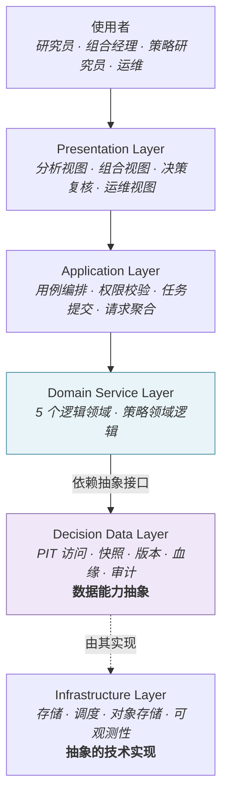

### 4.2 各层职责

| 层 | 职责 | 不承担 |
|---|---|---|
| **Presentation** | 呈现分析结果、组合状态、决策方案与解释链 | 任何业务规则判断 |
| **Application** | 用例编排、权限校验、计算任务提交与状态查询、跨领域请求聚合 | 领域计算 |
| **Domain Service** | **领域业务规则**与策略计算——链路 10 个 Stage 的实现 | 展示逻辑、存储实现 |
| **Decision Data** | 时点感知的数据访问、快照留存、版本管理、血缘与审计记录 | **投资策略规则** |
| **Infrastructure** | 存储、调度、可观测性等技术能力 | 业务语义 |

### 4.3 Decision Data Layer 的定位

> 它不是普通的 "Data Access Layer"，而是**决策上下文的承载层**。

| 承载能力 | 说明 |
|---|---|
| **PIT 访问** | 强制按 `available_at ≤ decision_at` 过滤（§7.4） |
| **Snapshot** | Peer Group / Universe / Decision / Backtest 快照 |
| **Version** | 九项 Strategy Version + Data Version 的解析与固化（§8） |
| **Lineage** | 数据从哪来 |
| **Audit** | 决策由谁、何时、基于什么版本做出 |

### 4.4 抽象层与实现层的关系

> Decision Data Layer 与 Infrastructure Layer **不是调用链上的两级**，而是**抽象与实现**的关系。

```
Domain Service  →  依赖  →  Decision Data 抽象接口
                                    ↑
                                 由其实现
                                    │
                            Infrastructure（存储 / 调度 / 对象存储）
```

**架构含义**：领域服务依赖的是**接口语义**（"给我 T 时点可见的净值序列"），而非具体存储能力。这是 §7.4 PIT 强制机制能够成立的前提——若领域服务直接依赖存储，就无法在中间强制注入时点过滤。

### 4.5 领域业务规则的集中

> **领域业务规则**集中在 Domain Service Layer。

需要区分三类规则，它们**不都属于 Domain**：

| 规则类型 | 归属层 | 举例 |
|---|---|---|
| **投资策略规则** | Domain Service | 什么样的基金进 Universe、权重如何求解 |
| **权限规则** | Application | 谁可以 Approve / Override |
| **数据质量与时点规则** | Decision Data | 什么数据可见、什么数据需隔离 |

Presentation 与 Application 层**不得**包含投资策略判断——否则规则会分散到无法版本化、无法回测的地方，直接破坏可复现性（`NFR-REPRO-001`）。

---

## 5. System Context

### 5.1 系统与外部世界

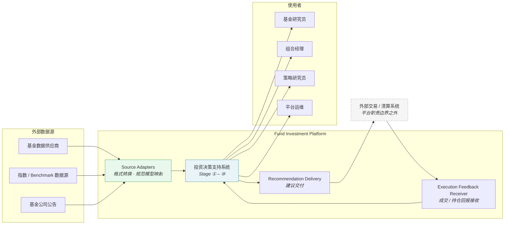

### 5.2 Adapter 层的必要性

> **外部格式不得穿透到领域层**——这条原则必须有对应的组件承载。

`Source Adapters` 负责协议与格式转换、字段映射到规范模型、打上 `available_at`。它**不负责**业务规则判断与数据质量分级（后者属 `data-service`）。详见 `02-architecture/04-integration-architecture` §2。

### 5.3 执行边界：交付而非调用

> **平台产生 Recommendation；Recommendation 如何被外部执行系统接收，属于集成边界，而非平台的交易能力。**

```
✅  Platform → Recommendation Delivery → External Execution System
❌  Platform → Trading API → 券商
```

| 方向 | 内容 | 架构含义 |
|---|---|---|
| **出站** | `Rebalancing Recommendation`（买卖清单与目标权重） | **单向交付**，不等待执行结果作为流程前提 |
| **入站** | 成交（Fill）或持仓状态 | `Actual Portfolio` 的唯一权威来源（§12） |

> **平台不提供**下单、券商对接、自动交易能力（上游 §6.2、`FR-LIVE-001` BR-4）。

---

## 6. Business-to-System Mapping

### 6.1 Stage / Concept / Output 三层结构

本文档沿用上游 §4.0 定义的三层结构，**不新增编号体系**：

| 层级 | 数量 | 是否占 Stage 编号 | 举例 |
|---|---|---|---|
| **Stage** | 恰好 10 个 | 是 | ⑦ Portfolio Optimization |
| **Concept** | 不固定 | **否** | ⑦-R Post-Optimization Risk、⑤-A Return Estimate |
| **Output** | 不固定 | **否** | Proposed Investment Decision |

> **不存在 "⑦-O"**。`Proposed Investment Decision` 是 Stage ⑦ 的 Output，不占编号。

### 6.2 10 个 Stage 到系统组件

| Stage | 业务阶段 | Domain Service | 主要产出 |
|---|---|---|---|
| ① | Fund Data | `data-service` | 标准化基金数据（含 PIT 三元时点） |
| ② | Factor | `factor-service` | 因子值矩阵、标准化暴露 |
| ③ | Fund Score | `fund-service` | 综合得分 + 五个子分 + 归因 |
| ④ | Fund Universe | `fund-service` | 候选基金集合 + 快照 |
| ⑤-A | Return Estimate | `portfolio-service` | 收益估计向量 `μ` |
| ⑤-B | Risk / Correlation | `portfolio-service` | `σ`、`ρ`、`Σ`、回撤指标 |
| ⑥ | Portfolio Construction | `portfolio-service` | 目标函数 + 约束集 + 风险预算 |
| ⑦ | Portfolio Optimization | `portfolio-service` | 目标权重 `w` + 求解诊断 |
| ⑦-R | Post-Optimization Risk | `portfolio-service` | `σ_p`、MRC、TRC、集中度 |
| ⑦ Output | Proposed Investment Decision | `portfolio-service` | 待复核的目标组合 |
| ⑧ | Backtest | `backtest-service` | 回测结果与归因（**编排，非重新实现**） |
| ⑨ | Live Portfolio | `portfolio-service` | 实盘组合状态（三态，见 §12） |
| ⑩ | Rebalancing | `portfolio-service` | 调仓建议 |

### 6.3 Backtest 的双重身份

> Backtest 在**业务链路**中编号为 Stage ⑧，但在**系统架构**中是**横向的执行运行时与验证能力**，而非投资决策流程中的一步。

```
业务视角（上游定义，不修改）：    … → ⑦ → ⑧ Backtest → ⑨ Live → ⑩

架构视角（本文档）：
                    Strategy Domain Logic
                   /                     \
          Backtest Runtime          Live Runtime
          （历史时间轴·验证）        （真实时间轴·执行）
```

**为什么要区分**：把 Backtest 当作"决策流程的第八步"会导出错误设计——如"先回测再实盘"的串行依赖。实际上它与 Live 是同一套逻辑的两种运行模式，可以并行、可以独立运行（见 §11）。

> 本文档**不修改**上游的业务 Stage 编号，只补充其架构定位。

### 6.4 Peer Group 的归属与依赖约束

`Peer Group` 归 **`fund-service`**。

> **架构上必须保证 `Peer Group` 的构建不读取 `Fund Score` 与 `Fund Universe`**——否则形成 `Score → Universe → Peer Group → Score` 的循环依赖，结果不唯一且不可复现（`FR-PEER-001` BR-1）。

这不是编码规范，而是**组件依赖方向的约束**：`fund-service` 内部，Peer Group 构建模块只依赖 `data-service` 提供的分类数据，不依赖同服务内的评分模块。调用时序见 `02-architecture/04-integration-architecture` §3.3。

### 6.5 Eligibility：事实与规则的分离

> **`Investment Eligibility`（可投资性事实）与 `Eligibility Rules`（策略准入规则）是两个不同的概念，归属不同的 Domain Service。**

| | `Investment Eligibility` | `Eligibility Rules` |
|---|---|---|
| **性质** | **客观事实**——基金当前能否被交易 | **策略规则**——本策略要什么样的基金 |
| **来源** | 生命周期状态、申赎限制公告、流动性指标 | 策略配置（规模区间、成立年限、经理任职、Score 阈值） |
| **归属** | `data-service` | `fund-service` |
| **取值/形式** | FULLY_ELIGIBLE / HOLD_ONLY / LIMITED / EXIT_ONLY / NOT_TRADABLE | 版本化的规则集 |
| **是否含投资观点** | **否** | **是** |
| **是否随策略变化** | 否——同一时点对所有策略相同 | 是——每个策略可不同 |

**两者的关系**：

```
data-service  →  Investment Eligibility（事实）
                          ↓  作为一项准入条件输入
fund-service  →  Eligibility Rules（规则）  →  Fund Universe（准入结果）
```

> **关键**：`Investment Eligibility` 是 `Eligibility Rules` 的**输入之一**，不是它的同义词。前者回答"这只基金能不能买"，后者回答"这个策略要不要它"。

### 6.6 Eligibility 不参与评分

> **`Investment Eligibility` 参与 `Fund Universe` 准入，不参与 `Fund Score` 计算。**

| 环节 | 是否使用 Eligibility |
|---|---|
| Peer Group 构建 | **否**——暂停申购的基金仍参与评价 |
| Fund Score 计算 | **否** |
| Fund Universe 准入 | **是**——作为硬性准入条件 |
| 建仓 / 调仓校验 | **是** |

**理由**：可投资性是**交易约束**，不是**基金质量**。把它混入评分会让"暂时不可买"被错误地表达为"基金不好"，且该基金恢复申购后评分会突变——评分失去时间可比性。

---

## 7. Logical Architecture

### 7.1 组件全景

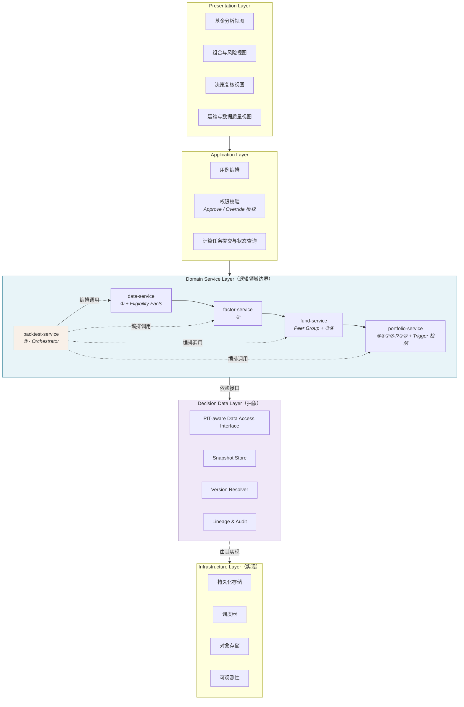

### 7.2 五个 Domain Service 的职责边界

| Service | 负责 | **不负责** |
|---|---|---|
| `data-service` | Fund Data 采集、标准化、数据质量、Benchmark 数据、PIT 版本管理、**Investment Eligibility 事实判定** | Factor、Score、Portfolio |
| `factor-service` | Factor 计算、标准化、Rolling Factor、Factor Validation、Factor 版本 | Fund Score、多因子合成、Portfolio |
| `fund-service` | Peer Group、Fund Score、Ranking、Tiering、**Eligibility Rules**、Fund Universe 及快照 | Return Estimate、Risk、Portfolio Weight |
| `portfolio-service` | Return Estimate、Risk / Correlation、Construction、Optimization、Post-Opt Risk、Live Portfolio、Rebalancing、**Trigger 检测** | Fund Data、Factor、Fund Score |
| `backtest-service` | Backtest 编排、历史时钟、结果收集与报告 | **另一套策略实现** |

> **`prediction-service` 不得重新引入。** Return / Risk / Correlation 已并入 `portfolio-service`（上游 v2.0 决策）。

### 7.3 `portfolio-service` 的内部模块

`portfolio-service` 承载 6 个 Stage，必须在**逻辑上模块化**，避免退化为单一巨大实现：

```
portfolio-service
├── return-estimation        ⑤-A  收益估计
├── risk-analysis            ⑤-B  波动率 · 下行风险 · 回撤
├── correlation-covariance   ⑤-B  相关性 · 协方差 · 可用性检查
├── portfolio-construction   ⑥    目标函数 + 约束集 + 风险预算装配
├── portfolio-optimization   ⑦    权重求解
├── post-optimization-risk   ⑦-R  σ_p · MRC · TRC · 集中度
├── live-portfolio           ⑨    实盘状态维护（三态，见 §12）
├── rebalancing              ⑩    调仓建议生成
└── trigger-detection        ⑩    Drift / Constraint Breach 检测（见 §9.4）
```

> **模块边界 ≠ Service 边界。** 这些模块共享 `portfolio-service` 的一致性边界与写入权，但在代码组织上必须保持清晰的接口与单向依赖。详见 `02-architecture/02-service-architecture` §6.2。

### 7.4 PIT 强制访问约束

> **这是本架构最重要的一条访问控制约束。**

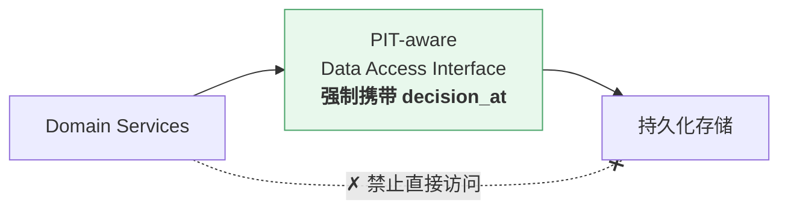

**架构约束**：

| # | 约束 |
|---|---|
| **PIT-A1** | **Domain Service 不得直接访问时点敏感的原始数据**——全部历史数据必须通过 PIT-aware Data Access Interface 获取 |
| **PIT-A2** | 该接口的**每次调用必须携带 `decision_at`**；缺失时**拒绝**，而非默认取当前时间 |
| **PIT-A3** | 不存在"取最新一条"的无约束访问路径 |
| **PIT-A4** | 实时场景（Live Portfolio 当前状态）使用**显式的当前视图接口**，与历史视图在接口层面区分 |

> **为什么必须做成接口约束而非编码规范**：若只写"记得加时点条件"，任何一处遗漏都会造成静默前视偏差——它不报错、不影响流程，且在净值曲线上完全看不出来。这是回测失真最隐蔽的来源。**原则必须有承载它的组件，否则只是口号。**

具体的接口语义与实现要求见 `02-architecture/03-data-architecture` §5.4。

---

## 8. Versioning Model

> 本文档多处引用"九项 Strategy Version"，此处给出完整定义，并厘清三类版本的关系。

### 8.1 五类版本

> **v2.4 变更**：由四类扩为五类 —— 新增 `Policy Version`。见 §8.5。

| 版本类型 | 含义 | 谁产生 |
|---|---|---|
| **Data Version** | 输入数据的时点与版本状态——由 `decision_at` 加 PIT 规则**唯一确定** | 数据层 |
| **Strategy Version** | 算法与**规则配置**的版本组合（九项，见 §8.2） | 各 Domain Service |
| **Policy Version** | **评价与判定标准**的版本组合（五子项，见 §8.2.1） | 各 Domain Service |
| **Code Version** | **实现代码**的版本：Strategy Library、优化求解器、数值计算库 | 工程发布 |
| **Execution Context** | 本次执行的运行参数（`decision_at`、`data_as_of`、回测区间、初始资金等） | 触发方 |

**可复现性公式**：

```
Data Version  +  Strategy Version（九项）  +  Policy Version（五子项）
              +  Code Version  +  Execution Context
                            ↓
                完全相同的结果（在既定数值容差内）
```

> **Strategy Version 与 Policy Version 的分界**：前者回答**「怎么算、选什么」**（口径、权重、约束、触发条件），后者回答**「拿什么当标准」**（MAR、Percentile 约定、Tier 阈值、各类 Gate 门槛）。
>
> 二者都满足「变了则相同输入产生不同输出」，但**变更审批路径不同** —— Strategy 变更是策略调整，Policy 变更是评价标准调整，须由评价治理方而非策略负责人批准。合并计数会让后者的审批伪装成前者。

> **为什么 Code Version 是独立的一类**：九项 Strategy Version 记录的是**规则与配置**（用哪些因子、什么权重、什么约束）。但相同配置在不同实现下会产出不同数值——策略库的算法实现变更、求解器版本升级、数值库的 BLAS 后端差异都会改变结果。
>
> 该要素此前被当作"隐含依赖"，**隐含依赖无法在快照中查询，也无法在复现时校验**，因此必须显式化。组成与要求见 `06-technology-stack` §5.4。

> **注意**：策略的可配置参数（评分权重、约束阈值、风险预算等）**已包含在九项之内**，不是独立类别。本文档不使用"Configuration Version"这一表述，避免与九项重复计数。

### 8.2 Strategy Version 的九项组成

| # | 版本项 | 内容 | Owner |
|---|---|---|---|
| 1 | **Metric Version** | Factor 计算口径与公式 | `factor-service` |
| 2 | **Peer Group / Classification Version** | 分组规则与分类映射 | `fund-service` |
| 3 | **Eligibility / Universe Version** | 准入规则与 Universe 构成策略 | `fund-service` |
| 4 | **Scoring Version** | 指标集合 + 权重 + 标准化 + Preference Direction + 缺失处理 | `fund-service` |
| 5 | **Return Estimate Version** | 估计方法与 Window / Horizon / Basis 三口径 | `portfolio-service` |
| 6 | **Risk Model Version** | 风险与协方差估计方法、收缩规则 | `portfolio-service` |
| 7 | **Portfolio Rule Version** | 目标函数 / 权重规则 + 约束集 + 风险预算 + 求解器版本 | `portfolio-service` |
| 8 | **Rebalance Rule Version** | 触发条件 + 重算范围 + 四个调仓阈值 | `portfolio-service` |
| 9 | **Benchmark Version** | Fund / Portfolio Benchmark 映射规则 | `data-service` |

> **判定标准**：任何一项变化会导致相同输入产生不同输出的配置，都必须属于 Strategy Version（`02-business-requirements` §23.1）。

### 8.2.1 Policy Version 的五个子项（v2.4 新增）

> 定案见 `02-business-requirements` §23.1.1 与 `TBD-resolution.md` Policy ⑧。

| # | 子项 | 内容 | Owner |
|---|---|---|---|
| 1 | **`evaluation_policy`** | MAR、评价周期、评价准入条件 | `fund-service` |
| 2 | **`ranking_policy`** | Percentile 约定、Tie Method、有效参与数口径 | `fund-service` |
| 3 | **`classification_policy`** | `Fund Tier` 阈值与边界约定 | `fund-service` |
| 4 | **`estimation_policy`** | 估计框架选择与方法参数（Window / Horizon / 收缩强度等） | `portfolio-service` |
| 5 | **`validation_policy`** | 各类 Gate 阈值：因子校验、估计校验、回测证据门槛 | 各 Owner Service |

**三条规则**：

| # | 规则 |
|---|---|
| 1 | `Policy Version` 是五个子项的**版本组合引用**，与 `Strategy Version` 同构 —— 不存在集中的 Policy 服务 |
| 2 | 五个子项**各自独立版本化**，任一子项变更只升该子项，`Policy Version` 的组合引用随之更新 |
| 3 | **决策快照必须同时引用 `Strategy Version` 与 `Policy Version`** —— 缺任一则该决策不可复现 |

> **与 Metric Version 的边界**：`evaluation_policy` 变更（如 MAR 由 0% 改为 2%）会改变 Sortino 的**值**，但**不升 Metric Version** —— 因子口径没变，变的是评价标准。这一分界由 `04-factor/06-factor-versioning` §4.3 确立，本节沿用。

### 8.3 版本的分域拥有与组合引用

九项由各自的 Owner 维护，**不存在集中的配置服务**。`Strategy Version` 是这九项的**版本组合引用**，在执行时由 `portfolio-service`（实盘）或 `backtest-service`（回测）固化到决策快照中。

`Policy Version` 的五个子项同理 —— 由各自 Owner 维护，执行时一并固化到同一份决策快照。两个组合引用在快照中是**并列的两个字段**，不嵌套、不合并。

### 8.4 版本变更的语义

| 级别 | 含义 | 历史结果可比性 |
|---|---|---|
| **Major** | 业务逻辑变化 | **不可直接比较**，须重新完整回测并重走审批 |
| **Minor** | 新增可选能力，不改变既有行为 | 可比较，需回归验证 |
| **Patch** | 非业务性修复 | 可比较 |

### 8.5 缺口关闭：Policy Version 已定案 ✅

> **v2.1 登记 → v2.2 扩大 → v2.4 定案**。定案见 `02-business-requirements` §23.1.1 与 `TBD-resolution.md` Policy ⑧。

**原问题**：上游 v2.5 §5.5 确立 `MAR` 属 `Evaluation Policy` 后，暴露出九项 Strategy Version 无法容纳它 ——

```
MAR 影响 Sortino / Downside Volatility 的【Factor 值本身】
    → 发生在 Scoring 之前，不属第 4 项 Scoring Version
    → 不是因子口径，不属第 1 项 Metric Version（04-factor/06-factor-versioning §4.3）
    → 九项中无处安放
```

v2.2 进一步发现 `Ranking Policy` 与 `Classification Policy` 是同一类问题；`07-return-risk` 与各域的 Validation Gate 阈值同样如此。**后果一致**：这些变更不进决策快照的 `strategy_version`，依赖它们的决策无法从快照复现，违反原则六。

**定案**：采纳原方案 A 的变体 —— **不新增第 10、11、12 项，而是新增统一的第 10 类 `Policy Version`**，五个子项见 §8.2.1。

| 原候选 | 处置 |
|---|---|
| A（新增第 10 项 `Evaluation Policy Version`） | **部分采纳** —— 方向正确，但逐项追加会让九项膨胀为十二项以上；改为归入统一的第 10 **类** |
| B（并入第 1 项 `Metric Version`） | **否决** —— 与 `04-factor/06-factor-versioning` §4.3 直接冲突，会让评价标准变更混入因子口径变更，治理责任方错位 |
| C（并入第 2 项 `Peer Group / Classification Version`） | **否决** —— 会使 Raw Factor 依赖 Peer Group Version，破坏 `04-factor/05-factor-normalization` 确立的「Raw 独立于 Peer Group、Normalized 才依赖」分层 |

**为什么是「一类」而不是「若干项」**：九项 Strategy Version 是**同质**的 —— 每项都回答「算法与规则怎么配」。五个 Policy 也是同质的 —— 每项都回答「拿什么当判定标准」。**两组之间异质**，混在一个列表里会让「九项」这个已在全库 20+ 处引用的表述失去稳定性；分为两类则九项不变，只新增一个并列概念。

**级联影响**：

| 位置 | 变更 |
|---|---|
| §8.1 | 四类版本 → **五类** |
| §8.2.1 | 新增，定义五个子项 |
| §8.3 | 快照中 `strategy_version` 与 `policy_version` 是**并列两个字段** |
| `11-database` | `governance.policy_version` 表由「兜底可追溯性」升为**决策快照的正式外键来源** |
| `05-fund-evaluation` / `07-return-risk` / `10-api` | 各自登记的「某某 Policy 不在九项之内」缺口一并关闭 |

> **原 `TBD-ARCH-16` 已关闭。**

---
## 9. Main Data Flow

### 9.1 主链路数据流

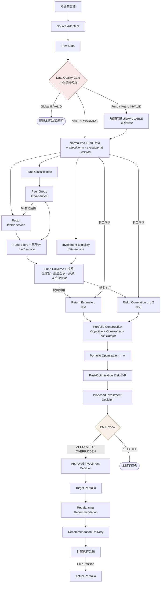

### 9.2 Rebalance Trigger 的分支重算

> Trigger **不统一回到 Fund Universe**——重算范围由触发类型决定。

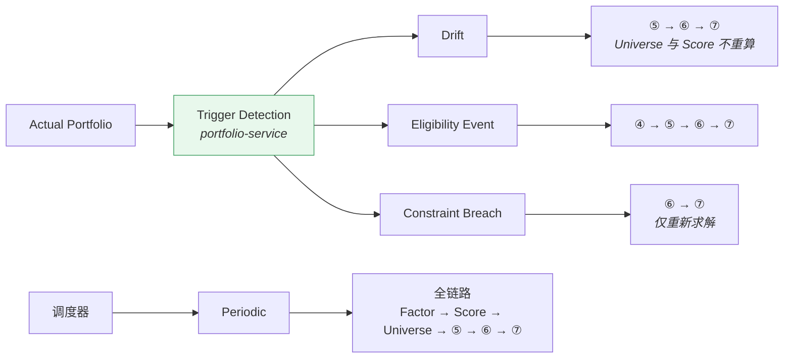

**触发源与检测归属**：

| 触发类型 | 检测者 | 检测依据 |
|---|---|---|
| **Periodic** | 调度器 | 调仓周期到期 |
| **Drift** | `portfolio-service` · trigger-detection | 实际权重 vs 目标权重偏离超阈值 |
| **Eligibility Event** | `portfolio-service` · trigger-detection | 成分基金的 `Investment Eligibility` 状态变化 |
| **Constraint Breach** | `portfolio-service` · trigger-detection | 组合风险指标触碰约束上限 |

> 重算深度**不得在运行时动态调整**——触发类型是流水线的入参，不由各阶段自行判断（`FR-REBAL-001` BR-2）。

### 9.3 Fund Score 如何到达 Portfolio Construction

> **这是最容易被误读为反向依赖的一处，必须明确。**

`Score Weight` 等确定性权重规则需要 Score 值。传递路径是：

```
fund-service 计算 Fund Score
        ↓  写入 Fund Universe 快照（快照本身含评分与子分）
Fund Universe Snapshot
        ↓  portfolio-service 读取快照
Portfolio Construction 使用快照中的 Score 作为权重映射输入
```

**架构约束**：

| # | 约束 |
|---|---|
| SC-1 | `portfolio-service` **通过 Universe 快照获取 Score**，**不反向调用 `fund-service`** |
| SC-2 | 依赖方向保持单向：`fund-service → portfolio-service` |
| SC-3 | Score 在快照中是**已固化的历史值**，与该次决策的 `decision_at` 绑定，不会因后续重算而改变 |
| SC-4 | **`Fund Score` 不得进入 `Return Estimate` 的计算**（见 §9.4）——两者是不同的用途 |

> **允许与禁止的区分不在"能否读取 Score"，而在"用它做什么"**：作为显式声明的权重映射规则允许；作为收益率代入优化器的 `μ` 严禁。

### 9.4 Return Estimate 的输入契约

> 为保证 `Return Estimate` 与 `Fund Score` 在系统层面独立演进，必须约束其输入。

| 允许消费 | **禁止消费** |
|---|---|
| 基金历史收益序列（复权净值） | **`Fund Score` 及五个子分** |
| Benchmark 收益序列 | **Ranking / Percentile / Fund Tier** |
| 无风险利率 | **Universe 内的评分排序** |
| 基金客观特征（规模、费率、分类） | 任何由评分派生的量 |
| `Fund Universe` 成员列表（确定估计范围） | —— |

**架构含义**：`portfolio-service` 的 `return-estimation` 模块**不依赖 `factor-service`，也不读取 Universe 快照中的评分字段**——它只使用成员列表来确定估计范围。这是原则三在组件层面的落地。

### 9.5 三条数据流约束小结

**① `Fund Score` 的用途边界**

```
Fund Score ──→ Fund Universe                    ✅ 筛选/排序
Fund Score ──→ Construction 的权重映射规则        ✅ 经 Universe 快照传递（§9.3）
Fund Score ──→ Return Estimate 的计算            ❌ 严禁（§9.4）
Fund Score ──→ Optimizer 的 μ 输入               ❌ 严禁
```

**② `Peer Group` 不接受下游输入**

```
Fund Classification ──→ Peer Group    ✅
Fund Score / Universe ──→ Peer Group   ❌ 循环依赖
```

**③ 事前风险与事后风险分处不同阶段**

```
Stage ⑤-B  σ · ρ · Σ · 回撤        不依赖权重  ✅
Stage ⑦-R  σ_p · MRC · TRC · HHI   依赖权重 w  ✅
```

Risk Contribution 与 Concentration **不得**在 Stage ⑤ 产出——在 `w` 求出之前它们在数学上不存在。

### 9.6 数据质量的分层责任

> **Data Quality Gate 不是全系统所有质量检查的总入口。** 各层承担各自的校验责任：

| 层 | 检查内容 | 责任方 |
|---|---|---|
| **Source Data Quality** | 数据到达、格式、完整性、多源一致性 | `data-service` |
| **Normalized Data Quality** | 口径正确性、异常值、时点完整性 | `data-service` |
| **Factor Validation** | 因子值合理性、IC / 分层单调性 | `factor-service` |
| **Score / Universe Validation** | Data Completeness、Universe 规模异常 | `fund-service` |
| **Portfolio Input Validation** | 协方差可用性（正定性、样本充足） | `portfolio-service` |
| **Optimization Feasibility** | 约束集是否可行 | `portfolio-service` |

> 若把全部质量规则塞进 `data-service`，它会退化为一个巨大的规则中心，且下游无法对自己的输入负责。

---

## 10. Decision Execution & Consistency

> **本章回答一个此前未被闭合的问题：一次投资决策在系统中究竟是什么？它的一致性边界在哪里？**

### 10.1 Decision Execution Context

一次决策执行由一个**显式的执行上下文**贯穿全程：

| 字段 | 含义 |
|---|---|
| `decision_id` | 本次决策的唯一标识 |
| `decision_at` | 决策时点——**驱动全部 PIT 过滤** |
| `data_as_of` | 数据截止时点（第一阶段 = `decision_at`） |
| `strategy_version` | 九项版本的组合引用（§8.2） |
| `trigger_type` | Periodic / Drift / Eligibility Event / Constraint Breach |
| `recompute_scope` | 由 `trigger_type` 决定的重算范围（§9.2） |
| `runtime_mode` | `LIVE` / `BACKTEST` |

**架构含义**：

| # | 要求 |
|---|---|
| DEC-1 | 执行上下文在链路起点创建，**贯穿全部阶段**，不在中途重新生成 |
| DEC-2 | `decision_at` 由上下文提供，**领域服务不自行获取当前时间** |
| DEC-3 | 上下文本身随决策快照落库——它是复现该次决策的入口 |

### 10.2 决策执行与一致性架构

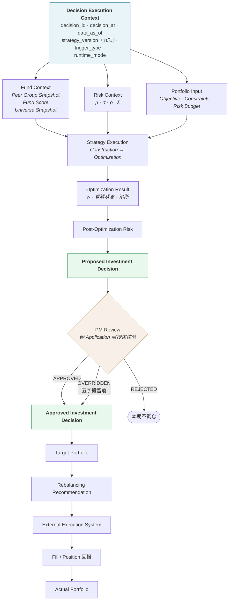

### 10.3 一致性边界

> **上游 §8.4 要求：决策快照必须处于同一个一致性边界内，能够在单一事务中完整写入。**
>
> 本节说明该要求在 5 个 Domain Service 的架构下**如何成立**。

**前提**：5 个 Domain Service 是**逻辑边界**，第一阶段**共享同一个数据库实例**（§3.2、`06-technology-stack` §4）。因此跨 Domain Service 的写入仍在同一事务管理器下，"单一事务"是可实现的。

**三级一致性边界**：

| 边界 | 范围 | 原子性要求 | 写入者 |
|---|---|---|---|
| **B1 · Peer Group Snapshot** | 组成员 + 所用分类版本 | 原子 | `fund-service` |
| **B2 · Universe Snapshot** | 成员 + 规则版本 + 评分版本 + 评分与子分 + 入出池原因 + Data Completeness + 可投资性 | 原子 | `fund-service` |
| **B3 · Decision Snapshot** | 见 §10.4 | **原子** | `portfolio-service` |

**边界之间的关系**：

```
B1 (Peer Group Snapshot)   ← 原子写入，产生快照 ID
        ↓  被引用
B2 (Universe Snapshot)     ← 原子写入，引用 B1 的快照 ID
        ↓  被引用
B3 (Decision Snapshot)     ← 原子写入，引用 B2 的快照 ID + 本阶段全部产出
```

> **关键设计**：B3 **不复制** B1/B2 的内容，而是**引用其快照 ID**。因此 B3 的事务只需覆盖 `portfolio-service` 自己产生的数据 + 若干引用键——这使"单一事务"在实践中既可行又轻量。
>
> 三个边界各自原子，且按顺序依赖。任一边界写入失败，其下游边界不会产生——链条自然中断，不存在"半个决策"。

### 10.4 Decision Snapshot 的最小闭包

> **决策快照必须是一个闭包（closed snapshot）：包含全部影响该次决策结果的输入版本引用，而不仅仅是最终权重。**

| 类别 | 内容 |
|---|---|
| **执行上下文** | `decision_id`、`decision_at`、`data_as_of`、`trigger_type`、`recompute_scope`、`runtime_mode` |
| **版本引用** | 九项 Strategy Version + Data Version + **Code Version**（策略库 / 求解器 / 数值库） |
| **上游快照引用** | Peer Group Snapshot ID、Universe Snapshot ID |
| **本阶段输入** | Return Estimate（`μ` + 三项口径）、Risk Metrics、Correlation Matrix、Covariance Matrix |
| **问题定义** | Constraint Set、Risk Budget、Optimization Objective |
| **求解记录** | Optimization Run（输入 · 状态 · 输出 · 诊断） |
| **事后风险** | Post-Optimization Risk（`σ_p` · MRC · TRC · 集中度） |
| **决策产出** | Target Weight、Decision Status |
| **人工环节** | Reviewer、Review Time、Decision、Original Proposal、Override Value、Override Reason、Comment |

**闭包判定标准**：

> 给定该快照，**不依赖任何当前系统状态**，即可完整回答"这个决策是如何得出的"，并在相同版本下重跑得到一致结果。

若某项输入既不在快照中、也无法通过快照中的版本引用唯一定位，则该快照**不是闭包**，不满足 `NFR-REPRO-001`。

### 10.5 两类状态：Decision Status 与 Execution Status

> **必须区分两个不同维度的状态。** 混为一个枚举会让业务状态被技术故障污染。

#### 10.5.1 Decision Status（业务状态 · 上游定义）

由上游 `01-product/02-business-requirements` §27.1 定义，**架构层不得扩展**：

| 状态 | 含义 | 后续 |
|---|---|---|
| `PROPOSED` | 已产出，待复核 | → APPROVED / REJECTED / OVERRIDDEN / EXPIRED |
| `APPROVED` | 原样批准 | → 生成 Recommendation |
| `OVERRIDDEN` | 人工修改权重后批准（五字段留痕） | → 生成 Recommendation |
| `REJECTED` | 复核不通过，本期不调仓 | 终止 |
| `INFEASIBLE` | **优化不可行**——约束冲突无解，未产出可执行决策 | → 人工处理流程 |
| `EXPIRED` | PROPOSED 超期未处理 | 终止 |
| `SUPERSEDED` | 被更新的决策取代 | 终止 |

#### 10.5.2 Execution Status（执行状态 · 架构层）

一次决策执行（Calculation Job，§10.7）的技术状态。**这是架构层新增的维度，不修改上游的业务枚举**：

| 状态 | 含义 | 是否产生 Decision |
|---|---|---|
| `RUNNING` | 链路执行中 | 尚未产生 |
| `COMPLETED` | 执行完成 | **产生** `PROPOSED` 或 `INFEASIBLE` |
| `BLOCKED` | Global 级数据质量阻断 | **不产生任何 Decision** |
| `FAILED` | 系统故障（计算异常、超时） | **不产生任何 Decision** |
| `CANCELLED` | 人工中止 | 不产生 |

#### 10.5.3 两者的关系

```
Execution Status = RUNNING
        │
   ┌────┴──────┬───────────┬───────────┐
   ▼           ▼           ▼           ▼
COMPLETED   BLOCKED     FAILED    CANCELLED
   │           │           │           │
   ▼           ▼           ▼           ▼
产生 Decision  无 Decision  无 Decision  无 Decision
PROPOSED
或 INFEASIBLE
```

> **关键**：`BLOCKED` 与 `FAILED` **不是** Decision Status——它们表示"本次执行没有产生决策"，而非"产生了一个失败的决策"。若把它们塞进 Decision Status，"本期产生了几次决策"这类统计会失去意义，且 Decision 的审计链会混入无决策的执行记录。

#### 10.5.4 四类"未产出可执行决策"的处理差异

| 情形 | 状态表达 | 重试 | 处理 |
|---|---|---|---|
| **优化不可行** | Execution `COMPLETED` + Decision `INFEASIBLE` | ❌ | 人工调整约束 / Universe / 沿用上期 / 中止 |
| **数据阻断** | Execution `BLOCKED`，无 Decision | ❌ | 修复数据后重跑 / 跳过本期 |
| **系统故障** | Execution `FAILED`，无 Decision | ✅ | 幂等重试 |
| **人工拒绝** | Execution `COMPLETED` + Decision `REJECTED` | ❌ | 终止，记录理由 |

> 把 `INFEASIBLE` 当作 `FAILED` 自动重试，会掩盖"约束设置过紧"这一真实问题并浪费计算资源。二者分属不同维度，不应混淆。

### 10.6 Human Review 的架构位置

```
Application Layer  →  授权校验（谁可以 Approve / Override）
                              ↓
portfolio-service  →  Review 记录写入（属 B3 一致性边界）
```

| # | 要求 |
|---|---|
| HR-1 | **授权判断属 Application 层**（`NFR-SEC-001`：Approve / Reject / Override 仅限 Portfolio Manager 角色） |
| HR-2 | **Review 记录属决策快照**——含 Reviewer、Review Time、Decision、Original Proposal、Override Value、Override Reason |
| HR-3 | `OVERRIDDEN` 必须**同时保存系统建议与人工修改后的结果**——否则无法回答"系统算出 12%，为什么最后是 7%" |
| HR-4 | 策略配置权与决策放行权**必须分离**——同一人不应既定规则又批准其产出（`NFR-SEC-001` SEC-2） |

### 10.7 异步计算模型

链路中的重负载阶段以**任务**形式执行，而非同步请求：

```
Interactive Request / Trigger
        ↓
Application Layer  →  提交 Calculation Job
        ↓
Job（execution_id · 状态 · 进度 · 幂等键）
        ↓
Domain Calculation
        ↓
Result Snapshot
```

| 要素 | 说明 |
|---|---|
| `execution_id` | 任务唯一标识，关联 `decision_id` |
| **幂等键** | `(decision_at, strategy_version, recompute_scope)`——重复提交不产生重复结果 |
| 状态与进度 | 可查询；长任务（回测）必须支持进度上报 |
| 失败定位 | 部分失败可定位到具体对象（基金 × 指标 × 阶段） |

> 详细的任务编排、重试与失败处理见 `02-architecture/04-integration-architecture` §4。

---
## 11. Backtest Architecture

### 11.1 Backtest 是 Runtime，不是流程步骤

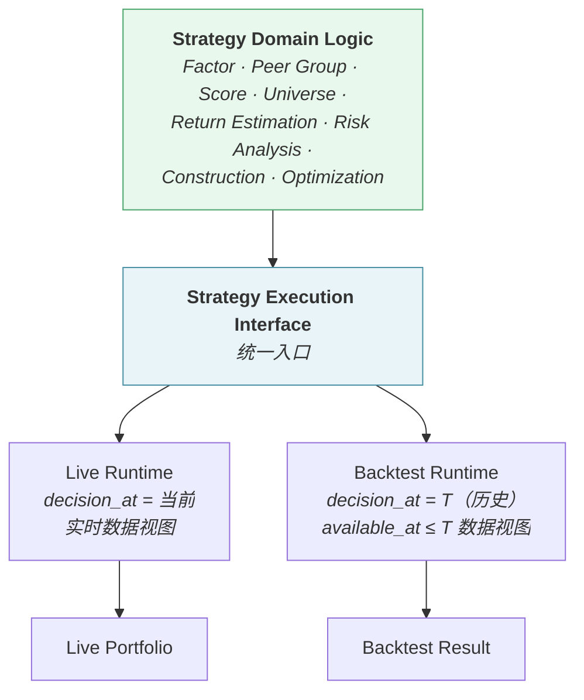

### 11.2 Strategy Execution Interface（逻辑接口边界）

> 本文档**不规定技术形态**（共享库 / 共享服务），但必须定义**逻辑接口边界**——否则后续实现可能退化为"回测通过网络调用实时服务"，从而破坏 PIT 与历史时钟。

```
Strategy Execution Interface

  Input:
    ├── Decision Execution Context   （decision_id · decision_at · runtime_mode）
    ├── Data Context                 （PIT-aware Data Access Interface 实例）
    ├── Strategy Version             （九项）
    └── Recompute Scope              （由 trigger_type 决定）

  Output:
    └── Decision Snapshot            （§10.4 定义的闭包）
```

**接口约束**：

| # | 约束 |
|---|---|
| SEI-1 | 领域逻辑**只通过注入的 Data Context 访问数据**，不自行建立数据连接 |
| SEI-2 | 领域逻辑**不感知 `runtime_mode`**——它不知道自己运行在回测还是实盘 |
| SEI-3 | 领域逻辑中**不得存在**任何"是否回测"的策略分支 |
| SEI-4 | Live 与 Backtest 的差异**全部体现在注入的参数上**（`decision_at` 与 Data Context），不在逻辑内部 |

> 技术承载形态（第一阶段选定共享库）见 `02-architecture/06-technology-stack` §9。

### 11.3 backtest-service 的编排循环

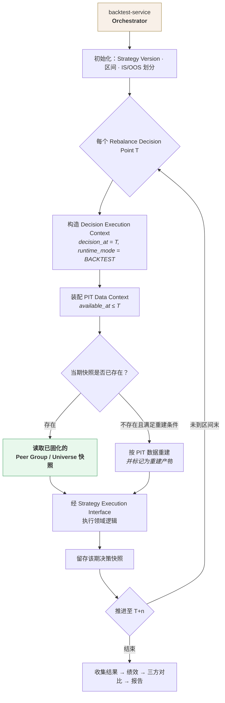

### 11.4 快照优先原则

> **回测优先读取当期已固化的 Peer Group / Universe 快照；仅在快照不存在且满足可重建条件时，才允许按 PIT 数据重建。**

| 场景 | 处理 | 理由 |
|---|---|---|
| 快照存在 | **直接读取** | 严格可复现；天然避免幸存者偏差 |
| 快照不存在，PIT 数据完整 | 重建，**并在结果中标记为"重建产物"** | 可用但可信度低于快照 |
| 快照不存在，PIT 数据不完整 | **中止回测并报告缺失时点** | 强行推算会引入不可见的偏差 |

**为什么快照优先**：重建依赖"所有上游历史数据都完整"这一前提。任一环节的历史数据缺失或被覆盖，重建结果就会与当时不同——而这种不同在结果中**不可见**。快照是当时状态的直接证据，重建是间接推断。

> 这条修正了早期版本中"回测调用 fund-service 构建 Peer Group"与"回测读取当时留存的快照"两种表述的不一致。

### 11.5 backtest-service 负责与不负责

| 负责 | 不负责 |
|---|---|
| 历史时钟控制（推进 Rebalance Decision Point） | 重新实现 Factor 计算 |
| 构造 Decision Execution Context 并注入 | 重新实现 Peer Group / Fund Score |
| 装配 PIT Data Context | 重新实现 Universe 构建 |
| 快照读取 / 受控重建 | 重新实现 Return Estimate / Risk |
| 逐期结果与快照收集 | 重新实现 Construction / Optimization |
| 绩效计算、三方对比、报告生成 | 产生任何实盘指令 |

**违反信号**：`backtest-service` 内出现因子公式、评分权重合成、优化目标函数的实现代码。

### 11.6 时间推进的单位

> `T+n` 中的 `n` **不是固定时间单位**，而是由 `Rebalance Trigger` 类型决定的**下一个 Rebalance Decision Point**。

因此回测中各期持有时长**不均等**——这是架构必须支持的特性，不是简化的等间隔循环。

### 11.7 三类偏差的架构防护点

| 偏差 | 架构防护 | 落点 |
|---|---|---|
| **Look-ahead** | PIT-aware Data Access Interface 强制过滤，领域服务无法绕过（§7.4） | Decision Data Layer |
| **Survivorship** | 快照优先原则——读当时的成员而非重新推算（§11.4） | Snapshot Store |
| **Tradability** | 建仓/加仓前校验 `Investment Eligibility` | `portfolio-service` |

---

## 12. Portfolio State Model

> **`Live Portfolio` 不是单一状态，而是三个必须区分的组合状态。**

### 12.1 三态定义

| 状态 | 含义 | 来源 | 何时变化 |
|---|---|---|---|
| **Target Portfolio** | 决策确定的**目标持仓与权重** | `Approved Investment Decision` | 每次决策生效时 |
| **Pending Execution** | 已交付执行但**尚未收到回报**的调整 | Rebalancing Recommendation 已交付、Fill 未回 | 交付后 / 回报到达前 |
| **Actual Portfolio** | **实际持仓与权重** | **外部执行系统的成交或持仓回报** | 收到回报时；净值波动导致权重持续漂移 |

### 12.2 三态的关系

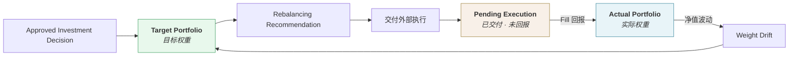

### 12.3 为什么必须三态分离

若用单一 "Live Portfolio" 同时表达三者，会产生以下问题：

| 问题 | 后果 |
|---|---|
| 回报延迟时"当前持仓"是什么？ | 若用目标权重冒充实际权重，**Drift 检测会得到错误结论**——刚下单就显示"零偏离" |
| 部分成交如何表达？ | 无法区分"已成交部分"与"待成交部分" |
| 风险计算用哪个权重？ | 事后组合风险必须基于 **Actual**，而约束校验基于 **Target** |
| 归因用哪个？ | Backtest-Live Deviation 必须对比 Actual 与回测预期 |

### 12.4 状态使用规则

| 用途 | 使用的状态 |
|---|---|
| Drift 检测（触发再平衡） | **Actual** vs **Target** |
| 事后组合风险（⑦-R 的实盘版） | **Actual** |
| 约束合规校验 | **Target**（决策时）+ **Actual**（持续监控） |
| Backtest-Live Deviation | **Actual** |
| 展示"当前持仓" | **Actual**，并标注是否存在 Pending |

> **回报缺失或延迟时**：`Actual Portfolio` 标记为**待确认**，Pending 部分显式呈现；**不得**以 Target 冒充 Actual（`FR-LIVE-001` BR-3）。

---

## 13. Threshold Resolution

> **v2.1 新增**（上游 v2.5 §5.5）。本章定义 `Risk-free Rate` 与 `MAR` 在架构上的解析路径。

### 13.1 为什么需要一个专门的解析器

> **两者都是 Factor 计算所需的"外部给定阈值"，但来源、Owner 与时点语义完全不同。**

| | `Risk-free Rate` | `MAR` |
|---|---|---|
| Owner | **`data-service`** | **`fund-service`** |
| 性质 | Market Reference Data（观测所得） | Evaluation Policy（配置而来） |
| 解析键 | `(currency, tenor, decision_at)` | `(fund_category, currency, decision_at, evaluation_policy_version)` |
| 选版规则 | `available_at ≤ decision_at` 的最大 `version`（**PIT**） | `effective_date ≤ decision_at` 且属指定 Policy Version（**版本**） |

**若不集中解析，`factor-service` 将需要**：

| # | 问题 |
|---|---|
| 1 | 直接依赖 `fund-service` 的配置表 —— 跨 Domain Service 读取对方的内部配置，破坏 §3 的边界定义 |
| 2 | 在计算逻辑中分别实现两套完全不同的选版规则 —— 极易把 `MAR` 也按 PIT 查询（常见建模错误） |
| 3 | 无法统一保证"同一 Peer Group 内解析出同一 `MAR`"（上游 §5.5.3） |

### 13.2 Threshold Resolver 的职责

| 职责 | 说明 |
|---|---|
| **解析** | 输入 `(fund, decision_at, evaluation_policy_version)`，输出该次计算适用的 `R_f` 与 `MAR` |
| **选版** | 对 `R_f` 施加 PIT 规则；对 `MAR` 施加版本规则 |
| **一致性校验** | 校验同一 `Peer Group` 内解析出的 `MAR` 唯一（上游 §5.5.3） |
| **溯源输出** | 随解析结果返回所用的 `R_f` 版本引用与 `evaluation_policy_version`，供 Factor Result 记录 |
| **缺失处理** | 任一不可得 → 返回不可用信号，**不得返回 0 或任何默认值** |

> **它不是一个新的 Domain Service**，而是 `factor-service` 内的一个组件——它**编排**对 `data-service` 与 `fund-service` 的读取，不拥有任何数据。

### 13.3 模块依赖

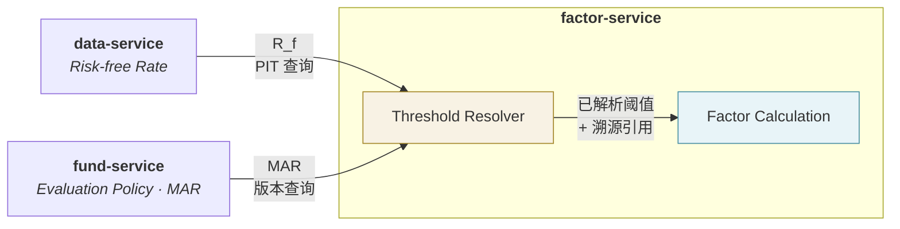

**依赖方向**：`factor-service` → `data-service`、`factor-service` → `fund-service`。

> **注意这引入了 `factor-service` 对 `fund-service` 的读依赖** —— 而 `fund-service` 本身消费 `factor-service` 的产出（Factor → Score）。**这不构成循环依赖**，因为两条依赖指向不同的对象：

```
factor-service → fund-service ：读 Evaluation Policy（配置，不含任何 Factor 产物）
fund-service   → factor-service ：读 Factor Result（数据）
```

**约束**：`Evaluation Policy` 的构建**不得依赖 Factor 或 Score**——这与 `Peer Group` 必须独立于 `Fund Score` 是同一条原则（上游 §5.5.3、`02-business-requirements` §7.2）。若 `Evaluation Policy` 反过来依赖 Factor，上述两条依赖将闭合成真正的循环。

### 13.4 与决策快照的关系

| 项 | 是否入快照 | 说明 |
|---|---|---|
| 解析出的 `R_f` 版本引用 | ✅ 随 Factor Result | 溯源信息 |
| 解析出的 `evaluation_policy_version` | ✅ 随 Factor Result | **标识的一部分**（`04-factor/08-factor-output` §2.5.1） |
| `evaluation_policy` 是否入决策快照 | ✅ **已定案** | 作为 `Policy Version` 五子项之一入快照，与 `strategy_version` **并列**（§8.2.1、§8.5） |

---

## 14. Architecture Boundaries

### 14.1 属于平台 vs 属于外部

| 属于平台 | 属于外部系统 |
|---|---|
| 数据采集、标准化、质量管理 | 数据源本身的生产 |
| 因子计算、评分、候选池 | —— |
| 收益与风险估计、组合构建与优化 | —— |
| 回测与策略验证 | —— |
| 决策产出与人工复核流程 | —— |
| 调仓建议生成与**交付** | **下单、成交、清算** |
| 消费成交回报以维护 Actual Portfolio | 成交回报的产生 |

### 14.2 第一阶段 vs 未来扩展

| 第一阶段（In Scope） | 未来扩展（Reserved） |
|---|---|
| 5 个 Domain Service | `09-ai` 域的信号增强能力 |
| 量化历史收益估计 | ML Return Estimate |
| 历史协方差与相关性 | ML Risk Model |
| 规则化评分与分层 | ML Ranking |
| 单一策略领域逻辑 | Regime Detection |

**扩展方式的约束**：未来 ML / AI 能力接入时，只能作为**既有 Stage 的增强项**，不得新增绕过主干的旁路，且必须保留一条不依赖 ML 的量化基线路径作为对照与回退（上游 §6.2.1）。

架构含义：`Return Estimate`、`Factor`、`Fund Score`、`Risk Model` 四处应预留**可替换的估计器接口**，但第一阶段只实现量化实现，**不预先建立**任何 ML 相关的组件、依赖或数据通道。

### 14.3 明确不建设的能力

```
✗  ML / AI / LLM / RAG 相关组件      ✗  prediction-service
✗  自动下单与券商对接                ✗  实时行情基础设施
✗  日内 / 高频交易能力               ✗  客户资金账户与清算
```

---

## 15. Architecture Principles

> **本章只包含架构原则**（如何组织系统）。产品级约束见 §18，具体决策见 §17。三者的区别：
>
> - **Principle**（原则）：指导设计的普适规则，跨文档适用
> - **Decision**（决策）：本文档做出的具体选择，可在条件变化时重新评估
> - **Constraint**（约束）：从上游继承或由数学/业务导出，架构层**不可权衡**

### 原则一 · Separation of Concerns

链路各 Stage 严格分离，禁止把多个阶段合并成模糊模块。

```
❌  fund-service 负责基金分析和投资组合
✅  fund-service 负责 Peer Group、Fund Score 与 Fund Universe
    portfolio-service 负责 ⑤⑥⑦⑦-R⑨⑩
```

### 原则二 · Logical Boundary ≠ Physical Boundary

Domain Service 是逻辑领域边界，约束的是**职责与写入权**，不是进程与数据库的物理拓扑（§3）。

**违反信号**：以"服务必须独立"为由，把决策快照拆到不同的一致性边界。

### 原则三 · Score 与 Return Estimate 在系统层面分离

两条数据流可独立演进。`Return Estimate` 的输入契约禁止消费任何评分派生量（§9.4）。

**违反信号**：出现"由 Score 换算 Expected Return"的任何组件或字段。

### 原则四 · Single Strategy Implementation

`Backtest` 与 `Live` 共用同一套 Strategy Domain Logic，经统一的 Strategy Execution Interface 调用，差异全部体现在注入参数上（§11.2）。

**违反信号**：领域逻辑中出现 `runtime_mode` 判断分支；`backtest-service` 内出现策略实现代码。

### 原则五 · Time-aware by Default

系统的默认数据视图是**时点感知**的。PIT 过滤由 PIT-aware Data Access Interface 强制实施，领域服务不得直接访问时点敏感数据（§7.4）。

**违反信号**：任何"取最新一条"的无约束访问路径。

### 原则六 · Snapshot over Recomputation

关键节点（Peer Group、Universe、Decision）留存快照。历史追溯与回测**优先读快照**，重建仅作为受控降级（§11.4）。

**理由**：快照是当时状态的直接证据，重建是间接推断，且重建失败的方式不可见。

### 原则七 · Reproducibility by Closure

决策快照必须是**闭包**——包含全部影响结果的输入版本引用，不依赖任何当前系统状态即可复现（§10.4）。

### 原则八 · Traceability by Construction

审计链在决策发生时**同步落库**，而非事后重建。Human Review 必须在链上。

> **Lineage 与 Audit 是两件事**：

| | Data Lineage | Decision Audit |
|---|---|---|
| 回答 | 这份**数据**从哪来 | 这个**决策**由谁、何时、基于什么版本做出 |
| 链条 | Source → Raw → Normalized → Factor → Score | Decision → 版本引用 → Reviewer → Override |
| 归属 | Decision Data Layer · Lineage | Decision Data Layer · Audit |

### 原则九 · Explicit Failure with Typed Outcomes

异常必须**阻断并上报**，严禁静默降级。且必须区分失败类型（§10.5）：

```
Decision  · INFEASIBLE   业务结果 → 不重试，人工调整约束
Decision  · REJECTED     人工判断 → 终止
Execution · BLOCKED      数据问题 → 不重试，修复数据
Execution · FAILED       系统故障 → 可重试
```

**违反信号**：把 `INFEASIBLE` 纳入自动重试；或阻断后自动降级产出"尽力而为"的决策。

---
## 16. Summary

`fund-investment-platform` 第一阶段的系统架构由五个部分构成：

- **五层结构** —— Presentation / Application / Domain Service / **Decision Data** / Infrastructure。其中 Decision Data Layer 是**数据能力抽象层**，Infrastructure 是其实现，两者不是调用链上的两级
- **5 个 Domain Service** —— **逻辑领域边界，非部署单元、非数据库边界**；第一阶段共享同一数据库实例，这是决策快照单事务写入得以成立的前提
- **三级一致性边界** —— Peer Group / Universe / Decision 三个快照各自原子、按序引用；Decision Snapshot 引用上游快照 ID 而非复制内容，使单一事务既可行又轻量
- **Strategy Execution Interface** —— Live 与 Backtest 经统一入口调用同一套领域逻辑，差异全部体现在注入的 `decision_at` 与 Data Context 上；领域逻辑不感知运行模式
- **PIT 强制访问** —— 领域服务不得直接访问时点敏感数据，必须经 PIT-aware Data Access Interface；原则由组件承载，而非依赖编码自觉

---

## 17. Decisions

| # | 决策 | 理由 | 重评估条件 |
|---|---|---|---|
| D-1 | 固定 5 个 Domain Service 作为**逻辑边界**，不拆分 `portfolio-service` | 第一阶段规模不需更细粒度；模块间强耦合且无独立扩展需求 | 某模块出现独立扩展需求 |
| D-2 | Domain Service **共享同一数据库实例** | 使决策快照的单事务写入天然成立，避免分布式事务 | 单库出现无法通过分区解决的瓶颈 |
| D-3 | Decision Snapshot **引用**上游快照 ID 而非复制内容 | 使单一事务的范围限于 `portfolio-service` 自身产出，轻量且可行 | —— |
| D-4 | `Peer Group` 归 `fund-service`，但其构建不依赖同服务内的评分模块 | 消除 `Score → Universe → Peer Group → Score` 循环依赖 | —— |
| D-5 | `Investment Eligibility`（事实）归 `data-service`，`Eligibility Rules`（规则）归 `fund-service` | 前者是客观状态、对所有策略相同；后者含投资观点、随策略变化 | —— |
| D-6 | Eligibility **不参与评分**，只参与 Universe 准入 | 可投资性是交易约束而非基金质量；混入评分会破坏评分的时间可比性 | —— |
| D-7 | `Fund Score` 经 **Universe 快照**传递至 Construction，不反向调用 `fund-service` | 保持 `fund-service → portfolio-service` 单向依赖 | —— |
| D-8 | `Return Estimate` 的输入契约**禁止**消费任何评分派生量 | 保证两条数据流在系统层面独立演进 | —— |
| D-9 | PIT 过滤由**接口强制**，而非领域服务传参 | 靠自觉传参，任一处遗漏即造成静默前视偏差且不可见 | —— |
| D-10 | 定义 **Strategy Execution Interface** 作为逻辑接口边界 | 防止实现退化为"回测通过网络调用实时服务"，破坏 PIT 与历史时钟 | —— |
| D-11 | 回测**快照优先、重建为受控降级** | 快照是当时状态的直接证据；重建依赖上游历史数据完整，失败方式不可见 | —— |
| D-12 | `Live Portfolio` 拆为 **Target / Pending / Actual** 三态 | 单一状态无法表达回报延迟、部分成交，且会使 Drift 检测得出错误结论 | —— |
| D-13 | Backtest 在业务链路为 Stage ⑧，在架构中定位为**横向 Runtime** | 避免导出"先回测再实盘"的错误串行依赖 | —— |
| D-14 | 优化不可行按业务事件（`INFEASIBLE`）处理，与 `FAILED` / `BLOCKED` 分开 | 三者的处理方式完全不同；混淆会掩盖真实问题 | —— |
| D-15 | 数据质量按层分责，不集中于 `data-service` | 否则退化为巨大的规则中心，且下游无法对自己的输入负责 | —— |

---

## 18. Constraints

> 以下约束**架构层不可权衡**——它们或由上游产品文档规定，或由数学/业务事实导出。

| # | 约束 | 来源 |
|---|---|---|
| C-1 | 不引入 ML / AI / LLM / RAG 组件 | 上游 §6.2.1 |
| C-2 | 不重新引入 `prediction-service` | 上游 v2.0 |
| C-3 | Backtest 不得自行实现策略逻辑 | 上游 §5.4 |
| C-4 | **决策快照必须处于同一一致性边界，可在单一事务内完整写入** | 上游 §8.4 |
| C-5 | 决策快照必须是**闭包**——含全部影响结果的输入版本引用 | `NFR-REPRO-001` |
| C-6 | `Fund Score` 不得作为优化器的收益输入，不得进入 Return Estimate 计算 | 上游 §5.2 |
| C-7 | Risk Contribution / Concentration 只能在 Stage ⑦-R 产出 | 数学约束——依赖权重 `w` |
| C-8 | `Peer Group` 构建不得读取 Score / Universe | `FR-PEER-001` |
| C-9 | 领域服务不得直接访问时点敏感数据，须经 PIT-aware 接口 | `NFR-REPRO-001`、上游 原则二 |
| C-10 | 写入权唯一——一份数据只能由一个 Domain Service 写入 | `03-data-architecture` §4.2 |
| C-11 | Approve / Reject / Override 权限仅限 Portfolio Manager；策略配置权与决策放行权分离 | `NFR-SEC-001` |
| C-12 | 不提供下单、券商对接、自动交易能力 | 上游 §6.2 |
| C-13 | 阻断后不得自动降级产出决策 | 上游 原则五 |

---

## 19. TBD

### 19.1 已在本域后续文档解决

| # | 事项 | 已落案于 |
|---|---|---|
| ARCH-1 | Strategy Domain Logic 的技术承载形态 | `06-technology-stack` §9 —— **共享库** |
| ARCH-3 | 存储方案选型 | `06-technology-stack` §4 —— **单一 PostgreSQL** |
| ARCH-4 | 决策执行的一致性边界机制 | 本文档 §10.3 —— **三级边界 + 快照 ID 引用** |
| ARCH-5 | Snapshot 一致性边界 | 本文档 §10.3 |
| ARCH-6 | PIT 强制访问机制 | 本文档 §7.4 + `03-data-architecture` §5.4 |
| ARCH-7 | Strategy Version 模型 | 本文档 §8 —— **九项，配置已含其中**；另有并列的第 10 类 `Policy Version`（五子项，§8.2.1） |
| ARCH-9 | Backtest Runtime 隔离 | `05-deployment-architecture` §3.2、§4.1 |
| ARCH-10 | Calculation Job 模型 | 本文档 §10.7 + `04-integration-architecture` §4 |
| ARCH-11 | Trigger 检测归属 | 本文档 §9.2 —— **portfolio-service · trigger-detection** |
| ARCH-12 | Target vs Actual Portfolio | 本文档 §12 |

### 19.2 仍待解决

| # | 事项 | 影响 | 归属 |
|---|---|---|---|
| **ARCH-2** | Presentation 层的形态与范围（是否含独立前端应用） | 部署单元 | `05-deployment-architecture` + `06-technology-stack` TECH-3 |
| **ARCH-8** | 决策快照的存储粒度与压缩策略 | 存储容量 | `11-database` |
| **ARCH-13** | Event / Workflow 机制的具体形态（若未来引入） | 集成方式 | `04-integration-architecture` INT-3 |
| **ARCH-14** | 快照缺失时"可重建条件"的判定标准 —— **已由 `08-backtest/01-backtest-engine` §8.3 落实为五项必要条件（R-1~R-5）** | 回测可信度 | ✅ 已落案 |
| **ARCH-15** | Architecture Decision Record（ADR）机制是否独立建立 | 决策可追溯 | 工程约定 |

> **关于 ARCH-15**：本文档 §17 的 D-1 ~ D-15 已具备 ADR 的实质内容（决策、理由、重评估条件）。是否抽出为独立的 `ADR-NNN` 序列，取决于后续决策数量。当前 15 条集中于本文档仍可管理。

### 19.3 上游遗留

业务参数类 TBD（P1-1 至 P1-24、NFR-1 至 NFR-10）见 `01-product/02-business-requirements` §35 与 `01-product/05-non-functional-requirements` §5，不在此重复。

---

## 20. Related Documents

> 引用时注意两套编号（§1.3）：`02-architecture/NN-*` 为本域内编号，`docs/NN-*` 为顶层域编号。

| 关系 | 文档 |
|---|---|
| **上游** | `docs/01-product/01-product-overview.md` v2.4、`docs/01-product/02-business-requirements.md` v2.3、`docs/01-product/04-functional-requirements.md` v1.0、`docs/01-product/05-non-functional-requirements.md` v1.0 |
| **本域同层** | `02-architecture/02-service-architecture`、`02-architecture/03-data-architecture`、`02-architecture/04-integration-architecture`、`02-architecture/05-deployment-architecture`、`02-architecture/06-technology-stack` |
| **下游技术域** | `docs/03-data`、`docs/04-factor`、`docs/05-fund-evaluation`、`docs/06-portfolio`、`docs/07-return-risk`、`docs/08-backtest`、`docs/10-api`、`docs/11-database`、`docs/12-operations`、`docs/13-governance` |

---

## 21. 变更记录

| 版本 | 日期 | 变更内容 | 上游依赖 |
|---|---|---|---|
| **v2.4** | 2026-08-27 | **`TBD-ARCH-16` 关闭**。版本模型由**四类扩为五类** —— 新增第 10 类 `Policy Version`（`evaluation` / `ranking` / `classification` / `estimation` / `validation` 五子项），而非把各 Policy 逐项追加为第 10、11、12 项。**理由**：九项 Strategy Version 同质（回答「怎么算、选什么」），五个 Policy 同质（回答「拿什么当标准」），两组异质；混入一个列表会让全库 20+ 处引用的「九项」表述失去稳定性，且会让评价标准变更的审批伪装成策略变更。§8.1 改写、§8.2.1 新增、§8.3 补并列字段、§8.5 由「已识别缺口」改为「已定案」、§13.4 与 §附录 ARCH-7 同步。详见 `TBD-resolution.md` Policy ⑧ | `02-business-requirements.md` v2.4 §23.1.1 |
| **v2.3** | 2026-08-26 | `TBD-ARCH-14`（快照缺失时的可重建条件）获 `08-backtest` 回应：`01-backtest-engine` §8.3 给出五项必要条件 R-1~R-5（数据完整性、未被不可逆覆盖、生命周期完整、配置版本可解析、重建结果可自检），任一不满足即中止回测，不得"尽力重建"；重建期占比须在回测报告中呈现并可触发降级 | `08-backtest/01-backtest-engine.md` v1.0 |
| **v2.2** | 2026-08-26 | **§8.5 缺口扩充**。由 `05-fund-evaluation` 编写过程发现：除 `Evaluation Policy Version` 外，**`Ranking Policy Version` 与 `Classification Policy Version` 同样不在九项之内**——Tie Method 或 Tier 阈值的变更会改变 Percentile 与 Universe 构成，但快照中无任何字段记录。三者性质相同，**建议合并为第 10 项 `Evaluation Framework Version`** 而非新增三项，以免九项膨胀为十二项。`TBD-ARCH-16` 相应扩充 | `05-fund-evaluation` v1.0 |
| **v2.1** | 2026-08-25 | **阈值解析版**（上游 v2.5 §5.5）。新增 **§13 Threshold Resolution**：`R_f`（`data-service` 拥有，走 PIT）与 `MAR`（`fund-service` 拥有，走版本）由 `factor-service` 内的 **Threshold Resolver** 统一解析，避免计算逻辑跨域直读配置表并把 `MAR` 误按 PIT 查询；§13.3 说明**新引入的 `factor-service` → `fund-service` 读依赖不构成循环**（两条依赖指向不同对象：配置 vs 数据），但前提是 `Evaluation Policy` 的构建不得依赖 Factor 或 Score。<br/>**新增 §8.5 登记已识别缺口**：`Evaluation Policy Version` 不在九项 Strategy Version 之内，导致依赖 `MAR` 的 Factor 无法从决策快照复现。给出三个候选方案与推荐（新增第 10 项），**但不擅自变更九项**——其结构属已定案的业务规则。原 §13–§20 顺移为 §14–§21 | `01-product-overview.md` v2.5 §5.5、`04-factor` v1.1 |
| **v2.0** | 2026-08-25 | **架构闭合版**（依据 review 的 P0/P1 意见）。<br/>**P0**：①新增 §3 明确 **Domain Service 是逻辑边界，非部署单元、非数据库边界**，第一阶段共享同一数据库；②新增 §10 **Decision Execution & Consistency**——执行上下文、三级一致性边界（快照 ID 引用而非复制）、快照最小闭包、Decision Status 十态机、Human Review 架构位置、异步计算模型；③§9.3 澄清 **Fund Score 经 Universe 快照传递**，不构成反向依赖；④§11.2 定义 **Strategy Execution Interface** 逻辑边界；⑤§7.4 PIT 由**接口强制**（PIT-A1~A4）；⑥§6.5 区分 **Investment Eligibility（事实）与 Eligibility Rules（规则）**；⑦§10.5 区分 **Decision Status（业务 · 沿用上游 7 态，不扩展）与 Execution Status（架构层新增维度）**——`BLOCKED` / `FAILED` 属执行维度，不是决策状态；⑧§8.1 版本模型由三类扩为**四类**，新增 **Code Version**（策略库 / 求解器 / 数值库），并纳入决策快照闭包——此前作为隐含依赖，无法在快照中查询与校验。<br/>**P1**：⑦§8 新增 **Versioning Model**（九项定义 + 三类版本关系，取消 Configuration 重复计数）；⑧§7.3 portfolio-service 九个内部模块（含 trigger-detection）；⑨§12 新增 **Portfolio State Model**（Target / Pending / Actual 三态）；⑩§11.4 **快照优先原则**——修正回测"重算 Peer Group"与"读快照"的自相矛盾；⑪§9.2 Trigger 分支重算图与触发源归属；⑫§5 图补 Source Adapters 与 Recommendation Delivery；⑬§4 Decision Data 与 Infrastructure 改为抽象/实现关系；⑭§9.4 Return Estimate 输入契约；⑮§6.6 Eligibility 不参与评分；⑯§9.6 数据质量分层责任；⑰§6.3 Backtest 双重身份（业务 Stage ⑧ / 架构横向 Runtime）；⑱原则八区分 **Lineage 与 Audit**。<br/>**其他**：§1.3 说明两套文档编号；§14 区分 Principle / Decision / Constraint 三者层次；§16 决策增加"重评估条件"列；§18 TBD 扩充并区分已解决与待解决 | `01-product-overview.md` v2.4 |
| v1.0 | 2026-08-25 | 初始版本。五层结构与 5 个 Domain Service；10 Stage → 系统组件映射；Strategy Domain Logic 与两种 Runtime；八条架构原则 | `01-product-overview.md` v2.4 |