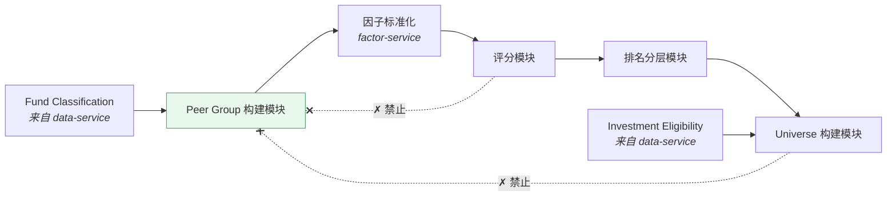
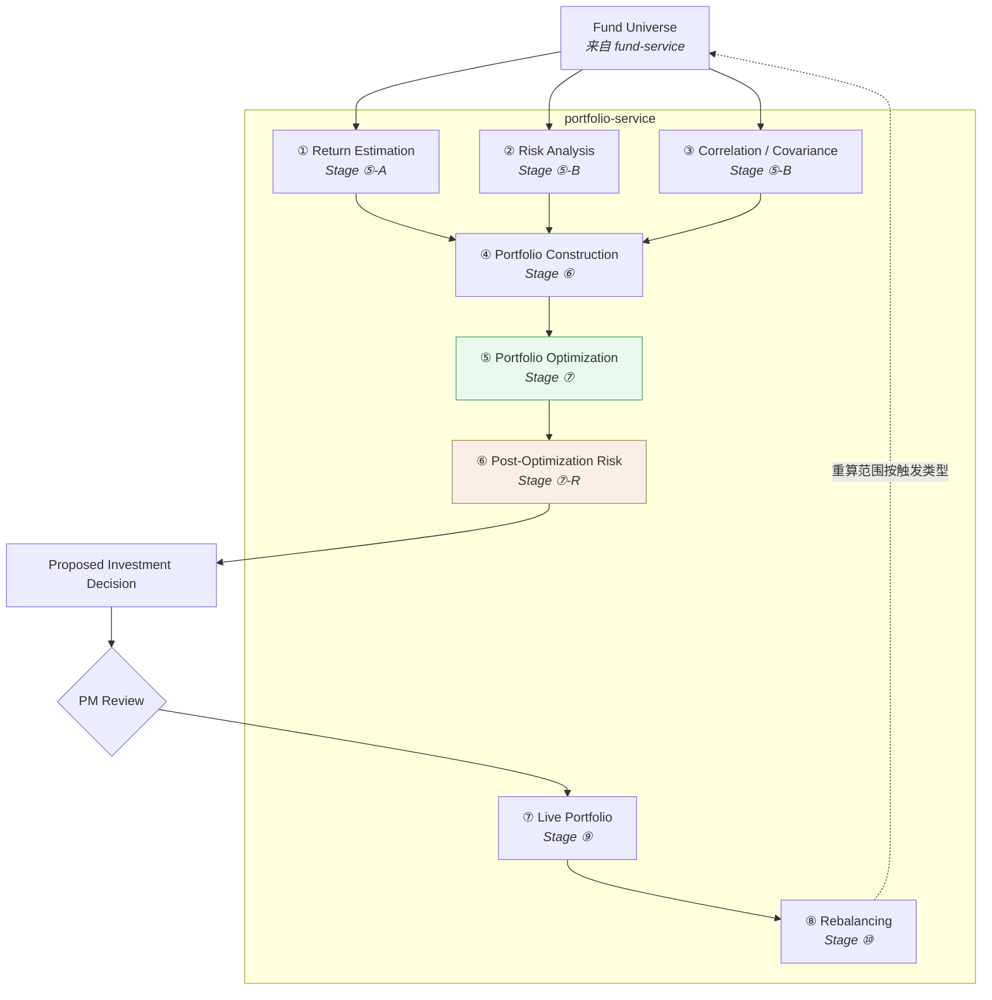
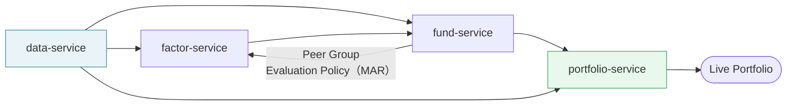
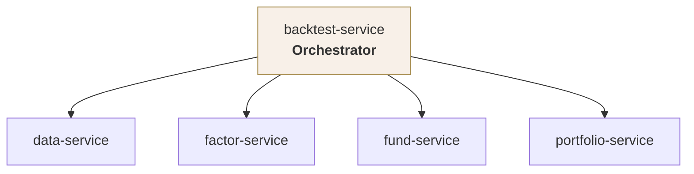

# 服务架构 · Service Architecture

> 上游文档：docs/01-product/01-product-overview.md（v2.5）｜本文细化环节：支撑层
> 业务需求：docs/01-product/02-business-requirements.md（v2.3）
> 同层上游：docs/02-architecture/01-system-architecture.md（v2.0）
>
> **文档版本**：v1.3 ｜ **产品阶段**：第一阶段

---

## 1. 文档目的与边界

### 1.1 本文档回答什么

> **谁负责什么？** 每个 Service 的职责、依赖、执行模型与失败处理。

### 1.2 本文档不回答什么

| 不回答 | 归属 |
|---|---|
| 系统整体分层与 Stage 映射 | `01-system-architecture` |
| 数据分层、PIT 机制、快照设计 | `03-data-architecture` |
| Service 间通信的具体方式与失败重试策略 | `04-integration-architecture` |
| 部署单元、副本数、资源模型 | `05-deployment-architecture` |
| 用什么技术实现 | `06-technology-stack` |
| 接口路径、请求/响应结构 | `10-api` |
| 表结构与索引 | `11-database` |

> **Persistence 字段说明**：本文档的 `Persistence` 只描述**持久化什么数据、有什么一致性要求**，不涉及存储产品与表结构。

---

## 2. Service 基线

### 2.1 五个 Domain Service

第一阶段固定为 **5 个**，不多不少：

```
data-service · factor-service · fund-service · portfolio-service · backtest-service
```

> **`prediction-service` 不得重新引入**。Return / Risk / Correlation 已并入 `portfolio-service`（上游 v2.0 决策）。

### 2.2 统一模板

每个 Service 按以下 12 个字段描述：

```
Purpose · Responsibilities · Non-responsibilities · Owned Domain
Input · Output · Dependencies · Persistence
Execution Model · Failure Handling · Scalability · Observability
```

### 2.3 Domain Service 是逻辑边界

> **本文档定义的 5 个 Domain Service 是逻辑领域边界（Bounded Context），不等于 5 个独立部署的微服务，也不等于 5 个独立的数据库。**

| 边界 | 本文档是否定义 | 归属 |
|---|---|---|
| 逻辑领域边界（职责与写入权） | **✅ 本文档** | —— |
| 部署单元（进程粒度） | ❌ | `05-deployment-architecture` |
| 数据一致性边界（事务范围） | ❌ | `01-system-architecture` §10.3 |

第一阶段 5 个 Domain Service **共享同一数据库实例**（`06-technology-stack` §4），这是决策快照单事务写入得以成立的前提。详见 `01-system-architecture` §3。

即使不独立部署，以下三条**仍然强制**：写入权唯一、职责不重叠、依赖方向单向。

### 2.4 服务粒度的决策

第一阶段**刻意不拆分** `portfolio-service`，尽管它承载 6 个 Stage。理由见 §8.4。

---

## 3. `data-service`

### 3.1 Purpose

> 成为全链路**唯一的数据入口**，向下游提供时点感知、质量已知、口径统一的基金数据。

### 3.2 Responsibilities

| # | 职责 | 对应 FR |
|---|---|---|
| R-1 | 外部数据源接入与采集 | FR-DATA-001 |
| R-2 | 数据清洗与标准化（含复权净值计算） | FR-DATA-002 |
| R-3 | **PIT 三元时点管理**：`effective_at` / `available_at` / `version` | FR-DATA-001、FR-DATA-005 |
| R-4 | Fund Classification 及其变更历史 | FR-DATA-003 |
| R-5 | Fund Lifecycle Status 维护 | FR-DATA-004 |
| R-6 | **Investment Eligibility 事实判定与持久化**（客观状态，非策略规则——见下方说明） | FR-ELIG-001、FR-ELIG-003 |
| R-7 | Benchmark 数据接入与 Benchmark Selection 五级优先级执行 | FR-BM-001、FR-BM-005 |
| R-8 | 数据质量检测与三级阻断粒度判定 | FR-DQ-001、FR-DQ-002 |
| R-9 | 基金经理任职记录与变更事件 | FR-DATA-006 |
| R-10 | 按任一历史 `decision_at` 提供当时可见的数据视图 | FR-DATA-005 |

### 3.3 Non-responsibilities

> **`data-service` 不计算 Factor。**

| 不负责 | 归属 |
|---|---|
| 任何加工指标（收益率、波动率、Sharpe） | `factor-service` |
| Fund Score、Ranking、Universe | `fund-service` |
| 收益估计、风险分析、组合 | `portfolio-service` |
| 数据质量规则的**业务定义** | `03-data`（本服务只执行） |

#### 3.3.1 Investment Eligibility 与 Eligibility Rules 的分工

> 两者名称相近但**性质不同，归属不同服务**：

| | `Investment Eligibility`（本服务） | `Eligibility Rules`（`fund-service`） |
|---|---|---|
| 性质 | **客观事实**——基金当前能否被交易 | **策略规则**——本策略要什么样的基金 |
| 来源 | 生命周期、申赎限制公告、流动性指标 | 策略配置（规模、年限、Score 阈值） |
| 是否含投资观点 | **否** | **是** |
| 是否随策略变化 | 否——同一时点对所有策略相同 | 是 |

`data-service` 产出**事实**，`fund-service` 据此与其他条件共同应用**规则**。前者是后者的输入之一，不是同义词。详见 `01-system-architecture` §6.5。

### 3.4 Owned Domain

`Fund Data`（Stage ①）、`Benchmark Data`、`Fund Classification`、`Fund Lifecycle Status`、`Investment Eligibility`（事实）、`Data Quality Status`。

### 3.5 Input / Output

| | 内容 |
|---|---|
| **Input** | 外部数据源：基金基础信息、净值、规模、费率、经理、分类、公告；指数行情；基金合同与招募说明书中的业绩比较基准 |
| **Output** | 带三元时点标记的标准化基金数据、Benchmark Definition（含 Composite 各 Component 及权重）、Investment Eligibility 状态、Data Quality Status 与阻断粒度 |

### 3.6 Dependencies

| 依赖 | 类型 |
|---|---|
| 外部数据供应商 | 外部（经 Adapter 隔离，见 `04-integration-architecture`） |
| 无内部 Service 依赖 | —— |

> `data-service` 是链路起点，**不依赖任何其他 Domain Service**。这是它能作为"唯一数据入口"的前提。

### 3.7 Persistence

| 数据 | 一致性要求 |
|---|---|
| 基金主数据、分类、经理、费率 | 强一致；修订产生新 `version`，**旧版本保留不覆盖** |
| 净值序列 | 日频追加；修订同样按 version 管理 |
| Benchmark Mapping | 强一致；含 `effective_at` / `available_at` / `source` / `mapping_rule_version` 四字段 |
| Investment Eligibility 状态历史 | 强一致；按三元时点记录 |
| Data Quality Status | 与数据批次绑定 |

### 3.8 Execution Model

| 模式 | 场景 |
|---|---|
| **Scheduled Batch** | 每日数据采集、清洗、标准化、质量检查（主要模式） |
| **Event-driven** | 公告类数据到达时的增量处理 |
| **On-demand Query** | 下游服务与前端的时点数据查询 |

### 3.9 Failure Handling

| 失败场景 | 处理 |
|---|---|
| 外部数据源不可用 | 重试；超过策略后标记该批次未到达并告警，**不使用陈旧数据冒充当期** |
| 部分基金数据缺失 | Fund-level 处理——该基金相关指标 `UNAVAILABLE`，其余正常（`FR-DQ-001`） |
| Benchmark 数据缺失 | Metric-level 处理——依赖 Benchmark 的指标 `UNAVAILABLE`，**不用替代基准填补** |
| 全市场数据未到位 / 日期整体错位 | **Global-level 阻断整个决策周期**，人工确认后继续 |
| 数据修订冲突 | 按 `version` 序列处理，不覆盖既有版本 |

> **禁止静默降级**：任何级别的异常都必须显式暴露、可告警、可追溯。

### 3.10 Scalability

| 维度 | 特征 |
|---|---|
| 采集与标准化 | 批量作业，可按基金分片并行 |
| 时点查询 | 读多写少；历史数据不可变，天然适合缓存 |
| 增长驱动 | 基金数量 × 历史年限 |

### 3.11 Observability

数据到达时间 vs 约定时点、各类型完整性、质量状态分布（VALID / WARNING / INVALID）、阻断粒度分布、修订版本产生量、Benchmark 映射命中的优先级分布。

---

## 4. `factor-service`

### 4.1 Purpose

> 把标准化的基金数据转换为**可比较的量化特征**，并提供因子有效性检验能力。

### 4.2 Responsibilities

| # | 职责 | 对应 FR |
|---|---|---|
| R-1 | Factor 计算（收益 / 风险 / 风险调整 / 稳定性四类） | FR-FACTOR-001、FR-FUND-001~004 |
| R-2 | Factor 标准化（在 `Peer Group` 内） | FR-FACTOR-001 |
| R-3 | Rolling Factor 序列计算 | FR-FUND-004 |
| R-4 | Factor Validation（IC、ICIR、分层单调性、稳定性、因子间相关性） | FR-FACTOR-002 |
| R-5 | Factor 版本管理（`Metric Version`） | FR-FACTOR-004 |
| R-6 | Factor 历史值留存与按时点查询 | FR-FACTOR-003 |
| R-7 | 维护每个 Factor 的 `Preference Direction` 与 `Factor Usage` 声明 | FR-FACTOR-001 BR-5 |
| **R-8** | **Threshold Resolution** —— 解析 `R_f`（PIT）与 `MAR`（版本），校验同组 `MAR` 一致 | `01-system-architecture` §13 |

### 4.3 Non-responsibilities

> **`Factor` ≠ `Fund Score`。**

| 不负责 | 归属 | 说明 |
|---|---|---|
| **多因子加权合成** | `fund-service` | 任何"综合因子""因子总分"本质上是 `Fund Score` |
| 排序与分层 | `fund-service` | Factor 只产出数值 |
| `Peer Group` 的构建 | `fund-service` | 本服务**消费** Peer Group，不构建 |
| Return Estimate | `portfolio-service` | Factor 描述历史特征，不是收益估计 |
| 各 Factor 的数学公式定义 | `04-factor` | 本服务实现，不定义 |

### 4.4 Owned Domain

`Factor`（Stage ②）、`Metric Version`、Factor Validation 结果。

### 4.5 Input / Output

| | 内容 |
|---|---|
| **Input** | `data-service` 提供的标准化数据（按 `available_at ≤ decision_at` 筛选）；`fund-service` 提供的 `Peer Group`（用于标准化）；Factor 定义与 `Metric Version` |
| **Output** | 因子值矩阵（基金 × 因子 × 时间）、Peer Group 内标准化暴露、Rolling 序列、Factor Validation 报告、所用 `Metric Version` |

### 4.6 Dependencies

```
data-service      →  factor-service    数据输入 + Risk-free Rate
fund-service      →  factor-service    Peer Group（标准化范围）+ Evaluation Policy（MAR）
```

> **注意此处存在两条与主链路方向相反的依赖**：`factor-service` 需要 `fund-service` 的 `Peer Group` 才能标准化、需要其 `Evaluation Policy` 中的 `MAR` 才能计算 `Sortino` / `Downside Volatility`，而 `fund-service` 又需要标准化后的 Factor 才能评分。
>
> **这不是循环依赖**——两条反向依赖读取的都是**配置**，而正向依赖读取的是**数据**：`Peer Group` 的构建只依赖 `data-service` 的分类数据（`FR-PEER-001` BR-1），`Evaluation Policy` 的构建同样不得依赖 Factor 或 Score（上游 §5.5.3）。**若任一配置反过来依赖 Factor，两条依赖将闭合成真正的循环。** 实际执行顺序为：
>
> ```
> data-service（分类 + R_f） → fund-service（构建 Peer Group + Evaluation Policy）
>                          → factor-service（Threshold Resolution → 计算 → 在 Peer Group 内标准化）
>                          → fund-service（评分）
> ```
>
> 集成方式与调用时序见 `04-integration-architecture` §4.3。

### 4.7 Persistence

| 数据 | 一致性要求 |
|---|---|
| 因子原始值与标准化值 | 日频追加；历史值**不可覆盖** |
| Factor Validation 结果 | 与检验区间和 `Metric Version` 绑定 |
| Factor 定义与版本 | 强一致；变更产生新版本 |

### 4.8 Execution Model

| 模式 | 场景 |
|---|---|
| **Scheduled Batch** | 每日全量因子计算（主要模式） |
| **On-demand Batch** | 新因子接入时的历史全区间回算 |
| **On-demand Query** | 因子值查询、Validation 执行 |

### 4.9 Failure Handling

| 失败场景 | 处理 |
|---|---|
| 输入数据 `UNAVAILABLE` | 对应因子输出 `UNAVAILABLE`，**不填充**（Fund-level / Metric-level） |
| Peer Group 未就绪 | 阻断标准化，等待或告警——**不退化为全市场标准化** |
| 部分基金计算失败 | Fund-level 隔离，其余继续；失败明细可定位到具体基金与因子 |
| 计算任务中断重试 | **幂等**——重复执行不产生重复或冲突结果（`NFR-REL-001`） |

### 4.10 Scalability

因子计算是**天然可并行**的批量负载——按基金分片或按因子分片均可。计算量 = 基金数 × 因子数 × 时间点数，是系统中增长最快的维度。

### 4.11 Observability

计算任务状态与时长、`UNAVAILABLE` 比例、部分失败明细、因子值分布异常（突变可能意味着数据或逻辑问题）、`Metric Version` 分布。

---

## 5. `fund-service`

### 5.1 Purpose

> 完成**基金评价**：从因子暴露到综合得分、排名分层，再到候选基金池。

### 5.2 Responsibilities

| # | 职责 | 对应 FR |
|---|---|---|
| R-1 | **`Peer Group` 构建与快照留存** | FR-PEER-001、FR-PEER-002 |
| R-2 | `Evaluation Profile` 维护 | FR-PEER-004 |
| R-3 | `Fund Score` 计算与五子分拆解 | FR-SCORE-001 |
| R-4 | 评分方案配置与版本管理（`Scoring Version`） | FR-SCORE-001 BR-5 |
| R-5 | 缺失指标处理与 `Data Completeness` 计算 | FR-SCORE-002 |
| R-6 | Peer Group 内排名、分位、`Fund Tier` 分层 | FR-RANK-001 |
| R-7 | `Eligibility Rules` 配置与版本管理 | FR-UNIV-004 |
| R-8 | `Fund Universe` 生成（三种构成策略） | FR-UNIV-001 |
| R-9 | **Universe 快照留存与入出池原因记录** | FR-UNIV-002、FR-UNIV-003 |
| R-10 | 评分变化归因 | FR-SCORE-005 |

### 5.3 Non-responsibilities

> **`fund-service` 不计算 Return Estimate，不计算 Portfolio Weight。**

| 不负责 | 归属 |
|---|---|
| Return Estimate（收益估计） | `portfolio-service` |
| Risk / Correlation | `portfolio-service` |
| 任何权重分配 | `portfolio-service` |
| Factor 的计算 | `factor-service` |
| 评分方案的业务设计（用哪些指标、什么权重） | `05-fund-evaluation`（本服务提供配置能力） |

### 5.4 Owned Domain

`Peer Group`、`Evaluation Profile`、`Fund Score` 及五子分、`Fund Tier`、`Eligibility Rules`、`Fund Universe` 及快照、`Scoring Version`。

### 5.5 Input / Output

| | 内容 |
|---|---|
| **Input** | `data-service`：Fund Classification（构建 Peer Group）、Investment Eligibility（准入条件）；`factor-service`：标准化因子暴露；配置：Scoring Version、Eligibility Rules 版本、分层阈值 |
| **Output** | Peer Group 成员与快照、Fund Score + 五子分 + 因子贡献 + Data Completeness、排名/分位/Tier + 组内绝对水平、Fund Universe + 完整快照 |

### 5.6 Dependencies

```
data-service    →  fund-service     分类（Peer Group）、可投资性（准入）
factor-service  →  fund-service     标准化因子暴露（评分）
fund-service    →  factor-service   Peer Group（标准化范围）
```

### 5.7 内部模块依赖方向（关键约束）



> **Peer Group 构建模块不得读取评分模块或 Universe 模块的输出。** 违反会形成 `Score → Universe → Peer Group → Score` 的循环依赖——不报错，但每次重算得到不同分数，直接破坏 `NFR-REPRO-001`。

### 5.8 Persistence

| 数据 | 一致性要求 |
|---|---|
| **Peer Group 快照** | 每决策时点一份；**与其内成员及所用分类版本同属一个一致性边界** |
| Fund Score、五子分、因子贡献 | 与 Peer Group 快照、Scoring Version 绑定 |
| 排名、分位、Tier | 与阈值配置版本绑定 |
| **Universe 快照** | **快照整体完整或整体不可见**——含成员、规则版本、评分版本、入出池原因、Data Completeness、可投资性状态 |
| 配置版本（Scoring / Eligibility / 分层阈值） | 强一致；用于生产决策的版本不得删除 |

> **一致性边界约束**：Universe 快照的成员明细与元信息（规则版本、评分版本）必须能在**单一事务**内完整写入（上游 §8.4 C-4）。未完整留存的时点，其回测结果无效。

### 5.9 Execution Model

| 模式 | 场景 |
|---|---|
| **Scheduled Batch** | 每日/每决策时点的 Peer Group → Score → Ranking → Universe 顺序执行 |
| **On-demand** | 配置调整后的重算、探索性筛选（**不产生 Universe**） |

> **探索性筛选与正式 Eligibility Rules 必须分离**：前者是界面上的临时查询，不版本化、不可回测、不产生 Universe（`FR-UNIV-001` BR-5）。架构上表现为两条不同的执行路径。

### 5.10 Failure Handling

| 失败场景 | 处理 |
|---|---|
| Peer Group 样本量低于阈值 | 标记该组评分为低置信，不阻断 |
| 因子 `UNAVAILABLE` | 按缺失规则处理：权重重分配或子分标记 `UNAVAILABLE`；**严禁按 0 分参与** |
| Universe 快照写入失败 | **整体回滚**，本期 Universe 视为未生成，阻断下游 |
| Eligibility Rules 配置冲突 | 拒绝保存，返回冲突明细 |

### 5.11 Scalability

评分与排名是 Peer Group 内的批量计算，可按 Peer Group 分片并行。Universe 生成量级远小于因子计算。

### 5.12 Observability

Peer Group 规模分布与变动、Score 分布异常、`Data Completeness` 分布、**Universe 规模异常变动**（骤增骤减通常意味着规则或数据问题）、快照留存完整率。

---

## 6. `portfolio-service`

> 这是系统中最复杂的 Service，承载 Stage ⑤⑥⑦⑦-R⑨⑩。

### 6.1 Purpose

> 从候选基金池出发，完成**收益与风险估计 → 组合构建 → 权重求解 → 决策产出 → 实盘维护 → 再平衡**的完整组合管理链路。

### 6.2 内部模块划分

`portfolio-service` 内部按 8 个模块组织，模块间边界清晰但**不拆分为独立 Service**：



### 6.3 模块职责

| 模块 | 职责 | 关键约束 |
|---|---|---|
| **① Return Estimation** | 按量化方法产出 `μ`，声明 Estimation Window / Horizon / Return Basis | **不使用 ML**；**不读取 `Fund Score`**（FR-RET-001 BR-2、BR-4） |
| **② Risk Analysis** | 波动率、下行风险、回撤指标 | 事前风险，**不依赖权重** |
| **③ Correlation / Covariance** | 相关性矩阵、协方差矩阵 `Σ`、可用性检查 | `μ` 与 `Σ` 时间尺度与年化口径一致 |
| **④ Portfolio Construction** | 装配目标函数 + 约束集 + 风险预算（六要素校验） | **不产出权重数值**；四要素缺一拒绝保存 |
| **⑤ Portfolio Optimization** | 求解 `w`，产出 Optimization Run 记录 | **不自行放松约束**；不可行返回 `INFEASIBLE` |
| **⑥ Post-Optimization Risk** | `σ_p`、MRC、TRC、集中度、因子暴露；Risk Budget 达成校验 | **依赖 `w`**，只能在 ⑤ 之后执行 |
| **⑦ Live Portfolio** | 维护 **Target / Pending / Actual 三态**组合状态（见 `01-system-architecture` §12），消费外部成交回报 | `Actual` **来自外部回报**，非平台推算；回报延迟时**不得以 Target 冒充 Actual** |
| **⑧ Rebalancing** | 触发判定、重算范围确定、成本收益判据、调仓建议生成 | 重算深度**不得运行时动态调整** |

### 6.4 Responsibilities

对应 FR：`FR-RET-001~004`、`FR-RISK-001~004`、`FR-CONS-001~005`、`FR-OPT-001~005`、`FR-PRISK-001~004`、`FR-DEC-001~005`、`FR-EXPL-001~003`、`FR-LIVE-001~004`、`FR-REBAL-001~005`。

### 6.5 Non-responsibilities

| 不负责 | 归属 |
|---|---|
| Fund Data 的采集与标准化 | `data-service` |
| Factor 计算 | `factor-service` |
| Fund Score、Peer Group、Universe 构建 | `fund-service` |
| **下单、成交、清算** | 外部执行系统 |
| 优化算法的数学实现细节 | `06-portfolio`（本服务实现，不定义） |
| 决策审批的治理流程与阈值 | `13-governance` |

### 6.6 Owned Domain

`Return Estimate`、`Risk / Correlation Data`、`Constraint Set`、`Risk Budget`、`Optimization Run`、`Post-Optimization Risk`、`Investment Decision`（Proposed / Approved）、`Live Portfolio`、`Rebalancing Recommendation`。

### 6.7 Input / Output

| | 内容 |
|---|---|
| **Input** | `fund-service`：Fund Universe + 快照；`data-service`：净值序列、Investment Eligibility、Benchmark；配置：Portfolio Rule / Return Estimate / Risk Model / Rebalance Rule 版本；外部：成交与持仓回报 |
| **Output** | `μ`、`Σ`、Optimization Run、目标权重、Post-Opt Risk、Proposed / Approved Investment Decision、Rebalancing Recommendation、完整决策快照与解释链 |

### 6.8 Dependencies

```
fund-service   →  portfolio-service    Fund Universe
data-service   →  portfolio-service    净值序列、可投资性、Benchmark
外部执行系统    →  portfolio-service    成交 / 持仓回报
```

> **`portfolio-service` 不依赖 `factor-service`**——它需要的是原始收益序列，不是因子值。这条边界保证了 `Return Estimate` 与 `Fund Score` 两条数据流在系统层面独立（`01-system-architecture` 原则三）。

### 6.9 Persistence

| 数据 | 一致性要求 |
|---|---|
| Return Estimate、`Σ`、相关性矩阵 | 每决策时点一份；与 Return Estimate / Risk Model Version 绑定 |
| Constraint Set、Risk Budget | 强一致；属 Portfolio Rule Version |
| Optimization Run | 完整记录输入、状态、输出、诊断 |
| **决策快照** | **强一致 · 必须在单一事务内完整写入**——含 Universe、Score、μ、Risk Metrics、相关性、协方差、约束集、风险预算、目标函数、Optimization Run、目标权重、Human Review 记录、九项版本号 |
| Live Portfolio 持仓状态 | 强一致；需事务 |
| Rebalancing Recommendation | 与触发类型、重算范围、成本判据绑定 |

> **这是全系统一致性要求最高的持久化边界**（上游 §8.4 C-4）。快照不完整则指令不得下发（`FR-DEC-003`）。

### 6.10 Execution Model

| 模式 | 场景 |
|---|---|
| **Scheduled Batch** | 决策日的 ⑤→⑥→⑦→⑦-R 顺序执行 |
| **Event-driven** | 外部成交回报到达 → 更新 Live Portfolio；Rebalance Trigger 触发 → Strategy Re-evaluation |
| **Interactive** | PM 复核（Approve / Reject / Override）；策略配置调整 |
| **On-demand** | 权重解释查询、组合风险查询 |

### 6.11 Failure Handling

| 失败场景 | 处理 |
|---|---|
| **优化不可行 / 不收敛** | `Decision Status = INFEASIBLE`；**不产出 Proposed Decision**；不放松约束、不退化等权、不沿用上期；记录原因并上报人工处理 |
| 协方差矩阵不可用（非正定 / 样本不足） | 按**预先定义**的收缩规则处理，或阻断——规则不得临时决定 |
| PIT 校验失败 | **阻断本期决策** |
| 决策快照写入不完整 | **整体回滚**；指令不得下发 |
| Override 五字段不全 | **拒绝放行** |
| 外部成交回报缺失或延迟 | Live Portfolio 状态标记为待确认；不以目标权重冒充实际权重 |
| 基金因可投资性无法达成目标权重 | **显式报告差异**，不静默用其他基金补足 |

> **优化不可行是业务结果，不是系统故障**——不得作为异常自动重试。

### 6.12 Scalability

| 负载 | 特征 |
|---|---|
| Return Estimate / Risk | 与 Universe 规模线性相关 |
| **协方差矩阵计算** | 与 Universe 规模呈**平方增长**——必须明确单次优化可支持的最大 Universe 规模，超出时显式拒绝，**不得静默截断 Universe**（`NFR-SCALE-002`） |
| 优化求解 | 与 Universe 规模及约束数量相关；单次求解为 CPU 密集型 |
| Live Portfolio 维护 | 与组合数量线性相关，量级小 |

### 6.13 Observability

`μ` 与 `Σ` 的稳定性（相邻时点变动幅度）、协方差矩阵条件数、**优化求解状态分布（收敛 / 可行 / INFEASIBLE）**、Risk Budget 达成率、Risk Alert Level 分布、**Override 频率**、Backtest-Live Deviation、决策快照完整率。

---

## 7. `backtest-service`

### 7.1 Purpose

> **Orchestration only.** 通过历史时钟与数据注入，驱动同一套 Strategy Domain Logic 在历史时间轴上重放，收集结果并生成报告。

### 7.1.1 通过 Strategy Execution Interface 复用领域逻辑

`backtest-service` 不直接调用各领域服务的内部实现，而是经**统一的 Strategy Execution Interface**（`01-system-architecture` §11.2）驱动同一套 Strategy Domain Logic：

```
Input:  Decision Execution Context（decision_at · runtime_mode=BACKTEST）
        + PIT Data Context + Strategy Version（九项）+ Recompute Scope
Output: Decision Snapshot（闭包）
```

> 领域逻辑**不感知 `runtime_mode`**——Live 与 Backtest 的差异全部体现在注入的 `decision_at` 与 Data Context 上。

### 7.1.2 快照优先原则

> **回测优先读取当期已固化的 Peer Group / Universe 快照；仅在快照不存在且 PIT 数据完整时，才允许重建并标记为"重建产物"；PIT 数据不完整则中止回测。**

理由：快照是当时状态的直接证据，重建是间接推断，且重建失败的方式在结果中不可见。详见 `01-system-architecture` §11.4。

### 7.1.1 通过 Strategy Execution Interface 复用领域逻辑

`backtest-service` 不直接调用各领域服务的内部实现，而是经**统一的 Strategy Execution Interface**（`01-system-architecture` §11.2）驱动同一套 Strategy Domain Logic：

```
Input:  Decision Execution Context（decision_at · runtime_mode=BACKTEST）
        + PIT Data Context + Strategy Version（九项）+ Recompute Scope
Output: Decision Snapshot（闭包）
```

> 领域逻辑**不感知 `runtime_mode`**——Live 与 Backtest 的差异全部体现在注入的 `decision_at` 与 Data Context 上。

### 7.1.2 快照优先原则

> **回测优先读取当期已固化的 Peer Group / Universe 快照；仅在快照不存在且 PIT 数据完整时，才允许重建并标记为"重建产物"；PIT 数据不完整则中止回测。**

理由：快照是当时状态的直接证据，重建是间接推断，且重建失败的方式在结果中不可见。详见 `01-system-architecture` §11.4。

### 7.2 Responsibilities

| # | 职责 | 对应 FR |
|---|---|---|
| R-1 | 历史时钟控制——按 Rebalance Decision Point 推进 | FR-BT-001 BR-3 |
| R-2 | 历史数据快照注入（`available_at ≤ T` 的数据视图） | FR-BIAS-001 |
| R-3 | 按序编排调用领域服务 | FR-BT-001 |
| R-4 | 逐期结果与决策快照收集 | FR-BT-005 |
| R-5 | 绩效指标计算与归因 | FR-BTR-001、FR-BTR-003 |
| R-6 | 三方对比（Strategy / Portfolio Benchmark / Equal Weight Baseline） | FR-BTR-001 BR-1 |
| R-7 | IS / OOS 划分与 Walk-forward 编排 | FR-BT-002 |
| R-8 | 交易成本计入 | FR-BT-004 |
| R-9 | 回测报告生成（含三类偏差处理声明） | FR-BIAS-004、FR-BTR-002 |

### 7.3 Non-responsibilities

> **`backtest-service` 不实现任何策略逻辑。**

| 不负责 | 归属 |
|---|---|
| Factor 计算 | `factor-service` |
| Peer Group / Fund Score / Universe | `fund-service` |
| Return Estimate / Risk / Construction / Optimization | `portfolio-service` |
| 产生任何实盘指令 | —— |
| 统计检验方法的定义 | `08-backtest`（本服务实现，不定义） |

**违反信号**：`backtest-service` 内出现因子公式、评分权重合成、优化目标函数的实现代码。

### 7.4 Owned Domain

`Backtest Configuration`、`Backtest Result`、逐期回测快照、绩效与归因报告、IS/OOS 划分与 Parameter Freeze 记录。

### 7.5 Input / Output

| | 内容 |
|---|---|
| **Input** | `Strategy Version`（九项）、历史区间、初始资金、调仓频率、Portfolio Benchmark、交易成本配置、IS/OOS 划分 |
| **Output** | 回测净值序列、逐期持仓与权重、逐期决策快照、绩效指标、归因结果、三方对比、偏差处理声明 |

### 7.6 Dependencies

```
backtest-service  →  data-service       历史数据视图
backtest-service  →  factor-service     因子计算
backtest-service  →  fund-service       Peer Group / Score / Universe
backtest-service  →  portfolio-service  μ / Σ / Construction / Optimization
```

> **依赖方向全部向外**：`backtest-service` 依赖所有其他服务，但**没有任何服务依赖它**。这是编排器的典型特征，也是它可以随时停止而不影响生产链路的原因。

### 7.7 Persistence

| 数据 | 一致性要求 |
|---|---|
| Backtest Configuration | 与九项 Strategy Version 绑定 |
| 逐期决策快照 | 与实盘快照同构——保证回测可复现 |
| 回测结果与绩效 | 批量写入；按策略版本与区间检索 |
| Parameter Freeze 记录 | 纳入 Strategy Version，不可事后修改 |

### 7.8 Execution Model

**Long-running Asynchronous Job**：提交后异步执行，支持进度查询。单次回测可能跨越数十至数百个决策时点，每个时点触发一轮完整的领域服务调用链。

### 7.9 Failure Handling

| 失败场景 | 处理 |
|---|---|
| 某期数据快照缺失 | **中止回测并报告缺失时点**——不跳过、不推算（跳过会造成隐性幸存者偏差） |
| 某期优化不可行 | 按配置的处理策略记录并继续或中止；**必须在报告中体现该期状态** |
| 领域服务调用失败 | 重试；超限则中止该次回测并保留已完成部分 |
| 回测中断 | 支持从最近完成的决策时点恢复（幂等） |

### 7.10 Scalability

| 维度 | 特征 |
|---|---|
| 单次回测时长 | ≈ 决策时点数 × 单期链路耗时；应与「基金数 × 期数」近似线性 |
| 并发回测 | 多个回测互不依赖，可水平并行 |
| 资源特征 | **与在线查询资源模型完全不同**——长时间、高 CPU、大批量数据读取，需与在线负载隔离 |

### 7.11 Observability

回测任务状态与进度、单期耗时分布、各期优化求解状态、数据快照命中率、失败中止原因分布、并发回测数。

---

## 8. Service Dependency Graph

### 8.1 主链路依赖



### 8.2 Backtest 编排依赖



### 8.3 依赖规则

| # | 规则 |
|---|---|
| DEP-1 | `data-service` 不依赖任何 Domain Service——它是链路起点 |
| DEP-2 | `backtest-service` 依赖全部其他服务，但**无服务依赖它** |
| DEP-3 | `portfolio-service` **不依赖** `factor-service`——保证 Return Estimate 与 Fund Score 数据流独立 |
| DEP-4 | `factor-service` ↔ `fund-service` 的双向依赖仅限 **Peer Group 与 Evaluation Policy（配置）** 和因子暴露（数据），**不构成循环**——见 §4.6 |
| DEP-5 | 任何服务**不得**依赖 Presentation / Application 层 |
| **DEP-6** | **`Evaluation Policy` 的构建不得依赖 Factor 或 Score** —— 与 `Peer Group` 同一条原则；违反则 DEP-4 的两条反向依赖闭合成真正的循环 |

### 8.4 为什么不拆分 `portfolio-service`

`portfolio-service` 承载 6 个 Stage、8 个内部模块，是明显的拆分候选。第一阶段**刻意不拆**，理由如下：

| # | 理由 |
|---|---|
| 1 | **一致性边界**：决策快照必须在单一事务内完整写入（上游 §8.4 C-4）。拆成 `risk-service` / `optimization-service` 会把这个约束变成分布式事务问题——**为了组织美观引入直接威胁核心质量属性的复杂度** |
| 2 | **强耦合计算**：`μ` → `Σ` → Construction → Optimization → Post-Opt Risk 是一条紧密的计算链，中间产物（矩阵）体积大、生命周期短，跨服务传输代价高而收益为零 |
| 3 | **无独立扩展需求**：这些模块的负载同步涨落，不存在"只需扩展优化器"的场景 |
| 4 | **上游明确禁止**：不得拆出 `prediction-service`、`risk-service`、`optimization-service`（提示词 §12.6） |

> **拆分的触发条件**（未来重评估时参考）：某个模块出现独立于其他模块的扩展需求；或决策快照的一致性可通过其他机制保证且该机制的复杂度低于当前收益。

---

## 9. Summary

五个 Domain Service 的职责边界严格对应上游 10 个 Stage：

- **`data-service`** —— 唯一数据入口，承载 PIT 三元时点与 Investment Eligibility 判定，不计算任何指标
- **`factor-service`** —— 因子计算与验证，不做多因子合成
- **`fund-service`** —— Peer Group、评分、排名分层、候选池；内部 Peer Group 模块不依赖评分模块
- **`portfolio-service`** —— 8 个内部模块覆盖 Stage ⑤⑥⑦⑦-R⑨⑩，是一致性要求最高的服务，第一阶段不拆分
- **`backtest-service`** —— 纯编排器，依赖全部服务而无服务依赖它

---

## 10. Decisions

| # | 决策 | 理由 |
|---|---|---|
| D-1 | `portfolio-service` 内部模块化但不拆分 | 决策快照的一致性边界不可破坏；模块间强耦合且无独立扩展需求（§8.4） |
| D-2 | `Investment Eligibility` 判定放在 `data-service` 而非 `fund-service` | 它是基金的客观状态属性，来源于生命周期与公告数据，不含策略判断 |
| D-3 | `portfolio-service` 不依赖 `factor-service` | 保证 `Return Estimate` 与 `Fund Score` 两条数据流独立演进 |
| D-4 | Peer Group 构建模块置于 `fund-service` 但只依赖 `data-service` 的分类数据 | 消除循环依赖，同时保持评价相关能力的内聚 |
| D-5 | 探索性筛选与正式 Eligibility Rules 走两条执行路径 | 前者不版本化、不可回测、不产生 Universe |
| D-6 | 优化不可行按业务事件处理，不进入异常重试 | 它是合法业务结果，需要被统计与观测 |

---

## 11. Constraints

| # | 约束 | 来源 |
|---|---|---|
| C-1 | 固定 5 个 Domain Service，不得引入 `prediction-service` | 上游 v2.0 |
| C-2 | `backtest-service` 不得实现任何策略逻辑 | 上游 §5.4 |
| C-3 | 决策快照必须在单一事务内完整写入 | 上游 §8.4 |
| C-4 | Peer Group 构建不得读取 Score / Universe | `FR-PEER-001` |
| C-5 | Return Estimate 不得读取 Fund Score | `FR-RET-001` |
| C-6 | Post-Optimization Risk 只能在权重求出后计算 | 数学约束 |
| C-7 | 各服务不得对 `UNAVAILABLE` 数据做任何填充 | `FR-FUND-001`、`FR-SCORE-002` |

---

## 12. TBD

| # | 事项 | 归属 |
|---|---|---|
| SVC-1 | Strategy Domain Logic 的技术承载形态（共享库 / 共享服务） | `06-technology-stack` |
| SVC-2 | 单次优化可支持的最大 Universe 规模 | `06-portfolio` + `05-deployment-architecture` |
| SVC-3 | 协方差矩阵不可用时的收缩规则 | `07-return-risk`（P1-11 相关） |
| SVC-4 | 回测中某期优化不可行时的默认处理策略 —— **已由 `08-backtest/01-backtest-engine` §18 落案：默认 `ABORT`（中止回测）** | ✅ 已落案 |

---

## 13. Related Documents

| 关系 | 文档 |
|---|---|
| **上游** | `01-product/01-product-overview.md` v2.4、`01-product/02-business-requirements.md` v2.3、`01-product/04-functional-requirements.md` |
| **同层** | `01-system-architecture`（系统边界）、`03-data-architecture`（数据归属）、`04-integration-architecture`（调用方式）、`05-deployment-architecture`（部署单元）、`06-technology-stack` |
| **下游** | `03-data`、`04-factor`、`05-fund-evaluation`、`06-portfolio`、`07-return-risk`、`08-backtest`、`10-api` |

---

## 14. 变更记录

| 版本 | 日期 | 变更内容 | 上游依赖 |
|---|---|---|---|
| v1.3 | 2026-08-26 | `SVC-4`（回测中某期不可行的处理）获 `08-backtest` 回应：默认**中止回测**——实盘的 Human Review 闭环在回测中不存在，而"本期不调仓"会系统性美化结果（跳过的往往是市场极端时期） | `08-backtest/01-backtest-engine.md` v1.0 |
| v1.2 | 2026-08-25 | **补充 Threshold Resolution 的服务归属与依赖**（上游 v2.5 §5.5、`01-system-architecture` v2.1 §13）。`factor-service` 新增职责 R-8；§4.6 反向依赖由一条扩为两条（`Peer Group` + `Evaluation Policy`），明确**两条反向依赖读的都是配置、正向依赖读的是数据**，因此不构成循环；新增 DEP-6：**`Evaluation Policy` 的构建不得依赖 Factor 或 Score**，违反则两条依赖闭合成真正的循环 | `01-system-architecture.md` v2.1 |
| v1.1 | 2026-08-25 | **随 01-system-architecture v2.0 同步**。新增 §2.3 **Domain Service 是逻辑边界**（非部署单元、非数据库边界，共享同一数据库实例）；§3.3.1 区分 **Investment Eligibility（事实）与 Eligibility Rules（规则）**；§6.3 Live Portfolio 模块改为维护 **Target / Pending / Actual 三态**；§7.1.1 新增 **Strategy Execution Interface** 复用机制；§7.1.2 新增**快照优先原则**；修正 §2.3 失效引用（§8.1 → §8.4） | `01-product-overview.md` v2.4、`01-system-architecture.md` v2.0 |
| v1.0 | 2026-08-25 | 初始版本。五个 Domain Service 按 12 字段统一模板定义；`portfolio-service` 拆分为 8 个内部模块并论证不拆服务的理由；明确 `factor-service` ↔ `fund-service` 的双向依赖不构成循环；确立 5 条服务依赖规则与 7 条不可权衡约束 | `01-product-overview.md` v2.4、`01-system-architecture.md` v1.0 |