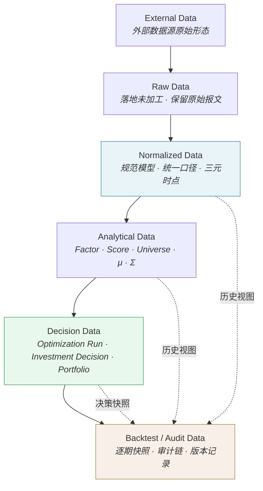
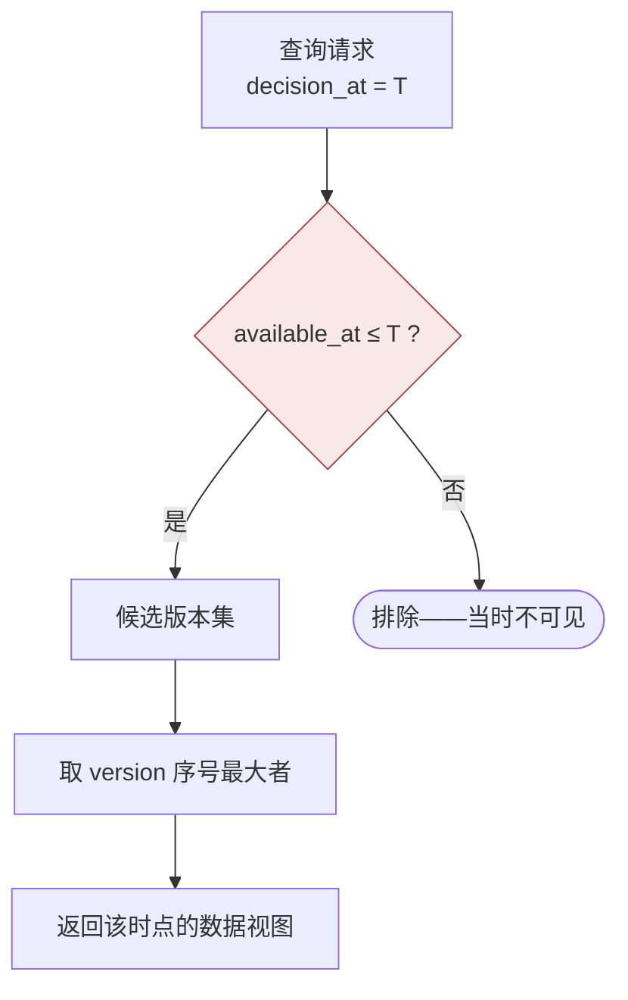
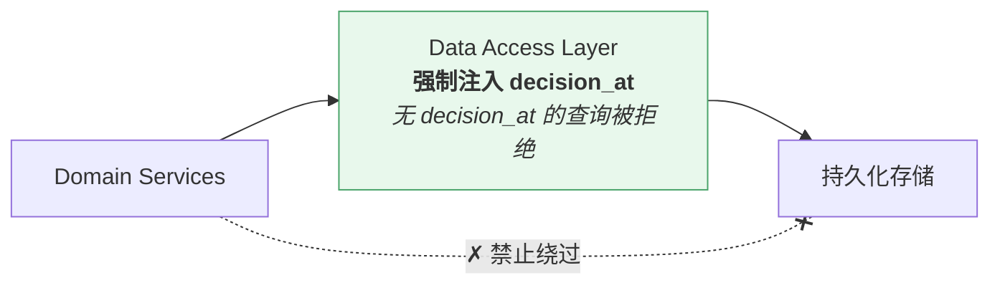
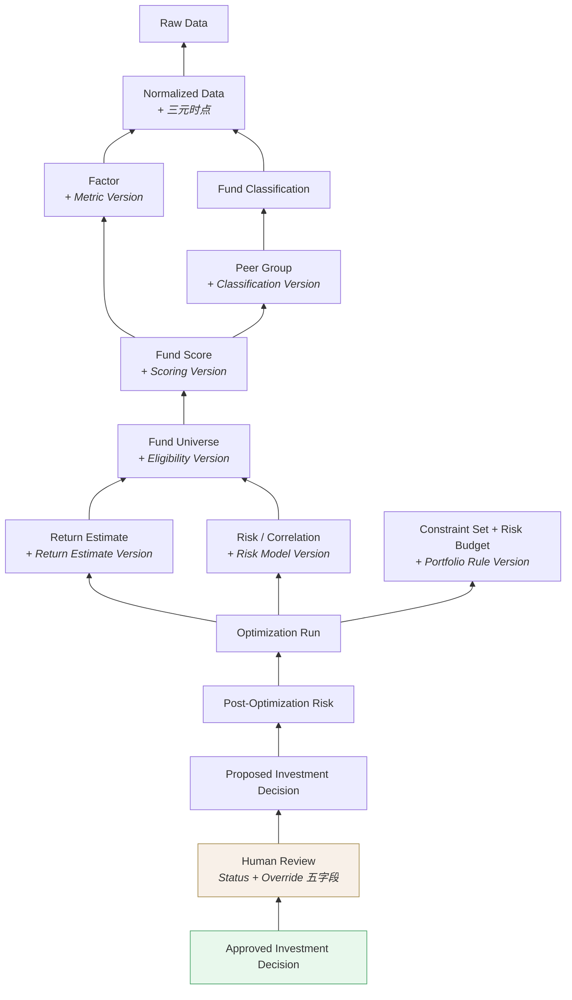
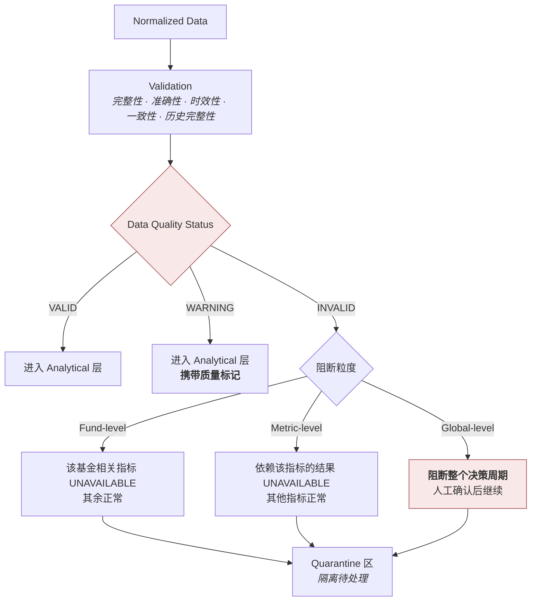

# 数据架构 · Data Architecture

> 上游文档：docs/01-product/01-product-overview.md（v2.5）｜本文细化环节：支撑层
> 业务需求：docs/01-product/02-business-requirements.md（v2.3）
> 同层上游：docs/02-architecture/01-system-architecture.md（v2.0）、02-service-architecture.md（v1.1）
>
> **文档版本**：v1.1 ｜ **产品阶段**：第一阶段

---

## 1. 文档目的与边界

### 1.1 本文档回答什么

> **数据怎么流？谁拥有什么数据？历史决策如何被完整还原？**

### 1.2 本文档不回答什么

| 不回答 | 归属 |
|---|---|
| **具体表结构、字段、索引、分区** | `11-database` |
| 数据质量规则的业务定义与阈值 | `03-data` |
| 各 Factor 的计算公式 | `04-factor` |
| 数据如何从外部进入系统（集成方式） | `04-integration-architecture` |
| 存储产品选型 | `06-technology-stack` |

> **本文档描述数据的分层、归属、时点语义与血缘关系，不描述其物理结构。**

---

## 2. Data Layers

### 2.1 六层数据流



### 2.2 各层特征

| 层 | 内容 | 可变性 | 时点语义 | 消费者 |
|---|---|---|---|---|
| **External Data** | 供应商原始格式 | 不受控 | 外部定义 | Adapter |
| **Raw Data** | 落地的原始记录 | **只追加** | 记录接收时刻 | `data-service` |
| **Normalized Data** | 规范模型、统一口径 | **只追加 + 版本** | **三元时点完整** | 全部下游 |
| **Analytical Data** | 因子、评分、候选池、估计量 | **只追加** | 与 `decision_at` 绑定 | `portfolio-service`、`backtest-service` |
| **Decision Data** | 优化运行、决策、持仓 | **只追加 + 状态流转** | 与 `decision_at` 绑定 | 复核、审计、实盘 |
| **Backtest / Audit Data** | 逐期快照、审计链 | **不可变** | 完整版本快照 | 回测、追溯、合规 |

> **贯穿全层的原则：只追加，不覆盖。** 数据修订产生新版本，旧版本保留（上游 原则二）。这是可复现性与可审计性的物理基础。

### 2.3 Raw 层为什么必须保留

Raw 层看似冗余（Normalized 已经足够下游使用），但必须保留：

- **口径变更后可重新标准化**：复权规则或分类映射调整时，需要从原始数据重新生成 Normalized 层，而非依赖已被加工的数据
- **数据争议时可回溯到源**：当多源数据不一致时，仲裁依据是原始报文
- **供应商数据修订可比对**：能区分"供应商改了数"与"我们算错了"

---

## 3. 核心数据域

### 3.1 十五个数据域

| # | 数据域 | 所属层 | Stage | Owner |
|---|---|---|---|---|
| 1 | **Fund Data** | Normalized | ① | `data-service` |
| 2 | **Benchmark Data** | Normalized | ① | `data-service` |
| 3 | **NAV / Market Data** | Normalized | ① | `data-service` |
| 4 | **Fund Classification** | Normalized | ① | `data-service` |
| 5 | **Investment Eligibility** | Normalized | ① | `data-service` |
| 6 | **Peer Group Data** | Analytical | ③ | `fund-service` |
| 7 | **Factor Data** | Analytical | ② | `factor-service` |
| 8 | **Fund Score Data** | Analytical | ③ | `fund-service` |
| 9 | **Fund Universe Data** | Analytical | ④ | `fund-service` |
| 10 | **Return Estimate Data** | Analytical | ⑤-A | `portfolio-service` |
| 11 | **Risk / Correlation Data** | Analytical | ⑤-B | `portfolio-service` |
| 12 | **Portfolio Data**（Target / Pending / Actual 三态） | Decision | ⑥⑦⑨ | `portfolio-service` |
| 13 | **Optimization Result** | Decision | ⑦ | `portfolio-service` |
| 14 | **Investment Decision** | Decision | ⑦ Output | `portfolio-service` |
| 15 | **Rebalancing Data** | Decision | ⑩ | `portfolio-service` |
| 16 | **Backtest Data** | Backtest / Audit | ⑧ | `backtest-service` |
| 17 | **Strategy Metadata** | 贯穿 | 支撑 | 分域拥有（§4.3） |

### 3.2 三个易被忽略的数据域

| 数据域 | 为什么容易被忽略 | 为什么必须独立 |
|---|---|---|
| **Peer Group Data** | 常被当作"评分的中间结果" | 它是评分的**样本集定义**，必须独立留存快照，否则历史评分不可复现（`FR-PEER-002`） |
| **Investment Eligibility** | 常被并入 Lifecycle Status | 两者语义不同——"暂停申购"不等于"不可持有"（`FR-ELIG-001`） |
| **Optimization Result** | 常被并入 Investment Decision | 它包含求解状态与诊断信息（含 `INFEASIBLE` 的情形），此时**没有** Investment Decision 但仍需留存 |

---

## 4. Data Ownership

### 4.1 归属表

| 数据 | Owner（唯一写入方） | 消费方 |
|---|---|---|
| Fund Data / NAV / Classification | `data-service` | 全部下游 |
| Benchmark Data 与 Mapping | `data-service` | `factor-service`、`portfolio-service`、`backtest-service` |
| Investment Eligibility | `data-service` | `fund-service`（准入）、`portfolio-service`（建仓校验） |
| Factor | `factor-service` | `fund-service`、`backtest-service` |
| Peer Group | `fund-service` | `factor-service`（标准化范围）、`fund-service`（评分） |
| Fund Score / Ranking / Tier | `fund-service` | `fund-service`（Universe）、展示层 |
| Fund Universe | `fund-service` | `portfolio-service`、`backtest-service` |
| Return Estimate | `portfolio-service` | `portfolio-service`（优化） |
| Risk / Correlation | `portfolio-service` | `portfolio-service`（优化、事后风险） |
| Portfolio / Optimization Result / Investment Decision | `portfolio-service` | 展示层、审计 |
| Rebalancing Data | `portfolio-service` | 展示层、外部执行系统 |
| Backtest Data | `backtest-service` | 展示层、策略治理 |

### 4.2 Ownership 的三层含义

按上游 原则八，必须区分三种 ownership：

| 类型 | 含义 | 是否唯一 | 本文档定义的是 |
|---|---|---|---|
| **Definition Ownership** | 谁定义这个概念 | 唯一 | 上游 `01-product` |
| **Write Ownership** | 谁写入这份数据 | **唯一** | **本表** |
| **Read Access** | 谁可以读取 | 不唯一 | 本表"消费方"列 |

> **写入权唯一，读取权开放。** 一份数据只能由一个 Service 写入，但可被多个 Service 读取。这既保证了数据一致性的责任单点，又不会像"存储权唯一"那样阻碍跨服务的数据流动。

### 4.3 Strategy Metadata 的分域拥有

`Strategy Version` 的九项组成由各自的 Owner 维护，不存在集中的"配置服务"：

| 版本项 | Owner |
|---|---|
| Metric Version | `factor-service` |
| Peer Group / Classification Version | `fund-service` |
| Eligibility / Universe Version | `fund-service` |
| Scoring Version | `fund-service` |
| Return Estimate Version | `portfolio-service` |
| Risk Model Version | `portfolio-service` |
| Portfolio Rule Version | `portfolio-service` |
| Rebalance Rule Version | `portfolio-service` |
| Benchmark Version | `data-service` |

**组合关系**：`Strategy Version` 是这九项的**版本组合引用**，由 `backtest-service` 与 `portfolio-service` 在执行时固化到快照中。

---

## 5. PIT Data Architecture

> 这是整个数据架构的核心机制。

### 5.1 四个时点属性

| 属性 | 含义 | 用途 |
|---|---|---|
| `effective_at` | 该事实在**业务上生效**的日期 | 时段对齐 |
| `available_at` | 该事实**首次对平台可见**的时刻 | **PIT 判定的唯一依据** |
| `version` | 修订版本序号 | 版本选择 |
| `decision_at` | **执行本次决策的时点** | 查询基准 |

另有 `data_as_of`（本次决策采用的数据截止时点）。第一阶段约定 `data_as_of = decision_at`，但保留为独立字段以备将来分离（`02-business-requirements` §24.2）。

### 5.2 四者的关联



**规则**：

```
候选版本集 = { v | v.available_at ≤ decision_at }
选取       = 候选集中 version 序号最大者
```

> **判定依据是 `version` 序号（修订序列），不是 `available_at` 的最大值**——两者通常一致，但数据回补场景下可能不一致（较晚落库的可能是较早的修订版本）。

### 5.3 为什么不能用 `effective_at` 判定

```
基金经理变更   effective_at = 2026-08-20   （生效日）
               available_at = 2026-08-25   （公告发布）
决策日         decision_at  = 2026-08-22

按 effective_at → 通过 ✗   系统在 8/22 根本不知道这件事
按 available_at → 拒绝 ✓
```

基金数据中**生效日早于披露日是常态**——经理变更、分类调整、定期报告持仓、规模数据、净值修订全都如此。

### 5.4 PIT 的架构落点

> **PIT 过滤必须在数据访问层强制实施，而非依赖各领域服务自觉传参。**



**设计要求**：

| # | 要求 |
|---|---|
| PIT-1 | 数据访问层的**默认视图是时点感知的**，不存在"取最新一条"的无约束路径 |
| PIT-2 | 任何查询必须携带 `decision_at`；缺失时**拒绝而非默认取当前时间** |
| PIT-3 | 领域服务无法绕过数据访问层直接触达存储 |
| PIT-4 | 实时场景（如 Live Portfolio 当前状态查询）使用显式的"当前视图"接口，与历史视图**在接口层面区分**，不共用同一入口 |

> **为什么必须强制**：若靠各服务自觉传参，任何一处遗漏都会造成静默的前视偏差——它不会报错，不影响流程，且在净值曲线上完全看不出来。这是回测失真最隐蔽的来源。

### 5.5 适用范围

PIT 约束适用于**全部派生量与映射关系**，不限于原始数据：

```
Factor · Peer Group · Fund Score · Fund Universe
Return Estimate · Correlation · Covariance
Benchmark Mapping · Investment Eligibility · Fund Classification
```

---

## 6. Snapshot Architecture

### 6.1 五类快照

| 快照 | 内容 | 产出时机 | Owner |
|---|---|---|---|
| **Peer Group Snapshot** | 组成员、所用分类版本 | 每决策时点 | `fund-service` |
| **Universe Snapshot** | 成员、规则版本、评分版本、评分与子分、入出池原因、Data Completeness、可投资性 | 每决策时点 | `fund-service` |
| **Configuration Snapshot** | 九项 Strategy Version 的具体配置内容 | 版本变更时 | 各 Owner |
| **Decision Snapshot** | 见 §6.3 | 每次决策 | `portfolio-service` |
| **Backtest Snapshot** | 逐期决策快照 + 回测配置 | 每期 + 每次回测 | `backtest-service` |

### 6.2 快照 vs 重算

> **为什么必须留存快照，而不是"需要时按当时版本重算"？**

| | 快照 | 重算 |
|---|---|---|
| 幸存者偏差 | 天然避免——保存的就是当时的成员 | 需要完整的历史成员数据才能正确重建 |
| 可复现性 | 直接比对 | 依赖所有上游数据的历史版本都完整 |
| 成本 | 存储成本 | 每次追溯都要重跑全链路 |
| 风险 | 低 | **任一上游历史数据缺失即无法重建** |

架构选择：**关键节点留存快照，非关键中间结果可重算**。Peer Group、Universe、Decision 三处必须留快照——它们是幸存者偏差与可复现性的关键防线。

### 6.3 Decision Snapshot 的完整内容

```
Universe（成员 + 规则版本）
Fund Score（总分 + 五子分 + 因子贡献）
Return Estimate（μ + 三项口径声明）
Risk Metrics（σ · 下行风险 · 回撤）
Correlation Matrix · Covariance Matrix
Constraint Set · Risk Budget · Optimization Objective
Optimization Run（输入 · 状态 · 输出 · 诊断）
Post-Optimization Risk（σ_p · MRC · TRC · 集中度）
Target Weight
Human Review（Decision Status + Override 五字段）
九项 Strategy Version
decision_at · data_as_of
```

### 6.4 一致性边界（不可权衡的约束）

> **Decision Snapshot 必须处于同一个一致性边界内，能够在单一事务中完整写入。**

**架构含义**：

| # | 要求 |
|---|---|
| SNAP-1 | 快照的全部组成部分必须能在**一个事务**内写入 |
| SNAP-2 | 快照对下游的可见性是**全有或全无**——不存在"部分可见"的中间状态 |
| SNAP-3 | 写入失败时**整体回滚**，本期视为未产生决策 |
| SNAP-4 | 不得为性能优化把快照拆分到不同的一致性边界（如"明细一处、元信息另一处"） |

> 该约束由上游 原则六（可复现）与 原则七（可追溯）导出，**不可由架构层以性能为由权衡**（上游 §8.4）。它直接影响存储方案的选择——见 `06-technology-stack`。

#### 6.4.1 三级一致性边界与快照引用

该约束在 5 个 Domain Service 的架构下如何成立，见 `01-system-architecture` §10.3。要点：

```
B1 Peer Group Snapshot   ← 原子写入，产生快照 ID
        ↓ 被引用（非复制）
B2 Universe Snapshot     ← 原子写入，引用 B1 的 ID
        ↓ 被引用（非复制）
B3 Decision Snapshot     ← 原子写入，引用 B2 的 ID + 本阶段全部产出
```

**关键**：B3 **不复制** B1/B2 的内容，只引用其快照 ID。因此 B3 的事务范围仅限 `portfolio-service` 自身产出加若干引用键——这使"单一事务"既可行又轻量。三个边界各自原子且按序依赖，任一失败其下游不会产生，不存在"半个决策"。

前提是 5 个 Domain Service **共享同一数据库实例**（`06-technology-stack` §4）。

Universe Snapshot 适用同样的约束（`FR-UNIV-002` BR-3）。

---

## 7. Data Lineage

### 7.1 完整血缘链



### 7.2 血缘必须回答的四个问题

链路每一环都必须能回答：

| # | 问题 | 数据支撑 |
|---|---|---|
| 1 | **谁**产生的 | Owner Service + 操作人（人工环节） |
| 2 | **什么时候**产生的 | `decision_at` + 写入时刻 |
| 3 | 使用了**什么版本** | 九项 Strategy Version + Data Version |
| 4 | 使用了**什么规则与数据** | 配置快照 + 上游数据引用 |

### 7.3 Human Review 必须在链上

> 审计链中**必须包含人工复核环节**——否则无法回答"系统算出 12%，为什么最后是 7%"。

这不是可选的增强，而是可追溯性成立的前提。若 Override 无记录：

- `NFR-REPRO-001` 失效——相同版本重跑得不到实盘的权重
- `NFR-AUDIT-001` 失效——链条在人工环节断裂
- Backtest-Live Deviation 失去意义——无法区分偏离来自策略失效还是人工干预

### 7.4 血缘的构建时机

> **血缘在数据产生时同步记录，不在事后重建。**

事后重建血缘需要依赖"当时的配置是什么"这一信息本身，而这正是血缘要回答的问题——循环依赖。因此血缘必须与数据同时落库。

---

## 8. Data Quality Architecture

> 架构层只描述质量管控的**机制与落点**；具体规则与阈值由 `03-data` 定义。

### 8.1 质量门（Data Quality Gate）



### 8.2 三级阻断粒度

| 级别 | 影响范围 | 举例 |
|---|---|---|
| **Fund-level** | 仅该基金 | 某基金规模缺失 → 该基金相关条件 `UNAVAILABLE`，其余 999 只正常 |
| **Metric-level** | 仅依赖该指标的结果 | 某基金 Benchmark 缺失 → Alpha/Beta/IR/TE 为 `UNAVAILABLE`，其他指标正常 |
| **Global-level** | **整个决策周期** | 全市场净值未到位、数据日期整体错位、数据源批次缺失 |

> **`WARNING` 明确可以继续参与计算**，但质量标记必须**逐级向上传递**至最终输出——使用者需要据此判断结果可信度。

### 8.3 质量标记的传递

```
Normalized Data (WARNING)
        ↓  标记传递
Factor (WARNING)
        ↓  标记传递
Fund Score (WARNING + Data Completeness)
        ↓  标记传递
Fund Universe (含 WARNING 成员标记)
        ↓  标记传递
Investment Decision (标注受影响的持仓)
```

**架构要求**：质量标记是数据的**伴随属性**，不是独立的旁路信息——它必须随数据一起流动，不能靠事后关联查询获得。

### 8.4 Quarantine（隔离区）

`INVALID` 数据进入隔离区而非被丢弃：

| 目的 | 说明 |
|---|---|
| 可追溯 | 保留问题数据以供排查 |
| 可恢复 | 修复后可重新进入流程 |
| 可统计 | 隔离量与原因分布是数据源质量的直接度量 |

### 8.5 五个质量维度的架构落点

| 维度 | 检测落点 | 失败处理 |
|---|---|---|
| **Completeness** | Normalized 层入口 | 按粒度分级 |
| **Accuracy** | Normalized 层入口（校验规则） | 按粒度分级 |
| **Timeliness** | 数据到达调度点 | 未到达 → Global 级评估 |
| **Consistency** | 多源比对时 | 差异须可解释或仲裁 |
| **Historical Integrity** | **写入路径**（禁止覆盖） | **拒绝写入**——版本链断裂不可恢复 |

> **Historical Integrity 的检测点与其他四项不同**：它不是"检查数据对不对"，而是"禁止一类写操作"。这是架构层的强制约束，不是可配置的规则。

---

## 9. Summary

数据架构的核心是**三个不可妥协的机制**：

1. **PIT 在数据访问层强制实施** —— 默认视图时点感知，无 `decision_at` 的查询被拒绝，领域服务无法绕过
2. **关键节点留存快照** —— Peer Group、Universe、Decision 三处必须留快照，且快照具备"全有或全无"语义
3. **只追加、不覆盖** —— 数据修订产生新版本，`Historical Integrity` 由写入路径强制保证

加上**写入权唯一、读取权开放**的 Ownership 模型，以及**质量标记随数据流动**的传递机制，共同支撑上游的可复现、可追溯、可解释三项质量属性。

---

## 10. Decisions

| # | 决策 | 理由 |
|---|---|---|
| D-1 | 保留 Raw 层，不直接从外部写入 Normalized | 口径变更可重新标准化；数据争议可回溯到源；能区分供应商修订与本方计算错误 |
| D-2 | PIT 过滤在数据访问层强制，而非领域服务传参 | 靠自觉传参，任一处遗漏即造成静默前视偏差且不可见 |
| D-3 | 历史视图与当前视图在接口层面区分 | 避免实时查询误用为历史查询，或反之 |
| D-4 | Peer Group / Universe / Decision 三处留快照，其余可重算 | 这三处是幸存者偏差与可复现性的关键防线；全部留快照成本过高，全部重算风险过大 |
| D-5 | 血缘在数据产生时同步记录 | 事后重建血缘需要依赖血缘本身要回答的信息——循环依赖 |
| D-6 | 质量标记作为数据伴随属性传递，而非旁路信息 | 靠事后关联查询获得标记，容易在某一环丢失 |
| D-7 | `INVALID` 数据进入隔离区而非丢弃 | 保留排查与恢复能力，且隔离量是数据源质量的直接度量 |
| D-8 | Strategy Metadata 分域拥有，不设集中配置服务 | 各版本项的变更与其 Owner 的业务逻辑强相关；集中管理会引入跨服务的配置一致性问题 |

---

## 11. Constraints

| # | 约束 | 来源 | 可否权衡 |
|---|---|---|---|
| C-1 | **Decision Snapshot 必须在单一事务内完整写入** | 上游 §8.4 | **否** |
| C-2 | Universe Snapshot 同样具备"全有或全无"语义 | `FR-UNIV-002` | **否** |
| C-3 | 数据修订不得原地覆盖 | 上游 原则二 | **否** |
| C-4 | PIT 判定依据为 `available_at`，非 `effective_at` | 上游 §4.2 ①-PIT | **否** |
| C-5 | 无 `decision_at` 的数据查询必须被拒绝 | 本文档 §5.4 PIT-2 | **否** |
| C-6 | 写入权唯一——一份数据只能由一个 Service 写入 | 本文档 §4.2 | 否 |
| C-7 | 质量标记必须逐级传递至最终输出 | `FR-DQ-001` BR-2 | 否 |

---

## 12. TBD

| # | 事项 | 归属 |
|---|---|---|
| DATA-1 | 各层数据的保留期限与归档策略 | `11-database` + `12-operations`（NFR-9 相关） |
| DATA-2 | 快照的存储粒度与压缩策略 | `11-database` |
| DATA-3 | 多源数据不一致时的仲裁规则 | `03-data` |
| DATA-4 | Quarantine 区的处理时限与升级机制 | `03-data` + `12-operations` |
| DATA-5 | 协方差矩阵的序列化形式（整体存储 vs 分解存储） | `11-database` |

---

## 13. Related Documents

| 关系 | 文档 |
|---|---|
| **上游** | `01-product/01-product-overview.md` v2.4（§8.4 存储特征、§4.2 ①-PIT）、`01-product/02-business-requirements.md` v2.3（§24 数据质量、§26 偏差控制） |
| **同层** | `01-system-architecture`、`02-service-architecture`（Ownership）、`04-integration-architecture`（数据入站）、`06-technology-stack`（存储选型） |
| **下游** | `03-data`（质量规则）、`11-database`（表结构）、`12-operations`（数据监控）、`13-governance`（数据治理） |

---

## 14. 变更记录

| 版本 | 日期 | 变更内容 | 上游依赖 |
|---|---|---|---|
| v1.1 | 2026-08-25 | **随 01-system-architecture v2.0 同步**。§6.4.1 新增**三级一致性边界与快照引用**机制（B1/B2/B3，Decision Snapshot 引用上游快照 ID 而非复制）；§3.1 Portfolio Data 明确为 **Target / Pending / Actual 三态** | `01-product-overview.md` v2.4、`01-system-architecture.md` v2.0 |
| v1.0 | 2026-08-25 | 初始版本。定义六层数据流与十七个数据域；确立"写入权唯一、读取权开放"的 Ownership 模型；PIT 四时点关联规则与数据访问层强制实施机制；五类快照及 Decision Snapshot 的一致性边界约束；完整血缘链含 Human Review 环节；数据质量门与三级阻断粒度 | `01-product-overview.md` v2.4、`02-service-architecture.md` v1.0 |