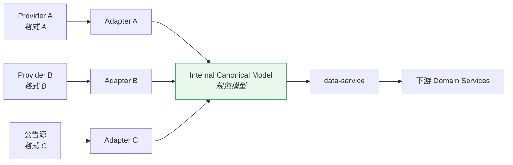
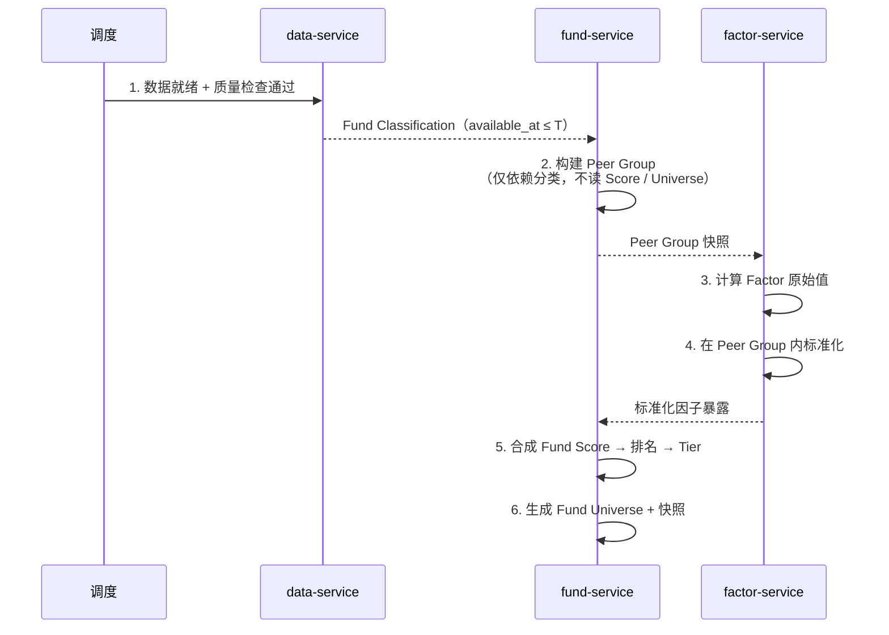
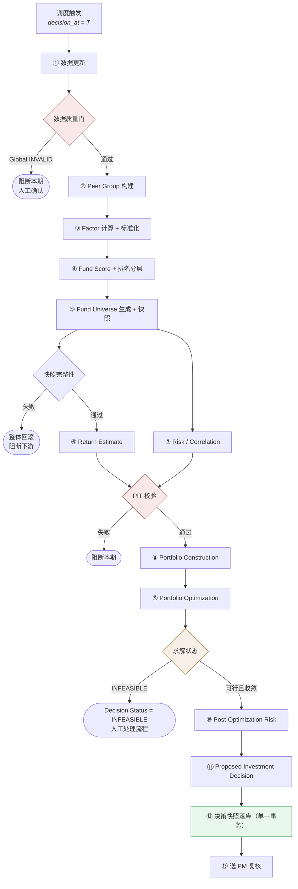
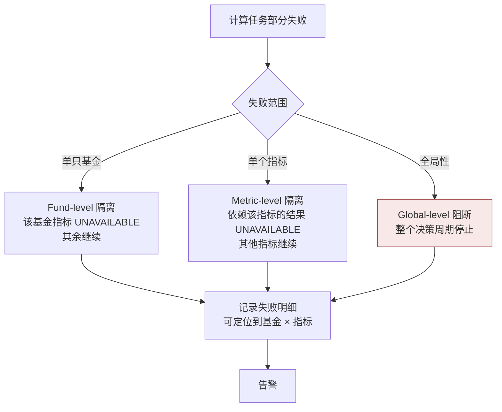
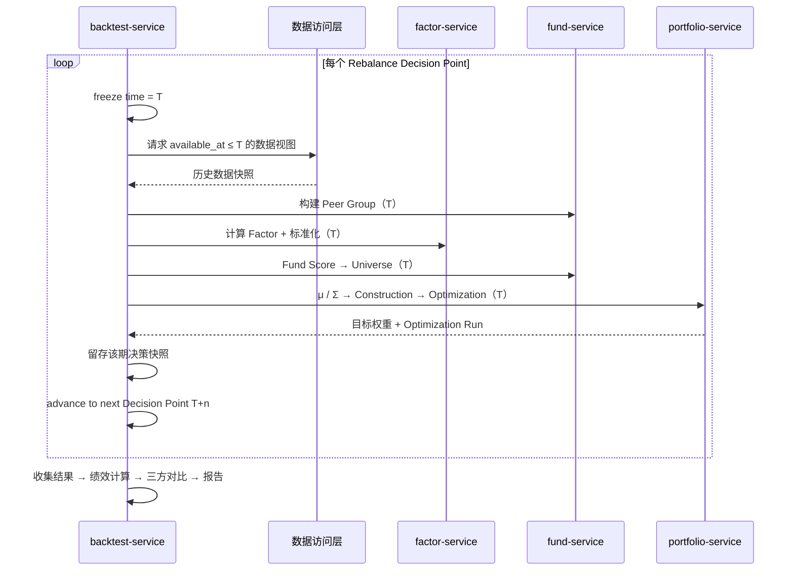
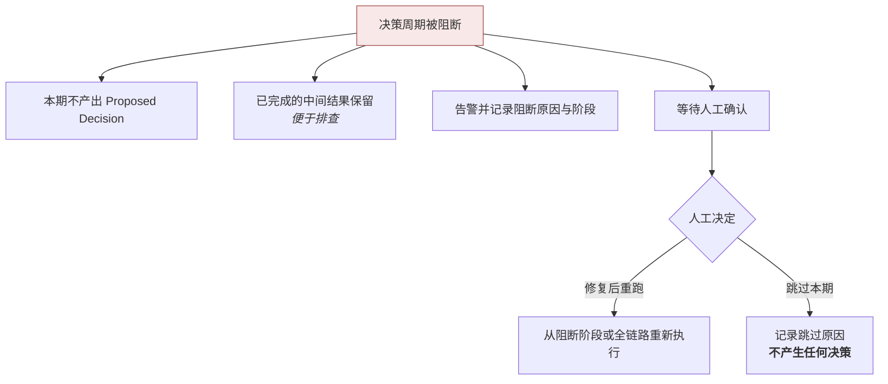

# 集成架构 · Integration Architecture

> 上游文档：docs/01-product/01-product-overview.md（v2.5）｜本文细化环节：支撑层
> 业务需求：docs/01-product/02-business-requirements.md（v2.3）
> 同层上游：docs/02-architecture/01-system-architecture.md（v2.0）、02-service-architecture.md、03-data-architecture.md（v1.1）
>
> **文档版本**：v1.4 ｜ **产品阶段**：第一阶段

---

## 1. 文档目的与边界

### 1.1 本文档回答什么

> **系统怎么协作？** 与外部如何集成，Service 之间如何调用，计算链路如何编排，失败如何处理。

### 1.2 本文档不回答什么

| 不回答 | 归属 |
|---|---|
| 接口路径、请求/响应结构、错误码 | `10-api` |
| 各 Service 的内部职责 | `02-service-architecture` |
| 数据分层与快照设计 | `03-data-architecture` |
| 部署拓扑与资源配置 | `05-deployment-architecture` |
| 具体中间件产品 | `06-technology-stack` |
| 告警规则与运维手册 | `12-operations` |

> 本文档描述**集成模式与协作时序**，不描述接口契约与技术产品。

---

## 2. External Integration

### 2.1 外部依赖

| 类型 | 内容 | 频率 |
|---|---|---|
| **Fund Data Providers** | 基金基础信息、净值、规模、费率、经理、持仓 | 日频 |
| **Benchmark / Index Providers** | 指数行情、指数成分 | 日频 |
| **基金公司公告** | 分类调整、经理变更、申赎限制、清盘合并转型 | 事件驱动 |
| **外部执行 / 清算系统** | 成交回报、持仓回报 | 事件驱动 |

### 2.2 Adapter 隔离模式

> **外部系统不得直接影响 Domain Logic。**



### 2.3 Adapter 的职责边界

| Adapter **负责** | Adapter **不负责** |
|---|---|
| 协议与格式转换 | 业务规则判断 |
| 字段映射到规范模型 | 复权计算、指标计算 |
| 数据类型与单位归一 | 数据质量分级 |
| 打上 `available_at`（接收时刻或公告时刻） | `effective_at` 的业务语义解释 |
| 供应商侧异常的识别与上报 | 决定是否阻断决策周期 |

> **关键**：Adapter 只做"翻译"，不做"判断"。质量分级与阻断决策属于 `data-service`——否则同一份数据经不同 Adapter 会得到不同的质量结论。

### 2.4 为什么必须有规范模型这一层

| 若无 Adapter 隔离 | 后果 |
|---|---|
| 供应商字段变更 | 直接穿透到领域服务，改动面不可控 |
| 更换数据源 | 需要修改领域逻辑 |
| 多源并存 | 领域服务需要理解多种格式 |
| 供应商数据修订 | 无统一的版本化入口 |

### 2.5 `available_at` 的确定（v1.4 定案）

> **定案 · 2026-08-27**：`INT-2` 与上游 `TBD-17` 一并关闭。规则由 `03-data/01-data-source` §11 定义，本节规定**集成层的落地职责**。

**`available_at` 不是集成层能单独确定的字段** —— 它是 `max(源头可得时刻, 平台可用时刻)`，后半段取决于校验与仲裁结果，发生在集成层之后。

**集成层的职责边界**：

| 集成层**必须做** | 集成层**不得做** |
|---|---|
| 从 Provider 响应中**提取** `published_at` | **计算** `available_at` |
| 从 Provider 响应中**提取** `provider_available_at` | 在提取不到时**填近似值** |
| **记录** `ingested_at`（平台落库时刻） | 用 `ingested_at` 直接充当 `available_at` |
| 提取不到时**如实留空** | 用当前时间默认填充任何时间字段 |

```
Adapter 提取三个原始时间
        ↓
校验与仲裁完成
        ↓
available_at = max(源头可得, 平台可用)  ← 在数据层解析，不在集成层
availability_quality = EXACT / DERIVED / INFERRED
```

> **为什么「如实留空」比「填近似值」重要**：`availability_quality` 的三档区分完全依赖于「哪些字段真的拿到了」。Adapter 若在拿不到 `provider_available_at` 时自行填入 `ingested_at`，下游会把它判为 `EXACT` —— **一个 `INFERRED` 的时点被当成精确值参与 PIT 判定**，且再无办法察觉。

**逐类数据的提取预期**：

| 数据类型 | 通常可提取到 | 预期 quality |
|---|---|---|
| 定时推送的批量数据 | `ingested_at`；部分供应商带推送时间戳 | `INFERRED` 或 `EXACT` |
| 公告类数据 | `published_at`（公告自带发布时间） | `DERIVED` |
| 供应商修订数据 | 修订版本的推送时刻 | `EXACT` |

`<OPEN-7: 各 Provider 是否提供推送时间戳，需逐源摸底 —— 结论决定上表的实际分布>`

**集成层的两条硬性要求**：

| # | 要求 |
|---|---|
| 1 | 三个时间字段**原样透传**，不做任何加工或推断 |
| 2 | `ingested_at` **不可为空**，且必须是平台侧的真实落库时刻，不得以当前时间在后续环节补填 |

### 2.6 外部执行系统的集成方向


**约束**：

| # | 约束 |
|---|---|
| EXT-1 | 平台**只输出建议，不发起下单**——出站是单向交付，不等待执行结果作为流程前提 |
| EXT-2 | `Live Portfolio` 的实际持仓**来自入站回报**，非平台推算 |
| EXT-3 | 回报缺失或延迟时，持仓状态标记为**待确认**，不以目标权重冒充实际权重 |

---

## 3. Service-to-Service Integration

### 3.1 五种集成模式及其适用场景

| 模式 | 适用场景 | 本系统的使用 |
|---|---|---|
| **Synchronous Call** | 需要立即结果、调用链短、失败需即时反馈 | 交互式查询、配置校验、解释链下钻 |
| **Scheduled Batch** | 周期性大批量计算，有明确时间窗 | **主要模式**——每日决策链路 |
| **Asynchronous Job** | 长时间运行、可等待 | 回测执行、历史全区间回算 |
| **Event-driven** | 外部事件触发 | 成交回报、公告到达、Rebalance Trigger |
| **On-demand Batch** | 用户触发的批量重算 | 配置调整后的重算 |

### 3.2 集成模式的选择原则

> **不要在没有业务必要时为了"微服务化"引入大量异步消息。**

| 原则 | 说明 |
|---|---|
| INT-1 | 决策链路的主干采用**顺序批量**，不采用事件驱动——链路有严格的顺序依赖，事件驱动会让顺序保证变得脆弱 |
| INT-2 | 只有**真正异步**的场景（回测、外部回报）才使用异步模式 |
| INT-3 | 同步调用只用于**短链路**——不得出现跨 3 个以上服务的同步调用链 |
| INT-4 | 服务间传递**大体积中间产物**（如协方差矩阵）时，通过数据层引用而非调用参数传递 |

### 3.3 Peer Group 的调用时序（关键）

`factor-service` 与 `fund-service` 之间存在双向依赖，需要明确时序以证明不构成循环：



> **依赖是双向的，但时序是单向的**：Peer Group 在因子标准化之前产出，评分在标准化之后。只要 Peer Group 的构建不读取 Score 或 Universe，就不存在循环（`FR-PEER-001` BR-1）。

---

## 4. Calculation Pipeline

### 4.1 决策日主链路



### 4.2 触发条件

| 触发源 | 条件 | 启动阶段 |
|---|---|---|
| **定时调度** | 决策日到达且数据就绪 | ① 全链路 |
| **Rebalance Trigger · Periodic** | 调仓周期到期 | ① 全链路 |
| **Rebalance Trigger · Drift** | 权重偏离超阈值 | ⑥ 起（Universe 与 Score 不重算） |
| **Rebalance Trigger · Eligibility Event** | 成分基金失去可投资性 | ⑤ 起 |
| **Rebalance Trigger · Constraint Breach** | 触碰约束上限 | ⑧ 起 |
| **配置变更** | 用户触发重算 | 视变更范围而定 |

> **重算范围由触发类型决定，且不得在运行时动态调整**（`FR-REBAL-001` BR-2）。集成层必须把触发类型作为流水线的入参，而非让各阶段自行判断是否需要重算。

### 4.3 顺序依赖

| 阶段 | 必须在其之后 | 原因 |
|---|---|---|
| Peer Group | 数据质量门通过 | 分类数据必须可信 |
| Factor 标准化 | Peer Group 就绪 | 标准化范围由 Peer Group 定义 |
| Fund Score | Factor 标准化完成 | —— |
| Fund Universe | Fund Score + Investment Eligibility 就绪 | —— |
| Return Estimate / Risk | Universe 快照落库 | 估计范围由 Universe 定义 |
| Construction | μ 与 Σ 均就绪 | 四要素装配需要两者 |
| Optimization | Construction 完成 | 求解需要形式化问题 |
| Post-Opt Risk | Optimization 产出 `w` | **数学依赖**——无 `w` 则风险贡献不存在 |
| 决策快照 | 以上全部完成 | 快照需包含全链路结果 |

> **Return Estimate 与 Risk / Correlation 可并行**——两者逻辑独立（收益估计不得由风险指标反推，风险估计不依赖收益估计结果）。

### 4.4 幂等性

> 全部批量计算阶段必须**幂等**——重复执行同一 `(decision_at, version 组合)` 不产生重复或冲突结果。

| 阶段 | 幂等实现要点 |
|---|---|
| 数据更新 | 按 `version` 去重，重复到达的同版本数据不产生新记录 |
| Factor / Score / Universe | 以 `(decision_at, Strategy Version)` 为幂等键；重复执行覆盖同键结果或直接跳过 |
| Optimization | 相同输入必然相同输出（固定随机种子与求解器版本），重复执行结果一致 |
| 决策快照 | 同键快照已存在时拒绝重复写入，避免产生两份"当期决策" |

### 4.4.1 执行状态与决策状态的区分

一次流水线执行有两个维度的状态（`01-system-architecture` §10.5）：

| 维度 | 取值 | 说明 |
|---|---|---|
| **Execution Status** | `RUNNING` / `COMPLETED` / `BLOCKED` / `FAILED` / `CANCELLED` | 本次执行的技术状态 |
| **Decision Status** | 上游定义的 7 态 | 仅在 Execution `COMPLETED` 时产生 |

> `BLOCKED`（数据阻断）与 `FAILED`（系统故障）**不产生任何 Decision**——它们不是"失败的决策"，而是"没有决策"。这直接决定了下方的重试策略。

### 4.4.1 执行状态与决策状态的区分

一次流水线执行有两个维度的状态（`01-system-architecture` §10.5）：

| 维度 | 取值 | 说明 |
|---|---|---|
| **Execution Status** | `RUNNING` / `COMPLETED` / `BLOCKED` / `FAILED` / `CANCELLED` | 本次执行的技术状态 |
| **Decision Status** | 上游定义的 7 态 | 仅在 Execution `COMPLETED` 时产生 |

> `BLOCKED`（数据阻断）与 `FAILED`（系统故障）**不产生任何 Decision**——它们不是"失败的决策"，而是"没有决策"。这直接决定了下方的重试策略。

### 4.5 重试策略

| 失败类型 | 重试 | 说明 |
|---|---|---|
| 外部数据源超时 | ✅ 有限次退避重试 | 瞬时故障 |
| 内部服务调用超时 | ✅ 有限次重试 | 幂等前提下安全 |
| 部分基金计算失败 | ✅ 仅重试失败项 | Fund-level 隔离 |
| 数据质量 INVALID | ❌ 不重试 | 重试不会让数据变好——需人工介入 |
| **优化 INFEASIBLE** | ❌ **不重试** | **业务结果，非系统故障** |
| PIT 校验失败 | ❌ 不重试 | 逻辑错误，重试无意义 |
| 快照写入冲突 | ❌ 不重试 | 说明已有当期决策，重复执行是错误 |

> **区分"故障"与"业务结果"是重试策略的核心**。把 `INFEASIBLE` 当故障重试，会掩盖约束设置过紧这一真实问题，且浪费计算资源。

### 4.6 部分失败处理



**要求**：失败明细必须可定位到**具体对象级别**（哪只基金、哪个指标、哪个阶段），而非整批标记失败（`NFR-REL-001` REL-3）。

---

## 5. Backtest Integration

### 5.1 时间冻结循环



### 5.2 时间冻结的实现要求

| # | 要求 |
|---|---|
| BT-1 | `decision_at = T` 由 `backtest-service` **注入到数据访问层**，领域服务无感知——它们不知道自己运行在回测还是实盘 |
| BT-2 | 领域服务的代码路径**完全相同**，差异仅在注入的时点与数据源 |
| BT-3 | `T+n` 中的 `n` 由 Rebalance Trigger 类型决定，**不是固定步长** |
| BT-4 | 每期快照与实盘快照**同构**——保证回测可复现且可与实盘对比 |
| BT-5 | **快照优先**——优先读取当期已固化的 Peer Group / Universe 快照；快照缺失且 PIT 数据完整时才重建并标记；PIT 数据不完整则中止（`01-system-architecture` §11.4） |
| BT-5 | **快照优先**——优先读取当期已固化的 Peer Group / Universe 快照；快照缺失且 PIT 数据完整时才重建并标记；PIT 数据不完整则中止（`01-system-architecture` §11.4） |

### 5.3 这如何落实"单一策略实现"

```
Live Runtime：    decision_at = 今天，数据视图 = 实时数据
Backtest Runtime：decision_at = T，  数据视图 = available_at ≤ T

           ↓ 两者注入不同参数，调用完全相同的领域服务 ↓

                  Strategy Domain Logic
```

> **领域服务中不应存在任何"是否回测"的判断分支**。若出现 `if (is_backtest)` 形式的策略逻辑分叉，即违反上游 §5.4（`NFR-MAINT-002` MAINT-6）。

### 5.4 允许的差异

| 允许 | 不允许 |
|---|---|
| 数据获取实现不同（历史视图 vs 实时视图） | 因子计算逻辑不同 |
| 日志与监控标签不同 | 评分权重不同 |
| 回测不产生实盘指令 | 优化目标或约束处理不同 |
| 回测可批量并行多期 | Universe 构建规则不同 |

---

## 6. Failure Handling

### 6.1 七类失败场景

| 场景 | 处理策略 | 是否阻断 |
|---|---|---|
| **External API unavailable** | 有限次退避重试；超限则标记该批次未到达并告警；**不使用陈旧数据冒充当期** | 视数据重要性——关键数据 Global 阻断 |
| **Partial data** | 按三级粒度隔离（Fund / Metric / Global） | 仅 Global 级阻断 |
| **Calculation failure** | 幂等重试；失败明细定位到对象级 | 部分失败不阻断，Global 失败阻断 |
| **Service timeout** | 有限次重试；持续超时则中止本期并告警 | 主链路超时阻断 |
| **Duplicate execution** | 幂等键拦截；快照同键冲突时**拒绝写入** | 不阻断（正确行为） |
| **Stale data** | PIT 校验拦截——`available_at > decision_at` 的数据被排除 | 若导致必需数据缺失则阻断 |
| **Version mismatch** | 拒绝执行并报告版本冲突 | **阻断** |

### 6.2 Version Mismatch 的特殊性

> 版本不匹配**必须阻断，不得容忍**。

场景举例：

```
回测请求指定 Strategy Version = 2.1.0
但其中的 Scoring Version 已被删除或变更

→ 拒绝执行，报告版本不可用
→ 不得回退到"最接近的版本"或"当前版本"
```

理由：用错误版本产出的结果看似正常，但与请求的语义不符，且这类错误在结果中不可见——直接破坏 `NFR-REPRO-001`。

### 6.3 决策周期的阻断语义



**关键**：阻断后**不得**自动降级产出一个"尽力而为"的决策。宁可本期不调仓，也不产出基于残缺输入的决策（上游 原则五）。

### 6.4 人工介入的三个卡点

| 卡点 | 触发 | 人工可选动作 |
|---|---|---|
| **数据质量 Global 阻断** | 全局性数据问题 | 修复后重跑 / 跳过本期 |
| **优化 INFEASIBLE** | 约束冲突无解 | 调整约束（升版本）/ 调整 Universe（升版本）/ 沿用上期（显式声明）/ 中止本期 |
| **PM Review** | 正常流程 | Approve / Reject / Override（五字段留痕） |

> 三个卡点的共同特征：**系统停下来等人，而不是自己选一条路走下去**。

---

## 7. Summary

集成架构的四个要点：

1. **Adapter 隔离外部** —— 外部格式变化不穿透领域层；Adapter 只翻译不判断
2. **主链路用顺序批量，不用事件驱动** —— 链路有严格顺序依赖，事件驱动会让顺序保证变脆弱
3. **回测通过注入 `decision_at` 复用领域服务** —— 领域服务不知道自己在回测还是实盘，这是单一策略实现的落地方式
4. **区分故障与业务结果** —— `INFEASIBLE` 不重试；阻断后不自动降级，停下来等人

---

## 8. Decisions

| # | 决策 | 理由 |
|---|---|---|
| D-1 | 主链路采用顺序批量而非事件驱动 | 链路有严格顺序依赖（如 Post-Opt Risk 数学上必须在 Optimization 之后），事件驱动会让顺序保证依赖于消息投递语义 |
| D-2 | Adapter 只做格式转换，不做质量分级 | 否则同一份数据经不同 Adapter 会得到不同质量结论 |
| D-3 | `decision_at` 由 backtest-service 注入数据访问层，领域服务无感知 | 落实单一策略实现——领域代码中不出现回测判断分支 |
| D-4 | `INFEASIBLE` 与数据 `INVALID` 均不重试 | 前者是业务结果，后者重试不会让数据变好；重试会掩盖真实问题 |
| D-5 | Version Mismatch 必须阻断，不回退到近似版本 | 用错版本的结果看似正常但语义错误，且在结果中不可见 |
| D-6 | Return Estimate 与 Risk / Correlation 并行执行 | 两者逻辑独立，无依赖关系 |
| D-7 | 大体积中间产物通过数据层引用传递，不作为调用参数 | 协方差矩阵等体积大、生命周期短，跨服务传输代价高 |

---

## 9. Constraints

| # | 约束 | 来源 |
|---|---|---|
| C-1 | 外部系统不得直接影响 Domain Logic | 提示词 §14.2 |
| C-2 | `available_at` 不可为空，不得以当前时间默认填充 | 上游 §4.2 ①-PIT |
| C-3 | 领域服务中不得存在"是否回测"的策略逻辑分支 | 上游 §5.4 |
| C-4 | 重算范围由触发类型决定，不得运行时动态调整 | `FR-REBAL-001` |
| C-5 | 阻断后不得自动降级产出决策 | 上游 原则五 |
| C-6 | 平台不发起下单，只交付建议 | 上游 §6.2 |
| C-7 | 决策快照同键冲突时拒绝写入 | `03-data-architecture` C-1 |

---

## 10. TBD

| # | 事项 | 归属 |
|---|---|---|
| INT-1 | 各类外部数据源的具体接入协议与频率 | `03-data` |
| ~~INT-2~~ | ~~各数据类型 `available_at` 的取值规则~~ —— **已定案**：集成层只提取三个原始时间并如实留空，`available_at` 在数据层解析（§2.5） | ✅ 已定案 2026-08-27 |
| INT-3 | 重试次数、退避间隔、超时阈值 | `12-operations`（NFR-2 相关） |
| INT-4 | 外部执行系统的回报格式与对接方式 —— **API 侧契约要求已由 `10-api/01-api-overview` §23 给出**（回报须可关联指令、须支持部分成交、须区分「未回报」与「回报为零」）；**格式规范化仍待 `03-data` 定义** | `03-data`（部分已落案） |
| INT-5 | 回测中某期 `INFEASIBLE` 时的默认处理策略 —— **已由 `08-backtest/01-backtest-engine` §18 落案：默认中止回测** | ✅ 已落案 |

---

## 11. Related Documents

| 关系 | 文档 |
|---|---|
| **上游** | `01-product/01-product-overview.md` v2.4、`01-product/02-business-requirements.md` v2.3 |
| **同层** | `01-system-architecture`、`02-service-architecture`（服务职责）、`03-data-architecture`（PIT 与快照）、`05-deployment-architecture`（调度与工作负载） |
| **下游** | `03-data`（数据接入）、`08-backtest`（回测执行）、`10-api`（接口契约）、`12-operations`（重试与告警） |

---

## 12. 变更记录

| 版本 | 日期 | 变更内容 | 上游依赖 |
|---|---|---|---|
| **v1.4** | 2026-08-27 | **`INT-2` 关闭**。§2.5 重写 —— 明确 `available_at` **不是集成层能单独确定的字段**；集成层职责收敛为「提取 `published_at` / `provider_available_at`、记录 `ingested_at`、提取不到时如实留空」，**不得计算 `available_at`、不得填近似值**（否则 `INFERRED` 会被误判为 `EXACT`）；补逐类数据的预期 quality。详见 `TBD-resolution.md` Policy ④ | `03-data/01-data-source` v2.3 |
| v1.3 | 2026-08-27 | `INT-4` 的 API 侧契约要求获 `10-api/01-api-overview` §23 回应：回报须可关联到指令、须支持部分成交、须区分「未回报」与「回报为零」，且 API 必须能表达 `Target`/`Pending`/`Actual` 三态。回报格式的规范化仍属 `03-data` | `10-api/01-api-overview.md` v1.0 |
| v1.2 | 2026-08-26 | `INT-5`（回测中某期 `INFEASIBLE` 的处理）获 `08-backtest/01-backtest-engine` §18 回应：默认中止回测 | `08-backtest` v1.0 |
| v1.1 | 2026-08-25 | **随 01-system-architecture v2.0 同步**。§4.4.1 新增**执行状态与决策状态的区分**（Execution Status 为架构层维度，Decision Status 沿用上游 7 态）；§5.2 BT-5 新增**快照优先**要求 | `01-product-overview.md` v2.4、`01-system-architecture.md` v2.0 |
| v1.0 | 2026-08-25 | 初始版本。确立 Adapter 隔离模式与规范模型层；定义五种集成模式及主链路采用顺序批量的理由；给出 Peer Group 双向依赖的调用时序证明无循环；定义决策日流水线的触发条件、顺序依赖、幂等键与重试策略；明确区分故障与业务结果；回测通过注入 `decision_at` 复用领域服务 | `01-product-overview.md` v2.4、`03-data-architecture.md` v1.0 |