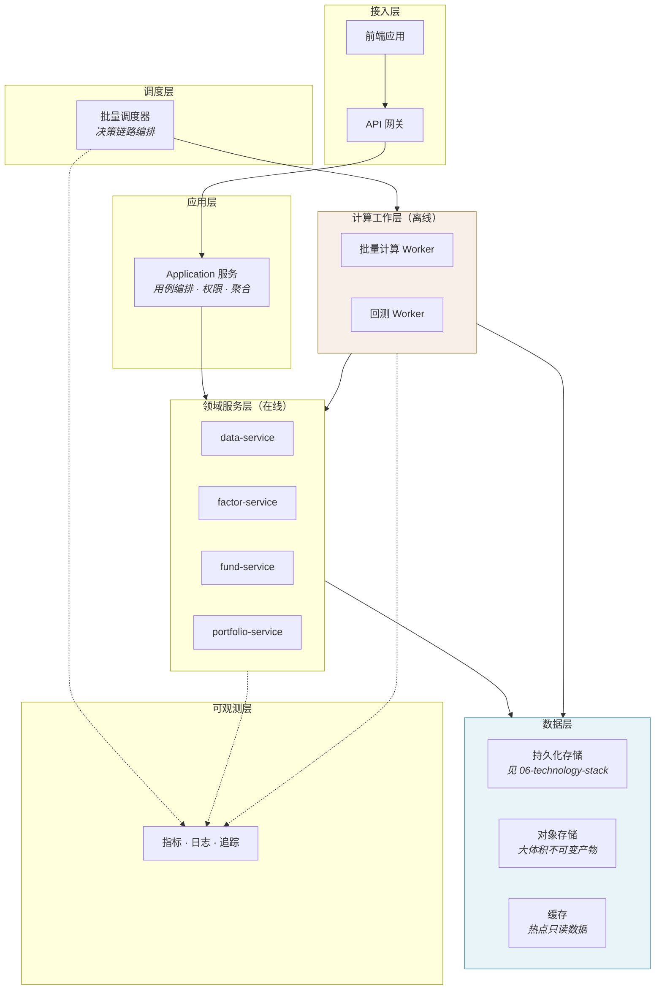

# 部署架构 · Deployment Architecture

> 上游文档：docs/01-product/01-product-overview.md（v2.5）｜本文细化环节：支撑层
> 业务需求：docs/01-product/02-business-requirements.md（v2.3）｜质量要求：docs/01-product/05-non-functional-requirements.md（v1.0）
> 同层上游：docs/02-architecture/01（v2.0）、02～04（v1.1）
>
> **文档版本**：v1.2 ｜ **产品阶段**：第一阶段

---

## 1. 文档目的与边界

### 1.1 本文档回答什么

> **系统怎么运行？** 环境划分、运行时构成、部署单元、工作负载特征、扩展、高可用与灾备。

### 1.2 本文档不回答什么

| 不回答 | 归属 |
|---|---|
| **具体技术产品选型及其论证** | `06-technology-stack` |
| 监控指标、告警规则、运维手册 | `12-operations` |
| 表结构、索引、分区 | `11-database` |
| 服务职责与内部模块 | `02-service-architecture` |
| 集成模式与调用时序 | `04-integration-architecture` |

> 本文档描述**部署形态与运行特征**，产品名称与选型理由属 `06-technology-stack`。

---

## 2. Environment

### 2.1 四类环境

| 环境 | 用途 | 数据 | 关键差异 |
|---|---|---|---|
| **Local** | 开发者本机 | 脱敏样本数据（少量基金 × 短区间） | 单进程运行全部服务；不要求真实调度 |
| **Development** | 集成开发 | 脱敏样本数据 | 完整服务拓扑；调度周期可加速 |
| **Test** | 验收与回归 | **结构完整的历史数据子集** | **必须支持完整回测**——否则无法验证可复现性 |
| **Production** | 生产运行 | 全量数据 | 完整 SLA、备份与灾备 |

### 2.2 Test 环境的特殊要求

> Test 环境**必须能够执行完整回测**，而不只是跑通接口。

理由：`NFR-REPRO-001`（可复现性）与 `NFR-MAINT-002`（单一策略实现）的验证方式就是**重跑并比对**。若 Test 环境无法运行完整回测，这两条 P0 质量属性在发布前无法验证，只能在生产暴露。

因此 Test 环境的数据必须：结构完整（含清盘基金、修订版本、公告时点）、区间足够（至少覆盖一次完整 IS/OOS 划分）、**PIT 语义完整**（`available_at` 真实而非批量补填）。

### 2.3 环境间的配置隔离

| 隔离项 | 要求 |
|---|---|
| 策略配置版本 | 各环境独立；生产版本不得被非生产环境修改 |
| 数据源凭据 | 各环境独立，**不得明文存于配置或日志**（`NFR-SEC-003`） |
| 调度周期 | 非生产环境可加速，但**不得改变决策链路的顺序依赖** |

---

## 3. Runtime Architecture

### 3.1 运行时构成



### 3.2 在线与离线的分离

> **这是本系统部署架构最重要的一条分界。**

| | 在线负载 | 离线计算负载 |
|---|---|---|
| 触发 | 用户请求 | 调度 / 事件 |
| 时长 | 亚秒至秒级 | 分钟至小时级 |
| 资源特征 | 低 CPU、高并发、要求低延迟 | **高 CPU、大内存、大批量 IO** |
| 失败影响 | 单次请求失败 | 整个决策周期受阻 |
| 扩展驱动 | 并发用户数 | 基金数 × 因子数 × 期数 |

**部署要求**：

| # | 要求 |
|---|---|
| RT-1 | 批量计算与回测**必须与在线服务资源隔离**——回测的高 CPU 占用不得拖慢用户查询 |
| RT-2 | 回测 Worker 与批量计算 Worker **分池**——回测是可延迟的探索性工作，批量计算是有时间窗的生产任务，两者优先级不同 |
| RT-3 | 领域服务同时被在线请求与 Worker 调用时，需区分调用来源以便限流与观测 |

### 3.3 `backtest-service` 的运行形态

`backtest-service` 不是常驻的在线服务，而是**长时任务的编排器 + Worker 池**：

```
回测提交（在线，轻量）  →  任务队列  →  回测 Worker（离线，重负载）
                                          ↓
                                    调用领域服务
```

> 回测 Worker 可以按需伸缩至 0——没有回测任务时不占用资源。这是它与生产链路服务的关键差异。

---

## 4. Service Deployment

### 4.0 Domain Service 与部署单元的关系

> **5 个 Domain Service 是逻辑领域边界，其部署形态由本文档决定**（`01-system-architecture` §3）。

| 事实 | 说明 |
|---|---|
| 逻辑边界数量 | 固定 5 个——由 `02-service-architecture` 定义，本文档不改变 |
| 部署单元数量 | **可以不等于 5**——多个 Domain Service 可部署为同一进程，也可拆为多个 |
| 数据库 | 第一阶段**共享同一实例**（`06-technology-stack` §4），这是决策快照单事务写入的前提 |

下表描述的是各 Domain Service 的**运行特征**，据此决定部署编组，而非规定必须独立部署。

### 4.1 部署特征总表

| Service | 部署单元 | 伸缩单元 | 有/无状态 | CPU / 内存特征 | Worker 需求 | Batch 需求 |
|---|---|---|---|---|---|---|
| `data-service` | 在线实例 + 采集 Worker | 按分片并行 | 无状态（状态在数据层） | 中 CPU / 中内存；IO 密集 | ✅ 采集与标准化 | ✅ 每日批量 |
| `factor-service` | 在线实例 + 计算 Worker | 按基金/因子分片 | 无状态 | **高 CPU / 中内存** | ✅ 因子计算 | ✅ 每日全量 + 历史回算 |
| `fund-service` | 在线实例 + 计算 Worker | 按 Peer Group 分片 | 无状态 | 中 CPU / 中内存 | ✅ 评分与 Universe | ✅ 每决策时点 |
| `portfolio-service` | 在线实例 + 计算 Worker | **按组合/策略分片** | 无状态 | **高 CPU / 高内存**（协方差与求解） | ✅ 估计与优化 | ✅ 每决策时点 |
| `backtest-service` | 提交端 + 回测 Worker 池 | 按回测任务并行 | 无状态 | **高 CPU / 高内存 / 长时** | ✅ 主要形态 | ✅ 异步长任务 |

### 4.2 无状态的含义与边界

全部领域服务设计为**无状态**——实例可随时替换，状态全部在数据层。

但有两处需要注意：

| 场景 | 说明 |
|---|---|
| **长时回测任务** | 任务进度是状态，但存于数据层而非 Worker 内存；Worker 崩溃后可从最近完成的决策时点恢复（`FR-BT` 幂等要求） |
| **批量计算的中间产物** | 协方差矩阵等大体积中间结果，在单次流水线内可驻留内存，但**跨阶段传递必须落数据层**（`04-integration-architecture` D-7） |

### 4.3 `portfolio-service` 的资源特殊性

`portfolio-service` 是资源需求最高的服务，原因：

| 计算 | 复杂度 | 资源含义 |
|---|---|---|
| 协方差矩阵 | **O(N²)**，N = Universe 规模 | 内存随 Universe 平方增长 |
| 优化求解 | 与 N 及约束数量相关 | CPU 密集，单次求解不可并行拆分 |
| Post-Opt Risk | O(N²)（MRC/TRC 计算） | 同协方差 |

> **必须明确单次优化可支持的最大 Universe 规模**，超出时**显式拒绝并提示**，不得静默截断 Universe（`NFR-SCALE-002`）。截断会让实际优化范围与快照记录的 Universe 不一致，破坏可复现性。

`<TBD-DEP-1: 单次优化的最大 Universe 规模待压测确定>`

---

## 5. Data Infrastructure

> **本节描述存储能力要求与部署形态，具体产品选型及论证见 `06-technology-stack`。**

### 5.1 按能力划分的存储需求

| 能力 | 承载数据 | 关键要求 |
|---|---|---|
| **关系型事务存储** | 决策快照、Universe 快照、Peer Group 快照、组合持仓、全部配置与版本、审计记录 | **强一致 · 事务 · 版本管理 · 不可篡改审计** |
| **时序 / 明细存储** | 净值序列、因子值明细、回测逐期结果 | 日频追加 · 按时间范围批量扫描 |
| **对象存储** | 大体积不可变产物（回测中间结果、报告归档） | 一次写入多次读取 |
| **缓存** | 热点只读数据（历史数据天然不可变） | 可失效重建，非权威来源 |
| **任务调度** | 决策链路编排、回测任务队列 | 顺序依赖保证、失败可重试 |

### 5.2 第一阶段的存储部署决策方向

> **第一阶段应论证「单一关系型数据库是否已经足够」，而不是默认引入独立的列存 / 时序数据库。**

**依据一 · 数据规模**——按中国公募约 1.2 万只基金、日频、10 年历史估算：

| 数据 | 行数估算 | 体量 |
|---|---|---|
| 净值序列 | 12,000 × 250 × 10 ≈ 3,000 万行 | ~1.5 GB |
| 因子值明细（50 因子） | 12,000 × 50 × 250 × 10 ≈ 1.5 亿行 | ~6 GB |
| Fund Score 历史 | ≈ 3,000 万行 | ~2 GB |
| 协方差 / 相关性矩阵 | 每决策时点一份，可整体序列化 | 可忽略 |
| 回测结果 | ≈ 400 万行 | ~0.3 GB |

总量在**十亿行以内、几十 GB 级**。基金是日频数据，比 tick 级小三到四个数量级，尚未进入列存的实际收益区间。

**依据二 · 一致性约束**（更关键）：

上游 §8.4 规定了一条不可权衡的产品级约束——

> 决策快照必须处于**同一个一致性边界**内，能够在**单一事务**中完整写入。

若把快照的明细与元信息拆到两套存储，就需要分布式事务或补偿机制来维持"全有或全无"语义。**这份复杂度直接威胁 `NFR-REPRO-001` 与 `NFR-AUDIT-001` 两项 P0 质量属性**——为了一个当前用不上的性能优势，引入直接损害核心质量的复杂度，是不划算的交易。

### 5.3 重评估触发条件

选定方案后必须明确**何时重新评估存储架构**：

```
因子数量从 ~50 增至 500+          明细行数进入十亿级
引入分钟级 / tick 级数据          频率跃升三个数量级
引入 ML 特征工程（Phase 3）        派生特征爆炸式增长
需支撑大量并发的即席聚合分析       关系型数据库的 OLAP 短板
单表超 10 亿行且分区后仍不达标     进入列存的实际收益区
```

第一阶段是纯 Quant 基线，上述条件均不成立。

### 5.4 存储的部署形态要求

| 要求 | 说明 |
|---|---|
| 主从复制 | 读写分离；分析型查询走从库，不影响决策链路写入 |
| 时间分区 | 时序类数据按时间分区，支持按 `decision_at` 范围高效扫描与老数据归档 |
| 备份 | 见 §9 |
| 连接池隔离 | 在线查询与批量计算使用独立连接池，避免批量作业耗尽连接 |

---

## 6. Batch / Calculation Workload

### 6.1 五类批量负载

| 负载 | 频率 | 并行方式 | 资源特征 |
|---|---|---|---|
| **数据采集与标准化** | 每日 | 按数据源/基金分片 | IO 密集 |
| **Factor 计算** | 每日全量 | 按基金或因子分片 | **CPU 密集**，系统中量最大 |
| **Historical Rolling 计算** | 按需 | 按基金分片 | CPU 密集，窗口滑动 |
| **Risk / Correlation 计算** | 每决策时点 | **难以拆分**（矩阵整体计算） | **CPU + 内存密集** |
| **Backtest** | 按需 | 按回测任务并行；单任务内按期串行 | **长时 + 高资源** |

### 6.2 并行边界

> 不是所有批量负载都可以无限并行。

| 负载 | 可并行度 | 限制原因 |
|---|---|---|
| Factor 计算 | **高**——基金间独立 | 无 |
| 评分与排名 | **中**——Peer Group 内需完整样本 | 分位排名需要组内全部成员就位 |
| 协方差计算 | **低**——矩阵整体计算 | N×N 矩阵不易拆分 |
| 优化求解 | **无**——单次求解不可拆 | 求解器内部串行 |
| 回测单任务 | **无**——期间有时间顺序 | T 期结果影响 T+n 期持仓 |
| 回测多任务 | **高**——任务间独立 | 无 |

**部署含义**：优化求解与协方差计算是**纵向扩展**（单实例更强）而非横向扩展的场景；因子计算与多回测并行则相反。

### 6.3 决策日的时间窗

决策日链路存在**硬性时间窗**——从数据就绪到决策产出必须在既定时间内完成。

```
数据到达  →  质量检查  →  Peer Group  →  Factor  →  Score
         →  Universe  →  μ / Σ  →  Construction  →  Optimization
         →  Post-Opt Risk  →  快照落库  →  送审
```

**部署要求**：

| # | 要求 |
|---|---|
| BW-1 | 决策日链路的资源优先级**高于**回测与探索性计算 |
| BW-2 | 链路各阶段的耗时必须可观测，便于定位瓶颈 |
| BW-3 | 时间窗内未完成时告警，而非静默延后 |

`<TBD-DEP-2: 决策日各阶段的时间窗与端到端目标待确认（NFR-2）>`

---

## 7. Scalability

> **必须区分四类扩展维度，不得笼统声称"可自动扩容"。**

### 7.1 API Scalability

| 项 | 说明 |
|---|---|
| **扩展驱动** | 并发用户数、查询复杂度 |
| **扩展方式** | 横向——无状态服务多副本 |
| **瓶颈** | 数据层读连接、复杂解释链查询 |
| **应对** | 读写分离；历史数据缓存（天然不可变） |

### 7.2 Calculation Scalability

| 项 | 说明 |
|---|---|
| **扩展驱动** | 基金数 × 因子数 × 时间点数 |
| **扩展方式** | 横向——按分片并行（因子计算） |
| **瓶颈** | **协方差与优化求解不可横向拆分** |
| **应对** | 因子计算横向扩展；协方差与求解**纵向扩展**（更大内存/更强单核） |

> 这是一处容易误判的地方：整体上"计算可水平扩展"是对的，但链路末端的优化求解**只能纵向扩展**。若按统一假设做容量规划，会在优化环节遇到无法通过加机器解决的瓶颈。

### 7.3 Backtest Scalability

| 项 | 说明 |
|---|---|
| **扩展驱动** | 并发回测数 × 单次回测的期数 |
| **扩展方式** | 横向——回测任务间独立 |
| **瓶颈** | 单次回测内期间串行，无法压缩；历史数据读取带宽 |
| **应对** | Worker 池按需伸缩（可缩至 0）；与生产链路资源隔离 |

### 7.4 Storage Scalability

| 项 | 说明 |
|---|---|
| **扩展驱动** | 基金数 × 历史年限 × 因子数 |
| **扩展方式** | 时间分区 + 老数据归档；读副本分担分析查询 |
| **瓶颈** | 单表行数增长（因子明细为主） |
| **应对** | 按时间分区；冷数据归档至对象存储；见 §5.3 重评估条件 |

### 7.5 扩展性的非目标

> 第一阶段**不追求**弹性伸缩的自动化程度。

批量计算有明确的时间窗与可预测的负载曲线，容量可按峰值静态规划。过早引入复杂的自动伸缩机制会增加故障面，而收益有限。

---

## 8. High Availability

### 8.1 分级可用性目标

> 在线服务与批量服务**不适用同一可用性目标**（`NFR-AVAIL-002`）。

| 类别 | 可用性度量方式 | 目标 |
|---|---|---|
| 在线查询服务 | 可用时间占比 | `<TBD: NFR-5>` |
| 批量计算服务 | **按时完成率** | `<TBD: NFR-2>` |
| 决策日关键路径 | 时间窗内完成率 | 高于非关键路径 |

### 8.2 故障场景与应对

| 故障 | 影响 | 应对 |
|---|---|---|
| **在线服务实例故障** | 部分请求失败 | 多副本 + 健康检查自动摘除；无状态可随时替换 |
| **Worker 故障** | 该批任务中断 | 任务可重新调度；幂等保证重复执行安全 |
| **数据层主节点故障** | **写入不可用，决策链路阻断** | 主从切换；切换期间**宁可阻断也不降级写入** |
| **数据层从节点故障** | 分析查询受影响 | 读请求转主库（限流）或其他从库 |
| **调度器故障** | 批量任务不触发 | 调度器自身高可用；任务状态持久化，恢复后可续跑 |
| **外部数据源不可用** | 当期数据缺失 | 见 `04-integration-architecture` §6.1 |

### 8.3 决策日的降级原则

> **决策日链路不提供"降级产出"。**

若关键组件故障导致链路无法完成，正确行为是**阻断本期并告警**，而非产出一个基于残缺输入的决策（上游 原则五）。

这与常见的"降级保可用"思路相反，理由：一次错误的调仓决策造成的损失，远大于一期不调仓。

### 8.4 Job Retry 与恢复

| 要求 | 说明 |
|---|---|
| 失败任务**必须被检测到** | 不允许静默失败 |
| 重试遵循**既定策略** | 区分可重试（超时、瞬时故障）与不可重试（INFEASIBLE、数据 INVALID、版本冲突） |
| 重试必须**幂等** | 重复执行不产生重复或冲突结果 |
| 服务重启后**状态可恢复** | 未完成任务的状态不丢失 |

---

## 9. Disaster Recovery

### 9.1 备份对象与恢复目标

| 数据类别 | 备份频率 | RPO | RTO | 优先级 |
|---|---|---|---|---|
| **决策快照与审计记录** | `<TBD>` | `<TBD>` | `<TBD>` | **最高** |
| 策略与配置版本 | `<TBD>` | `<TBD>` | `<TBD>` | **最高** |
| 基金主数据与净值序列 | `<TBD>` | `<TBD>` | `<TBD>` | 高 |
| Peer Group / Universe 快照 | `<TBD>` | `<TBD>` | `<TBD>` | 高 |
| Factor 与 Score 历史 | `<TBD>` | `<TBD>` | `<TBD>` | 中 |
| 回测结果 | `<TBD>` | `<TBD>` | `<TBD>` | 中 |

> **推荐默认 · 2026-08-27**：**RPO ≤ 1 个决策周期，RTO ≤ 4 小时**（同 `NFR-10`）。运维与合规可改。
>
> **依据**：①**决策快照不可丢** —— RPO 以决策周期为界，确保任何已产生的决策都不会因故障消失；②本系统是**内部决策支持**而非实时交易系统，可容忍小时级恢复 —— 决策日内 4 小时的中断会推迟当期决策，但不会造成交易损失。
>
> **保留期限属 Policy C 与 `NFR-9`**，与备份频率是两件事：前者决定「留多久」，后者决定「丢多少」。

### 9.2 为什么决策快照的 RPO 优先级最高

| 数据 | 丢失后果 | 可否重建 |
|---|---|---|
| Factor / Score 历史 | 需重算 | **可重建**（有原始数据与版本） |
| 净值序列 | 需重新采集 | **可重建**（外部数据源仍有） |
| **决策快照与审计记录** | **历史决策永久不可解释** | **不可重建**——快照必须在决策时同步落库，事后无法还原当时的 Human Review 与完整上下文 |
| **配置版本** | 历史决策无法按当时规则重现 | **不可重建**（若已删除） |

> 因此备份策略的重心不在"数据量最大的"，而在**"丢了就再也拿不回来的"**。

### 9.3 恢复验证

> 备份必须**定期验证可恢复性**，而非仅验证备份任务执行成功（`NFR-DR-001` DR-2）。

验证方式：定期从备份恢复到隔离环境，执行一次历史决策的完整重建，比对结果一致性——这同时验证了备份有效性与 `NFR-REPRO-001`。

---

## 10. Summary

部署架构的四个要点：

1. **在线与离线严格分离** —— 批量计算与回测必须与在线服务资源隔离；回测 Worker 与批量 Worker 分池
2. **扩展方式因负载而异** —— 因子计算可横向扩展，但**协方差与优化求解只能纵向扩展**，这是容量规划中最容易误判之处
3. **决策日不提供降级产出** —— 关键组件故障时阻断本期，而非产出基于残缺输入的决策
4. **备份重心是不可重建的数据** —— 决策快照与配置版本优先级最高，因为丢失后无法通过重算恢复

---

## 11. Decisions

| # | 决策 | 理由 |
|---|---|---|
| D-1 | Test 环境必须支持完整回测 | `NFR-REPRO-001` 与 `NFR-MAINT-002` 的验证方式就是重跑比对；否则两条 P0 属性只能在生产暴露 |
| D-2 | 回测 Worker 与批量计算 Worker 分池 | 回测可延迟、批量有时间窗，优先级不同 |
| D-3 | 回测 Worker 可缩至 0 | 无回测任务时不应占用资源 |
| D-4 | 协方差与优化求解采用纵向扩展 | 矩阵整体计算与求解器内部串行，无法横向拆分 |
| D-5 | 超出最大 Universe 规模时显式拒绝，不静默截断 | 截断会使实际优化范围与快照记录不一致，破坏可复现性 |
| D-6 | 决策日链路不提供降级产出 | 一次错误调仓的损失远大于一期不调仓 |
| D-7 | 第一阶段不追求自动弹性伸缩 | 负载可预测，容量可静态规划；过早自动化增加故障面 |
| D-8 | 在线查询与批量计算使用独立连接池 | 避免批量作业耗尽连接影响用户查询 |

---

## 12. Constraints

| # | 约束 | 来源 |
|---|---|---|
| C-1 | 决策快照必须在单一事务内完整写入——影响存储部署形态 | 上游 §8.4 |
| C-2 | 批量计算与回测必须与在线服务资源隔离 | `NFR-PERF` 分类要求 |
| C-3 | 超出优化规模上限时显式拒绝，不截断 Universe | `NFR-SCALE-002` |
| C-4 | 决策日故障时阻断，不降级产出 | 上游 原则五 |
| C-5 | 数据源凭据不得明文存于配置或日志 | `NFR-SEC-003` |
| C-6 | 备份必须定期验证可恢复性 | `NFR-DR-001` |

---

## 13. TBD

| # | 事项 | 关联 NFR | 归属 |
|---|---|---|---|
| DEP-1 | 单次优化可支持的最大 Universe 规模 | NFR-SCALE-002 | 压测 + `06-portfolio` |
| DEP-2 | 决策日各阶段时间窗与端到端目标 | NFR-2 | `12-operations` |
| DEP-3 | 各类数据的备份频率、RPO、RTO | NFR-10 | `12-operations` + 合规 |
| DEP-4 | 各环境的资源规格与副本数 | NFR-6 | `12-operations` |
| DEP-5 | 在线服务可用性目标与维护窗口 | NFR-5 | 产品 + 运维 |

---

## 14. Related Documents

| 关系 | 文档 |
|---|---|
| **上游** | `01-product/01-product-overview.md` v2.4、`01-product/05-non-functional-requirements.md` v1.0 |
| **同层** | `02-service-architecture`（服务特征）、`03-data-architecture`（一致性边界）、`04-integration-architecture`（调度与失败处理）、`06-technology-stack`（选型） |
| **下游** | `11-database`（分区与归档）、`12-operations`（监控、告警、灾备演练） |

---

## 15. 变更记录

| 版本 | 日期 | 变更内容 | 上游依赖 |
|---|---|---|---|
| **v1.2** | 2026-08-28 | **修正**：§4.0「Domain Service 与部署单元的关系」整节**重复出现两次**，删除重复副本 | — |
| v1.1 | 2026-08-25 | **随 01-system-architecture v2.0 同步**。§4.0 新增 **Domain Service 与部署单元的关系**——逻辑边界数量固定 5 个，部署单元数量可不等于 5，第一阶段共享同一数据库实例 | `01-product-overview.md` v2.4、`01-system-architecture.md` v2.0 |
| v1.0 | 2026-08-25 | 初始版本。四类环境划分并明确 Test 环境必须支持完整回测；在线与离线负载分离；五个 Service 的部署特征表；按能力描述存储需求并给出第一阶段单库论证方向与重评估触发条件；区分四类扩展维度并指出协方差与优化求解只能纵向扩展；决策日不降级原则；备份重心为不可重建数据 | `01-product-overview.md` v2.4、`05-non-functional-requirements.md` v1.0 |