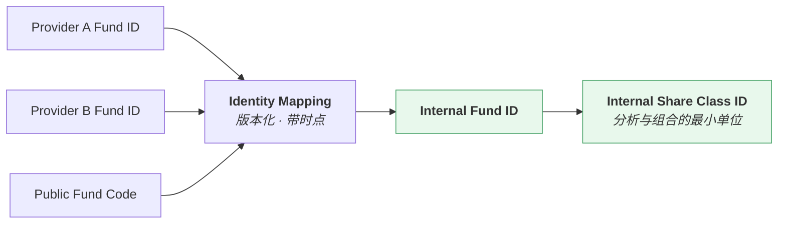
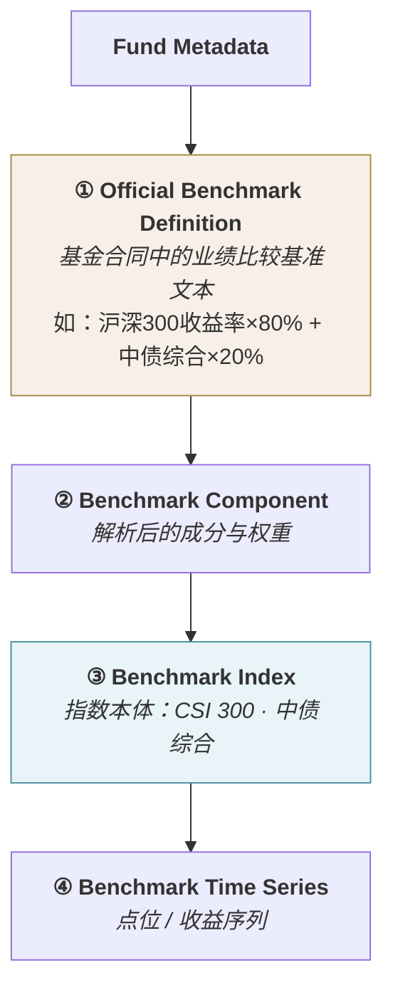
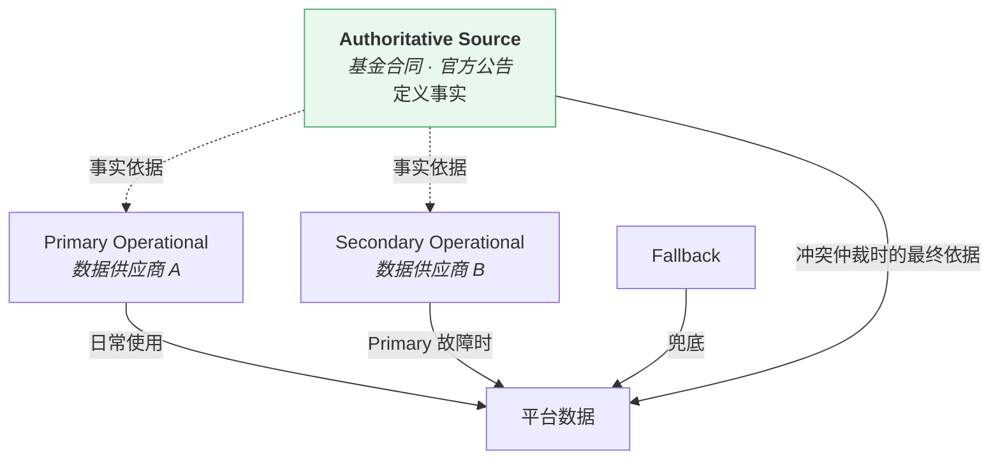
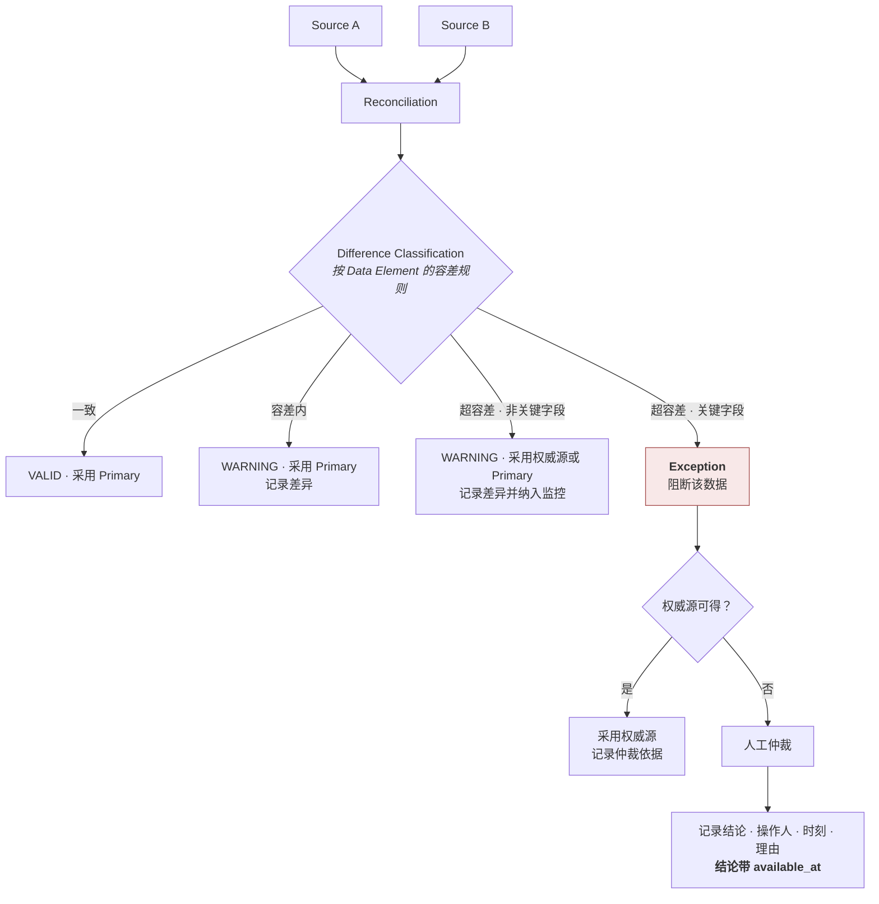
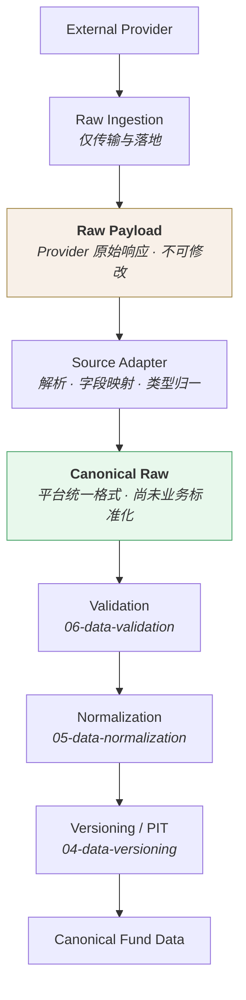
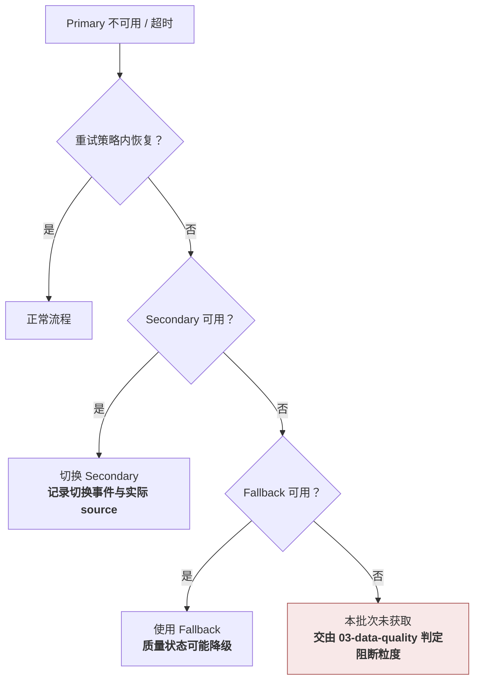
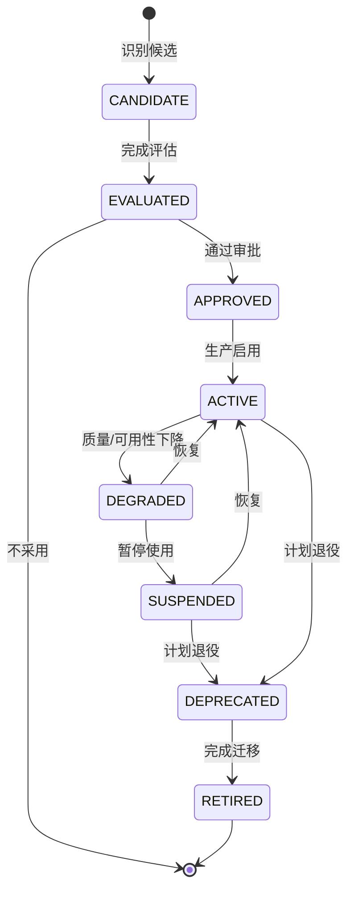

# 数据源 · Data Source

> 上游文档：docs/01-product/01-product-overview.md（v2.5）｜本文细化环节：① Fund Data
> 业务需求：docs/01-product/02-business-requirements.md（v2.3）
> 架构依赖：docs/02-architecture/03-data-architecture.md（v1.1）、docs/02-architecture/04-integration-architecture.md（v1.1）
>
> **文档版本**：v2.4 ｜ **产品阶段**：第一阶段

---

## 1. 文档目的与边界

### 1.1 本文档回答什么

> **系统需要哪些数据集？这些数据集来自哪些 Provider？哪个是权威源？多源冲突如何处理？外部数据以什么形态进入平台？**

### 1.2 本文档不回答什么

| 不回答 | 归属 |
|---|---|
| 数据在业务层面由哪些实体组成 | `02-data-domain-model` |
| **数据本身是否完整、是否异常、缺失比例** | `03-data-quality` |
| 如何保存历史版本与 PIT 查询 | `04-data-versioning` |
| 如何统一口径 | `05-data-normalization` |
| **跨源是否一致的校验执行、业务规则校验** | `06-data-validation` |
| 数据血缘 | `07-data-lineage` |
| 接入协议、重试策略的技术实现 | `02-architecture/04-integration-architecture` |
| 表结构与存储 | `11-database` |

### 1.3 本域七份文档的职责矩阵

> **明确"谁定义什么"，避免七份文档互相重复或留下空白。**

| 主题 | Owner（定义方） | 消费方 |
|---|---|---|
| Provider 登记与能力 | **`01-data-source`** | 全域 |
| Source-of-Truth 与优先级 | **`01-data-source`** | `06-data-validation` |
| Raw Payload / Canonical Raw | **`01-data-source`** | `05-data-normalization`、`07-data-lineage` |
| **`available_at` 的取值规则** | **`01-data-source`** | `04-data-versioning`（定义语义）、`06-data-validation`（校验） |
| Fund Identity Resolution | **`01-data-source`**（映射来源）+ `02-data-domain-model`（内部标识定义） | 全域 |
| 实体与关系 | `02-data-domain-model` | 全域 |
| `effective_at` / `version` 语义 | `04-data-versioning` | 全域 |
| 质量维度、状态、阻断粒度 | `03-data-quality` | `06-data-validation` |
| 差异容差阈值 | `03-data-quality`（分级标准）+ **`01-data-source`（field-level 容差表）** | `06-data-validation` |
| 口径统一规则 | `05-data-normalization` | 全域下游 |
| 校验层级与执行 | `06-data-validation` | —— |
| 血缘与影响分析 | `07-data-lineage` | —— |

### 1.4 Data Source 与 Data Quality / Validation 的职责切分

> 三者容易重叠，此处明确切分：

| 文档 | 负责 |
|---|---|
| **`01-data-source`** | **Provider 层面**：是否可用、是否按时提供、是否故障、是否触发 failover、哪个源权威 |
| **`03-data-quality`** | **数据本身**：是否完整、是否异常、缺失比例、质量状态与阻断粒度 |
| **`06-data-validation`** | **检查执行**：跨源是否一致、业务规则是否正确、校验分几层 |

**举例区分**：

```
"Provider A 今日未推送"          → 01-data-source（Provider 可用性）
"今日 3,600 只基金缺净值"        → 03-data-quality（数据完整性）
"Provider A 与 B 的 NAV 差 0.5%" → 06-data-validation（执行比对）
"NAV 容差应为多少"               → 01-data-source §10.3（field-level 容差表）
```

---

## 2. 术语层级

> **`Data Source`、`Provider`、`Dataset` 不是同一层级**，此前版本混用，此处统一。

| 层级 | 含义 | 举例 |
|---|---|---|
| **Data Domain** | 业务数据大类 | Fund Master、NAV、Characteristics |
| **Dataset** | 域内可独立获取与治理的数据集 | Fee Schedule、Subscription Availability |
| **Data Element** | 数据集内的具体字段 | Management Fee、Subscription Status |
| **Provider** | 提供数据的外部机构 | 数据供应商、交易所、基金公司 |
| **Source** | 某 Provider 提供某 Dataset 的具体来源 | Provider A 的 NAV 接口 |

> **源优先级定义在 Dataset / Data Element 层级，不在 Data Domain 层级**（见 §9）。

---

## 3. Data Domain 与 Dataset 划分

### 3.1 五个 Data Domain、十六个 Dataset

> 划分依据是**数据生命周期特征**，而非业务名称——同一业务名下的数据可能有完全不同的更新频率与治理需求。

#### 3.1.1 Fund Master

| Dataset | 特征 | 关键 Data Element |
|---|---|---|
| **Fund Identity** | 静态 + 映射 | Provider Fund ID、公开代码、Internal Fund ID 映射 |
| **Fund Profile** | 低频变更 | 名称、原始类型、货币、成立日、管理人 |
| **Share Class Registry** | 低频变更 | 份额类别标识、类别属性、与 Fund 的归属关系 |
| **Fund Lifecycle** | **事件型** | 状态、生效日、公告日、后继基金 |

#### 3.1.2 Fund NAV

| Dataset | 特征 | 关键 Data Element |
|---|---|---|
| **Daily NAV** | **日频时序** | 单位净值、累计净值 |
| **Adjusted NAV** | 日频时序（可能由平台计算） | 复权净值 |
| **Distribution** | **事件型** | 除息日、每份金额、发放日 |
| **Share Adjustment** | **事件型** | 拆分/合并比例、生效日 |

#### 3.1.3 Fund Characteristics

> **此前版本把四类特征归为一个 Dataset 是错误的** —— 它们的生命周期完全不同：

| Dataset | 特征 | 关键 Data Element |
|---|---|---|
| **Fund Size** | **周期性数值**（定期披露，滞后显著） | AUM、份额、披露期 |
| **Fee Schedule** | **条款/配置型**（变更需公告） | 管理费、托管费、销售服务费、申赎费（含阶梯） |
| **Subscription Availability** | **高频状态 + 限制值** | 申购状态、限额类型、限额值、生效区间 |
| **Redemption Availability** | **高频状态 + 限制值** | 赎回状态、限制类型、生效区间 |
| **Investment Restrictions** | 规则型 | 最低申购金额、渠道限制、投资者类型限制 |

#### 3.1.4 Fund Manager

| Dataset | 特征 | 关键 Data Element |
|---|---|---|
| **Manager Registry** | 静态 | 经理标识、姓名、从业起始 |
| **Manager Tenure** | **事件型 · 历史序列** | 基金、经理、任职起、离任、**共管关系** |

#### 3.1.5 Market Reference Data

> **本域为 v2.1 补充** —— 由 `04-factor/03-factor-definition` §2.1 发现：`Sharpe`、`Alpha`、`Beta` 均依赖无风险利率（`Sortino` 在 `MAR = R_f` 时间接依赖），但此前的 Dataset 清单中缺失。
> **v2.2 扩写** —— 补全 `Risk-free Rate` 的完整数据模型（上游 v2.5 §5.5）。

| Dataset | 特征 | 关键 Data Element |
|---|---|---|
| **Risk-free Rate** | 时序 · 多曲线（按 `Currency` × `Tenor`） | 见 §3.1.5.1 |

##### 3.1.5.1 Risk-free Rate 数据模型

> **`Risk-free Rate` 是 Market Reference Data，不是基金属性，也不是平台配置。** 它由外部 Provider 观测所得，随市场变化。

| 属性 | 类型 | 说明 |
|---|---|---|
| **`currency`** | 标识 | 币种（如 `CNY` / `USD`）。**不同币种是不同的利率曲线**，不可混用 |
| **`tenor`** | 标识 | 期限（如 `ON` / `1M` / `3M` / `1Y`）。**不同期限是同一曲线上的不同点** |
| **`rate_value`** | 数值 | 利率值 |
| **`quotation_basis`** | 标识 | 报价口径：年化方式（`ACT/365` / `ACT/360` / 交易日口径）与单利/复利 |
| **`effective_at`** | 时点 | 该利率对应的**业务观测日** |
| **`available_at`** | 时点 | 平台**可合法使用**该值的最早时刻（§11） |
| **`version`** | 序号 | 同一 `(currency, tenor, effective_at)` 的修订序号（§12） |
| **`source`** | 标识 | Provider 与原始字段（§8） |

**主键**：`(currency, tenor, effective_at, version)`。

> **`currency` 与 `tenor` 必须是显式属性，不得隐含在"平台默认利率"这种单一序列中。** 一旦平台支持第二个币种的基金，隐含设计将无法扩展，且已有的历史 Factor 无法判断当初用的是哪条曲线。

##### 3.1.5.2 PIT 约束

> **`Risk-free Rate` 与净值一样受 PIT 约束**：`T` 时点的计算必须使用 `available_at ≤ T` 的最大 `version`，而非当前利率。

```
回测在 2023-06-30 计算 Sharpe
    → 必须使用 2023-06-30 当时可得的 R_f
    → 不是今天的 R_f，也不是 2023-06-30 之后修订的版本
```

**两个易错点**：

| # | 易错点 |
|---|---|
| 1 | **利率通常滞后发布** —— `effective_at` 与 `available_at` 之间常有间隔，不可假设两者相同 |
| 2 | **利率会被修订** —— 部分基准利率存在事后修正，须按 §12 的 `version` 规则处理，不得原地覆盖 |

##### 3.1.5.3 频率对齐

> **原始频率与 Factor 计算频率往往不一致**（利率可能是日频、周频或月频报价，而 Factor 多为日频）。

| 要求 | 说明 |
|---|---|
| 转换规则必须**显式声明并版本化** | 不得隐含在计算代码中（同 §5.3 NAV-1） |
| 转换后的值必须**可追溯回原始观测** | 派生值不覆盖原始值 |
| **非交易日的取值规则**必须明确 | 向前取最近可得值，还是不取 |
| **年化口径必须与 Factor 侧一致** | 平台统一为 252 交易日口径（`02-business-requirements` §9.2.1） |

> **口径不一致是最隐蔽的错误来源**：若利率按 `ACT/365` 报价而 Factor 按 252 交易日年化，Sharpe 的分子会产生系统性偏差。转换责任在**数据层**——Factor 层消费的应当已是统一口径的值。

##### 3.1.5.4 与 MAR 的边界

> **`Risk-free Rate` 是市场数据，`MAR` 是评价配置——即使数值相同也必须独立**（上游 §5.5）。

| | Risk-free Rate | MAR |
|---|---|---|
| 归属 | **本域（`03-data`）** | `05-fund-evaluation` |
| 性质 | 观测所得 | 配置而来 |
| 变更语义 | 数据更新 | 策略变更，须版本治理 |

> **`MAR` 不属于本域，本文档不定义它。** 若某个 `Evaluation Policy` 声明 `MAR = R_f`，那是该 Policy **引用**本域的数据，而不是本域产出 MAR。

##### 3.1.5.5 曲线来源与解析规则（v2.3 定案）

> **定案 · 2026-08-27**：`TBD-DS-12` 关闭。见 `TBD-resolution.md` Policy ①。

**定案**：**按基金计价币种选择对应的主权无风险收益率曲线，并按 Factor 的评价周期匹配对应期限。**

```
Risk-Free Rate = f(currency, tenor, effective_at, version)

currency ← 基金计价币种（fund_share_class.base_currency）
tenor    ← 由 Factor 的 Evaluation Period 决定
```

> **不定义「全系统统一的单一无风险利率」** —— 本域 §3.1.5.1 的数据模型已按 `currency × tenor` 建为**曲线**，单值方案与之直接矛盾。且**期限错配会系统性扭曲风险调整指标**：用 1Y 利率评价 3M 收益，在利率曲线陡峭时误差可观。

**CNY 曲线来源**：**中国国债收益率曲线**。

**明确排除的三类**：

| 排除项 | 理由 |
|---|---|
| 银行存款利率 | 含机构信用属性，非无风险 |
| LPR | **政策利率**，反映的是贷款定价意图而非市场无风险回报 |
| Shibor | 含银行间信用利差 |

**三级 fallback，且必须记录实际使用的档位**：

| 级 | 条件 | 动作 | `rate_source_quality` |
|---|---|---|---|
| 1 | 精确 `(currency, tenor)` 可得 | 直接使用 | **`EXACT`** |
| 2 | 该 tenor 不可得，相邻 tenor 可得 | **线性插值** | **`INTERPOLATED`** |
| 3 | 该币种曲线整体不可得 | **`UNAVAILABLE`** | —— |

> **第 3 级不是"降级使用别的币种"** —— 用 USD 曲线评价 CNY 计价基金会引入汇率与利差两重扭曲，比不算更糟。依赖 `R_f` 的 Factor 一律不可算。

> **禁止**：`R_f` 缺失时默认为 0（`04-factor/03-factor-definition` C-7）。默认 0 会让 Sharpe 直接等于收益/波动率，**数值上完全合理、结果上完全错误**。

**报价口径的换算不得默认**：年化利率 → 期间利率的换算方式（单利 / 复利）由 `quotation_basis` 决定。同一个 3% 年化，按单利换算的月度值与按复利换算的相差约 0.003%/月 —— 单期可忽略，60 期累积后不可忽略。

`<OPEN-2: CNY 国债收益率曲线的具体数据源与发布时点，待数据侧确认>`
`<OPEN-3: 非 CNY 计价基金的曲线来源与优先级，待投研确认>`
> **已定案 · 2026-08-27**：相邻 tenor 采用**线性插值**（`04-factor/03-factor-definition` §2.1 已论证）。
>
> **三条理由**：①第一阶段只需六个标准期限，插值仅发生在少数缺失点；②在如此稀疏的网格上，样条相对线性的差异**远小于 `R_f` 本身的估计噪声与修订幅度**；③**线性插值不会过冲** —— 样条可能产生高于两端点的插值结果，而利率曲线的插值值高于其两侧观测是没有经济含义的。
>
> 插值结果须落 `rate_source_quality = INTERPOLATED` 并版本化（§3.1.5.5、`11-database/04` §7.3.1）。

#### 3.1.6 Benchmark

> **拆分见 §5** —— Benchmark 涉及三个不同层次的对象，不能归为一个 Dataset。

| Dataset | 特征 |
|---|---|
| **Official Benchmark Definition** | **属于 Fund Metadata**，非 Benchmark 本身 |
| **Benchmark Index Registry** | 静态：指数标识、名称、类型、**价格/全收益** |
| **Benchmark Time Series** | 日频时序：点位或收益 |

### 3.2 各 Dataset 缺失的影响

| Dataset | 缺失影响 | 典型阻断粒度 |
|---|---|---|
| Fund Identity | **无法识别标的** | Fund / Global |
| Share Class Registry | 净值与费率归属错误 | Fund |
| Fund Lifecycle | 无法判断存续与可投资性 | Fund |
| Daily NAV（单基金） | 该基金全部指标 | Fund |
| Daily NAV（全市场） | 全部计算 | **Global** |
| Distribution / Share Adjustment | **复权错误 → 全部收益指标失真** | Fund |
| Fund Size | 规模准入条件 | Fund |
| Fee Schedule | 被动型评分、回测成本 | Fund / Metric |
| Subscription / Redemption Availability | **Investment Eligibility 无法判定** | Fund |
| Manager Tenure | 经理相关准入与 Factor | Fund |
| Official Benchmark Definition | **Benchmark Selection 优先级 1–2 失效** | Fund |
| Benchmark Time Series | Alpha/Beta/IR/TE/超额收益 | Metric |
| **Risk-free Rate** | **`F-RAP-001` Sharpe、`F-REL-002` Alpha、`F-REL-003` Beta 不可算**；`F-RAP-002` Sortino 在 `MAR = R_f` 时同样不可算 | **Global** |

> **Distribution 缺失的影响被低估**：它不会表现为"缺数据"，而会表现为分红日的**虚假暴跌**——复权失败但净值序列看起来完整。

---

## 4. Fund Identity Resolution

> **这是整个数据域的基础设施。** 不解决标识映射，源优先级、跨源比对、血缘、PIT 都无从谈起。

### 4.1 四层标识

| 标识 | 含义 | 归属 |
|---|---|---|
| **Internal Fund ID** | 平台生成的基金主标识 | `02-data-domain-model` 定义，本文档负责映射来源 |
| **Internal Share Class ID** | 平台生成的份额类别标识 | 同上 |
| **Provider Fund ID** | 某 Provider 对该基金的编码 | 本文档 |
| **Public Fund Code** | 市场公开代码 | 本文档 |

### 4.2 映射结构



### 4.3 映射记录必须包含

| 项 | 说明 |
|---|---|
| Internal ID | 平台标识 |
| Provider | 哪个 Provider |
| Provider ID | 该 Provider 的编码 |
| **Mapping Effective Time** | 映射生效时点 —— **Provider 可能变更编码** |
| **Mapping Confidence** | 映射置信度（精确匹配 / 规则推断 / 人工确认） |
| Mapping Source | 映射依据（官方对照表 / 名称匹配 / 人工） |

### 4.4 五类必须处理的映射问题

| 问题 | 处理 |
|---|---|
| **Identifier Collision** | 同一 Provider ID 对应多个内部标的 → **进入隔离区，转人工**，不得任选其一 |
| **一对多 / 多对一** | 显式记录全部映射关系，标注类型 |
| **Provider 变更编码** | 产生新的映射版本，旧版本保留 |
| **Fund Merge** | 记录被合并方与合并方的映射关系；**不得**把两者的 Internal ID 合并 |
| **Fund Split** | 记录拆分关系；新标的分配新 Internal ID |

### 4.5 无法映射的记录

> **进入隔离区，不得丢弃也不得猜测。**

隔离量与原因分布是数据源质量的直接度量（`03-data-quality` §隔离区）。

`<TBD-DS-7: 映射置信度的分级标准与人工确认流程待数据确认>`

---

## 5. Benchmark 的三层结构

> **此前版本把三个不同层次的对象混为一个 Dataset**，这是模型缺陷。

### 5.1 三个层次



### 5.2 各层的归属与来源

| 层 | 是什么 | 归属 | 数据来源 |
|---|---|---|---|
| **① Official Benchmark Definition** | **基金的属性**，不是基准的属性 | Fund Master 域 | 基金合同 / 招募说明书 / 定期报告 |
| **② Benchmark Component** | 解析产物：指数 + 权重 | Benchmark 域 | 由 ① 解析得到 |
| **③ Benchmark Index** | 独立实体 | Benchmark 域 | 指数编制机构 / 数据供应商 |
| **④ Benchmark Time Series** | 时序数据 | Benchmark 域 | 指数编制机构 / 数据供应商 |

### 5.3 为什么必须分层

| 若混为一谈 | 后果 |
|---|---|
| 官方基准文本当作 Benchmark 数据 | 无法回答"这只基金的基准是什么"与"这个指数今天多少点"是两个不同的查询 |
| Component 不独立 | Composite Benchmark 无法保留权重（违反上游 §4.2 ①-B 约束 2） |
| Index 与 Series 不分 | 同一指数的价格版与全收益版是两个序列，但同一个指数实体 |

### 5.4 官方基准文本的解析

> **① → ② 是一个解析过程，可能失败。**

| 情形 | 处理 |
|---|---|
| 文本可完整解析为指数 + 权重 | 生成 Component，`source` = 优先级 1–2 |
| 文本可解析但指数不在 Registry 中 | 标记待补充指数，**不得**降级为分类默认基准而不留痕 |
| 文本无法解析（表述模糊） | **转人工**，解析结论带 `available_at` |
| 无官方基准文本 | 按 Benchmark Selection 优先级 3–5 处理 |

`<TBD-DS-8: 官方基准文本的解析规则与人工介入流程待投研与数据确认>`

### 5.5 价格指数与全收益指数

> 每个 Benchmark Index 必须标注类型（上游 §4.2 ①-B、`05-data-normalization` §8.4）。

基金净值含分红再投资，**只有与全收益指数比较才是同口径**。若只能获得价格指数，须显式标记，依赖该基准的相对指标标注可比性限制。

> **已定案 · 2026-08-27**：基准一律使用**全收益指数**。见 `TBD-resolution-2.md` Policy B 与 `05-data-normalization` §9（`DN-6`）。
>
> **本域的动作**：`benchmark_index` Dataset 须包含 **`index_type`** 属性（`PRICE` / `TOTAL_RETURN`，**NOT NULL**），并在 Provider 接入时逐基准登记其可得的类型。
>
> **可得性核实属 `② 数据侧`** —— 哪些基准有官方全收益版本、哪些没有，须逐个向 Provider 确认。**但「用哪种」已不是待定项**：有全收益就用，没有则相关因子 `UNAVAILABLE`，不降级用价格指数。

---

## 6. Data Provider Architecture

### 6.1 Provider 登记项

> 任何纳入的 Provider 都必须完成登记，**缺少标注 ★ 的项不得投入生产使用**。

#### 6.1.1 能力维度

| 项 | 含义 |
|---|---|
| ★ **Provider** | 名称与标识 |
| ★ **Datasets Provided** | 提供哪些 Dataset（对应 §3，**不是 Data Domain 粒度**） |
| ★ **Coverage** | 见 §6.2 细化 |
| ★ **Frequency** | 各 Dataset 的更新频率 |
| ★ **Historical Depth** | 各 Dataset 的历史回溯年限 |
| ★ **Publication Time** | **每日数据的发布时刻** —— 决定 `available_at` 的下界（§11） |
| ★ **Revision Policy** | **是否修订历史数据、修订频率、是否通知、如何标识修订** |
| **Corporate Action Coverage** | 是否提供分红、拆分、合并等事件数据 |
| **Reliability** | 历史稳定性、故障频率 |
| ★ **Known Issues** | 已知数据缺陷与偏差 |

#### 6.1.2 接入与商务维度

| 项 | 含义 |
|---|---|
| ★ **Access Method** | 接入方式（API / 文件 / 数据库等） |
| ★ **License / Usage Rights** | 授权范围：是否允许存储、是否允许再分发、是否限制用途 |
| **Cost** | 费用结构 |
| ★ **Rate Limit** | 频率限制、单次返回量限制 |
| **SLA** | 服务等级承诺 |
| **Availability Window** | 可访问时段 |
| **Maintenance Window** | 计划维护窗口 |
| **Latency** | 从发布到可获取的典型延迟 |
| **Contact / Escalation** | 故障联系与升级路径 |

> **`Revision Policy` 是最容易被遗漏而后果严重的一项**：本域设计了"修订产生新 version"（`04-data-versioning` §8），但若不知道 Provider 是否修订、如何标识修订，就无法识别修订本身。

> **`License / Usage Rights` 决定架构可行性**：若某 Provider 不允许长期存储历史数据，则"保留全部历史版本"这一核心要求无法满足——这是选型的**硬性约束**，不是商务细节。

### 6.2 Coverage 的细化

> 此前版本的 Coverage 过粗，无法支撑选型判断。

| Coverage 维度 | 必须回答 |
|---|---|
| **Active Funds** | 覆盖多少只存续基金 |
| **Liquidated Funds** | **是否覆盖已清盘基金？覆盖到哪一年？** |
| **Suspended Funds** | 是否覆盖暂停申购基金 |
| **New Funds** | 新成立基金的纳入延迟 |
| **Share Classes** | **是否覆盖全部份额类别，还是仅主份额** |
| **Fund Types** | 覆盖哪些基金类型 |
| **Historical NAV** | 已清盘基金**是否有完整历史净值** |
| **Manager History** | 是否有完整任职历史，还是仅当前经理 |
| **Historical Names** | 基金更名后是否保留历史名称 |
| **Benchmark Coverage** | 覆盖哪些指数 |

#### 6.2.1 两项决定架构可行性的 Coverage

| 项 | 若不满足 |
|---|---|
| **Liquidated Funds + Historical NAV** | **幸存者偏差在平台层无法修正** —— 只能换源解决 |
| **Manager History** | 回测无法知道"T 时点的经理是谁、任职多久" —— 经理相关 Factor 与准入条件全部失效 |

### 6.3 Provider 登记表

`<TBD-DS-1: 各 Provider 的选定与登记信息待数据与投研共同确认>`

| Provider | Datasets | Liquidated Coverage | Publication Time | Revision Policy | License | Rate Limit | Known Issues |
|---|---|---|---|---|---|---|---|
| `<TBD>` | `<TBD>` | `<TBD>` | `<TBD>` | `<TBD>` | `<TBD>` | `<TBD>` | `<TBD>` |

---

## 7. Source Capability Matrix

> **选型的核心工具**：一张表看清各 Provider 在各 Dataset 上的能力差异。

### 7.1 矩阵模板

图例：`✓` 完整支持 ｜ `△` 部分支持（须在备注说明限制） ｜ `✗` 不支持

| Dataset | Provider A | Provider B | Provider C | 备注 |
|---|:---:|:---:|:---:|---|
| Fund Identity | `<TBD>` | `<TBD>` | `<TBD>` | |
| Fund Profile | `<TBD>` | `<TBD>` | `<TBD>` | |
| **Share Class Registry** | `<TBD>` | `<TBD>` | `<TBD>` | 是否覆盖全部份额 |
| Fund Lifecycle | `<TBD>` | `<TBD>` | `<TBD>` | |
| Daily NAV | `<TBD>` | `<TBD>` | `<TBD>` | |
| Adjusted NAV | `<TBD>` | `<TBD>` | `<TBD>` | 复权口径是否可知 |
| **Distribution** | `<TBD>` | `<TBD>` | `<TBD>` | 缺失则无法自行复权 |
| Share Adjustment | `<TBD>` | `<TBD>` | `<TBD>` | |
| Fund Size | `<TBD>` | `<TBD>` | `<TBD>` | 披露频率与滞后 |
| Fee Schedule | `<TBD>` | `<TBD>` | `<TBD>` | 是否含阶梯费率 |
| Subscription Availability | `<TBD>` | `<TBD>` | `<TBD>` | 是否含限额值 |
| Redemption Availability | `<TBD>` | `<TBD>` | `<TBD>` | |
| **Manager Tenure** | `<TBD>` | `<TBD>` | `<TBD>` | 完整历史 or 仅当前 |
| **Official Benchmark Definition** | `<TBD>` | `<TBD>` | `<TBD>` | 原文 or 已解析 |
| Benchmark Index Registry | `<TBD>` | `<TBD>` | `<TBD>` | |
| Benchmark Time Series | `<TBD>` | `<TBD>` | `<TBD>` | 价格 or 全收益 |
| **Risk-free Rate** | `<TBD>` | `<TBD>` | `<TBD>` | **币种、期限、报价口径**与频率转换 |
| **Liquidated Fund History** | `<TBD>` | `<TBD>` | `<TBD>` | **覆盖到哪年** |

### 7.2 矩阵的用途

| 用途 | 说明 |
|---|---|
| 识别覆盖缺口 | 某 Dataset 无任何 Provider 提供 → 能力缺失，须调整范围或寻找新源 |
| 确定源优先级 | 见 §9 |
| 评估单点依赖 | 某 Dataset 仅一个 Provider 提供 → **无 failover 能力**，须评估风险 |
| 支撑换源决策 | Provider 退役时可快速判断影响面 |

---

## 8. Source-of-Truth Model

> **`Primary Source` 是运营优先级，不是准确性保证。** 此前版本把两者混同，此处拆开。

### 8.1 四类角色

| 角色 | 含义 | 举例 |
|---|---|---|
| **Authoritative Source**（权威源） | 该数据的**事实定义者** | 基金合同 / 官方公告——它定义"业绩比较基准是什么" |
| **Primary Operational Source** | 日常使用的主要来源 | 商业数据供应商 A |
| **Secondary Operational Source** | Primary 不可用时使用 | 商业数据供应商 B |
| **Fallback Source** | 两者均不可用的兜底 | 公开渠道 |
| **Derived Data** | 平台自行计算的产物 | 平台计算的复权净值 |

### 8.2 权威源与运营源的关系



**关键规则**：

| # | 规则 |
|---|---|
| ST-1 | 运营源之间冲突时，**以权威源为最终依据**（若权威源可得） |
| ST-2 | 权威源通常**不适合日常高频获取**（公告为非结构化文本），因此需要运营源 |
| ST-3 | **Primary 不等于正确** —— 它只是默认使用的来源 |
| ST-4 | Derived Data 必须标注其推导来源与规则版本 |

### 8.3 各 Dataset 的权威源

| Dataset | Authoritative Source |
|---|---|
| Official Benchmark Definition | **基金合同 / 招募说明书** |
| Fee Schedule | **基金合同 / 费率公告** |
| Fund Lifecycle | **基金公司公告** |
| Subscription / Redemption Availability | **基金公司公告** |
| Daily NAV | **基金管理人披露** |
| Manager Tenure | **基金公司公告** |
| Benchmark Time Series | **指数编制机构** |
| Risk-free Rate | **利率发布机构**（如央行 / 财政部 / 交易所） |

> **这些权威源大多是非结构化的公告文本**。第一阶段是否直接接入公告解析，还是完全依赖运营源，是一项待定决策。

`<TBD-DS-9: 是否接入官方公告作为权威源，还是仅依赖商业运营源，待数据与投研确认>`

---

## 9. Source Priority（Dataset / Field 层级）

### 9.1 为什么必须细化到 Dataset / Field

> 一个 Provider 可能在某些 Dataset 上很好、在另一些上很差。按 Data Domain 定义优先级会浪费好的来源、也会强用差的来源。

```
Provider A：Fund Master ✓  NAV ✓  Manager History △  Benchmark ✗
Provider B：Fund Master ✓  NAV ✓  Manager History ✓  Benchmark ✗
Provider C：Fund Master △  NAV △  Manager History ✗  Benchmark ✓
```

> 按 Domain 定优先级 → 只能整体选 A 或 B；按 Dataset 定 → NAV 用 A，Manager History 用 B，Benchmark 用 C。

### 9.2 Field-Level Source Mapping

`<TBD-DS-2: 各 Data Element 的 Primary / Secondary / Fallback 与切换条件待确认>`

| Data Element | Authoritative | Primary | Secondary | Fallback | 切换条件 |
|---|---|---|---|---|---|
| Fund Name | 官方公告 | `<TBD>` | `<TBD>` | `<TBD>` | `<TBD>` |
| Fund Type（原始） | 官方公告 | `<TBD>` | `<TBD>` | `<TBD>` | `<TBD>` |
| Share Class 归属 | 基金合同 | `<TBD>` | `<TBD>` | `<TBD>` | `<TBD>` |
| Daily NAV | 管理人披露 | `<TBD>` | `<TBD>` | `<TBD>` | `<TBD>` |
| Adjusted NAV | **平台自算（Derived）** | —— | —— | —— | 见 §8.1 |
| Distribution | 官方公告 | `<TBD>` | `<TBD>` | `<TBD>` | `<TBD>` |
| Fund Size | 定期报告 | `<TBD>` | `<TBD>` | `<TBD>` | `<TBD>` |
| Management Fee | 基金合同 | `<TBD>` | `<TBD>` | `<TBD>` | `<TBD>` |
| Subscription Status | 官方公告 | `<TBD>` | `<TBD>` | `<TBD>` | `<TBD>` |
| Manager Appointment | 官方公告 | `<TBD>` | `<TBD>` | `<TBD>` | `<TBD>` |
| Official Benchmark Def. | 基金合同 | `<TBD>` | `<TBD>` | `<TBD>` | `<TBD>` |
| Benchmark Series | 指数编制机构 | `<TBD>` | `<TBD>` | `<TBD>` | `<TBD>` |

### 9.3 切换条件必须可自动判定

| # | 要求 |
|---|---|
| SW-1 | 切换条件**事先定义**，不得临时决定 |
| SW-2 | 条件必须**可自动判定**（如"Primary 在约定时刻后 30 分钟仍未到达"） |
| SW-3 | 切换必须**记录实际 `source`** —— 否则无法解释跨期数据差异 |
| SW-4 | 切换后的数据**质量状态可能降级**（Fallback 源通常质量较低），由 `03-data-quality` 判定 |

---

## 10. Reconciliation（多源比对与仲裁）

> 此前版本的"重大差异一律阻断转人工"过于绝对，此处按 Data Element 重新设计。

### 10.1 比对流程



### 10.2 关键字段与非关键字段

> **差异的严重性取决于字段，不取决于差异幅度本身。**

| 类别 | Data Element | 差异处理 |
|---|---|---|
| **关键 · 极严格** | Daily NAV、Fund Identity、Distribution | 超微小容差即 Exception |
| **关键 · 状态型** | Subscription Status、Lifecycle Status、Manager | 离散值，**不一致即 Exception** |
| **关键 · 精确型** | Management Fee、Custody Fee | 应完全一致，不一致即 Exception |
| **非关键 · 数值型** | Fund Size | 百分比容差，超出记 WARNING |
| **非关键 · 文本型** | Fund Name、Manager Name | **可容忍差异**（"华夏成长混合" vs "华夏成长"），记 WARNING 供监控 |
| **需业务判断** | Fund Type（原始） | 分类冲突影响 Peer Group，**按关键字段处理** |

### 10.3 Field-Level 容差表

> **已定案 · 2026-08-27**：见 `TBD-resolution-2.md` Policy A §A.4（业务比对档）。
>
> | 场景 | 容差 |
> |---|---|
> | 多源**净值**比对 | 相对 **1×10⁻⁶** |
> | 多源**费率**比对 | **绝对 0** |
>
> **费率容差为 0 的理由**：费率是**离散的公告值**，不是计算结果。两个源给出不同费率，必然有一方错误（或两方口径不同，如一方含销售服务费而另一方不含）—— 这不是数值精度问题。
>
> **超差的处理是仲裁，不是取平均** —— 取平均会产生一个两个源都不认可的值，且掩盖了「至少有一个源有问题」这一事实。

| Data Element | 容差类型 | 阈值 | 超出后 |
|---|---|---|---|
| Daily NAV | 相对误差 | `<TBD>` | Exception |
| Adjusted NAV | 相对误差 | `<TBD>` | Exception |
| Fund Size | 百分比 | `<TBD>` | WARNING |
| Management Fee | 绝对 | 0（须完全一致） | Exception |
| Fund Name | **文本相似度** | `<TBD>` | WARNING |
| Subscription Status | 离散 | 不适用 | Exception |
| Manager | 离散 | 不适用 | Exception |
| Fund Type | 离散 | 不适用 | Exception |

### 10.4 仲裁的五条规则

| # | 规则 |
|---|---|
| AR-1 | **优先采用权威源**（若可得），而非默认信任 Primary |
| AR-2 | 权威源不可得时才转人工 |
| AR-3 | 非关键字段的差异**记录并监控**，不阻断 |
| AR-4 | 人工仲裁结论必须留痕：操作人、时刻、选定来源、理由 |
| AR-5 | **仲裁结论本身是带 `available_at` 的数据** —— 若在 T+3 完成仲裁，回测在 T 时点不能使用该结论 |

### 10.5 Reconciliation 与 Validation 的分工

| 文档 | 负责 |
|---|---|
| **`01-data-source`（本文档）** | **定义**：哪些字段关键、容差是多少、冲突时用哪个源 |
| **`06-data-validation`** | **执行**：实际比对、产生 Validation Result |

`<TBD-DS-4: 人工仲裁的授权角色与时限待治理确认>`

---

## 11. `available_at` 的取值（v2.3 定案）

> **定案 · 2026-08-27**：`TBD-DS-10` 与上游 `TBD-17` 一并关闭。见 `TBD-resolution.md` Policy ④。
>
> **不在「公告时间 / 供应商时间 / 落库时间」中三选一 —— 三者是不同概念，必须同时建模。**

### 11.1 四个时间字段（全部保留，全部落库）

| 字段 | 含义 | 谁产生 |
|---|---|---|
| **`effective_at`** | 事实在业务上**发生 / 生效**的时点（`04-data-versioning` 定义语义） | 数据本身 |
| **`published_at`** | 数据**被源头公告**的时刻 | 源头（基金公司 / 交易所 / 监管） |
| **`provider_available_at`** | **供应商推送或可查**的时刻 | Provider |
| **`ingested_at`** | 平台**落库**的时刻 | 本平台 |

> **`ingested_at` 即此前版本的 `retrieved_at`** —— v2.3 统一为上游 v2.6 的命名，语义不变；全文其余 `retrieved_at` 一并改名。

**一个 NAV 的完整时间线**：

```
effective_at          = T        （净值对应的估值日）
published_at          = T+1 18:00（基金公司公告）
provider_available_at = T+1 18:03（供应商推送）
ingested_at           = T+1 18:05（平台落库）
```

> **为什么不能三选一**：10:00 公告发布时，**投资系统在 10:00 并不知道**。把 `available_at` 记为 `published_at` 会制造 3 分钟的前视；记为 `ingested_at` 又会把平台自身的调度延迟算作信息延迟，让回测偏悲观。三个时间各自有独立业务含义，合并即丢失信息。

### 11.2 `available_at` 的定义

> **`available_at` = 系统在历史时点上「合理可获得且可放心使用」该数据的最早时刻。**

它由**两个约束共同决定**，取二者中较晚者：

| 约束 | 含义 | 决定于 |
|---|---|---|
| **① 源头可得** | 数据在外部世界何时可被本平台取到 | §11.3 的优先级解析 |
| **② 平台可用** | 数据在本平台内何时通过校验与仲裁 | §11.4 |

```
available_at = max( 源头可得时刻 , 平台可用时刻 )
```

> **两个约束缺一不可**：只看①会让未通过校验的数据参与决策；只看②会让平台的处理耗时掩盖真实的信息时序。

### 11.3 约束① · 源头可得时刻的解析优先级

```
provider_available_at        （首选）
        ↓ 不可得
published_at                 （次选）
        ↓ 不可得
ingested_at                  （兜底，须标记）
```

**兜底必须被标记，不得伪装成精确值** —— 每条记录同时落库 `availability_quality`：

| 情形 | 源头可得时刻取自 | `availability_quality` |
|---|---|---|
| 供应商提供推送时间 | `provider_available_at` | **`EXACT`** |
| 仅有公告时间 | `published_at` | **`DERIVED`** |
| 两者皆无 | `ingested_at` | **`INFERRED`** |

> **`INFERRED` 的含义**：该时点是平台落库时刻，**可能晚于真实可得时刻**。用它做 PIT 是**保守的**（不会前视），但会使回测偏悲观 —— 这是可接受的方向性偏差，但占比过高时须在回测报告中披露。

> **推荐默认 · 2026-08-27**：`INFERRED` 占比 **> 30% 时回测报告降级为 `WARNING`**，**> 60% 降级为 `NOT_VERIFIED`**。业务方可改。
>
> **依据**：与 `08-backtest/01` `BE-3` 的重建期占比降级同档设计 —— **报告内各类降级阈值应保持一致的严格度**，否则使用者无法形成统一的可信度直觉。
>
> **`INFERRED` 的偏差方向是安全的**（用落库时刻，保守，不会前视），因此门槛可比 `DERIVED` 宽松。**真正需要收紧的是 `DERIVED`** —— 它用公告时刻，未计入公告到推送的延迟，方向上偏前视。但 `DERIVED` 在日频决策下风险可忽略，因此不单独设降级阈值，只在 `08-backtest/03` §18.1.1 的分层呈现中暴露占比。

### 11.4 约束② · 平台可用时刻

| 环节 | 是否推迟 `available_at` |
|---|---|
| 解析与字段映射 | 通常不影响（自动、耗时可忽略） |
| **Validation 完成** | **影响** —— 未通过校验的数据不可使用 |
| **多源仲裁完成** | **影响** —— 冲突未解决前不可使用 |
| Normalization 完成 | 通常不影响 |

| 情形 | 平台可用时刻 |
|---|---|
| 正常流程（落库 → 校验通过） | `ingested_at` |
| 校验未通过后经修复 | **修复完成并通过校验的时刻** |
| 需多源仲裁 | **仲裁结论产生的时刻** |
| 人工录入 / 人工修正 | **录入完成时刻** |

### 11.5 四条硬性要求

| # | 要求 |
|---|---|
| AV-1 | **不可为空** |
| AV-2 | **不得以当前时间默认填充** —— 会让全部历史数据「一直可见」 |
| AV-3 | 精度到**时刻**而非日期 —— 盘中与盘后决策看到的数据不同 |
| **AV-4** | **四个时间字段与 `availability_quality` 一并落库**；`available_at` 是**解析后的权威字段**，查询走它，审计走四者 |

### 11.6 时序断言

> **正常情况下四者应满足**：

```
effective_at ≤ published_at ≤ provider_available_at ≤ ingested_at   （允许并列）
```

**违反该序的记录必须告警** —— 它几乎总是意味着时间字段映射错误，而非真实的业务异常。

> **唯一的合法例外**：数据修正场景下，修正版本的 `effective_at` 是历史日期而 `published_at` 是当前，此时序仍成立；但若出现 `provider_available_at < published_at`，则一定是映射错了。

### 11.7 与决策时点的关系

```
decision_at 是决策发生时点
available_at ≤ decision_at 才可参与该次决策
```

**若某数据在 decision cutoff 之后才 available**，它不参与本期决策，但**在下一期可用** —— 这不是数据问题，是正常的信息时序。

### 11.8 逐 Dataset 的取值能力摸底

> **`TBD-DS-10` 原要求「各 Dataset 的取值规则细化」，定案后该细化收敛为一件事：逐 Provider 确认能力，而非逐 Dataset 定规则。**

规则已统一（§11.3 的三级优先级对所有 Dataset 一致）；剩余工作是摸清每个 Provider 对每类数据**能提供到哪一级**，据此预期 `availability_quality` 的分布。

`<OPEN-7: 各 Provider 是否提供推送时间戳，需逐源摸底 —— 结论决定各 Dataset 落在 EXACT / DERIVED / INFERRED 的哪一档>`

---

## 12. Ingestion Pipeline（Raw Payload → Canonical Raw）

> **此前版本存在概念冲突**：图中 Adapter 输出到 "Canonical Data Model" 再进 "Raw Data"，但同时称"Raw 层保留原始记录"。若 Adapter 已做字段映射，其输出就不是原始记录。此处重构。

### 12.1 正确的链路



### 12.2 三个概念的区别

| 概念 | 内容 | 可变性 | 用途 |
|---|---|---|---|
| **Raw Payload** | Provider 的**原始响应**，字节级保真 | **不可修改** | 争议回溯；Adapter 逻辑变更后可重新解析 |
| **Canonical Raw** | 经字段映射后的**平台统一格式**，但**未做业务口径统一** | 只追加 | 校验与标准化的输入 |
| **Normalized Data** | 完成业务口径统一（复权、分类映射、日期规范） | 只追加 + 版本 | 全部下游消费 |

### 12.3 为什么 Raw Payload 必须独立保留

| # | 理由 |
|---|---|
| RP-1 | **Adapter 逻辑变更后可重新解析** —— 若只存 Canonical Raw，映射规则出错则无法修复 |
| RP-2 | **数据争议时回溯到源** —— 能证明"Provider 就是这么给的" |
| RP-3 | 区分"Provider 改了数"与"我们解析错了" |
| RP-4 | 支持 Provider 数据修订的比对 |

> 这与架构层 `03-data-architecture` §2 的 **Raw Data 层**一致 —— 本文档把 Raw 层细分为 **Raw Payload** 与 **Canonical Raw** 两个子层，不改变架构层的六层划分。

### 12.4 Adapter 的职责边界

| Adapter **负责** | Adapter **不负责** |
|---|---|
| 协议与格式解析 | 业务规则判断 |
| 字段映射到规范结构 | 复权计算、指标计算 |
| 数据类型与单位归一 | **数据质量分级**（属 `03-data-quality`） |
| 记录 `ingested_at`、`source` | **决定 `available_at`**（受校验与仲裁影响，见 §11） |
| **提取 `published_at` 与 `provider_available_at`** | 判定 `availability_quality`（属校验层） |
| Provider 侧异常识别与上报 | 决定是否阻断决策周期 |

> **此前版本称"Adapter 打上 `available_at`"是不准确的** —— Adapter 只能**记录** `ingested_at` 并从 Provider 响应中**提取** `published_at` 与 `provider_available_at`；`available_at` 是这三者与校验、仲裁结果共同解析的产物，需在校验与仲裁完成后才能确定。

> **Adapter 提取不到时不得留空、不得猜测** —— 缺失即缺失，由 §11.3 的优先级向下兜底并标记 `availability_quality`。Adapter 自行填一个近似值会让 `EXACT` 与 `INFERRED` 的区分失效。

### 12.5 Raw Payload 的保留策略

> **已定案 · 2026-08-27**：`raw_payload` **在线保留 2 年**，之后**压缩归档而非删除**。见 `TBD-resolution-2.md` Policy C · L4 层。
>
> **依据**：其价值在于「Adapter 逻辑变更后可重新解析」（§12.5）。**2 年覆盖典型的 Adapter 迭代周期** —— 超过 2 年前的原始报文，其对应的 Provider 接口格式很可能已经变更，重新解析的实际可行性下降。
>
> **归档而非删除**：合规调查或数据争议可能追溯更久。归档层可接受分钟级的取回延迟。
>
> **License 限制须单独核实**（部分 Provider 合同限制原始数据的存储期限）—— 若合同期限短于 2 年，以合同为准。这一项属 `⑥ 合规` 桶。

---

## 13. Source Availability

> **本节只负责 Provider 层面的可用性**。数据本身的完整性属 `03-data-quality`，跨源一致性属 `06-data-validation`（§7）。

### 13.1 六类 Provider 可用性场景

| 场景 | 本文档负责 | 交给谁 |
|---|---|---|
| **Normal** | 正常获取 | —— |
| **Delayed** | 判断是否超出约定时刻、是否触发切换 | 数据是否仍可用 → `03-data-quality` |
| **Partial** | 判断批次是否完整、是否触发切换 | 缺失范围与阻断粒度 → `03-data-quality` |
| **Downtime** | 触发 failover | —— |
| **Historical Correction** | 识别为修订，触发版本化 | 版本处理 → `04-data-versioning` |
| **Rate Limited** | 采集策略调整 | 技术实现 → `02-architecture/04-integration-architecture` |

### 13.2 Failover 流程



### 13.3 延迟到达的两种处理（必须区分）

> 此前版本称"延迟数据不得追溯参与已完成的决策"，但未区分**数据集更新**与**决策改写**。

| 对象 | 是否允许更新 | 说明 |
|---|---|---|
| **Historical Dataset** | ✅ **允许** | 延迟到达的数据正常入库，产生相应的 `available_at` 与 `version` |
| **Historical Decision** | ❌ **不允许改写** | 已完成的决策快照保持不变 |
| **Backtest / Research** | ✅ **允许重跑** | 可基于更完整的数据重新回测，结果标记为"基于修订后数据" |
| **Restatement 影响评估** | ✅ **应当进行** | 见 `07-data-lineage` §Impact |

**关键区分**：

```
数据集可以更新   ← 数据是事实的记录，事实被修正则记录应更新
决策不可改写     ← 决策是历史事件，它当时确实基于当时的数据做出
```

（`04-data-versioning` §8.2）

---

## 14. Provider Lifecycle & Onboarding

> Provider 不是静态配置——API 会改版、质量会下降、合同会到期。

### 14.1 生命周期状态



### 14.2 各状态的含义

| 状态 | 含义 | 数据是否使用 |
|---|---|---|
| `CANDIDATE` | 已识别，未评估 | 否 |
| `EVALUATED` | 完成能力与质量评估 | 否 |
| `APPROVED` | 通过审批，可接入 | 否 |
| `ACTIVE` | 生产使用中 | **是** |
| `DEGRADED` | 质量或可用性下降，触发监控 | 是（降级标记） |
| `SUSPENDED` | 暂停使用，已切换至其他源 | 否 |
| `DEPRECATED` | 计划退役，迁移中 | 是（逐步减少） |
| `RETIRED` | 已停用 | 否（**历史数据仍保留**） |

> **`RETIRED` 的关键约束**：Provider 停用后，**其历史数据必须保留**——否则依赖该数据的历史决策不可重建。若 License 不允许在合同终止后保留数据，这是**选型的硬性约束**（§6.1.2）。

### 14.3 Onboarding 流程

```
① 能力评估    对照 §7 Capability Matrix 填充
② 质量评估    抽样比对现有源，评估差异
③ 合规评估    License / 存储权 / 再分发权
④ 成本评估    费用与 Rate Limit
⑤ 审批        进入 APPROVED
⑥ 接入实现    Adapter 开发与测试
⑦ 并行验证    与现有源并行运行，比对差异
⑧ 生产启用    进入 ACTIVE
```

> **⑦ 并行验证不可跳过**：直接切换会让数据差异表现为"市场变化"，无法归因。

### 14.4 Source Selection Criteria

> 选型须覆盖以下维度。**不设固定权重百分比**——不同 Dataset 的权重重心不同（如 NAV 重准确性，Manager History 重覆盖度）。

| 维度 | 分级 | 说明 |
|---|---|---|
| **已清盘基金覆盖 + 历史 NAV** | **Required** | 不满足则幸存者偏差不可控 |
| **License 允许长期存储历史** | **Required** | 不满足则可复现性无法保证 |
| **Manager History 完整性** | **Required**（若使用经理相关 Factor） | 不满足则相关 Factor 全部失效 |
| Coverage（存续基金 + 份额类别） | Required | —— |
| Accuracy | Preferred | 由并行验证评估 |
| Timeliness（Publication Time） | Preferred | 影响决策时间窗 |
| Revision Policy 明确 | Preferred | 影响修订识别 |
| Historical Depth | Preferred | 影响回测区间 |
| Reliability | Preferred | —— |
| Cost | Optional | —— |
| API 易用性 | Optional | —— |

> **三项 Required 中有两项是"架构可行性约束"而非"数据质量偏好"** —— 不满足就不是"差一点"，而是**整个可复现与无偏回测的设计前提不成立**。

---

## 15. Summary

数据源治理由六部分构成：

- **术语三层** —— Data Domain / Dataset / Data Element。**源优先级定义在 Dataset / Field 层级**，而非 Domain 层级，否则会浪费好的来源、强用差的来源
- **Fund Identity Resolution** —— 四层标识 + 映射记录六项 + 五类映射问题。这是整个数据域的基础设施
- **Benchmark 三层拆分** —— Official Definition（**属 Fund Metadata**）→ Component → Index → Time Series。此前混为一个 Dataset 是模型缺陷
- **Source-of-Truth 模型** —— **权威源 ≠ Primary 源**。Primary 是运营优先级，不是准确性保证；冲突时优先采用权威源
- **Ingestion 三层** —— **Raw Payload**（原始响应，不可修改）→ **Canonical Raw**（映射后未标准化）→ Normalized。此前把 Adapter 输出称为"原始记录"是概念冲突
- **`available_at` = 平台可以合法使用的最早时刻** —— 不等于数据到达时刻，受校验与仲裁完成影响

> **两项 Required 级选型约束**：已清盘基金覆盖 + License 允许长期存储。不满足不是"差一点"，而是可复现与无偏回测的**设计前提不成立**。

---

## 16. Decisions

| # | 决策 | 理由 |
|---|---|---|
| D-1 | 按 Dataset 而非 Data Domain 划分治理粒度 | 同一 Domain 内的数据生命周期差异极大（AUM 周期性 vs Subscription Status 高频） |
| D-2 | Internal Fund ID 由平台生成，映射到 Share Class 粒度 | Provider 编码可能变更、冲突、因换源不可得 |
| D-3 | Identifier Collision 转人工，不得任选其一 | 选错会导致整条数据链归属错误 |
| D-4 | Benchmark 拆为 Definition / Component / Index / Series 四层 | 官方基准文本是**基金的属性**，与指数本体和时序是三个不同对象 |
| D-5 | 区分 Authoritative Source 与 Primary Operational Source | Primary 是运营优先级，不是准确性保证 |
| D-6 | 冲突时优先采用权威源，权威源不可得才转人工 | 默认信任 Primary 会把运营便利当作事实依据 |
| D-7 | 容差按 Data Element 定义，非关键字段差异不阻断 | Fund Name 的文本差异不影响决策，NAV 差异才是问题 |
| D-8 | Raw Payload 与 Canonical Raw 分离 | Adapter 逻辑变更后可重新解析；能区分"Provider 改了数"与"我们解析错了" |
| D-9 | `available_at` 由校验/仲裁完成时刻决定，非 Adapter 打标 | 未通过校验的数据不可使用，因此不能在到达时就标记为可用 |
| D-10 | 数据集可更新、历史决策不可改写 | 数据是事实记录（可修正），决策是历史事件（不可改写） |
| D-11 | Provider 引入必须经并行验证 | 直接切换会让数据差异表现为"市场变化"，无法归因 |
| D-12 | Provider 退役后历史数据必须保留 | 否则依赖该数据的历史决策不可重建 |
| D-13 | Selection Criteria 不设固定权重百分比 | 不同 Dataset 的权重重心不同，固定百分比是伪精确 |

---

## 17. Constraints

| # | 约束 | 来源 |
|---|---|---|
| C-1 | 外部格式不得穿透到领域层 | `02-architecture/04-integration-architecture` C-1 |
| C-2 | `available_at` 不可为空，不得以当前时间默认填充 | 上游 §4.2 ①-PIT |
| C-3 | **历史数据必须含已清盘基金**，否则幸存者偏差不可控 | 上游 §4.2 ④、`02-business-requirements` §26.2 |
| C-4 | **License 必须允许长期存储历史数据** | 上游 原则二、原则六（可复现性的前提） |
| C-5 | Provider 历史修订必须产生新 version，不得覆盖 | 上游 原则二 |
| C-6 | 关键数据缺失时不得以上一期数据顶替 | 上游 原则五 |
| C-7 | Manager 数据必须是历史记录而非当前快照 | 回测需要当时的经理与任职时长 |
| C-8 | Provider 退役后历史数据不得删除 | 本文档 §14.2 |
| C-9 | Raw Payload 不可修改 | 本文档 §12.2 |

---

## 18. TBD

### 18.1 Blocking Decisions（阻塞下游文档）

| # | 事项 | 阻塞 | 责任方 |
|---|---|---|---|
| **DS-1** | **Provider 选定与登记**（含 Capability Matrix 填充） | 本域全部文档的具体化 | 数据 + 投研 |
| **DS-5** | **Share Class 策略** —— Coverage 纳入全部份额还是取代表份额 | `02-data-domain-model`、`05-fund-evaluation`（Peer Group 构成） | 投研 |
| ~~DS-6~~ | ~~Benchmark 表示 —— 价格指数还是全收益指数~~ —— **已定案**：见 Policy B 基准指数类型 | — | ✅ 2026-08-27 |
| **DS-9** | 是否接入官方公告作为权威源 | `06-data-validation`（仲裁依据） | 数据 + 投研 |

### 18.2 Cross-document Decisions（在其他文档确定）

| # | 事项 | 主文档 | 本文档的角色 |
|---|---|---|---|
| DS-2 | 各 Data Element 的源优先级与切换条件 | `01-data-source` §9.2 | **定义方**，待 DS-1 后填充 |
| ~~DS-3~~ | ~~Field-level 容差阈值~~ —— **已定案**：见 Policy A 数值容差体系（多源比对档） | — | ✅ 2026-08-27 |
| DS-4 | 人工仲裁的授权角色与时限 | `13-governance` | 消费方 |
| DS-7 | 映射置信度分级与人工确认流程 | `01-data-source` §4.5 | 定义方 |
| DS-8 | 官方基准文本的解析规则 | `05-data-normalization` | 输入方 |
| ~~DS-10~~ | ~~各 Dataset 的 `available_at` 细化规则~~ —— **已定案**：规则统一为三级优先级 + `availability_quality` 标记（§11.3）；剩余为 Provider 能力摸底（`OPEN-7`） | `01-data-source` §11 | ✅ 已定案 2026-08-27 |
| ~~DS-11~~ | ~~Raw Payload 保留期限与压缩~~ —— **已定案**：见 Policy C 保留期限体系 | — | ✅ 2026-08-27 |
| ~~DS-12~~ | ~~无风险利率的币种、期限、来源、报价口径与频率转换规则~~ —— **已定案**：按计价币种选主权曲线、按评价周期匹配期限、三级 fallback（§3.1.5.5）；剩余为数据源与插值方法（`OPEN-2`~`OPEN-4`） | — | ✅ 已定案 2026-08-27 |

> **DS-1 是唯一的根阻塞项**。但 **§2–§14 的治理规则不依赖具体 Provider**，可先行确定；DS-1 完成后只需填充表格。

---

## 19. Related Documents

| 关系 | 文档 |
|---|---|
| **上游** | `01-product/01-product-overview.md` v2.4（§4.2 ①、①-PIT、①-B）、`01-product/02-business-requirements.md` v2.3（§24 数据质量） |
| **架构依赖** | `02-architecture/03-data-architecture.md` v1.1（数据分层与 Ownership）、`02-architecture/04-integration-architecture.md` v1.1（Adapter 与失败处理） |
| **本域同层** | `02-data-domain-model`（实体与 Internal ID 定义）、`03-data-quality`（质量标准与阻断粒度）、`04-data-versioning`（时点语义与版本）、`05-data-normalization`（口径统一）、`06-data-validation`（比对执行）、`07-data-lineage`（血缘） |
| **下游** | `04-factor`、`05-fund-evaluation`、`07-return-risk`、`08-backtest`、`11-database`、`12-operations` |

---

## 20. Change Log

| 版本 | 日期 | 变更内容 | 上游依赖 |
|---|---|---|---|
| **v2.4** | 2026-08-27 | **第二批定案（3 项）**。`DS-3` 多源比对容差 —— 净值 1e-6、**费率绝对 0**（费率是离散公告值，不同即有一方错误），超差走仲裁不取平均；`DS-6` 基准一律**全收益指数**（Policy B），`benchmark_index` 补 `index_type` NOT NULL，无全收益时相关因子 `UNAVAILABLE` 而非降级用价格指数；`DS-11` `raw_payload` 在线保留 **2 年后归档而非删除**（2 年覆盖典型 Adapter 迭代周期）。 详见 `TBD-resolution-2.md` | `TBD-resolution-2.md` v1.0 |
| **v2.3** | 2026-08-27 | **`TBD-DS-10` 与 `TBD-DS-12` 一并关闭**。<br/>**`DS-12`**：新增 §3.1.5.5 —— `R_f` 按 `(计价币种, 评价周期对应期限)` 解析，CNY 用中国国债收益率曲线，明确排除存款利率 / LPR / Shibor；三级 fallback 并落 `rate_source_quality`（`EXACT` / `INTERPOLATED` / `UNAVAILABLE`），第 3 级不降级使用别的币种曲线；报价口径换算不得默认。<br/>**`DS-10`**。§11 整节重写 —— ①四个时间字段全部保留并落库（`effective_at` / `published_at` / `provider_available_at` / `ingested_at`），不再三选一；②`available_at = max(源头可得时刻, 平台可用时刻)`，源头侧按 `provider_available_at → published_at → ingested_at` 三级优先级解析，并落库 `availability_quality`（`EXACT` / `DERIVED` / `INFERRED`）；③新增 AV-4 与 §11.6 时序断言；④`retrieved_at` 全文改名为 `ingested_at`，对齐上游 v2.6 命名。详见 `TBD-resolution.md` Policy ④ | `01-product-overview.md` v2.6 §14 TBD-17 |
| **v2.2** | 2026-08-25 | **补全 `Risk-free Rate` 数据模型**（上游 v2.5 §5.5）。§3.1.5 扩写为四个子节：**§3.1.5.1 数据模型**——`currency` / `tenor` / `quotation_basis` 必须是显式属性，主键 `(currency, tenor, effective_at, version)`，**不得隐含在"平台默认利率"单一序列中**；**§3.1.5.2 PIT 约束**——两个易错点（利率滞后发布使 `effective_at ≠ available_at`；利率会被修订，须走 `version` 不得原地覆盖）；**§3.1.5.3 频率对齐**——转换规则须显式声明并版本化，**口径统一的责任在数据层**，Factor 层消费的应已是 252 交易日口径；**§3.1.5.4 与 MAR 的边界**——MAR 不属本域。DS-12 扩充为含币种、期限与报价口径。<br/>**同时修正一处沿用自初版的事实错误**：`F-REL-004` Information Ratio 的公式为 `(R_p − R_b) / TE`，**并不依赖 `R_f`**，此前多处将其列为无风险利率消费方；`R_f` 的直接消费方是 `F-RAP-001` Sharpe、`F-REL-002` Alpha、`F-REL-003` Beta，`F-RAP-002` Sortino 仅在 `MAR = R_f` 时间接依赖 | `01-product-overview.md` v2.5 §5.5 |
| **v2.1** | 2026-08-25 | **补充 Market Reference Data 域**。新增 §3.1.5 `Risk-free Rate` Dataset——由 `04-factor/03-factor-definition` §2.1 发现：Sharpe / Sortino / Alpha / IR 四个核心 Factor 均依赖无风险利率，但此前 Dataset 清单遗漏。同步补充缺失影响表、Capability Matrix、Source-of-Truth 表与 TBD（DS-12） | `01-product-overview.md` v2.4 |
| **v2.0** | 2026-08-25 | **结构重构版**（依据 review）。<br/>**P0**：①§2 建立 Data Domain / Dataset / Data Element 术语层级，§3 将五类数据细化为 **16 个 Dataset**（按生命周期特征而非业务名称）；②新增 §4 **Fund Identity Resolution**（四层标识 + 映射六项 + 五类映射问题）；③新增 §5 **Benchmark 三层拆分**——Official Definition 归 Fund Metadata，与 Index / Series 分离；④§11 重新定义 **`available_at` = 平台可合法使用的最早时刻**，区分 `published_at` / `ingested_at`，受校验与仲裁影响；⑤§12 重构 Ingestion 为 **Raw Payload → Adapter → Canonical Raw**，修正"Adapter 输出即原始记录"的概念冲突；⑥§9 源优先级下沉至 **Dataset / Field 层级**；⑦新增 §8 **Source-of-Truth Model**（权威源 ≠ Primary）；⑧§10 重设计仲裁——**按 Data Element 分关键/非关键**，非关键差异不阻断；⑨§1.4 明确 Data Source / Quality / Validation 的职责切分；⑩§7 新增 **Source Capability Matrix**。<br/>**P1**：⑪§6.1 Provider 登记扩展至能力 + 商务两组（新增 Revision Policy、License、Rate Limit 等）；⑫§6.2 Coverage 细化为 10 个维度；⑬新增 §14 **Provider Lifecycle & Onboarding**（8 状态机 + 8 步流程 + Selection Criteria）；⑭§13.3 区分**数据集可更新 vs 历史决策不可改写**；⑮§1.3 新增七份文档的**职责矩阵**；⑯§18 TBD 分为 Blocking 与 Cross-document 两类 | `01-product-overview.md` v2.4、`03-data-architecture.md` v1.1 |
| v1.0 | 2026-08-25 | 初始版本 | 同上 |