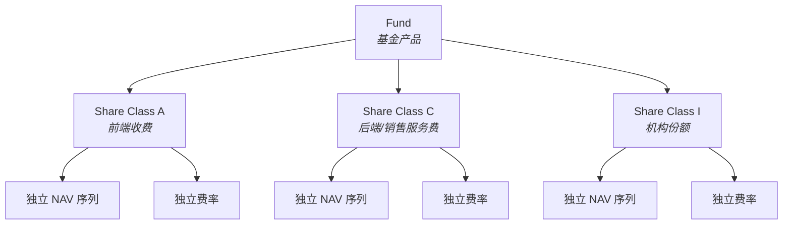
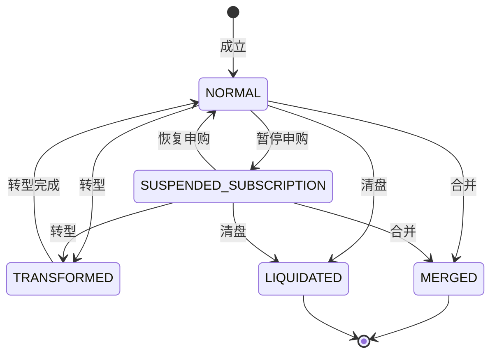
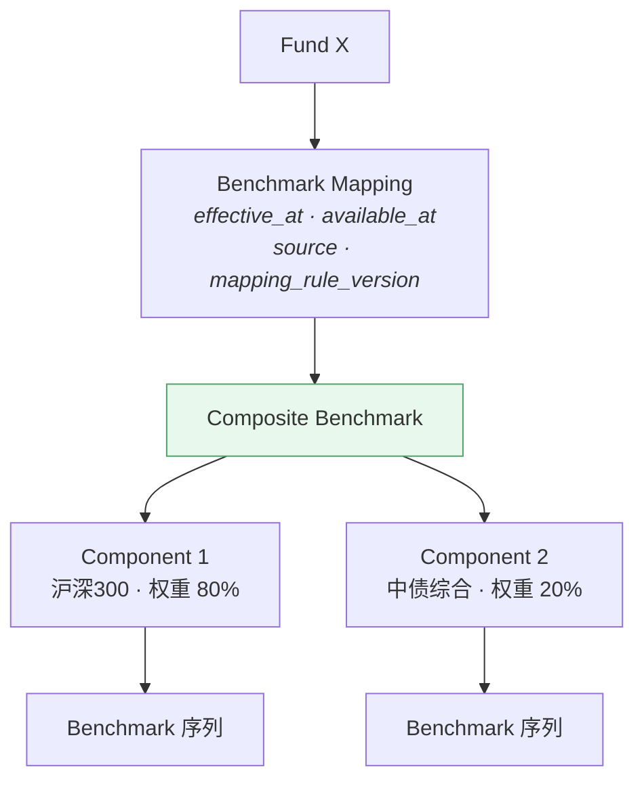
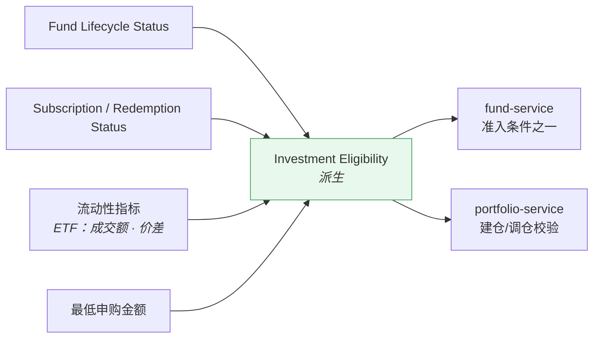
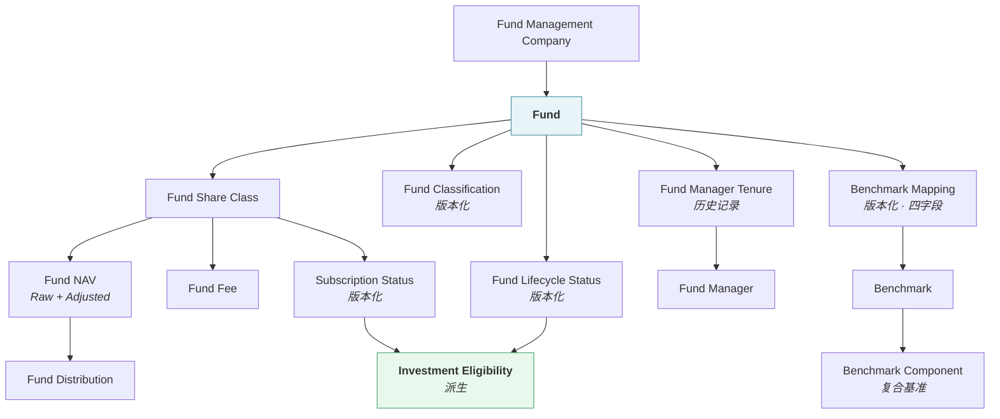

# 数据域模型 · Data Domain Model

> 上游文档：docs/01-product/01-product-overview.md（v2.5）｜本文细化环节：① Fund Data
> 业务需求：docs/01-product/02-business-requirements.md（v2.3）
> 架构依赖：docs/02-architecture/03-data-architecture.md（v1.1）
>
> **文档版本**：v1.6 ｜ **产品阶段**：第一阶段

---

## 1. 文档目的与边界

### 1.1 本文档回答什么

> **系统中的 Fund Data 在业务层面由哪些实体组成，这些实体之间是什么关系，各由谁拥有？**

### 1.2 本文档不回答什么

| 不回答 | 归属 |
|---|---|
| 数据从哪来 | `01-data-source` |
| 各实体的历史版本如何管理 | `04-data-versioning` |
| 各字段的口径如何统一 | `05-data-normalization` |
| **数据库表结构、字段类型、索引、ERD** | `11-database` |
| Factor / Score / Portfolio 的定义 | 各自所属域 |

> **本文档描述业务实体与关系，不描述物理结构。** 出现的"属性"是**业务概念**，不是数据库字段。

---

## 2. 域边界

### 2.1 属于 Data Domain

```
Fund · Share Class · Manager · Management Company
Classification · Lifecycle · NAV · Distribution
Benchmark · Benchmark Mapping · Fee · Subscription Status
Investment Eligibility
```

### 2.2 不属于 Data Domain

| 概念 | 归属 |
|---|---|
| **Factor** | `04-factor` |
| **Fund Score / Ranking / Tier / Peer Group** | `05-fund-evaluation` |
| **Fund Universe / Eligibility Rules** | `05-fund-evaluation` |
| **Return Estimate / Risk / Correlation** | `07-return-risk` |
| **Portfolio / Optimization / Investment Decision** | `06-portfolio` |

> **一条容易越界的边界**：`Investment Eligibility`（可投资性**事实**）属于本域；`Eligibility Rules`（策略准入**规则**）不属于本域，它归 `05-fund-evaluation`（`02-architecture/01-system-architecture` §6.5、`02-architecture/02-service-architecture` §3.3.1）。

---

## 3. Core Data Entities

### 3.1 十四个核心实体

| # | 实体 | 一句话定义 | 时点属性 |
|---|---|---|---|
| 1 | **Fund** | 一只基金产品的身份与基本属性 | 属性变更需版本化 |
| 2 | **Fund Share Class** | 同一基金的不同份额类别（A/C/I 等） | 同上 |
| 3 | **Fund Manager** | 基金经理个人 | 相对稳定 |
| 4 | **Fund Manager Tenure** | 经理与基金的**任职关系及其起止** | **必须是历史记录** |
| 5 | **Fund Management Company** | 基金管理人 | 相对稳定 |
| 6 | **Fund Classification** | 基金的分类归属 | **必须版本化**——转型会改变分类 |
| 7 | **Fund Lifecycle Status** | 基金的存续状态 | **必须版本化** |
| 8 | **Fund NAV** | 净值序列（原始与复权） | **日频 + 修订版本** |
| 9 | **Fund Distribution** | 分红记录 | 事件型 |
| 10 | **Fund Fee** | 费率结构 | 变更需版本化 |
| 11 | **Fund Subscription Status** | 申赎限制状态 | **必须版本化** |
| 12 | **Benchmark** | 指数本体及其行情序列 | 日频 |
| 13 | **Benchmark Mapping** | 基金 → 基准的映射关系 | **必须版本化**（上游 §4.2 ①-B） |
| 14 | **Risk-free Rate** | 无风险利率曲线序列（按 `Currency` × `Tenor`） | **时序 + 修订版本**，受 PIT 约束（§10） |

> **第 14 项不是基金属性**——它是 Market Reference Data，是本域中唯一不以基金为主体的核心实体。

**另有一个派生实体**：

| # | 实体 | 说明 |
|---|---|---|
| 15 | **Investment Eligibility** | 由 7、11 及流动性指标**派生**的可投资性状态。它是本域的产出，不是外部输入 |

---

## 4. Fund

### 4.1 Fund Identity

> **Fund 的内部标识必须独立于任何 Provider 的编码。**

| 概念 | 说明 |
|---|---|
| **Internal Fund ID** | 平台内部主标识，**由平台生成，不复用 Provider Code** |
| External Fund Code | 各 Provider 的编码，作为映射关系保存 |
| 公开代码 | 市场公开的基金代码 |

**理由**：Provider 编码可能变更、可能冲突、可能因换源而不可得。若用它作内部标识，换源即意味着全库重建。映射规则见 `05-data-normalization` §Fund ID。

### 4.2 Fund 的业务属性

| 属性 | 说明 | 是否需版本化 |
|---|---|---|
| Fund Name | 基金名称 | 是（可能更名） |
| Fund Type | 原始类型（Provider 提供） | 是 |
| Currency | 计价货币 | 否（一般不变） |
| Establishment Date | 成立日 | 否 |
| Management Company | 管理人 | 是（可能变更） |
| Lifecycle Status | 存续状态 | **是** |

### 4.3 Fund 与 Share Class 的关系



**关键事实**：

| # | 事实 |
|---|---|
| SC-1 | **不同份额类别有各自独立的净值序列与费率** |
| SC-2 | 因此**它们的收益率、Sharpe、最大回撤都不同** |
| SC-3 | 可投资性也可能不同（机构份额有门槛） |
| SC-4 | **分析与组合构建的最小单位是 Share Class，而非 Fund** |

> **若把同一基金的多个份额类别混为一个标的**，会同时产生两个错误：净值序列口径混乱；同一基金的多个份额可能被同时选入组合，造成**隐性集中度**。

> **已定案 · 2026-08-27**：Coverage **纳入全部 Share Class**，不取代表份额。见 `TBD-resolution-2.md` Policy D。
>
> **依据 —— Share Class 是最小数据单位**（已定）：
>
> ```
> A 类与 C 类的费率不同 → 净值不同 → 因子值不同
>     → 取代表份额等于丢弃另一类的真实数据
>     → 而「哪一类更值得买」正是评价要回答的问题
> ```
>
> **去重发生在 Universe 层**（`05-fund-evaluation/05` `FSEL-6`），不在数据层。**三个环节的答案不同**：数据层全部纳入、评价层分别评价、建仓层去重。

---

## 5. Fund Lifecycle

### 5.1 五种状态

| 状态 | 含义 |
|---|---|
| `ACTIVE` | 正常运行 |
| `SUSPENDED` | 暂停申购（或暂停赎回） |
| `MERGED` | 已合并入其他基金 |
| `LIQUIDATED` | 已清盘 |
| `TRANSFORMED` | 已转型（投资范围/类型变更） |

> 与上游术语的对应：上游 §11.2 使用 `NORMAL` / `SUSPENDED_SUBSCRIPTION` / `LIQUIDATED` / `MERGED` / `TRANSFORMED`。**本域采用上游命名**，本表的 `ACTIVE` / `SUSPENDED` 为便于阅读的简称，正式取值以上游为准。

### 5.2 状态转移



### 5.3 生命周期的时点属性

> **状态变更是典型的"生效日早于披露日"场景。**

```
清盘公告发布  available_at = 2026-03-10
清盘生效日    effective_at = 2026-04-15
```

回测在 `T` 时点判断某基金状态，依据的是 **`available_at ≤ T` 的最新记录**（上游 §4.2 ①-PIT）。

### 5.4 已终止基金的数据保留

> **`LIQUIDATED` 与 `MERGED` 的基金，其全部历史数据必须完整保留。**

| # | 要求 |
|---|---|
| LC-1 | 不得删除、不得归档到不可查询的位置 |
| LC-2 | 历史 `Peer Group` 与 `Fund Universe` 快照中必须包含当时存续的这些基金 |
| LC-3 | 终止事件本身（时点、原因、后继基金）必须记录 |

**这是避免 Survivorship Bias 的数据基础**（`02-business-requirements` §26.2）。若数据源不提供已清盘基金的历史，该问题在平台层**无法修正**——只能在 `01-data-source` §6.2.1 与 §14.4 的 Provider 选型中解决。

### 5.5 合并与转型的数据衔接

| 事件 | 数据处理 |
|---|---|
| **MERGED** | 记录被合并方与合并方的对应关系；**不得**把两者的净值序列直接拼接 |
| **TRANSFORMED** | 记录转型时点；转型前后的 `Fund Classification` 与 `Benchmark Mapping` 分属不同版本 |

> **转型的连锁影响**：`Fund Classification` 变更 → `Peer Group` 变更 → `Benchmark Mapping` 变更（上游 §11.2、`02-business-requirements` §25.3）。三者必须各自按 PIT 记录，回测跨越转型点时使用各自当时的版本。

---

## 6. Fund NAV

### 6.1 两种净值

| 类型 | 说明 | 用途 |
|---|---|---|
| **Raw NAV** | 单位净值，未处理分红与拆分 | 保留原始事实；对外核对 |
| **Adjusted NAV** | **复权净值** | **平台默认的收益计算基础** |

> 上游术语表：`NAV` 未标注时**默认指复权后净值**（上游 §11.2）。

### 6.2 复权的必要性

```
某基金 2026-03-15 分红 0.5 元/份
Raw NAV：  3/14 = 2.50  →  3/15 = 2.00   看起来跌了 20%
Adjusted： 3/14 = 2.50  →  3/15 = 2.50   实际收益为 0
```

若用 Raw NAV 计算收益率，分红日会产生虚假的大幅下跌，进而污染波动率、最大回撤、Sharpe 等全部下游指标。

### 6.3 影响复权的两类事件

| 事件 | 实体 | 说明 |
|---|---|---|
| **Distribution** | Fund Distribution | 分红：需记录除息日、每份金额、发放日 |
| **Split / Merge** | 份额变动记录 | 份额拆分或合并：需记录比例与生效日 |

> **具体复权算法属 `05-data-normalization`**，本文档只定义所需的实体与事件。

### 6.4 NAV 的修订

净值是**修订最频繁**的数据之一（估值差错更正、审计调整）。修订处理见 `04-data-versioning` §Restatement，核心规则：**产生新 version，旧版本保留**。

---

## 7. Benchmark

### 7.1 Benchmark 相关的四个层次

> **`Official Benchmark Definition` 属于 Fund Metadata，不是 Benchmark 的属性**——它回答"这只基金的基准是什么"，而 Benchmark Index 回答"这个指数是什么"。两者是不同对象（`01-data-source` §5）。

| 层次 | 实体 | 归属域 | 说明 |
|---|---|---|---|
| ① | **Official Benchmark Definition** | **Fund Master** | 基金合同中的业绩比较基准**文本**，如"沪深300收益率×80% + 中债综合×20%" |
| ② | **Benchmark Component** | Benchmark | 由 ① 解析得到的成分与权重 |
| ③ | **Benchmark Index** | Benchmark | 指数本体：标识、名称、类型、**价格 or 全收益**、货币、交易日历 |
| ④ | **Benchmark Time Series** | Benchmark | 指数点位 / 收益序列 |

另有一个关联实体：

| 实体 | 说明 |
|---|---|
| **Benchmark Mapping** | 基金 → 生效基准的**映射关系**，含 `effective_at` / `available_at` / `source` / `mapping_rule_version` 四字段（§7.3） |

> **① → ② 是一个可能失败的解析过程**：文本表述模糊时须转人工，解析结论带 `available_at`（`01-data-source` §5.4）。

### 7.2 Composite Benchmark 的结构

> **由多个指数构成的业绩比较基准，必须保留各 Component 及其权重**（上游 §4.2 ①-B 约束 2）。



**若简化为单一指数**，该基金的 Beta 会被系统性低估、Alpha 被系统性高估，Alpha / Beta / 超额收益 / IR / TE **五个指标同时失真**。

### 7.3 Benchmark Mapping 的四个字段

按上游 §4.2 ①-B，每条映射必须记录：

| 字段 | 含义 |
|---|---|
| `effective_at` | 该基准在业务上生效的日期 |
| `available_at` | 该映射首次对平台可见的时刻 |
| `source` | 来源优先级（官方基准 / 官方成分 / 策略指定 / 分类默认 / 系统兜底） |
| `mapping_rule_version` | 映射规则版本 |

### 7.4 Benchmark 指数类型

> **必须明确区分，且不可混用。**

| 类型 | 含义 | 影响 |
|---|---|---|
| 价格指数（Price Index） | 不含成分股分红 | 长期低估基准收益 → **高估基金 Alpha** |
| 全收益指数（Total Return Index） | 含分红再投资 | 与复权净值口径一致 |
| 全价指数（Full Price Index） | 债券净价变动 + 应计利息 | M1 债券与 Hybrid 债券 Component 的指定口径 |

基金净值已含分红再投资，因此**与全收益指数比较才是同口径**。若用价格指数作基准，会系统性高估全部基金的超额收益。

> **定案 · 2026-09-08**：权益 Benchmark 使用 `TOTAL_RETURN`，债券 M1 使用中债综合全价指数 `FULL_PRICE`。Hybrid 保留两类 Component 及其权重。
>
> **本域的动作**：`Benchmark` 实体的 `index_type` 至少支持 `PRICE`、`TOTAL_RETURN`、`FULL_PRICE`；权益映射到 `PRICE` 时须阻断相关 Factor。

---

## 8. Fund Fee 与 Subscription Status

### 8.1 费率结构

| 费用 | 是否已含于净值 | 用途 |
|---|---|---|
| **管理费** | **✅ 已含** | 被动型评分的高权重项；**回测不得重复扣除** |
| **托管费** | **✅ 已含** | 同上 |
| **销售服务费** | **待核**（`OPEN-19`） | 见 §8.1.1 |
| 申购费 | ❌ 未含 | 回测交易成本 |
| 赎回费（含持有期惩罚） | ❌ 未含 | 回测交易成本 |

> **"是否已含于净值"是本表最重要的一列**。回测若在净值收益之上再扣管理费，会系统性低估策略表现约 1–2% 年化（`02-business-requirements` §21.7）。

#### 8.1.1 `Fund Fee` 实体的包含关系字段（v1.2 定案）

> **定案 · 2026-08-27**：`TBD-DM-3` 关闭 —— 不再逐类讨论「销售服务费怎么处理」，而是**给每种费用配一组包含关系字段**，销售服务费只是其中取值待核的一项。见 `02-business-requirements` §21.7.1、`TBD-resolution.md` Policy ⑩。

**每种费用的必备元数据**（`02-business-requirements` §21.7.1）：

| 字段 | 含义 | 可空 |
|---|---|---|
| `expense_type` | 费用类型 | NOT NULL |
| `expense_rate` | 费率，**版本化** | NOT NULL |
| **`included_in_nav`** | `TRUE` / `FALSE` / **`UNKNOWN`** | NOT NULL |
| `included_in_return` | 是否已反映在收益序列中 | NOT NULL |
| `included_in_backtest` | **推导字段**，不独立配置 | NOT NULL |
| `inclusion_source` | 判定依据：数据源文档 / 招募说明书 / 人工核定 | NOT NULL |

```
included_in_backtest = NOT included_in_nav AND 该费用在交易时发生
```

> **`included_in_nav` 是三值而非布尔** —— `UNKNOWN` 是一个真实且必须可表达的状态，用 `NULL` 表示会与「尚未录入」混淆。

**粒度**：包含关系随 `expense_rate` 一起按 **Share Class 粒度**记录 —— A / C / I 类的销售服务费包含关系可能不同（`OPEN-20`）。

`<OPEN-19: 数据源的净值是否已扣销售服务费，待数据侧核实>`
`<OPEN-20: 不同份额类别的销售服务费包含关系是否一致，待逐类确认>`

### 8.2 Subscription / Redemption Status

| 状态维度 | 取值 |
|---|---|
| 申购状态 | 正常 / 暂停 / 限额（含限额金额） |
| 赎回状态 | 正常 / 暂停 |
| 最低申购金额 | 影响小额建仓可行性 |

> 这两个实体是 `Investment Eligibility` 的**主要输入**。

---

## 9. Investment Eligibility

### 9.1 定位

> **`Investment Eligibility` 是本域的派生产出，不是外部输入。**



### 9.2 取值与操作矩阵

| 状态 | 可建仓 | 可加仓 | 可持有 | 可减仓 |
|---|:---:|:---:|:---:|:---:|
| `FULLY_ELIGIBLE` | ✓ | ✓ | ✓ | ✓ |
| `HOLD_ONLY`（暂停申购） | ✗ | ✗ | ✓ | ✓ |
| `LIMITED`（限制大额申购） | 受限 | 受限 | ✓ | ✓ |
| `EXIT_ONLY`（即将清盘/转型） | ✗ | ✗ | ✓ | ✓ |
| `NOT_TRADABLE`（已清盘/暂停赎回） | ✗ | ✗ | — | ✗ |

### 9.3 与 Lifecycle 的分离

> **"暂停申购" ≠ "不可持有"。**

若用 `Fund Lifecycle Status` 直接判断可投资性，会把暂停申购的持仓错误地强制清仓。两者必须分离（上游 §11.2、`02-architecture/01-system-architecture` §6.5）。

---

## 10. Risk-free Rate

> **本节为 v1.3 新增**（上游 v2.5 §5.5）。`Risk-free Rate` 是本域中唯一不以基金为主体的核心实体。

### 10.1 实体定位

| 维度 | 说明 |
|---|---|
| **性质** | Market Reference Data —— **观测所得**，不是平台配置 |
| **主体** | 市场，不是某只基金 |
| **粒度** | `Currency` × `Tenor` 构成一条曲线上的一个点 |
| **归属** | 本域（`03-data`）· `data-service` |

### 10.2 属性

| 属性 | 说明 |
|---|---|
| **`currency`** | 币种。**不同币种是不同曲线**，不可混用 |
| **`tenor`** | 期限（`ON` / `1M` / `3M` / `1Y` 等） |
| **`rate_value`** | 利率值 |
| **`quotation_basis`** | 报价口径（年化方式、单利/复利） |
| **`effective_at`** | 业务观测日 |
| **`available_at`** | 平台可合法使用的最早时刻 |
| **`version`** | 同一 `(currency, tenor, effective_at)` 的修订序号 |
| **`rate_source_quality`** | **`EXACT` / `INTERPOLATED`** —— 该点是直接观测还是由相邻 tenor 插值而来 |

**主键**：`(currency, tenor, effective_at, version)`

> 数据源侧的来源、频率转换与口径统一见 `01-data-source` §3.1.5，曲线来源与三级 fallback 见 §3.1.5.5。

#### 10.2.1 `rate_source_quality` 为什么落在实体上而非解析时计算

> **插值点会被落库，因此它是实体的一个属性，不是查询的副产物。**

| 方案 | 问题 |
|---|---|
| 不落库，每次解析时插值 | 同一 `(currency, tenor, decision_at)` 在不同时刻解析可能得到不同值 —— 若期间补入了该 tenor 的真实观测，历史因子无法复现 |
| **落库并标记 quality** | 插值结果与观测结果同等对待，PIT 规则统一适用 |

> **补入真实观测时的处理**：原插值点**不被覆盖**，而是产生新 `version`（`rate_source_quality = EXACT`）。按 PIT 规则，`decision_at` 早于补入时刻的历史查询仍取到插值版本 —— 这正确反映了「当时只有插值可用」。

### 10.3 时点属性

> **与 `Fund NAV` 完全同构**：三元时点 + 修订版本，PIT 取 `available_at ≤ decision_at` 中 `version` 最大者。

| 要点 | 说明 |
|---|---|
| `effective_at ≠ available_at` | 利率通常滞后发布，两者不可假设相同 |
| 修订产生新 `version` | 部分基准利率存在事后修正，**不得原地覆盖** |
| 回测取当时值 | 不是当前值，也不是当时之后修订的版本 |

### 10.4 与 MAR 的边界

> **`MAR` 不是本域实体。**（上游 §5.5）

| | Risk-free Rate | MAR |
|---|---|---|
| 归属域 | **本域** | `05-fund-evaluation` |
| 性质 | 市场观测数据 | 评价政策配置 |
| 时点语义 | `available_at` + `version`（PIT） | `Effective Date` + `Evaluation Policy Version` |
| 变更含义 | 市场变了 | **我们改变了评价标准** |

**即使某个 `Evaluation Policy` 声明 `MAR = R_f`，那也是该 Policy 引用本域数据，不是本域产出 MAR。** 本域不得出现 `MAR` 实体、字段或配置项。

---

## 11. Entity Relationship

### 10.1 业务实体关系图

> 本图描述**业务关系**，不是数据库 ERD。物理设计属 `11-database`。



### 10.2 三条关键关系

| # | 关系 | 说明 |
|---|---|---|
| ER-1 | **NAV / Fee / Subscription Status 挂在 Share Class 上，不是 Fund 上** | 不同份额类别有各自的净值与费率（§4.3） |
| ER-2 | **Manager Tenure 是独立实体，不是 Fund 的属性** | 需要历史记录：谁、什么时候任职、任职多久 |
| ER-3 | **Benchmark Mapping 是独立实体，不是 Fund 的属性** | 它有自己的四个时点字段与版本，随转型变更 |

---

## 12. Data Ownership

### 11.1 归属表

| Entity | Owner（唯一写入方） | 主要消费方 |
|---|---|---|
| Fund | `data-service` | 全部下游 |
| Fund Share Class | `data-service` | 全部下游 |
| Fund Manager / Tenure | `data-service` | `factor-service`、`fund-service` |
| Fund Management Company | `data-service` | `fund-service`（集中度约束） |
| Fund Classification | `data-service` | `fund-service`（Peer Group） |
| Fund Lifecycle Status | `data-service` | `fund-service`、`portfolio-service` |
| Fund NAV / Distribution | `data-service` | `factor-service`、`portfolio-service` |
| Fund Fee | `data-service` | `fund-service`（评分）、`backtest-service`（成本） |
| Subscription Status | `data-service` | `data-service`（派生 Eligibility） |
| Benchmark / Component / Mapping | `data-service` | `factor-service`、`portfolio-service` |
| **Risk-free Rate** | `data-service` | `factor-service`（`F-RAP-001` Sharpe、`F-REL-002` Alpha、`F-REL-003` Beta）、`portfolio-service` |
| **Investment Eligibility** | `data-service` | `fund-service`、`portfolio-service` |

> **全部实体的写入权归 `data-service`**（`02-architecture/03-data-architecture` §4.1）。读取权开放。

### 11.2 不属于本域的概念（再次强调）

```
✗  Factor            → 04-factor
✗  Fund Score        → 05-fund-evaluation
✗  Peer Group        → 05-fund-evaluation
✗  Fund Universe     → 05-fund-evaluation
✗  Eligibility Rules → 05-fund-evaluation
✗  Return Estimate   → 07-return-risk
✗  Portfolio         → 06-portfolio
```

---

## 13. 为 `11-database` 提供的输入

按提示词 §77，本域需为物理设计提供以下信息（**不设计表结构**）：

| 提供项 | 本文档对应章节 |
|---|---|
| Entity | §3、§11 |
| Attribute Concept | §4、§6、§7、§8 |
| Ownership | §12 |
| Lifecycle | §5 |
| Relationship | §11 |
| Versioning 需求 | §3.1 的"时点属性"列 + `04-data-versioning` |
| Retention 需求 | §5.4（已终止基金永久保留） |
| Data Volume Category | 见下表 |
| Query Pattern | `02-architecture/06-technology-stack` §4.6.1 Workload Matrix |
| PIT 需求 | `04-data-versioning` |
| Lineage 需求 | `07-data-lineage` |

**数据量级分类**（供物理设计参考）：

| 实体 | 量级特征 | 增长驱动 |
|---|---|---|
| Fund / Share Class / Manager / Company | **低频维度**，万级 | 基金数量 |
| Classification / Lifecycle / Subscription / Benchmark Mapping | **低频 + 版本链**，万级 × 变更次数 | 变更频率 |
| **Fund NAV** | **日频时序**，千万~亿级 | 基金数 × 历史年限 |
| Distribution | 事件型，十万级 | —— |
| Benchmark 序列 | 日频时序，百万级 | 指数数 × 年限 |
| Investment Eligibility | 版本链，万级 × 变更次数 | 申赎状态变更频率 |

---

## 14. Summary

Data Domain Model 由 **13 个核心实体 + 1 个派生实体**构成，四个要点：

- **分析的最小单位是 Share Class，不是 Fund** —— 不同份额类别有各自的净值序列与费率，混为一体会造成口径混乱与隐性集中度
- **五类实体必须版本化** —— Classification、Lifecycle、Subscription Status、Benchmark Mapping、NAV。它们都存在"生效日早于披露日"的情形
- **已终止基金的数据必须永久保留** —— 这是避免幸存者偏差的数据基础，且若数据源不提供，平台层无法修正
- **`Investment Eligibility` 是本域的派生产出**，由 Lifecycle + 申赎状态 + 流动性派生，与 `Eligibility Rules`（属 `05-fund-evaluation`）严格分离

---

## 15. Decisions

| # | 决策 | 理由 |
|---|---|---|
| D-1 | Internal Fund ID 由平台生成，不复用 Provider Code | Provider 编码可能变更、冲突、因换源不可得 |
| D-2 | NAV / Fee / Subscription Status 挂在 Share Class 上 | 不同份额类别的净值与费率不同，是不同的分析标的 |
| D-3 | Manager Tenure 作为独立实体保存历史 | 回测需要"当时的经理与任职时长"，当前快照不够 |
| D-4 | Benchmark Mapping 作为独立实体并版本化 | 它有自己的四个时点字段，随基金转型变更 |
| D-5 | Composite Benchmark 保留全部 Component 与权重 | 简化为单一指数会使 Alpha/Beta/超额/IR/TE 五项同时失真 |
| D-6 | `Investment Eligibility` 在本域派生并持久化 | 它是客观状态（来自公告与生命周期），不含策略判断 |
| D-7 | 已合并基金**不拼接**净值序列 | 拼接会制造不存在的连续历史 |
| D-8 | 费率表显式标注"是否已含于净值" | 防止回测重复扣除管理费与托管费 |

---

## 16. Constraints

| # | 约束 | 来源 |
|---|---|---|
| C-1 | 已清盘 / 合并基金的历史数据必须完整保留 | 上游 §4.2 ④、`02-business-requirements` §26.2 |
| C-2 | Classification / Lifecycle / Subscription / Benchmark Mapping 必须版本化 | 上游 原则二 |
| C-3 | Composite Benchmark 不得简化为单一指数 | 上游 §4.2 ①-B 约束 2 |
| C-4 | `Investment Eligibility` 必须与 `Fund Lifecycle Status` 分离 | 上游 §11.2 |
| C-5 | `Risk-free Rate` 必须按 `Currency` × `Tenor` 建模，不得退化为单一序列 | 本文档 §10.2 |
| C-6 | **本域不得出现 `MAR` 实体、字段或配置项** —— MAR 属 `05-fund-evaluation` | 上游 §5.5 |
| C-5 | 全部实体的写入权归 `data-service` | `02-architecture/03-data-architecture` §4.2 |
| C-6 | 本文档不得出现数据库表结构、字段类型、索引、ERD | 提示词 §19、§66 |
| C-7 | 管理费与托管费已含于净值，下游不得重复扣除 | `02-business-requirements` §21.7 |

---

## 17. TBD

| # | 事项 | 阻塞 | 责任方 |
|---|---|---|---|
| ~~DM-1~~ | ~~Coverage 纳入全部 Share Class 还是取代表份额~~ —— **已定案**：见 Policy D · Share Class 口径 | — | ✅ 2026-08-27 |
| ~~DM-2~~ | ~~各类基准采用价格指数还是全收益指数~~ —— **已定案**：见 Policy B 基准指数类型 | — | ✅ 2026-08-27 |
| ~~DM-3~~ | ~~销售服务费按份额类别的处理~~ —— **已定案**：`Fund Fee` 补六个包含关系字段，销售服务费的取值待数据核实（`OPEN-19`/`OPEN-20`）| — | ✅ 已定案 2026-08-27 |
| DM-4 | ETF 流动性指标的具体项与来源 | `01-data-source`、`05-fund-evaluation` | 投研 + 数据 |
| DM-5 | 基金合并时被合并方持仓的处理规则 | `06-portfolio`（退出规则） | 组合管理 |

> **DM-1 与 DM-2 已定案**：分析粒度为 Share Class；Benchmark 类型为权益 `TOTAL_RETURN`、债券 M1 `FULL_PRICE`，Hybrid 保留两类 Component 及权重。

---

## 18. Related Documents

| 关系 | 文档 |
|---|---|
| **上游** | `01-product/01-product-overview.md` v2.4（§4.2 ①、①-B、⑨-S、§11 术语表）、`01-product/02-business-requirements.md` v2.3（§5 基金覆盖、§25 生命周期） |
| **架构依赖** | `02-architecture/03-data-architecture.md` v1.1（数据域与 Ownership） |
| **本域同层** | `01-data-source`（来源）、`04-data-versioning`（版本化）、`05-data-normalization`（口径）、`06-data-validation`（校验）、`07-data-lineage`（血缘） |
| **下游** | `04-factor`（消费 NAV 与 Benchmark）、`05-fund-evaluation`（消费 Classification 构建 Peer Group）、`07-return-risk`、`08-backtest`、`11-database`（物理设计） |

---

## 19. Change Log

| 版本 | 日期 | 变更内容 | 上游依赖 |
|---|---|---|---|
| **v1.6** | 2026-08-27 | **第二批定案（2 项）**。`DM-1` Coverage **纳入全部 Share Class**（Policy D）—— 取代表份额等于丢弃另一类的真实数据，而「哪一类更值得买」正是评价要回答的问题；去重发生在 Universe 层。`DM-2` 全收益指数，`Benchmark` 实体补 `index_type`。 详见 `TBD-resolution-2.md` | `TBD-resolution-2.md` v1.0 |
| **v1.5** | 2026-08-27 | **Policy ① 落地**。§10.2 `Risk-free Rate` 实体补 `rate_source_quality`（`EXACT` / `INTERPOLATED`）；新增 §10.2.1 —— 该属性**落在实体上而非解析时计算**，插值点落库并版本化，补入真实观测时产生新 `version` 而不覆盖，使早于补入时刻的历史查询仍取到插值版本。详见 `TBD-resolution.md` Policy ① | `03-data/01-data-source` v2.3 |
| **v1.4** | 2026-08-27 | **`TBD-DM-3` 关闭**。新增 §8.1.1 —— `Fund Fee` 实体补六个包含关系字段（`included_in_nav` 为**三值枚举**含 `UNKNOWN`，`included_in_backtest` 为推导字段）；问题由「销售服务费怎么处理」重构为「每种费用都声明包含关系」，销售服务费只是取值待核的一项。详见 `TBD-resolution.md` Policy ⑩ | `02-business-requirements` v2.5 §21.7.1 |
| v1.3 | 2026-08-25 | **补全 `Risk-free Rate` 实体建模**。新增 §10：按 `Currency` × `Tenor` 的曲线建模（**不得退化为单一"平台默认利率"序列**，否则支持第二币种时无法扩展且历史 Factor 无法判断当初用的哪条曲线）；三元时点与修订版本，**与 `Fund NAV` 完全同构**；§10.4 明确 **`MAR` 不是本域实体**——即使 `MAR = R_f` 也是 Policy 引用本域数据，本域不得出现 MAR 字段。实体清单由十三项修正为十四项并修复表格断裂；原 §10–§18 顺移为 §11–§19。<br/>**同时修正一处沿用自初版的事实错误**：`F-REL-004` Information Ratio 的公式为 `(R_p − R_b) / TE`，**并不依赖 `R_f`**，此前多处将其列为无风险利率消费方；`R_f` 的直接消费方是 `F-RAP-001` Sharpe、`F-REL-002` Alpha、`F-REL-003` Beta，`F-RAP-002` Sortino 仅在 `MAR = R_f` 时间接依赖 | `01-product-overview.md` v2.5 §5.5、`01-data-source.md` v2.2 |
| v1.2 | 2026-08-25 | 新增 **`Risk-free Rate`** 实体与 Ownership——由 `04-factor` 发现的跨域缺口（Sharpe/Sortino/Alpha/IR 依赖） | `01-data-source.md` v2.1 |
| v1.1 | 2026-08-25 | **随 01-data-source v2.0 同步**。§7.1 Benchmark 由三实体改为**四层次**——`Official Benchmark Definition` 归属 **Fund Master 域**（它是基金的属性，非基准的属性），与 Component / Index / Time Series 分离；修正对 `01-data-source` 的失效章节引用 | `01-product-overview.md` v2.4、`01-data-source.md` v2.0 |
| v1.0 | 2026-08-25 | 初始版本。定义 13 个核心实体 + `Investment Eligibility` 派生实体；确立"分析最小单位是 Share Class"；五类必须版本化的实体；已终止基金的永久保留要求与状态转移图；Composite Benchmark 结构与价格/全收益指数的区分；费率"是否已含于净值"的显式标注；为 `11-database` 提供的十项输入与数据量级分类 | `01-product-overview.md` v2.4、`03-data-architecture.md` v1.1 |