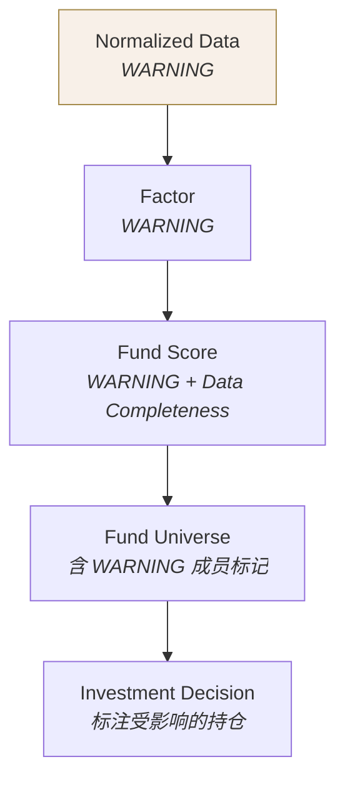
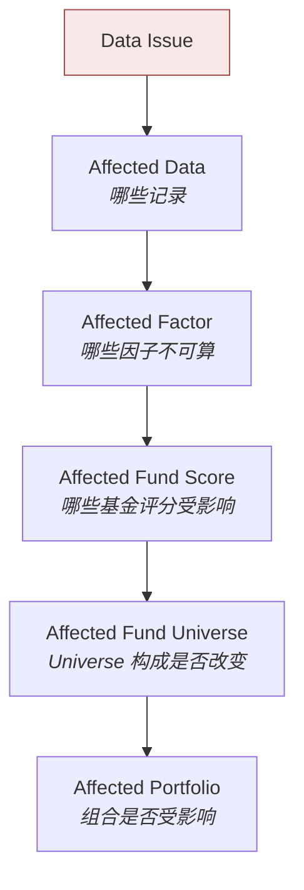
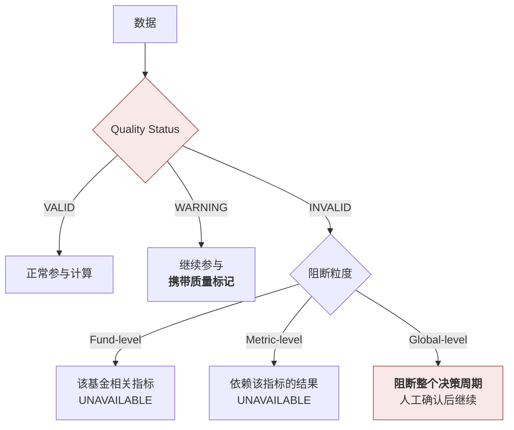

# 数据质量 · Data Quality

> 上游文档：docs/01-product/01-product-overview.md（v2.5）｜本文细化环节：① Fund Data
> 业务需求：docs/01-product/02-business-requirements.md（v2.3）§24 数据质量要求
> 架构依赖：docs/02-architecture/03-data-architecture.md（v1.1）§8 Data Quality Architecture
>
> **文档版本**：v1.1 ｜ **产品阶段**：第一阶段

---

## 1. 文档目的与边界

### 1.1 本文档回答什么

> **什么样的数据才可以被系统信任？**

### 1.2 与 `06-data-validation` 的边界

```
03-data-quality   →  定义"什么是好数据"（标准与状态）
06-data-validation →  定义"如何检查数据是不是好数据"（执行）
```

### 1.3 本文档不回答什么

| 不回答 | 归属 |
|---|---|
| 校验规则如何执行、分几层 | `06-data-validation` |
| 数据从哪来 | `01-data-source` |
| 版本与 PIT 机制 | `04-data-versioning` |
| 口径统一 | `05-data-normalization` |
| 监控指标与告警规则 | `12-operations` |

---

## 2. Data Quality Dimensions

### 2.1 八个质量维度

| # | 维度 | 回答的问题 | 优先级 |
|---|---|---|---|
| 1 | **Completeness** | 该有的数据是否都有？ | 高 |
| 2 | **Accuracy** | 数据是否符合来源与校验规则？ | 高 |
| 3 | **Consistency** | 多源之间是否一致？ | 中 |
| 4 | **Timeliness** | 是否在规定时间内可用？ | 高 |
| 5 | **Validity** | 是否符合取值域与格式约束？ | 高 |
| 6 | **Uniqueness** | 是否存在重复记录？ | 中 |
| 7 | **Integrity** | 实体间引用关系是否完整？ | 中 |
| 8 | **PIT Availability** | 时点属性是否完整可用？ | **最高** |

### 2.2 两个优先级最高的维度

> 本系统与一般业务系统的差异，集中体现在这两个维度上。

#### PIT Availability

| 要求 | 说明 |
|---|---|
| `available_at` 非空 | 缺失则该记录无法参与任何历史计算 |
| `available_at` 非默认填充 | 以当前时间填充会让历史数据"一直可见"，造成全面前视偏差 |
| `effective_at` 与 `version` 完整 | 缺失则版本选择失效 |

> **PIT Availability 不达标的数据，不是"质量差"，而是"不可用于历史计算"。** 它可以出现在当前视图，但不能进入回测与审计重建。

#### Historical Integrity（归入 Integrity 维度）

| 要求 | 说明 |
|---|---|
| 历史版本未被覆盖 | 覆盖即破坏可复现性，**不可恢复** |
| 历史版本可查询 | 归档至不可查询位置等同于删除 |

> **Historical Integrity 的检测点与其他维度不同**：它不是"检查数据对不对"，而是"**禁止一类写操作**"。这是架构层的强制约束（`02-architecture/03-data-architecture` §8.5），不是可配置的规则。

---

## 3. Quality Status

### 3.1 三种状态

| 状态 | 含义 | 是否可参与计算 |
|---|---|---|
| **`VALID`** | 完整可用 | ✅ 正常参与 |
| **`WARNING`** | 存在问题但仍可使用 | ✅ **可以继续**，但结果必须携带质量标记 |
| **`INVALID`** | 不可使用 | ❌ 依赖该数据的指标必须标记 `UNAVAILABLE` |

### 3.2 `WARNING` 明确可以继续

> 这一点必须明确，否则与"数据质量不达标必须阻断"的表述冲突。

```
只有 INVALID 触发阻断，且阻断范围由粒度决定（§6）。
WARNING 继续参与计算，但质量标记必须逐级向上传递至最终输出。
```

（`02-business-requirements` §24.4）

### 3.3 质量标记的传递



**架构要求**：质量标记是数据的**伴随属性**，随数据一起流动，**不能靠事后关联查询获得**（`02-architecture/03-data-architecture` §8.3）。

---

## 4. Data Quality Scope

### 4.1 缺失数据

| 缺失项 | 影响范围 | 典型阻断粒度 |
|---|---|---|
| **Missing NAV**（单基金单日） | 该基金该周期指标 | Fund-level |
| **Missing NAV**（全市场） | 全部计算 | **Global-level** |
| **Missing Benchmark** | 该基金的 Alpha / Beta / IR / TE / 超额收益 / Relative Performance Score | Metric-level |
| **Missing Manager** | 经理相关准入条件与 Factor | Fund-level |
| **Missing Classification** | **该基金无法归入 Peer Group → 无法评分** | Fund-level（影响较大） |
| Missing AUM | 规模准入条件 | Fund-level |

> **Missing Classification 的影响被低估**：没有分类就没有 Peer Group，没有 Peer Group 就无法做分位标准化，该基金实际上退出了整个评价体系。

### 4.2 异常数据

| 异常 | 判定方向 | 说明 |
|---|---|---|
| **Impossible NAV** | 结构性错误 | 如净值为 0 或极端离谱值 |
| **Negative NAV** | 结构性错误 | 基金净值不应为负 |
| **Extreme Return** | 需甄别 | **可能是数据错误，也可能是真实事件**（大额分红、拆分） |
| **Duplicate Data** | 结构性错误 | 同 `effective_at` + 同 `version` 的重复记录 |
| **Date Gap** | 需甄别 | 交易日缺净值 vs 该基金当日本就无净值（如新成立） |

#### Extreme Return 的甄别

> **不能简单按阈值判为错误。**

```
某日收益 −20%
  → 若当日有分红记录且未复权     → 数据处理问题
  → 若当日有份额拆分             → 数据处理问题
  → 若市场同期大幅下跌           → 真实事件
  → 以上皆无                     → 疑似数据错误 → WARNING / 人工核查
```

甄别必须结合**分红、拆分、市场环境**三方信息，而非孤立看数值。

> **推荐默认 · 2026-08-27**：单日 **|收益| > 10%**（货币型 **> 1%**）标记为 Extreme Return，**仅告警不剔除**。业务方可改。
>
> **两个阈值分开的理由**：货币基金的日收益率通常在 0.01% 量级，10% 的阈值对它形同虚设；而股票型基金单日 10% 是真实可能的（如重仓股集体涨停）。
>
> **仅告警不剔除是硬性要求，不是默认** —— 剔除会制造**幸存者偏差的变体**：极端收益往往出现在市场剧烈波动时，剔除它们会让历史看起来比实际平稳，压低波动率与回撤。
>
> **告警的作用是触发人工核实**「这是真实行情还是数据错误」。核实为真实后，该值**原样进入**全部下游计算（与 `07-return-risk/05` `EM-4`「估计层不做异常值处理」一致）。

### 4.3 业务事件

> 以下事件**不是数据异常**，但若未被正确识别与处理，会**表现为**数据异常。

| 事件 | 若未正确处理的表现 |
|---|---|
| **Dividend** | 净值断崖式下跌 → 被误判为极端负收益 |
| **Fund Split** | 净值跳变 → 被误判为异常 |
| **Fund Merge** | 序列中断或错误拼接 |
| **Fund Liquidation** | 序列终止 → 若被当作缺失会触发误告警 |
| **Fund Transformation** | 分类与基准变更 → 若未版本化会造成历史指标错误 |

**处理原则**：先识别业务事件，再判定数据质量。**事件识别在前，异常判定在后**。

---

## 5. Quality Impact

### 5.1 影响链

> **不能只记录"数据异常"，还必须知道它影响了什么。**



### 5.2 影响分析的用途

| 用途 | 说明 |
|---|---|
| **判定阻断粒度** | 影响范围决定是 Fund / Metric / Global 级 |
| **决定是否阻断本期决策** | 若影响触及 Universe 构成，需评估是否可继续 |
| **修复后的重算范围** | 只重算受影响部分，而非全量 |
| **历史影响追溯** | 数据修订后评估哪些历史结论受影响（`07-data-lineage` §Impact） |

### 5.3 影响分析的实现依赖

影响分析依赖**数据血缘**（`07-data-lineage`）。没有血缘就只能全量重算，或者根本无法判断影响范围。

---

## 6. Blocking Rules

### 6.1 三级阻断粒度

> **状态（VALID/WARNING/INVALID）与粒度（Fund/Metric/Global）是两个独立维度。**

| 级别 | 影响范围 | 举例 |
|---|---|---|
| **Fund-level** | 仅该基金 | 某基金规模缺失 → 该基金相关条件 `UNAVAILABLE`，其余基金正常 |
| **Metric-level** | 仅依赖该指标的结果 | 某基金 Benchmark 缺失 → Alpha/Beta/IR/TE 为 `UNAVAILABLE`，其他指标正常 |
| **Global-level** | **整个决策周期** | 全市场净值未到位、数据日期整体错位、数据源批次缺失 |

### 6.2 状态 × 粒度的组合规则



### 6.3 必须 Global 阻断的四种情形

> 以下情形**无论涉及多少基金**，都必须阻断整个决策周期：

| # | 情形 | 理由 |
|---|---|---|
| B-1 | **PIT 不满足** —— `available_at` 缺失或校验失败 | 无法判断数据在决策时点是否可见，任何计算都可能带前视偏差 |
| B-2 | **核心 NAV 全市场缺失** | 无净值则无任何指标 |
| B-3 | **Benchmark 无法满足必要计算**（全局性） | 全部相对指标失效 |
| B-4 | **数据版本不一致** —— 版本链断裂或冲突 | 无法确定应使用哪个版本，结果不唯一 |

### 6.4 不得静默降级

> **阻断后不得自动降级产出"尽力而为"的结果。**

| 禁止行为 | 后果 |
|---|---|
| 自动使用上一期数据顶替 | 制造不存在的"当期数据"，且回测无法复现 |
| 自动放宽质量阈值 | 质量标准形同虚设 |
| 静默跳过异常记录 | 样本悄然改变，影响不可见 |
| 用均值/前值填充缺失 | 制造不存在的事实 |

**唯一例外**：若某种降级行为在业务规则中被**显式允许并版本化**，则可执行——但必须留痕且在结果中标记。

（上游 原则五、`02-business-requirements` §24.4）

---

## 7. Data Completeness

### 7.1 定义

```
Data Completeness = Available Required Data / Required Data
```

### 7.2 两个层次

| 层次 | 含义 | 用途 |
|---|---|---|
| **记录级完整度** | 某基金某周期的必需字段有多少可用 | 判定该基金该周期是否可评价 |
| **评分完整度** | `Fund Score` 所基于的可用指标占应有指标的比例 | **随评分一同呈现**（上游 §11.2） |

### 7.3 为什么必须随评分呈现

```
基于 3 个指标算出的 85 分
基于 12 个指标算出的 85 分
        ↑ 可信度完全不同
```

若不呈现完整度，使用者无法判断评分的可靠性，可能把数据不足的基金误当作表现优异。

### 7.4 完整度阈值

> **推荐默认 · 2026-08-27**：`data_completeness < 0.8` 的基金**不参与评分**。业务方可改。
>
> **依据**：低于 80% 的窗口，其统计量已不可靠 —— 250 个交易日的窗口若只有 200 个观测，缺失的 50 天可能集中在某段行情，使该段完全不被反映。
>
> ⚠️ **本项列入首次实证后必须复核的三项之一**（`TBD-resolution-2.md` §6.3）：它决定参与评分的基金数，**与 `MIN_PEER_GROUP_SIZE = 30` 叠加后可能使小分类长期无法产出排名** —— 两个门槛各自合理，叠加效果却可能过严。
>
> **本值是全平台唯一的完整度门槛** —— `05-fund-evaluation/05` `FSEL-1` 的入池门槛直接沿用，不单独设值。

`<TBD-DQ-3: 各质量维度的具体阈值待数据与运维确认（关联 NFR-7）>`

---

## 8. Summary

数据质量体系由四部分构成：

- **八个质量维度** —— 其中 **PIT Availability** 与 **Historical Integrity** 优先级最高。后者的检测点特殊：它不是"检查数据对不对"，而是**禁止一类写操作**
- **三种状态** —— `VALID` / `WARNING` / `INVALID`。**`WARNING` 明确可以继续参与计算**，但质量标记必须逐级传递
- **三级阻断粒度** —— 状态与粒度是**两个独立维度**。1000 只基金中 1 只有问题不应停掉整个周期；但 PIT 不满足、版本不一致等四种情形必须 Global 阻断
- **质量影响链** —— 不能只记录"数据异常"，必须知道它影响了哪些 Factor / Score / Universe / Portfolio

> **一条贯穿的原则**：业务事件识别在前，异常判定在后。分红、拆分、清盘若未被识别，会**表现为**数据异常并触发误判。

---

## 9. Decisions

| # | 决策 | 理由 |
|---|---|---|
| D-1 | 状态与阻断粒度作为两个独立维度 | 单一维度无法表达"数据无效但只影响一只基金" |
| D-2 | `WARNING` 可继续参与计算，标记逐级传递 | 否则大量轻微问题会导致过度阻断；但使用者需知道结果可信度 |
| D-3 | PIT 不满足必须 Global 阻断 | 无法判断可见性时，任何计算都可能带前视偏差 |
| D-4 | 数据版本不一致必须 Global 阻断 | 结果不唯一，可复现性失效 |
| D-5 | 业务事件识别在异常判定之前 | 分红、拆分若未识别会被误判为极端收益 |
| D-6 | Extreme Return 须结合分红、拆分、市场环境三方甄别 | 孤立看数值无法区分数据错误与真实事件 |
| D-7 | `Data Completeness` 必须随评分呈现 | 3 个指标的 85 分与 12 个指标的 85 分可信度不同 |
| D-8 | 降级行为仅在业务规则显式允许并版本化时可执行 | 保留必要灵活性，同时防止静默降级 |

---

## 10. Constraints

| # | 约束 | 来源 |
|---|---|---|
| C-1 | 只有 `INVALID` 触发阻断，`WARNING` 可继续 | `02-business-requirements` §24.4 |
| C-2 | 质量标记必须逐级传递至最终输出 | 同上 |
| C-3 | 历史版本不得覆盖（Historical Integrity） | 上游 原则二 |
| C-4 | 阻断后不得自动降级产出结果 | 上游 原则五 |
| C-5 | 不得以任何方式填充缺失数据 | `02-business-requirements` §9.4 |
| C-6 | PIT 不满足 / 版本不一致必须 Global 阻断 | 本文档 §6.3 |

---

## 11. TBD

| # | 事项 | 阻塞 | 责任方 |
|---|---|---|---|
| ~~DQ-2~~ | ~~Data Completeness 最低阈值~~ —— **推荐默认**：`data_completeness < 0.8` 的基金不参与评分 | — | ✅ 2026-08-27 |
| **DQ-3** | 各质量维度的具体阈值 | `06-data-validation`、`12-operations` | 数据 + 运维（关联 NFR-7） |
| ~~DQ-1~~ | ~~Extreme Return 的甄别阈值与规则~~ —— **推荐默认**：单日 \|收益\| > 10%（货币型 > 1%）标记为 Extreme Return，仅告警不剔除 | — | ✅ 2026-08-27 |
| DQ-4 | 各类数据的 Timeliness 约定时点 | `12-operations` | 运维（关联 DS-1） |
| DQ-5 | 允许降级的业务场景清单（若有） | `13-governance` | 治理 |

---

## 12. Related Documents

| 关系 | 文档 |
|---|---|
| **上游** | `01-product/01-product-overview.md` v2.4（原则二、原则五、§11.2 Data Quality Status）、`01-product/02-business-requirements.md` v2.3（§24 数据质量、§23.3 状态定义） |
| **架构依赖** | `02-architecture/03-data-architecture.md` v1.1（§8 质量门与三级粒度） |
| **本域同层** | `01-data-source`（多源一致性）、`04-data-versioning`（PIT Availability、Historical Integrity）、`05-data-normalization`（业务事件处理）、`06-data-validation`（检查执行）、`07-data-lineage`（影响分析） |
| **下游** | `04-factor`（消费质量标记）、`05-fund-evaluation`（Data Completeness）、`12-operations`（质量监控与告警） |

---

## 13. Change Log

| 版本 | 日期 | 变更内容 | 上游依赖 |
|---|---|---|---|
| **v1.1** | 2026-08-27 | **第二批定案（2 项，均为推荐默认）**。`DQ-1` Extreme Return 阈值单日 \|收益\| > 10%（货币型 > 1%），**仅告警不剔除** —— 剔除会压低波动率与回撤，制造幸存者偏差的变体；`DQ-2` 完整度下限 **0.8**，为全平台唯一门槛（`FSEL-1` 直接沿用），**列入首次实证后必须复核**（与 `MIN_PEER_GROUP_SIZE = 30` 叠加可能使小分类长期无法排名）。 详见 `TBD-resolution-2.md` | `TBD-resolution-2.md` v1.0 |
| v1.0 | 2026-08-25 | 初始版本。定义八个质量维度并指出 **PIT Availability** 与 **Historical Integrity** 优先级最高（后者是禁止一类写操作而非检查数据）；三种状态与"WARNING 可继续"的明确；状态 × 粒度的双维度模型与四种必须 Global 阻断的情形；质量影响链；**业务事件识别在异常判定之前**的处理原则；Data Completeness 的两个层次与随评分呈现的要求 | `01-product-overview.md` v2.4、`02-business-requirements.md` v2.3 |