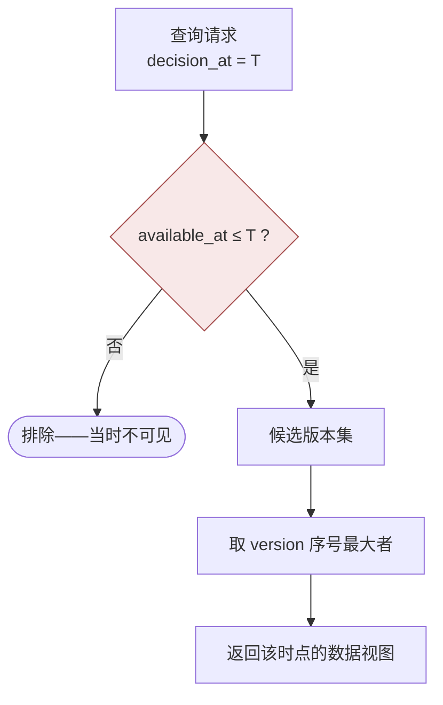
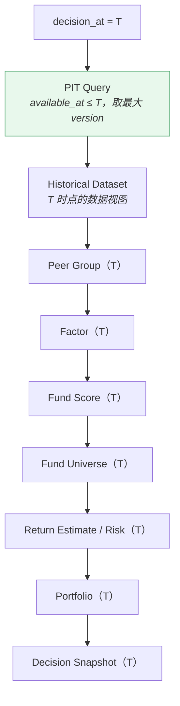

# 数据版本与时点 · Data Versioning

> 上游文档：docs/01-product/01-product-overview.md（v2.5）｜本文细化环节：① Fund Data
> 业务需求：docs/01-product/02-business-requirements.md（v2.3）
> 架构依赖：docs/02-architecture/03-data-architecture.md（v1.1）§5 PIT Data Architecture
>
> **文档版本**：v1.3 ｜ **产品阶段**：第一阶段

---

## 1. 文档目的与边界

### 1.1 本文档回答什么

> **数据如何保存历史版本，并支持 Point-in-Time 查询与历史结果重现？**

这是 Data Domain **最重要**的一份文档。整个平台的可复现性、回测有效性与审计能力都建立在本文档定义的机制之上。

### 1.2 本文档不回答什么

| 不回答 | 归属 |
|---|---|
| 数据从哪来 | `01-data-source` |
| 有哪些实体 | `02-data-domain-model` |
| 什么算好数据 | `03-data-quality` |
| 如何统一口径 | `05-data-normalization` |
| PIT 校验如何执行 | `06-data-validation` §PIT Validation |
| **版本如何物理存储、如何建索引** | `11-database` |

---

## 2. Version Model

### 2.1 三个时点属性

> **三者不可混为一谈。** 混淆任意两个都会导致前视偏差或历史不可重现。

| 属性 | 回答的问题 | 类型 |
|---|---|---|
| **`effective_at`** | 这条数据描述的是**哪个业务时点**？ | 业务日期 |
| **`available_at`** | 系统**什么时候第一次能看到**这条数据？ | 时刻（含时分） |
| **`version`** | 同一个事实**修订了几次**？ | 序号 |

另有一个查询侧参数：

| 参数 | 含义 |
|---|---|
| **`decision_at`** | 本次决策/计算发生的时点 —— **查询基准** |

### 2.2 三者的独立性

```
同一个事实（某基金某日净值）可能有多条记录：

effective_at   version   available_at        NAV
2026-01-01       1       2026-01-02 18:00   1.123
2026-01-01       2       2026-03-15 10:00   1.125   ← 后来的修订
```

- `effective_at` 相同（都描述 1 月 1 日的净值）
- `version` 不同（第 1 次记录 vs 第 1 次修订）
- `available_at` 不同（修订在 3 月才可见）

---

## 3. `effective_at`

### 3.1 定义

> 数据事实**在业务上生效或所属**的日期。

| 数据 | `effective_at` 的含义 |
|---|---|
| Fund NAV | 该净值对应的**净值日期** |
| Fund Classification | 该分类**开始生效**的日期 |
| Manager Tenure | 经理**任职起始日** |
| Fund Lifecycle | 状态变更的**生效日**（如清盘生效日） |
| Benchmark Mapping | 该基准**开始适用**的日期 |
| Fund Fee | 费率**开始执行**的日期 |

### 3.2 用途：时段对齐

`effective_at` 用于回答"这个数字属于哪一天"，是**指标计算的时间轴**。

```
计算 2026 年 1 月的月度收益
→ 取 effective_at 落在 2026-01 区间内的净值序列
```

### 3.3 关键限制

> **`effective_at` 不用于可见性判断。**

这是最容易犯的错误。详见 §4.3。

---

## 4. `available_at`

### 4.1 定义

> 该数据事实**首次对平台可见**的时刻。

**这是 Point-in-Time 判定的唯一依据**（上游 §4.2 ①-PIT）。

### 4.2 取值规则（v1.2 定案）

> **定案 · 2026-08-27**：`TBD-DV-1` 与上游 `TBD-17` 一并关闭。完整规则由 `01-data-source` §11 定义，此处摘要其判定语义。

**`available_at` 由两个约束共同决定，取二者中较晚者**：

```
available_at = max( 源头可得时刻 , 平台可用时刻 )
```

**约束① · 源头可得时刻**（三级优先级，`01-data-source` §11.3）：

| 优先级 | 取自 | `availability_quality` |
|---|---|---|
| 首选 | `provider_available_at` | **`EXACT`** |
| 次选 | `published_at` | **`DERIVED`** |
| 兜底 | `ingested_at` | **`INFERRED`** |

**约束② · 平台可用时刻**：

| 情形 | 取值 |
|---|---|
| 正常流程（落库 → 校验通过） | `ingested_at` |
| **校验未通过后经修复** | **修复完成并通过校验的时刻** |
| **需多源仲裁** | **仲裁结论产生的时刻** |
| Provider 修订数据 | 修订版本到达并通过校验的时刻 |
| 人工录入 / 修正 | 录入完成时刻 |

**四个必须区分的时刻**（`01-data-source` §11.1）：

```
effective_at            数据描述的业务时点
published_at            源头对外公告的时刻
provider_available_at   供应商推送 / 可查的时刻
ingested_at             平台落库的时刻
────────────────────────────────────────
available_at            解析后的权威字段  ← PIT 判定依据
```

> **`available_at` 是解析产物，不是原始观测** —— 前四者是它的**依据**。查询走 `available_at`，审计走四者。这是本文档 §6 的 PIT Query 只需筛一个字段的原因。

**四条硬性要求**：

| # | 要求 |
|---|---|
| AV-1 | **不可为空** |
| AV-2 | **不得以当前时间默认填充** —— 那会让所有历史数据看起来「一直可见」 |
| AV-3 | 精度必须到**时刻**而非日期 —— 当日盘中决策与盘后决策看到的数据不同 |
| **AV-4** | **`availability_quality` 与 `available_at` 一并落库且不可为空** —— 缺它则无法区分「精确知道何时可得」与「只知道最晚何时可得」 |

### 4.2.1 `availability_quality` 对版本化的影响

> **它不改变 PIT 判定规则，但改变结论的可信度。**

| Quality | PIT 判定 | 可信度 |
|---|---|---|
| `EXACT` | `available_at ≤ decision_at` | 精确 |
| `DERIVED` | 同上 | 略偏早 —— 公告到推送之间的延迟未计入，**存在轻微前视风险** |
| `INFERRED` | 同上 | 偏晚 —— 落库延迟被计入，**保守但偏悲观** |

> **两个方向的偏差不对称**：`INFERRED` 的偏差方向是**安全的**（不会前视），`DERIVED` 的偏差方向是**不安全的**（可能前视 3 分钟到数小时）。因此 `DERIVED` 数据在参与盘中决策时须额外审视；日频决策场景下该风险可忽略。

> **已定案 · 2026-08-27**：`INFERRED` 占比 **> 30% 降级 `WARNING`**、**> 60% 降级 `NOT_VERIFIED`**（`03-data/01-data-source` §3.1.5.5 定义，与 `08-backtest/01` `BE-3` 的重建期占比同档）。
>
> **`INFERRED` 的偏差方向是安全的**（用落库时刻，保守，不会前视），因此门槛可比 `DERIVED` 宽松；`DERIVED` 的方向偏前视，但在日频决策下风险可忽略，故不单设降级阈值，只在分层呈现中暴露占比。

### 4.3 为什么不能用 `effective_at` 判定可见性

> **`effective_at ≤ decision_at` 不等于决策时点可获得。**

```
基金经理变更   effective_at = 2026-08-20   （生效日）
               available_at = 2026-08-25   （公告发布）
决策日         decision_at  = 2026-08-22

按 effective_at 判断 → 通过 ✗   系统在 8/22 根本不知道这件事
按 available_at 判断 → 拒绝 ✓
```

**基金数据中"生效日早于披露日"是常态**：

| 数据 | 典型滞后 |
|---|---|
| 基金经理变更 | 公告晚于生效日数日 |
| 基金分类调整 | 公告晚于生效日 |
| 定期报告持仓 | 披露晚于报告期末 1–2 个月 |
| 基金规模 | 定期披露，滞后显著 |
| 净值修订 | 修订可能晚于原净值日数月 |

若按 `effective_at` 筛选，回测会**稳定地使用当时不可能知道的信息**，且这类偏差**在净值曲线上完全看不出来**。

### 4.4 一个更细的例子

```
NAV effective_at = 2026-01-01
    available_at = 2026-01-02 18:00   （次日晚间公布）

决策 A：decision_at = 2026-01-01 16:00
        → 不可用（当日收盘时该净值尚未公布）

决策 B：decision_at = 2026-01-02 16:00
        → 仍不可用（18:00 才公布）

决策 C：decision_at = 2026-01-03 09:00
        → 可用
```

> **净值的公布滞后是基金数据的基本特征**。若忽略它，回测会在净值公布前就用上当日净值——这是最常见也最隐蔽的前视偏差。

---

## 5. `version`

### 5.1 定义

> 同一个事实（相同 `effective_at`）发生了第几次数据修订。

### 5.2 版本产生的场景

| 场景 | 说明 |
|---|---|
| 估值差错更正 | 净值重新计算 |
| 审计调整 | 定期报告后的追溯调整 |
| Provider 数据修正 | 数据源自身的修订 |
| 分类调整追溯 | 分类映射规则变更导致的历史重算 |
| 人工仲裁修正 | 多源冲突仲裁后的更正 |

### 5.3 版本不可覆盖

> **禁止直接覆盖历史数据。**

```
❌  UPDATE nav SET value = 1.125 WHERE date = '2026-01-01'
        → 1.123 永久丢失，历史决策不可重现

✅  新增 version 2，version 1 保留
```

上游 原则二：数据修订必须保留历史版本，不得原地覆盖。

---

## 6. PIT Query

### 6.1 查询语义

> **Query As Of `decision_at`**

```
候选版本集 = { v | v.available_at ≤ decision_at }
选取       = 候选集中 version 序号最大者
```

### 6.2 查询流程



### 6.3 为什么判定依据是 `version` 而非 `available_at` 最大

> **两者通常一致，但在数据回补场景下可能不一致。**

```
effective_at   version   available_at
2026-01-01       1       2026-01-02 18:00
2026-01-01       3       2026-03-15 10:00   ← 第 3 次修订
2026-01-01       2       2026-03-20 14:00   ← 第 2 次修订，但更晚才落库

decision_at = 2026-04-01
按 available_at 最大 → 选中 version 2  ✗ 那不是最新的修订
按 version 最大     → 选中 version 3  ✓
```

数据回补、批量重导、Provider 分批推送修订都可能造成这种错位。**判定依据是修订序列，不是落库顺序**。

### 6.4 禁止的查询方式

> **禁止：`ORDER BY updated_at DESC LIMIT 1`**

| 问题 | 说明 |
|---|---|
| 会读取**未来修订** | `updated_at` 是落库时间，不受 `decision_at` 约束 |
| 没有 PIT 语义 | 无论查哪个历史时点，都返回当前最新值 |
| **失败不可见** | 不报错、不影响流程，回测结果看起来完全正常 |

同样禁止的表述：`latest data`、`current data`、`most recent record` 作为历史计算的数据来源。

> **"最新"只能用于当前视图**（如实盘持仓查询）；**历史计算必须使用 PIT View**（提示词 §67）。

### 6.5 当前视图与历史视图必须分离

| 视图 | 用途 | 语义 |
|---|---|---|
| **PIT View** | 全部历史计算、回测、审计重建 | 需 `decision_at`，返回当时可见的最新版本 |
| **Current View** | 实盘当前状态展示 | 返回当前最新版本 |

**架构要求**（`02-architecture/03-data-architecture` §5.4 PIT-4）：两者在**接口层面区分**，不共用同一入口。缺失 `decision_at` 时**拒绝**，而非默认取当前时间。

### 6.6 PIT 约束的适用范围

> 适用于**全部派生量与映射关系**，不限于原始数据：

```
Fund NAV · Classification · Lifecycle · Subscription Status
Manager Tenure · Fee · Benchmark · Benchmark Mapping
Investment Eligibility
Factor · Peer Group · Fund Score · Fund Universe
Return Estimate · Correlation · Covariance
```

---

## 7. Historical Replay

### 7.1 回放链路



### 7.2 回放的两条保证

| # | 保证 | 依赖 |
|---|---|---|
| RP-1 | **无前视偏差** —— 每一步的输入都满足 `available_at ≤ T` | 本文档 §6 |
| RP-2 | **无幸存者偏差** —— 样本是当时真实存在的基金 | `02-data-domain-model` §5.4（已终止基金数据保留） |

### 7.3 快照优先原则

> 回放时**优先读取当期已固化的快照**（Peer Group / Universe / Decision），而非按 PIT 数据重建。

| 场景 | 处理 |
|---|---|
| 快照存在 | **直接读取** —— 严格可复现，天然避免幸存者偏差 |
| 快照缺失，PIT 数据完整 | 重建，**并标记为"重建产物"** |
| 快照缺失，PIT 数据不完整 | **中止并报告缺失时点** |

**理由**：快照是当时状态的**直接证据**；重建是**间接推断**，依赖所有上游历史数据完整，且重建失败的方式在结果中不可见（`02-architecture/01-system-architecture` §11.4）。

---

## 8. Restatement（数据修订）

### 8.1 修订的双重视角

> **必须能同时回答两个不同的问题，两者不可混为一谈。**

| 问题 | 使用的查询 |
|---|---|
| **"当时系统实际看到的是什么？"** | PIT Query as of 当时的 `decision_at` |
| **"今天回看，数据源后来修正成什么？"** | Current View（最新 version） |

```
NAV effective_at = 2026-01-01
    version 1 = 1.123，available_at = 2026-01-02
    version 2 = 1.125，available_at = 2026-03-15

问题 A：2026-02-01 的决策用的是什么净值？
        → PIT as of 2026-02-01 → 1.123

问题 B：2026-01-01 的真实净值是多少？
        → Current View → 1.125
```

**两个答案都是对的**，它们回答的是不同的问题。

### 8.2 修订不改变历史决策

> **修订产生新版本，但不追溯修改已完成的决策。**

| # | 规则 |
|---|---|
| RS-1 | 修订到达后产生新 `version`，`available_at` 为修订到达时刻 |
| RS-2 | **已完成的历史决策仍然引用当时的版本** —— 决策快照记录的是当时的数据视图 |
| RS-3 | 不得因数据修订而"重算历史决策" —— 那会改变历史事实 |
| RS-4 | 但**可以**基于新数据重跑回测以评估修订的影响（见 §8.3） |

### 8.3 修订的影响评估

修订可能影响历史结论的可信度。系统应支持：

```
数据修订
    ↓
Impact Analysis（07-data-lineage §Impact）
    ↓
识别受影响的历史 Factor / Score / Universe / 决策
    ↓
评估是否需要重跑回测或复核历史结论
```

> **这是评估，不是重写**。历史决策快照保持不变；评估结论作为新的分析产出记录。

### 8.4 修订策略的待定项

> **已定案 · 2026-08-27**：修订到达即**自动触发影响评估**；评估范围 = 该 `(entity, effective_at)` 的**下游全部派生量**；**不自动重算**，只产出影响清单。
>
> **三个环节各自的理由**：
>
> | 环节 | 决策 | 为什么 |
> |---|---|---|
> | 触发方式 | **自动** | 人工触发必然会漏 —— 修订到达是高频事件，依赖人记得去评估不现实 |
> | 评估范围 | **下游全部派生量** | 血缘已在 `07-data-lineage` 建模，范围可由血缘图自动推导 |
> | 是否重算 | **不自动重算** | 自动重算会**绕过版本治理** —— 历史 Score / Rank / 决策快照被静默改变，而这些是审计对象 |
>
> **影响清单的内容**：受影响的派生量列表、各自的所属决策周期、是否已被用于实际决策。
>
> **重算是一个需要审批的动作** —— 它会改变历史记录。审批流程属 `13-governance`，本域只负责产出清单。

> **已定案 · 2026-08-27**：修订版本历史保留 **7 年**。见 `TBD-resolution-2.md` Policy C · L3 层。
>
> **依据**：修订历史的用途是「解释历史决策为何用了那个值」。7 年覆盖典型的合规追溯期与最长回测区间（8 年）的主体部分。
>
> **注意与原始数据的区别**：原始净值与分红（L2）**永久保留**，本项指的是**修订版本的历史链**（同一 `effective_at` 的多个 `version`）。7 年后只保留最终版本。
>
> **`NFR-9` 的合规要求只会更长不会更短**，两者取长。

---

## 9. Version Reproducibility

### 9.1 可复现性公式

```
Data Version  +  Strategy Version（九项）  +  Code Version  +  Execution Context
                            ↓
                完全相同的结果（在既定数值容差内）
```

> 本文档负责其中的 **Data Version**。其余三项见 `02-architecture/01-system-architecture` §8 与 `02-architecture/06-technology-stack` §5.4。

### 9.2 Data Version 的确定性

> **Data Version 不是一个显式的版本号，而是由 `decision_at` + PIT 规则唯一确定的数据视图。**

```
给定 decision_at = T
  + PIT 规则（available_at ≤ T，取最大 version）
  + 数据存储中已有的全部版本记录
        ↓
唯一确定的数据视图
```

**因此**：

| # | 推论 |
|---|---|
| VR-1 | 只要**历史版本未被删除或覆盖**，同一 `decision_at` 的查询结果永远一致 |
| VR-2 | **删除任何历史版本都会破坏可复现性** —— 这是 `Historical Integrity` 成为最高优先级质量维度的原因（`03-data-quality` §2） |
| VR-3 | 数据归档若使历史版本不可查询，等同于删除 |

### 9.3 决策快照中的数据引用

决策快照必须记录足以重建数据视图的信息：

| 记录项 | 说明 |
|---|---|
| `decision_at` | 查询基准 |
| `data_as_of` | 数据截止时点（第一阶段 = `decision_at`） |
| 上游快照 ID | Peer Group / Universe 快照的引用（非复制） |
| 关键数据版本引用 | 对本次决策影响重大的数据版本 |

> 决策快照的完整内容见 `02-architecture/01-system-architecture` §10.4。

---

## 10. Summary

数据版本与时点机制由四部分构成：

- **三个时点属性** —— `effective_at`（属于哪天）、`available_at`（何时可见，**PIT 判定的唯一依据**）、`version`（第几次修订）。三者独立，混淆任意两个都会导致前视偏差
- **PIT Query** —— `available_at ≤ decision_at` 筛选后取 **`version` 序号最大者**（不是 `available_at` 最大，回补场景下两者会错位）。禁止 `ORDER BY updated_at DESC LIMIT 1`
- **Historical Replay** —— 快照优先、重建为受控降级；同时保证无前视偏差与无幸存者偏差
- **Restatement** —— 修订产生新版本但不追溯改写历史决策；系统须能同时回答"当时看到什么"与"后来修正成什么"

> **核心推论**：Data Version 不是显式版本号，而是由 `decision_at` + PIT 规则唯一确定的视图。因此**删除任何历史版本都会破坏可复现性**——归档若使历史版本不可查询，等同于删除。

---

## 11. Decisions

| # | 决策 | 理由 |
|---|---|---|
| D-1 | PIT 判定依据 `available_at`，不用 `effective_at` | 基金数据中"生效日早于披露日"是常态，按生效日筛选会稳定使用当时不可知的信息 |
| D-2 | 同 `effective_at` 多版本时取 **`version` 序号最大**，不取 `available_at` 最大 | 数据回补场景下落库顺序与修订顺序会错位 |
| D-3 | `available_at` 精度到时刻而非日期 | 盘中决策与盘后决策看到的数据不同（净值当晚才公布） |
| D-4 | PIT View 与 Current View 在接口层面分离 | 防止实时查询误用为历史查询，或反之 |
| D-5 | 修订不追溯改写历史决策，只产生新版本 | 改写历史输入会破坏可复现性与审计有效性 |
| D-6 | 回放优先读快照，重建须标记为"重建产物" | 快照是当时状态的直接证据，重建是间接推断且失败不可见 |
| D-7 | 数据归档不得使历史版本不可查询 | 不可查询等同于删除，直接破坏可复现性 |

---

## 12. Constraints

| # | 约束 | 来源 |
|---|---|---|
| C-1 | 数据修订必须产生新 version，**不得原地覆盖** | 上游 原则二 |
| C-2 | `available_at` 不可为空，不得以当前时间默认填充 | 上游 §4.2 ①-PIT |
| C-3 | PIT 约束适用于全部派生量与映射关系，不限于原始数据 | 上游 §4.2 ①-PIT |
| C-4 | 缺失 `decision_at` 的历史查询必须被拒绝 | `02-architecture/03-data-architecture` §5.4 PIT-2 |
| C-5 | 禁止 `ORDER BY updated_at DESC LIMIT 1` 形式的历史查询 | 本文档 §6.4 |
| C-6 | 已终止基金的历史版本必须保留 | `02-data-domain-model` §5.4 |
| C-7 | 历史版本删除或归档至不可查询位置视为破坏可复现性 | 本文档 §9.2 VR-3 |

---

## 13. TBD

| # | 事项 | 阻塞 | 责任方 |
|---|---|---|---|
| ~~DV-1~~ | ~~各数据类型 `available_at` 的精确取值规则~~ —— **已定案**：规则统一（§4.2），剩余为 Provider 能力摸底（`OPEN-7`） | — | ✅ 已定案 2026-08-27 |
| ~~DV-2~~ | ~~Restatement Policy —— 修订后是否自动触发影响评估~~ —— **已定案**：修订到达即【自动触发影响评估】，评估范围 = 该 `(entity, effective_at)` 下游全部派生量；不自动重算，只产出影响清单 | — | ✅ 2026-08-27 |
| ~~DV-3~~ | ~~修订版本的保留期限~~ —— **已定案**：见 Policy C 保留期限体系 | — | ✅ 2026-08-27 |
| DV-4 | 版本回补场景的处理规则（批量重导时的 version 分配） | `11-database` | 数据 |

> **DV-1 曾是本文档的根阻塞项，现已解除**（2026-08-27）：取值规则统一为「`max(源头可得, 平台可用)` + 三级优先级 + `availability_quality` 标记」，PIT 判定有了可执行标准。**剩余的不是规则问题而是数据问题** —— 各 Provider 能提供到哪一级（`OPEN-7`），它决定 `availability_quality` 的实际分布，不影响规则本身的可执行性。

---

## 14. Related Documents

| 关系 | 文档 |
|---|---|
| **上游** | `01-product/01-product-overview.md` v2.4（§4.2 ①-PIT、原则二、原则六）、`01-product/02-business-requirements.md` v2.3（§24.2 时点语义、§26.1 前视偏差） |
| **架构依赖** | `02-architecture/03-data-architecture.md` v1.1（§5 PIT Data Architecture、§6 Snapshot）、`02-architecture/01-system-architecture.md` v2.0（§8 版本模型、§10.4 快照闭包） |
| **本域同层** | `01-data-source`（`available_at` 的来源）、`02-data-domain-model`（哪些实体需版本化）、`06-data-validation`（PIT 校验执行）、`07-data-lineage`（修订影响分析） |
| **下游** | `04-factor`、`05-fund-evaluation`、`07-return-risk`、`08-backtest`（全部依赖 PIT Query）、`11-database`（版本的物理存储） |

---

## 15. Change Log

| 版本 | 日期 | 变更内容 | 上游依赖 |
|---|---|---|---|
| **v1.3** | 2026-08-27 | **第二批定案（2 项）**。`DV-2` 修订到达**自动触发影响评估**（人工触发必然会漏）、范围为下游全部派生量、**但不自动重算** —— 自动重算会绕过版本治理，静默改变作为审计对象的历史决策快照；本域只产出影响清单，重算需审批。`DV-3` 修订版本历史保留 **7 年**（原始数据仍永久保留，本项指同一 `effective_at` 的多版本链）。 详见 `TBD-resolution-2.md` | `TBD-resolution-2.md` v1.0 |
| **v1.2** | 2026-08-27 | **`TBD-DV-1` 关闭**。§4.2 重写 —— `available_at = max(源头可得时刻, 平台可用时刻)`，源头侧按 `provider_available_at → published_at → ingested_at` 三级优先级解析；新增 AV-4（`availability_quality` 不可为空）与 §4.2.1（三档 quality 的偏差方向不对称：`INFERRED` 保守、`DERIVED` 存在轻微前视风险）；`retrieved_at` 全文改名 `ingested_at`。详见 `TBD-resolution.md` Policy ④ | `01-data-source` v2.3、`01-product-overview` v2.6 |
| v1.1 | 2026-08-25 | **随 01-data-source v2.0 同步**。§4.2 `available_at` 取值规则同步 `01-data-source` v2.0——明确它是**平台可合法使用的最早时刻**而非到达时刻，受校验与仲裁完成影响；补充 `published_at` / `ingested_at` 的区分；修正失效章节引用 | `01-product-overview.md` v2.4、`01-data-source.md` v2.0 |
| v1.0 | 2026-08-25 | 初始版本。定义三个时点属性及其独立性；`available_at` 的取值规则与三条硬性要求；PIT Query 语义并论证"取 version 最大而非 available_at 最大"（数据回补错位）；禁止 `ORDER BY updated_at DESC` 与 PIT/Current 视图分离；Historical Replay 的两条保证与快照优先原则；Restatement 的双重视角（当时看到什么 vs 后来修正成什么）与"修订不改写历史决策"；Data Version 由 `decision_at` + PIT 规则唯一确定的推论 | `01-product-overview.md` v2.4、`03-data-architecture.md` v1.1 |