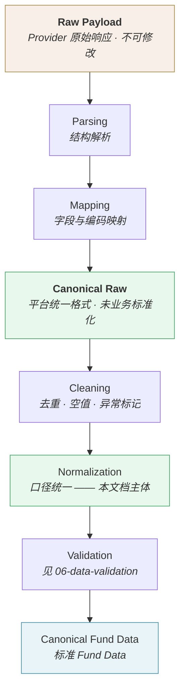
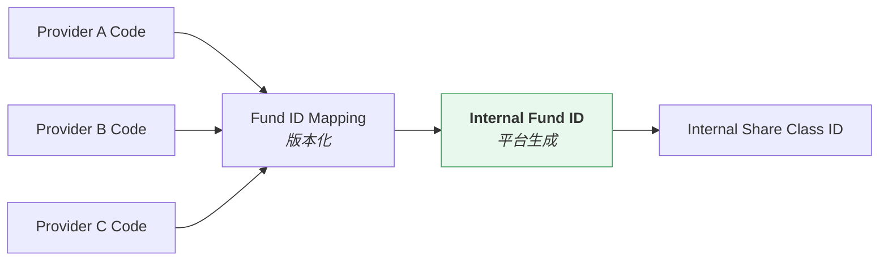
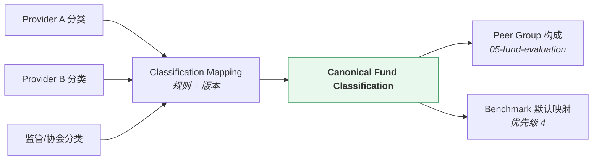

# 数据标准化 · Data Normalization

> 上游文档：docs/01-product/01-product-overview.md（v2.5）｜本文细化环节：① Fund Data
> 业务需求：docs/01-product/02-business-requirements.md（v2.3）§9.2.1 周期口径、§10.2 收益口径
> 架构依赖：docs/02-architecture/03-data-architecture.md（v1.1）
>
> **文档版本**：v1.4 ｜ **产品阶段**：第一阶段

---

## 1. 文档目的与边界

### 1.1 本文档回答什么

> **不同数据源的数据如何统一成平台标准口径？**

### 1.2 本文档不回答什么

| 不回答 | 归属 |
|---|---|
| 各 Factor 的数学公式 | `04-factor` |
| 收益估计方法 | `07-return-risk` |
| 数据从哪来 | `01-data-source` |
| 版本与时点机制 | `04-data-versioning` |
| 标准化后如何校验 | `06-data-validation` |

> **本文档定义"数据口径"，不定义"指标算法"。** 例如：本文档规定收益率基于复权净值、按交易日口径、年化因子 252；但 Sharpe 的具体公式属 `04-factor`。

---

## 2. Normalization Pipeline

### 2.1 七个阶段



> **Parsing 与 Mapping 属 Source Adapter 的职责**（`01-data-source` §12），其产物为 **Canonical Raw**。本文档的主体是 **Cleaning 之后的口径统一**。
>
> **Raw Payload 与 Canonical Raw 的区别**：前者是 Provider 原始响应（不可修改，支持 Adapter 逻辑变更后重新解析）；后者已完成字段映射但**尚未做业务口径统一**（未复权、未映射分类、未规范日期）。

### 2.2 各阶段职责

| 阶段 | 职责 | 不做 |
|---|---|---|
| **Parsing** | 解析 Provider 返回的结构 | 不做业务判断 |
| **Mapping** | 外部编码 → 内部标识；外部分类 → 规范分类 | 不改变数值 |
| **Cleaning** | 去重、空值处理、明显异常标记 | **不做填充**（见 §2.3） |
| **Normalization** | 口径统一：日期、净值、分类、基准、费率 | 不计算 Factor |
| **Validation** | 校验（`06-data-validation`） | —— |

### 2.3 Cleaning 不等于填充

> **`Cleaning` 只做"标记"与"剔除重复"，不做"补齐"。**

| 情形 | 处理 |
|---|---|
| 重复记录（同 `effective_at` + 同 `version` + 同值） | 去重 |
| 缺失值 | **标记为缺失**，进入质量判定；**不插值、不前值填充、不均值填充** |
| 明显异常值（如负净值） | **标记异常**，交由 `06-data-validation` 判定 |

**理由**：任何填充都会制造不存在的事实。缺失应体现为 `UNAVAILABLE`（`03-data-quality`），由下游按缺失规则处理，而非在数据层被悄悄补上。

### 2.4 标准化的可复现要求

> **标准化规则本身必须版本化。**

| # | 要求 |
|---|---|
| NP-1 | 复权规则、分类映射、日期规则均有版本号 |
| NP-2 | 规则变更**不追溯修改已产出的标准化数据**，而是产生新版本重新标准化 |
| NP-3 | 标准化产物记录所用的规则版本 |

**否则**：同一份 Raw Data 在不同时间标准化会得到不同结果，历史无法重现。

---

## 3. Fund ID Normalization

### 3.1 问题

不同 Provider 使用不同的编码体系：

```
Provider A：基金代码 6 位
Provider B：内部 ID + 份额类别后缀
Provider C：交易所代码
```

### 3.2 映射结构



### 3.3 规则

| # | 规则 |
|---|---|
| ID-1 | **Internal Fund ID 由平台生成，不复用任何 Provider Code** |
| ID-2 | 映射关系**版本化** —— Provider 可能变更编码 |
| ID-3 | 映射到 **Share Class 粒度**，不止基金粒度（`02-data-domain-model` §4.3） |
| ID-4 | 一对多、多对一的映射必须显式记录，不得静默取其一 |
| ID-5 | 无法映射的记录**进入隔离区**，不得丢弃也不得猜测 |

### 3.4 Share Class 映射的复杂性

> 同一基金的 A / C / I 份额在部分 Provider 中可能：共用一个代码、分别独立代码、或部分份额不提供数据。

`<TBD-DN-1: 各 Provider 的 Share Class 编码规则与映射策略待确认（关联 DS-1、DM-1）>`

---

## 4. Date Normalization

### 4.1 五种必须区分的日期

> **混淆任意两个都会导致时点错误。**

| 日期 | 含义 | 对应字段 |
|---|---|---|
| **Trading Date** | 交易日 | 时间轴基准 |
| **Effective Date** | 数据事实所属的业务日期 | `effective_at` |
| **Publication Date** | 数据对外公布的日期 | → 推导 `available_at` |
| **Available Date** | 平台首次可见的时刻 | `available_at` |
| **Decision Date** | 决策发生的时点 | `decision_at` |

### 4.2 统一规则

| 项 | 规则 |
|---|---|
| **时区** | 全平台统一，以中国市场交易时区为准 |
| **交易日历** | 统一的交易日历，含节假日与非交易日 |
| **Business Day** | 按交易日历判定 |
| **`available_at` 精度** | **到时刻**，不是日期（`04-data-versioning` §4.2 AV-3） |

`<TBD-DN-2: 交易日历的来源与维护方式待数据确认>`

### 4.3 分析周期的口径（已定案）

> 按 `02-business-requirements` §9.2.1（P0-1 决策）：

| 项 | 取值 |
|---|---|
| 周期类型 | **Trading-day Period**（交易日计数） |
| 年化因子 | **252** |
| 起止规则 | `(start, end]` —— 区间收益不含起始日当日 |
| 非交易日处理 | 端点落在非交易日时**向前取最近交易日** |
| 基金成立日 | 成立日净值作为序列起点，**成立日当日不计入收益区间** |

**展示层的例外**：系统须额外提供一份**日历口径收益**，**仅供与基金公司公布数据核对，不参与评分、筛选、组合构建或回测计算**。

### 4.4 数据缺口的处理

| 情形 | 处理 |
|---|---|
| 交易日无净值 | **标记缺失**，不前值填充 |
| 非交易日有净值 | 标记异常，交由校验判定 |
| 连续多日缺失 | 按缺失长度判定质量状态（`03-data-quality`） |

> **不前值填充**是一条硬规则：填充会让波动率被低估、最大回撤被平滑，且这类失真在结果中不可见。

---

## 5. NAV Normalization

### 5.1 两种净值的关系

```
Raw NAV（单位净值）
    +  Distribution（分红）
    +  Split / Merge（份额变动）
        ↓  复权计算
Adjusted NAV（复权净值）  ←  平台默认的收益计算基础
```

### 5.2 复权的必要性

```
某基金 2026-03-15 分红 0.5 元/份

Raw NAV：  3/14 = 2.50  →  3/15 = 2.00   看似下跌 20%
Adjusted： 3/14 = 2.50  →  3/15 = 2.50   实际收益为 0
```

若用 Raw NAV 计算收益，分红日会产生虚假暴跌，污染**全部**下游指标：收益率、波动率、最大回撤、Sharpe、Rolling 序列。

### 5.3 复权规则

| 事件 | 处理 |
|---|---|
| **现金分红** | 按除息日调整历史序列，使分红视为再投资 |
| **份额拆分 / 合并** | 按比例调整历史序列 |
| **复权方向** | **后复权（`BACKWARD`）** —— 已定案 2026-08-27，见 §5.3.1 |

**规则要求**：

| # | 要求 |
|---|---|
| NAV-1 | 复权规则**全平台统一**，且**显式声明并版本化**，不得隐含在计算代码中 |
| NAV-2 | 若 Provider 直接提供复权净值，须校验其口径与平台一致；**不一致时以平台自行计算为准** |
| NAV-3 | 复权计算所依据的分红与拆分记录必须**可追溯** |
| NAV-4 | 复权结果的修订同样产生新 `version`（`04-data-versioning`） |
| **NAV-5** | **原始净值与复权净值双轨保存**，前者不可变（§5.3.1） |
| **NAV-6** | **分红或拆分记录缺失时 `adjusted_nav = UNAVAILABLE`**，不得用 `raw_nav` 冒充（§5.3.2） |

### 5.3.1 复权方向定案：后复权 ✅

> **定案 · 2026-08-27**：`TBD-DN-3` 关闭。见 `TBD-resolution.md` Policy ③。

**双轨保存，不是二选一**：

| 列 | 含义 | 可变性 |
|---|---|---|
| `raw_nav` | 原始净值 | **不可变** |
| `adjusted_nav` | 后复权净值 | 随新事件**向后**延展，历史段不变 |
| `adjustment_factor` | 复权因子 | 同上 |
| `adjustment_method` | 复权方法 | 版本化 |
| `adjustment_policy_version` | 规则版本 | 版本化 |

**三条理由**：

| # | 理由 |
|---|---|
| 1 | **前复权与 PIT 直接冲突** —— 今天的一次分红会改变过去全部价格，历史快照随之变化 |
| 2 | 本系统的 PIT / 可复现 / 回测都要求「历史观察 → 历史计算 → 历史决策」三者关系稳定 |
| 3 | 后复权下新增分红只影响**该日之后**的复权因子，历史序列不变 |

**为什么不选 §5.4 的「前复权 + 版本化」**：技术上可行，但它用一层版本机制去抵消一个本可避免的问题 —— 每次分红都要生成全序列的新版本，存储与查询成本随分红次数线性增长，且 PIT 查询要多一层版本解析。后复权在同样满足 PIT 的前提下不引入这些成本。

**使用口径**：

| 场景 | 用哪个 |
|---|---|
| Factor / Ranking / Backtest 计算 | **一律 `adjusted_nav`** |
| 展示层 | 二者皆可，**但必须标注用的是哪个** |

**规则变更不追溯改写** —— 复权规则变更升 `adjustment_policy_version`，已落库的历史值保持不变。

> **已定案 · 2026-08-27**：复权因子按**除息日再投资**计算。
>
> ```
> f_t = f_{t−1} × (NAV_ex + D) / NAV_ex
>
> NAV_ex = 除息日的除息后净值
> D      = 每份额分红金额
> f_0    = 1
>
> nav_adjusted_t = nav_raw_t × f_t
> ```
>
> **依据 —— 与 §5.3.1「现金分红视为再投资」一致**：该式假设分红在**除息当日**按除息后净值全额再投资，不引入任何关于再投资时点的额外假设。
>
> **为什么不建模真实的再投资时点**（分红到账通常在除息日后数个工作日）：
>
> | # | 理由 |
> |---|---|
> | 1 | 建模到账时滞需要**逐只基金的分红到账日**，该数据的可得性与一致性都不确定 |
> | 2 | **时滞期间的收益归属无法确定** —— 资金在途时既不在原基金也不在任何标的中，任何假设（按 `R_f` 计息？按零收益？）都是引入的 |
> | 3 | 时滞对长期复权序列的影响在**基点量级**，远小于 Policy A 定义的净值精度（8 位小数）所能表达的范围之外的误差累积 |
>
> **拆分与合并的处理**：`f_t = f_{t−1} × 拆分比例`，不涉及再投资假设。
>
> **同一序列中分红与拆分同日发生时**，先处理拆分再处理分红 —— 因为分红金额 `D` 是按拆分后的份额计算的。

### 5.3.2 分红记录缺失时不得用 `raw_nav` 冒充 ⚠️

```
复权所需的分红 / 拆分记录缺失
    → adjusted_nav = UNAVAILABLE
    → 该期全部基于净值的 Factor 不可算
```

> **为什么必须硬失败**：静默使用 `raw_nav` 会在分红日产生**虚假暴跌** —— 一只分红 3% 的基金看起来当日跌了 3%。该假跌会污染波动率、最大回撤、Sharpe 以及全部 Rolling 序列，且**在净值曲线上看起来完全正常**，事后无法察觉。

**这与 `01-data-source` §11 的 `INFERRED` 是不同性质的兜底**：后者的偏差方向已知且安全（偏保守），前者的偏差方向是**制造不存在的风险事件**，没有任何安全性可言。

### 5.4 前复权的时点陷阱

> **若采用前复权，历史序列会随每次新的分红而变化——这与 PIT 直接冲突。**

```
采用前复权：
  2026-01 的复权净值，在 2026-03 分红后会被重新调整
  → 同一 effective_at 的数值在不同时间查询会不同
  → 违反"同一 decision_at 的查询结果永远一致"（04-data-versioning VR-1）
```

**曾考虑的两个方向**：

| 方案 | 说明 | 结论 |
|---|---|---|
| **后复权** | 历史值不随新事件变化，天然满足 PIT | ✅ **已采纳**（§5.3.1） |
| 前复权 + 版本化 | 每次分红产生新的复权序列版本，PIT 查询取当时可见的版本 | ❌ 否决 —— 用版本机制抵消一个本可避免的问题，成本随分红次数线性增长 |

> **本节保留的意义**：它记录的是「为什么不能用前复权」的论证。若将来有外部数据源只提供前复权净值，本节说明了为何必须由平台按后复权重算（NAV-2），而不能直接采用。

---

## 6. Return Normalization

### 6.1 本节的边界

> **本节定义收益的"数据口径"，不定义 Return Factor 的数学公式（属 `04-factor`）。**

### 6.2 口径要求

| 项 | 规则 |
|---|---|
| **计算基础** | 复权净值（§5） |
| **周期口径** | Trading-day Period（§4.3） |
| **年化因子** | 252 |
| **费用处理** | **管理费与托管费已含于净值，不再扣除**；申赎费属交易成本，由 `08-backtest` 处理 |
| **Rolling 口径** | 滚动窗口按交易日计数，窗口内数据不足时标记 `UNAVAILABLE` |

### 6.3 一致性要求

> **全平台的收益计算必须口径一致**，包括：分周期收益、Rolling Return、超额收益、回测净值序列。

若不同环节使用不同口径，会出现"同一只基金在评分视图与回测报告中收益率不同"这类矛盾。

### 6.4 超额收益的口径

```
超额收益 = 基金收益（复权，交易日口径）− 基准收益（同口径）
```

| # | 要求 |
|---|---|
| ER-1 | 基准收益必须与基金收益**同口径**（同交易日历、同年化规则） |
| ER-2 | 基准为 Composite 时，按各 Component 权重加权后再比较（§8.3） |
| ER-3 | 基准为**价格指数**时与复权净值不同口径，会系统性高估超额收益（§8.4） |

---

## 7. Fund Classification Normalization

### 7.1 映射结构



### 7.2 必须记录的四项

| 项 | 说明 |
|---|---|
| **Source Classification** | 原始分类值 |
| **Canonical Classification** | 映射后的规范分类 |
| **Mapping Rule** | 所用映射规则 |
| **Mapping Version** | 规则版本 |

> **保留原始分类是必要的**：映射规则变更时，可基于原始值重新映射；且分类争议时可回溯。

### 7.3 分类的时点属性

> **分类是版本化实体**（`02-data-domain-model` §3.1）。基金转型会改变分类。

**连锁影响**：

```
Fund Classification 变更
        ↓
Peer Group 变更（05-fund-evaluation）
        ↓
Benchmark Mapping 变更（优先级 4 的默认映射）
```

回测跨越转型点时，三者各自使用当时的版本。

### 7.4 多源分类冲突

若不同 Provider 给出不同分类，按 `01-data-source` §10 的 Reconciliation 规则处理。**分类冲突属于"重大差异"** ——它直接影响 Peer Group 构成，进而影响全部相对指标。

`<TBD-DN-4: Canonical Fund Classification 的分类体系与映射规则待投研确认>`

---

## 8. Benchmark Normalization

### 8.1 统一项

| 项 | 规则 |
|---|---|
| **Benchmark ID** | 平台内部标识，不复用 Provider 编码 |
| **Benchmark Name** | 规范名称 |
| **价格 / 全收益类型** | **必须显式标注**（见 §8.4） |
| **Currency** | 统一标注 |
| **Frequency** | 统一为日频 |
| **Trading Calendar** | 与基金净值使用同一交易日历 |

### 8.2 交易日历不一致的处理

> 基金与基准可能使用不同的交易日历（如 QDII 与境外指数）。

| 情形 | 处理 |
|---|---|
| 基准有值、基金无值 | 该日不计入比较区间 |
| 基金有值、基准无值 | **标记缺口**，不前值填充基准 |
| 长期日历错位 | 标记为 `WARNING`，相对指标可信度下降 |

### 8.3 Composite Benchmark 的合成

```
Composite Return(t) = Σ ( w_i × Component_i Return(t) )
```

| # | 要求 |
|---|---|
| CB-1 | **保留全部 Component 及权重**，不得简化为单一指数（上游 §4.2 ①-B 约束 2） |
| CB-2 | 权重的再平衡频率须显式声明 `<TBD-DN-5>` |
| CB-3 | 任一 Component 数据缺失时，整个 Composite 该日标记缺失 |

### 8.4 价格指数与全收益指数

> **这是最容易被忽略、影响最系统性的一处口径问题。**

| 类型 | 含义 | 与复权净值比较的后果 |
|---|---|---|
| 价格指数 | 不含成分分红 | **系统性高估全部基金的 Alpha 与超额收益** |
| 全收益指数 | 含分红再投资 | 与复权净值同口径 ✓ |

基金净值已含分红再投资，**只有与全收益指数比较才是同口径**。

| # | 规则 |
|---|---|
| BM-1 | 每个 Benchmark 必须标注价格 / 全收益类型 |
| BM-2 | 优先使用全收益指数 |
| BM-3 | 若只能获得价格指数，须**显式标记**，且依赖该基准的相对指标标注可比性限制 |

> **已定案 · 2026-08-27**：基准一律使用**全收益指数**（Total Return Index）。见 `TBD-resolution-2.md` Policy B。
>
> **依据 —— 价格指数会使 Alpha 被系统性高估约一个股息率**（A 股约 2%）：
>
> ```
> 价格指数不含成分股分红
> 基金净值【含】分红再投资（后复权口径）
>     → 一个长期跑平指数的基金会显示出年化 2% 的「超额」
> ```
>
> **该偏差的三个特点使它格外危险**：方向单一（永远高估）、量级与真实 Alpha 相当（主动基金真实年化超额常在 1~3%）、**在净值曲线上不可见**。
>
> **全收益版本不可得时不做自行合成** —— 合成需要成分权重与分红时点，误差可能大于偏差本身。此时该基金的 Alpha / IR / Tracking Error 一律 `UNAVAILABLE`。
>
> **归一化层的动作**：`benchmark_index` 须落 `index_type` 枚举（`PRICE` / `TOTAL_RETURN`，NOT NULL），映射到 `PRICE` 类型时触发校验告警。

---

## 9. Fee Normalization

### 9.1 费用分类与净值关系

| 费用 | 是否已含于净值 | 用途 |
|---|---|---|
| **管理费** | **✅ 已含** | 评分输入（被动型高权重）；**回测不得重复扣除** |
| **托管费** | **✅ 已含** | 同上 |
| **销售服务费** | **待核**（`OPEN-19`） | 见 §9.4 |
| 申购费 | ❌ 未含 | 回测交易成本 |
| 赎回费（含持有期惩罚） | ❌ 未含 | 回测交易成本 |

### 9.2 统一要求

| # | 要求 |
|---|---|
| FE-1 | 费率按 **Share Class 粒度**记录（不同份额费率不同） |
| FE-2 | 费率变更**版本化**，回测使用当时的费率 |
| FE-3 | **"是否已含于净值"必须作为显式属性**，不依赖下游推断 |
| FE-4 | 阶梯费率（按持有期或金额）须完整记录，不得取单一值 |
| **FE-5** | **`included_in_nav` 为三值**（`TRUE` / `FALSE` / `UNKNOWN`），`UNKNOWN` 不得归一化为 `FALSE`（§9.4） |

### 9.3 为什么 FE-3 是硬要求

> 若不显式标注，回测实现者很可能在净值收益之上再扣一次管理费，**系统性低估策略表现约 1–2% 年化**（`02-business-requirements` §21.7）。这个错误方向与"不计成本高估表现"相反，但同样严重，且更难被察觉。

### 9.4 包含关系的归一化（v1.2 定案）

> **定案 · 2026-08-27**：`TBD-DN-7` 关闭。见 `02-business-requirements` §21.7.1、`TBD-resolution.md` Policy ⑩。

**每种费用的必备元数据**（`02-business-requirements` §21.7.1）：

| 字段 | 含义 | 可空 |
|---|---|---|
| `expense_type` | 费用类型 | NOT NULL |
| `expense_rate` | 费率，**版本化** | NOT NULL |
| **`included_in_nav`** | `TRUE` / `FALSE` / **`UNKNOWN`** | NOT NULL |
| `included_in_return` | 是否已反映在收益序列中 | NOT NULL |
| `included_in_backtest` | **推导字段**，不独立配置 | NOT NULL |
| `inclusion_source` | 判定依据：数据源文档 / 招募说明书 / 人工核定 | NOT NULL |

```
included_in_backtest = NOT included_in_nav AND 该费用在交易时发生
```

> **`included_in_nav` 是三值而非布尔** —— `UNKNOWN` 是一个真实且必须可表达的状态，用 `NULL` 表示会与「尚未录入」混淆。

**归一化层的两条职责**：

| # | 职责 |
|---|---|
| 1 | 把各数据源对包含关系的**异构表述**（招募说明书文字、Provider 字段、无声明）统一映射为三值枚举，并记录 `inclusion_source` |
| 2 | **无声明时映射为 `UNKNOWN`，不得映射为 `FALSE`** |

> **为什么 `UNKNOWN → FALSE` 是错的**：`FALSE` 意味着「确认未含于净值，回测应扣除」。若实际已含，就产生重复扣费 —— 而这个错误**在结果上看不出来**，只表现为策略表现整体偏低。`UNKNOWN` 则会一路传到 `unmodeled_costs` 并在回测报告中披露，是**可见的**偏差。

> **归一化不做推断** —— 不得因为「同类基金通常已含」而把 `UNKNOWN` 判成 `TRUE`。推断属数据核定，须落 `inclusion_source = 人工核定` 并留痕。

`<OPEN-19: 数据源的净值是否已扣销售服务费，待数据侧核实>`
`<OPEN-20: 不同份额类别的销售服务费包含关系是否一致，待逐类确认>`

---

## 10. Summary

标准化管线七阶段（Parsing → Mapping → Cleaning → Normalization → Validation → Canonical），六类口径统一：

- **Fund ID** —— 内部标识由平台生成，映射到 **Share Class 粒度**，映射关系版本化
- **Date** —— 五种日期严格区分；分析周期采用 **Trading-day + 年化 252**（已定案）；**不前值填充缺口**
- **NAV** —— 复权是收益计算的基础；**前复权与 PIT 冲突**，已定案采用**后复权 + 原始净值双轨**（§5.3.1）
- **Return** —— 全平台口径一致；管理费与托管费已含于净值
- **Classification** —— 保留原始值 + 规范值 + 规则 + 版本；转型触发三级连锁变更
- **Benchmark** —— Composite 保留全部 Component；**价格指数会系统性高估 Alpha**

> **贯穿全篇的一条原则**：`Cleaning` 只标记不填充。任何填充都会制造不存在的事实，且失真在结果中不可见。

---

## 11. Decisions

| # | 决策 | 理由 |
|---|---|---|
| D-1 | Cleaning 阶段不做任何填充，只标记 | 填充制造不存在的事实；缺失应体现为 `UNAVAILABLE` 由下游按规则处理 |
| D-2 | 标准化规则本身版本化，规则变更不追溯改写已产出数据 | 否则同一 Raw Data 在不同时间标准化会得到不同结果 |
| D-3 | Internal Fund ID 映射到 Share Class 粒度 | 不同份额类别是不同的分析标的 |
| D-4 | 交易日缺口不前值填充 | 填充会低估波动率、平滑最大回撤，且失真不可见 |
| D-5 | Provider 提供的复权净值须校验口径，不一致时以平台自算为准 | 各 Provider 复权规则可能不同，混用会造成口径不一致 |
| D-6 | 分类映射保留原始值 | 规则变更时可重新映射；争议时可回溯 |
| D-7 | 费率"是否已含于净值"作为显式属性 | 防止回测重复扣除管理费 |
| D-8 | 阶梯费率完整记录，不取单一值 | 持有期惩罚影响调仓成本判据 |

---

## 12. Constraints

| # | 约束 | 来源 |
|---|---|---|
| C-1 | 收益计算基于**复权净值**，复权规则全平台统一且显式声明 | 上游 §11.2 NAV 定义、`02-business-requirements` §10.2 |
| C-2 | 分析周期采用 Trading-day Period，年化因子 252 | `02-business-requirements` §9.2.1（P0-1 已定案） |
| C-3 | 日历口径收益仅供核对，不参与任何计算 | 同上 |
| C-4 | Composite Benchmark 不得简化为单一指数 | 上游 §4.2 ①-B |
| C-5 | 管理费与托管费已含于净值，不得重复扣除 | `02-business-requirements` §21.7 |
| C-6 | 缺失数据不得以任何方式填充 | `02-business-requirements` §9.4 |
| C-7 | 本文档不定义 Factor 数学公式 | 提示词 §39、§62 |

---

## 13. TBD

| # | 事项 | 阻塞 | 责任方 |
|---|---|---|---|
| ~~DN-3~~ | ~~前复权 or 后复权~~ —— **已定案**：后复权 + 原始净值双轨保存（§5.3.1）；剩余为复权因子公式（`OPEN-6`） | — | ✅ 已定案 2026-08-27 |
| **DN-4** | Canonical Fund Classification 的分类体系与映射规则 | `05-fund-evaluation`（Peer Group） | 投研 |
| ~~DN-6~~ | ~~各基准的价格/全收益类型确认~~ —— **已定案**：见 Policy B 基准指数类型 | — | ✅ 2026-08-27 |
| DN-1 | 各 Provider 的 Share Class 编码规则与映射策略 | 本域标准化实现 | 数据 |
| DN-2 | 交易日历的来源与维护方式 | 本域日期规范 | 数据 |
| DN-5 | Composite Benchmark 的权重再平衡频率 | `04-factor` | 投研 |
| ~~DN-7~~ | ~~销售服务费的处理与是否已含于净值~~ —— **已定案**：归一化为三值枚举，无声明映射 `UNKNOWN`（§9.4） | — | ✅ 已定案 2026-08-27 |

> **DN-3 曾是本文档优先级最高的待定项，现已定案**（2026-08-27）：采用**后复权**，历史序列不随新分红变化，「同一 `decision_at` 查询结果永远一致」天然成立，`04-factor` 的历史因子值不再有漂移风险。**剩余的 `OPEN-6`（复权因子的具体公式，是否考虑分红再投资时点）不影响这一结论** —— 它决定复权因子的数值，不决定复权的方向性质。

---

## 14. Related Documents

| 关系 | 文档 |
|---|---|
| **上游** | `01-product/01-product-overview.md` v2.4（§11.2 NAV / Benchmark 术语）、`01-product/02-business-requirements.md` v2.3（§9.2.1 周期口径、§10.2 收益规则、§21.7 成本组成） |
| **本域同层** | `01-data-source`（多源仲裁）、`02-data-domain-model`（实体与属性）、`04-data-versioning`（规则版本化与 PIT）、`06-data-validation`（标准化后的校验） |
| **下游** | `04-factor`（消费标准化后的净值与基准）、`05-fund-evaluation`（消费规范分类）、`07-return-risk`、`08-backtest`（成本模型） |

---

## 15. Change Log

| 版本 | 日期 | 变更内容 | 上游依赖 |
|---|---|---|---|
| **v1.4** | 2026-08-27 | **第二批定案（1 项）**。`DN-6` 基准一律**全收益指数** —— 价格指数会使 Alpha 系统性高估约一个股息率（A 股约 2%），该偏差方向单一、量级与真实 Alpha 相当、且在净值曲线上不可见；全收益版本不可得时**不做自行合成**，相关因子 `UNAVAILABLE`。 详见 `TBD-resolution-2.md` | `TBD-resolution-2.md` v1.0 |
| **v1.3** | 2026-08-27 | **`TBD-DN-7` 关闭**。新增 §9.4 与 FE-5 —— 包含关系归一化为三值枚举，**无声明必须映射 `UNKNOWN` 而非 `FALSE`**（后者会造成看不出来的重复扣费，前者是可披露的偏差）；归一化层不做推断，推断须落 `inclusion_source = 人工核定`。详见 `TBD-resolution.md` Policy ⑩ | `02-business-requirements` v2.5 §21.7.1 |
| **v1.2** | 2026-08-27 | **`TBD-DN-3` 关闭**。①§5.3 复权方向定为**后复权（`BACKWARD`）**，新增 §5.3.1 给出双轨保存的五列结构、三条理由与「为什么不选前复权+版本化」的成本论证；②新增 §5.3.2 —— 分红记录缺失时 `adjusted_nav = UNAVAILABLE`，**禁止用 `raw_nav` 冒充**（会制造虚假暴跌且事后不可察觉）；③新增 NAV-5、NAV-6 两条规则要求；④§5.4 由「二选一待定」改为决策论证的留存记录。详见 `TBD-resolution.md` Policy ③ | `01-product-overview` v2.6 |
| v1.1 | 2026-08-25 | **随 01-data-source v2.0 同步**。§2.1 标准化管线起点改为 **Raw Payload → Parsing/Mapping（属 Adapter）→ Canonical Raw**，明确本文档主体是 Cleaning 之后的口径统一；修正对 `01-data-source` 的失效章节引用 | `01-product-overview.md` v2.4、`01-data-source.md` v2.0 |
| v1.0 | 2026-08-25 | 初始版本。定义七阶段标准化管线并明确 **Cleaning 不做填充**；六类口径统一规则；指出**前复权与 PIT 的冲突**（历史序列随分红变化）并给出两种处理方向；落实 P0-1 的 Trading-day + 252 口径；Composite Benchmark 合成规则与**价格指数系统性高估 Alpha** 的警示；费率"是否已含于净值"的显式属性要求 | `01-product-overview.md` v2.4、`02-business-requirements.md` v2.3 |