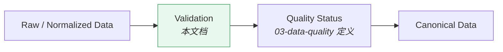
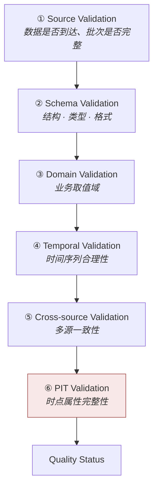
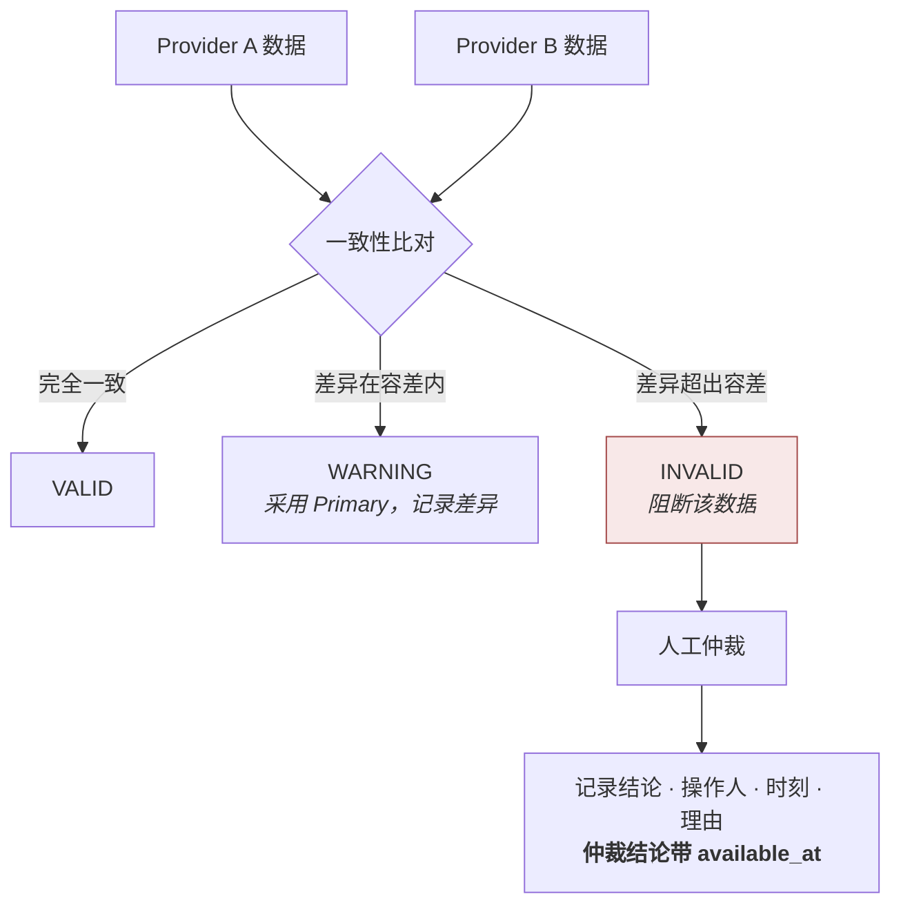
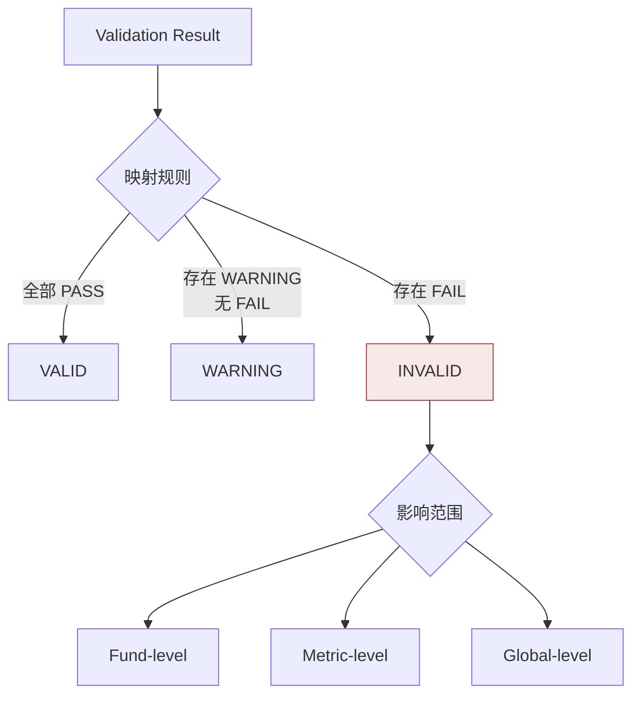

# 数据校验 · Data Validation

> 上游文档：docs/01-product/01-product-overview.md（v2.5）｜本文细化环节：① Fund Data
> 业务需求：docs/01-product/02-business-requirements.md（v2.3）§24 数据质量要求
> 架构依赖：docs/02-architecture/03-data-architecture.md（v1.1）§8 Data Quality Architecture
>
> **文档版本**：v1.2 ｜ **产品阶段**：第一阶段

---

## 1. 文档目的与边界

### 1.1 本文档回答什么

> **数据进入标准数据域后，如何验证其正确性？**

### 1.2 与 `03-data-quality` 的边界

```
03-data-quality    →  定义"什么是好数据"（维度 · 状态 · 阻断规则）
06-data-validation →  定义"如何检查数据是不是好数据"（层级 · 规则 · 结果）
```

**关系**：



### 1.3 本文档不回答什么

| 不回答 | 归属 |
|---|---|
| 质量维度与状态的定义 | `03-data-quality` |
| 阻断粒度的判定标准 | `03-data-quality` §6 |
| 口径统一规则 | `05-data-normalization` |
| 校验失败后的告警与处置流程 | `12-operations` |

---

## 2. Validation Levels

### 2.1 六个层级

> **由浅入深，前一层不通过则后续层无意义。**



### 2.2 各层的失败后果

| 层级 | 失败典型后果 | 常见粒度 |
|---|---|---|
| ① Source | 本批次未到达 | Global 或 Fund |
| ② Schema | 该记录不可解析 | Fund / Metric |
| ③ Domain | 该记录取值非法 | Fund / Metric |
| ④ Temporal | 序列存在缺口或异常 | Fund |
| ⑤ Cross-source | 多源冲突 | Fund / Metric |
| ⑥ **PIT** | **历史计算不可进行** | **Global** |

---

## 3. Source Validation

### 3.1 检查项

| 检查 | 说明 |
|---|---|
| 批次到达 | 是否在约定时间窗内到达 |
| 批次完整性 | 记录数是否在预期范围 |
| 覆盖度 | 覆盖基金数是否显著偏离历史水平 |
| 来源标识 | `source` 字段是否记录实际来源 |

### 3.2 覆盖度骤变的意义

> **覆盖基金数的骤增骤减通常意味着数据源或规则出了问题，而非市场发生了变化。**

```
昨日覆盖 11,800 只  →  今日覆盖 8,200 只
  → 极可能是数据源部分失败，而非 3,600 只基金一夜之间消失
```

此类情形应触发 `WARNING` 或 Global 级审查，而非静默接受。

`<TBD-DVL-1: 覆盖度偏离的告警阈值待数据与运维确认>`

---

## 4. Schema Validation

### 4.1 检查项

| 检查 | 说明 |
|---|---|
| **Required Fields** | 必需字段是否存在 |
| **Data Type** | 类型是否正确 |
| **Format** | 格式是否符合约定（日期、代码等） |
| **Range** | 数值是否在物理可能范围内 |
| **Nullability** | 可空性是否符合约定 |

### 4.2 三个不可为空的字段

> 无论何种数据，以下三项缺失即判 `INVALID`：

```
effective_at   ← 缺失则无法确定数据属于哪天
available_at   ← 缺失则无法做 PIT 判定
version        ← 缺失则无法做版本选择
```

（`04-data-versioning` §2.1）

---

## 5. Domain Validation

### 5.1 业务取值域检查

| 数据 | 约束 |
|---|---|
| NAV | `> 0` —— 基金净值不应为零或负 |
| AUM | `≥ 0` |
| Fee | `≥ 0` |
| 份额权重 | `≥ 0` |
| Date | 有效日期，且不晚于 `available_at` 对应日 |
| Lifecycle Status | 取值在枚举范围内 |
| Classification | 映射后的规范分类在枚举范围内 |

### 5.2 结构性错误 vs 需甄别项

> **不是所有超出预期的数值都是错误。**

| 类型 | 判定 | 举例 |
|---|---|---|
| **结构性错误** | 直接 `INVALID` | 负净值、零净值、日期非法、枚举越界 |
| **需甄别项** | 结合业务事件判定 | Extreme Return、净值跳变、序列缺口 |

**需甄别项的判定流程**（`03-data-quality` §4.2）：

```
异常数值
  → 检查当日是否有分红 / 拆分记录
  → 检查市场同期表现
  → 三者皆无 → WARNING / 人工核查
```

> **业务事件识别在异常判定之前。** 若跳过这一步，分红日会被批量误判为数据错误。

---

## 6. Temporal Validation

### 6.1 检查项

| 检查 | 说明 |
|---|---|
| **Date Sequence** | 序列是否按时间有序 |
| **Duplicate Dates** | 同 `effective_at` + 同 `version` 是否重复 |
| **Future Dates** | `effective_at` 是否晚于合理范围 |
| **Missing Trading Days** | 交易日是否缺净值 |
| **Invalid `effective_at`** | 是否早于基金成立日、晚于清盘日 |
| **Invalid `available_at`** | 是否早于 `effective_at`（一般不应发生） |

### 6.2 `available_at` 早于 `effective_at` 的情形

> 一般情况下 `available_at ≥ effective_at`（数据在其所属日期之后才可见）。

但存在合理例外：

| 情形 | 说明 |
|---|---|
| **预告性公告** | 如"自 X 月 X 日起暂停申购"——公告先于生效日发布 |
| 计划性变更 | 费率调整、基金转型的提前公告 |

**因此**：`available_at < effective_at` **不应直接判为错误**，而应标记 `WARNING` 并核查是否属于预告类数据。

> 这类数据在 PIT 上是**可用的**——决策在 `available_at` 之后就能知道未来的变更，这是真实的信息优势，不是前视偏差。

### 6.3 缺口判定

| 情形 | 判定 |
|---|---|
| 交易日缺净值，基金处于存续期 | 缺口 → 按长度判定 `WARNING` / `INVALID` |
| 交易日缺净值，基金尚未成立或已清盘 | **正常**，非缺口 |
| 非交易日有净值 | 异常 → 核查交易日历 |

> **已定案 · 2026-08-27**：见 `TBD-resolution-2.md` Policy E §E.1 的统一三档判据。
>
> | 档 | 判据 | 状态 |
> |---|---|---|
> | 正常 | 缺口 ≤ 5 个交易日 **且** 完整度 ≥ 0.8 | `VALID` |
> | 告警 | 连续缺失 6~20 个交易日 **或** 完整度 0.6~0.8 | `WARNING` |
> | 不可用 | 连续缺失 > 20 个交易日 **或** 完整度 < 0.6 | `INSUFFICIENT_DATA` |
>
> **20 个交易日 ≈ 一个自然月** —— 公募基金连续一个月不披露净值属异常事件（暂停估值或清盘前状态），此时序列的统计意义已不成立，而非仅仅「数据少了一些」。
>
> **本判据与 `07-return-risk/05` `EM-3` 是同一套**，两处不得分别定义。

---

## 7. Cross-source Validation

### 7.1 比对流程



### 7.2 容差按数据类型区分

> **不同数据的容差量级差异极大，不能用统一阈值。**

| 数据 | 容差方向 |
|---|---|
| NAV | **极紧** —— 净值差异直接影响全部指标 |
| AUM | 较松 —— 各源统计时点与口径可能不同 |
| Fee | 紧 —— 应完全一致 |
| Classification | **不适用容差** —— 分类是离散值，不一致即冲突 |
| Manager | 不适用容差 —— 同上 |

> **已定案 · 2026-08-27**：见 `TBD-resolution-2.md` Policy A §A.4 —— 与 `DS-3` 同一套业务比对容差（净值 1e-6、费率绝对 0）。
>
> **本域是执行方，`01-data-source` 是定义方** —— 校验规则读取同一份配置，不重复定义阈值。

### 7.3 离散值冲突的特殊性

> 分类、经理、生命周期状态等**离散值**没有"轻微差异"——不一致就是冲突。

此类冲突应直接进入人工仲裁，且**分类冲突属于重大差异**（它决定 Peer Group 构成，进而影响全部相对指标）。

### 7.4 仲裁结论的时点属性

> **人工仲裁结论本身是一条带 `available_at` 的数据。**

```
数据冲突发生     T
仲裁完成         T+3
    → 仲裁结论的 available_at = T+3
    → 回测在 T 时点不能使用该结论
```

（`01-data-source` §10.4 AR-5）

---

## 8. PIT Validation

### 8.1 核心检查

> **验证：`available_at ≤ decision_at`**

任何违反即 **PIT Validation Failed**，必须**阻断历史计算**。

### 8.2 检查项

| 检查 | 说明 |
|---|---|
| `available_at` 非空 | 缺失即无法判定 |
| `available_at` 非默认填充 | 以当前时间填充会让历史数据"一直可见" |
| 版本选择正确性 | 是否取了 `available_at ≤ decision_at` 中 `version` 最大者 |
| 派生量的 PIT 传递 | Factor / Score / Universe 的输入是否全部满足约束 |

### 8.3 为什么 PIT Validation 必须 Global 阻断

| # | 理由 |
|---|---|
| 1 | PIT 失败意味着**无法判断数据在决策时点是否可见**——任何基于它的计算都可能带前视偏差 |
| 2 | 前视偏差**在结果中不可见**——净值曲线看起来完全正常 |
| 3 | 局部放行会污染整条链路——一个基金的前视数据会通过 Peer Group 分位影响全组评分 |

### 8.4 PIT Validation 的实施位置

> **PIT 检查应在数据访问层强制实施，而非依赖各处自觉调用**（`02-architecture/03-data-architecture` §5.4）。

本文档定义的是**校验规则**；强制机制属架构层。两者配合：

```
架构层：PIT-aware Data Access Interface 强制携带 decision_at
本文档：定义 available_at 完整性与版本选择正确性的校验规则
```

---

## 9. Validation Result

### 9.1 每次校验必须产生的六项

| 项 | 说明 |
|---|---|
| **Validation Status** | `PASS` / `WARNING` / `FAIL` |
| **Validation Rule** | 触发的规则标识 |
| **Validation Time** | 校验执行时刻 |
| **Data Version** | 被校验数据的版本 |
| **Failure Reason** | 失败原因描述 |
| **Affected Records** | **受影响的记录范围**（可定位到基金 × 字段） |

### 9.2 `Affected Records` 是关键项

> **失败必须可定位到具体对象级别，而非整批标记失败**（`NFR-REL-001` REL-3）。

```
❌  "今日数据校验失败"
✅  "基金 X 的 2026-03-15 净值为负值，触发 Domain Validation 规则 NAV-POSITIVE"
```

前者无法定位、无法只重算受影响部分、无法评估影响范围。

### 9.3 校验结果的留存

| # | 要求 |
|---|---|
| VR-1 | 校验结果**持久化**，不只写日志 |
| VR-2 | 与被校验数据的 `version` 关联 |
| VR-3 | 支持按时间、规则、基金检索——用于质量趋势分析 |

---

## 10. Validation 与 Quality 的衔接

### 10.1 从校验结果到质量状态



### 10.2 映射规则的要求

| # | 要求 |
|---|---|
| MP-1 | 每条校验规则须**预先声明**其失败对应的质量状态与阻断粒度 |
| MP-2 | 映射规则**版本化**——规则调整不追溯改写历史校验结果 |
| MP-3 | 不得在运行时动态调整映射（如"今天先放行明天再说"） |

### 10.3 隔离区

`INVALID` 数据进入**隔离区**而非被丢弃（`02-architecture/03-data-architecture` §8.4）：

| 目的 | 说明 |
|---|---|
| 可追溯 | 保留问题数据供排查 |
| 可恢复 | 修复后可重新进入流程 |
| 可统计 | 隔离量与原因分布是数据源质量的直接度量 |

---

## 11. Summary

数据校验体系由**六个层级**构成，由浅入深：Source → Schema → Domain → Temporal → Cross-source → **PIT**。

四个要点：

- **PIT Validation 是唯一必须 Global 阻断的层级** —— 因为前视偏差在结果中不可见，且会通过 Peer Group 分位污染全组
- **业务事件识别在异常判定之前** —— 否则分红日会被批量误判为数据错误
- **`available_at < effective_at` 不是错误** —— 预告性公告是合理场景，且在 PIT 上可用
- **离散值冲突没有"轻微差异"** —— 分类、经理、状态不一致即冲突，直接转人工；其中分类冲突属重大差异

> **`Affected Records` 是校验结果中最关键的一项**：没有它就无法定位、无法局部重算、无法评估影响范围。

---

## 12. Decisions

| # | 决策 | 理由 |
|---|---|---|
| D-1 | 六层校验按序执行，前层不通过则后层无意义 | 结构错误的数据做业务校验没有意义 |
| D-2 | PIT Validation 失败必须 Global 阻断 | 前视偏差不可见，且局部污染会经 Peer Group 扩散全组 |
| D-3 | `available_at < effective_at` 判 `WARNING` 而非 `INVALID` | 预告性公告是合理场景，在 PIT 上可用 |
| D-4 | 离散值不适用容差，不一致即冲突转人工 | 分类/经理/状态没有"接近正确"的中间状态 |
| D-5 | 校验结果必须持久化并可按对象检索 | 只写日志无法支撑质量趋势分析与影响定位 |
| D-6 | 校验规则到质量状态的映射须预先声明并版本化 | 运行时动态调整等同于没有标准 |
| D-7 | 覆盖度骤变触发审查而非静默接受 | 骤变通常是数据源问题而非市场变化 |

---

## 13. Constraints

| # | 约束 | 来源 |
|---|---|---|
| C-1 | `effective_at` / `available_at` / `version` 缺失即 `INVALID` | `04-data-versioning` §2.1 |
| C-2 | PIT Validation 失败必须阻断历史计算 | 上游 §4.2 ①-PIT、`02-business-requirements` §26.1 |
| C-3 | 失败必须可定位到对象级别 | `NFR-REL-001` REL-3 |
| C-4 | `INVALID` 数据进入隔离区，不得丢弃 | `02-architecture/03-data-architecture` §8.4 |
| C-5 | 校验规则映射不得在运行时动态调整 | 本文档 §10.2 MP-3 |
| C-6 | 业务事件识别必须先于异常判定 | `03-data-quality` §4.3 |

---

## 14. TBD

| # | 事项 | 阻塞 | 责任方 |
|---|---|---|---|
| ~~DVL-3~~ | ~~各数据类型的多源差异容差阈值~~ —— **已定案**：见 Policy A 数值容差体系 | — | ✅ 2026-08-27 |
| DVL-1 | 覆盖度偏离的告警阈值 | `12-operations` | 数据 + 运维 |
| ~~DVL-2~~ | ~~缺口长度与质量状态的对应关系~~ —— **已定案**：见 Policy E 缺口与最小样本量 | — | ✅ 2026-08-27 |
| DVL-4 | 各校验规则到质量状态与阻断粒度的映射表 | 本域实施 | 数据 + 投研（关联 DQ-3） |

---

## 15. Related Documents

| 关系 | 文档 |
|---|---|
| **上游** | `01-product/01-product-overview.md` v2.4（§4.2 ①-PIT）、`01-product/02-business-requirements.md` v2.3（§24 数据质量）、`01-product/05-non-functional-requirements.md` v1.0（NFR-REL-001） |
| **架构依赖** | `02-architecture/03-data-architecture.md` v1.1（§8 质量门、§5.4 PIT 强制机制） |
| **本域同层** | `03-data-quality`（质量标准与阻断粒度）、`04-data-versioning`（时点属性）、`05-data-normalization`（业务事件处理）、`01-data-source`（多源仲裁） |
| **下游** | `12-operations`（校验告警与处置）、`13-governance`（数据治理） |

---

## 16. Change Log

| 版本 | 日期 | 变更内容 | 上游依赖 |
|---|---|---|---|
| **v1.2** | 2026-08-27 | **第二批定案（2 项）**。`DVL-2` 缺口三档判据（≤5 日 `VALID` / 6~20 日 `WARNING` / >20 日 `INSUFFICIENT_DATA`），与 `07-return-risk/05` `EM-3` 是同一套不得分别定义；`DVL-3` 比对容差与 `DS-3` 同源，本域是执行方不是定义方。 详见 `TBD-resolution-2.md` | `TBD-resolution-2.md` v1.0 |
| v1.1 | 2026-08-25 | **随 01-data-source v2.0 同步**。修正对 `01-data-source` 的失效章节引用（§4.4 → §10.4） | `01-product-overview.md` v2.4、`01-data-source.md` v2.0 |
| v1.0 | 2026-08-25 | 初始版本。定义六层校验体系与各层失败后果；三个不可为空的时点字段；区分结构性错误与需甄别项；指出 **`available_at < effective_at` 是预告性公告的合理场景**而非错误；离散值冲突不适用容差；PIT Validation 必须 Global 阻断的三条理由；Validation Result 六项与 `Affected Records` 的关键性；校验结果到质量状态的映射规则 | `01-product-overview.md` v2.4、`03-data-architecture.md` v1.1 |