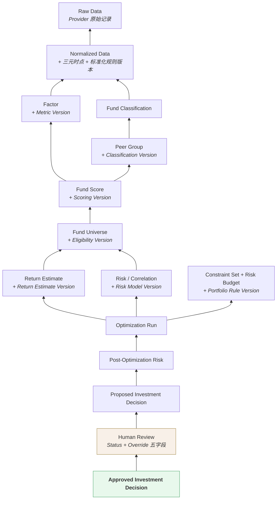
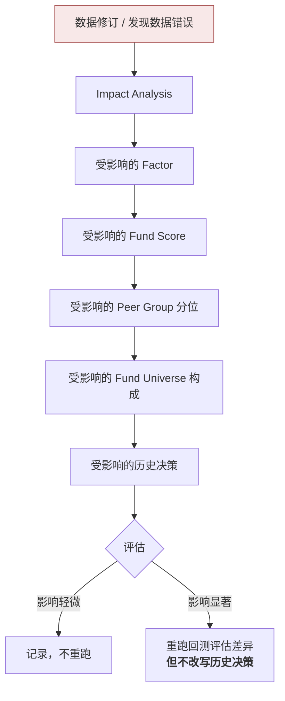
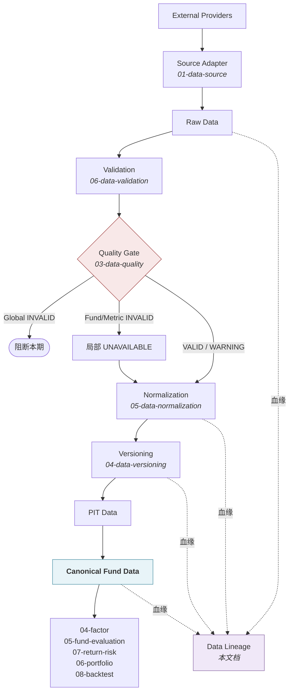

# 数据血缘 · Data Lineage

> 上游文档：docs/01-product/01-product-overview.md（v2.5）｜本文细化环节：① Fund Data（贯穿全链路）
> 业务需求：docs/01-product/02-business-requirements.md（v2.3）§27.3 完整审计链
> 架构依赖：docs/02-architecture/03-data-architecture.md（v1.1）§7 Data Lineage
>
> **文档版本**：v1.1 ｜ **产品阶段**：第一阶段

---

## 1. 文档目的与边界

### 1.1 本文档回答什么

> **任意一个最终投资结果，能否追溯到它使用的原始数据？**

这是系统**可解释性与审计能力**的基础。上游把"过程不可追溯"列为要解决的核心问题之一（上游 §2.2）。

### 1.2 本文档不回答什么

| 不回答 | 归属 |
|---|---|
| Factor / Score / Portfolio 的计算逻辑 | 各自所属域 |
| 血缘信息如何物理存储 | `11-database` |
| 审计流程与合规要求 | `13-governance` |
| 血缘的可视化与查询界面 | 产品设计 |

---

## 2. Lineage Graph

### 2.1 全链路血缘



### 2.2 血缘必须回答的四个问题

链路每一环都必须能回答：

| # | 问题 | 数据支撑 |
|---|---|---|
| 1 | **谁**产生的 | Owner Service + 操作人（人工环节） |
| 2 | **什么时候**产生的 | `decision_at` + 写入时刻 |
| 3 | 使用了**什么版本** | 九项 Strategy Version + Code Version + Data Version |
| 4 | 使用了**什么规则与数据** | 配置快照 + 上游数据引用 |

### 2.3 Human Review 必须在链上

> 审计链中**必须包含人工复核环节**——否则无法回答"系统算出 12%，为什么最后是 7%"。

若 Override 无记录：

| 失效项 | 后果 |
|---|---|
| `NFR-REPRO-001` | 相同版本重跑得不到实盘的权重 |
| `NFR-AUDIT-001` | 链条在人工环节断裂 |
| Backtest-Live Deviation | 无法区分偏离来自策略失效还是人工干预 |

---

## 3. Data Lineage Levels

### 3.1 三个粒度

| 级别 | 追溯对象 | 用途 | 存储代价 |
|---|---|---|---|
| **Dataset Level** | 数据集 → 数据集 | 影响范围的粗粒度判定 | 低 |
| **Record Level** | 单条记录 → 单条记录 | 精确定位问题来源 | **高** |
| **Decision Level** | 决策 → 全部输入 | 决策解释与审计 | 中 |

### 3.2 Dataset Level

```
Normalized NAV Dataset  →  Factor Dataset  →  Score Dataset
```

**用途**：快速判断"某个数据集出问题会影响哪些下游数据集"。

**局限**：无法回答"哪几只基金受影响"。

### 3.3 Record Level

```
Fund A 的 2026-03-15 NAV（version 2）
        ↓
Fund A 的 3Y Sharpe（Metric Version 1.2）
        ↓
Fund A 的 Risk-Adjusted Score
```

**用途**：精确定位。数据修订后能准确回答"哪些因子值需要重算"。

**代价**：血缘记录量与数据量同阶（净值 3000 万行 → 血缘记录同量级）。

> **已定案 · 2026-08-27**：**Record Level 血缘仅覆盖决策链路**，非决策链路保留 Dataset Level。见 `TBD-resolution-2.md` Policy C。
>
> **依据 —— 全量 Record 级血缘的存储量与 `factor_value` 同量级**：
>
> ```
> factor_value 约 3000 万行/年
> 每行的 Record 级血缘边至少 2~3 条（净值 → 因子、R_f → 因子）
>     → 血缘表比业务表还大
>     → 而其中绝大部分【永远不会被查询】
> ```
>
> **决策链路的定义**：进入过 `investment_decision` 或 `portfolio_target` 的那些派生量，及其上游。这部分是审计对象，必须可追溯到记录级。
>
> **非决策链路**（如未被采纳的候选、纯展示用的因子）保留 Dataset Level —— 可回答「这个数据集来自哪个源」，不回答「这一行来自哪一行」。
>
> **保留期 7 年**（L3 层）。

### 3.4 Decision Level

```
Portfolio Weight（Fund A = 12%）
        ↓
Optimization Run  →  Constraint Set · Risk Budget · Objective
        ↓
Return Estimate · Covariance
        ↓
Fund Universe  →  Fund Score  →  Peer Group  →  Factor
        ↓
Data Snapshot（三元时点）
```

**用途**：这是**可解释性的直接支撑**——回答上游原则十二的四个问题（为什么进 Universe、为什么被选中、为什么是这个权重、承担什么风险）。

**这一级是第一阶段的必需项**，另两级可按代价权衡。

---

## 4. Lineage Metadata

### 4.1 每条血缘边必须记录

| 项 | 说明 |
|---|---|
| **上游对象标识** | 数据集 / 记录 / 快照 ID |
| **下游对象标识** | 同上 |
| **转换类型** | 标准化 / 计算 / 聚合 / 筛选 / 求解 |
| **规则版本** | 该转换所用的版本（Metric / Scoring / Portfolio Rule 等） |
| **执行标识** | `decision_id` 或 `execution_id` |
| **产生时刻** | 写入时刻 |
| **Owner** | 产生该对象的 Service |

### 4.2 血缘必须在数据产生时同步记录

> **事后重建血缘是不可能的。**

| # | 理由 |
|---|---|
| 1 | 事后重建需要知道"当时用的是哪个配置版本"——而这**正是血缘要回答的问题**，构成循环依赖 |
| 2 | 中间产物可能已被清理 |
| 3 | 配置可能已变更 |

（`02-architecture/03-data-architecture` §7.4）

### 4.3 血缘不可篡改

| # | 要求 |
|---|---|
| LM-1 | 血缘记录**只追加，不修改** |
| LM-2 | 数据修订产生**新的血缘边**，旧边保留 |
| LM-3 | 血缘记录的保留期限不短于其所描述数据的保留期限 |

---

## 5. Decision Snapshot 中的血缘

### 5.1 快照即血缘的固化形式

> **Decision Snapshot 本身就是一份 Decision Level 的血缘记录。**

它以"闭包"形式保存了该次决策的全部输入引用（`02-architecture/01-system-architecture` §10.4）：

```
执行上下文    decision_id · decision_at · data_as_of · trigger_type · runtime_mode
版本引用      九项 Strategy Version + Data Version + Code Version
上游快照引用  Peer Group Snapshot ID · Universe Snapshot ID
本阶段输入    Return Estimate · Risk Metrics · Correlation · Covariance
问题定义      Constraint Set · Risk Budget · Optimization Objective
求解记录      Optimization Run
事后风险      Post-Optimization Risk
决策产出      Target Weight · Decision Status
人工环节      Reviewer · Review Time · Decision · Override 五字段
```

### 5.2 引用而非复制

> 快照**引用**上游快照的 ID，而非复制其内容（`02-architecture/01-system-architecture` §10.3）。

| 优点 | 说明 |
|---|---|
| 事务范围可控 | 快照写入的事务仅限本阶段产出 + 引用键 |
| 存储不冗余 | Peer Group / Universe 内容只存一份 |
| 血缘天然成立 | 引用关系即血缘边 |

**前提**：被引用的快照**不可删除**——否则血缘断裂，决策不可重建。

### 5.3 闭包判定

> 给定快照，**不依赖任何当前系统状态**，即可完整回答"这个决策是如何得出的"。

若某项输入既不在快照中、也无法通过快照中的版本引用唯一定位，则该快照**不是闭包**。

---

## 6. Impact Analysis

### 6.1 正向与反向

| 方向 | 问题 | 用途 |
|---|---|---|
| **反向追溯**（Upstream） | 这个结果用了什么数据？ | 决策解释、审计 |
| **正向影响**（Downstream） | 这份数据影响了什么结果？ | **数据修订后的影响评估** |

### 6.2 影响分析流程



### 6.3 一处容易被低估的传导

> **单只基金的数据错误会通过 Peer Group 分位影响整组基金的评分。**

```
Fund A 的 Sharpe 因数据错误偏高
    → Fund A 在 Peer Group 内的分位偏高
    → 其他基金的相对分位相应下移
    → 整组的 Score 都受影响
    → Universe 构成可能改变
```

因此影响分析**不能只看直接使用该数据的对象**，必须沿分位/排名这类**相对计算**的传导路径展开。

### 6.4 影响评估不改写历史

> **评估是评估，不是重写。**

| # | 规则 |
|---|---|
| IA-1 | 历史决策快照**保持不变** |
| IA-2 | 评估结论作为**新的分析产出**记录 |
| IA-3 | 若影响显著，可基于新数据重跑回测，结果标记为"基于修订后数据的重跑" |

（`04-data-versioning` §8.2、§8.3）

---

## 7. Lineage 与 Backtest

### 7.1 回测对血缘的两个依赖

| 依赖 | 说明 |
|---|---|
| **快照可读** | 回测优先读取当期已固化的 Peer Group / Universe 快照（`04-data-versioning` §7.3） |
| **版本可解析** | 回测需要按 `decision_at` 解析出当时的数据视图与配置版本 |

### 7.2 回测产生的血缘

> **回测的每一期决策同样产生完整的血缘记录。**

| # | 要求 |
|---|---|
| BL-1 | 回测逐期快照与实盘快照**同构** |
| BL-2 | 回测快照标记 `runtime_mode = BACKTEST` |
| BL-3 | 回测血缘与实盘血缘**分开检索**，避免混淆 |

**BL-1 的意义**：同构才能让"回测预期 vs 实盘实际"的对比在同一维度上进行，也才能验证单一策略实现原则确实成立。

### 7.3 血缘支撑的回测有效性检查

| 检查 | 依赖的血缘信息 |
|---|---|
| **前视偏差** | 每个输入的 `available_at` 是否 ≤ 该期 `decision_at` |
| **幸存者偏差** | 该期 Peer Group / Universe 快照是否为当时留存 |
| **交易可得性** | 建仓时该基金的 `Investment Eligibility` 状态 |
| **单一实现** | 回测与实盘的 Code Version 是否一致 |

> **没有血缘，这四项都无法事后验证**——只能依赖实现者的自觉。

---

## 8. Lineage 与 Audit 的区别

### 8.1 两者不是同一件事

| | **Data Lineage** | **Decision Audit** |
|---|---|---|
| 回答 | 这份**数据**从哪来 | 这个**决策**由谁、何时、基于什么版本做出 |
| 链条 | Source → Raw → Normalized → Factor → Score | Decision → 版本引用 → Reviewer → Override |
| 关注 | **数据的转换路径** | **决策的责任与依据** |
| 含人工环节 | 否（仲裁除外） | **是**（Human Review 必在链上） |
| 主要用途 | 影响分析、问题定位 | 合规审计、决策解释 |

（`02-architecture/01-system-architecture` §15 原则八）

### 8.2 两者的交汇点

```
Decision Audit 的下半段 = Data Lineage 的上半段
```

```
Approved Decision → Human Review → Proposed Decision → Optimization
        ↑ Decision Audit 独有
                                            ↓ 交汇
        Universe → Score → Factor → Normalized → Raw
                                            ↑ Data Lineage
```

**因此**：Decision Audit 依赖 Data Lineage，但比它多出**人工环节与责任归属**。

### 8.3 为什么必须区分

| 若混为一谈 | 后果 |
|---|---|
| 用血缘代替审计 | 缺少 Human Review，无法回答"为什么人工改了权重" |
| 用审计代替血缘 | 缺少数据级传导路径，无法做影响分析 |

---

## 9. 核心数据流（本域全景）



---

## 10. Summary

数据血缘由三个粒度构成，其中 **Decision Level 是第一阶段的必需项**：

- **三个级别** —— Dataset（粗粒度影响判定）、Record（精确定位，代价高）、**Decision**（可解释性的直接支撑）
- **血缘必须在数据产生时同步记录** —— 事后重建需要知道"当时用的哪个版本"，而这正是血缘要回答的问题，构成循环依赖
- **Decision Snapshot 即固化的 Decision Level 血缘** —— 以闭包形式保存全部输入引用；**引用上游快照 ID 而非复制**，前提是被引用快照不可删除
- **影响分析必须沿相对计算的传导路径展开** —— 单只基金的数据错误会通过 Peer Group 分位影响整组评分

> **Lineage 与 Audit 不是同一件事**：前者回答"数据从哪来"，后者回答"决策由谁、基于什么做出"。Audit 依赖 Lineage，但多出**人工环节与责任归属**。

---

## 11. Decisions

| # | 决策 | 理由 |
|---|---|---|
| D-1 | Decision Level 血缘为第一阶段必需，另两级按代价权衡 | 它直接支撑可解释性的四个必答问题 |
| D-2 | 血缘在数据产生时同步记录，不事后重建 | 事后重建构成循环依赖，且中间产物可能已清理 |
| D-3 | 血缘记录只追加不修改，修订产生新边 | 与数据版本化原则一致 |
| D-4 | Decision Snapshot 引用上游快照 ID 而非复制 | 事务范围可控、存储不冗余、引用关系即血缘边 |
| D-5 | 被引用的快照不可删除 | 删除即血缘断裂，决策不可重建 |
| D-6 | 影响分析须沿分位/排名等相对计算的传导路径展开 | 单基金错误会经 Peer Group 分位影响整组 |
| D-7 | 影响评估不改写历史决策，结论作为新产出记录 | 改写历史输入会破坏可复现性与审计有效性 |
| D-8 | 回测血缘与实盘血缘同构但分开检索 | 同构才能对比；分开才不混淆 |

---

## 12. Constraints

| # | 约束 | 来源 |
|---|---|---|
| C-1 | 审计链必须包含 Human Review 环节 | 上游 原则七、`02-business-requirements` §27.3 |
| C-2 | 血缘必须在决策发生时同步落库 | `02-architecture/03-data-architecture` §7.4 |
| C-3 | Decision Snapshot 必须是闭包 | `NFR-REPRO-001`、`02-architecture/01-system-architecture` §10.4 |
| C-4 | 被引用的上游快照不可删除 | 本文档 §5.2 |
| C-5 | 血缘记录只追加不修改 | 本文档 §4.3 LM-1 |
| C-6 | 血缘保留期限不短于其描述数据的保留期限 | 本文档 §4.3 LM-3 |

---

## 13. TBD

| # | 事项 | 阻塞 | 责任方 |
|---|---|---|---|
| ~~DL-1~~ | ~~Record Level 血缘的覆盖范围（全量 vs 关键路径）~~ —— **已定案**：见 Policy C 保留期限体系 | — | ✅ 2026-08-27 |
| DL-2 | 血缘记录的保留期限 | `11-database`（归档策略） | 合规（关联 NFR-9、DV-3） |
| DL-3 | 影响分析的自动触发条件（修订后是否自动评估） | `13-governance` | 治理（关联 DV-2） |
| DL-4 | 血缘查询的性能要求 | `11-database` | 技术（关联 NFR-1） |

---

## 14. Related Documents

| 关系 | 文档 |
|---|---|
| **上游** | `01-product/01-product-overview.md` v2.4（原则七、原则十二）、`01-product/02-business-requirements.md` v2.3（§27.3 审计链、§27.5 四个必答问题） |
| **架构依赖** | `02-architecture/03-data-architecture.md` v1.1（§7 Data Lineage）、`02-architecture/01-system-architecture.md` v2.0（§10.4 快照闭包、§14 原则八） |
| **本域同层** | `01-data-source`（来源标识）、`04-data-versioning`（版本与快照）、`03-data-quality`（影响分析用途）、`06-data-validation`（校验结果留存） |
| **下游** | `08-backtest`（回测有效性检查）、`11-database`（血缘存储）、`13-governance`（审计与合规） |

---

## 15. Change Log

| 版本 | 日期 | 变更内容 | 上游依赖 |
|---|---|---|---|
| **v1.1** | 2026-08-27 | **第二批定案（1 项）**。`DL-1` **Record Level 血缘仅覆盖决策链路**，非决策链路保留 Dataset Level —— 全量记录级血缘的存储量与 `factor_value` 同量级（血缘表比业务表还大），而其中绝大部分永远不会被查询；保留期 7 年。 详见 `TBD-resolution-2.md` | `TBD-resolution-2.md` v1.0 |
| v1.0 | 2026-08-25 | 初始版本。定义全链路血缘图与四个必答问题；三个血缘级别及其代价权衡（Decision Level 为第一阶段必需）；**血缘必须同步记录**的循环依赖论证；Decision Snapshot 作为固化血缘与"引用而非复制"机制；影响分析的正反双向及**经 Peer Group 分位传导**的隐蔽路径；明确区分 **Data Lineage 与 Decision Audit**（后者多出人工环节与责任归属）；血缘支撑的四项回测有效性检查 | `01-product-overview.md` v2.4、`03-data-architecture.md` v1.1 |