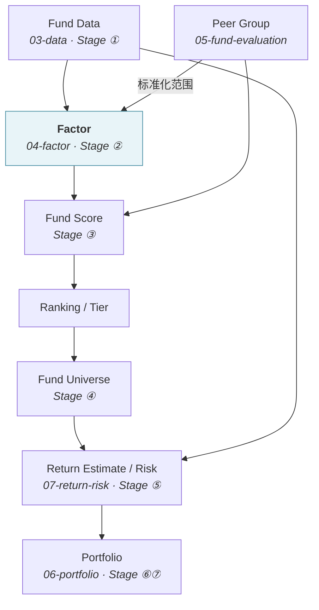

# 因子总览 · Factor Overview

> 上游文档：docs/01-product/01-product-overview.md（v2.5）｜本文细化环节：② Factor
> 业务需求：docs/01-product/02-business-requirements.md（v2.3）§10–§14
> 数据依赖：docs/03-data/（v1.0–v2.0）｜架构依赖：docs/02-architecture/02-service-architecture.md（v1.1）
>
> **文档版本**：v1.2 ｜ **产品阶段**：第一阶段

---

## 1. 文档目的与边界

### 1.1 本文档回答什么

> **Factor 在整个投资系统中是什么，为什么需要它，它处在什么位置？**

本文档是 `04-factor` 域的入口，确定 Factor 的定义、分类框架、生命周期与域边界。

### 1.2 本域八份文档的分工

| 文档 | 回答 |
|---|---|
| **`01-factor-overview`** | Factor 是什么、为什么需要 |
| `02-factor-taxonomy` | 如何分类与编号 |
| `03-factor-definition` | **每个 Factor 具体是什么**（本域最重要） |
| `04-factor-calculation` | 如何计算 |
| `05-factor-normalization` | 如何标准化 |
| `06-factor-versioning` | 规则变更后历史如何重现 |
| `07-factor-validation` | 如何验证正确性 |
| `08-factor-output` | 以什么形式提供给下游 |

---

## 2. Factor Domain 的定位

### 2.1 位置

```
03-data                    04-factor                  05-fund-evaluation
Canonical PIT Data    →    Factor Calculation    →    Fund Score
                           Factor Result
```

### 2.2 核心职责

> 将**标准化、经过质量验证、具有 Point-in-Time 语义**的 Fund Data，转换为可用于基金评价、筛选、风险分析与组合决策的**标准化 Factor**。

### 2.3 本域不负责什么

| 不负责 | 归属 |
|---|---|
| Fund Master Data、数据源、数据标准化、数据质量、数据血缘 | `03-data` |
| **Fund Score、Ranking、Tier、Peer Group、Fund Universe** | `05-fund-evaluation` |
| **Return Estimate、Risk Estimate、Correlation、Covariance** | `07-return-risk` |
| Portfolio Construction、Optimization | `06-portfolio` |
| Backtest 执行与评价 | `08-backtest` |
| Investment Decision、自动交易 | 各自所属域 / Out of Scope |

### 2.4 两条最容易越界的边界

#### ① Factor 不做多因子合成

> **任何形式的"综合因子""因子总分"本质上都是 `Fund Score`，属 `05-fund-evaluation`。**

这是上游 §4.2 ② 卡片的边界条款，不可放松。Factor 层只产出**单一量化特征**。

#### ② Factor 不是 Return Estimate

```
Factor           描述历史特征（已实现的收益、波动、回撤）
Return Estimate  对未来持有期的收益估计（Stage ⑤-A，属 07-return-risk）
```

即使某个 Factor 名为 "Annual Return"，它也是**历史已实现收益**，不是对未来的估计。两者在系统层面必须独立演进（上游 原则三）。

---

## 3. Factor 的定义

### 3.1 业务定义

> **Factor 是基于标准化 Fund Data 计算得到的、具有明确经济含义、明确计算定义与明确研究假设的单一量化特征。**

（沿用上游 §4.2 ② 卡片的定义）

### 3.2 构成公式

```
Input Data（PIT）  +  Deterministic Rule  =  Factor
```

三个要素缺一不可：

| 要素 | 要求 |
|---|---|
| **Input Data** | 必须是标准化、时点对齐的 Fund Data（`03-data`） |
| **Deterministic Rule** | 相同输入必然得到相同输出，无随机性 |
| **Factor** | 带 ID、版本、方向、单位语义的结果，而非一列裸数值 |

### 3.3 Factor 不是什么

| 不是 | 说明 |
|---|---|
| **不是一列数值** | 没有 ID / Version / Direction / Unit 的数值不构成 Factor |
| **不是黑箱输出** | 必须可解释到公式与输入 |
| **不是预测** | 描述历史特征，不预测未来 |
| **不是评分** | 单一维度，不做加权合成 |

---

## 4. Factor 与 Metric 的关系

### 4.1 三层关系

```
Raw Data  →  Metric  →  Factor
```

但在本系统中，多数情况下：

```
Metric = Factor
```

例如 `Annual Return`、`Volatility`、`Maximum Drawdown`、`Sharpe Ratio` 既是分析指标，也是正式 Factor。

### 4.2 判定标准

> **在本系统中，一个指标只有同时具备以下六项，才视为正式 Factor：**

| # | 要件 |
|---|---|
| 1 | 唯一 **Factor ID** |
| 2 | **Factor Version** |
| 3 | **Preference Direction** |
| 4 | **Unit** |
| 5 | **Factor Usage** 声明（DISPLAY / SCORING / SCREENING / BACKTEST） |
| 6 | 可被 `05-fund-evaluation`、Fund Universe 或 Backtest 消费 |

**不满足者只是"分析指标"**，可以展示，但不进入评分、筛选与组合决策。

### 4.3 为什么要这个区分

若不区分，任何临时计算的数值都可能被当作 Factor 进入评分体系，导致：

- 评分方案无法版本化（因为不知道用了哪些 Factor）
- 历史结果无法重现（因为临时指标无 Version）
- 方向不明确（消费方需自行猜测越高越好还是越低越好）

---

## 5. Factor 的业务价值

### 5.1 四类价值

| 类别 | 衡量什么 | 回答的投资问题 |
|---|---|---|
| **Performance** | 基金获得收益的能力 | 这只基金赚了多少？ |
| **Risk** | 基金承担风险的程度 | 为此承担了多大风险？ |
| **Risk-adjusted Performance** | 单位风险对应的收益 | 这个风险值不值得？ |
| **Stability** | 表现是否稳定 | 这是持续能力还是一次运气？ |

### 5.2 为什么四类缺一不可

```
只看 Performance          →  选出高波动高回撤的基金
只看 Risk                 →  选出低收益的稳定基金
只看 Risk-adjusted        →  可能选中"一次押注成功"的基金
缺少 Stability            →  无法区分持续能力与运气
```

（`02-business-requirements` §12.2：收益高 + 风险低 + 回撤可控 + 长期稳定）

### 5.3 第五类：Relative Performance

除上述四类外，还需要**相对基准**的表现衡量：

| Factor | 衡量 |
|---|---|
| Excess Return | 相对基准的超额 |
| Alpha | 无法由基准解释的收益 |
| Beta | 对基准的敏感度 |
| Information Ratio | 单位跟踪误差的超额 |
| Tracking Error | 相对基准的偏离 |

> **这类 Factor 全部依赖 Benchmark**，Benchmark 不可得时一并标记 `UNAVAILABLE`（`03-data/01-data-source` §5）。

---

## 6. Factor 在投资链路中的位置

### 6.1 链路位置



### 6.2 三条位置约束

| # | 约束 |
|---|---|
| P-1 | **Factor 不直接产生 Portfolio Weight** —— 中间必须经过 Score、Universe、Return/Risk、Construction、Optimization |
| P-2 | **Factor 消费 Peer Group，但不构建它** —— Peer Group 归 `05-fund-evaluation`，且其构建不依赖 Factor 或 Score（上游 `FR-PEER-001`） |
| P-3 | **`07-return-risk` 不消费 Factor** —— 它需要的是原始收益序列，不是因子值（`02-architecture/02-service-architecture` §6.8） |

### 6.3 P-3 的重要性

> 这条边界保证了 `Return Estimate` 与 `Fund Score` 两条数据流在系统层面**独立演进**。

```
Fund Data ──→ Factor ──→ Fund Score ──→ Fund Universe
    │                                        │
    └────────→ Return Estimate ←─────────────┘
              （只取 Universe 成员列表，不取评分）
```

若 `07-return-risk` 消费 Factor，两条流就耦合了，`Fund Score` 的变化会间接影响 `Return Estimate`——这正是上游 §5.2 要防止的。

---

## 7. Factor 的核心要求

### 7.1 每个正式 Factor 必须具备的十二项

| # | 项 | 说明 |
|---|---|---|
| 1 | **Factor ID** | 唯一标识（`02-factor-taxonomy` §Factor ID） |
| 2 | **Name** | 名称 |
| 3 | **Business Meaning** | 业务含义——**不能只有公式** |
| 4 | **Formula** | 数学定义 |
| 5 | **Input Data** | 依赖哪些 Dataset |
| 6 | **Time Window** | 1M / 3M / 6M / 1Y / 3Y / 5Y / Rolling 12M |
| 7 | **Calculation Frequency** | Daily / Weekly / Monthly |
| 8 | **Unit** | 百分比 / 小数 / 比率 / 天数 / 计数 |
| 9 | **Preference Direction** | 上游四取值之一（§7.2） |
| 10 | **Minimum Observations** | 最小有效观测数 |
| 11 | **Missing Data Rule** | 缺失时如何处理 |
| 12 | **Version** | Factor 版本 |

### 7.2 Preference Direction 沿用上游定义

> **上游 §11.2 已定义四个取值，本域不新增、不改名：**

| 取值 | 含义 | 举例 |
|---|---|---|
| `HIGHER_IS_BETTER` | 越高越好 | Sharpe、年化收益 |
| `LOWER_IS_BETTER` | 越低越好 | Volatility、Maximum Drawdown |
| `TARGET_RANGE` | 目标区间 | **Beta**——0.5 不必然优于 1.0 |
| `STRATEGY_DEPENDENT` | 依策略而定 | **Tracking Error**——被动型越低越好，主动型是超额来源 |

> **不得默认"所有风险类指标越低越好"**（`02-business-requirements` §11.3）。

### 7.3 Factor Usage 沿用上游定义

> 上游 §11.2 定义了五种用途，每个 Factor 必须声明至少一种：

```
DISPLAY  ·  SCORING  ·  SCREENING  ·  PORTFOLIO  ·  BACKTEST
```

**Factor 存在 ≠ Factor 参与评分。** 用途矩阵见 `02-business-requirements` §14.2 与本域 `02-factor-taxonomy`。

---

## 8. Factor 的生命周期

### 8.1 八个阶段

```mermaid
flowchart LR
    D["Definition<br/><i>03-factor-definition</i>"]
    I["Input<br/><i>PIT 数据选取</i>"]
    C["Calculation<br/><i>04-factor-calculation</i>"]
    V["Validation<br/><i>07-factor-validation</i>"]
    N["Normalization<br/><i>05-factor-normalization</i>"]
    VE["Versioning<br/><i>06-factor-versioning</i>"]
    P["Publication<br/><i>08-factor-output</i>"]
    CO["Consumption<br/><i>下游消费</i>"]

    D --> I --> C --> V --> N --> VE --> P --> CO

    style C fill:#e8f8ec,stroke:#4aa46a
```



### 8.2 阶段顺序的两个要点

| # | 要点 |
|---|---|
| L-1 | **Validation 在 Normalization 之前** —— 未通过校验的 Raw Factor 不应进入标准化，否则异常值会污染整个横截面的分位 |
| L-2 | **Versioning 贯穿全程** —— 每个阶段的产物都携带 Factor Version；发布时固化 |

---

## 9. 第一阶段的技术立场

### 9.1 六项原则

```
Rule-based  ·  Deterministic  ·  Explainable
Reproducible  ·  Versioned  ·  Point-in-Time
```

### 9.2 明确排除

| 排除项 | 说明 |
|---|---|
| **ML Factor** | 不实现 |
| **AI-generated Factor** | 不实现 |
| **LLM-generated Factor** | 不实现 |
| **Neural Network Factor** | 不实现 |
| **Black-box Factor** | 不实现——任何无法拆解到公式与输入的 Factor 不予接受 |

> 上述可作为 **Future Extension** 记录，**不得**出现在任何 Factor Definition 中（上游 §6.2.1）。

### 9.3 因子有效性检验不属于 ML

> **必须澄清的一点**：`07-factor-validation` 中的 IC / ICIR / 分层单调性检验，衡量的是**因子值与未来收益之间的统计关系**——这是因子研究的固有内容，**与系统是否使用 ML 无关**。

```
✅ 保留：因子有效性检验（IC / ICIR / 分层单调性 / 稳定性）
❌ 不实现：基于 ML 的收益预测
```

（上游 §6.2.1 第一阶段专项排除：ML / AI、§9 原则十）

---

## 10. 两项已关闭的上游口径

### 10.1 复权方向已定案：后复权 ✅

> **定案 · 2026-08-27**：`TBD-DN-3` 关闭（`03-data/05-data-normalization` §5.3.1、`TBD-resolution.md` Policy ③）。

| 影响 | 说明 |
|---|---|
| **全部基于净值的 Factor** | 收益、波动率、回撤、Sharpe 等全部受影响 |
| **与 PIT 的冲突** | 前复权会使历史序列随每次新分红而变化，违反「同一 `decision_at` 查询结果永远一致」 |

**定案内容**：**后复权（`BACKWARD`）+ 原始净值双轨保存**。历史序列不随新分红变化，**本域全部历史因子值不存在漂移风险**，此前的假设性表述与「若选前复权需全量重算」的条件说明一并作废。

**对本域的三条要求**：

| # | 要求 |
|---|---|
| 1 | 全部基于净值的 Factor **一律使用 `adjusted_nav`**，不得使用 `raw_nav` |
| 2 | `adjusted_nav = UNAVAILABLE` 时（分红或拆分记录缺失），该期基于净值的 Factor **一律 `UNAVAILABLE`**，不得降级用 `raw_nav`（`03-data/05` §5.3.2） |
| 3 | Factor Result 携带的溯源信息中须包含 `adjustment_policy_version` —— 复权规则变更不追溯改写历史值，因此同一 Factor 的不同时期可能对应不同复权规则版本 |

> **第 3 条的连锁后果**：复权规则变更后，新旧规则下算出的因子值**在同一序列中共存**。这不是数据不一致 —— 它准确反映了「当时是用那一版规则算的」。但跨越规则变更点的 Rolling 因子须标注，否则会被误读为口径漂移。

### 10.2 Benchmark 类型已定案

| 影响 | 说明 |
|---|---|
| **权益 Benchmark** | 使用全收益指数；价格指数不含分红，会系统性高估 Alpha 与超额收益 |
| **债券 Benchmark** | M1 使用中债综合全价指数，类型记为 `FULL_PRICE` |
| **Hybrid Benchmark** | 60% 沪深 300 全收益指数 + 40% 中债综合全价指数 |

**本域的处理**：严格消费版本化 Benchmark Mapping 及其 `index_type`。权益全收益版本不可得时，相关 Factor `UNAVAILABLE`，不得降级使用价格指数；债券全价指数不是全收益指数，不得混用枚举。

（`03-data/05-data-normalization` §8.4）

> 两项均已定案，不再作为投产 TBD。

### 10.3 M1 范围分层

| 层次 | 范围 |
|---|---|
| 长期 Catalog | 26 个 Factor |
| M1 enabled | 15 个 Factor：原 10 项 + Alpha、Beta、Information Ratio、Tracking Error、R² |
| M1 scoring | Alpha、Beta、Information Ratio、Tracking Error、Maximum Drawdown，加不分配 Factor ID 的 Expense Ratio |

R² 仅展示；其余已启用但未进入总分的 Factor 用于展示、筛选、研究或解释。

---

## 11. Summary

`04-factor` 是从**标准化 PIT 数据**到**可被评价、筛选与回测消费的量化特征**的转换层。

- **Factor = Input Data（PIT）+ Deterministic Rule** —— 三要素缺一不可，且结果必须带 ID / Version / Direction / Unit 语义，而非一列裸数值
- **正式 Factor 的判定有六项要件** —— 不满足者只是"分析指标"，可展示但不进入评分、筛选与组合
- **五个分类** —— Performance / Risk / Risk-adjusted / Stability / Relative Performance
- **八阶段生命周期** —— Validation **在** Normalization **之前**（异常值会污染横截面分位）

> **两条最容易越界的边界**：Factor 不做多因子合成（那是 `Fund Score`）；Factor 不是 Return Estimate（前者描述历史，后者估计未来）。

---

## 12. Decisions

| # | 决策 | 理由 |
|---|---|---|
| D-1 | 正式 Factor 须满足六项要件，否则只是分析指标 | 无 ID/Version 的临时指标进入评分会使评分方案无法版本化 |
| D-2 | Validation 置于 Normalization 之前 | 异常 Raw Factor 会污染整个横截面的分位标准化 |
| D-3 | `Preference Direction` 与 `Factor Usage` 沿用上游取值，不新增不改名 | 避免下游出现两套枚举 |
| D-4 | Factor 层消费 Peer Group 但不构建它 | 构建 Peer Group 依赖分类而非因子，归 `05-fund-evaluation` |
| D-5 | `07-return-risk` 不消费 Factor | 保证 Return Estimate 与 Fund Score 两条数据流独立演进 |
| D-6 | 复权使用**后复权（`BACKWARD`）+ 原始净值双轨** | 后复权历史序列不随未来分红漂移，满足 PIT |
| D-7 | 权益 Benchmark 使用 `TOTAL_RETURN`，债券 M1 使用 `FULL_PRICE` | 区分权益分红口径与债券全价口径 |

---

## 13. Constraints

| # | 约束 | 来源 |
|---|---|---|
| C-1 | Factor 层**不做多因子加权合成** | 上游 §4.2 ②、`02-business-requirements` §5.1 |
| C-2 | Factor 不是 Return Estimate | 上游 原则三 |
| C-3 | 不引入 ML / AI / LLM / 黑箱 Factor | 上游 §6.2.1 |
| C-4 | 全部计算必须基于 PIT 数据（`available_at ≤ decision_at`） | 上游 §4.2 ①-PIT |
| C-5 | 相同输入必然得到相同输出（确定性） | 上游 原则六 |
| C-6 | 缺失输入时 Factor = `UNAVAILABLE`，**不得以 0 或任何值填充** | `02-business-requirements` §9.4 |
| C-7 | 不得默认"所有风险类指标越低越好" | `02-business-requirements` §11.3 |

---

## 14. TBD

| # | 事项 | 来源 | 影响 |
|---|---|---|---|
| ~~DN-3~~ | ~~复权方向~~ —— 后复权（`BACKWARD`）+ 原始净值双轨 | — | ✅ 2026-08-27 |
| ~~DN-6 / DM-2~~ | ~~Benchmark 类型~~ —— 权益 `TOTAL_RETURN`，债券 M1 `FULL_PRICE` | — | ✅ 2026-09-08 |
| ~~FO-1~~ | ~~Factor Normalization 的生产方法~~ —— Peer Group 内 Percentile Rank，`normalized_value ∈ [0,100]` | — | ✅ 2026-09-08 |
| ~~FO-2~~ | ~~Outlier 处理规则~~ —— 第一阶段不做异常值处理 | — | ✅ 2026-08-27 |
| ~~FO-3~~ | ~~各 Factor 的最小观测数~~ —— 窗口理论交易日 90%；回归类至少 60 个配对观测；Rolling Sharpe 至少 12 个有效滚动点 | — | ✅ 2026-09-08 |

---

## 15. Related Documents

| 关系 | 文档 |
|---|---|
| **上游** | `01-product/01-product-overview.md` v2.4（§4.2 ②、§11.2 术语）、`01-product/02-business-requirements.md` v2.3（§10–§14 指标体系与用途矩阵） |
| **数据依赖** | `03-data/02-data-domain-model`（实体）、`03-data/04-data-versioning`（PIT）、`03-data/05-data-normalization`（口径）、`03-data/03-data-quality`（质量状态） |
| **本域同层** | `02-factor-taxonomy` ~ `08-factor-output` |
| **下游** | `05-fund-evaluation`（消费 Factor 计算 Score）、`08-backtest`（回测中重放 Factor 计算）、`11-database`（Factor 存储） |

---

## 16. Change Log

| 版本 | 日期 | 变更内容 | 上游依赖 |
|---|---|---|---|
| **v1.2** | 2026-09-08 | 收敛 M1 三层范围、Factor 消费边界、后复权与 Benchmark 类型；权益使用 `TOTAL_RETURN`，债券 M1 使用 `FULL_PRICE` | Plan-2 设计 v1.1 |
| **v1.1** | 2026-08-27 | **`TBD-DN-3` 关闭**。§10.1 改写 —— 复权方向定为**后复权 + 原始净值双轨**，删除「按后复权假设推进」与「若选前复权需全量重算」的条件表述；新增本域三条要求，并指出复权规则变更不追溯改写会使同一因子序列跨越规则变更点时出现新旧规则共存，须标注。详见 `TBD-resolution.md` Policy ③ | `03-data/05-data-normalization` v1.2 |
| v1.0 | 2026-08-25 | 初始版本。定义 Factor 的业务定义与三要素构成；确立"正式 Factor 的六项要件"以区分 Factor 与分析指标；五个业务价值类别；链路位置的三条约束（含 `07-return-risk` 不消费 Factor 以保证两条数据流独立）；八阶段生命周期并确定 **Validation 先于 Normalization**；沿用上游的 Preference Direction 与 Factor Usage 枚举；显式标注两个阻塞本域的上游 TBD（复权方向、基准指数类型）及其默认假设 | `01-product-overview.md` v2.4、`03-data` v1.0–v2.0 |