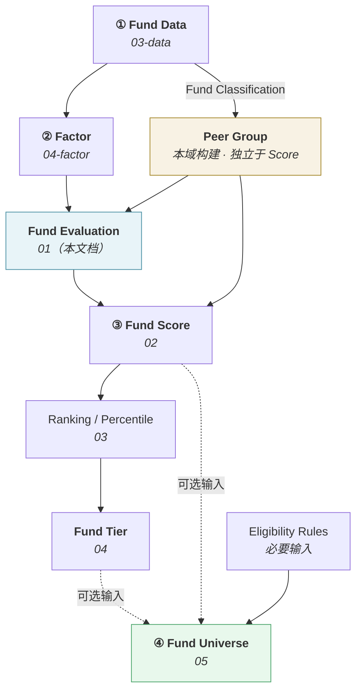

# 基金评价总览 · Fund Evaluation

> 上游文档：docs/01-product/01-product-overview.md（v2.5）｜本文细化环节：③ Fund Score 的前置
> 业务需求：docs/01-product/02-business-requirements.md（v2.3）§5.2、§7、§15
> 本域上游：docs/04-factor/（v1.0–v1.1，全 8 份）
>
> **文档版本**：v1.3 ｜ **产品阶段**：第一阶段

---

## 1. 文档目的与边界

### 1.1 本文档回答什么

> **系统如何评价一只基金？**

本文档定义**评价框架**——评价对象、维度、周期、时点、准入条件、输入输出与政策载体。

### 1.2 本文档不回答什么

| 不回答 | 归属 |
|---|---|
| 如何合成总分 | `02-fund-scoring` |
| 如何排名与算分位 | `03-fund-ranking` |
| 如何分层 | `04-fund-classification` |
| 如何筛出候选池 | `05-fund-selection` |
| Factor 的公式与计算 | `04-factor` |
| 数据来源与数据模型 | `03-data` |

> **本文档不产出 Total Score。** 评价的产出是"一组经过校验的、带状态的 Factor 结果 + 评价上下文"，合成属下一环节。

---

## 2. 本域五份文档与上游 Stage 的映射

> **本域五份文档不是五个新 Stage。** 上游 §4.0 规定 Stage 恰好 10 个，本域承载其中的 **③ Fund Score** 与 **④ Fund Universe**。

| 本域文档 | 职责动词 | 对应上游 |
|---|---|---|
| `01-fund-evaluation` | **Measure** —— 度量 | Stage ③ 的前置（Factor 消费与评价上下文） |
| `02-fund-scoring` | **Quantify** —— 量化 | **Stage ③ Fund Score** 主体（含 ③-S 五子分） |
| `03-fund-ranking` | **Compare** —— 比较 | Stage ③ 派生链的 Ranking / Percentile |
| `04-fund-classification` | **Categorize** —— 分层 | Stage ③ 派生链的 **`Fund Tier`** |
| `05-fund-selection` | **Filter** —— 筛选 | **Stage ④ Fund Universe** |

> **③ 与 ④ 之间的边界**：③ 产出的是**对基金的评价**，④ 产出的是**可投资标的集合**。两者之间隔着 `Eligibility Rules`——Score 只是 Universe 的**可选**输入（上游 §4.2 ④）。

---

## 3. 链路位置



> **注意 `Peer Group` 的位置**：它由 `Fund Classification`（`03-data` 的客观属性）直接构建，**不经过 Score**。这是上游 §7.2 的强制约束——违反会形成 `Score → Universe → Peer Group → Score` 的循环依赖，使评分不可复现。

---

## 4. Objectives

| # | 目的 |
|---|---|
| 1 | 度量历史**收益**表现 |
| 2 | 度量**风险**水平 |
| 3 | 度量**风险调整后**收益 |
| 4 | 度量**回撤**特征 |
| 5 | 度量**相对 Benchmark** 的表现 |
| 6 | 度量表现的**稳定性** |
| 7 | 为下游评分、排名、分层、筛选提供**标准化的、带状态的**输入 |

### 4.1 Fund Evaluation 不是投资决策

> **评价回答"这只基金过去表现如何"，不回答"该不该买"。**

```
Fund Evaluation   →  描述历史事实
Investment Decision →  对未来的行动（Stage ⑦ 的 Output，且须经 PM Review）
```

上游 §4.2 ③ 的边界条款已明确：**Score 不是收益估计、不是权重**。本域全部产出同理——`A+` 不意味着"应该买"，`D` 也不意味着"应该卖"（`02-business-requirements` §16.4）。

### 4.2 评价与估计的分离

> 这是上游最关键的一条边界（§5.2）。

| | Fund Evaluation（本域） | Return Estimate（`07-return-risk`） |
|---|---|---|
| 描述 | **历史已实现**特征 | 对**未来持有期**的估计 |
| 量纲 | 标准化后无量纲 | 有量纲（如年化收益率） |
| 用途 | 相对比较、排序 | 优化器输入 |

> **严禁把 Score 直接作为收益估计输入优化器**（上游 §5.2）。

---

## 5. Evaluation Object

> **评价对象是 `Fund`，粒度为 `Fund Share Class`。**

沿用 `03-data/02-data-domain-model` §3.1 的实体定义：`Fund Share Class` 是数据域的最小单位——同一基金的 A/C/I 类份额费率不同，因而净值序列不同，评价结果也不同。

本域**不引入新的对象粒度**。

| 情形 | 处理 |
|---|---|
| 同一基金的多个 Share Class | **分别评价**，各自进入 Peer Group |
| 展示层需要合并呈现 | 属展示层职责，不改变评价粒度 |

> **已定案 · 2026-08-27**：**同时进入**同一 Peer Group 参与排名；去重发生在 **Universe 层**（`05-fund-selection` `FSEL-6`）。见 `TBD-resolution-2.md` Policy D。
>
> **依据 —— 三个环节的答案本就不同**：
>
> ```
> 数据层：全部纳入      （Share Class 是最小数据单位，费率差异只能在此表达）
> 评价层：分别评价      （A/C 类费率不同 → 净值不同 → 因子值不同）
> 建仓层：去重          （组合不应同时持有同一产品的两个份额类别）
> ```
>
> **把去重提前到评价层是错的** —— 那等于在不知道哪一类更优之前就先删掉一类。而「哪一类更优」恰恰是评价要回答的问题。
>
> **头部被同一产品多个类别占据是真实现象，不是缺陷**：若某产品的 A 类与 C 类都排在前列，那说明该产品确实优秀。处理方式是**展示层提供「按基金去重」的视图开关**，不在数据层去重 —— 后者会改变分位的分母，破坏与其它横截面统计量的一致性。

---

## 6. Evaluation Dimensions

> **六个维度**，与上游 ③-S 五子分对齐（Drawdown 归入 Risk 子分）。

| 维度 | 对应子分 | Factor 类别（`04-factor/02-factor-taxonomy`） |
|---|---|---|
| **Return** | Return Score | `RET` |
| **Risk**（含 Drawdown） | Risk Score | `RISK` |
| **Risk-adjusted Return** | Risk-Adjusted Score | `RAP` |
| **Consistency** | Stability Score | `STAB` |
| **Relative Performance** | Relative Performance Score | `REL` |

> **五分类与五子分一一对应**（`04-factor/02-factor-taxonomy` §2）。本域**不重新定义 Factor 数学公式**——全部引用 `04-factor/03-factor-definition`。

---

## 7. Factor Inputs

> **只使用 `04-factor/03-factor-definition` 已定义的 26 个 Factor。** 不得引入该文档中不存在的指标。

### 7.1 进入评分的 Factor

按 `02-business-requirements` §14.2 Factor Usage Matrix，`SCORING` 列打勾的 Factor 才进入评分：

| 类别 | 进入 SCORING 的 Factor |
|---|---|
| `RET` | 年化收益率、Benchmark 超额收益、Rolling Return |
| `RISK` | Volatility、Downside Volatility、Maximum Drawdown、VaR 95%、CVaR 95% |
| `RAP` | Sharpe、Sortino、Calmar |
| `STAB` | Win Rate、Rolling Sharpe / Volatility / MDD |
| `REL` | Alpha、Beta、Information Ratio、Tracking Error |
| 基金属性 | **费率**（非计算得出的 Factor，但参与评分，见 `02-business-requirements` §14.3 三条读表规则） |

### 7.2 明确不进入评分的

| Factor | 原因 |
|---|---|
| 累计收益率 | 与年化收益率重复 |
| Drawdown / Recovery Duration | 仅 `DISPLAY` / `SCREENING` |
| **R²** | 仅 `DISPLAY` |
| **Skewness / Kurtosis** | 仅 `DISPLAY`（`<TBD-P1-6>` 待确认） |
| **Correlation / Covariance** | 是基金**之间**的关系，不是单只基金属性，无法进入单基金评分 |
| **Fund Score 自身** | Score 不能参与计算自己 |

### 7.3 Factor 结果必须携带状态

> **本域消费的不是裸数值，而是带 `Status` 的 Factor Result**（`04-factor/08-factor-output` §2）。

| Status | 本域处理 |
|---|---|
| `VALID` | 正常参与 |
| `WARNING` | 参与，但标记须随评价结果传递 |
| `INVALID` | **不参与**，且触发告警 |
| `UNAVAILABLE` | **不参与**，按 §12 缺失规则处理 |

---

## 8. Evaluation Period

> **沿用 `02-business-requirements` §9 已定义的周期，不新增。**

| 周期 | 说明 |
|---|---|
| `1M` / `3M` / `6M` | 短周期 |
| `1Y` / `3Y` / `5Y` | 中长周期 |

### 8.1 周期的选择由 Evaluation Policy 决定

不同 `Evaluation Profile` 可声明不同的周期集合与权重。短周期噪声大，长周期覆盖基金少——两者的取舍属评价政策，不在本文档拍板。

> **推荐默认 · 2026-08-27**：各 Profile 统一采用 **{1Y, 3Y, 5Y}** 三周期，权重 **3Y > 1Y > 5Y**。业务方可改。
>
> **依据**：
>
> | 周期 | 作用 | 权重考虑 |
> |---|---|---|
> | 1Y | 反映近期表现与当前管理状态 | 中 —— 有效但噪声较大 |
> | **3Y** | 覆盖一轮完整市场周期 | **最高** —— 噪声与时效性的平衡点 |
> | 5Y | 检验长期一致性 | 低 —— 覆盖率下降明显（成立满 5 年的基金显著少于满 3 年） |
>
> **不含 1M / 3M / 6M**：短于 1Y 的周期噪声主导（`FE-3` 已论证），纳入评分会引入随机性。
>
> **5Y 权重最低的实际原因是覆盖率** —— 给它高权重会让大量成立 3~5 年的基金因缺该周期而触发权重重分配，使不同基金的实际周期结构不一致。

### 8.2 年化口径

> 全平台统一 **252 交易日**（P0 已定案，`02-business-requirements` §9.2.1）。本域不重复定义。

---

## 9. As-of Date 与 Point-in-Time

### 9.1 核心规则

> **`evaluation_as_of_date = T` 时，全部输入必须满足 `available_at ≤ T`。**

```
❌ 前视
历史日期 T → 使用当前数据/当前配置 → Evaluation

✅ 正确
决策日期 T → 使用 available_at ≤ T 的数据 → Evaluation
```

沿用上游 §4.2 ①-PIT 的判定标准：**PIT 判定用 `available_at`，不是 `effective_at`**；同一 `(entity, effective_at)` 有多个合格版本时，取 **`version` 序号最大者**。

### 9.2 本域特有的四个前视来源

> **前三项不涉及"未来的数据"，而涉及"未来的定义"——同样构成前视，且更隐蔽。**

| # | 来源 | 说明 |
|---|---|---|
| 1 | **使用当前的 `Peer Group` 构成** | 基金转型会改变分类。用今天的组构成算历史分位是前视（`02-business-requirements` §7.4） |
| 2 | **使用当前的 `Evaluation Policy`** | 评价标准变了，用新标准解释历史评价是**版本前视** |
| 3 | **使用当前的 Benchmark Mapping** | 转型后映射变了，影响全部 `REL` 类 Factor |
| 4 | 使用修订后的净值 | `T` 时点看到的是修订前版本（`03-data/04-data-versioning` §8） |

### 9.3 Peer Group 的历史构成必须可重建

> **这是本域可复现性的前提，也是最容易被漏掉的一项。**

```
Peer Group = Fund Classification + effective_at + 参与规则
```

三者都必须按 PIT 记录。若历史 `Peer Group` 用当前成员构造，**全部分位、排名、Tier 都被污染**——且污染不可见（数值看起来完全正常）。

参与规则须包含**当时存续但后来已清盘的基金**（`02-business-requirements` §7.3），否则产生生存偏差。

---

## 10. Evaluation Eligibility

### 10.1 八项检查

| # | 检查 | 不通过 |
|---|---|---|
| 1 | 基金在 `as_of_date` 存在于 `Fund Coverage` | `NOT_ELIGIBLE` |
| 2 | 基金在该时点存续（按当时的 `Fund Lifecycle Status`） | `NOT_ELIGIBLE` |
| 3 | 必需的 NAV 数据存在且质量非 `INVALID` | `NOT_ELIGIBLE` |
| 4 | 历史长度满足该 Evaluation Period 的最低要求 | `NOT_ELIGIBLE` |
| 5 | 该 Profile 要求的 Factor 可得 | 部分不可得 → `PARTIAL` |
| 6 | `REL` 类所需的 Benchmark 可得 | `REL` 子分 `UNAVAILABLE` |
| 7 | 需要 `R_f` 时其可得 | 相关 Factor `UNAVAILABLE` |
| 8 | 需要 `MAR` 时其可得 | 相关 Factor `UNAVAILABLE` |

### 10.2 缺失数据不得转换为 0

> **这是本域最容易犯的错误，且后果严重。**

```
把 UNAVAILABLE 当作 0 分参与评分
    → "数据不足" 被表达为 "表现最差"
    → 成立不足 3 年的优秀新基金，其 3Y Sharpe 得 0 分
    → 系统性歧视新基金
```

（`02-business-requirements` §15.5、`04-factor/05-factor-normalization` §5.3）

### 10.3 可投资性不影响评价资格

> **暂停申购的基金仍应被评价**（`02-business-requirements` §7.3）。

`Investment Eligibility` 是**筛选**维度，不是**评价**维度。两者正交——一只基金可以同时"评价优秀"且"当前不可买入"。可投资性在 `05-fund-selection` 处理。

---

## 11. Minimum Data Requirement

> **各 Evaluation Period 的最低观测要求，沿用 `04-factor/03-factor-definition` 各 Factor 的 `Min Obs` 声明。**

| Period | 最低要求 |
|---|---|
| 全部周期 | 该周期内各 Factor 各自的 `Min Obs`（多数为 `<TBD-FD-3>`） |
| 基金成立时长 < 周期长度 | 该周期全部 Factor **`UNAVAILABLE`**，**不得**用成立至今年化冒充 |

> **本域不新增最低数据要求** —— 它是 Factor 层的属性，本域只消费其结果。

> **已定案 · 2026-08-27**：**至少需 1Y 周期可评价**才产出总分；仅 1M / 3M / 6M 可算时该基金 `NOT_ELIGIBLE`。
>
> **依据 —— 短周期的噪声占比过高**：
>
> ```
> 1M 收益 ≈ 21 个交易日
>     → 单日极端行情即可主导整月表现
>     → 据此产出的「总分」是在给运气打分
> ```
>
> **1Y 是最短的可承载完整评价的周期**：它覆盖至少一个完整的申赎周期与分红周期，且与 `04-factor` 多数因子的最短有意义窗口一致。
>
> **`NOT_ELIGIBLE` 而非「低置信总分」**：与 §14.1 的语义一致 —— 成立不足是「不该评」而非「该评但评坏了」，因此不产出、不告警。新基金天然如此，不是异常。
>
> **短周期因子仍照常计算与展示** —— 本条限制的是**总分**的产出，不是因子的产出。

---

## 12. Evaluation Input

| 输入 | 来源 | 必需 |
|---|---|---|
| `Fund ID`（Share Class 粒度） | `03-data` | ✅ |
| `Evaluation Period` | 请求参数 | ✅ |
| `as_of_date` | 请求参数 | ✅ |
| **Factor Results**（带 Status 与 Threshold Context） | `04-factor/08-factor-output` | ✅ |
| **Peer Group**（该时点构成） | 本域构建 | ✅ |
| **Evaluation Profile** | 本域，按基金判定 | ✅ |
| **Evaluation Policy Version** | 本域 | ✅ |
| Benchmark Results | `03-data` | `REL` 类必需 |
| `Risk-free Rate` 引用 | `03-data`，经 Threshold Resolver | 相关 Factor 必需 |
| `MAR` 引用 | 本域 Evaluation Policy，经 Threshold Resolver | 相关 Factor 必需 |
| Data Version | `03-data` | ✅ |

---

## 13. Evaluation Output

| 字段 | 说明 |
|---|---|
| `fund_id` | Share Class 粒度 |
| `evaluation_period` | 周期 |
| `as_of_date` | 时点 |
| **`evaluation_status`** | 见 §14 |
| **Factor Results**（原始值 + 标准化值 + Status） | 逐 Factor |
| **`peer_group_id` + `peer_group_version`** | 标准化上下文 |
| **`evaluation_profile`** | 使用了哪套评价标准 |
| **`evaluation_policy_version`** | 政策版本 |
| **`data_completeness`** | 可用指标数 / 应有指标数 |
| `data_version` | 数据版本 |
| `factor_version`（Metric Version） | 因子口径版本 |

> **本输出不含 Total Score。** 合成属 `02-fund-scoring`。

### 13.1 `Data Completeness` 必须随输出呈现

> 基于 3 个指标与基于 12 个指标的评价，可信度完全不同（上游术语表）。它是**输出的一部分**，不是可选的附加信息。

---

## 14. Evaluation Status

| 状态 | 含义 | 可进入 Scoring |
|---|---|---|
| **`NOT_ELIGIBLE`** | 未通过 §10 的准入检查 | ❌ |
| **`COMPLETED`** | 全部要求的 Factor 均可得 | ✅ |
| **`PARTIAL`** | 部分 Factor `UNAVAILABLE`，其余可用 | ✅ 须带 `data_completeness` |
| **`FAILED`** | 计算过程异常（含 Factor `INVALID`） | ❌ **须告警** |

### 14.1 `NOT_ELIGIBLE` 与 `FAILED` 必须区分

> 沿用 `04-factor/07-factor-validation` §11.2 的原则。

| | `NOT_ELIGIBLE` | `FAILED` |
|---|---|---|
| 含义 | **不该评**（成立不足、已清盘） | **该评但评坏了** |
| 是否正常 | 正常业务情形 | 系统问题 |
| 是否告警 | 否 | **是** |

> 混淆两者会产生大量无意义告警，掩盖真正的问题。

### 14.2 不设 `NOT_STARTED`

> 提示词建议的 `NOT_STARTED` 属**执行状态**而非**评价状态**。按 `02-architecture/01-system-architecture` §10.5 的两类状态区分，执行进度由 `Execution Status`（`RUNNING`/`COMPLETED`/`BLOCKED`/`FAILED`/`CANCELLED`）表达，不混入业务状态枚举。

---

## 15. Risk-free Rate 依赖声明

> **本文档不重新定义 `Risk-free Rate` 的数据模型。**

| 层面 | 归属 |
|---|---|
| 数据来源、`currency`/`tenor`/报价口径、PIT 规则 | **`03-data/01-data-source` §3.1.5、`02-data-domain-model` §10** |
| 在 Sharpe / Alpha / Beta 中的使用 | **`04-factor/03-factor-definition` §2.1** |
| 本域 | **仅声明依赖关系** |

`R_f` 是 **Market Reference Input**——观测所得，全平台唯一，随市场变化，走 PIT。

> `R_f` 的直接消费方是 `F-RAP-001` Sharpe、`F-REL-002` Alpha、`F-REL-003` Beta。`F-REL-004` Information Ratio **不依赖 `R_f`**。

---

## 16. MAR

> **`MAR` 是 Evaluation Policy 的参数，本域拥有。**（上游 §5.5）

| | `Risk-free Rate` | `MAR` |
|---|---|---|
| 本质 | 市场数据（**观测所得**） | 评价标准（**规定的**） |
| 归属 | `03-data` | **本域** |
| 解析依据 | `available_at ≤ decision_at` 的最大 `version` | `Effective Date` + `Evaluation Policy Version` |
| 变更含义 | 市场变了 | **我们改变了评价标准**，须走版本治理 |

### 16.1 强制约束

> **即使某个 Policy 中 `MAR = Risk-free Rate` 使数值完全相同，也不得在模型层面设计成同一个字段。**（上游 §5.5.1）

### 16.2 配置粒度必须与 Peer Group 对齐

> **同一 `Peer Group` 内的全部基金必须适用同一个 `MAR`**，否则组内 `Sortino` 不在同一标尺上却被放进同一分位排名（上游 §5.5.3）。

本约束由**本域**在构建 `Evaluation Policy` 时保证；`04-factor/05-factor-normalization` §5.4 在标准化前校验，不一致时该组该 Factor `UNAVAILABLE` 并告警。

### 16.3 MAR Policy 定案：三模式 + 第一版默认 `ZERO` ✅

> **定案 · 2026-08-27**：`TBD-FE-4`（= `04-factor` `TBD-FD-2`）关闭。见 `TBD-resolution.md` Policy ②。

**`Evaluation Policy` 新增 `mar_configuration` 段**：

| 字段 | 取值 | 说明 |
|---|---|---|
| **`mar_policy`** | `ZERO` / `RISK_FREE` / `CUSTOM` | **必填，无默认** |
| `mar_value` | 数值 | 仅 `CUSTOM` 模式必填 |
| `mar_quotation_basis` | 年化口径 | 仅 `CUSTOM` 模式必填 |
| `fund_category` | 分类 | 配置粒度维度之一 |
| `currency` | 币种 | 配置粒度维度之一 |

**三模式的解析结果**：

| 模式 | `MAR_t` | 是否随时间变化 |
|---|---|---|
| **`ZERO`**（第一版默认） | `0` | 否 |
| `RISK_FREE` | `Rf_t`（按 `04-factor/03` §2.1.1 期限匹配，逐期取值） | **是** |
| `CUSTOM` | 配置值 | 否 |

**选 `ZERO` 的理由**（详见 `04-factor/03-factor-definition` §2.2.4）：最容易解释、不依赖外部数据、不产生额外 PIT 问题、跨资产类别一致、避免 `Sortino → R_f → Currency → Tenor` 的耦合链。

#### 16.3.1 `mar_policy` 必填无默认 ⚠️

> **`ZERO` 是「第一版推荐取值」，不是「不填时的兜底」。**

| 状态 | 处置 |
|---|---|
| `mar_policy = ZERO` | 正常计算，Sortino 可用 |
| `mar_policy` 未配置 | **依赖 MAR 的 Factor 一律 `UNAVAILABLE`**，不得默认为 0 |

> **两者算出来的数值完全相同，但含义相反**：前者是有人决定了标尺，后者是标尺从未被确认。若配置层给 `mar_policy` 设默认值 `ZERO`，一次配置遗漏就会静默产出看起来完全正常的 Sortino —— **没有任何信号表明这个值背后没有决策**。因此本字段在 Evaluation Policy 中**必填且无默认值**。

#### 16.3.2 `RISK_FREE` 模式使 MAR 变成时间序列

> **切换到该模式会改变 MAR 的形态，进而改变 §16.2 的一致性校验方式。**

```
ZERO / CUSTOM  → MAR 在窗口内是标量
RISK_FREE      → MAR 在窗口内是【序列】，且随基金计价币种不同
```

| 影响 | 说明 |
|---|---|
| §16.2 的组内一致性 | 校验对象由「同一数值」变为「同一 `mar_policy` 且同一 `(currency, tenor)` 解析路径」 |
| Sortino 的可比性 | 同组内若存在多币种基金，`RISK_FREE` 下各自的 MAR 不同 —— **此时组内 Sortino 不可比** |
| `R_f` 的 quality 传导 | `R_f` 若为 `INTERPOLATED`，Sortino 的插值误差随之引入 |

> **因此 `RISK_FREE` 模式在多币种 Peer Group 中不可用** —— 若将来启用该模式，Peer Group 的构建必须先按币种细分。这是切换模式前必须处理的前置条件，不是切换后再修的问题。

> **已定案 · 2026-08-27**：保持 `fund_category × currency`，不再细分。见 `04-factor/03-factor-definition` §2.2.4。
>
> **本域的连带约束**：粒度细于 Peer Group 会直接违反 §16.2 的组内一致性要求。因此本条不只是「暂不细分」，而是**细分的上限就是 Peer Group 的粒度**。

---

## 17. Evaluation Policy

> **本域拥有的核心配置对象。** 上游 v2.5 术语表已登记。

### 17.1 结构

| 字段 | 说明 |
|---|---|
| `policy_id` | 标识 |
| `version` | 版本号 |
| `effective_from` / `effective_to` | 生效区间 |
| `status` | `DRAFT` / `ACTIVE` / `DEPRECATED` / `RETIRED` |
| **`evaluation_profile`** | 适用画像：`Active Equity` / `Passive Equity` / `Bond` / `Hybrid` |
| `evaluation_periods` | 该画像使用的周期集合 |
| `required_factors` | 必需的 Factor 清单 |
| **`preference_directions`** | 各 Factor 的方向声明（含 `TARGET_RANGE` 的目标区间） |
| `eligibility_rules` | 评价准入规则（§10） |
| `minimum_data_requirements` | 最低数据要求（§11） |
| **`mar_configuration`** | 按 `fund_category` × `currency` 的 MAR 取值 |
| `risk_free_rate_convention` | 使用的 `(currency, tenor)` 口径 |

### 17.2 与 Evaluation Profile 的关系

| | `Evaluation Profile` | `Evaluation Policy` |
|---|---|---|
| 回答 | 这只基金该用**哪套**标准 | 那套标准的**具体内容** |
| 取值 | 四类画像（上游 §5.2） | 配置集合 |

### 17.3 四类画像的指标与方向已定案

> **沿用 `02-business-requirements` §5.2.1，本域不得改动。** 三处反直觉之处必须保留：

| # | 已定案且易被"改回错误做法"的条款 |
|---|---|
| 1 | **被动型基金的 Alpha 不进入评分** —— 显著正 Alpha 说明跟踪偏离，把它当正向指标等于奖励跟踪不好的指数基金 |
| 2 | **被动型基金的费率是高权重项** —— 同质 ETF 的长期差异主要来自费率与跟踪误差 |
| 3 | **债券型基金的 Maximum Drawdown 权重最高** —— 否则评分会系统性偏好高信用下沉产品 |

### 17.4 Policy 的构建不得依赖 Factor 或 Score ⚠️

> **与 `Peer Group` 必须独立于 `Fund Score` 是同一条原则。**

```
factor-service → fund-service ：读 Evaluation Policy（配置）
fund-service   → factor-service ：读 Factor Result（数据）
```

两条依赖指向不同对象，**不构成循环**。但若 `Evaluation Policy` 反过来依赖 Factor 或 Score，两条依赖将闭合成真正的循环（`02-architecture/02-service-architecture` DEP-6）。

---

## 18. Reproducibility

### 18.1 六要素

> **给定以下六项，任意时刻重算必须得到完全相同的评价结果。**

```
Fund ID
+ as_of_date
+ Evaluation Period
+ Factor Version（= Metric Version）
+ Evaluation Policy Version
+ Data Version
        ↓
    相同结果
```

### 18.2 Peer Group Version 是隐含的第七项

> **§18.1 的六要素不足以唯一确定标准化结果。**

```
同一基金、同一时点、同一 Factor Version、同一 Policy Version
但 Peer Group 构成不同（如某只同类基金的分类被修订）
    → 分位不同 → 标准化值不同 → 评价结果不同
```

**因此评价输出必须记录 `peer_group_id` + `peer_group_version`**（§13）。这是本域可复现性中最容易被漏掉的一项。

### 18.3 Policy 变更不改写历史

> Policy 升版后，历史评价结果**保持不变**，新结果按新版本产生。两者通过 `evaluation_policy_version` 区分，互不覆盖。

---

## 19. 端到端流程

```
                    Fund
                     │
                     ↓
              Factor Results（带 Status）
                     │
                     ↓
              Fund Evaluation        ← Peer Group + Evaluation Policy
                     │
                     ↓
               Fund Scoring          → Total Score + 五子分
                     │
                     ↓
               Fund Ranking          → Rank + Percentile
                     │
                     ↓
            Fund Tier（分层）
                     │
                     ↓
               Fund Selection        ← Eligibility Rules（必要）
                     │
                     ↓
              Fund Universe
```

### 19.1 完整示例

> **示例用于说明流程，全部数值以 `X` 表示——本项目尚未确定业务数据，不得自行制造。**

```
Fund A（Share Class 粒度）
as_of_date        : 2026-08-24
Evaluation Period : 1Y
Evaluation Profile: Active Equity
Peer Group        : 主动股票型 · 该时点共 N 只

① Evaluation
   Annual Return = X       Status = VALID
   Sharpe Ratio  = X       Status = VALID
   Max Drawdown  = X       Status = VALID
   Alpha         = X       Status = VALID
   Sortino       = UNAVAILABLE（MAR 未确认）
   → evaluation_status  = PARTIAL
   → data_completeness  = X / X

② Scoring    → Total Score = X / 100（五子分各 X）
③ Ranking    → Rank = X / N，Percentile = X%
④ Tier       → 按分位落入 A+ / A / B / C / D 中的一档
⑤ Selection  → SELECTED 或 REJECTED，附通过/未通过的条件清单
```

---

## 20. Edge Cases

| 情形 | 处理 |
|---|---|
| 基金成立时长 < 评价周期 | 该周期全部 Factor `UNAVAILABLE`，`evaluation_status = NOT_ELIGIBLE`；**不得用成立至今年化冒充** |
| 基金在评价期内**转型** | 用当时的 `Fund Classification` 归组、当时的 `Evaluation Profile` 评价；转型前后的评价**不可直接比较** |
| 基金在评价期内**清盘** | 历史时点仍参与评价与 Peer Group（避免生存偏差）；当前时点 `NOT_ELIGIBLE` |
| 基金**暂停申购** | 正常评价 —— 可投资性不影响评价资格（§10.3） |
| Benchmark 不可得 | `REL` 类整类 `UNAVAILABLE`，其余维度正常，`evaluation_status = PARTIAL` |
| `R_f` 不可得 | Sharpe / Alpha / Beta `UNAVAILABLE`，**不得默认 `R_f = 0`** |
| `MAR` 未配置 | Sortino / Downside Volatility `UNAVAILABLE` |
| 同一 Peer Group 内 `MAR` 不一致 | 该组该 Factor `UNAVAILABLE` **并告警**（配置粒度错配） |
| Factor `Status = INVALID` | `evaluation_status = FAILED`，**须告警** |
| Peer Group 仅 1 只基金 | 标准化无意义 → 全部标准化值 `UNAVAILABLE` |
| 同一基金多个 Share Class | 各自独立评价（是否同组见 `TBD-FE-1`） |

---

## 21. Auditability

> **本域全部产出必须可追溯到输入与配置。**

### 21.1 评价结果的追溯链

```
Evaluation Result
    ├─ Factor Version（Metric Version）  → 04-factor 的因子口径
    ├─ Evaluation Policy Version         → 评价标准（含 MAR）
    ├─ Peer Group ID + Version           → 标准化上下文
    ├─ Data Version                      → 03-data 的数据血缘
    └─ Threshold Context                 → 所用的 R_f 版本引用
```

本域血缘**接在 `04-factor` 之上**，形成端到端可追溯链（`03-data/07-data-lineage` §8.3 的分段约定）。

### 21.2 五个 Policy 必须独立版本化

| Policy | 归属文档 | 对应 Strategy Version 项 |
|---|---|---|
| **Evaluation Policy** | `01`（本文档 §17） | **不在九项之内**（见 §21.3） |
| **Scoring Policy** | `02` | 第 4 项 `Scoring Version` |
| **Ranking Policy** | `03` | **不在九项之内** |
| **Classification Policy** | `04` | **不在九项之内** |
| **Selection Policy** | `05` | 第 3 项 `Eligibility / Universe Version` |

每个 Policy 至少具有：`policy_id`、`version`、`effective_from`、`effective_to`、`status`。

### 21.3 三个 Policy 不在九项 Strategy Version 之内 ⚠️

> **本域在编写过程中识别出的缺口，如实登记，不擅自变更已定案的九项。**

```
Evaluation Policy Version    → 含 MAR，影响 Sortino 的因子值本身
Ranking Policy Version       → 含 Percentile 约定与 Tie Method，影响分位
Classification Policy Version→ 含 Tier 阈值，影响分层
```

**原后果**：这三项变更不会进入决策快照的 `strategy_version`，**依赖它们的结果无法从快照复现**——违反上游 §9 原则六。

#### 21.3.1 已定案：三项均归入第 10 类 `Policy Version` ✅

> **定案 · 2026-08-27**。见 `02-business-requirements` §23.1.1、`02-architecture/01-system-architecture` §8.2.1、`TBD-resolution.md` Policy ⑧。

版本模型由四类扩为**五类**，新增与 `Strategy Version` **并列**的第 10 类 `Policy Version`，本域三项分别对应其前三个子项：

| 本域 Policy | 归入子项 | Owner |
|---|---|---|
| `Evaluation Policy Version` | `evaluation_policy` | `fund-service` |
| `Ranking Policy Version` | `ranking_policy` | `fund-service` |
| `Classification Policy Version` | `classification_policy` | `fund-service` |

**三条后续要求**：

| # | 要求 |
|---|---|
| 1 | 三项**各自独立版本化**，任一变更只升该子项 |
| 2 | 决策快照须**同时**引用 `strategy_version` 与 `policy_version`，二者是并列字段而非嵌套 |
| 3 | 三项均随本域各自的结果落库（`evaluation_policy_version` / `ranking_policy_version` / `classification_policy_version`）的既有做法**保持不变** —— 那是本域层的可复现性，与快照层的登记互不替代 |

> **`TBD-FE-6` 已关闭。** 原「九项装不下」的问题不再存在 —— 它们本就不该进九项。

### 21.4 审计必须能回答的四个问题

| # | 问题 | 依据 |
|---|---|---|
| 1 | 这只基金**为什么是这个分数** | `02-fund-scoring` §10 归因链 |
| 2 | 它**为什么排这个名** | `03-fund-ranking` §13.3（Rank + N + Percentile 全部落库） |
| 3 | 它**为什么是这个 Tier** | `04-fund-classification` §9 |
| 4 | 它**为什么入池 / 未入池** | `05-fund-selection` §14 |

---

## 22. Summary

Fund Evaluation 是**度量**环节，**不产出 Total Score，也不做投资决策**。

三条最容易出错的边界：

- **`Peer Group` 必须独立于 `Fund Score`** —— 否则形成循环依赖，评分不可复现；这类错误不会报错，只会让每次重算得到不同结果
- **缺失数据不得转换为 0** —— 会把"数据不足"表达为"表现最差"，系统性歧视新基金
- **`MAR` 是评价标准不是市场数据** —— 即使数值等于 `R_f` 也必须独立建模，否则评价标准的变更会伪装成数据更新而绕过版本治理

两项容易被漏掉的可复现性要求：

- **`Peer Group Version` 是可复现性的隐含要素** —— 六要素相同但组构成不同，分位就不同
- **前视不只来自"未来的数据"，也来自"未来的定义"** —— 当前的 Peer Group、Evaluation Policy、Benchmark Mapping 用于历史同样构成前视

---

## 23. Decisions

| # | 决策 | 理由 |
|---|---|---|
| D-1 | 本域五份文档是 Stage ③④ 的内部细化，**不新增 Stage** | 上游 §4.0 规定 Stage 恰好 10 个 |
| D-2 | 评价对象粒度为 `Fund Share Class` | 沿用 `03-data`；不同份额费率不同，评价结果不同 |
| D-3 | 本文档**不产出 Total Score** | 合成属 `02-fund-scoring`，保持职责单一 |
| D-4 | 六个评价维度对齐上游 ③-S 五子分（Drawdown 并入 Risk） | 避免与上游固定命名冲突 |
| D-5 | 只使用 `04-factor` 已定义的 26 个 Factor | 不得引入不存在的指标 |
| D-6 | 消费带 `Status` 的 Factor Result，而非裸数值 | `INVALID`/`UNAVAILABLE` 必须可识别 |
| D-7 | **可投资性不影响评价资格** | 评价与筛选两个维度正交 |
| D-8 | Evaluation Status 四态，**不设 `NOT_STARTED`** | 执行进度属 `Execution Status`，不混入业务状态 |
| D-9 | **`NOT_ELIGIBLE`（不该评）与 `FAILED`（评坏了）严格区分** | 混淆产生大量无意义告警 |
| D-10 | `MAR` 归本域，`R_f` 归 `03-data` | 上游 §5.5 |
| D-11 | **`MAR = TBD`**，本域不指定具体数值 | 属业务决策 |
| D-12 | 评价输出必须含 `peer_group_version` | 可复现性的隐含要素 |
| D-13 | `Evaluation Policy` 的构建不得依赖 Factor 或 Score | 否则与 Factor 侧依赖闭合成循环 |

---

## 24. Constraints

| # | 约束 | 来源 |
|---|---|---|
| C-1 | `Peer Group` 必须独立于 `Fund Score` 产生 | 上游 §7.2、`FR-PEER-001` |
| C-2 | 全部输入必须满足 `available_at ≤ as_of_date` | 上游 §4.2 ①-PIT |
| C-3 | `Peer Group` 的历史构成必须可重建，且含当时存续、后已清盘的基金 | `02-business-requirements` §7.3、§7.4 |
| C-4 | 缺失数据**严禁**转换为 0 或用均值填充 | `02-business-requirements` §15.5 |
| C-5 | `Data Completeness` 必须随评价结果一同呈现 | 上游术语表 |
| C-6 | 同一 `Peer Group` 内必须适用同一 `MAR` | 上游 §5.5.3 |
| C-7 | `MAR` 与 `R_f` 不得设计成同一字段 | 上游 §5.5.1 |
| C-8 | 四类画像的指标集合与方向已定案，本域不得改动 | `02-business-requirements` §5.2.1 |
| C-9 | Policy 变更不改写历史评价结果 | 上游 §9 原则六 |
| C-10 | 本域**不引入 ML / AI / LLM** | 上游 §6.2.1、§9 原则十至十一 |

---

## 25. TBD

| # | 事项 | 影响 | 责任方 |
|---|---|---|---|
| ~~FE-1~~ | ~~同一基金的多个 Share Class 是否同时进入同一 Peer Group~~ —— **已定案**：见 Policy D · Share Class 口径：同一基金的多个 Share Class【同时进入】Peer Group 参与排名，但 Universe 层去重 | — | ✅ 2026-08-27 |
| FE-2 | 各 Evaluation Profile 的周期集合与周期间权重 | 评价结构 | 投研 |
| ~~FE-3~~ | ~~一只基金至少需多少个周期可评价才算"可评价"~~ —— **已定案**：至少需 **1Y 周期可评价**才产出总分；仅 1M/3M 可算时 `NOT_ELIGIBLE` | — | ✅ 2026-08-27 |
| ~~FE-4~~ | ~~`MAR` 的取值与差异化配置~~ —— **已定案**：三模式，第一版默认 `ZERO`，`mar_policy` 必填无默认（§16.3） | — | ✅ 已定案 2026-08-27 |
| FE-5 | 是否需要第五类 `Evaluation Profile`（FOF、可转债等） | 画像覆盖度 | 投研（`02-business-requirements` §5.2.1） |
| ~~FE-6~~ | ~~`Ranking Policy Version` 与 `Classification Policy Version` 不在九项 Strategy Version 之内~~ —— **已定案**：与 `Evaluation Policy Version` 一并归入第 10 类 `Policy Version`（§21.3.1） | — | ✅ 已定案 2026-08-27 |

> **上游遗留**：`<TBD-P1-1>` Peer Group 最小样本量、`<TBD-P1-2>` Peer Group 与 Profile 不一致时的处理、`<TBD-P1-22>` Beta 目标区间、`<TBD-P1-23>` 画像内权重分配。

---

## 26. Related Documents

| 关系 | 文档 |
|---|---|
| **上游** | `01-product/01-product-overview.md` v2.5（§4.2 ③/③-S/④、§5.2、§5.5、§7）、`02-business-requirements.md` v2.3（§5.2.1、§7、§9、§15） |
| **功能需求** | `04-functional-requirements.md`（`FR-PEER-001~004`、`FR-SCORE-001~005`） |
| **本域** | `02-fund-scoring`、`03-fund-ranking`、`04-fund-classification`、`05-fund-selection` |
| **因子依赖** | `04-factor/03-factor-definition`、`05-factor-normalization`、`08-factor-output` |
| **数据依赖** | `03-data/01-data-source` §3.1.5、`02-data-domain-model` §10 |
| **架构** | `02-architecture/01-system-architecture.md` v2.1 §13（Threshold Resolver）、`02-service-architecture.md` v1.2（DEP-6） |

---

## 27. Change Log

| 版本 | 日期 | 变更内容 | 上游依赖 |
|---|---|---|---|
| **v1.3** | 2026-08-27 | **第二批定案（2 项）**。`FE-1` 多 Share Class **同时进入排名**，去重发生在 Universe 层（Policy D）—— 把去重提前到评价层等于在不知道哪一类更优之前先删掉一类；头部被同一产品多类别占据是真实现象，由展示层视图开关处理。`FE-3` **至少需 1Y 周期可评价**才产出总分，否则 `NOT_ELIGIBLE`（1M 收益仅 21 个交易日，据此产出总分是在给运气打分）；短周期因子仍照常计算。 详见 `TBD-resolution-2.md` | `TBD-resolution-2.md` v1.0 |
| **v1.2** | 2026-08-27 | **`TBD-FE-4` 关闭**。§16.3 定案 —— `Evaluation Policy` 新增 `mar_configuration` 段，`mar_policy` 三模式且**必填无默认**（§16.3.1：`ZERO` 是推荐取值不是兜底，设默认会让配置遗漏静默产出看起来正常的 Sortino）；新增 §16.3.2 —— `RISK_FREE` 模式使 MAR 变成序列且随币种不同，**在多币种 Peer Group 中不可用**，启用前须先按币种细分 Peer Group。详见 `TBD-resolution.md` Policy ② | `04-factor/03-factor-definition` v1.2 |
| **v1.1** | 2026-08-27 | **`TBD-FE-6` 关闭**。§21.3 新增 §21.3.1 —— `Evaluation` / `Ranking` / `Classification` 三个 Policy Version 归入新设的第 10 类 `Policy Version`（与九项 Strategy Version 并列），决策快照须同时引用两个组合字段。本域各结果表携带 policy version 的既有做法不变。详见 `TBD-resolution.md` Policy ⑧ | `02-business-requirements` v2.4、`02-architecture/01-system-architecture` v2.4 |
| v1.0 | 2026-08-26 | 初始版本。确立**本域五份文档是 Stage ③④ 的内部细化而非新增 Stage**；链路图显式标出 `Peer Group` 由 `Fund Classification` 直接构建、不经过 Score；六维度对齐上游 ③-S 五子分；**Factor 输入限定为 `04-factor` 已定义的 26 个**并按 Usage Matrix 区分入评分与不入评分；**§9.2 四个前视来源**（其中三项来自"未来的定义"而非"未来的数据"）；八项评价准入检查与"缺失不得转 0"；**`NOT_ELIGIBLE` 与 `FAILED` 的区分**；**§17 Evaluation Policy 的完整定义**（本域首次落地，此前仅在 `04-factor` 有消费契约），含 `MAR` 配置与"Policy 构建不得依赖 Factor 或 Score"；**§18.2 指出 `Peer Group Version` 是可复现性的隐含第七要素** | `01-product-overview.md` v2.5、`02-business-requirements.md` v2.3、`04-factor` v1.0–v1.1 |