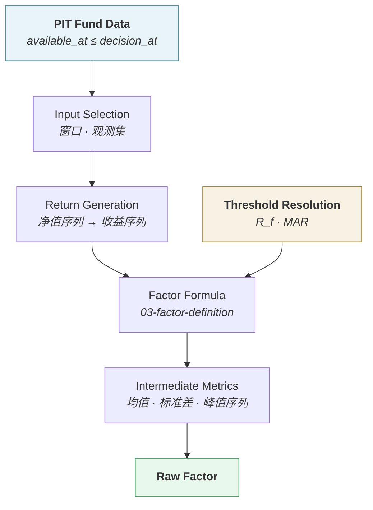

# 因子计算 · Factor Calculation

> 上游文档：docs/01-product/01-product-overview.md（v2.5）｜本文细化环节：② Factor
> 数据依赖：docs/03-data/04-data-versioning.md（v1.1）、05-data-normalization.md（v1.1）
> 本域上游：docs/04-factor/03-factor-definition.md（v1.0）
>
> **文档版本**：v1.3 ｜ **产品阶段**：第一阶段

---

## 1. 文档目的与边界

### 1.1 本文档回答什么

> **Factor 在计算层面具体如何产生？如何保证 PIT 与确定性？**

### 1.2 本文档不回答什么

| 不回答 | 归属 |
|---|---|
| 每个 Factor 的公式 | `03-factor-definition` |
| 标准化 | `05-factor-normalization` |
| 校验规则 | `07-factor-validation` |
| 调度、批次编排、失败重试的技术实现 | `02-architecture/04-integration-architecture` |
| 计算结果如何存储 | `11-database` |

---

## 2. Calculation Pipeline

### 2.1 七个阶段



### 2.2 各阶段职责

| 阶段 | 职责 | 关键约束 |
|---|---|---|
| **PIT Fund Data** | 获取时点数据视图 | 必须经 PIT-aware 接口，携带 `decision_at` |
| **Input Selection** | 按窗口选取观测集 | 交易日计数；端点规则 `(start, end]` |
| **Return Generation** | 净值序列 → 日收益序列 | 见 §5 |
| **Threshold Resolution** | 解析 `R_f` 与 `MAR` 的具体取值 | 见 §3.4；**两者不得写死为常量** |
| **Factor Formula** | 应用 `03-factor-definition` 的公式 | 确定性；边界条件按 §10 处理 |
| **Intermediate Metrics** | 中间量（均值、标准差、运行峰值） | 可缓存，但**不作为独立 Factor 发布** |
| **Raw Factor** | 未标准化的因子值 | 进入 Validation（`07-factor-validation`） |

### 2.3 Intermediate Metrics 不对外发布

> 中间量（如日收益均值、运行峰值序列）是计算过程的产物，**不是 Factor**。

若把它们作为 Factor 发布，会导致：

| 问题 | 说明 |
|---|---|
| Catalog 膨胀 | 中间量数量远超正式 Factor |
| 语义不清 | 它们没有独立的业务含义与方向 |
| 版本混乱 | 中间量随公式实现变化，但不构成 Factor 语义变更 |

---

## 3. PIT Calculation

### 3.1 核心规则

> **所有历史 Factor 必须基于 PIT Data 计算，而非 Latest Data。**

```
Factor(fund, window, decision_at = T)
    输入 = { 数据 d | d.available_at ≤ T，取 version 序号最大者 }
```

### 3.2 数据访问的强制约束

| # | 约束 |
|---|---|
| PIT-1 | Factor 计算**必须**经 PIT-aware Data Access Interface 获取数据（`02-architecture/03-data-architecture` §5.4） |
| PIT-2 | 每次调用**必须**携带 `decision_at`；缺失时拒绝 |
| PIT-3 | **不存在**"取最新净值"的无约束路径 |
| PIT-4 | 计算逻辑本身**不感知**是实盘还是回测——差异全在注入的 `decision_at` |

### 3.3 PIT 约束覆盖的输入

> Factor 的输入不止净值，全部输入都受约束：

| 输入 | PIT 影响 |
|---|---|
| Adjusted NAV | 净值修订产生新 version |
| Benchmark Time Series | 指数数据也可能修订 |
| **Benchmark Mapping** | **基金转型会改变基准**——必须用当时的映射 |
| **Fund Classification** | 影响 Peer Group（标准化阶段） |
| **Risk-free Rate** | 利率同样有 `available_at`，且**会被修订**——须取 `available_at ≤ decision_at` 的最大 `version` |
| **MAR** | **不走 PIT，走版本**——由 `Evaluation Policy Version` 确定，见 §3.4 |

> **Benchmark Mapping 的 PIT 最容易被忽略**：用转型后的基准回算转型前的 Alpha，是一种隐蔽的前视偏差。

### 3.4 Threshold Resolution：`R_f` 与 `MAR` 的解析

> **两者都是"外部给定的阈值"，但解析依据完全不同**（上游 §5.5）。

| | `R_f` | `MAR` |
|---|---|---|
| 来源 | `03-data` 的 Market Reference Data | `05-fund-evaluation` 的 Evaluation Policy |
| 解析键 | `(currency, tenor, decision_at)` | `(fund_category, currency, decision_at, evaluation_policy_version)` |
| **键的取值来源** | `currency` ← 基金计价币种；**`tenor` ← Factor 的 Evaluation Period**（§3.4.1） | `fund_category` ← 基金分类 |
| 选版规则 | `available_at ≤ decision_at` 的**最大 `version`** | `effective_date ≤ decision_at` 且属**指定的 Policy Version** |
| 时点语义 | **PIT**——"当时市场是多少" | **版本**——"当时我们用的是哪套标准" |
| 缺失处理 | `UNAVAILABLE`，**不得默认为 0** | `UNAVAILABLE`，**不得默认为 0** |

**四条强制约束**：

| # | 约束 |
|---|---|
| TR-1 | **`R_f` 与 `MAR` 均不得写死为常量**，也不得由 Factor 计算逻辑直接读取配置表——统一经 Threshold Resolver（`02-architecture/01-system-architecture` §13） |
| TR-2 | 解析结果必须**随 Factor Result 一并记录**：`R_f` 记录所用的 `(currency, tenor, version, rate_source_quality)`；`MAR` 记录所用的 `evaluation_policy_version` |
| TR-3 | **同一批次计算中，同一 `Peer Group` 内必须解析出同一个 `MAR`** —— 否则组内 `Sortino` 不可比（上游 §5.5.3） |
| **TR-4** | **`R_f` 按逐期解析，不按窗口取单值** —— 解析器返回的是窗口内的利率**序列**而非标量（§3.4.2） |

### 3.4.1 `tenor` 由 Evaluation Period 决定（v1.1 定案）

> **定案 · 2026-08-27**：见 `03-data/01-data-source` §3.1.5.5、`04-factor/03-factor-definition` §2.1.1、`TBD-resolution.md` Policy ①。

| Factor 周期 | 解析的 Tenor |
|---|---|
| 1M / 3M / 6M / 1Y / 3Y / 5Y | 同名 tenor |

**三级 fallback 与 quality 标记**：

| 级 | 条件 | `rate_source_quality` |
|---|---|---|
| 1 | 精确 tenor 可得 | `EXACT` |
| 2 | 相邻 tenor 插值 | `INTERPOLATED` |
| 3 | 该币种曲线不可得 | 因子 `UNAVAILABLE` |

> **Resolver 负责 fallback，Factor 逻辑不感知** —— Factor 只知道自己要的是「1Y 周期对应的 `R_f`」，插值与否由 Resolver 决定并标记。若把 fallback 逻辑放进 Factor，每个依赖 `R_f` 的 Factor 都要实现一遍，且必然出现不一致。

### 3.4.2 `R_f` 的解析粒度是序列不是标量 ⚠️

> **这是 Resolver 接口设计上最容易错的一处。**

```
❌ resolve_rf(currency, tenor, decision_at) -> Decimal
   → 返回单值，Factor 只能用它做「年化相减」

✅ resolve_rf(currency, tenor, window_start, window_end, decision_at) -> Series
   → 返回窗口内逐期的 R_f，Factor 做「逐期超额」
```

**两点说明**：

| # | 说明 |
|---|---|
| 1 | 序列中每一期都须满足 PIT —— 但**判定基准是 `decision_at` 而非该期自身的日期**：在 `decision_at` 时点回看窗口内某历史日的利率，取的是「截至 `decision_at` 可见的、该日的最大 version」 |
| 2 | 若窗口内某些日期的 `R_f` 不可得（非交易日、数据缺口），**取值规则由 `03-data/01-data-source` §3.1.5.3 定义**（向前取最近可得值），Resolver 不自行决定 |

> **第 1 点的常见错误**：按每期自身日期做 PIT 过滤，会让窗口早期取到"当时还没修订"的旧版本、晚期取到新版本 —— 但真实决策发生在 `decision_at`，那时全窗口看到的都是截至 `decision_at` 的最新修订。这个错误会让回测结果无法复现。

> **与 `MAR` 的对比**：`MAR` 在整个窗口内是**单一值**（由 Policy 版本决定，不随时间变化），因此 Resolver 对它返回标量。两者接口形态不同，正是因为一个是市场数据、一个是评价标准。

> **为什么 `MAR` 不走 PIT**：PIT 回答"当时能拿到什么数据"，而 `MAR` 不是数据、不存在"当时拿不到"的问题。它回答的是"当时我们用的是哪套评价标准"，因此由版本而非可得时刻确定。**把 MAR 塞进 PIT 查询是常见的建模错误**——那会让评价标准的变更表现为一次数据更新，绕过版本治理。

---

## 4. 三个日期的区分

### 4.1 定义

| 日期 | 含义 | 举例 |
|---|---|---|
| **Observation Date** | 观测数据所属的业务日期（= `effective_at`） | NAV 日期 2026-01-01 |
| **Calculation Date** | 执行本次计算的日期 | 2026-01-02 |
| **Available Date** | 计算结果可被下游使用的时刻 | 2026-01-02 完成计算后 |

### 4.2 关系

```
Observation Date ≤ decision_at ≤ Calculation Date ≤ Available Date（结果）
```

### 4.3 Factor 结果自身的 available_at

> **Factor Result 也是一种数据，它同样有 `available_at`。**

```
NAV effective_at  = 2026-01-01
    available_at  = 2026-01-02 18:00

Factor 计算于     = 2026-01-02 19:00
Factor 的 available_at = 2026-01-02 19:00
```

**推论**：下游（`05-fund-evaluation`）在 `decision_at` 使用 Factor 时，同样受 `Factor.available_at ≤ decision_at` 约束。

> 但在同一次决策链路内（数据 → 因子 → 评分 → 组合顺序执行），链路内产物的 `available_at` 均归属该次 `decision_at`，不构成阻塞。**跨决策周期引用历史 Factor 时才需要此约束。**

---

## 5. Return Generation

### 5.1 从净值到收益

```
r_t = NAV_t / NAV_{t−1} − 1        简单收益
```

**采用简单收益而非对数收益**，理由：

| # | 理由 |
|---|---|
| 1 | 与业务口径一致——基金披露的收益率是简单收益 |
| 2 | 可直接跨基金加总（组合收益 = 权重加权的简单收益） |
| 3 | 对数收益在多期累计上更方便，但在横截面加总上不可加 |

> **例外**：若某 Factor 的标准定义要求对数收益，须在 `03-factor-definition` 中显式声明。本系统当前 26 个 Factor 均使用简单收益。

### 5.2 缺口处理

| 情形 | 处理 |
|---|---|
| 中间某交易日缺净值 | **跳过该日收益，不插值**（`03-data/05-data-normalization` §4.4） |
| 连续多日缺失 | 跨缺口的收益率**不计算**（不用缺口前后两点直接算收益） |
| 缺失比例超阈值 | 该窗口 Factor `UNAVAILABLE` 或 `WARNING` |

> **为什么跨缺口不算收益**：若 T 与 T+5 之间缺 4 天，用两点算出的"日收益"实际是 5 日收益，会**低估波动率**。

### 5.3 起点处理

窗口内第一个观测**没有前一日净值**，因此：

```
N 个净值观测  →  N−1 个收益观测
```

计算最小观测数时须注意这个差异。

---

## 6. Calculation Frequency

### 6.1 支持的频率

| 频率 | 说明 | 适用 |
|---|---|---|
| **Daily** | 每个交易日计算 | **默认**——本系统 26 个 Factor 均为日频 |
| Weekly | 每周计算 | 预留 |
| Monthly | 每月计算 | 预留 |

### 6.2 频率与窗口的区别

> **两者常被混淆**：

```
Calculation Frequency  多久算一次      → Daily
Time Window            用多长的历史算  → 1Y
```

一个 1Y 窗口的 Factor 可以每日计算，每次都用最近 1 年的数据。

### 6.3 频率必须在 Factor Definition 中声明

（`03-factor-definition` 的 `Calculation Frequency` 字段）

---

## 7. Window Calculation

### 7.1 窗口的三要素

| 要素 | 说明 |
|---|---|
| **Start Date** | 窗口起点 |
| **End Date** | 窗口终点（通常 = `decision_at` 对应的最近交易日） |
| **Observation Count** | 窗口内的有效观测数 |

### 7.2 交易日与自然日不可混淆

> **本系统统一采用 Trading-day Period**（`02-business-requirements` §9.2.1）。

```
1Y 窗口 = 从 End Date 向前推 252 个交易日
        ≠ 从 End Date 向前推 365 个自然日
```

**理由**：波动率等指标需要**等间隔样本**；自然日计数会因节假日分布不均而引入偏差。

### 7.3 端点规则

| 规则 | 说明 |
|---|---|
| 区间 | `(start, end]` —— **不含起始日** |
| 非交易日 | 端点落在非交易日时**向前取最近交易日** |
| 基金成立日 | 成立日净值作为序列起点，**成立日当日不计入收益区间** |

### 7.4 窗口不足的处理

> **绝对禁止补齐。**

| 情形 | 处理 |
|---|---|
| 基金成立时长 < 窗口 | Factor = `UNAVAILABLE` |
| 有效观测数 < 最小要求 | Factor = `UNAVAILABLE` |
| 用"成立至今"年化冒充长周期 | **严禁**（`02-business-requirements` §9.4） |

---

## 8. Annualization

### 8.1 统一规则

| 项 | 规则 |
|---|---|
| **年化因子 `A`** | **252** |
| 收益年化 | `(1 + R_total)^(A/N) − 1` —— 几何年化 |
| 波动率年化 | `σ_daily × sqrt(A)` |
| 比率类（Sharpe 等） | 分子分母**均为年化值**后再相除 |

### 8.2 口径一致性

> **这是最容易出错、且错误不可见的一处。**

```
Sharpe = (R_p − R_f) / σ_p

若 R_p 按 365 年化、σ_p 按 252 年化
    → Sharpe 产生约 sqrt(365/252) ≈ 1.20 倍的系统性错配
```

**约束**：`R_p`、`R_f`、`σ_p` 三者必须同年化基准。Sortino、Calmar、IR 同理。

### 8.3 短窗口年化的警示

```
1M 收益年化 → 把单月表现放大约 12 倍
```

`F-RET-001` 在 1M / 3M 窗口下**建议仅用于 DISPLAY**，不进 SCORING。风险与风险调整类**不支持 1M 窗口**（`02-factor-taxonomy` §7 W-1）。

---

## 9. Calculation Precision

### 9.1 精度要求

| 项 | 要求 |
|---|---|
| 中间计算 | 使用 **IEEE 754 `float64`**，不做中途舍入 |
| 持久化输出 | 保存 `float64` 计算结果，不主动截断小数位 |
| API 输出 | 返回未主动截断的数值；展示精度由前端决定 |
| 舍入时机 | 仅可在展示层舍入，不得回写计算或持久化结果 |

### 9.2 中途舍入的危害

```
若在中间步骤舍入到 4 位小数：
    日收益 0.00012345 → 0.0001
    累积 252 天后，年化收益的误差可达数十个基点
```

### 9.3 数值容差

> 完全的位级一致不可达（BLAS 实现差异）。可复现性判定须定义容差。

| 对象 | 容差 |
|---|---|
| Factor 重算值 | 绝对误差 `≤ 1e-10` |
| 排序与分位 | **排序结果必须完全一致** |

> 排序一致性比数值一致性更重要——Factor 的下游用途是**分位标准化**，排序变了则评分变了（`02-architecture/06-technology-stack` §5.4.3）。

---

## 10. Determinism

### 10.1 确定性要求

> **相同输入必然得到相同输出。**

```
相同 Data Version + 相同 Factor Version + 相同 decision_at + 相同窗口
        ↓
完全相同的 Factor 值（在既定容差内）
```

### 10.2 确定性的四个威胁

| 威胁 | 处理 |
|---|---|
| **随机性** | Factor 计算**不得引入任何随机成分**（无采样、无随机初值） |
| **并行顺序** | 并行计算时，**归约顺序必须固定** —— 浮点加法不满足结合律 |
| **数值库版本** | 纳入 `Code Version`（`02-architecture/06-technology-stack` §5.4） |
| **"取最新数据"** | 由 PIT 强制机制排除（§3.2） |

### 10.3 并行归约的顺序问题

```
浮点加法不满足结合律：
(a + b) + c  ≠  a + (b + c)   （可能相差最后几位）

因此并行求和时，若归约顺序随线程调度变化
    → 每次运行结果的末位可能不同
    → 在分位排名的边界上可能改变排序
```

**要求**：归约顺序必须确定（如按固定的索引顺序），不依赖线程完成次序。

### 10.4 确定性验证

> Factor 计算应支持**重跑比对**：以相同版本重算历史某时点的全部 Factor，比对与当时的结果是否一致（在容差内）。

这是 `NFR-REPRO-001` 在本域的落地检查，应纳入 CI（`02-architecture/06-technology-stack` §8.2）。

---

## 11. Summary

Factor 计算的四个要点：

- **六阶段管线** —— PIT Data → Input Selection → Return Generation → Formula → Intermediate → Raw Factor。中间量**不作为 Factor 发布**
- **PIT 覆盖全部输入** —— 不止净值，还包括 **Benchmark Mapping**（基金转型会改变基准，用转型后基准回算转型前 Alpha 是隐蔽的前视偏差）
- **跨缺口不算收益** —— 用缺口前后两点算出的"日收益"实际是多日收益，会低估波动率
- **确定性的四个威胁** —— 随机性、**并行归约顺序**（浮点加法不满足结合律）、数值库版本、"取最新数据"

> **排序一致性比数值一致性更重要**：Factor 的下游用途是分位标准化，末位差异若改变排序，评分就变了。

---

## 12. Decisions

| # | 决策 | 理由 |
|---|---|---|
| D-1 | 采用**简单收益**而非对数收益 | 与业务口径一致；可跨基金加总 |
| D-2 | 跨缺口不计算收益 | 用两点算多日收益会低估波动率 |
| D-3 | 中间量不作为 Factor 发布 | 无独立业务含义与方向，会造成 Catalog 膨胀与版本混乱 |
| D-4 | 计算与持久化不主动舍入，仅展示层格式化 | 中途舍入的误差会在 252 天累积中放大至数十基点 |
| D-5 | 并行归约顺序必须固定 | 浮点加法不满足结合律，顺序变化会改变末位进而改变排序 |
| D-6 | 排序一致性作为可复现性的硬判据 | 下游用途是分位标准化，排序变则评分变 |
| D-7 | Factor Result 自身也有 `available_at` | 它是一种数据，跨决策周期引用时受 PIT 约束 |

---

## 13. Constraints

| # | 约束 | 来源 |
|---|---|---|
| C-1 | 全部计算基于 PIT Data，经 PIT-aware 接口获取 | 上游 §4.2 ①-PIT |
| C-2 | 计算逻辑不感知实盘/回测，差异全在注入的 `decision_at` | 上游 §5.4 |
| C-3 | 窗口按 Trading-day 计数，年化因子 252 | `02-business-requirements` §9.2.1 |
| C-8 | `R_f` 与 `MAR` 不得写死为常量，须经 Threshold Resolver 解析 | 本文档 §3.4 TR-1 |
| C-9 | 解析所用的 `R_f` 版本与 `MAR` 的 `evaluation_policy_version` 必须随结果记录 | 本文档 §3.4 TR-2 |
| C-10 | 同一 `Peer Group` 内必须解析出同一 `MAR` | 上游 §5.5.3 |
| C-4 | 窗口不足时 `UNAVAILABLE`，**严禁补齐或以成立至今年化冒充** | `02-business-requirements` §9.4 |
| C-5 | 比率类 Factor 的分子分母必须同年化基准 | `03-factor-definition` §7 |
| C-6 | 计算不得引入任何随机成分 | 上游 原则六 |
| C-7 | 数值库与求解器版本纳入 Code Version | `02-architecture/06-technology-stack` §5.4 |

---

## 14. TBD

| # | 事项 | 影响 |
|---|---|---|
| ~~FC-1~~ | ~~Factor 输出精度~~ —— 内部与持久化使用 `float64` 且不主动截断，展示精度由前端决定 | ✅ 2026-09-08 |
| ~~FC-2~~ | ~~Factor 值的数值容差~~ —— 重算绝对误差 `≤ 1e-10`，排序结果必须完全一致 | ✅ 2026-09-08 |
| FC-3 | 缺失比例的 `WARNING` / `UNAVAILABLE` 阈值 | Factor 可用性（关联 `03-data` DQ-3） |

---

## 15. Related Documents

| 关系 | 文档 |
|---|---|
| **上游** | `01-product/01-product-overview.md` v2.4（原则六）、`02-business-requirements.md` v2.3（§9.2.1 口径） |
| **数据依赖** | `03-data/04-data-versioning`（PIT Query）、`03-data/05-data-normalization`（复权与缺口） |
| **本域** | `03-factor-definition`（公式）、`05-factor-normalization`（后续阶段）、`07-factor-validation`（校验） |
| **架构依赖** | `02-architecture/03-data-architecture` §5.4（PIT 强制机制）、`06-technology-stack` §5.4（Code Version 与容差） |

---

## 16. Change Log

| 版本 | 日期 | 变更内容 | 上游依赖 |
|---|---|---|---|
| **v1.3** | 2026-09-08 | 固定 `float64`、不主动截断及重算绝对误差 `≤ 1e-10` | Plan-2 设计 v1.1 |
| **v1.2** | 2026-08-27 | **Policy ① 落地**。§3.4 新增 TR-4 与两个小节 —— §3.4.1 `tenor` 由 Evaluation Period 决定，三级 fallback 由 **Resolver 负责、Factor 不感知**；§3.4.2 **`R_f` 的解析返回序列而非标量**，且序列中每期的 PIT 判定基准是 `decision_at` 而非该期自身日期（按各期自身日期过滤会让窗口内混用不同修订版本，回测不可复现）；TR-2 的记录内容补 `rate_source_quality`。详见 `TBD-resolution.md` Policy ① | `03-data/01-data-source` v2.3、`04-factor/03-factor-definition` v1.2 |
| v1.1 | 2026-08-25 | **新增 Threshold Resolution 阶段**（上游 v2.5 §5.5）。管线由六阶段扩为七阶段；新增 §3.4 明确 **`R_f` 走 PIT、`MAR` 走版本**及其解析键与选版规则；指出"**把 MAR 塞进 PIT 查询是常见的建模错误**"——那会让评价标准的变更表现为一次数据更新从而绕过版本治理；三条强制约束（不得写死、解析结果须随结果记录、同组同 MAR）；§3.3 PIT 输入表补充 `Risk-free Rate` 的修订版本规则与 `MAR` 的非 PIT 语义 | `01-product-overview.md` v2.5 §5.5、`03-factor-definition.md` v1.1 |
| v1.0 | 2026-08-25 | 初始版本。定义六阶段计算管线并明确中间量不作为 Factor 发布；PIT 约束覆盖**全部输入**（含 Benchmark Mapping 的转型场景）；三个日期的区分与 Factor Result 自身的 `available_at`；采用简单收益及其理由；**跨缺口不算收益**的规则与低估波动率的论证；年化口径一致性与 1.20 倍错配警示；精度与舍入时机；确定性的四个威胁（含**并行归约顺序**与浮点结合律） | `03-factor-definition.md` v1.0、`03-data` v1.1–v2.1 |