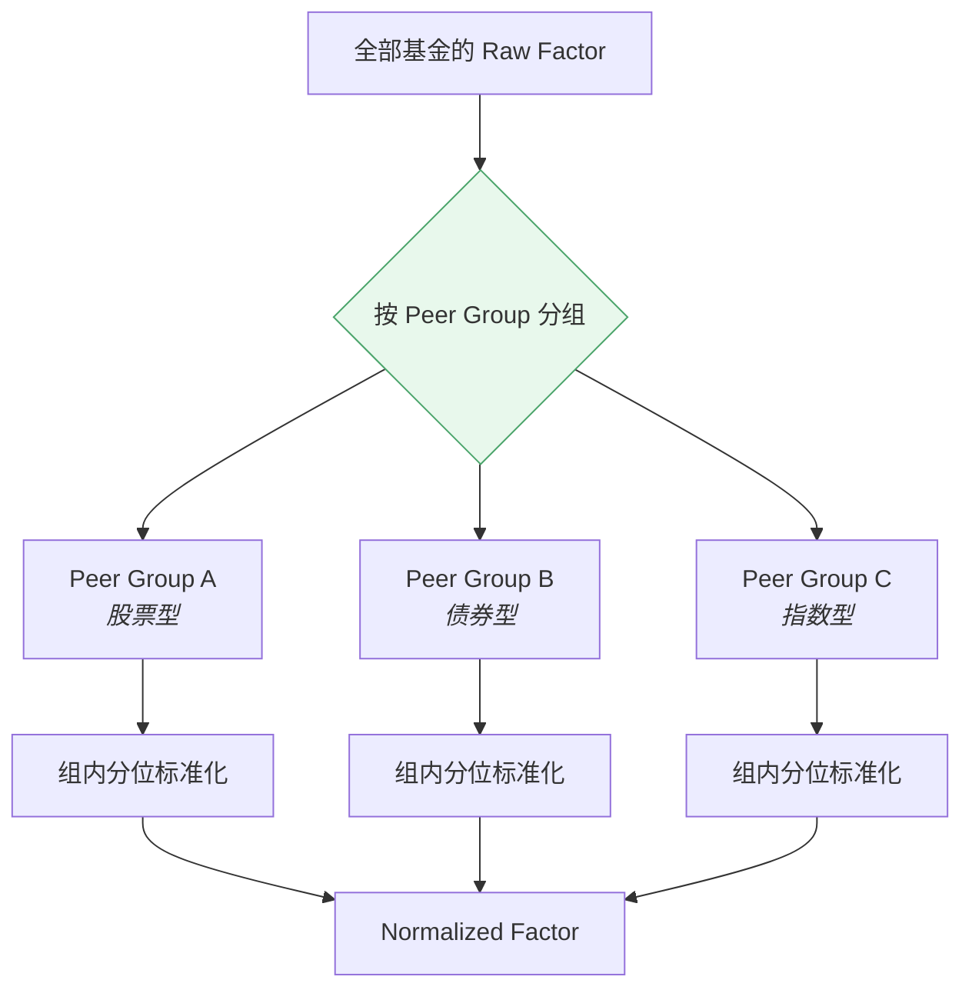

# 因子标准化 · Factor Normalization

> 上游文档：docs/01-product/01-product-overview.md（v2.5）｜本文细化环节：② Factor
> 业务需求：docs/01-product/02-business-requirements.md（v2.3）§14.4 指标标准化
> 本域上游：docs/04-factor/03-factor-definition.md、04-factor-calculation.md（v1.0）
>
> **文档版本**：v1.4 ｜ **产品阶段**：第一阶段

---

## 1. 文档目的与边界

### 1.1 本文档回答什么

> **不同量纲、不同尺度、不同方向的 Factor 如何变成可比较的标准化结果？**

### 1.2 本文档不回答什么

| 不回答 | 归属 |
|---|---|
| Factor 公式与原始计算 | `03-factor-definition`、`04-factor-calculation` |
| **Peer Group 如何构建** | `05-fund-evaluation`（本层**消费**它） |
| 评分权重如何配置 | `05-fund-evaluation` |
| 子分如何合成 | `05-fund-evaluation` |

> **本层只做"把 Factor 变成可比较的数"，不做"把多个 Factor 合成一个分"** —— 后者是 `Fund Score`（上游 §4.2 ② 边界）。

---

## 2. Raw Factor 与 Normalized Factor

### 2.1 两者的区别

| | Raw Factor | Normalized Factor |
|---|---|---|
| **内容** | 原始计算值 | 标准化后的可比较值 |
| **量纲** | 各不相同（百分比 / 比率 / 天数） | 统一（无量纲） |
| **方向** | 各不相同（越高越好 / 越低越好 / 目标区间） | **统一为越高越好** |
| **取值范围** | 不固定 | **`[0,100]`** |
| **可比性** | 跨 Factor 不可比 | 跨 Factor 可比 |
| **用途** | 展示、筛选阈值判断 | **评分合成的输入** |

### 2.2 为什么必须分离

> **两者必须同时保留，不能用标准化值覆盖原始值。**

| # | 理由 |
|---|---|
| 1 | **展示需要原始值** —— 用户要看"Sharpe 是 1.25"，不是"标准化后 87.0" |
| 2 | **筛选阈值基于原始值** —— "Sharpe > 1.0"是绝对阈值，标准化后无法表达 |
| 3 | **标准化方法可变** —— 方法变更时可从 Raw 重新标准化，无需重算 Factor |
| 4 | **Peer Group 可变** —— 同一 Raw 值在不同分组下有不同分位 |

### 2.3 示例

```
Raw Sharpe = 1.25
    ↓  在该 Peer Group（1,240 只基金）内做分位标准化
Percentile = 前 10%
Normalized = 90 / 100
```

---

## 3. 标准化方法

### 3.1 支持的方法框架

| 方法 | 说明 | 可解释性 |
|---|---|---|
| **Percentile Rank** | 在 Peer Group 内的分位排名 | **高** —— 可直接用自然语言表述 |
| Cross-sectional Rank | 排名序号后归一 | 高 |
| Z-Score | `(x − μ) / σ` | 中 —— 需理解标准差 |
| Min-Max | `(x − min) / (max − min)` | 中 —— 极值敏感 |
| Time-series Standardization | 与自身历史比较 | 低 —— 跨基金不可比 |

### 3.2 第一阶段的选择

> **优先使用 Percentile Rank / Peer Group 内排名**（`02-business-requirements` §15.4，已定案）。

**理由是可解释性**：

```
Percentile：某基金 3Y Sharpe 在同类中位于前 10%  →  Sharpe Score = 90
Z-Score：   某基金 3Y Sharpe 的 Z 值为 1.28       →  这是什么意思？
```

上游把可解释性列为第一阶段的核心产品价值（原则十二），标准化方法的选择服从这一原则。

### 3.3 各方法的适用性对比

| 方法 | 极值敏感 | 分布假设 | 跨组可比 | 信息损失 |
|---|---|---|---|---|
| **Percentile Rank** | **不敏感** | 无 | 是 | 丢失"差距大小" |
| Z-Score | **敏感** | 近似正态 | 否 | 保留差距 |
| Min-Max | **极敏感** | 无 | 否 | 保留差距 |

> **Percentile 的代价**：它丢失"领先多少"的信息。排名第 1 与第 2 的分位差异，可能对应巨大或微小的实际差距。若某场景需要保留差距，须显式说明并选用其他方法。

> **已定案 · 2026-08-27**：第一阶段**全部标准化采用分位（Percentile）**，不保留差距信息。
>
> **依据**：①上游已定**分位分层 5/20/50/80**（P0 已定案），Tier 直接由分位阈值划分 —— 若标准化改用 Z-score，分层就须换一套阈值口径，两者无法共存；②Z-score 虽保留差距，但**对离群值高度敏感** —— 一只基金的极端因子值会压缩其余全部基金的得分区间。
>
> **代价须明确**：分位丢失「领先多少」的信息。第一名与第二名的分位差与第五十名与第五十一名的分位差相同，但实际差距可能悬殊。**这个代价由 `raw_value` 一并落库来补偿** —— 归因链中同时呈现原始值与分位（`05-fund-evaluation/02` §10.3）。

---

## 4. Cross-sectional Normalization

### 4.1 横截面而非时间序列

> **标准化在同一时点、跨基金进行，而非对单只基金的历史序列进行。**

```
✅  某时点，1,240 只同类基金的 Sharpe 排序 → 分位
❌  某基金 5 年的 Sharpe 序列标准化 → 与其他基金不可比
```

### 4.2 必须在 Peer Group 内进行



### 4.3 为什么不能混合标准化

> **股票型、债券型、货币型基金的收益与波动量级相差一个数量级。**

```
若混合标准化：
    全部债券型基金的收益分位都很低
    全部股票型基金的波动分位都很高
    → 评分退化为"基金类型的代理变量"
    → 债券型基金永远得低分，与其管理水平无关
```

（`02-business-requirements` §5.3 分类差异化评价原则）

### 4.4 Peer Group 的来源

> **本层消费 Peer Group，不构建它。**

| 项 | 说明 |
|---|---|
| 构建方 | `05-fund-evaluation` |
| 构建依据 | `Fund Classification` + `effective_at` + 参与规则 |
| **关键约束** | **Peer Group 的构建不得依赖 Fund Score 或 Fund Universe**（上游 `FR-PEER-001`） |
| 本层职责 | 按给定的 Peer Group 划分做组内标准化 |

### 4.5 Peer Group 必须满足 PIT

标准化使用的 Peer Group 必须是 `decision_at` 时点的组构成，而非当前构成。历史回放时优先读取当期快照（`03-data/04-data-versioning` §7.3）。

---

## 5. Peer Group 相关的维度

### 5.1 本层需要保留的维度

> Peer Group 的具体定义属 `05-fund-evaluation`，但 Factor 层的输出**必须保留足以支持分组的维度**：

| 维度 | 用途 |
|---|---|
| **Fund Classification** | 主要分组依据 |
| **Evaluation Profile** | 决定适用哪套方向规则（§6.3） |
| Asset Class | 更粗粒度的分组 |
| Benchmark | 相对类 Factor 的可比性 |

### 5.2 组内样本量

| 情形 | 处理 |
|---|---|
| **`n_effective ≥ 30`** | 正常分位标准化 |
| **`n_effective < 30`** | **不做横截面标准化**，标 `INSUFFICIENT_SAMPLE` |
| 组内仅 1 只基金 | 分位无意义 → `UNAVAILABLE` |

#### 5.2.1 阈值定案：30（v1.1）

> **定案 · 2026-08-27**：`TBD-FN-2` 关闭。见 `02-business-requirements` §7.3.1、`TBD-resolution.md` Policy ⑤。

**判定基数是 `n_effective`（该 Factor 在该组的有效参与数），不是 `peer_group_size`**：

```
Peer Group 有 50 只基金
其中 25 只的 F-RAP-002 Sortino 为 UNAVAILABLE（MAR 未配置 / 数据不足）
    → n_effective = 25 < 30
    → 该组该 Factor 不做标准化，标 INSUFFICIENT_SAMPLE
    → 但组内【其他 Factor】若 n_effective ≥ 30，照常标准化
```

> **因此 `INSUFFICIENT_SAMPLE` 是 (Peer Group, Factor) 粒度的，不是 Peer Group 粒度的** —— 同一组内不同 Factor 可以有不同的判定结果。把它当成组级状态会让一个指标的数据缺口拖垮整组的全部标准化。

> **此前 v1.0 的「标记低置信」表述已作废** —— 定案改为**不产出**横截面标准化值，而非产出一个带低置信标记的值。理由：低置信值仍会被下游当作数值使用（进入加权评分、进入排序），标记只在展示层可见；不产出则强制下游显式处理缺失。

> **Raw Value 不受影响** —— 本节讨论的全部是横截面派生量。

`<OPEN-9: 30 的实证验证，待数据回溯>`

### 5.3 组内 `UNAVAILABLE` 的处理

> **某 Factor 为 `UNAVAILABLE` 的基金，不参与该 Factor 的分位计算。**

```
Peer Group 有 1,240 只基金
其中 180 只的 3Y Sharpe 为 UNAVAILABLE（成立不足 3 年）
    → 分位在剩余 1,060 只中计算
    → 那 180 只的 3Y Sharpe 标准化值同样为 UNAVAILABLE
```

**不得**把 `UNAVAILABLE` 当作最差值参与排名——那会把"数据不足"错误地表达为"表现最差"（`02-business-requirements` §15.5）。

### 5.4 组内 `MAR` 一致性校验

> **依赖 `MAR` 的 Factor（`F-RISK-002`、`F-RAP-002` 及其 Rolling 变体）在标准化前必须校验：同一 `Peer Group` 内的全部基金解析出同一个 `MAR`。**（上游 §5.5.3）

```
Peer Group 基于 Fund Classification 构建
MAR       按 Fund Category 配置

若两者粒度不一致 → 同组内出现多个 MAR
    → 基金 A 的 Sortino 以 MAR=0 算，基金 B 以 MAR=2% 算
    → 两者不在同一标尺上，却被放进同一个分位排名
```

| 情形 | 处理 |
|---|---|
| 组内 `MAR` 一致 | 正常标准化 |
| **组内 `MAR` 不一致** | 该 Factor 在该组 **`UNAVAILABLE`**，并**告警**——这是配置粒度错配，属需修复的问题 |

> **不得"取多数"或"按各自 MAR 分别排分位"**：前者让少数基金的值失去意义，后者产生互不可比的多个分位却呈现为同一列。正确处理是标记不可用并推动 `05-fund-evaluation` 修正配置粒度。

> **已定案 · 2026-08-27**：MAR 的配置粒度必须**等于或粗于** Peer Group 划分粒度。
>
> ```
> MAR 按 fund_category × currency 配置
> Peer Group 由 Fund Classification 构建
>
> 若 MAR 粒度【细于】Peer Group
>     → 同一组内出现多个 MAR
>     → 组内 Sortino 不在同一标尺，却被放进同一分位排名
> ```
>
> **本域的执行动作**：标准化前校验同组 MAR 一致性，不一致时该组该 Factor `UNAVAILABLE` 并告警（§5.4，不变）。**本条定义的是配置层的约束**，使该告警在正常情况下不会触发 —— 校验是兜底，不是常态。

---

## 6. Direction Normalization

### 6.1 统一为"越高越好"

> 标准化后的字段统一命名为 `normalized_value`，取值范围为 **`[0,100]`**，数值越高一律代表越优秀（`02-business-requirements` §15.4）。`normalized_score` 保留给评分层的加权合成结果，不得用于单因子标准化值。

### 6.2 四种方向的转换

| Preference Direction | 转换方式 |
|---|---|
| `HIGHER_IS_BETTER` | 直接使用分位 |
| `LOWER_IS_BETTER` | **分位反转**：`Normalized = 100 − Percentile` |
| **`TARGET_RANGE`** | 见 §6.3 |
| **`STRATEGY_DEPENDENT`** | 见 §6.4 |

### 6.3 `TARGET_RANGE` 的转换（Beta）

> **Beta 没有单调方向**：0.5 不必然优于 1.0。

转换需要一个**目标区间**，落在区间内视为零偏离，超出区间后偏离越远得分越低：

```
给定目标区间 [Beta_lower, Beta_upper]
    偏离度 = max(Beta_lower − Beta_actual, 0, Beta_actual − Beta_upper)
    → 在 Peer Group 内对偏离度做分位
    → 偏离度分位反转（偏离小 = 高分）
```

| Evaluation Profile | M1 Beta 目标区间 | 说明 |
|---|---:|---|
| **Active Equity** | `[0.85, 1.15]` | 约束系统性暴露，避免通过极端 Beta 伪造 Alpha |
| **Passive Equity** | `[0.98, 1.02]` | 紧贴跟踪基准，区间外视为跟踪失效 |
| **Bond** | `[0.90, 1.10]` | M1 使用相对中债综合全价指数的回归 Beta；股票 Beta 与 Duration Tilt 后续作为独立 Factor 引入 |
| **Hybrid** | `[0.90, 1.10]` | 相对 60% 权益全收益指数 + 40% 债券全价指数的复合 Benchmark |

| # | 要求 |
|---|---|
| TR-1 | 目标值/区间**必须由 `Evaluation Profile` 显式定义**，不得套用单调方向 |
| TR-2 | 目标区间未定义时，该 Factor 在该画像下 `UNAVAILABLE`，**不得默认按越低越好处理** |

### 6.4 `STRATEGY_DEPENDENT` 的转换（Tracking Error）

> **同一个 Factor 在不同 `Evaluation Profile` 下方向不同。** Factor 层始终保留 TE `raw_value` 与组内 `percentile`。Passive Equity 与 Bond 可独立产生“越高越好”的 `normalized_value`；Active Equity 与 Hybrid 的方向取决于 IR/Sharpe，因此不产出独立 TE `normalized_value`，由评分层产出 `interaction_value` 并替代 TE 自身的加权输入。

| Evaluation Profile | Factor 层方向 | 评分层处理 |
|---|---|---|
| **Active Equity** | `STRATEGY_DEPENDENT` | 使用 TE × IR 复合算子产出 `interaction_value`，替代 TE 自身贡献 |
| **Passive Equity** | `LOWER_IS_BETTER` | 直接使用分位反转后的 TE `normalized_value` |
| **Bond** | `LOWER_IS_BETTER` | 执行年化 TE 1.5% 风险预算上限规则，超限时 TE 评分为 0 |
| **Hybrid** | `STRATEGY_DEPENDENT` | 使用 TE × Sharpe 复合算子产出 `interaction_value`，替代 TE 自身贡献 |

| # | 要求 |
|---|---|
| SD-1 | 转换规则**必须按 `Evaluation Profile` 分别定义** |
| SD-2 | Active/Hybrid 的 TE 不产出独立 `normalized_value`；复合结果属于评分层，字段名为 `interaction_value` |
| SD-3 | TE 复合贡献只占用 TE 的配置权重；IR/Sharpe 原有贡献保持不变，不得再次加入独立 TE 贡献 |

### 6.5 为什么方向转换必须在本层完成

> 若把方向处理推给评分层，会产生两个问题：

| 问题 | 说明 |
|---|---|
| 评分层需理解每个 Factor 的语义 | 违反关注点分离——评分层只应做加权 |
| 方向易被遗漏 | 新增 Factor 时若忘记处理方向，会得到符号相反的评分且不易察觉 |

**因此**：Normalized Factor 交付给评分层时，**已经全部是"越高越好"**。

---

## 7. Outlier Treatment

### 7.1 本层的立场

> **第一阶段采用 Percentile Rank 作为主要标准化方法，而分位排名对极值天然不敏感。**

```
某基金 Sharpe = 15.0（极端值，可能是 σ 极小导致）
    → Percentile 排名第 1
    → Normalized = 100
    → 不会像 Z-Score 那样把整组的标准差拉大
```

**因此，标准化层面的异常值处理需求较低。**

### 7.2 但仍需处理的两类情形

| 情形 | 处理 |
|---|---|
| **极值源于数据问题** | 属 `03-data-quality` 与 `07-factor-validation` 的职责——应在进入标准化前被拦截 |
| **采用 Z-Score / Min-Max 时** | 极值会严重影响结果，**必须**做异常值处理 |

### 7.3 可选的处理方法

| 方法 | 说明 |
|---|---|
| **Winsorization** | 把超出分位阈值的值截断至阈值 |
| **Clipping** | 截断至绝对阈值 |
| **Exclusion** | 排除出标准化样本（但保留原始值） |

### 7.4 禁止自行设定规则

> **不得在未经确认的情况下引入 `Winsorize 1% / 99%` 这类规则。**

任何异常值处理都会改变分位分布，进而改变评分。规则必须：

| # | 要求 |
|---|---|
| OT-1 | **显式配置**，不得硬编码 |
| OT-2 | **版本化** —— 属 `Metric Version` |
| OT-3 | 处理动作**留痕** —— 哪些值被处理、处理前后是多少 |

> **已定案 · 2026-08-27**：标准化前**不做异常值处理**（不 Winsorize、不 Trim）。
>
> **依据**：**分位标准化本身对离群值免疫** —— 分位只依赖排序，不依赖数值大小。一只 Sharpe 为 10 的基金和一只 Sharpe 为 3 的基金，若都排第一，其分位相同。既然后续只用分位，前置的异常值处理不会改变任何结果，却会改变原始因子值并引入一个新参数（截尾比例）。
>
> **与 `07-return-risk/05` `EM-4` 结论一致但理由不同**：那里是「不能处理」（尾部正是估计对象），这里是「不需要处理」（分位天然免疫）。

> **本文档的立场**：第一阶段采用 Percentile Rank，**默认不做异常值处理**。若后续引入 Z-Score 类方法，须先确定 FN-3。

---

## 8. Normalization 的输出

### 8.1 输出内容

| 项 | 说明 |
|---|---|
| **`normalized_value`** | 标准化后的值，范围 `[0,100]`，统一"越高越好" |
| **Percentile** | 组内分位（若采用分位法） |
| **Peer Group ID / 快照引用** | 标准化的样本集 |
| **Peer Group Size** | 组内有效样本数 |
| **Normalization Method** | 所用方法 |
| **Normalization Version** | 方法版本 |
| **Confidence Flag** | 低样本量时标记 |

### 8.2 Raw 与 Normalized 同时输出

`08-factor-output` 定义的 Factor Result **同时包含** `Value`（Raw）与 `Normalized Value`。

---

## 9. Summary

因子标准化的四个要点：

- **Raw 与 Normalized 必须同时保留** —— 展示用 Raw、筛选阈值用 Raw、评分用 Normalized；方法或分组变更时可从 Raw 重新标准化
- **横截面标准化必须在 Peer Group 内进行** —— 混合标准化会让评分退化为"基金类型的代理变量"，债券型永远得低分
- **方向转换在本层完成** —— 交付给评分层的 Normalized Factor **全部是"越高越好"**，评分层只做加权，不需理解各 Factor 语义
- **`UNAVAILABLE` 不参与分位计算** —— 不得当作最差值，否则"数据不足"被表达为"表现最差"

> **两个非单调方向采用 Profile Policy**：`Beta` 按目标区间计算偏离度分位；`Tracking Error` 在 Active Equity 与 Hybrid 下由评分层复合算子产生 TE 加权输入，在 Passive Equity 与 Bond 下按越低越好处理。

---

## 10. Decisions

| # | 决策 | 理由 |
|---|---|---|
| D-1 | Raw 与 Normalized 同时保留，不覆盖 | 展示与筛选需要原始值；方法/分组变更时可重新标准化 |
| D-2 | 第一阶段采用 Percentile Rank | 可解释性最高，可直接用自然语言表述 |
| D-3 | 标准化在 Peer Group 内进行 | 混合标准化会使评分沦为基金类型的代理变量 |
| D-4 | 方向转换在本层完成而非评分层 | 评分层只做加权；否则新增 Factor 时易遗漏方向且不易察觉 |
| D-5 | `UNAVAILABLE` 不参与分位计算 | 当作最差值会把"数据不足"表达为"表现最差" |
| D-6 | `TARGET_RANGE` 通过"偏离度分位反转"转换 | Beta 无单调方向，只能以距目标的远近度量 |
| D-7 | 第一阶段默认不做异常值处理 | Percentile Rank 对极值天然不敏感；引入处理会改变分位分布 |
| D-8 | 组内有效样本量不足 30 时不产出 `normalized_value` | 防止低置信值被下游继续参与评分 |
| D-9 | `normalized_value` 使用 `[0,100]` 标尺 | 与 Percentile、Fund Score、Sub-score 和 Tier 阈值保持同一标尺 |
| D-10 | Active Equity / Hybrid 的 TE 复合结果只存在于评分层 | Factor 层不做多因子合成，且避免 TE 重复计权 |

---

## 11. Constraints

| # | 约束 | 来源 |
|---|---|---|
| C-1 | 标准化必须在 `Peer Group` 内进行 | `02-business-requirements` §15.4 |
| C-2 | Peer Group 由 `05-fund-evaluation` 构建，本层只消费 | 上游 `FR-PEER-001` |
| C-3 | 标准化后统一为"越高越好" | `02-business-requirements` §15.4 |
| C-4 | `TARGET_RANGE` / `STRATEGY_DEPENDENT` 的转换规则必须由 `Evaluation Profile` 定义；缺失时 `UNAVAILABLE` | 同上 |
| C-5 | 不得默认"风险类越低越好" | `02-business-requirements` §11.3 |
| C-6 | `UNAVAILABLE` 不得当作最差值参与排名 | `02-business-requirements` §15.5 |
| C-7 | 依赖 `MAR` 的 Factor 标准化前须校验组内 `MAR` 一致 | 上游 §5.5.3 |
| C-7 | 异常值处理规则不得硬编码，须显式配置并版本化 | 本文档 §7.4 |
| C-8 | 本层不做多因子合成 | 上游 §4.2 ② |

---

## 12. TBD

| # | 事项 | 阻塞 | 责任方 |
|---|---|---|---|
| ~~FN-1~~ | ~~是否存在需保留"差距大小"的场景及其方法~~ —— **已定案**：第一阶段全部标准化采用分位（Percentile），不保留差距信息 | — | ✅ 2026-08-27 |
| ~~FN-2~~ | ~~Peer Group 最小样本量阈值~~ —— **已定案 30**（§5.2.1）；判定基数为 `n_effective`，粒度为 (Peer Group, Factor) | — | ✅ 已定案 2026-08-27 |
| ~~FN-3~~ | ~~是否需要异常值处理及其规则~~ —— **已定案**：标准化前不做异常值处理（不 Winsorize） | — | ✅ 2026-08-27 |
| ~~FT-3~~ | ~~Beta 的 `TARGET_RANGE` 取值~~ —— **已定案**：Active `[0.85,1.15]`、Passive `[0.98,1.02]`、Bond/Hybrid `[0.90,1.10]` | — | ✅ 2026-09-08 |
| ~~FN-4~~ | ~~Hybrid 画像下 Tracking Error 的方向~~ —— **已定案**：Active/Hybrid 使用评分层复合算子；Passive/Bond 为 `LOWER_IS_BETTER` | — | ✅ 2026-09-08 |

---

## 13. Related Documents

| 关系 | 文档 |
|---|---|
| **上游** | `01-product/02-business-requirements.md` v2.3（§14.4 标准化、§11.3 方向、§5.3 分类差异化） |
| **本域** | `03-factor-definition`（Direction 声明）、`04-factor-calculation`（Raw Factor 来源）、`08-factor-output`（输出结构） |
| **下游** | `05-fund-evaluation`（**构建 Peer Group** 并消费 Normalized Factor 合成子分） |

---

## 14. Change Log

| 版本 | 日期 | 变更内容 | 上游依赖 |
|---|---|---|---|
| **v1.4** | 2026-09-08 | 统一 `normalized_value ∈ [0,100]`；固定四类 Beta 区间；明确 Active/Hybrid TE 复合算子归评分层 | Plan-2 设计 v1.1 |
| **v1.3** | 2026-08-27 | **第二批定案（3 项）**。`FN-1` 全部采用**分位标准化**，不保留差距信息（Z-score 与已定的 5/20/50/80 分层口径无法共存），代价由 `raw_value` 一并落库补偿；`FN-3` **不做异常值处理** —— 分位对离群值天然免疫，处理不改变结果却引入新参数；`FN-4` MAR 粒度必须**等于或粗于** Peer Group 粒度，使 §5.4 的一致性校验成为兜底而非常态。 详见 `TBD-resolution-2.md` | `TBD-resolution-2.md` v1.0 |
| **v1.2** | 2026-08-27 | **`TBD-FN-2` 关闭**。§5.2 阈值定为 **30**，新增 §5.2.1 —— 判定基数是 `n_effective` 而非 `peer_group_size`，因此 `INSUFFICIENT_SAMPLE` 是 **(Peer Group, Factor) 粒度**而非组级；作废 v1.0 的「标记低置信」表述，改为**不产出**横截面标准化值（低置信值仍会被下游当数值使用，标记只在展示层可见）。详见 `TBD-resolution.md` Policy ⑤ | `02-business-requirements` v2.6 §7.3.1 |
| v1.1 | 2026-08-25 | **新增 §5.4 组内 `MAR` 一致性校验**（上游 v2.5 §5.5.3）。`Peer Group` 基于 `Fund Classification` 而 `MAR` 按 `Fund Category` 配置，粒度不一致时同组 `Sortino` 不在同一标尺上却被放进同一分位排名。不一致时该 Factor 在该组 `UNAVAILABLE` 并告警；**明确排除"取多数"与"按各自 MAR 分别排分位"两种错误处理** | `01-product-overview.md` v2.5 §5.5 |
| v1.0 | 2026-08-25 | 初始版本。确立 Raw 与 Normalized 必须同时保留的四条理由；横截面标准化在 Peer Group 内进行及混合标准化会使评分沦为类型代理变量的论证；四种 Preference Direction 的转换方式（含 `TARGET_RANGE` 的偏离度分位法与 `STRATEGY_DEPENDENT` 的画像分治）；**方向转换在本层完成**的理由；`UNAVAILABLE` 不参与分位计算；Percentile Rank 对极值不敏感因而第一阶段默认不做异常值处理 | `02-business-requirements.md` v2.3、`03-factor-definition.md` v1.0 |