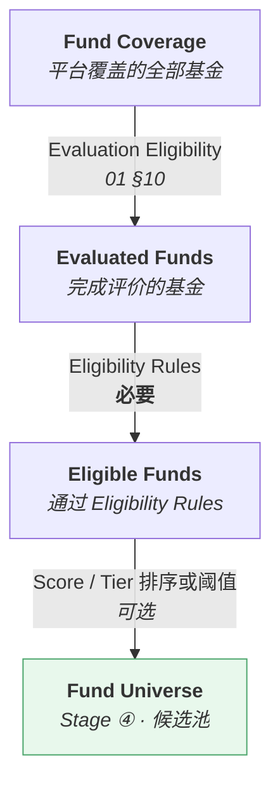

# 基金筛选与候选池 · Fund Selection & Fund Universe

> 上游文档：docs/01-product/01-product-overview.md（v2.5）｜本文细化环节：**④ Fund Universe**
> 业务需求：docs/01-product/02-business-requirements.md（v2.3）§17 Fund Screening & Fund Universe、§18 Investment Eligibility
> 本域上游：docs/05-fund-evaluation/04-fund-classification.md（v1.0）
>
> **文档版本**：v1.1 ｜ **产品阶段**：第一阶段

---

## 1. 文档目的与边界

### 1.1 本文档回答什么

> **系统如何把已评价的基金筛选为投资候选池？**

### 1.2 本文档的产出就是 `Fund Universe`

> **提示词中的 "Selection Universe" / "Candidate Funds" 即上游的 `Fund Universe`（Stage ④）。** 本域不引入新概念，全文使用上游术语。

### 1.3 本文档不回答什么

| 不回答 | 归属 |
|---|---|
| 评价、评分、排名、分层 | 本域 `01`–`04` |
| 组合构建与权重分配 | `06-portfolio` |
| 收益与风险估计 | `07-return-risk` |
| 交易执行 | Out of Scope |

---

## 2. Selection ≠ Investment Decision ⚠️

> **第一阶段的产出只有候选池，不产生任何交易动作。**

| 本域产生 | 本域**不**产生 |
|---|---|
| `Fund Universe`（候选基金集合） | `BUY` / `SELL` / `HOLD` |
| 入池 / 出池原因 | 持仓权重 |
| —— | 自动交易指令 |

### 2.1 三个必须区分的概念

> 沿用 `02-business-requirements` §17.3：

| 概念 | 含义 |
|---|---|
| 进入 `Fund Universe` | **可以**被选（评价维度） |
| 组合持仓 | 优化器实际给予正权重（`06-portfolio`） |
| **`Investment Eligibility`** | 在该时点**能否实际建仓**（可投资性维度） |

> **一只基金可以同时是"高分入池"且"当前不可买入"** —— 两个维度正交。

---

## 3. Selection Objective

从已完成 Evaluation / Scoring / Ranking / Tier 的基金中，按**版本化的 `Eligibility Rules`** 筛出允许进入组合构建的基金集合。

---

## 4. Screening 与 Eligibility Rules 的区别

> **这是本域最容易被混淆的一对概念**（`02-business-requirements` §17.1）。

| | **探索性筛选（Screening）** | **正式准入规则（Eligibility Rules）** |
|---|---|---|
| 使用者 | 研究人员在界面上临时筛选 | 策略配置的一部分 |
| 是否版本化 | 否 | **是**，属 `Strategy Version` |
| 是否可回测 | 否 | **是** |
| **是否产生 Universe** | **否** | **是** |
| 典型形态 | "规模 > 10 亿" 点几下看看 | `Eligibility Rules v1.2` |

> **UI 上的一次筛选不构成 `Fund Universe`。** 只有正式的、版本化的 `Eligibility Rules` 才产生 Universe。

---

## 5. Fund Universe 的四层收敛



> **注意第三步是可选的** —— 见 §7。

---

## 6. Eligibility

### 6.1 前置检查

| # | 检查 | 不通过 |
|---|---|---|
| 1 | 基金在 `Fund Coverage` 中且该时点存续 | 排除 |
| 2 | `evaluation_status` ∈ {`COMPLETED`, `PARTIAL`} | 排除 |
| 3 | 必需的历史长度满足 | 排除 |
| 4 | `total_score` 可得（策略 B/C 时） | 排除 |
| 5 | `fund_tier` 可得（使用 Tier 条件时） | 排除 |
| 6 | **`Investment Eligibility` 状态** | 见 §9 |

### 6.2 `evaluation_status = PARTIAL` 是否可入池

> **可以，但须校验 `data_completeness`。**

```
一只基金仅 3 个指标可得却得了 85 分
    → 可信度显著低于 12 个指标的 85 分
    → 若不设 data_completeness 下限，会系统性偏好数据稀疏的基金
```

> **已定案 · 2026-08-27**：入池 `data_completeness` 下限**沿用 `03-data/03-data-quality` `DQ-2` 的 0.8**，本域**不单独设值**。
>
> **依据**：同一口径在两处各设一个值必然发散 —— 一处调整而另一处未同步时，会出现「数据质量判定合格但入池判定不合格」的矛盾状态，且无人能说清哪个是对的。
>
> **本域的职责是引用而非定义**。若入池需要比数据质量更严的门槛，那应表述为一个**独立的筛选条件**（如「近 1 年完整度 ≥ 0.9」），而不是给同一个指标设第二个阈值。

---

## 7. 三种 Universe 构成策略（已定案）

> **沿用 `02-business-requirements` §17.2。`Fund Score` 是 Universe 的可选输入，不是固有属性。**

| 策略 | 构成方式 | 是否需要 Score |
|---|---|---|
| **A：Eligibility only** | 仅硬性准入规则 | **否** |
| **B：Eligibility + Score Threshold** | 准入 + `Score ≥ 阈值` | 是 |
| **C：Eligibility + Score Top-N** | 准入 + Score 排名前 N | 是 |

### 7.1 为什么必须支持策略 A

> **`Equal Weight`、`Minimum Volatility`、`Risk Parity` 等策略只需要一个合格标的集合，并不需要 Score 排序。**

把 Score 写进 Universe 的定义，会让这些策略无法在本架构下表达（上游 §4.2 ④）。

### 7.2 策略 A 下评分字段为空是正常的

> 采用策略 A 时，Universe 快照中的评分字段为空，**这是正常情况，不构成留痕缺失**。

---

## 8. Hard Filters

### 8.1 筛选维度

> 沿用 `02-business-requirements` §17.4：

| 类别 | 条件 |
|---|---|
| **基础** | 基金类型、成立时间、基金规模、经理任职时间 |
| **收益** | 1Y / 3Y / 5Y Return 阈值或分位 |
| **风险** | Maximum Drawdown、Volatility、VaR / CVaR 上限 |
| **风险收益** | Sharpe / Sortino / Calmar 下限、Alpha 下限、IR 下限 |
| **稳定性** | Win Rate 下限、Rolling 指标稳定性 |
| **评价结论** | `total_score` 阈值、`percentile` 阈值、`fund_tier` 条件 |
| **可投资性** | `Investment Eligibility` 状态（§9） |

### 8.2 阈值取值

```
Score Threshold      = TBD
Percentile Threshold = TBD
Tier Condition       = TBD
Sharpe Floor         = TBD
Max Drawdown Ceiling = TBD
```

> **以上参数当前均为 TBD，投产前必须由业务负责人确认。** 本域不自行设定具体数值。

`<TBD-FSEL-2: 各 Hard Filter 的具体阈值，待投研确认>`

### 8.3 使用 Raw Value 还是标准化值

> **筛选阈值应基于 Raw Value**（`04-factor/08-factor-output` §4.2）。

```
❌ "筛选 Normalized Volatility < 0.3"
   → 这是组内相对位置，组变了含义就变了
   → 熊市中"组内相对低波"可能仍是绝对高波

✅ "筛选 Volatility < X%"
   → 绝对标准，含义稳定
```

**例外**：`percentile` 与 `fund_tier` 本身就是相对量，用它们做筛选是有意为之（"取同类前 20%"），不属误用。

### 8.4 基金规模的双向约束

> **规模需上下限双向约束**（`02-business-requirements` §17.4）：

| 方向 | 理由 |
|---|---|
| **下限** | 过小面临清盘风险与流动性问题 |
| **上限** | 过大则策略容量受限、超额收益被稀释 |

> **但不假设具体上界** —— 规模上限是 **Strategy-specific Capacity Rule**，随策略类型而变（中小盘策略容量远低于大盘策略），必须可配置。

`<TBD-FSEL-3: 各策略类型的容量规则（= 上游 TBD-P1-7），待投研确认>`

---

## 9. Investment Eligibility

> **可投资性是筛选维度，与评价维度正交**（`02-business-requirements` §18）。

### 9.1 取值（引用`02-business-requirements` §18.2）

| 状态 | 可建仓 | 可加仓 | 可持有 | 可减仓 |
|---|:---:|:---:|:---:|:---:|
| `FULLY_ELIGIBLE` | ✓ | ✓ | ✓ | ✓ |
| `HOLD_ONLY`（暂停申购） | ✗ | ✗ | ✓ | ✓ |
| `LIMITED`（限制大额申购） | 受限 | 受限 | ✓ | ✓ |
| `EXIT_ONLY`（即将清盘/转型） | ✗ | ✗ | ✓ | ✓ |
| `NOT_TRADABLE`（已清盘/暂停赎回） | ✗ | ✗ | — | ✗ |

### 9.2 不可建仓 ≠ 移出 Universe ⚠️

> **这是一处关键区分。**

```
基金 X：Tier = A+，但 Investment Eligibility = HOLD_ONLY（暂停申购）

❌ 直接移出 Universe
   → 组合中已持有的该基金会被优化器判定为"不在可选集合"
   → 可能导致被强制清仓

✅ 保留在 Universe，但标注不可建仓
   → 优化器可以维持现有持仓，只是不能加仓
```

沿用`02-business-requirements` §18.1：**"暂停申购 ≠ 不可持有"**。若用可投资性直接过滤 Universe，会错误地把暂停申购的持仓强制清仓。

### 9.3 处理方式

| 状态 | Universe 处理 |
|---|---|
| `FULLY_ELIGIBLE` | 正常入池 |
| `HOLD_ONLY` / `LIMITED` / `EXIT_ONLY` | **入池并标注约束**，交由 `06-portfolio` 在优化时施加 |
| `NOT_TRADABLE` | **排除** —— 已清盘或不可交易 |

> **已定案 · 2026-08-27**：`EXIT_ONLY` 基金**不入池**；但**已持仓的不强制卖出**。
>
> **依据 —— 入池与持有是两个不同的判断**：
>
> ```
> 入池 = 「可以建仓」
> EXIT_ONLY = 「不可申购」
>     → 入池后优化器可能给它分配权重
>     → 而该权重无法执行
>     → 这正是 Tradability Bias 的来源
>
> 已持仓不强制卖出 = 「可以继续持有」
>     → 强制卖出会因一个外部状态变化而扰动整个组合
> ```
>
> **本条与 §9.2「不可建仓 ≠ 移出 Universe」是同一原则的两面**：§9.2 说的是已在池中的基金因不可建仓而不移出；本条说的是尚未入池的基金因不可建仓而不纳入。**两者都指向「Universe 成员资格」与「可交易性」是独立的两个属性**。

---

## 10. Soft Filters

> **第一阶段不实现。**

提示词列举的"Higher Score preferred / Lower Drawdown preferred"等偏好性条件属于**排序**而非**筛选**——在策略 B/C 中已由 Score 排序承担。

若未来引入独立的偏好加权机制，须作为新的 Policy 项显式设计，不得隐含在筛选逻辑中。

---

## 11. Selection Constraints

> **预留结构，第一阶段除非有明确业务需求否则不实现。**

| 约束 | 说明 | 第一阶段 |
|---|---|---|
| `max_candidates` | 候选池上限 | 策略 C 已含（Top-N） |
| `min_candidates` | 候选池下限 | **见 §11.1** |
| `category_constraints` | 各类别基金的数量或比例约束 | 不实现 |
| `liquidity_constraints` | 流动性约束 | 不实现（§8.1 已含规模下限） |
| `strategy_constraints` | 策略类型约束 | 不实现 |
| **`duplicate_fund_constraints`** | 同一基金多 Share Class 的去重 | **见 §11.2** |

### 11.1 候选池下限是必需的

> **Universe 过小会使组合构建失败或过度集中。**

```
Universe 仅剩 3 只基金
    → 分散化无从谈起
    → Minimum Volatility / Risk Parity 等策略退化
```

**处理**：Universe 规模低于下限时**显式失败并阻断**，不得静默产出过小的池子（上游 §9 原则五 失败显式化）。

> **推荐默认 · 2026-08-27**：Universe 最小规模 = **30**，与 `MIN_PEER_GROUP_SIZE` 同值。业务方可改。
>
> **依据**：池子规模小于组规模下限时，**任何横截面派生量都不可用** —— 池内基金的分位、Tier 都会是 `INSUFFICIENT_SAMPLE`，此时 Universe 虽然非空但已无法支撑选基决策。
>
> **不满足时的处理**：Universe 标 `INSUFFICIENT_UNIVERSE` 并阻断本期组合构建，**不降级为「用更少的基金优化」** —— 后者会产出一个高度集中的组合，其风险特征与预期完全不同。

### 11.2 同一基金多 Share Class 的去重

> **同一基金的 A/C/I 类份额高度相关，同时入池会造成隐性集中。**

```
Universe 中同一只基金的 3 个份额类别各占一席
    → 优化器视其为 3 个独立标的
    → 实际风险敞口集中于同一产品
```

**这与 `01-fund-evaluation` `TBD-FE-1`（多 Share Class 是否同组排名）是同一问题的两个环节**，须一并决策。

> **已定案 · 2026-08-27**：见 `TBD-resolution-2.md` Policy D。**去重发生在本层**（Universe 层），评价与排名层不去重（`01-fund-evaluation` `FE-1`）。
>
> **去重规则**：
>
> ```
> 同一 fund_id 下的多个 share_class：
>     ① 排除不可申购的类别
>     ② 在剩余类别中取【综合费率最低】者
>     ③ 费率相同则取【规模最大】者
> ```
>
> **费率优先于规模**：同一产品的不同份额其**投资标的完全相同**，差异只在费率与申赎规则。因此费率是唯一有实质差异的维度，规模只是并列时的稳定排序依据。
>
> **三条执行要求**：
>
> | # | 要求 |
> |---|---|
> | 1 | **去重结果须落库并留痕**（保留被排除的类别与排除原因），否则无法解释「为什么选了 C 类」 |
> | 2 | 去重发生在 **Universe 构建之后、组合优化之前** —— Universe 仍含全部类别供分析查询 |
> | 3 | 费率取**综合费率**（管理费 + 托管费 + 销售服务费），不只看管理费 —— C 类通常管理费与 A 类相同但有销售服务费 |

---

## 12. Selection Policy

| 字段 | 说明 |
|---|---|
| `policy_id` | 标识 |
| `version` | 版本号（即 `Eligibility / Universe Version`） |
| `effective_from` / `effective_to` | 生效区间 |
| `status` | `DRAFT` / `ACTIVE` / `DEPRECATED` / `RETIRED` |
| **`universe_strategy`** | `A` / `B` / `C`（§7） |
| **`eligibility_rules`** | 硬性准入规则集合 |
| **`hard_filters`** | 各维度阈值 |
| `score_threshold` / `top_n` | 策略 B/C 时必填 |
| **`investment_eligibility_handling`** | 各状态的处理方式（§9.3） |
| `min_universe_size` / `max_universe_size` | 规模约束 |
| `duplicate_handling` | 多 Share Class 去重规则 |
| `data_completeness_floor` | 可信度下限 |

### 12.1 是 Strategy Version 的第 3 项

> 沿用 `02-architecture/01-system-architecture` §8.2：

```
Strategy Version 第 3 项 = Eligibility / Universe Version
    = 准入规则 + Universe 构成策略
```

本域**不新增版本类型**。

---

## 13. Selection Result

| 字段 | 说明 |
|---|---|
| `fund_id` | Share Class 粒度 |
| `as_of_date` / `decision_at` | 时点 |
| **`selection_status`** | `SELECTED` / `REJECTED` |
| **`selection_reason`** | **通过与未通过的条件清单**（§14） |
| `total_score` / `sub_scores` | 策略 B/C 时必填；策略 A 时为空 |
| `rank` / `percentile` | 同上 |
| `fund_tier` | 使用 Tier 条件时必填 |
| **`investment_eligibility`** | 该时点可投资性状态与约束标注 |
| `data_completeness` | 可信度 |
| **五项 Policy 版本引用** | §16 |

---

## 14. Selection Explainability

### 14.1 必须能回答两个问题

> **Why was this fund selected?** 与 **Why was this fund rejected?**

### 14.2 不得只保存布尔值

```
❌ selected = true / false

✅ 通过的条件：
     total_score >= X          ✓ (实际 X)
     fund_tier ∈ {A+, A}       ✓ (实际 A+)
     percentile >= X           ✓ (实际 X%)
     fund_size >= X            ✓ (实际 X)
   未通过的条件：（无）

✅ 被拒的基金同样记录：
     total_score >= X          ✗ (实际 X，差 X)
     其余条件                   ✓
```

### 14.3 被排除的基金必须同样留痕

> **这不是可选项**（`02-business-requirements` §17.5）。

```
如果 90% 的基金因同一条件被排除
    → 说明该条件可能设置不当
    → 只有记录了排除原因才能发现
```

### 14.4 记录未通过的**全部**条件，而非首个

> **短路求值会丢失信息。**

```
❌ 遇到第一个不满足的条件就返回
   → 无法知道该基金还差多少其他条件
   → 无法回答"放宽某条件能新增多少基金"

✅ 评估全部条件后一并记录
```

---

## 15. Universe 快照

> **每个历史时点的 `Fund Universe` 必须留存完整快照**（上游 §4.2 ④、`02-business-requirements` §17.6）。

| 字段 | 说明 |
|---|---|
| `decision_at` | 时点 |
| **成员列表** | 该时点全部入池基金 |
| `eligibility_rules_version` | 可追溯 |
| `scoring_policy_version` | 策略 B/C 时必填；策略 A 时为空 |
| 评分与子分 | 同上 |
| **入池 / 出池原因** | 通过或未通过哪些条件 |
| `data_completeness` | 评分可信度 |
| **`investment_eligibility` 状态** | 该时点可投资性 |

### 15.1 未完整留痕的时点，其回测结果无效

> **这是硬性判据**（`02-business-requirements` §17.6）。

理由有二：

| # | 理由 |
|---|---|
| 1 | 回测不可复现——无法还原当时的池子 |
| 2 | **无法避免幸存者偏差**——若用今天的池子回溯历史，已清盘基金被系统性排除，回测被美化 |

### 15.2 快照优于按 PIT 重算

> 沿用 `04-factor/08-factor-output` §5.3 的论证：数据 Restatement 后重算得到的是"今天的值"，而审计要求的是"当时看到的值"。

---

## 16. Reproducibility

### 16.1 要素

```
decision_at
+ Selection Policy Version（Eligibility / Universe Version）
+ Scoring Policy Version（策略 B/C 时）
+ Classification Policy Version（使用 Tier 条件时）
+ Ranking Policy Version（使用 Percentile 条件时）
+ Evaluation Policy Version
+ Factor Version
+ Peer Group Version
+ Data Version
        ↓
    相同 Universe
```

### 16.2 Policy 变更不改写历史 Universe

历史快照保持不变，新 Universe 以新版本号产生。

---

## 17. Universe 变动监控

> 业务上需能回答（`02-business-requirements` §17.7）：

| 问题 | 说明 |
|---|---|
| 本期新入池 / 出池了哪些基金及原因 | 逐只归因 |
| **Universe 规模变化是否正常** | **骤增骤减通常意味着规则或数据出了问题** |

### 17.1 规模骤变的两类原因

| 原因 | 说明 |
|---|---|
| **真实变化** | 市场整体下行使大量基金跌破 Sharpe 下限 |
| **系统问题** | 某数据源中断导致大量基金 `evaluation_status = FAILED` |

> **两者的处置完全不同**，因此监控必须能区分——规模骤降时应同时报告"因哪个条件被排除的基金数增加最多"。

> **推荐默认 · 2026-08-27**：Universe 规模**单期变动 > 20%** 触发告警。
>
> **依据**：规模骤变通常是**数据问题**而非市场变化 —— 一次分类映射变更、一批基金的状态字段缺失、一个 Provider 的数据延迟，都会让池子规模突然变化。真实的市场变化（基金清盘、新发）是渐进的。
>
> **与 `04-factor/07-factor-validation` 的覆盖率骤降检测同理**：**覆盖率的突变是最有效的系统性问题探测器** —— 它不针对任何具体错误，但几乎所有系统性错误都会表现为覆盖率异常。

---

## 18. Input / Process / Output

### 18.1 Process

```
① 取 Fund Coverage 在 decision_at 的成员（PIT）
② 前置检查（§6.1）→ Evaluated Funds
③ 施加 Eligibility Rules 与 Hard Filters → Eligible Funds
   · 评估全部条件，不短路
   · 逐只记录通过/未通过清单
④ 按 universe_strategy：
   A → 直接得到 Universe
   B → 叠加 Score 阈值
   C → 按 Score 取 Top-N
⑤ 施加 Investment Eligibility 处理（§9.3）
⑥ 去重（多 Share Class）
⑦ 校验 Universe 规模 ≥ min_universe_size
   · 不满足 → 显式失败并阻断，不得静默产出
⑧ 落 Universe 快照（含被拒基金的原因）
```

---

## 19. Edge Cases

| 情形 | 处理 |
|---|---|
| Universe 为空 | **显式失败并阻断**，不得返回空池继续 |
| Universe 规模低于下限 | 同上 |
| 策略 C 但合格基金不足 N 只 | 取全部合格基金；须标注实际数量少于 N |
| 全部基金 `evaluation_status = FAILED` | 阻断，且这是**系统问题信号**，须告警 |
| 高分基金 `NOT_TRADABLE` | 排除，但**在被拒清单中记录**，避免"消失得无声无息" |
| 高分基金 `HOLD_ONLY` | **入池并标注不可建仓**，不得排除（§9.2） |
| 同一基金多 Share Class 全部合格 | 按去重规则处理（`TBD-FSEL-6`） |

---

## 20. 示例

```
decision_at = 2026-08-24 ｜ Universe Strategy = B（Eligibility + Score Threshold）

Fund A
  ① Eligibility Rules
     成立时间 >= X            ✓
     基金规模 ∈ [X, X]        ✓
     Investment Eligibility   FULLY_ELIGIBLE ✓
  ② Hard Filters
     total_score >= X         ✓ (实际 X)
     fund_tier ∈ {A+, A}      ✓ (实际 A+)
     max_drawdown <= X%       ✓ (实际 X%)
  → SELECTED

Fund B
  ① Eligibility Rules         全部 ✓
  ② Hard Filters
     total_score >= X         ✗ (实际 X，差 X)
     fund_tier ∈ {A+, A}      ✗ (实际 B)
     max_drawdown <= X%       ✓
  → REJECTED（记录全部两项未通过，而非只记第一项）

Fund C
  ① Eligibility Rules
     Investment Eligibility   HOLD_ONLY
  → SELECTED，标注「不可建仓，可持有可减仓」
     交由 06-portfolio 在优化时施加约束
```

---

## 21. Summary

Selection 是**筛选**环节，产出 `Fund Universe`，**不产生任何交易动作**。

四条关键约束：

- **只有版本化的 `Eligibility Rules` 才产生 Universe** —— UI 上的一次临时筛选不构成 Universe
- **必须支持"不需要 Score"的策略 A** —— 否则 `Equal Weight`、`Risk Parity` 等策略无法在本架构下表达
- **不可建仓 ≠ 移出 Universe** —— 把 `HOLD_ONLY` 的基金直接过滤掉，会导致已持仓被优化器强制清仓
- **未完整留痕的时点，其回测结果无效** —— 既不可复现，也无法避免幸存者偏差

两处容易被简化掉的要求：

- **被拒基金必须同样留痕，且要记录未通过的全部条件而非首个** —— 短路求值会让"放宽某条件能新增多少基金"变得无法回答；若 90% 基金因同一条件被排除，只有留痕才能发现规则设置不当
- **Universe 过小必须显式失败** —— 静默产出 3 只基金的池子会让分散化无从谈起，且优化器可能"成功"求解出一个荒谬的组合

---

## 22. Decisions

| # | 决策 | 理由 |
|---|---|---|
| D-1 | 本域产出即上游 `Fund Universe`，**不引入 "Selection Universe" 等新概念** | 上游术语唯一 |
| D-2 | **只产生候选池，不产生 BUY/SELL/HOLD** | 上游 Stage ④ 边界 |
| D-3 | 严格区分 Screening 与 Eligibility Rules | 只有后者产生 Universe 且可回测 |
| D-4 | **必须支持策略 A（不需要 Score）** | 否则等权、风险平价类策略无法表达 |
| D-5 | 策略 A 下评分字段为空是正常的 | 不构成留痕缺失 |
| D-6 | Hard Filter 阈值基于 **Raw Value**；percentile / tier 例外 | 标准化值是组内相对位置，绝对阈值会随组漂移 |
| D-7 | **`HOLD_ONLY` / `LIMITED` / `EXIT_ONLY` 入池并标注约束，不排除** | 排除会导致已持仓被强制清仓 |
| D-8 | `NOT_TRADABLE` 排除，但**在被拒清单中留痕** | 避免高分基金无声消失 |
| D-9 | **第一阶段不实现 Soft Filters** | 偏好性条件属排序，已由策略 B/C 承担 |
| D-10 | Universe 规模低于下限时**显式失败并阻断** | 上游 §9 原则五；静默产出过小池子后果严重 |
| D-11 | **记录未通过的全部条件，不短路** | 否则无法回答"放宽某条件能新增多少基金" |
| D-12 | 被拒基金必须留痕 | 90% 基金因同一条件被排除时才能被发现 |
| D-13 | 采用快照而非按 PIT 重算 | Restatement 后重算得到的是今天的值 |

---

## 23. Constraints

| # | 约束 | 来源 |
|---|---|---|
| C-1 | 只有版本化的 `Eligibility Rules` 才产生 `Fund Universe` | `02-business-requirements` §17.1 |
| C-2 | `Fund Score` 是 Universe 的**可选**输入，不是固有属性 | 上游 §4.2 ④ |
| C-3 | 每个历史时点的 Universe 必须留存完整快照 | 上游 §4.2 ④ |
| C-4 | **未完整留痕的时点，其回测结果无效** | `02-business-requirements` §17.6 |
| C-5 | 必须记录每只基金通过 / 未通过哪些条件，**被排除的同样记录** | `02-business-requirements` §17.5 |
| C-6 | 入池 ≠ 持有 ≠ 可买入，三者必须区分 | `02-business-requirements` §17.3 |
| C-7 | 基金规模需上下限双向约束，但**不假设具体上界** | `02-business-requirements` §17.4 |
| C-8 | 本域**不产生**交易动作与持仓权重 | 上游 §4.2 ④ |
| C-9 | 不引入 AI / ML | 上游 §6.2.1、§9 原则十至十一 |
| C-10 | Universe 为空或过小必须显式失败，不得静默继续 | 上游 §9 原则五 |

---

## 24. TBD

| # | 事项 | 影响 | 责任方 |
|---|---|---|---|
| ~~FSEL-1~~ | ~~入池所需的 `data_completeness` 下限~~ —— **已定案**：入池 `data_completeness` 下限沿用 DQ-2 的 0.8，不单独设值 | — | ✅ 2026-08-27 |
| FSEL-2 | **各 Hard Filter 的具体阈值** | 筛选无法投产 | 投研 |
| FSEL-3 | 各策略类型的容量规则（= 上游 `TBD-P1-7`） | 规模上限 | 投研 |
| ~~FSEL-4~~ | ~~`EXIT_ONLY` 基金是否入池~~ —— **已定案**：`EXIT_ONLY` 基金【不入池】，但已持仓的不强制卖出 | — | ✅ 2026-08-27 |
| ~~FSEL-5~~ | ~~`Fund Universe` 的最小规模下限~~ —— **推荐默认**：Universe 最小规模 = 30 | — | ✅ 2026-08-27 |
| ~~FSEL-6~~ | ~~同一基金多 Share Class 的去重规则（与 `TBD-FE-1` 一并决策）~~ —— **已定案**：见 Policy D · Share Class 口径 | — | ✅ 2026-08-27 |
| ~~FSEL-7~~ | ~~Universe 规模变动的告警阈值~~ —— **推荐默认**：Universe 规模单期变动 > 20% 触发告警 | — | ✅ 2026-08-27 |

---

## 25. Related Documents

| 关系 | 文档 |
|---|---|
| **上游** | `01-product/01-product-overview.md` v2.5（§4.2 ④、§5.5）、`02-business-requirements.md` v2.3（§17、§18） |
| **功能需求** | `04-functional-requirements.md`（`FR-UNIV-001~005`、`FR-ELIG-001~004`） |
| **本域** | `01-fund-evaluation`、`02-fund-scoring`、`03-fund-ranking`、`04-fund-classification` |
| **下游** | `06-portfolio`（消费 Universe）、`08-backtest`（消费 Universe 快照） |
| **因子依赖** | `04-factor/08-factor-output` §4.2（筛选须用 Raw Value） |
| **架构** | `02-architecture/01-system-architecture.md` v2.1 §8.2（Universe Version 是第 3 项） |

---

## 26. Change Log

| 版本 | 日期 | 变更内容 | 上游依赖 |
|---|---|---|---|
| **v1.1** | 2026-08-27 | **第二批定案（5 项）**。`FSEL-1` 完整度下限**沿用 `DQ-2` 的 0.8**，本域不单独设值；`FSEL-4` `EXIT_ONLY` **不入池但已持仓不强制卖出** —— 与 §9.2「不可建仓 ≠ 移出 Universe」是同一原则的两面；`FSEL-6` 去重规则（排除不可申购 → 综合费率最低 → 规模最大），**须落库留痕**且费率取综合费率；`FSEL-5` Universe 最小规模 30，不满足时阻断而非「用更少基金优化」；`FSEL-7` 规模单期变动 > 20% 告警（骤变通常是数据问题，真实市场变化是渐进的）。 详见 `TBD-resolution-2.md` | `TBD-resolution-2.md` v1.0 |
| v1.0 | 2026-08-26 | 初始版本。明确**本域产出即上游 `Fund Universe`**，不引入 "Selection Universe" 等新概念；§4 区分 Screening 与 Eligibility Rules；§7 三种构成策略并说明**必须支持策略 A**（否则等权、风险平价类策略无法表达）；**§9.2 指出"不可建仓 ≠ 移出 Universe"**——把 `HOLD_ONLY` 直接过滤会导致已持仓被优化器强制清仓；§8.3 筛选须用 Raw Value（percentile / tier 例外）；**§11.1 Universe 过小必须显式失败**；**§14.4 记录未通过的全部条件而非首个**（短路求值使"放宽某条件能新增多少基金"无法回答）；§15.1 未留痕则回测无效的两条理由；**§17.1 规模骤变的两类原因**（真实变化 vs 系统问题）处置完全不同 | `01-product-overview.md` v2.5、`02-business-requirements.md` v2.3、`04-fund-classification.md` v1.0 |