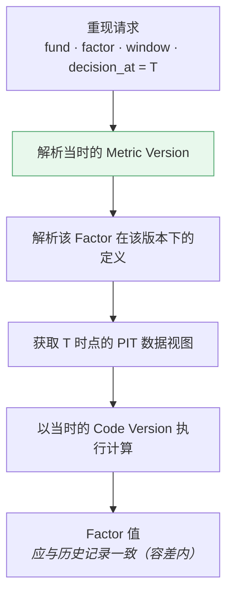
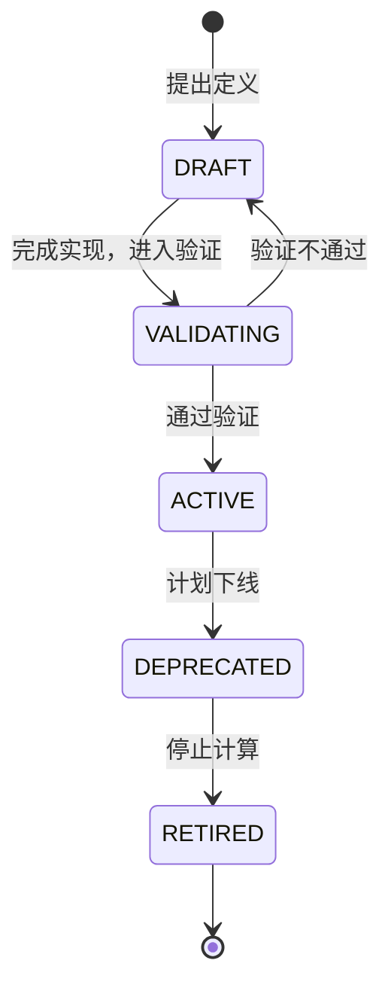

# 因子版本 · Factor Versioning

> 上游文档：docs/01-product/01-product-overview.md（v2.5）§8 版本模型｜本文细化环节：② Factor
> 本域上游：docs/04-factor/03-factor-definition.md、04-factor-calculation.md、05-factor-normalization.md（v1.0）
>
> **文档版本**：v1.1 ｜ **产品阶段**：第一阶段

---

## 1. 文档目的与边界

### 1.1 本文档回答什么

> **Factor 规则发生变化时，如何保证历史结果仍然可以重现？**

### 1.2 本文档不回答什么

| 不回答 | 归属 |
|---|---|
| 数据版本与 PIT | `03-data/04-data-versioning` |
| Scoring Version、Strategy Version 的其余八项 | `05-fund-evaluation`、`06-portfolio` |
| 代码版本（策略库、数值库） | `02-architecture/06-technology-stack` §5.4 |

---

## 2. Factor Version 与上游版本模型的对应

### 2.1 Factor Version 就是 Metric Version

> 上游 §8.2 定义的九项 Strategy Version 中，**第 1 项 `Metric Version`** 即本域的 Factor Version。

```
上游 Strategy Version（九项）
  ① Metric Version  ←────  本文档定义的 Factor Version
  ② Peer Group / Classification Version
  ③ Eligibility / Universe Version
  ④ Scoring Version
  ⑤ Return Estimate Version
  ⑥ Risk Model Version
  ⑦ Portfolio Rule Version
  ⑧ Rebalance Rule Version
  ⑨ Benchmark Version
```

**本文档不新增版本类型**，只定义 `Metric Version` 的内部结构与变更规则。

### 2.2 可复现性四要素中的位置

```
Data Version  +  Strategy Version（含 Metric Version）  +  Code Version  +  Execution Context
                            ↓
                    完全相同的 Factor 值
```

| 要素 | 本域的对应 |
|---|---|
| **Data Version** | 由 `decision_at` + PIT 规则唯一确定（`03-data/04-data-versioning`） |
| **Metric Version** | **本文档** |
| **Code Version** | Factor 计算实现、数值库版本（`02-architecture/06-technology-stack` §5.4） |
| **Execution Context** | `decision_at`、窗口、频率 |

> **Metric Version 与 Code Version 是两件事**：前者是**规则定义**（公式、参数、方向、标准化方法），后者是**实现代码**。规则不变但实现优化，Metric Version 不变、Code Version 变。

---

## 3. Factor Version 的构成

### 3.1 两个层次

| 层次 | 粒度 | 说明 |
|---|---|---|
| **Individual Factor Version** | 单个 Factor | 某个 Factor 的定义版本，如 `F-RAP-001 v1.2` |
| **Metric Version** | 整个 Factor 集合 | 全部 Factor 版本的**组合引用**，作为 Strategy Version 的第 1 项 |

### 3.2 组合引用关系

```
Metric Version 2.1
    ├── F-RET-001 v1.0
    ├── F-RET-002 v1.0
    ├── F-RISK-001 v1.1    ← 该 Factor 升级导致 Metric Version 升级
    ├── F-RAP-001 v1.0
    └── ...（26 个 Factor）
```

**规则**：

| # | 规则 |
|---|---|
| MV-1 | 任一 Factor 版本变化 → **Metric Version 升级** |
| MV-2 | Metric Version 是**不可变的版本集合快照**，不是"指向最新"的别名 |
| MV-3 | 历史决策引用具体的 Metric Version，可解析出当时每个 Factor 的版本 |

### 3.3 版本号格式

```
Factor Version：  <Major>.<Minor>
Metric Version：  <Major>.<Minor>
```

---

## 4. 触发版本变更的六类变化

> **判定标准：任何会导致相同输入产生不同输出的变化，都必须升版本。**

| # | 变化类型 | 版本级别 | 举例 |
|---|---|---|---|
| 1 | **公式变更** | **Major** | Volatility 由样本标准差改为总体标准差 |
| 2 | **参数变更** | **Major** | Rolling 窗口由 252 改为 126；VaR 置信水平由 95% 改为 99% |
| 3 | **Direction 变更** | **Major** | 某 Factor 由 `LOWER_IS_BETTER` 改为 `TARGET_RANGE` |
| 4 | **Normalization 方法变更** | **Major** | 由 Percentile Rank 改为 Z-Score |
| 5 | **边界条件处理变更** | **Major** | 除零由 `UNAVAILABLE` 改为返回 0 |
| 6 | 新增可选窗口、补充文档说明 | **Minor** | 为某 Factor 增加 6M 窗口支持 |

### 4.1 为什么 Direction 变更是 Major

> Direction 变化会使标准化后的值**符号翻转**。

```
某 Factor 由 LOWER_IS_BETTER 改为 HIGHER_IS_BETTER
    → Normalized 值从 (100 − P) 变为 P
    → 该 Factor 在评分中的贡献完全反向
    → 历史评分与新评分不可比
```

### 4.2 为什么边界条件变更是 Major

> 除零处理的改变会影响**部分基金**的可用性，进而改变整个 Peer Group 的分位分布。

```
Calmar 的 MDD=0 处理由 UNAVAILABLE 改为返回极大值
    → 这些基金从"不参与分位"变为"排名第一"
    → 整组其他基金的分位全部下移
    → 全组评分改变
```

### 4.3 `MAR` 变更不升 Factor Version ⚠️

> **v1.1 修正**：v1.0 曾把"MAR 由 0 改为 `R_f`"列为参数变更的举例。**这是错的**——`MAR` 不是 Factor 参数，而是 `Evaluation Policy` 的配置项（上游 §5.5）。

| 变更 | 升什么版本 | 归属 |
|---|---|---|
| Rolling 窗口 252 → 126 | **Factor Version** | 本域 |
| VaR 置信水平 95% → 99% | **Factor Version** | 本域 |
| **`MAR` 0 → `R_f`** | **Evaluation Policy Version** | `05-fund-evaluation` |
| `R_f` 的期限由 3M 改为 1Y | **Factor Version**（口径参数） | 本域，须与 `03-data` 协商 |

**判定依据**：

```
问：这个变更改变了"因子怎么算"，还是"我们用什么标准评价"？

改变了算法/口径  → Factor Version
改变了评价标准    → Evaluation Policy Version
```

> **为什么这个区分重要**：若把 `MAR` 变更做成 Factor Version 升级，会产生两个后果——① 评价标准的调整混入因子口径变更，治理责任方错位（本应由投研经评价政策审批，变成技术侧升因子版本）；② **同一时点存在多个 `MAR` 时无法表达**——Factor Version 是全局的，而 `MAR` 可按 `Fund Category` 差异化，一个全局版本号装不下多个并存的取值。

> `R_f` 的**取值**变化（市场变动）当然不升任何版本——那是数据更新。但 `R_f` 的**口径选择**（用哪个 tenor）是 Factor 定义的一部分，变更须升 Factor Version。

### 4.4 不触发版本变更的变化

| 变化 | 说明 |
|---|---|
| 实现优化（相同结果） | 属 Code Version |
| 性能改进 | 属 Code Version |
| 日志与监控调整 | 无关 |
| 文档措辞修正（不改语义） | 无 |

> **判定方法**：若变更后重跑历史，结果在容差内不变 → 不升 Metric Version（但可能升 Code Version）。

---

## 5. Effective Date

### 5.1 版本的生效时点

每个 Factor Version 有一个 **Effective Date**：

```
F-RISK-001 v1.0    effective from 2026-01-01
F-RISK-001 v1.1    effective from 2026-06-01
```

### 5.2 生效方式：不追溯改写

> **新版本从 Effective Date 起用于新的计算；已产出的历史 Factor 值保持不变。**

```
2026-03-15 的 Factor 值，用 v1.0 计算 → 保持 v1.0 的结果
2026-07-15 的 Factor 值，用 v1.1 计算
```

| # | 规则 |
|---|---|
| ED-1 | 版本升级**不自动重算历史** |
| ED-2 | 历史 Factor Result 记录其产出时所用的版本 |
| ED-3 | 需要用新版本重算历史时，**作为独立的重算任务**执行，结果标记为"基于 vX 重算" |

### 5.3 为什么不追溯改写

| # | 理由 |
|---|---|
| 1 | 历史决策基于当时的 Factor 值做出，改写会使决策与其依据脱节 |
| 2 | 改写后，历史评分、Universe、组合全部需要连带重算 |
| 3 | 破坏审计链——"当时看到的是什么"无法回答 |

（与 `03-data/04-data-versioning` §8.2 的 Restatement 原则一致）

### 5.4 重算的合法用途

> **重算是评估，不是改写。**

| 用途 | 说明 |
|---|---|
| 评估版本变更的影响 | 用新版本重算历史，比对差异 |
| 回测新规则 | 以新 Metric Version 重跑回测，评估策略表现变化 |
| **不得** | 用重算结果替换历史 Factor Result |

---

## 6. Historical Reproducibility

### 6.1 重现历史 Factor 值



### 6.2 重现需要的四项信息

| 项 | 来源 |
|---|---|
| **Metric Version** | Factor Result 记录（`08-factor-output`） |
| **Data Version** | 由 `decision_at` + PIT 规则确定 |
| **Code Version** | Factor Result 记录 |
| **Execution Context** | `decision_at` + 窗口 + 频率 |

> **四项缺一，历史 Factor 值即不可重现。**

### 6.3 重现的判定标准

| 对象 | 判定 |
|---|---|
| Factor 数值 | 在既定容差内一致（`04-factor-calculation` §9.3） |
| **分位与排序** | **必须完全一致** |
| `UNAVAILABLE` 标记 | 必须完全一致 |

> **排序一致性是硬判据**：数值末位差异可容忍，但若排序改变，下游的分位标准化与评分就变了。

### 6.4 不可重现的四种原因

| 原因 | 归属 |
|---|---|
| 历史数据版本被删除或覆盖 | `03-data` —— Historical Integrity 违规 |
| Metric Version 定义丢失 | 本域 —— 版本定义必须持久化 |
| Code Version 不可获取 | 工程 —— 代码版本须可追溯 |
| 计算含随机成分 | 本域 —— 违反确定性要求 |

---

## 7. Factor Version 与 Scoring Version 的关系

### 7.1 两者独立但相关

```
Metric Version   定义"Factor 是什么、怎么算"
Scoring Version  定义"用哪些 Factor、什么权重、怎么合成"
```

### 7.2 变更的传导

| 变更 | 是否影响对方 |
|---|---|
| Factor 公式变更（Metric ↑） | **不必然**导致 Scoring Version 变化——评分方案仍引用同一 Factor ID |
| 评分权重变更（Scoring ↑） | 不影响 Metric Version |
| **新增 Factor 并纳入评分** | **两者都升** |
| **某 Factor 下线** | **两者都升**——评分方案须移除该 Factor |

### 7.3 引用关系

> **Scoring Version 引用 Factor ID，不引用 Factor Version。**

```
Scoring Version 3.0
    ├── F-RET-001  权重 0.15
    ├── F-RAP-001  权重 0.25
    └── ...
```

具体使用哪个 Factor 版本，由执行时的 **Metric Version** 决定。这样：

| 好处 | 说明 |
|---|---|
| 评分方案稳定 | Factor 实现优化不需要改评分配置 |
| 版本组合清晰 | `Strategy Version = (Metric Version, Scoring Version, ...)` |

> **但这也意味着**：同一 Scoring Version 在不同 Metric Version 下会产出不同评分——因此 **Strategy Version 必须同时固定两者**（上游 §8.2）。

---

## 8. Factor Lifecycle

### 8.1 生命周期状态



### 8.2 各状态的含义

| 状态 | 含义 | 是否计算 | 是否可用于评分 |
|---|---|---|---|
| `DRAFT` | 定义中 | 否 | 否 |
| `VALIDATING` | 有效性检验中（`07-factor-validation`） | 是（仅历史回算） | 否 |
| `ACTIVE` | 生产使用 | 是 | 是 |
| `DEPRECATED` | 计划下线，仍计算 | 是 | **评分中应移除** |
| `RETIRED` | 停止计算 | 否 | 否 |

### 8.3 下线的约束

> **`RETIRED` 的 Factor，其历史值必须保留。**

| # | 约束 |
|---|---|
| RT-1 | 历史 Factor Result **不删除** —— 否则历史决策不可重建 |
| RT-2 | Factor ID **不回收** |
| RT-3 | Factor 定义（各版本）**持久保留** —— 重现历史需要它 |

---

## 9. Summary

Factor 版本管理的四个要点：

- **Factor Version 即上游九项中的 `Metric Version`** —— 本域不新增版本类型，只定义其内部结构
- **六类变化触发 Major 升级** —— 公式、参数、**Direction**、Normalization 方法、**边界条件处理**、以及新增/下线 Factor。其中 Direction 变更会使标准化值符号翻转，边界条件变更会改变整组分位分布
- **版本升级不追溯改写历史** —— 新版本从 Effective Date 起用于新计算；重算是**评估**而非改写
- **Scoring Version 引用 Factor ID 而非 Factor Version** —— 因此同一评分方案在不同 Metric Version 下会产出不同评分，Strategy Version 必须同时固定两者

> **重现历史 Factor 需要四项**：Metric Version、Data Version、Code Version、Execution Context。缺一即不可重现。其中**排序一致性是硬判据**——数值末位可容差，排序改变则评分改变。

---

## 10. Decisions

| # | 决策 | 理由 |
|---|---|---|
| D-1 | Factor Version 归入上游的 `Metric Version`，不新增版本类型 | 避免下游出现与上游九项并行的第十类版本 |
| D-2 | 任一 Factor 升级即 Metric Version 升级 | Metric Version 是版本集合快照，须唯一确定全部 Factor 的定义 |
| D-3 | Direction 变更列为 Major | 会使标准化值符号翻转，评分贡献完全反向 |
| D-4 | 边界条件处理变更列为 Major | 会改变部分基金的可用性，进而改变整组分位分布 |
| D-5 | 版本升级不追溯改写历史 Factor 值 | 改写会使历史决策与其依据脱节，破坏审计链 |
| D-6 | Scoring Version 引用 Factor ID 而非 Version | 使 Factor 实现优化不需改评分配置；版本组合由 Strategy Version 固定 |
| D-7 | `RETIRED` Factor 的历史值与定义必须保留 | 重现历史决策需要它们 |
| D-8 | 排序一致性作为重现判定的硬标准 | 下游用途是分位标准化，排序变则评分变 |

---

## 11. Constraints

| # | 约束 | 来源 |
|---|---|---|
| C-1 | Factor Version 属上游 `Metric Version`，不新增版本类型 | 上游 §8.2 |
| C-2 | 任何导致相同输入产生不同输出的变化必须升版本 | 上游 §8.2 判定标准 |
| C-3 | 版本升级不得追溯改写已产出的历史 Factor 值 | `03-data/04-data-versioning` §8.2 |
| C-4 | `RETIRED` Factor 的历史值与各版本定义不得删除 | 本文档 §8.3 |
| C-5 | Factor ID 不回收 | `02-factor-taxonomy` §3.2 ID-2 |
| C-6 | 重现判定中排序必须完全一致 | 本文档 §6.3 |

---

## 12. TBD

| # | 事项 | 影响 |
|---|---|---|
| FV-1 | Factor 定义变更的审批流程与责任方 | `13-governance` |
| FV-2 | Metric Version 的发布节奏（随时 vs 定期） | 运营 |
| FV-3 | `DEPRECATED` 到 `RETIRED` 的最短保留期 | 运营 + 治理 |

---

## 13. Related Documents

| 关系 | 文档 |
|---|---|
| **上游** | `01-product/01-product-overview.md` v2.4（§8 版本模型、原则六） |
| **本域** | `03-factor-definition`（版本化的对象）、`05-factor-normalization`（方法变更触发版本）、`08-factor-output`（Result 记录版本） |
| **关联** | `03-data/04-data-versioning`（Data Version）、`02-architecture/06-technology-stack` §5.4（Code Version）、`05-fund-evaluation`（Scoring Version） |

---

## 14. Change Log

| 版本 | 日期 | 变更内容 | 上游依赖 |
|---|---|---|---|
| v1.1 | 2026-08-25 | **修正 `MAR` 的版本归属**（上游 v2.5 §5.5）。v1.0 把"MAR 由 0 改为 `R_f`"列为 Factor 参数变更的举例，**该举例是错的**——`MAR` 属 `Evaluation Policy` 而非 Factor 参数。新增 §4.3 给出判定依据（"改变了怎么算"→ Factor Version；"改变了用什么标准评价"→ Evaluation Policy Version）及两条理由：治理责任方错位；**Factor Version 是全局的，装不下按 `Fund Category` 差异化并存的多个 MAR 取值**。同时区分 `R_f` 的取值变化（数据更新，不升版本）与口径选择变化（Factor 定义的一部分，升 Factor Version）。原 §4.3 顺移为 §4.4 | `01-product-overview.md` v2.5 §5.5 |
| v1.0 | 2026-08-25 | 初始版本。确立 Factor Version 即上游九项中的 `Metric Version`，不新增版本类型；Individual Factor Version 与 Metric Version 的组合引用关系；六类触发 Major 升级的变化（含 Direction 与边界条件处理的论证）；Effective Date 与"不追溯改写"原则；历史重现的四项必需信息与**排序一致性硬判据**；Scoring Version 引用 Factor ID 而非 Version 的设计及其推论；Factor 生命周期五状态与下线约束 | `01-product-overview.md` v2.4 §8 |