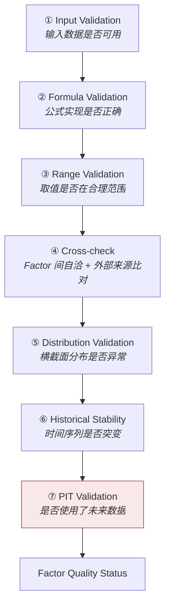

# 因子校验 · Factor Validation

> 上游文档：docs/01-product/01-product-overview.md（v2.5）｜本文细化环节：② Factor
> 业务需求：docs/01-product/02-business-requirements.md（v2.3）§14 Factor Usage Matrix、§26 Bias Control
> 本域上游：docs/04-factor/03-factor-definition.md、04-factor-calculation.md（v1.0）
>
> **文档版本**：v1.3 ｜ **产品阶段**：第一阶段

---

## 1. 文档目的与边界

### 1.1 本文档回答什么

> **如何验证 Factor 计算的正确性与有效性？**

### 1.2 两类不同的验证

> **必须区分——它们回答不同的问题、在不同阶段执行：**

| 类型 | 回答 | 时机 |
|---|---|---|
| **Correctness Validation**（正确性校验） | Factor **算对了吗**？ | 每次计算后 |
| **Effectiveness Validation**（有效性检验） | Factor **有用吗**？ | 因子上线前 + 定期复核 |

### 1.3 本文档不回答什么

| 不回答 | 归属 |
|---|---|
| 数据本身的质量 | `03-data/03-data-quality`、`06-data-validation` |
| Factor 公式 | `03-factor-definition` |
| 评分方案是否合理 | `05-fund-evaluation` |
| 告警规则与处置流程 | `12-operations` |

---

## 2. Correctness Validation：七个层级



---

## 3. Input Validation

| 检查 | 说明 | 失败处理 |
|---|---|---|
| 输入数据质量状态 | 上游 `03-data` 的 `VALID`/`WARNING`/`INVALID` | `INVALID` → Factor `INVALID` 并告警 |
| 有效观测数 | 是否达到该 Factor 的最小观测要求 | 不足 → `UNAVAILABLE` |
| 缺失比例 | 窗口内缺失占比 | 超阈值 → `WARNING` 或 `UNAVAILABLE` |
| Benchmark 可得性 | REL 类 Factor 的必需输入 | 不可得 → 整类 `UNAVAILABLE` |
| `R_f` 可得性 | `Sharpe`/`Alpha`/`Beta` 的必需输入，按 `(currency, tenor)` 解析 | 不可得 → `UNAVAILABLE`（**不得默认为 0**） |
| **`MAR` 可得性** | `Downside Volatility`/`Sortino` 的必需输入，按 `Evaluation Policy Version` 解析 | 不可得 → `UNAVAILABLE`（**不得默认为 0**） |
| **组内 `MAR` 一致性** | 依赖 `MAR` 的 Factor，同一 `Peer Group` 内须解析出同一取值 | 不一致 → 该组该 Factor `UNAVAILABLE` **并告警** |

> **输入的质量标记必须传递到 Factor 结果**：`WARNING` 数据算出的 Factor，其结果同样标 `WARNING`（`03-data/03-data-quality` §3.3）。

---

## 4. Formula Validation

### 4.1 三种验证手段

| 手段 | 说明 |
|---|---|
| **已知答案测试** | 用人工构造的数据，验证输出等于手算结果 |
| **性质验证** | 验证公式应满足的数学性质（见 §4.2） |
| **交叉实现比对** | 与独立实现（如成熟库）比对 |

### 4.2 各 Factor 应满足的性质

| Factor | 应满足的性质 |
|---|---|
| Annualized Return | 窗口 = 1 年时，年化收益 ≈ 总收益 |
| Volatility | 恒定收益序列 → σ = 0 |
| Maximum Drawdown | 单调上升序列 → MDD = 0；MDD ∈ [0, 1) |
| Sharpe | `R_p = R_f` 时 → Sharpe = 0 |
| Beta | 基金收益 = 基准收益时 → Beta = 1，Alpha = 0 |
| Tracking Error | 完全复制基准 → TE = 0 |
| R² | 完全复制基准 → R² = 1 |
| Win Rate | ∈ [0, 1] |
| Rolling X | 序列长度 = 观测数 − W + 1 |

> **性质验证的价值**：它不依赖具体数据，可作为**自动化回归测试**，在每次 Code Version 变更时执行。

### 4.3 边界条件的验证

> `03-factor-definition` §10 定义的全部除零情形，**必须有对应的测试用例**：

```
σ_p = 0        → Sharpe 应返回 UNAVAILABLE，不返回极大值
MDD = 0        → Calmar 应返回 UNAVAILABLE 并标注原因
TE = 0         → IR 应返回 UNAVAILABLE
Var(r_b) = 0   → Beta 应返回 UNAVAILABLE
```

---

## 5. Range Validation

### 5.1 取值范围检查

| Factor | 合理范围 | 超出处理 |
|---|---|---|
| Volatility | `≥ 0` | `< 0` → `INVALID`（实现错误） |
| Maximum Drawdown | `[0, 1)` | 超出 → `INVALID` |
| Win Rate | `[0, 1]` | 超出 → `INVALID` |
| R² | `[0, 1]` | 超出 → `INVALID` |
| Beta | 通常 `[-1, 3]` | 超出 → **`WARNING`**（可能真实，需核查） |
| Sharpe | 通常 `[-3, 5]` | 超出 → **`WARNING`** |
| Drawdown Duration | `≥ 0` 且 ≤ 窗口长度 | 超出 → `INVALID` |

### 5.2 结构性越界与统计性异常

> **两者的处理完全不同：**

| 类型 | 判定 | 处理 |
|---|---|---|
| **结构性越界** | 违反数学定义（如负波动率、MDD > 1） | **`INVALID`** —— 必然是实现错误 |
| **统计性异常** | 数值可能但罕见（如 Sharpe = 8） | **`WARNING`** —— 可能真实，须核查 |

> **不得把统计性异常判为 `INVALID`**。Sharpe = 8 可能来自 σ 极小（数据问题），也可能来自真实的短期优异表现——需要核查而非直接丢弃。

`<TBD-FV-1: 各 Factor 的统计性异常阈值，待投研确认>`

---

## 6. Cross-check

### 6.1 相关 Factor 间的自洽性

> **同一基金的多个 Factor 之间存在数学关系，可互相验证。**

| 关系 | 检查 |
|---|---|
| `Sharpe` 与 `R_p`、`σ_p` | `Sharpe × σ_p + R_f ≈ R_p` |
| `Sortino` 与 `σ_d` | 同理 |
| `Calmar` 与 `MDD` | `Calmar × \|MDD\| ≈ R_p` |
| `IR` 与 `TE` | `IR × TE ≈ R_p − R_b` |
| `Downside Volatility` 与 `Volatility` | `σ_d ≤ σ_p`（通常成立） |
| `Recovery Duration` 与 `Drawdown Duration` | `Recovery ≤ Drawdown Duration`（恢复期是回撤期的一部分） |
| `Excess Return` 与 `Alpha` | 两者符号通常一致（不一致须核查 Beta） |

### 6.2 Cross-check 的价值

> **它能发现单个 Factor 的 Range Validation 发现不了的问题。**

```
Sharpe = 1.2   ✓ 在合理范围
σ_p = 0.15     ✓ 在合理范围
R_p = 0.05     ✓ 在合理范围

但 1.2 × 0.15 + 0.022 = 0.202 ≠ 0.05
    → 三者不自洽，必有一处计算错误
```

### 6.3 不自洽的处理

| 情形 | 处理 |
|---|---|
| 偏差在数值容差内 | 通过 |
| 偏差超出容差 | **相关的全部 Factor 标 `INVALID`** —— 无法确定哪一个错 |
| `σ_d > σ_p` | `WARNING` —— 数学上可能（极端分布），但罕见 |

### 6.4 Cross-source Validation

> **与外部来源的同名指标比对**——第三方数据商、基金公司公告中通常也公布 Sharpe、Beta、最大回撤等。

| 用途 | 说明 |
|---|---|
| 上线前的公式验证 | 新 Factor 首次实现时，与外部值比对可快速发现口径错误 |
| 定期抽样核对 | 抽样比对，发现系统性偏差 |

**必须注意的三点：**

| # | 注意 |
|---|---|
| 1 | **外部值口径通常与平台不同** —— 年化因子、无风险利率、复权方式、Benchmark 选择都可能不一致，**差异不等于错误** |
| 2 | **不得以外部值为准修正平台值** —— 平台的口径是显式声明并版本化的，外部值的口径往往不透明 |
| 3 | **差异应记录并解释**，而非静默忽略或直接对齐 |

> **Cross-source Validation 的产出是"差异分析"，不是"对错判定"**。它用于发现"我们和别人算得不一样"，然后追问"为什么不一样"——若能归因到已知的口径差异，则平台值正确。

`<TBD-FV-7: 外部比对来源与抽样比例，待数据确认>`

---

## 7. Distribution Validation

### 7.1 横截面分布检查

> **在 Peer Group 内检查 Factor 值的分布是否异常。**

| 检查 | 说明 | 异常信号 |
|---|---|---|
| **覆盖率** | 有多少基金的该 Factor 可用 | 覆盖率骤降 → 数据或计算问题 |
| **分布形态** | 均值、中位数、分位数 | 与历史分布显著偏移 |
| **极值占比** | 超出常规范围的基金占比 | 骤增 → 系统性问题 |
| **`UNAVAILABLE` 占比** | 不可用的基金占比 | 骤增 → 上游数据问题 |

### 7.2 覆盖率骤降的意义

```
昨日 F-RAP-001 覆盖 1,150 / 1,240 只基金
今日 F-RAP-001 覆盖   680 / 1,240 只基金

→ 极可能是 R_f 数据缺失或净值批次不全
→ 而非 470 只基金一夜之间失去计算条件
```

**这是最有效的系统性问题探测器**——它能发现单基金层面校验发现不了的批量问题。

`<TBD-FV-2: 覆盖率与分布偏移的告警阈值，待数据与运维确认>`

### 7.3 分布检查的限制

> **分布异常不等于计算错误**——市场剧烈波动时，波动率分布整体上移是真实的。

因此分布检查的输出是 **`WARNING` 与告警**，而非 `INVALID`。

---

## 8. Historical Stability

### 8.1 时间序列突变检查

> **同一基金的同一 Factor，在相邻计算日之间不应出现无法解释的突变。**

| 检查 | 说明 |
|---|---|
| 相邻日变化幅度 | 长窗口 Factor（3Y/5Y）单日不应大幅变化 |
| 与窗口长度的一致性 | 窗口越长，单日变化应越小 |
| `UNAVAILABLE` 的突然出现/消失 | 须有对应原因（数据缺失、观测数变化） |

### 8.2 长窗口 Factor 的稳定性推论

```
3Y Volatility 的窗口有约 756 个观测
单日新增 1 个、移除 1 个观测
    → 波动率的单日变化应在极小范围内

若某日 3Y Volatility 从 12% 跳至 20%
    → 几乎必然是数据问题（如净值修订、缺口填补）
```

### 8.3 突变的合法原因

| 原因 | 说明 |
|---|---|
| **数据修订** | 上游 NAV 修订产生新 version（`03-data/04-data-versioning` §8） |
| **窗口跨越极端事件** | 窗口滚动使某个极端日进入或离开 |
| **Metric Version 变更** | 公式或参数改变 |

> 突变检查的输出应**关联可能原因**，而非仅报告"发生突变"。

---

## 9. PIT Validation

### 9.1 核心检查

> **验证 Factor 计算未使用未来数据。**

| 检查 | 说明 |
|---|---|
| 输入的 `available_at` | 全部输入满足 `available_at ≤ decision_at` |
| **Benchmark Mapping 的时点** | 是否使用了当时生效的映射（转型场景） |
| Peer Group 的时点 | 标准化所用的组构成是否为当时的 |
| 版本选择正确性 | 是否取了合格版本中 `version` 最大者 |

### 9.2 为什么 PIT Validation 失败必须阻断

| # | 理由 |
|---|---|
| 1 | 前视偏差**在结果中不可见** —— Factor 值看起来完全正常 |
| 2 | 污染会**经 Peer Group 分位扩散至全组** —— 一只基金的前视 Factor 会改变其他基金的分位 |
| 3 | 一旦进入历史 Factor Result，后续全部依赖它的评分、Universe、决策都被污染 |

（`03-data/06-data-validation` §8.3）

### 9.3 回测中的特殊检查

回测每期计算 Factor 后，应验证：

```
该期使用的全部数据的 available_at ≤ 该期 decision_at
```

这是回测有效性的基础检查（`08-backtest` 将依赖此项）。

---

## 10. Effectiveness Validation：因子有效性检验

### 10.1 与 ML 无关的澄清

> **因子有效性检验衡量的是"因子值与未来收益之间的统计关系"，这是因子研究的固有内容，与系统是否使用 ML 无关。**

```
✅ 保留：IC / ICIR / 分层单调性 / 因子稳定性 / 因子间相关性
❌ 不实现：基于 ML 的收益预测
```

（上游 §6.2.1 第一阶段专项排除：ML / AI、§9 原则十）

### 10.2 五项检验

| 检验 | 衡量 | 说明 |
|---|---|---|
| **IC**（Information Coefficient） | 因子值与未来收益的截面相关性 | 单期相关系数 |
| **ICIR** | IC 的均值 / 标准差 | 衡量 IC 的**稳定性** |
| **分层单调性** | 按因子值分组后各组收益是否单调 | 检验因子的区分能力 |
| **因子稳定性** | 因子值自身的时序稳定性 | 不稳定的因子会导致高换手 |
| **因子间相关性** | 与既有因子的相关程度 | 高相关 = 无增量信息 |

### 10.3 检验的 PIT 要求

> **有效性检验同样必须满足 PIT。**

```
IC 检验：在 T 时点的因子值 vs T 之后的收益
    → 因子值必须是 T 时点可得的（available_at ≤ T）
    → 未来收益是 T 之后的真实收益
```

若因子值本身带前视偏差，IC 会被系统性高估——**这正是"因子看起来很有效但实盘失效"的常见原因**。

### 10.3.1 检验结果如何进入固定权重流程

> **定案 · 2026-09-08**：第一版权重固定为 `PROFILE_FIXED_V1`。有效性检验只决定指标是否具备评分资格，不生成或拟合权重。

```
本域产出                          下游消费
─────────────────────────────────────────────
IC / ICIR / 分层单调性     →     Factor Effectiveness 判定（valid / invalid）
因子稳定性                 →     同上
因子间相关性               →     Factor Redundancy 剔除
                                        ↓
                     取得 PROFILE_FIXED_V1 配置权重
                                        ↓
                     缺失/排除项按规则重归一 → Fund Score
```

**本域的职责边界**：

| 本域**负责** | 本域**不负责** |
|---|---|
| 产出 OOS Rank IC、ICIR、分层单调性和 Spearman 冗余检查结果 | Profile 固定权重的定义与计算（属 `05-fund-evaluation`） |
| 保证检验满足 PIT（§10.3） | 权重的计算方式（属 `05-fund-evaluation`） |
| 提供 IS/OOS 划分后的资格结论 | 根据资格结论执行排除和权重重归一 |

> **检验结果的存在性是下游 Score 产出的前置条件** —— `05-fund-evaluation/02` §8.4.2 规定检验未产出时 Score 不投产。因此本域的检验产出**不是可选的补充分析**，而是评分链路的必经环节。

**IS/OOS 划分是硬要求**：

```
❌ 在全历史上做一次检验就判定评分资格
    → 资格结论被拟合到历史上
    → 上线后有效性容易衰减

✅ 划分 IS / OOS，OOS 决定评分资格；权重始终来自 PROFILE_FIXED_V1
```

> **推荐默认 · 2026-08-27**：因子有效性的入选下限 —— **IC 均值 ≥ 0.02** 且 **|ICIR| ≥ 0.3**。检验区间 = 全历史滚动 + 最近 3 年**双段均须通过**。业务方可改。
>
> **依据**：0.02 / 0.3 是行业常用的因子筛选下界。**但本平台的因子作用于基金而非股票，两者的 IC 量级不同** —— 基金层因子的横截面区分度通常弱于股票层，本值可能偏严。
>
> **双段检验的理由**：只看全历史会让早已失效的因子凭历史表现留存；只看最近 3 年则样本量不足且易受单一市场环境影响。**两段都过才说明因子既长期有效、又未在近期失效。**
>
> ⚠️ **本项列入首次实证后必须复核的三项之一**（`TBD-resolution-2.md` §6.3）：阈值过松则无效因子入选并稀释权重；**过严则可能一个因子都不剩，Score 无法产出**。
> **推荐默认 · 2026-08-27**：因子间**相关系数 > 0.8** 视为冗余，保留 **|ICIR| 较高者**。业务方可改。
>
> **为什么保留 ICIR 较高者而非 IC 较高者**：IC 衡量单期区分度，ICIR 衡量该区分度的**稳定性**。两个高度相关的因子提供近乎相同的信息，此时该保留的是「更可靠地提供这个信息」的那个。
>
> ⚠️ **本项同样列入首次实证后必须复核**：**基金因子之间的相关性普遍高于股票因子**（同一批净值序列衍生出的指标天然相关，如 Sharpe 与 Sortino），0.8 可能剔除过多。若实证后有效因子数不足，应先放松本阈值而非放松 `OPEN-11`。

### 10.4 M1 验收与后续上线治理

M1.2–M1.4 必须完成因子层 OOS 验证。组合层改善验证保留为后续上线治理，不阻塞本期评价闭环：

| 关 | 检验 | 不通过的处理 |
|---|---|---|
| **因子层** | IC / ICIR / 分层单调性 / 稳定性 / 相关性 | 退回优化或放弃 |
| **组合层（后续）** | 纳入评分后，对最终组合是否有改善 | 作为后续发布门禁，不属于本期验收 |

> **只在因子层有效但对组合无改善的因子不予上线** —— 避免因子库无节制膨胀。

> **推荐默认 · 2026-08-27**：**同 `OPEN-11`** —— IC ≥ 0.02、|ICIR| ≥ 0.3，检验区间 = 全历史滚动 + 最近 3 年双段。
>
> **两处是同一决策，不重复定义** —— 本域产出检验数值，阈值取自 `validation_policy`（第 10 类 Policy Version 的子项之一），配置来源唯一。

---

## 11. Factor Quality Status

### 11.1 四种状态

| 状态 | 含义 | 是否可被消费 |
|---|---|---|
| **`VALID`** | 全部校验通过 | ✅ |
| **`WARNING`** | 存在可疑但可用 | ✅ **可用**，须携带标记 |
| **`INVALID`** | 校验失败，值不可信 | ❌ |
| **`UNAVAILABLE`** | **无法计算**（输入不足、除零等） | ❌ |

### 11.2 `INVALID` 与 `UNAVAILABLE` 的区别

> **两者都不可消费，但含义完全不同：**

| | `INVALID` | `UNAVAILABLE` |
|---|---|---|
| 含义 | **算了，但算错了** | **没法算** |
| 典型原因 | 结构性越界、Cross-check 不自洽、PIT 失败 | 观测不足、除零、Benchmark 缺失 |
| 是否需要修复 | **是** —— 通常是实现或数据问题 | **否** —— 是正常的业务情形 |
| 是否告警 | **是** | 仅在占比骤增时告警 |

> **混淆两者的后果**：把成立不足 3 年的基金的 3Y Sharpe 标为 `INVALID`，会产生大量无意义告警，掩盖真正的问题。

### 11.3 状态的传递

```
输入数据 WARNING  →  Factor WARNING
输入数据 INVALID   →  Factor INVALID（传播异常并告警）
Factor 自身校验失败 →  Factor INVALID
```

---

## 12. Summary

因子校验分两类，**回答不同的问题**：

- **Correctness Validation（七层）** —— Input → Formula → Range → Cross-check → Distribution → Historical Stability → **PIT**。其中 PIT 失败必须阻断（前视偏差不可见且经分位扩散全组）
- **Effectiveness Validation** —— IC / ICIR / 分层单调性 / 稳定性 / 相关性。**这与 ML 无关**，是因子研究的固有内容

三个容易被忽略的要点：

- **Cross-check 能发现 Range Validation 发现不了的问题** —— 三个 Factor 各自在合理范围，但彼此不自洽时必有一处错
- **覆盖率骤降是最有效的系统性问题探测器** —— 它能发现单基金校验发现不了的批量问题
- **`INVALID`（算错了）与 `UNAVAILABLE`（没法算）必须区分** —— 混淆会产生大量无意义告警，掩盖真问题

---

## 13. Decisions

| # | 决策 | 理由 |
|---|---|---|
| D-1 | 区分 Correctness 与 Effectiveness 两类验证 | 回答不同问题、执行时机不同 |
| D-2 | 结构性越界判 `INVALID`，统计性异常判 `WARNING` | Sharpe = 8 可能真实，直接丢弃会损失信息 |
| D-3 | Cross-check 不自洽时相关 Factor 全部 `INVALID` | 无法确定哪一个错 |
| D-3b | **Cross-source 差异不得以外部值为准修正平台值** | 外部口径不透明，平台口径显式声明且版本化 |
| D-4 | 分布异常输出 `WARNING` 而非 `INVALID` | 市场剧烈波动时分布整体偏移是真实的 |
| D-5 | 突变检查须关联可能原因 | 仅报"发生突变"无法定位 |
| D-6 | PIT 校验失败必须阻断 | 前视偏差不可见且经 Peer Group 分位扩散全组 |
| D-7 | **`INVALID` 与 `UNAVAILABLE` 严格区分** | 前者需修复并告警，后者是正常业务情形 |
| D-8 | 输入 `INVALID` 时 Factor 传播为 `INVALID` | 数据不变量已被违反，必须保留异常语义并告警 |
| D-9 | 性质验证作为自动化回归测试 | 不依赖具体数据，可在每次 Code Version 变更时执行 |

---

## 14. Constraints

| # | 约束 | 来源 |
|---|---|---|
| C-1 | PIT 校验失败必须阻断该 Factor 的产出 | 上游 §4.2 ①-PIT |
| C-2 | 有效性检验必须满足 PIT，否则 IC 被系统性高估 | 本文档 §10.3 |
| C-3 | 因子有效性检验**不属于 ML**，第一阶段保留 | 上游 §6.2.1、§9 原则十 |
| C-4 | 新因子须通过因子层与组合层两道验证 | 本文档 §10.4（待上游登记） |
| C-5 | `R_f` 与 `MAR` 不可得时均不得默认为 0 | `03-factor-definition` §2.1、§2.2 |
| C-8 | 依赖 `MAR` 的 Factor 须校验组内 `MAR` 一致 | 上游 §5.5.3 |
| C-6 | 质量标记必须从输入传递到 Factor 结果 | `03-data/03-data-quality` §3.3 |
| C-7 | `03-factor-definition` §10 的全部除零情形必须有测试用例 | 本文档 §4.3 |

---

## 15. TBD

| # | 事项 | 影响 | 责任方 |
|---|---|---|---|
| FV-1 | 各 Factor 的统计性异常阈值 | Range Validation | 投研 |
| FV-2 | 覆盖率与分布偏移的告警阈值 | Distribution Validation、`12-operations` | 数据 + 运维 |
| FV-3 | IC / ICIR 的最低标准与检验区间 | 新因子上线门槛 | 投研 |
| FV-4 | Cross-check 的数值容差 | 自洽性判定 | 技术（关联 FC-2） |
| FV-5 | 因子间相关性的上限阈值（超过则视为无增量信息） | 新因子上线门槛 | 投研 |
| FV-6 | **「因子层 + 组合层两道验证」的因子上线流程尚未在上游登记** | 新因子准入治理 | 需回 `02-business-requirements` 登记 |
| FV-7 | 外部比对来源与抽样比例 | Cross-source Validation | 数据 |

---

## 16. Related Documents

| 关系 | 文档 |
|---|---|
| **上游** | `01-product/01-product-overview.md` v2.4（§6.2.1 ML/AI 排除、§9 原则十）、`02-business-requirements.md` v2.3（§14 Factor Usage Matrix、§26 Bias Control） |
| **本域** | `03-factor-definition`（边界条件与性质）、`04-factor-calculation`（确定性）、`05-factor-normalization`（分布检查的样本集）、`08-factor-output`（Status 输出） |
| **数据依赖** | `03-data/03-data-quality`（输入质量传递）、`03-data/06-data-validation`（PIT 校验机制） |
| **下游** | `05-fund-evaluation`（消费带 Status 的 Factor）、`12-operations`（校验告警） |

---

## 17. Change Log

| 版本 | 日期 | 变更内容 | 上游依赖 |
|---|---|---|---|
| **v1.3** | 2026-09-08 | OOS 只决定评分资格，权重固定为 `PROFILE_FIXED_V1`；输入 `INVALID` 传播为 `INVALID`；组合层验证延后 | Plan-2 设计 v1.1 |
| **v1.2** | 2026-08-27 | **Policy ⑥ 衔接**。新增 §10.3.1 —— 明确五项检验结果如何进入权重流程，并划清本域职责边界（产出检验数值与 PIT 保证 vs 不负责阈值取值与权重计算）；强调**检验结果的存在性是下游 Score 产出的前置条件**，以及 IS/OOS 划分是硬要求（全历史一次检验定权重等于把权重拟合到历史上）。详见 `TBD-resolution.md` Policy ⑥ | `02-business-requirements` v2.7 §5.2.1.1、`05-fund-evaluation/02` |
| v1.1 | 2026-08-25 | Input Validation 补充 **`MAR` 可得性**与**组内 `MAR` 一致性**两项检查（上游 v2.5 §5.5）；明确 `R_f` 按 `(currency, tenor)` 解析、`MAR` 按 `Evaluation Policy Version` 解析。<br/>**同时修正一处沿用自初版的事实错误**：`F-REL-004` Information Ratio 的公式为 `(R_p − R_b) / TE`，**并不依赖 `R_f`**，此前多处将其列为无风险利率消费方；`R_f` 的直接消费方是 `F-RAP-001` Sharpe、`F-REL-002` Alpha、`F-REL-003` Beta，`F-RAP-002` Sortino 仅在 `MAR = R_f` 时间接依赖 | `01-product-overview.md` v2.5 §5.5 |
| v1.0 | 2026-08-25 | 初始版本。**区分 Correctness 与 Effectiveness 两类验证**；七层正确性校验体系；结构性越界与统计性异常的不同处理；**Cross-check 的自洽性检查**及其相对 Range Validation 的独特价值；覆盖率骤降作为系统性问题探测器；长窗口 Factor 的稳定性推论；PIT 校验失败必须阻断的三条理由；有效性检验的 PIT 要求与"因子有效但实盘失效"的成因；**`INVALID` 与 `UNAVAILABLE` 的严格区分** | `02-business-requirements.md` v2.3、`03-factor-definition.md` v1.0 |