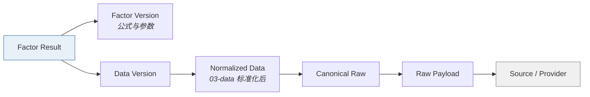

# 因子输出 · Factor Output

> 上游文档：docs/01-product/01-product-overview.md（v2.5）｜本文细化环节：② Factor
> 业务需求：docs/01-product/02-business-requirements.md（v2.3）§14 Factor Usage Matrix
> 本域上游：docs/04-factor/05-factor-normalization.md、06-factor-versioning.md、07-factor-validation.md（v1.0）
>
> **文档版本**：v1.4 ｜ **产品阶段**：第一阶段

---

## 1. 文档目的与边界

### 1.1 本文档回答什么

> **Factor 计算完成后，以什么标准形式提供给下游？**

本文档是 `04-factor` 域的**出口契约**——定义 Factor 交付给 ⑤ Fund Score、⑥ Fund Universe 与⑧ Backtest 时的完整结构与约束。Portfolio 与 `07-return-risk` 不消费 Factor。

### 1.2 本文档不回答什么

| 不回答 | 归属 |
|---|---|
| Factor 如何计算 | `04-factor-calculation` |
| 如何标准化 | `05-factor-normalization` |
| 如何评分 | `05-fund-evaluation` |
| 存储结构与表设计 | `10-development` |

---

## 2. Factor Result：最小完整结构

### 2.1 九个必备字段

| 字段 | 说明 | 缺失的后果 |
|---|---|---|
| **Fund ID** | 基金标识（Share Class 粒度） | 无法定位对象 |
| **Factor ID** | 因子标识（如 `F-RAP-001`） | 无法确定语义 |
| **Factor Version** | 该因子的版本 | **无法解释值的含义**（公式可能已变） |
| **Window** | 计算窗口（`1Y`/`3Y`/`5Y`） | **窗口不进 Factor ID**，必须独立字段 |
| **As Of Date** | 因子对应的业务日期 | 无法做时点对齐 |
| **Raw Value** | 原始值（带单位与量纲） | 无法解释、无法核对 |
| **`normalized_value`** | 标准化值，范围 `[0,100]`（无量纲、方向已统一） | 无法参与评分 |
| **Status** | `VALID`/`WARNING`/`INVALID`/`UNAVAILABLE` | **无法判断是否可用** |
| **Data Version** | 输入数据的版本 | **无法复现** |

> 所有字段均须存在；不可用数值使用 `null`，并同时返回 `status` 与 `reason_code`。另需记录 **Calculation Time**（计算发生的物理时刻），用于运维排查——它**不是**业务时点，不得用于 PIT 判定。

除九个核心字段外，结果闭包还必须记录 `reason_code`、输入质量摘要、Benchmark Mapping/Definition/Index Value 版本、`adjustment_policy_version`，并按依赖关系记录 `risk_free_rate_ref`、`evaluation_policy_version`、Metric/Normalization/Validation Policy Version。快照应引用这些不可变结果及版本，不复制一份无法校验来源的裸值。

### 2.5 条件必备字段：Threshold Context

> **依赖外部阈值的 Factor，必须额外记录所用阈值的来源标识。**（上游 §5.5.2）

| 字段 | 适用 Factor | 说明 |
|---|---|---|
| **`risk_free_rate_ref`** | `F-RAP-001` Sharpe、`F-REL-002` Alpha、`F-REL-003` Beta | 所用 `R_f` 的 `(currency, tenor, effective_at, version)` |
| **`evaluation_policy_version`** | **`F-RISK-002`、`F-RAP-002`** 及其 Rolling 变体 | 所用 `MAR` 所属的评价政策版本 |

#### 2.5.1 为什么 MAR 类 Factor 的键不再唯一

```
R_f 是市场数据 → 全平台唯一
    (Fund, F-RAP-001, 1Y, 2026-06-30) → 唯一 Sharpe 值
    risk_free_rate_ref 用于解释与复现，不参与标识

MAR 是评价配置 → 随 Evaluation Policy 不同
    (Fund, F-RAP-002, 1Y, 2026-06-30) → 可能有多个 Sortino 值
    evaluation_policy_version 是标识的一部分
```

> **两者的字段性质不同**：`risk_free_rate_ref` 是**溯源信息**（同一键只有一个值，记录它是为了解释）；`evaluation_policy_version` 是**标识的组成部分**（同一键可以有多个值，不记录就无法区分）。把两者当作同一类字段处理会导致 Sortino 的多个版本互相覆盖。

#### 2.5.2 对下游的影响

| 下游 | 影响 |
|---|---|
| **⑤ Fund Score** | 评分必须声明所用的 `Evaluation Policy Version`；同一 Peer Group 内须一致（上游 §5.5.3） |
| **⑧ Backtest** | 回测除指定 `Factor Version` 外，还须指定 `Evaluation Policy Version`，否则 Sortino 类因子不可复现 |
| **Factor Snapshot** | 快照须包含 `evaluation_policy_version`（§5.2） |

### 2.2 为什么不能只有 Value

```
❌ 错误的最小结构
fund_id + factor_value

问题：
  · 这是哪个因子？1Y 还是 3Y？
  · 用的是哪版公式？
  · 这个值可信吗？还是校验失败的残值？
  · 原始值还是标准化值？两者混用会直接算错分
  · 用的哪版净值？修订前还是修订后？
```

**没有 Version + Status + Data Version 的 Factor Result 是不可用的**——它无法被解释、无法被复现、无法被信任。

### 2.3 Raw 与 Normalized 必须同时输出

| 值 | 用途 |
|---|---|
| **Raw Value** | 展示、人工核对、跨系统比对、Hard Filter |
| **`normalized_value`** | 评分、Ranking 与 Tier；范围 `[0,100]` |

> **两个字段都必须存在**：只有 Normalized 则用户看不懂（"87.0"是什么意思）；只有 Raw 则下游各自标准化，破坏一致性。Active/Hybrid 的 Tracking Error 因方向依赖其他指标，其 `normalized_value` 为 `null`，评分层另产出 `interaction_value`。

### 2.4 Normalized Value 的伴随信息

Normalized Value 不能脱离其**标准化上下文**被解释：

| 伴随信息 | 说明 |
|---|---|
| **Peer Group ID** | 在哪个组内标准化 |
| **Peer Group Version** | 该组当时的构成 |
| **Normalization Method** | 使用的标准化方法 |

> 同一 Raw Value 在不同 Peer Group 中会得到完全不同的 Normalized Value。缺少组标识时，Normalized Value **无法跨基金比较**。

---

## 3. Factor Result Status

### 3.1 四态

| 状态 | 含义 | 下游可消费 |
|---|---|---|
| **`VALID`** | 全部校验通过 | ✅ |
| **`WARNING`** | 可疑但可用 | ✅ 须携带标记 |
| **`INVALID`** | 算了但算错了 | ❌ |
| **`UNAVAILABLE`** | 没法算（观测不足、除零、Benchmark 缺失） | ❌ |

（定义见 `07-factor-validation` §11）

### 3.2 Status 的下游语义

> **`INVALID` 与 `UNAVAILABLE` 在下游的处理不同：**

| 状态 | 评分处理 | 用户展示 |
|---|---|---|
| `UNAVAILABLE` | 按缺失处理（子分不可得或降权，见 `05-fund-evaluation`） | API 返回 `null + status + reason_code`；前端可渲染为“—”并说明原因 |
| `INVALID` | 同样按缺失处理，**但须触发告警** | 显示"数据异常"，**不得静默当作缺失** |

> **区别的意义**：`UNAVAILABLE` 是正常业务情形，用户能理解；`INVALID` 是系统问题，静默处理会让错误长期潜伏。

### 3.3 禁止用哨兵值代替 Status

```
❌ 禁止：value = -9999 表示不可用
❌ 禁止：value = 0 表示不可用
❌ 禁止：value = null 且无 Status
❌ 禁止：API 用 "-" 或 "—" 代替 null
```

> 哨兵值会**参与排序与统计**——`-9999` 会让基金排到最后，`0` 会污染 Peer Group 的均值与分位。Status 必须是独立字段。

---

## 4. Factor Output：面向三类下游

### 4.1 消费方与需求差异

| 下游 | 消费什么 | 特殊要求 |
|---|---|---|
| **⑤ Fund Score** | Normalized Value | 需 Peer Group 上下文；需处理 `UNAVAILABLE` |
| **⑥ Fund Universe** | Raw Value（筛选阈值多基于原始量纲） | 阈值须与 Raw 单位一致 |
| **⑧ Backtest** | 历史 PIT Factor | 必须能按 Factor Version + As Of Date 取历史值 |

### 4.2 筛选与优化必须用 Raw

> **常见错误**：用 Normalized Value 做筛选阈值。

```
❌ "筛选 Normalized Volatility < 0.3 的基金"
   → 这是相对于同组的位置，组变了含义就变了
   → 熊市中"组内相对低波"可能仍是绝对高波

✅ "筛选 Volatility < 15% 的基金"
   → 绝对标准，含义稳定
```

Portfolio 和 `07-return-risk` 直接从 PIT 收益序列计算波动率与协方差，不消费 Raw 或 Normalized Factor。

> **已定案 · 2026-08-27**：**Hard Filter 一律使用 Raw Value；Ranking 与 Tier 使用 Normalized。**
>
> **依据 —— 两者回答的问题不同**：
>
> | 用途 | 用哪个 | 为什么 |
> |---|---|---|
> | **Hard Filter**（准入筛选） | **Raw** | 筛选条件是**绝对门槛**（「规模 > 2 亿」「成立满 3 年」）。分位值无法表达绝对含义 —— 「规模分位 > 50%」在小盘基金池中可能只对应 5000 万 |
> | **Ranking / Tier** | **Normalized** | 相对比较，必须放在同一标尺上 |
>
> **一个必须避免的组合**：用分位做 Hard Filter。那会使**筛选门槛随池子构成浮动** —— 池子整体规模下降时，「分位 > 50%」对应的绝对规模随之下降，筛选实际上被自动放松了，而没有任何人做过这个决定。

### 4.3 Portfolio 与 Return/Risk 的独立边界

```
✅ 两条独立链路
Fund Data → Factor → Fund Evaluation → Fund Universe
Fund Data → Return/Risk → Portfolio

❌ 禁止
Portfolio 或 Return/Risk 读取 Factor 作为风险估计输入
```

| # | 理由 |
|---|---|
| 1 | Factor 描述历史特征，Return/Risk 估计未来持有期风险，两者语义不同 |
| 2 | Score 变化不得通过 Factor 间接改变 Return Estimate |
| 3 | 两条链路仅在报告层对照，各自保留版本与快照 |

> Portfolio 消费 Universe、Return Estimate 与 Risk Estimate，不消费 Factor；资产间协方差矩阵明确归属 `07-return-risk`，不是 Factor。

---

## 5. Factor Snapshot

### 5.1 为什么需要快照

> 历史决策必须能被解释——"当时为什么选了这只基金"要求当时的 Factor 值可被还原。

### 5.2 快照内容

| 字段 | 说明 |
|---|---|
| Decision Date | 决策日期 |
| Fund ID | 基金 |
| Factor ID + Window | 因子与窗口 |
| Factor Version | 当时的因子版本 |
| Raw Value / Normalized Value | 当时的值 |
| Status | 当时的状态 |
| Peer Group ID + Version | 当时的标准化上下文 |
| Data Version | 当时的数据版本 |
| **Evaluation Policy Version** | **依赖 `MAR` 的 Factor 必需**（§2.5） |
| **Risk-free Rate Ref** | 依赖 `R_f` 的 Factor 必需 |

### 5.3 快照 vs 重算

> **两种还原历史的方式，第一阶段采用快照：**

| 方式 | 优点 | 缺点 |
|---|---|---|
| **保存快照** | 无条件可还原；不依赖历史数据完整性 | 存储成本 |
| **按 PIT 重算** | 存储省 | 依赖历史数据与代码完全可还原；数据修订后可能算不出当时的值 |

**决策：保存快照**。理由——重算路径存在一个无法绕过的问题：若上游数据发生 Restatement 且旧版本已归档，重算将得到**与当时不同的值**，而决策审计要求的是"当时看到的值"。

### 5.4 快照与决策快照的关系

> Factor Snapshot 是**上游快照**，Decision Snapshot **引用**它而非复制内容（`02-architecture/01-system-architecture` §10 一致性边界 B3）。

```
Decision Snapshot
    ├─ 引用 → Factor Snapshot ID
    ├─ 引用 → Score Snapshot ID
    └─ 记录 → Strategy Version（含 Metric Version）
```

---

## 6. Look-ahead Bias

### 6.1 定义

> **在时点 T 的计算中使用了 T 之后才可得的信息。**

```
❌ 前视
历史日期 T → 使用当前数据 → Factor

✅ 正确
决策日期 T → 使用 available_at ≤ T 的数据 → Factor
```

### 6.2 因子计算中的四个隐蔽来源

| # | 来源 | 说明 |
|---|---|---|
| 1 | **使用修订后的净值** | T 时点看到的是修订前版本；用修订后版本即为前视（`03-data/04-data-versioning` §8） |
| 2 | **使用当前的 Benchmark Mapping** | 基金转型后映射变了，用新映射重算历史 Alpha 是前视 |
| 3 | **使用当前的 Peer Group** | 分类调整后的组构成不是 T 时点的组构成 |
| 4 | **使用当前的 Factor Version** | 公式已升级；用新公式解释历史决策是**版本前视** |

> 第 2/3/4 项常被忽略——它们不涉及"未来的数据"，但涉及"未来的定义"，同样构成前视。

### 6.3 Backtest 必须能指定 Factor Version

```
❌ Backtest → 当前 Factor
✅ Backtest → 指定 Factor Version 的历史 PIT Factor
```

> 回测若使用当前因子版本，测的是"用今天的公式在历史上会怎样"，**不是"当时的策略会怎样"**。两者都有意义，但必须被区分并明确声明（`08-backtest` 将细化）。

---

## 7. Survivorship Bias

### 7.1 定义

> **只用今天还存在的基金构造历史样本**，导致历史表现被系统性高估。

```
❌ 当前基金列表 → 历史 Factor
✅ 历史 Eligible Universe（含当时存在、后已清盘的基金）→ Factor
```

### 7.2 三个具体影响

| # | 影响 |
|---|---|
| 1 | **历史平均收益被高估** —— 清盘基金通常是表现差的 |
| 2 | **Peer Group 分位失真** —— 缺少低分成员，幸存者的分位被系统性压低 |
| 3 | **回测结果被系统性美化** —— 这是回测"看起来很好、实盘不行"的经典成因之一 |

> **第 2 项影响 Factor 域本身**：标准化在 Peer Group 内进行，若历史 Peer Group 用当前成员构造，全部 Normalized Value 都被污染。

### 7.3 前提要求

生存偏差的消除依赖：

| 要求 | 归属 |
|---|---|
| 保留已清盘基金的历史数据 | `03-data/02-data-domain-model`（Fund Status 生命周期） |
| Peer Group 的历史构成可还原 | `05-fund-evaluation` |
| Universe 的历史构成可还原 | `06-portfolio` |

> **已定案 · 2026-08-27**：已清盘基金的历史数据**永久保留**（`TBD-resolution-2.md` Policy C · L1 层）。
>
> **依据 —— 这是保留期限问题中唯一涉及方法论正确性的一项**：删除即制造**幸存者偏差**。回测在历史某期需要看到当时存在的全部基金，包括后来清盘的那些。数据一旦删除，该期的回测就永久失去了正确性，且**无法察觉** —— 回测仍会正常运行，只是结果偏乐观。
>
> **这一项不接受成本权衡** —— 其余保留期限项（Policy C 的 L2~L4）可按存储成本调整，本项不可。
>
> **合规要求只会更长不会更短**（`NFR-9`），两者取长。

---

## 8. Factor Data Lineage

### 8.1 追溯链



### 8.2 两条独立的追溯维度

| 维度 | 回答 | 依赖 |
|---|---|---|
| **配置维度** | 这个 Factor 是按什么配置算出来的？ | Factor Version → Factor Configuration |
| **数据维度** | 这个 Factor 用了哪一版数据？ | Data Version → Lineage 链 |

> **两者缺一不可**。只有配置无法解释数据修订导致的差异；只有数据无法解释公式升级导致的差异。

### 8.3 与 `03-data/07-data-lineage` 的衔接

| 域 | 血缘范围 |
|---|---|
| `03-data` | Source → Raw Payload → Canonical Raw → Normalized Data |
| `04-factor` | Normalized Data → Factor Result |
| `05`+ | Factor Result → Score → Universe → Decision |

Factor 域的血缘**接在数据域血缘之上**，形成端到端可追溯链。

### 8.4 Lineage ≠ Audit

> 沿用 `03-data/07-data-lineage` §8 的区分：Lineage 回答"数据从哪来"，Decision Audit 回答"决策由谁、基于什么做出"。Factor Result 的血缘是 Decision Audit 的上半段，**不替代**它。

---

## 9. Factor 参数管理

### 9.1 参数不得散落在代码中

需集中管理并可追溯的参数：

| 参数 | 示例 |
|---|---|
| Window | 1Y / 3Y / 5Y |
| Frequency | 日频 / 周频 |
| Annualization Factor | 252（P0 已定案） |
| Confidence Level | VaR/CVaR 的 95% |
| Benchmark | 由 Benchmark Selection 规则确定 |
| Minimum Observations | 各 Factor 的最小观测要求 |
| Normalization Method | 标准化方法与参数 |
| Risk-free Rate 口径 | 期限、来源、频率对齐方式 |

### 9.2 参数变更即 Factor Version 变更

> 参数不是"配置项"而是**因子定义的一部分**。变更参数必然改变因子含义，因此触发 Major 版本升级（`06-factor-versioning` §4）。

```
Factor Result → Factor Version → Factor Configuration
```

---

## 10. 计算示例

> **示例用于说明计算过程，不是生产参数。**

以 `F-RAP-001` Sharpe Ratio（1Y，日频）为例：

```
① Fund NAV 序列（PIT：available_at ≤ decision_at 的最大 version）
    ↓ 后复权处理（BACKWARD；携带 adjustment_policy_version）
② 日收益序列 r_t
       ↓ 窗口截取（近 1Y，检查最小观测数）
③ 12M 收益序列
       ↓
④ 年化收益 R_p = f(r_t, 252)
   年化波动 σ_p = std(r_t) × √252
       ↓ 取同期 R_f（不可得则 UNAVAILABLE，不得默认 0）
⑤ Sharpe = (R_p − R_f) / σ_p        ← 若 σ_p = 0 则 UNAVAILABLE
       ↓ Peer Group 内标准化
⑥ Normalized Sharpe
```

每一步的中间结果都受 §8 的血缘约束。

---

## 11. Summary

Factor Result 的**九个必备字段**中，最容易被省略也最关键的是 **Factor Version、Status、Data Version**——缺少任何一个，Factor 就无法被解释、信任或复现。

四条硬约束：

- **Raw 与 Normalized 必须同时输出**，且 **Normalized 必须携带 Peer Group 上下文**——否则无法跨基金比较
- **Hard Filter 使用 Raw，Ranking/Tier 使用 Normalized** —— 两者分别表达绝对门槛与组内相对位置
- **Portfolio 与 Return/Risk 不消费 Factor** —— 它们直接消费 PIT 收益序列，保持估计链与评分链独立
- **历史决策保存 Factor Snapshot 而非按 PIT 重算** —— 数据 Restatement 后重算得到的是"今天的值"，不是"当时看到的值"

两类偏差的隐蔽形式：

- **Look-ahead Bias 不只来自"未来的数据"，也来自"未来的定义"** —— 当前的 Benchmark Mapping、Peer Group、Factor Version 用于历史同样构成前视
- **Survivorship Bias 会污染 Factor 域本身** —— 历史 Peer Group 若用当前成员构造，全部 Normalized Value 失真

---

## 12. Decisions

| # | 决策 | 理由 |
|---|---|---|
| D-1 | Factor Result 九个必备字段 | 缺 Version/Status/Data Version 则不可解释、不可复现 |
| D-2 | Window 作为独立字段而非并入 Factor ID | 与 `02-factor-taxonomy` §5 的 ID 规范一致 |
| D-3 | Raw 与 Normalized 同时输出 | 只有 Normalized 用户看不懂；只有 Raw 则下游各自标准化 |
| D-4 | Normalized Value 必须携带 Peer Group ID + Version | 同一 Raw 在不同组得到不同 Normalized |
| D-5 | **禁止哨兵值代替 Status** | 哨兵值会参与排序与统计，污染分位 |
| D-6 | Hard Filter 使用 Raw Value；Ranking/Tier 使用 Normalized Value | 绝对门槛与组内相对位置不可混用 |
| D-7 | **Portfolio 与 Return/Risk 不消费 Factor** | 保证风险估计链与评分链独立演进 |
| D-8 | **历史决策保存 Factor Snapshot** | 重算路径在数据 Restatement 后无法还原当时的值 |
| D-9 | Decision Snapshot 引用 Factor Snapshot ID 而非复制内容 | 一致性边界 B3 |
| D-10 | `INVALID` 须告警，`UNAVAILABLE` 不须 | 前者是系统问题，静默处理会让错误长期潜伏 |
| D-11 | 参数变更即触发 Factor Major 版本升级 | 参数是因子定义的一部分 |
| D-12 | Calculation Time 仅用于运维，不用于 PIT 判定 | 它是物理时刻，不是业务时点 |
| D-13 | **依赖 `MAR` 的 Factor 其 `evaluation_policy_version` 是标识的一部分，依赖 `R_f` 的 `risk_free_rate_ref` 只是溯源信息** | MAR 使同一键可对应多个值，R_f 不会 |

---

## 13. Constraints

| # | 约束 | 来源 |
|---|---|---|
| C-1 | Factor Result 必须携带 Factor Version 与 Data Version | 上游 §9 原则六（全链路可复现）、原则七（决策可追溯） |
| C-2 | 回测必须能指定 Factor Version 并使用历史 PIT Factor | 上游 §4.2 ⑧、本文档 §6.3 |
| C-3 | Factor 计算必须基于 Historical Eligible Universe | 本文档 §7 |
| C-4 | Portfolio 与 Return/Risk 不依赖 Factor；直接消费 PIT 收益序列 | `02-architecture/02-service-architecture` §6.8 |
| C-5 | Factor Result 血缘须接入 `03-data/07-data-lineage` | 本文档 §8.3 |
| C-6 | `INVALID`/`UNAVAILABLE` 的 Factor 不得进入评分与优化 | `07-factor-validation` §11 |
| C-8 | 依赖 `MAR` 的 Factor Result 必须携带 `Evaluation Policy Version` | 上游 §5.5.2 |
| C-9 | 依赖 `R_f` 的 Factor Result 必须携带所用 `R_f` 的版本引用 | `04-factor-calculation` §3.4 TR-2 |
| **C-11** | 基于净值的 Factor Result 必须携带 `adjustment_policy_version` —— 规则变更不追溯改写，同一序列可能跨越多版规则 | `03-data/05-data-normalization` §5.3.1、`01-factor-overview` §10.1 |
| C-10 | 回测须同时指定 `Factor Version` 与 `Evaluation Policy Version` | 本文档 §2.5.2 |
| C-7 | 复权口径以 `03-data` 的统一声明为准 —— **已定案为后复权（`BACKWARD`）+ 原始净值双轨**；Factor 一律用 `adjusted_nav`，其为 `UNAVAILABLE` 时因子亦 `UNAVAILABLE` | `03-data/05-data-normalization` §5.3.1、§5.3.2 |

---

## 14. TBD

| # | 事项 | 影响 | 责任方 |
|---|---|---|---|
| ~~FO-1~~ | ~~各筛选条件使用 Raw 还是 Normalized，逐条确认~~ —— **已定案**：Hard Filter 一律使用 Raw Value；Ranking 与 Tier 使用 Normalized | — | ✅ 2026-08-27 |
| ~~FO-2~~ | ~~已清盘基金的历史数据保留范围与年限~~ —— **已定案**：见 Policy C 保留期限体系 | — | ✅ 2026-08-27 |
| FO-3 | Factor Snapshot 的保留期限与归档策略 | 存储成本与审计要求 | 合规 + 技术 |
| FO-4 | Peer Group 历史构成的还原机制 | 历史标准化的可还原性 | `05-fund-evaluation` |
| ~~FO-5~~ | ~~复权方向~~ —— 后复权（`BACKWARD`）+ 原始净值双轨 | — | ✅ 2026-08-27 |

---

## 15. Related Documents

| 关系 | 文档 |
|---|---|
| **上游** | `01-product/01-product-overview.md` v2.4（§9 原则一/六/七/八、§4.2 ②/⑧）、`02-business-requirements.md` v2.3（§14 Factor Usage Matrix、§26 Bias Control） |
| **本域** | `05-factor-normalization`（Raw/Normalized 分离）、`06-factor-versioning`（Factor Version）、`07-factor-validation`（Status 定义） |
| **架构** | `02-architecture/01-system-architecture.md` v2.0（§10 快照闭包与一致性边界） |
| **数据** | `03-data/04-data-versioning`（Data Version、Restatement）、`03-data/07-data-lineage`（血缘衔接） |
| **下游** | `05-fund-evaluation`、Fund Universe、`08-backtest` |

---

## 16. Change Log

| 版本 | 日期 | 变更内容 | 上游依赖 |
|---|---|---|---|
| **v1.4** | 2026-09-08 | 固定 `normalized_value ∈ [0,100]`、`null + status + reason_code`、版本闭包及 Portfolio/Return-Risk 独立边界 | Plan-2 设计 v1.1 |
| **v1.3** | 2026-08-27 | **第二批定案（2 项）**。`FO-1` **Hard Filter 用 Raw、Ranking/Tier 用 Normalized** —— 用分位做筛选会让门槛随池子构成浮动，形成无人决定的自动放松；`FO-2` 已清盘基金历史数据**永久保留**，该项**不接受成本权衡**（删除即制造无法察觉的幸存者偏差）。 详见 `TBD-resolution-2.md` | `TBD-resolution-2.md` v1.0 |
| **v1.2** | 2026-08-27 | **`TBD-DN-3` 关闭后的同步**。C-7 由「按后复权假设推进、定案后复核」改为**已定案**；新增 C-11 —— 基于净值的 Factor Result 须携带 `adjustment_policy_version`。详见 `TBD-resolution.md` Policy ③ | `03-data/05-data-normalization` v1.2、`01-factor-overview` v1.2 |
| v1.1 | 2026-08-25 | **新增 §2.5 条件必备字段 Threshold Context**（上游 v2.5 §5.5.2）。依赖 `R_f` 的 Factor 须记录 `risk_free_rate_ref`，依赖 `MAR` 的须记录 `evaluation_policy_version`；**§2.5.1 指出两者性质不同**——前者是溯源信息（同一键唯一值），后者是**标识的组成部分**（同一键可多值），混为一类会导致 Sortino 的多个版本互相覆盖；§2.5.2 下游影响：**回测须同时指定 Factor Version 与 Evaluation Policy Version**。Factor Snapshot 与 Constraints 同步。<br/>**同时修正一处沿用自初版的事实错误**：`F-REL-004` Information Ratio 的公式为 `(R_p − R_b) / TE`，**并不依赖 `R_f`**，此前多处将其列为无风险利率消费方；`R_f` 的直接消费方是 `F-RAP-001` Sharpe、`F-REL-002` Alpha、`F-REL-003` Beta，`F-RAP-002` Sortino 仅在 `MAR = R_f` 时间接依赖 | `01-product-overview.md` v2.5 §5.5、`03-factor-definition.md` v1.1 |
| v1.0 | 2026-08-25 | 初始版本。定义 Factor Result **九个必备字段**（Window 独立成字段）；Raw 与 Normalized 必须同时输出及 **Normalized 的 Peer Group 伴随信息**；**禁止哨兵值代替 Status**；四类下游的消费差异与"筛选/优化必须用 Raw"；**Portfolio 不得重算 Factor** 的三条理由；**Factor Snapshot 优于按 PIT 重算**的论证（Restatement 后重算得到的是今天的值）；Look-ahead Bias 的四个隐蔽来源（含"未来的定义"）；**Survivorship Bias 对 Peer Group 分位的污染**；两条独立追溯维度与 `03-data/07-data-lineage` 的衔接 | `01-product-overview.md` v2.4、`02-architecture/01-system-architecture.md` v2.0 |