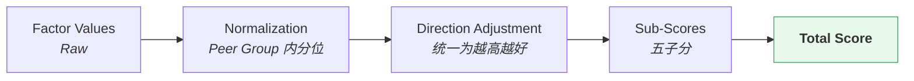

# 基金评分 · Fund Scoring

> 上游文档：docs/01-product/01-product-overview.md（v2.5）｜本文细化环节：**③ Fund Score**
> 业务需求：docs/01-product/02-business-requirements.md（v2.3）§15 Fund Scoring
> 本域上游：docs/05-fund-evaluation/01-fund-evaluation.md（v1.0）
>
> **文档版本**：v1.4 ｜ **产品阶段**：第一阶段

---

## 1. 文档目的与边界

### 1.1 本文档回答什么

> **如何把评价指标转换为标准化的基金综合得分？**

### 1.2 本文档不回答什么

| 不回答 | 归属 |
|---|---|
| Factor 如何计算与标准化 | `04-factor` |
| 评价框架、Peer Group、Evaluation Policy | `01-fund-evaluation` |
| 排名与分位 | `03-fund-ranking` |
| 分层 | `04-fund-classification` |
| 候选池筛选 | `05-fund-selection` |

---

## 2. Overview



### 2.1 Normalization 与 Direction 由 `04-factor` 完成

> **重要**：标准化与方向转换**已在 `04-factor/05-factor-normalization` 完成**，本域消费的是**已标准化、已统一方向**的值。

| 环节 | 归属 |
|---|---|
| Peer Group 内分位标准化 | **`04-factor/05-factor-normalization`** |
| Preference Direction 转换 | **同上**（方向转换在标准化层完成） |
| 子分聚合与总分合成 | **本文档** |

本文档 §5、§6 描述这两个环节，是为了说明**评分对它们的要求**，不是重新定义。

---

## 3. Scoring Objective

| # | 目的 |
|---|---|
| 1 | **标准化异质因子** —— 收益率（%）、Sharpe（比率）、回撤（%）量纲不同，无法直接相加 |
| 2 | **使不同因子可比** —— 转为同一标尺 |
| 3 | **聚合多个评价维度** —— 五子分合成总分 |
| 4 | **提供客观的数值表示** —— 支持排序与分层 |

### 3.1 评分必须满足的六项

> 沿用 `02-business-requirements` §15.1：**可解释、可重复、可配置、可回测、可比较、可追溯**。

### 3.2 评分不能是什么

> **严禁：`收益率排名 = 基金评分`**（`02-business-requirements` §15.2）

单一维度的排名不是评分。评分必须覆盖收益、风险、风险调整、稳定性、相对表现五个维度。

### 3.3 Score 不是收益估计，也不是权重

> 上游 §4.2 ③ 的边界条款：

| 误用 | 后果 |
|---|---|
| 把 Score 作为收益估计输入优化器 | **严禁**——Score 是无量纲相对量，`μ` 是有量纲绝对量（上游 §5.2） |
| 把 Score 直接映射为持仓权重 | 权重由 `Portfolio Optimization` 求解 |
| 跨 Peer Group 比较 Score | **默认不可比**——股票型 80 分与债券型 80 分不是同一件事 |

---

## 4. Score Structure

### 4.1 五个子分（命名固定）

> **沿用上游 §4.2 ③-S，命名不得更改。**

```
Total Score
 ├── Return Score                 收益表现
 ├── Risk Score                   风险水平
 ├── Risk-Adjusted Score          风险调整后收益
 ├── Stability Score              表现稳定性
 └── Relative Performance Score   相对 Benchmark 表现
```

### 4.2 每个子分必须能回答六个问题

> **无法回答任一问题的评分方案不得上线**（`02-business-requirements` §15.3）。

| # | 问题 |
|---|---|
| 1 | 使用了哪些指标 |
| 2 | 各自权重 |
| 3 | 如何标准化 |
| 4 | `Preference Direction` 是什么 |
| 5 | 缺失数据如何处理 |
| 6 | 如何汇总 |

### 4.3 子分与 Factor 类别的对应

| 子分 | Factor 类别 |
|---|---|
| Return Score | `RET` |
| Risk Score | `RISK`（含 Drawdown） |
| Risk-Adjusted Score | `RAP` |
| Stability Score | `STAB` |
| Relative Performance Score | `REL` |

> **费率**不是计算得出的 Factor，但参与评分。按 `02-business-requirements` §14.3 读表规则 4，其 `Preference Direction` 为 `LOWER_IS_BETTER`。其归入哪个子分待定。

> **已定案 · 2026-08-27**：费率归入 **Risk-Adjusted 子分**，**不独立成项**。
>
> **依据**：①**五子分命名已由上游固定，不可增删**（上游 §4.2 ③-S：`Return / Risk / Risk-Adjusted / Stability / Relative Performance`）—— 「独立成项」意味着改上游已定案的结构；②费率直接侵蚀风险调整后的净收益，归入该子分语义自洽。
>
> **一个需要注意的连带效应**：被动型基金的费率是高权重项（上游 §5.2.1 反直觉之处②），这会使 Passive Equity 的 Risk-Adjusted 子分实际上由费率主导。**这是符合预期的** —— 跟踪同一指数的 ETF 其长期业绩差异主要就来自费率。

---

## 5. Score Scale

### 5.1 标尺

```
0 – 100
100 = Best
  0 = Worst
```

沿用 `02-business-requirements` §15.4 的示例表述：

```
某基金 3Y Sharpe 在 Peer Group 内位于前 10%  →  Sharpe Score = 90 / 100
```

### 5.2 分数的含义是相对位置

> **`Fund Score` 是相对量，不是绝对评级。**

```
80 分 ≠ "这只基金很好"
80 分 =  "在这个 Peer Group 内，它排在约前 20%"
```

因此：

| 推论 | 说明 |
|---|---|
| 跨 Peer Group 不可比 | 弱组的 80 分与强组的 80 分含义不同 |
| **必须与组内绝对水平同屏展示** | 否则读者无法判断"80 分在这一组意味着什么"（沿用 `02-business-requirements` §16.3.1 对 Tier 的强制要求） |

---

## 6. Factor Direction

### 6.1 四种方向（沿用上游枚举）

> **上游 §11.2 定义四取值，本域不得增删。**

| 方向 | 含义 | 示例 |
|---|---|---|
| `HIGHER_IS_BETTER` | 越高越好 | 年化收益率、Sharpe、Alpha |
| `LOWER_IS_BETTER` | 越低越好 | Volatility、Maximum Drawdown、费率 |
| **`TARGET_RANGE`** | 接近目标区间越好 | **Beta** |
| **`STRATEGY_DEPENDENT`** | 随 `Evaluation Profile` 而定 | **Tracking Error** |

> **注意**：上游没有 `TARGET_IS_BETTER` 这一取值。非单调方向拆为 `TARGET_RANGE`（有明确目标区间）与 `STRATEGY_DEPENDENT`（方向本身随画像变化）两类——两者的处理方式不同，合并会丢失区分。

### 6.2 方向必须由 Policy 声明，不得从字段名推断

> **严禁通过字段名称自动推断方向。**

```
❌ "名字里有 Risk / Volatility / Drawdown → 越低越好"

反例：Tracking Error 对主动型是中性、对被动型才是越低越好
反例：Beta 既非越高也非越低，而是接近目标区间
```

方向由 `Evaluation Policy` 的 `preference_directions` 显式声明（`01-fund-evaluation` §17.1）。

### 6.3 两个非单调方向的处理

| Factor | 方向 | 处理 |
|---|---|---|
| **Beta** | `TARGET_RANGE` | 转换为**偏离目标区间的程度**再取分位；目标区间未定义时 `UNAVAILABLE`，**不得默认按越低越好** |
| **Tracking Error** | `STRATEGY_DEPENDENT` | Passive Equity 越低越好；Bond 越低越好且年化 1.5% 为硬上限；Active/Hybrid 分别由 TE × IR、TE × Sharpe 复合算子处理 |

（`04-factor/05-factor-normalization` §6.2、`02-business-requirements` §5.2.1）

Beta 目标区间已定案：Active Equity `[0.85,1.15]`、Passive Equity `[0.98,1.02]`、
Bond 与 Hybrid `[0.90,1.10]`。Bond Beta 是相对中债综合全价指数的回归 Beta；股票 Beta 与
Duration Tilt 后续作为独立 Factor 引入。

---

## 7. Normalization

### 7.1 第一阶段方法已定案

> **Percentile Rank / Peer Group 内排名**（`02-business-requirements` §15.4，已定案）。

**理由是可解释性**：

```
✅ 分位排名："该基金 3Y Sharpe 在同类中位于前 10%"     ← 可直接用自然语言表述
❌ Z-Score  ："该基金 3Y Sharpe 的 Z 值为 1.28"        ← 无法向用户解释
```

> **这不是 TBD。** 提示词将 Normalization Method 列为待定，但上游已定案为 Percentile Rank，本域沿用。未来若引入 Z-Score 或 Min-Max，属 Scoring Version 的 Major 变更。

### 7.2 三条强制规则

| # | 规则 |
|---|---|
| 1 | **标准化必须在 `Peer Group` 内进行**，且 Peer Group 独立于 Score 产生 |
| 2 | 必须按各 Factor 声明的 `Preference Direction` 转换，使**分数越高一律代表越优秀** |
| 3 | `TARGET_RANGE` 与 `STRATEGY_DEPENDENT` 的转换规则必须由 `Evaluation Profile` 显式定义，**不得套用单调方向** |

### 7.3 Percentile Rank 的一个有利性质

> **它对极值不敏感** —— 一只基金的 Sharpe 是 5 还是 50，分位都是"第 1 名"。

因此第一阶段**默认不做异常值处理**（`04-factor/05-factor-normalization`）。若未来改用 Z-Score，异常值处理将成为必需项——这是方法选择的连带后果，不可分开决策。

### 7.4 `UNAVAILABLE` 不参与分位计算

```
Peer Group 有 N 只基金
其中 M 只的 3Y Sharpe 为 UNAVAILABLE（成立不足 3 年）
    → 分位在剩余 (N − M) 只中计算
    → 那 M 只的 3Y Sharpe 标准化值同样为 UNAVAILABLE
```

**不得**把 `UNAVAILABLE` 当作最差值参与排名。

---

## 8. Weight

### 8.1 合成公式

```
Weighted Contribution_i  =  Normalized Score_i  ×  Weight_i

Sub-Score_k              =  Σ  Weighted Contribution_i        （i ∈ 子分 k 的因子集合）

Total Score              =  Σ  Sub-Score_k × Weight_k          （k = 五个子分）
```

### 8.2 两层权重

> **权重有两层，必须分别配置：**

| 层 | 内容 |
|---|---|
| **因子层** | 子分内部各 Factor 的相对权重 |
| **子分层** | 五个子分在总分中的相对权重 |

### 8.3 权重归一化约定

```
Σ Weight = TBD
```

> **本参数当前为 TBD，投产前必须由业务负责人确认。** 需确认使用 `Σ Weight = 1` 还是 `Σ Weight = 100`，且两层必须采用同一约定。

> **已定案 · 2026-08-27**：权重归一化约定 **`Σ = 1`**（小数），不用 `Σ = 100`。
>
> **依据**：与 `10-api/01-api-overview` §12.1「百分比统一用小数」一致。**同一份 API 响应内不能有两种量纲** —— 权重用 100 制而收益率用小数制，会让调用方在每个字段上都要确认一次量纲。
>
> **展示层可乘 100 呈现为百分比**，但那是渲染，不是存储与传输的约定。

### 8.4 权重发布顺序

> **这是上游已定的正确定序**（`02-business-requirements` §5.2.1）：

```
先有验证数据（IC / ICIR / 分层单调性）
        ↓
再定权重
```

权重已由 2026-09-08 投研确认，但仍须在 OOS 有效性检验通过后才允许发布正式 Score。
定案权重不构成绕过检验的理由。

```
Factor Weight     = PROFILE_FIXED          ← 见 §8.5
Missing Handling = EXCLUDE_AND_RENORMALIZE
```

#### 8.4.1 第一版：Profile 固定权重（已定案）

| # | 规则 |
|---|---|
| 1 | 每个 Profile 的发布权重之和为 1 |
| 2 | 未通过有效性检验的指标权重为 0，但必须在归因链留痕 |
| 3 | 个别指标 `UNAVAILABLE` 时对其余有效指标按原比例重归一 |
| 4 | 有效加权指标少于 2 或 `Data Completeness < 0.8` 时总分 `UNAVAILABLE` |
| 5 | 权重来源落库为 `PROFILE_FIXED_V1` |

#### 8.4.2 检验未产出时 Score 不可投产 ⚠️

> **这是本节最容易被绕过的一条。**

```
❌ 「先按等权上线，等检验出来再调」
   → 与「未经检验就拍权重」完全等价
   → 差别只是拍的值恰好是等权

✅ 检验未产出 → Score 状态 NOT_AVAILABLE，不产出总分
```

| 情形 | 处置 |
|---|---|
| 有效性检验已产出 | 按 §8.4.1 计算 |
| **检验尚未产出** | **该 Profile 的 Score 不产出**，`score_status = VALIDATION_PENDING` |
| 某子分内全部因子 `invalid` | 该子分 `UNAVAILABLE`，总分按剩余子分处理 |
| 有效因子数低于阈值 | 该子分标 `INSUFFICIENT_FACTORS`（§9.3） |

> `factor_effectiveness` 的存在性是 Score 产出的前置条件，不是可选的补充信息。
> 固定权重只定义通过检验后的聚合方式，不赋予未经检验的指标评分资格。

> **推荐默认 · 2026-08-27**：见 `04-factor/07-factor-validation` §10 与 `TBD-resolution-2.md` §4.4 —— IC ≥ 0.02、|ICIR| ≥ 0.3。
>
> **本域是消费方不是定义方**：阈值属 `validation_policy`，由 `04-factor` 产出检验数值、由该 Policy 判定 `VALID` / `INVALID`，本域只按判定结果分配权重（§8.4.1）。

### 8.5 Profile 固定权重（已定案 · 2026-09-08）

| 指标 | Active Equity | Passive Equity | Bond | Hybrid |
|---|---:|---:|---:|---:|
| Alpha | 0.30 | 0 | 0 | 0.20 |
| Information Ratio | 0.30 | 0 | 0 | 0.15 |
| Tracking Error | 0.05 | 0.40 | 0.10 | 0.15 |
| Beta | 0.10 | 0.30 | 0.35 | 0.15 |
| Maximum Drawdown | 0.15 | 0.05 | 0.35 | 0.25 |
| Expense Ratio | 0.10 | 0.25 | 0.20 | 0.10 |
| R² | DISPLAY | DISPLAY | DISPLAY | DISPLAY |

每列精确等于 1。Expense Ratio 是 PIT Fund Data，归入 Risk-Adjusted 子分但不注册为
Factor；R² 仅展示。五子分作为归因分组继续保留，v1 总分直接按上表指标权重汇总；权重为 0
或未列出的指标不进入总分，但仍可展示、筛选和用于研究。

### 8.6 Tracking Error 复合算子

Active Equity 与 Hybrid 的 TE 不使用独立 `normalized_value` 参与加权。评分层按下列规则产出
`interaction_value ∈ [0,100]`，并以它替代 TE 加权输入：

| Profile | 条件 | 复合量与方向 |
|---|---|---|
| Active Equity | `IR > 0.5` | `sqrt(TE × IR)`，Peer Group 内越高越好 |
| Active Equity | `IR <= 0` | `sqrt(TE)`，Peer Group 内越低越好 |
| Active Equity | `0 < IR <= 0.5` | 中性值 50，不奖励也不惩罚主动偏离 |
| Hybrid | `Sharpe > 1.0` | `sqrt(TE × Sharpe)`，Peer Group 内越高越好 |
| Hybrid | `Sharpe <= 1.0` | `sqrt(TE)`，Peer Group 内越低越好 |

Passive Equity 直接使用 TE 的反向分位；Bond 同样越低越好，但年化 TE 超过 1.5% 时其 TE
评分直接为 0。复合结果只占用 TE 的配置权重，IR/Sharpe 仍按原配置权重参与，且不得再叠加
独立 TE 贡献。

---

## 9. Missing Factor

### 9.1 必须区分 `0` 与 `NOT_AVAILABLE`

> **这是评分环节最容易犯、后果最严重的错误。**

```
Factor Value = 0        →  该指标算出来就是 0（如 Alpha = 0，正常结果）
Factor = UNAVAILABLE    →  该指标算不出来（成立不足、除零、Benchmark 缺失）
```

把后者当作前者，等于宣称"数据不足 = 表现最差"。

### 9.2 处理策略（上游已定案）

> 沿用 `02-business-requirements` §15.5：

| 处理方式 | 是否允许 | 对应策略名 |
|---|---|---|
| 该指标不参与评分，**权重按比例重分配**给同组其他可用指标 | ✅ **推荐** | `EXCLUDE_AND_RENORMALIZE` |
| 该子分标记 `UNAVAILABLE`，总分标注 `Data Completeness` | ✅ 允许 | `PARTIAL_SCORE` |
| 用同类均值 / 中位数填充 | ❌ **严禁** | —— |
| 按 0 分参与评分 | ❌ **严禁** | —— |

> **这不是 TBD** —— 上游已定案推荐 `EXCLUDE_AND_RENORMALIZE`。待定的只是**触发降级的阈值**。

### 9.3 权重重分配的边界

> **重分配不能无限进行。** 若某子分内可用指标过少，重分配会使剩余指标的权重被极端放大。

```
Risk Score 原有 5 个指标，权重各 20%
其中 4 个 UNAVAILABLE
    → 剩余 1 个指标承担 100% 权重
    → 该子分实质上退化为单指标评分
```

**处理**：可用指标数低于阈值时，该子分标记 `UNAVAILABLE` 而非继续重分配。

> **已定案 · 2026-08-27**：子分内有效指标数 **< 2** 时该子分 `UNAVAILABLE`，**不做权重重分配**。
>
> **依据**：**单一指标构成的子分等于该指标本身** —— 「Risk-Adjusted 子分」若只剩 Sharpe 一项，它就不再是一个聚合度量，而是被重命名的 Sharpe。此时把它当作与其它子分同级的量参与总分加权，会给该指标一个远超其应得的权重。
>
> **为什么不重分配**：重分配会把缺失指标的权重转给同子分内的其余指标（`§10.4`），但当只剩一个指标时，重分配的结果就是该指标独占子分全部权重 —— 这正是上一段要避免的情形。
>
> **阈值取 2 而非更高**：两个指标已构成最小的「聚合」，且提高阈值会让数据不全的基金大面积失去子分。

### 9.4 `Data Completeness` 必须随评分呈现

> **基于 3 个指标的 85 分与基于 12 个指标的 85 分，可信度完全不同**（上游术语表）。

```
data_completeness = 可用指标数 / 应有指标数
```

它是**输出的必备字段**，不是可选的附加信息。

---

## 10. Score Explainability

### 10.1 必须能回答的问题

> **Why did this fund receive this score?**

### 10.2 归因链

> 上游 §4.2 ③-S 的关键约束：**任一得分都能拆解到子分、再拆解到具体因子的贡献**。

```
Total Score
    ↓  拆解
五个 Sub-Score + 各自权重
    ↓  拆解
各 Factor 的 normalized_value × Weight = Weighted Contribution
    ↓  拆解
Factor Raw Value + Direction + Peer Group 内分位
```

### 10.3 每个因子必须保留的六项

| 字段 | 说明 |
|---|---|
| `factor_id` + `window` | 哪个因子、哪个窗口 |
| **`raw_value`** | 原始值（带量纲），用于人工核对 |
| **`normalized_value`** | 单因子标准化值，范围 `[0,100]`；TE 复合项改用 `interaction_value` |
| **`direction`** | 该因子在本 Profile 下的方向 |
| **`weight`** | 权重 |
| **`weighted_contribution`** | `normalized_value × weight`；TE 复合项为 `interaction_value × weight` |

> **`raw_value` 不可省略** —— 只有标准化值时用户看不懂"0.83 分"从何而来（`04-factor/08-factor-output` §2.3）。

### 10.4 `UNAVAILABLE` 的因子同样要留痕

> 被排除的因子必须记录**为什么被排除**，而非从归因中消失。

```
Sortino Ratio : UNAVAILABLE
  原因        : MAR 未配置
  原权重      : X%
  重分配至    : Sharpe（+X%）、Calmar（+X%）
```

否则用户无法解释"为什么 Sharpe 的贡献比配置的权重高"。

---

## 11. Scoring Policy

### 11.1 结构

| 字段 | 说明 |
|---|---|
| `policy_id` | 标识 |
| `version` | 版本号（即 `Scoring Version`） |
| `effective_from` / `effective_to` | 生效区间 |
| `status` | `DRAFT` / `ACTIVE` / `DEPRECATED` / `RETIRED` |
| **`evaluation_profile`** | 适用画像 |
| **`factor_set`** | 各子分的因子集合 |
| **`factor_directions`** | 各因子方向（含 `TARGET_RANGE` 的区间） |
| **`normalization_method`** | 第一阶段固定为 Percentile Rank |
| **`factor_weights`** | 因子层权重 |
| **`sub_score_weights`** | 子分层权重 |
| **`missing_factor_policy`** | 缺失处理策略与降级阈值 |
| `score_scale` | 0–100 |

### 11.2 Scoring Version 是 Strategy Version 的第 4 项

> 沿用 `02-architecture/01-system-architecture` §8.2：

```
Strategy Version 第 4 项 = Scoring Version
    = 指标集合 + 权重 + 标准化 + Preference Direction + 缺失处理
```

本域**不新增版本类型**。

### 11.3 Scoring Policy 与 Evaluation Policy 的边界

| | `Evaluation Policy` | `Scoring Policy` |
|---|---|---|
| 回答 | **评什么、评得了吗** | **怎么合成分数** |
| 内容 | 周期、准入、最低数据、MAR、`R_f` 口径 | 因子集合、权重、标准化、缺失处理 |
| 归属 | `01-fund-evaluation` §17 | 本文档 |

> 两者都由本域拥有，但**必须独立版本化**——评价范围的调整与评分权重的调整是两类不同的变更，混在一起会使治理粒度过粗。

---

## 12. Score Versioning

### 12.1 Policy 变更不覆盖历史

```
Policy V1 产出的历史评分  →  保持不变
Policy V2 产出的新评分    →  以新版本号记录

同一基金同一时点可以同时存在 V1 与 V2 的评分，互不覆盖
```

### 12.2 Score 结果必须携带的版本引用

| 版本 | 用途 |
|---|---|
| `scoring_policy_version` | 用什么规则合成 |
| `evaluation_policy_version` | 用什么标准评价（含 MAR） |
| `factor_version`（Metric Version） | 因子口径 |
| **`peer_group_version`** | 标准化上下文 |
| `data_version` | 数据版本 |

> **缺 `peer_group_version` 则分数不可复现** —— 组构成变了，分位就变了（`01-fund-evaluation` §18.2）。

### 12.3 哪些变更触发 Major

| 变更 | 级别 |
|---|---|
| 因子集合增删 | **Major** |
| 权重调整 | **Major** |
| 标准化方法变更 | **Major** |
| Preference Direction 变更 | **Major** |
| 缺失处理策略变更 | **Major** |
| 补充文档说明、新增可选展示字段 | Minor |

> **权重调整为什么是 Major**：它改变全部基金的相对排序，历史评分与新评分不可比。

### 12.4 `MAR` 变更升 Evaluation Policy Version，不升 Scoring Version

> 沿用 `04-factor/06-factor-versioning` §4.3。`MAR` 影响的是 `Sortino` 的**因子值本身**，发生在评分之前。

---

## 13. Input / Process / Output

### 13.1 Input

| 输入 | 来源 |
|---|---|
| Evaluation Output（含标准化后的 Factor 值与 Status） | `01-fund-evaluation` §13 |
| `Peer Group` + version | `01-fund-evaluation` |
| `Scoring Policy` + version | 本文档 |
| `Evaluation Profile` | `01-fund-evaluation` |

### 13.2 Process

```
① 按 Evaluation Profile 取 Scoring Policy
② 逐因子取 Normalized Score（已由 04-factor 完成标准化与方向转换）
③ 剔除 UNAVAILABLE / INVALID 的因子，记录排除原因
④ 按 Missing Factor Policy 重分配权重（或标记子分 UNAVAILABLE）
⑤ 逐子分加权求和 → Sub-Score
⑥ 五子分加权求和 → Total Score
⑦ 计算 Data Completeness
⑧ 落归因明细
```

### 13.3 Output

| 字段 | 说明 |
|---|---|
| `fund_id` / `evaluation_period` / `as_of_date` | 标识 |
| **`total_score`** | 0–100 |
| **五个 `sub_score`** | 各自 0–100，命名固定 |
| **归因明细** | 逐因子六项（§10.3） |
| **`data_completeness`** | 可信度 |
| `score_status` | `COMPLETED` / `PARTIAL` / `UNAVAILABLE` |
| 五项版本引用 | §12.2 |

---

## 14. Edge Cases

| 情形 | 处理 |
|---|---|
| 某子分全部因子 `UNAVAILABLE` | 该子分 `UNAVAILABLE`；总分按剩余子分重分配或整体 `PARTIAL` |
| **全部五个子分均 `UNAVAILABLE`** | `total_score = UNAVAILABLE`，**不得输出 0 分** |
| Peer Group 内仅 1 只基金 | 分位无意义 → 全部标准化值 `UNAVAILABLE` → 该基金无分数 |
| Peer Group 样本量低于阈值 | 分数标记**低置信**（上游 `TBD-P1-1`） |
| 同一基金多个 Share Class | 各自独立评分 |
| 基金在评价期内转型 | 使用当时的分类与 Profile；转型点前后的分数**不可直接比较** |

> **已定案 · 2026-08-27**：历史评分**继续展示但标注不可比**；转型日之后**重新起算** Rolling 序列。
>
> **依据**：
>
> | 方案 | 问题 |
> |---|---|
> | 删除转型前历史 | 制造**幸存者偏差**的变体 —— 转型常发生在表现不佳之后，删除等于把差表现藏起来 |
> | 不加标注继续展示 | 转型前后是**两个不同的投资策略**，序列连续会被误读为同一策略的长期表现 |
> | **标注不可比**（已采纳） | 信息完整且不误导 |
>
> **Rolling 序列必须重新起算**，因为它们跨越转型日会把两个策略的表现混合成一个数 —— 这不是「标注一下」能解决的，那个数本身没有意义。
>
> **转型日须落库为基金的一个属性**（`fund_status_history`），使「哪些序列跨越了转型」可被程序判定，而非依赖人工记忆。

---

## 15. 示例

> **全部数值以 `X` 表示** —— 本项目尚未确定业务数据。

```
Fund A ｜ as_of = 2026-08-24 ｜ Period = 1Y ｜ Profile = Active Equity
Peer Group = 主动股票型（N 只）

Return Score              = X / 100
  ├ 年化收益率      raw=X%    norm=X   dir=HIGHER   w=X%   contrib=X
  └ Rolling Return  raw=X     norm=X   dir=HIGHER   w=X%   contrib=X

Risk Score                = X / 100
  ├ Volatility      raw=X%    norm=X   dir=LOWER    w=X%   contrib=X
  └ Max Drawdown    raw=X%    norm=X   dir=LOWER    w=X%   contrib=X

Risk-Adjusted Score       = X / 100
  ├ Sharpe          raw=X     norm=X   dir=HIGHER   w=X%   contrib=X
  └ Sortino         UNAVAILABLE（MAR 未配置）· 原权重 X% 已重分配

Stability Score           = X / 100
Relative Performance      = X / 100
  └ Alpha           raw=X%    norm=X   dir=HIGHER   w=X%   contrib=X

────────────────────────────────
Total Score       = X / 100
Data Completeness = X / X
Score Status      = PARTIAL
```

---

## 16. Summary

评分是**合成**环节——标准化与方向转换已在 `04-factor` 完成，本域负责子分聚合与总分合成。

四条关键约束：

- **五子分命名固定**，且任一得分都必须能拆解到具体因子的贡献
- **`Factor Value = 0` 与 `UNAVAILABLE` 必须区分** —— 按 0 分参与评分等于宣称"数据不足 = 表现最差"
- **权重已按 Profile 固定并版本化** —— 有效性检验决定指标是否有资格使用，不自动改权重
- **`Fund Score` 是相对量** —— 80 分意思是"在这个组内排前 20%"，跨组不可比，必须与组内绝对水平同屏展示

两处与提示词建议不同的地方：

- **Normalization Method 不是 TBD** —— 上游已定案 Percentile Rank，理由是可解释性
- **Missing Factor Policy 不是 TBD** —— 上游已定案推荐 `EXCLUDE_AND_RENORMALIZE`，待定的只是降级阈值

---

## 17. Decisions

| # | 决策 | 理由 |
|---|---|---|
| D-1 | 标准化与方向转换归 `04-factor`，本域只做聚合 | 避免两处实现发散 |
| D-2 | 五子分命名沿用上游 ③-S，不得更改 | 上游固定命名 |
| D-3 | Score Scale 采用 0–100 | 沿用 `02-business-requirements` §15.4 示例 |
| D-4 | 方向沿用上游四取值，**不引入 `TARGET_IS_BETTER`** | `TARGET_RANGE` 与 `STRATEGY_DEPENDENT` 处理方式不同，合并会丢失区分 |
| D-5 | **方向必须由 Policy 声明，严禁从字段名推断** | Tracking Error 与 Beta 都是反例 |
| D-6 | Normalization 采用 Percentile Rank（**已定案，非 TBD**） | 可解释性——分位可用自然语言表述 |
| D-7 | 缺失处理采用 `EXCLUDE_AND_RENORMALIZE`（**已定案**） | `02-business-requirements` §15.5 |
| D-8 | **权重重分配有下限** —— 可用指标过少时子分 `UNAVAILABLE` | 否则单指标承担全部权重，子分退化 |
| D-9 | 第一版采用 `PROFILE_FIXED_V1`，OOS 有效性检验是发布前置 | 2026-09-08 投研确认 |
| D-10 | 归因必须保留 `raw_value` | 只有标准化值时用户看不懂 |
| D-11 | **被排除的因子也要留痕** | 否则无法解释权重为何与配置不符 |
| D-12 | `Scoring Policy` 与 `Evaluation Policy` 独立版本化 | 两类变更的治理粒度不同 |
| D-13 | 全部子分 `UNAVAILABLE` 时总分 `UNAVAILABLE`，**不输出 0** | 同 D-7 的理由 |
| D-14 | 单因子标准化字段为 `normalized_value ∈ [0,100]` | 避免与加权合成后的 Score 命名混淆 |
| D-15 | Active/Hybrid 的 TE 复合贡献替代独立 TE 贡献 | 保留主动偏离意图，同时避免 TE 重复计权 |

---

## 18. Constraints

| # | 约束 | 来源 |
|---|---|---|
| C-1 | 五子分命名固定，不得增删改 | 上游 §4.2 ③-S |
| C-2 | 每个子分必须能回答六个问题 | `02-business-requirements` §15.3 |
| C-3 | 标准化必须在 `Peer Group` 内，且 Peer Group 独立于 Score | 上游 §7.2 |
| C-4 | 标准化后分数越高一律代表越优秀 | `02-business-requirements` §15.4 |
| C-5 | 缺失数据**严禁**按 0 分参与或用均值填充 | `02-business-requirements` §15.5 |
| C-6 | `Data Completeness` 必须随评分呈现 | 上游术语表 |
| C-7 | **严禁把 Score 作为收益估计输入优化器** | 上游 §5.2 |
| C-8 | Score 默认不跨 Peer Group 比较 | 上游 §4.2 ③ |
| C-9 | 评分权重的每次变更必须留痕 | 上游 §4.2 ③-S |
| C-10 | Score 结果必须携带五项版本引用（含 `peer_group_version`） | `01-fund-evaluation` §18.2 |
| C-11 | 被动型的 Alpha 不进评分、费率高权重；债券型的 MDD 最高权重 | `02-business-requirements` §5.2.1 |

---

## 19. TBD

| # | 事项 | 影响 | 责任方 |
|---|---|---|---|
| ~~FS-1~~ | ~~费率归入哪个子分~~ —— **已定案**：费率归入 **Risk-Adjusted 子分**，不独立成项 | — | ✅ 2026-08-27 |
| ~~FS-2~~ | ~~各 Profile 的 Beta 目标区间~~ —— **已定案**：Active `[0.85,1.15]`、Passive `[0.98,1.02]`、Bond/Hybrid `[0.90,1.10]` | — | ✅ 2026-09-08 |
| ~~FS-3~~ | ~~权重归一化约定（Σ=1 或 Σ=100）~~ —— **已定案**：权重归一化约定 **Σ = 1**（小数），不用 Σ = 100 | — | ✅ 2026-08-27 |
| ~~FS-4~~ | ~~各 Profile 内部的具体权重分配~~ —— **已定案**：第一版采用 `PROFILE_FIXED_V1`（§8.4.1、§8.5），检验未产出前 Score 不投产（§8.4.2） | — | ✅ 已定案 2026-09-08 |
| ~~FS-5~~ | ~~子分内可用指标数的下限阈值~~ —— **已定案**：子分内有效指标数 < 2 时该子分 `UNAVAILABLE`，不做权重重分配 | — | ✅ 2026-08-27 |
| ~~FS-6~~ | ~~基金转型后历史评分的展示与不可比标注~~ —— **已定案**：基金转型后历史评分【继续展示但标注不可比】，转型日之后重新起算 Rolling 序列 | — | ✅ 2026-08-27 |

---

## 20. Related Documents

| 关系 | 文档 |
|---|---|
| **上游** | `01-product/01-product-overview.md` v2.5（§4.2 ③/③-S、§5.2）、`02-business-requirements.md` v2.3（§5.2.1、§15） |
| **功能需求** | `04-functional-requirements.md`（`FR-SCORE-001~005`） |
| **本域** | `01-fund-evaluation`（Peer Group、Evaluation Policy）、`03-fund-ranking`（消费 Total Score） |
| **因子依赖** | `04-factor/05-factor-normalization`（标准化与方向转换）、`08-factor-output`（Factor Result 结构） |
| **架构** | `02-architecture/01-system-architecture.md` v2.1 §8.2（Scoring Version 是第 4 项） |

---

## 21. Change Log

| 版本 | 日期 | 变更内容 | 上游依赖 |
|---|---|---|---|
| **v1.4** | 2026-09-08 | 固定 Beta Profile 区间，定义 Active/Hybrid TE 复合算子及 `interaction_value`，统一单因子 `normalized_value ∈ [0,100]` | Plan-2 设计 v1.1 |
| **v1.3** | 2026-09-08 | 以四类 Profile 固定指标权重替代有效因子等权；Benchmark 纳入 Plan-2；R² 仅展示，费率作为 Fund Data 参与评分；仍强制 OOS 检验前置 | Plan-2 设计 v1.0 |
| **v1.2** | 2026-08-27 | **第二批定案（4 项）**。`FS-1` 费率归入 **Risk-Adjusted 子分**（五子分命名由上游固定，独立成项等于改上游结构）；`FS-3` 权重 **`Σ = 1`**（与 API 的百分比用小数一致，同一响应内不能有两种量纲）；`FS-5` 有效指标数 **< 2 时子分 `UNAVAILABLE`** 且不重分配 —— 单指标构成的「子分」等于被重命名的该指标，重分配的结果正是这一情形；`FS-6` 转型后历史评分**继续展示但标注不可比**，Rolling 序列**重新起算**。 详见 `TBD-resolution-2.md` | `TBD-resolution-2.md` v1.0 |
| **v1.1** | 2026-08-27 | **`TBD-FS-4` 关闭**。§8.4 新增两个小节 —— §8.4.1 第一版**有效因子内等权**（`invalid` 因子权重为 0 但须在归因中留痕，权重来源落库为 `EQUAL_WITHIN_VALID`）；§8.4.2 **检验未产出时 Score 不可投产**（`score_status = VALIDATION_PENDING`）—— 「先按等权上线等检验出来再调」与「未经检验就拍权重」完全等价。详见 `TBD-resolution.md` Policy ⑥ | `02-business-requirements` v2.7 §5.2.1.1 |
| v1.0 | 2026-08-26 | 初始版本。明确**标准化与方向转换归 `04-factor`、本域只做聚合**；五子分结构与六个必答问题；**方向沿用上游四取值而非提示词的 `TARGET_IS_BETTER`**，并说明合并会丢失 `TARGET_RANGE` 与 `STRATEGY_DEPENDENT` 的区分；**指出 Normalization Method 与 Missing Factor Policy 上游已定案、非 TBD**；两层权重结构与"权重取值待因子有效性检验后确定"的定序；**§9.3 权重重分配的下限**（否则单指标承担全部权重使子分退化）；归因六项含 `raw_value`，且**被排除的因子也须留痕**；`Scoring Policy` 与 `Evaluation Policy` 独立版本化 | `01-product-overview.md` v2.5、`02-business-requirements.md` v2.3、`01-fund-evaluation.md` v1.0 |