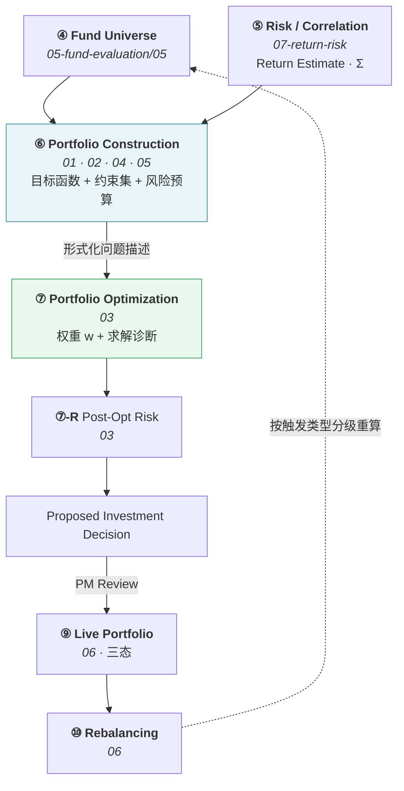

# 组合构建 · Portfolio Construction

> 上游文档：docs/01-product/01-product-overview.md（v2.5）｜本文细化环节：**⑥ Portfolio Construction**
> 业务需求：docs/01-product/02-business-requirements.md（v2.3）§19 Portfolio Construction
> 本域上游：docs/05-fund-evaluation/05-fund-selection.md（v1.0）
>
> **文档版本**：v1.1 ｜ **产品阶段**：第一阶段

---

## 1. 文档目的与边界

### 1.1 本文档回答什么

> **`Fund Universe` 中的基金如何被组织成一个组合问题？**

### 1.2 Construction 定义问题，不产出权重 ⚠️

> **这是本域最重要的一条边界**（上游 §5.3）。

| | **Portfolio Construction**（本域 01/02/04/05） | **Portfolio Optimization**（本域 03） |
|---|---|---|
| 职责 | **定义问题** | **求解问题** |
| 回答 | "我们要优化什么？受什么限制？" | "在这些限制下最优解是什么？" |
| 产出 | 目标函数形式 + 约束集 + 风险预算 | 权重向量 `w` + 求解诊断 |
| 是否涉及投资观点 | **是** —— 风险偏好、配置逻辑都是观点 | **否** —— 纯数学求解 |
| 变更频率 | 低，属策略设计层面 | 每个调仓周期运行一次 |

**判定口诀**：**Construction 定义问题，Optimization 求解问题。**

> **本文档不产出权重数值。** 上游 §4.2 ⑥ 的边界条款：Construction 的产出是"一个完整定义的优化问题"。

### 1.3 本文档不回答什么

| 不回答 | 归属 |
|---|---|
| 资产类别配置逻辑 | `02-asset-allocation` |
| 权重的数学求解 | `03-portfolio-optimization` |
| 风险如何分配 | `04-risk-budgeting` |
| 约束的具体定义 | `05-constraints` |
| 何时、如何调仓 | `06-rebalancing` |
| 基金评价、评分、筛选 | `05-fund-evaluation` |
| `Return Estimate`、`Σ` 的估计方法 | `07-return-risk` |

---

## 2. 本域六份文档与上游 Stage 的映射

> **本域六份文档不是六个新 Stage。** 上游 §4.0 规定 Stage 恰好 10 个，本域承载 **⑥ / ⑦ / ⑨ / ⑩**。

| 本域文档 | 职责 | 对应上游 |
|---|---|---|
| `01-portfolio-construction` | 组合结构与构建规则 | **⑥** 的主体 |
| `02-asset-allocation` | 资产配置层级与目标权重 | **⑥** |
| `03-portfolio-optimization` | 数学求解 + 事后组合风险 | **⑦** + **⑦-R** |
| `04-risk-budgeting` | 风险如何分配（事前） | **⑥** |
| `05-constraints` | 不可逾越的硬性限制 | **⑥** |
| `06-rebalancing` | 触发、漂移、换手 | **⑨** + **⑩** + **⑩-T** |

> **注意 01 / 02 / 04 / 05 四份同属 Stage ⑥** —— 它们共同定义那个"优化问题"，只有 03 是求解。

---

## 3. 链路位置



> **Construction 与 Optimization 之间传递的是"形式化问题描述"**，不是自然语言的投资理念（上游 §4.2 ⑥ 关键约束）。

---

## 4. 本域术语统一

> **同一概念不使用多个名字。** 本表是本域六份文档的术语引用源。

| 术语 | 含义 | 来源 |
|---|---|---|
| **`Fund Universe`** | 通过 `Eligibility Rules` 的候选基金池（Stage ④） | **上游** |
| **`Candidate Funds`** | 提交给本次优化的成分候选集 —— 即该时点 `Fund Universe` 经本域构建规则处理后的集合 | 本域 |
| **`Portfolio Constituent`** | 组合的一个成分（基金 + 目标权重 + 生效日 + 状态） | 本域 |
| **`Target Weight`** | 决策确定的目标权重 | **上游 ⑨-S** |
| **`Current Weight`** | 当前实际权重，即 `Actual Portfolio` 的权重 | 本域（等价于上游 `Actual`） |
| **`Drift`** | `Current Weight` 与 `Target Weight` 的偏离 | 本域 |
| **`Asset Class`** | 资产类别，由 `Fund Classification` 映射而来 | 本域（`02`） |
| **`Risk Budget`** | 各部分**允许承担**多少风险（事前） | **上游 §11.2** |
| **`Risk Contribution`** | 各部分**实际承担**了多少风险（事后） | **上游 ⑦-R** |
| **`Constraint`** | 不得逾越的硬性限制 | 本域（`05`） |
| **`Optimization`** | 求解目标权重的数学过程（Stage ⑦） | **上游** |
| **`Rebalancing`** | 从 `Current` 调整到 `Target`（Stage ⑩） | **上游** |

### 4.1 不使用 `Portfolio Position`

> **提示词建议使用 `Portfolio Position`，本域改用 `Portfolio Constituent`。**

| 理由 | 说明 |
|---|---|
| 1 | `Portfolio Position` 在行业惯例中通常包含**持有份额、成本、市值**等核算信息 |
| 2 | 本域第一阶段**只处理权重**，不涉及份额数量与成本核算 —— 平台不执行交易（上游 §6 Out of Scope），也不做份额级账务 |
| 3 | 上游术语表**未登记**这两个词中的任何一个，因此本域的选择不构成对上游的偏离 |

> 若未来引入份额级核算（如接入清算系统的持仓明细），届时 `Portfolio Position` 应作为**新概念回上游登记**，而非直接替换本术语。

### 4.2 不使用"候选池"等非正式表述

> 业务口语中的"候选池"一律写作 **`Fund Universe`**（`05-fund-evaluation` 已建立的映射）。

---

## 5. Objectives

| # | 目的 |
|---|---|
| 1 | 把 `Fund Universe` 组织为组合的**成分候选集** |
| 2 | 定义组合的**结构框架**（资产配置层级） |
| 3 | 定义**权重生成方式**（确定性规则或优化目标） |
| 4 | 定义**约束集**与**风险预算** |
| 5 | 产出一个**可行性可判定**的形式化优化问题 |

### 5.1 分散化不是一条独立目标

> 提示词把 "Ensure diversification" 列为构建目标。**在本项目中它不是独立目标，而是约束与风险预算的结果。**

```
分散化通过以下机制实现，而非作为一个模糊的"目标"：
    · 单基金权重上限        → 05-constraints
    · 类别权重上限          → 02-asset-allocation + 05-constraints
    · 集中度约束（HHI / 前 N 大）→ 05-constraints
    · 风险贡献预算          → 04-risk-budgeting
```

**理由**：把"分散化"写成目标而不落到可校验的约束上，会产生一个无法判定是否达成的要求。

---

## 6. Portfolio Strategy 四要素

> **一个可执行的组合策略必须由四要素共同定义，缺一不可**（`02-business-requirements` §19.4）。

```
Portfolio Strategy
  = Eligibility Rules          （谁可以被选）      → 05-fund-evaluation/05
  + Objective / Weighting Rule （按什么原则配权重）  → 本文档 §8
  + Constraint Set             （不可逾越的硬性限制）→ 05-constraints
  + Risk Budget                （风险如何分配）     → 04-risk-budgeting
```

### 6.1 仅指定目标函数不构成策略

```
❌ "策略 = Maximum Sharpe"
   → 没有说明约束与风险预算，无法执行
   → 无约束的 Max Sharpe 会解出极端集中的组合
```

---

## 7. Portfolio Object

### 7.1 属性

| 属性 | 说明 |
|---|---|
| `portfolio_id` | 标识 |
| `portfolio_name` | 名称 |
| `portfolio_type` | 组合类型 |
| **`base_currency`** | 计价币种 —— 影响 `R_f` 口径与跨币种成分的处理 |
| `investment_objective` | 投资目标（业务描述） |
| **`risk_profile`** | 风险偏好 —— 决定 Risk Budget 与约束的档位 |
| `status` | `DRAFT` / `ACTIVE` / `SUSPENDED` / `CLOSED` |
| **`version`** | 组合版本（§14） |
| **`portfolio_benchmark`** | 组合基准（见 §7.2） |

`<TBD-PC-1: portfolio_type 与 risk_profile 的取值集合，待产品与投研确认>`

### 7.2 `Portfolio Benchmark` 不得借用成分基金的 Benchmark

> 沿用上游术语表：

```
Fund Benchmark      单只基金的业绩比较基准
Portfolio Benchmark 整个组合的比较基准 —— 与前者是不同概念
```

多资产组合通常需要 **Composite Benchmark**（如 X% 权益基准 + X% 债券基准），**不得直接借用某只成分基金的 `Fund Benchmark`**（上游 §4.2 ①-B 约束 2）。

`<TBD-PC-2: Portfolio Benchmark 的构成规则与各组合类型的默认基准，待投研确认>`

---

## 8. 权重生成的两条路径（已定案）

> **沿用 `02-business-requirements` §19.2。这是此前文档自相矛盾之处，已明确区分。**

```
路径一：确定性权重规则（Deterministic Weighting Rule）
  Fund Score / 等权 / 类别配置
        ↓  Weighting Rule
     Raw Weight
        ↓  Constraint Enforcement
    Target Weight

路径二：优化目标（Optimization Objective）
  Return Estimate + Covariance
        ↓  Objective Function + Constraint Set
     Optimization Solve
        ↓
    Target Weight
```

| | **确定性权重规则** | **优化目标** |
|---|---|---|
| 举例 | Equal Weight、**Score Weight**、类别固定配比 | Minimum Volatility、Maximum Sharpe、Risk Parity |
| 是否求解优化问题 | **否** —— 直接映射后施加约束 | **是** |
| 是否需要 `Σ` | 否 | 是 |
| 是否需要 `Return Estimate` | 否 | Max Sharpe 需要；Min Vol **不需要** |
| 归属 | 本文档定义规则；约束施加见 `05-constraints` | 本文档定义问题；求解见 `03` |

### 8.1 `Score Weight` 属于路径一，不是优化目标

> **此前把它称作"规则化的优化目标"是不准确的表述**（`02-business-requirements` §19.2）。

### 8.2 Score-based Weighting 与"Score 不决定持有多少"如何并存

> **两条规则约束的是不同的东西**（`02-business-requirements` §19.3）：

| 规则 | 约束的内容 |
|---|---|
| **`Fund Score` 不具有收益预测语义** | **语义约束** —— Score 不得作为 `μ` 输入优化器，不得换算为收益率 |
| **允许 Score-based Weighting Rule** | **机制许可** —— Score 可作为显式声明的确定性权重映射规则 |

**判定标准**：

```
✅ 允许：Score 排名前 N 的基金，按 Score 归一化分配权重，再施加约束
        （这是一条显式的、可回测的权重规则）

❌ 禁止：把 Score 当作年化收益率代入 μ'w − λ/2·w'Σw 求解
        （这是把无量纲排序量当成有量纲收益率）
```

> Score-based Weighting 必须在 `Portfolio Rule Version` 中声明，且承担全部可解释性要求。

### 8.3 第一阶段策略组合

> 沿用 `02-business-requirements` §19.4：

| 策略 | Eligibility | 权重生成 | 主要约束 |
|---|---|---|---|
| **Baseline-EW** | 基础准入 | Equal Weight（路径一） | 单基金上限 |
| **Baseline-SW** | 准入 + Score Top-N | Score Weight（路径一） | 单基金 / 类别上限 |
| **MinVol** | 基础准入 | Minimum Volatility（路径二） | 单基金上限 + 类别上限 |
| **MaxSharpe** | 准入 + Score Top-N | Maximum Sharpe（路径二） | 全约束 + 风险预算 |

`<TBD-PC-3: 各策略的上线顺序与默认参数（= 上游 TBD-P1-10），待投研确认>`

### 8.4 必须对比等权基线

> **任何策略的价值都必须相对等权基线衡量。**

`Baseline-EW` 不只是一个候选策略，也是**评估其他策略的对照组**。一个复杂优化策略若长期不能显著超越等权，其复杂度不成立。

---

## 9. Portfolio Constituents

### 9.1 成分的最小结构

| 字段 | 说明 |
|---|---|
| **`fund_id`** | Share Class 粒度（沿用 `03-data`） |
| **`target_weight`** | 目标权重 |
| **`effective_date`** | 生效日 |
| **`status`** | `ACTIVE` / `PENDING_EXIT` / `FROZEN` |
| `asset_class` | 所属资产类别（见 `02-asset-allocation`） |

> **不自行扩大 Scope**：提示词提及 Strategy / Region / Currency / Sector 等维度。第一阶段**只保留 `asset_class`** —— 其余维度在 `02-business-requirements` 中无对应需求，引入会产生无人维护的空字段。

> **已定案 · 2026-08-27**：第一阶段**不引入 Region / Sector 维度**。
>
> **依据 —— 无持仓穿透数据时该维度会制造错误的分散化假象**：
>
> ```
> 无穿透数据 → 只能按基金分类近似 Sector
>     → 「科技主题基金」被整体算作科技暴露
>     → 但一只科技基金可能持有 30% 的非科技股
>     → 而一只「均衡型」基金可能实际重仓科技
>
> 结果：Sector 约束限制的是【标签】而非【真实暴露】
> ```
>
> **比不做更糟的情形**：使用者会认为 Sector 已被控制，从而放松其它风险管理。**一个不准确的风险维度比没有这个维度更危险。**
>
> **引入的前提**：`03-data` 需先纳入基金持仓明细数据（季报级，有 45 天以上滞后），并解决该数据的 PIT 问题 —— 持仓是季末快照而非连续序列。

### 9.2 `FROZEN` 状态的来源

> 成分基金变为 `NOT_TRADABLE` 时，其持仓**既不可买也不可卖**，视为冻结（`02-business-requirements` §28.4）。

冻结持仓必须在组合风险分析中**单独标注** —— 它占据权重但不可调整，会使实际可优化的权重空间小于 100%。

---

## 10. Portfolio Weight

### 10.1 归一化约定

```
Σ target_weight = 100%
```

### 10.2 现金的处理必须显式声明 ⚠️

> **"权重之和为 100%"这一表述隐含了一个未声明的假设：组合是否允许持有现金。**

```
情形 A：全额投资（Fully Invested）
    Σ 基金权重 = 100%，无现金

情形 B：允许现金
    Σ 基金权重 + 现金权重 = 100%
    → 现金是否作为一个"资产类别"参与配置？
    → 现金是否参与风险计算（σ_cash = 0）？
```

**两种情形下的约束表达完全不同**，必须在 `Construction Policy` 中显式声明，不得隐含。

> **已定案 · 2026-08-27**：组合**允许持有现金**，现金作为**独立资产类别**参与权重约束。
>
> **依据 —— 不允许持有现金会与申赎时滞矛盾**：
>
> ```
> 赎回到账 T+2，申购确认 T+1（08-backtest/01 BE-4）
>     → 调仓过程中必然存在资金在途
>     → 不允许持有现金 = 要求调仓瞬时完成
>     → 而这在公募基金的申赎规则下不可能
> ```
>
> **另外两个必需场景**：①基金清盘时资金转入现金等待下一调仓日（`08-backtest/04` `SB-1`）；②Universe 规模不足或估计不可用时，持币观望是合法的决策结果而非系统故障。
>
> **现金的三个属性**：收益率 = 0（`BE-6`）、风险 = 0、与所有资产相关性 = 0。**这三个假设都不完全真实**（现金有货币基金收益、有通胀风险），但第一阶段不引入替代品，且这些假设的方向是保守的 —— 它们会让优化器倾向于少持现金。
>
> **现金权重的上限须由 `05-constraints` 约束** —— 否则在估计悲观时优化器可能给出接近全现金的解。

### 10.3 不允许做空

> 第一阶段基金组合**不引入做空**：

```
w_i ≥ 0  对全部 i
```

这是一条隐含在"基金组合"业务性质中的约束，但必须**显式写入约束集** —— 优化器不会自行假设非负。

---

## 11. Initial Portfolio

### 11.1 四种来源

| 来源 | 说明 | 第一阶段 |
|---|---|---|
| **从 `Fund Universe` 构建** | 首次建仓 | ✅ 主路径 |
| **从既有组合迁移** | 已有持仓，切换策略 | ✅ 需处理换手 |
| 默认配置 | 预设模板 | `TBD` |
| 用户自定义 | 人工指定成分与权重 | `TBD` |

`<TBD-PC-6: 是否支持默认配置与用户自定义组合，待产品确认>`

### 11.2 首次建仓与后续调仓的差异

> **首次建仓没有"当前权重"，因此换手率约束不适用。**

```
首次建仓：Turnover = Σ|w_target − 0| = 100%
    → 若套用常规换手率上限，首次建仓必然不可行
```

**处理**：`Construction Policy` 必须区分 `INITIAL` 与 `REBALANCE` 两种模式，换手率约束仅在后者生效。

> 这是一处容易被漏掉的边界 —— 不区分会导致新组合永远无法建仓。

---

## 12. Construction Rules

| 规则 | 说明 | 取值 |
|---|---|---|
| **合格成分来源** | 必须来自 `Fund Universe`，不得引入池外基金 | 硬性 |
| **最小持仓数** | 低于此数则分散化不成立 | `TBD` |
| **最大持仓数** | 超过则管理成本与跟踪难度上升 | `TBD` |
| **同一基金多 Share Class 去重** | 避免隐性集中 | 见 §12.1 |
| **资产类别覆盖要求** | 是否要求每个类别至少有成分 | `TBD` |
| **权重初始化方式** | 等权 / Score 权重 / 类别配比 | 见 §8 |

`<TBD-PC-7: 最小 / 最大持仓数、资产类别覆盖要求，待投研与组合确认>`

### 12.1 多 Share Class 的去重

> **同一基金的 A/C/I 类份额高度相关，同时入组会造成隐性集中。**

```
组合中同一只基金的 3 个份额类别各占 5%
    → 优化器视其为 3 个独立标的，认为已分散
    → 实际单一产品敞口 15%
```

**这与 `05-fund-selection` `TBD-FSEL-6` 是同一问题** —— Universe 层已去重时本层无需重复处理；若 Universe 层未去重，本层必须处理。两者须一并决策，避免都以为对方会做。

### 12.2 最大持仓数与基数约束的关系 ⚠️

> **"最多持有 N 只基金"是一条基数约束（Cardinality Constraint），它使优化问题变为混合整数规划——非凸。**

（`02-architecture/06-technology-stack` §5.2.2）

| 实现方式 | 性质 |
|---|---|
| 在 **Universe 层**限制为 N 只（Score Top-N） | 凸 —— 候选集已限定，优化器在 N 只中分配 |
| 在 **优化层**约束"最多持有 N 只" | **非凸** —— 混合整数，开源求解器能力有限 |

**第一阶段建议**：通过 Universe 层的 Top-N 实现，**避免在优化问题中引入基数约束**。若确需后者，须评估求解器能力并在 `Portfolio Rule Version` 中声明。

---

## 13. Construction Output

> **输出是一个形式化的优化问题，不是权重。**

| 字段 | 说明 |
|---|---|
| `portfolio_id` + `version` | 标识 |
| `as_of_date` / `decision_at` | 时点 |
| **`candidate_funds`** | 来自 `Fund Universe` 的成分候选集 |
| **`weighting_approach`** | `DETERMINISTIC_RULE` 或 `OPTIMIZATION_OBJECTIVE` |
| **`weighting_rule`** | 路径一时：规则定义（等权 / Score 归一化 / 类别配比） |
| **`objective_function`** | 路径二时：目标函数形式 |
| **`constraint_set`** | 完整约束集（引用 `05-constraints`） |
| **`risk_budget`** | 风险预算（引用 `04-risk-budgeting`） |
| **`allocation_targets`** | 资产配置目标（引用 `02-asset-allocation`） |
| **`feasibility_precheck`** | 约束集是否自洽（§13.1） |
| `construction_policy_version` | 政策版本 |
| `mode` | `INITIAL` / `REBALANCE` |

### 13.1 可行性预检

> **上游 §4.2 ⑥ 要求：约束集必须"能判断问题是否可行"。**

Construction 层应做**结构性自洽检查**，在提交求解前发现明显矛盾：

| 检查 | 示例 |
|---|---|
| 权重上下限自洽 | `min_weight × 持仓数下限 > 100%` → 必然不可行 |
| 类别配置自洽 | `Σ 类别下限 > 100%` 或 `Σ 类别上限 < 100%` |
| 类别与成分自洽 | 某类别有下限但 Universe 中该类别无合格基金 |
| 类别与单基金上限自洽 | `类别下限 > 该类别基金数 × 单基金上限` |

> **预检不能替代求解器的可行性判定** —— 它只能发现结构性矛盾，无法发现数值层面的不可行。但它能把"约束配错了"与"市场条件导致无解"区分开，这对排查很有价值。

---

## 14. Portfolio Versioning

### 14.1 组合版本不因调仓而覆盖

```
Portfolio V1 → V2 → V3

每次调仓产生新版本，历史版本保持不变
```

### 14.2 组合版本与策略版本的区别

| | **Portfolio Version** | **Portfolio Rule Version** |
|---|---|---|
| 变化时机 | 每次成分或权重变化 | 策略规则变化 |
| 频率 | 高（每个调仓周期） | 低 |
| 含义 | "组合当时是什么样" | "用什么规则构建" |
| 归属 | 本文档 | `Strategy Version` 第 7 项 |

> **两者不可混用** —— 一次调仓产生新的 Portfolio Version，但 Portfolio Rule Version 不变。

### 14.3 `Portfolio Rule Version` 是 Strategy Version 的第 7 项

```
Strategy Version 第 7 项 = Portfolio Rule Version
    = 目标函数 / 权重规则 + 约束集 + 风险预算 + 求解器版本
```

（`02-architecture/01-system-architecture` §8.2）本域**不新增版本类型**。

---

## 15. Construction Policy

| 字段 | 说明 |
|---|---|
| `policy_id` | 标识 |
| `version` | 版本号 |
| `effective_from` / `effective_to` | 生效区间 |
| `status` | `DRAFT` / `ACTIVE` / `DEPRECATED` / `RETIRED` |
| **`weighting_approach`** + `weighting_rule` | 路径一/二及其定义 |
| **`objective_function`** | 路径二的目标函数 |
| **`cash_handling`** | 是否允许现金、现金是否独立配置（§10.2） |
| `min_holdings` / `max_holdings` | 持仓数约束 |
| `duplicate_share_class_handling` | 多份额去重规则 |
| `asset_class_coverage` | 类别覆盖要求 |
| **`mode_specific_rules`** | `INITIAL` 与 `REBALANCE` 的差异（§11.2） |

---

## 16. Point-in-Time

> **Construction 的全部输入必须满足 `available_at ≤ decision_at`。**

| 输入 | PIT 要求 |
|---|---|
| `Fund Universe` | 使用该时点的 Universe 快照，**不得用今天的池子** |
| `Return Estimate` / `Σ` | 基于 `available_at ≤ decision_at` 的数据估计 |
| **`Construction Policy Version`** | 使用当时生效的版本，**不得用当前政策解释历史构建** |
| `Investment Eligibility` | 该时点的可投资性状态 |

> **第三项是"未来的定义"型前视** —— 不涉及未来数据，但同样构成前视（沿用 `05-fund-evaluation/01` §9.2）。

---

## 17. Reproducibility

```
Fund Universe（该时点快照）
+ Return Estimate Version + Risk Model Version
+ Portfolio Rule Version（含 Construction Policy）
+ decision_at
+ Data Version
        ↓
    相同的优化问题描述
```

> Construction 的可复现性是 Optimization 可复现性的**前提** —— 问题描述不同，解自然不同。

---

## 18. Edge Cases

| 情形 | 处理 |
|---|---|
| `Fund Universe` 为空 | **显式失败并阻断**，不得构建空组合 |
| Universe 规模低于最小持仓数 | 显式失败；这是 Universe 层的问题（`05-fund-selection` §11.1） |
| 某资产类别在 Universe 中无合格基金，但配置有下限 | **可行性预检失败**，上报 Construction 层调整 |
| 成分基金变为 `NOT_TRADABLE` | 标 `FROZEN`，权重冻结，在可优化空间中扣除 |
| 成分基金变为 `HOLD_ONLY` | 保留但**不得加仓**，作为约束传给优化器 |
| 首次建仓 | `mode = INITIAL`，换手率约束不适用（§11.2） |
| `Σ` 不可得（相关性数据不足） | 路径二不可用；**不得静默降级为等权** —— 若要用等权必须显式声明为路径一 |
| 现金处理未配置 | 视为配置缺失，**阻断** —— 不得默认全额投资 |

---

## 19. Explainability

> **必须能回答：Why is this fund included?**

```
Fund A 进入组合，因为：
  ① 它在 decision_at 的 Fund Universe 中     → 05-fund-selection 的入池原因清单
  ② 权重生成方式 = Score Weight（路径一）
  ③ 其 Score 在候选集中排名 X
  ④ 归一化后 Raw Weight = X%
  ⑤ 施加单基金上限后 Target Weight = X%
```

### 19.1 被排除的候选同样要留痕

> Universe 中但未进入组合的基金，须记录原因（如 Top-N 截断、类别配额已满）。

---

## 20. Auditability & Portfolio Decision Trace

> **本节是本域六份文档共用的审计总纲。** 各文档只补充自身特有的追溯要点，不重复本节。

### 20.1 Portfolio Decision Trace

> 从候选基金到最终调仓，每一步都必须可追溯：

```
Fund Universe
    ↓  Construction Decision      → 01（本文档）
Candidate Funds + 问题定义
    ↓  Allocation Decision        → 02
类别约束
    ↓  Optimization Decision      → 03
Target Weights + ⑦-R 事后风险
    ↓  Risk Budget Validation     → 04
预算达成情况
    ↓  Constraint Validation      → 05
可行组合
    ↓
Target Portfolio
    ↓  Rebalancing Decision       → 06
Proposed Adjustments
```

**每一步必须记录五项**：`Input` · `Policy Version` · `Decision` · `Output` · `decision_at`。

### 20.2 六个 Policy 的版本追溯

| Policy | 归属文档 | Strategy Version 项 |
|---|---|---|
| **Construction Policy** | `01` | 第 7 项 `Portfolio Rule Version` |
| **Allocation Policy** | `02` | 同上 |
| **Optimization Policy** | `03` | 同上 |
| **Risk Budget Policy** | `04` | 同上 |
| **Constraint Policy** | `05` | 同上 |
| **Rebalancing Policy** | `06` | 第 8 项 `Rebalance Rule Version` |

> **前五个 Policy 都归入第 7 项。** 它们共同定义"那个优化问题"，因此在 Strategy Version 中是一个整体 —— 但**各自独立版本化**，以便定位是哪一部分发生了变更。

### 20.3 向上游的追溯

```
Portfolio
    → Fund Universe              → 05-fund-evaluation/05
    → Fund Tier / Rank / Score   → 05-fund-evaluation/02–04
    → Evaluation Result          → 05-fund-evaluation/01
    → Factor Result              → 04-factor/08
    → Normalized Data → Raw      → 03-data/07-data-lineage
```

> 本域的血缘**接在 `05-fund-evaluation` 之上**，形成端到端可追溯链。

### 20.4 决策快照是审计的唯一依据

> **上游 §4.2 ⑨ 关键约束**：每次实盘决策必须留存完整快照，且**足以完整重建该次历史决策**。快照内容与一致性要求见 `06-rebalancing` §16。

---

## 21. Summary

Construction **定义问题，不产出权重**。01 / 02 / 04 / 05 四份文档共同构成 Stage ⑥，只有 03 是求解。

四条关键约束：

- **Portfolio Strategy 必须四要素齐备** —— 仅指定"Maximum Sharpe"不构成策略，无约束的 Max Sharpe 会解出极端集中的组合
- **权重生成有两条路径，`Score Weight` 属路径一** —— 它是确定性权重规则，不是优化目标；Score 可以决定权重，但不得作为 `μ` 输入优化器
- **现金处理必须显式声明** —— "权重和为 100%" 隐含了组合是否持有现金的未声明假设，两种情形下约束表达完全不同
- **必须对比等权基线** —— 复杂策略若长期不能显著超越等权，其复杂度不成立

三处容易漏掉的边界：

- **首次建仓的换手率必然是 100%** —— 不区分 `INITIAL` 与 `REBALANCE` 模式会导致新组合永远无法建仓
- **"最多持有 N 只"是基数约束，非凸** —— 应通过 Universe 层 Top-N 实现，而非在优化问题中引入混合整数约束
- **`Σ` 不可得时不得静默降级为等权** —— 若要用等权必须显式声明为路径一，否则记录的策略与实际执行的不符

---

## 22. Decisions

| # | 决策 | 理由 |
|---|---|---|
| D-1 | 本域六份文档是 Stage ⑥⑦⑨⑩ 的细化，**不新增 Stage** | 上游 §4.0 |
| D-2 | **Construction 不产出权重数值** | 上游 §5.3 判定口诀 |
| D-3 | 01/02/04/05 同属 Stage ⑥，仅 03 属 ⑦ | 上游 §4.2 ⑥ 归属字段 |
| D-4 | **分散化不作为独立目标**，落为约束与风险预算 | 否则产生无法判定是否达成的要求 |
| D-5 | 权重生成两条路径，**`Score Weight` 属路径一** | `02-business-requirements` §19.2 |
| D-6 | 成分维度第一阶段**只保留 `asset_class`** | 其余维度无对应业务需求，会产生空字段 |
| D-7 | **现金处理必须显式配置，不得默认全额投资** | 两种情形约束表达完全不同 |
| D-8 | 非负约束必须显式写入约束集 | 优化器不会自行假设 |
| D-9 | **区分 `INITIAL` 与 `REBALANCE` 模式** | 否则首次建仓因换手率约束必然不可行 |
| D-10 | **最大持仓数通过 Universe 层 Top-N 实现** | 避免在优化问题中引入非凸的基数约束 |
| D-11 | Construction 层做结构性可行性预检 | 把"约束配错"与"市场条件无解"区分开 |
| D-12 | Portfolio Version 与 Portfolio Rule Version 严格区分 | 前者每次调仓变，后者策略变才变 |
| D-13 | **`Σ` 不可得时不得静默降级为等权** | 记录的策略必须与实际执行一致 |

---

## 23. Constraints

| # | 约束 | 来源 |
|---|---|---|
| C-1 | Construction 的产出必须是**可被优化器直接消费的形式化问题描述** | 上游 §4.2 ⑥ |
| C-2 | 约束集必须显式、可校验、可判断可行性 | 同上 |
| C-3 | 成分必须来自 `Fund Universe`，不得引入池外基金 | 上游 §4.2 ④ |
| C-4 | `Fund Score` **不得**作为 `μ` 输入优化器 | 上游 §5.2、`02-business-requirements` §19.3 |
| C-5 | Score-based Weighting 必须在 `Portfolio Rule Version` 中声明 | `02-business-requirements` §19.3 |
| C-6 | **相关性必须纳入** —— `Σ` 是路径二的必需输入 | `02-business-requirements` §19.6 |
| C-7 | `Portfolio Benchmark` 不得借用成分基金的 `Fund Benchmark` | 上游 §4.2 ①-B |
| C-8 | 全部输入必须满足 `available_at ≤ decision_at` | 上游 §4.2 ①-PIT |
| C-9 | 本域**不引入** AI / ML / LLM 组合决策 | 上游 §6.2.1、`02-business-requirements` §19.7 |
| C-10 | 本域**不重新计算** Fund Score / Rank / Tier | `05-fund-evaluation` 的产出，直接引用 |

---

## 24. TBD

| # | 事项 | 影响 | 责任方 |
|---|---|---|---|
| PC-1 | `portfolio_type` 与 `risk_profile` 的取值集合 | 组合对象定义 | 产品 + 投研 |
| PC-2 | `Portfolio Benchmark` 的构成规则与默认基准 | 相对表现评价、Tracking Error 约束 | 投研 |
| PC-3 | 各策略的上线顺序与默认参数（= 上游 `TBD-P1-10`） | 策略投产 | 投研 |
| ~~PC-4~~ | ~~是否需要 Region / Sector 等附加成分维度~~ —— **已定案**：第一阶段【不】引入 Region / Sector 维度 | — | ✅ 2026-08-27 |
| ~~PC-5~~ | ~~组合是否允许持有现金、现金是否独立配置~~ —— **已定案**：组合【允许持有现金】，现金作为独立资产类别参与权重约束 | — | ✅ 2026-08-27 |
| PC-6 | 是否支持默认配置与用户自定义组合 | Initial Portfolio 来源 | 产品 |
| PC-7 | 最小 / 最大持仓数、资产类别覆盖要求 | 构建规则 | 投研 + 组合 |
| PC-8 | 多 Share Class 去重在 Universe 层还是本层（与 `TBD-FSEL-6` 一并决策） | 隐性集中 | 投研 |

---

## 25. Related Documents

| 关系 | 文档 |
|---|---|
| **上游** | `01-product/01-product-overview.md` v2.5（§4.2 ⑥、§5.3）、`02-business-requirements.md` v2.3（§19） |
| **本域** | `02-asset-allocation`、`03-portfolio-optimization`、`04-risk-budgeting`、`05-constraints`、`06-rebalancing` |
| **输入来源** | `05-fund-evaluation/05-fund-selection`（Fund Universe）、`07-return-risk`（Return Estimate、Σ） |
| **架构** | `02-architecture/01-system-architecture.md` v2.2（§8.2 Portfolio Rule Version）、`06-technology-stack.md` v1.2（§5.2.2 非凸约束） |

---

## 26. Change Log

| 版本 | 日期 | 变更内容 | 上游依赖 |
|---|---|---|---|
| **v1.1** | 2026-08-27 | **第二批定案（2 项）**。`PC-4` **不引入 Region / Sector 维度** —— 无持仓穿透数据时该维度限制的是标签而非真实暴露，**一个不准确的风险维度比没有这个维度更危险**；`PC-5` **允许持有现金**并作为独立资产类别 —— 不允许持有现金等于要求调仓瞬时完成，与申赎时滞矛盾；现金的三个假设（零收益、零风险、零相关）方向保守，权重上限须由约束层控制。 详见 `TBD-resolution-2.md` | `TBD-resolution-2.md` v1.0 |
| v1.0 | 2026-08-26 | 初始版本。**§4 本域术语统一表**（含不使用 `Portfolio Position` 的理由）；确立**本域六份是 Stage ⑥⑦⑨⑩ 的细化**且 01/02/04/05 同属 ⑥；**Construction 定义问题、不产出权重**；§6 Portfolio Strategy 四要素；§8 权重生成两条路径与 `Score Weight` 属路径一的澄清；**§5.1 分散化不作为独立目标**（否则无法判定是否达成）；**§10.2 现金处理必须显式声明**；**§11.2 首次建仓与后续调仓的换手率差异**（不区分则新组合永远无法建仓）；**§12.2 最大持仓数是基数约束、非凸**，建议通过 Universe 层 Top-N 实现；§13.1 结构性可行性预检及其与求解器判定的分工；§14.2 Portfolio Version 与 Portfolio Rule Version 的区分；**§20 本域审计总纲**（Portfolio Decision Trace、六个 Policy 的版本归属、向上游的血缘衔接） | `01-product-overview.md` v2.5、`02-business-requirements.md` v2.3、`05-fund-evaluation` v1.0 |