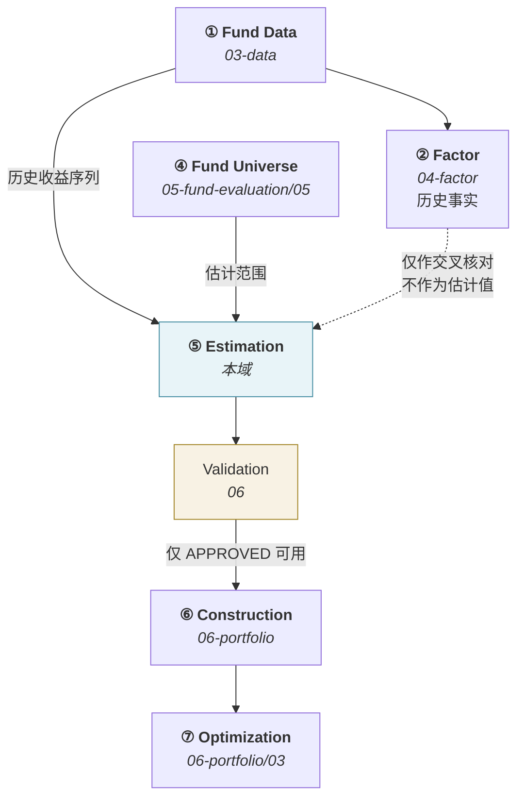
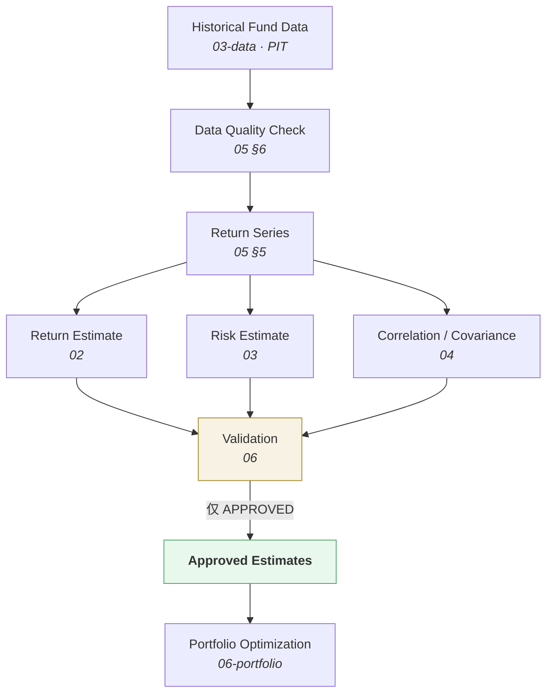

# 估计框架 · Estimation Framework

> 上游文档：docs/01-product/01-product-overview.md（v2.5）｜本文细化环节：**⑤ Risk / Correlation Analysis**
> 业务需求：docs/01-product/02-business-requirements.md（v2.3）§19.6、§20
> 本域上游：docs/05-fund-evaluation/05-fund-selection.md、docs/04-factor/08-factor-output.md（v1.0–v1.1）
>
> **文档版本**：v1.2 ｜ **产品阶段**：第一阶段

---

## 1. 文档目的与边界

### 1.1 本文档回答什么

> **本域估计什么？整体框架是什么？**

### 1.2 本域的核心职责

> **为组合构建、优化与风险预算提供面向未来的收益与风险输入。**

```
04-factor        回答：历史上发生了什么？
07-return-risk   回答：用什么数值作为未来决策的估计？
06-portfolio     回答：如何用这些估计构建组合？
```

### 1.3 本文档不回答什么

| 不回答 | 归属 |
|---|---|
| 收益估计的具体方法 | `02-return-estimate` |
| 风险估计的具体方法 | `03-risk-estimate` |
| 相关性与协方差 | `04-correlation-covariance` |
| 方法注册、参数与预处理规则 | `05-estimation-methodology` |
| 估计的校验 | `06-estimation-validation` |
| 历史 Factor 的定义与计算 | `04-factor` |
| 数据来源与数据模型 | `03-data` |
| 权重求解 | `06-portfolio` |

---

## 2. 本域六份文档与上游 Stage 的映射

> **本域六份文档不是六个新 Stage。** 上游 §4.0 规定 Stage 恰好 10 个，本域承载 **⑤ Risk / Correlation Analysis**。

| 本域文档 | 职责 | 对应上游 |
|---|---|---|
| `01-estimation-framework` | 框架、对象、口径、状态 | **⑤** 总纲 |
| `02-return-estimate` | 收益估计 | **⑤-A Return Estimate** |
| `03-risk-estimate` | 风险估计 | **⑤-B** 的风险部分 |
| `04-correlation-covariance` | 相关性与协方差 | **⑤-B** 的依赖结构部分 |
| `05-estimation-methodology` | 方法论与参数治理 | **⑤** 支撑 |
| `06-estimation-validation` | 估计校验 | **⑤** 支撑 |

### 2.1 本域产出的是 Pre-Optimization Risk（事前风险）

> **上游 §4.2 ⑤ 的关键标注：**

```
本域产出：只依赖历史收益序列，不依赖权重 w
    → Volatility、Downside Risk、Drawdown、Correlation、Covariance

不属本域：依赖 w 的量
    → Risk Contribution、Concentration  →  06-portfolio/03（⑦-R）
```

**理由**：在 `w` 求出之前，最终组合的风险贡献**在数学上不存在**。

---

## 3. 链路位置



### 3.1 本域不消费 Factor 作为估计值 ⚠️

> **这是一条容易被违反的边界。**

```
❌ 把 F-RET-001 年化收益率 直接当作 μ
   → 绕过 Return Estimate Version 的版本治理
   → 估计方法的变更不会被记录

✅ 本域从【历史收益序列】独立计算估计值
   → 即使方法就是"历史均值"，它仍是本域的产出，带 Return Estimate Version
```

`04-factor` 的产出可用于**交叉核对**（如"本域算出的历史均值应与 `F-RET-001` 在同窗口下接近"），但**不作为估计值直接使用**。

> 沿用 `04-factor/01-factor-overview` §2.3：`07-return-risk` 不消费 Factor —— 这保证了两条数据流独立。

---

## 4. Objectives

| # | 目的 |
|---|---|
| 1 | 提供 **Expected Return（`μ`）** |
| 2 | 提供 **Expected Risk**（波动率、下行风险等） |
| 3 | 提供 **Expected Correlation** |
| 4 | 提供 **Expected Covariance（`Σ`）** |
| 5 | 支撑组合构建、优化与风险预算 |
| 6 | 保证估计**可复现** |
| 7 | 保证只有**通过校验**的估计进入优化 |

### 4.1 本域不做投资决策

> **本域只产出估计值**，不产生 Buy / Sell / Hold，不做基金筛选，不做组合构建，不执行交易。

---

## 5. 五个"收益"概念的分离 ⚠️

> **沿用 `06-portfolio/03` §3。这五个概念在本域最容易被合并成一个字段。**

| 概念 | 含义 | 归属 |
|---|---|---|
| **Historical Return** | 历史已实现收益 | `04-factor`（`F-RET-001` 等） |
| **Expected Return（`μ`）** | 对未来持有期的收益**估计** | **本域** |
| **Portfolio Target Return** | 组合的收益目标 | `06-portfolio` |
| **MAR** | 最低可接受收益（**评价标准**） | `05-fund-evaluation` |
| **Risk-free Rate（`R_f`）** | 市场无风险利率（**市场数据**） | `03-data` |

### 5.1 Historical Return ≠ Expected Return

> **即使本域采用历史均值作为估计方法，两者仍不是同一个字段。**

```
Historical Return  = 事实，属 Factor，带 Factor Version（= Metric Version）
Expected Return    = 估计，属本域，带 Return Estimate Version
                     且必须声明 Estimation Window / Horizon / Return Basis 三口径
```

**这不是文字游戏** —— 同一个"历史 36 个月均值"，作为 Factor 时它的含义是"过去 36 个月平均涨了多少"；作为 Estimate 时它的含义是"我们假设未来一个持有期会涨这么多"。**后者包含一个前者没有的假设**，因此需要独立的版本治理。

### 5.2 五个概念不可合并为一个字段

> **上游 §5.2 的三条理由已说明为什么 Score 不能当 `μ`；本节说明为什么其余四者也不能互换。**

| 混用 | 后果 |
|---|---|
| `Historical Return` 当 `μ` | 绕过估计方法的版本治理 |
| `MAR` 当 `μ` | MAR 是"多少算可接受"，不是"预计会有多少" |
| `R_f` 当 `μ` | `R_f` 是市场观测值，不是对某只基金的估计 |
| `Target Return` 当 `μ` | 目标是**我们想要的**，估计是**我们预计的** |

---

## 6. Estimation Objects

| 对象 | 符号 | 维度（N 只基金） | 归属文档 |
|---|---|---|---|
| **Expected Return** | `μ` | `N × 1` | `02` |
| **Expected Volatility** | `σ` | `N × 1` | `03` |
| **Expected Variance** | `σ²` | `N × 1` | `03` |
| Expected Downside Risk | `σ_d` | `N × 1` | `03` |
| Expected VaR / CVaR | —— | `N × 1` | `03` |
| **Expected Correlation** | `ρ` | `N × N` | `04` |
| **Expected Covariance** | `Σ` | `N × N` | `04` |

### 6.1 数学一致性

> **全域统一使用以下记号**（提示词 §34、上游 §5.2）：

```
Expected Return Vector    μ        （N × 1）
Covariance Matrix         Σ        （N × N）
Weight Vector             w        （N × 1）

Portfolio Expected Return E[R_p] = w'μ
Portfolio Variance        σ_p²   = w'Σw
Portfolio Volatility      σ_p    = sqrt(w'Σw)
```

### 6.2 维度一致性是硬性要求

> **`μ`、`Σ`、`w` 必须来自同一个基金集合、同一顺序。**

```
若 μ 含 N 只基金而 Σ 只有 N−1 只可得
    → w'Σw 无法计算
    → 必须在交付前对齐：取交集，并明确记录被剔除的基金
```

**处理**：本域交付的 `μ` 与 `Σ` **必须已完成对齐**，且附带 `excluded_instruments` 清单及原因。**不得把对齐责任推给 `06-portfolio`**。

### 6.3 `μ` 与 `Σ` 的口径一致性 ⚠️

> **上游 ⑤-B 关键约束：`μ` 与 `Σ` 必须时间尺度与年化口径一致。**

```
两者基于同一持有期、同一年化规则计算
    → 使目标函数中的收益项与风险项具有明确的尺度关系
```

> **注意措辞**：`μ` 与 `Σ` 本就**不是相同量纲**（`μ` 是收益率的一次量，`Σ` 是二次量）。要求的是**口径一致，不是量纲一致**。风险厌恶系数 `λ` 的取值依赖于这个口径 —— 口径不一致会使 `λ` 失去可解释性。

---

## 7. Estimation Horizon 与 Lookback Window ⚠️

> **两者是完全不同的概念，混淆是本域最常见的错误。**

| | **Lookback Window**（观测窗口） | **Forecast Horizon**（预测期） |
|---|---|---|
| 含义 | 用**多长的历史**做估计 | 估计指向**未来多长的持有期** |
| 方向 | 向后看 | 向前看 |
| 上游术语 | `Estimation Window` | `Estimation Horizon` |
| 示例 | 过去 36 个月 | 未来 1 个季度 |

```
Lookback = 3Y   与   Forecast Horizon = 1Y
    → 这是两个独立参数，可以任意组合
    → 用 3 年历史估计未来 1 年，与用 1 年历史估计未来 3 年，是完全不同的设定
```

### 7.1 三个口径必须显式声明（上游强制）

> **上游 ⑤-A：缺一则估计值不可用。**

| 口径 | 说明 |
|---|---|
| **Estimation Window** | 历史数据窗口长度 |
| **Estimation Horizon** | 未来持有期长度 |
| **Return Basis** | 绝对收益（Absolute）还是超额收益（Excess） |

```
Estimation Window  = TBD
Estimation Horizon = TBD
Return Basis       = TBD
```

`<TBD-EF-1: 三个口径的取值，待投研确认>`

### 7.2 Forecast Horizon 必须与调仓周期匹配

> **这是一个容易被忽略的一致性要求。**

```
调仓周期 = 季度
Forecast Horizon = 1 年
    → 估计的是未来一年的收益，但三个月后就会重新决策
    → 优化器在权衡"一年的收益"与"一年的风险"，而实际持有期是三个月
```

**要求**：`Forecast Horizon` 应与 `06-portfolio/06` 的 `Rebalancing Frequency` 保持一致或有明确的换算依据。两者不一致时必须显式说明理由。

> **已定案 · 2026-08-27**：**Forecast Horizon 必须等于调仓周期**。
>
> **依据**：估计的对象是「下一期」的收益与风险，而「下一期」的长度就是到下次调仓的时间。两者不等会产生一个无法通过任何缩放修正的错配：
>
> ```
> Horizon = 1 年，调仓周期 = 1 季度
>     → μ 表达的是「持有一年的期望」
>     → 但组合只持有一个季度就会被重构
>     → 优化在最大化一个永远不会被实现的收益
> ```
>
> **年化只解决量纲，不解决错配** —— 把年度 μ 除以 4 得到季度 μ，隐含了「收益在年内均匀分布」的假设，而这恰恰是估计要回答的问题之一。
>
> **调仓周期变更时必须重新估计**，不得沿用旧 Horizon 的估计值。

---

## 8. Estimation As-of Date 与 Point-in-Time

### 8.1 核心规则

> **`estimation_as_of_date = T` 时，全部输入必须满足 `available_at ≤ T`。**

沿用上游 §4.2 ①-PIT：**PIT 判定用 `available_at`，不是 `effective_at`**；同一 `(entity, effective_at)` 有多个合格版本时，取 **`version` 序号最大者**。

### 8.2 Observation Date ≠ Available Date

```
某市场数据的观测日是 T
    但它在 T+2 才发布
    → available_at = T+2
    → 在 T 时点的估计中【不可使用】
```

> **利率数据尤其如此** —— `03-data/01-data-source` §3.1.5.2 已标注"利率通常滞后发布，`effective_at` 与 `available_at` 之间常有间隔"。

### 8.3 本域禁止进入 T 时点估计的数据

| 禁止 | 说明 |
|---|---|
| Future NAV | 未来净值 |
| Future Factor | 未来因子值 |
| Future Benchmark Return | 未来基准收益 |
| **Future Risk-free Rate** | 未来利率 |
| **修订后的历史数据** | T 时点看到的是修订前版本 |
| **当前的 Fund Universe** | 必须用 T 时点的 Universe 快照 |

### 8.4 第五、六项是"未来的定义"型前视 ⚠️

> 前四项是"未来的数据"，容易识别；后两项不涉及未来数据，但同样构成前视。

```
用今天的 Universe 做历史估计
    → 已清盘的基金不在其中
    → 估计样本被系统性地限制在"活下来的"基金上
    → 这正是 §9 的生存偏差
```

---

## 9. Survivorship Bias

### 9.1 问题

> **若只用当前仍存在的基金做估计，收益估计被系统性高估、风险估计被系统性低估。**

```
清盘基金通常是表现差的、波动大的
    → 排除它们 → μ 偏高、σ 偏低
    → 优化器基于一个过于乐观的输入求解
```

### 9.2 相关性估计受到的影响更隐蔽

> **生存偏差对 `Σ` 的影响不只是"少了几行几列"。**

```
市场危机期间同时下跌的基金，部分在其后清盘
    → 用当前存续基金估计相关性，恰好漏掉了这些"共同下跌"的样本
    → 相关性被系统性【低估】
    → 优化器认为分散化效果比实际更好
```

**这是比 `μ` 偏高更危险的一类偏差** —— 它使组合在最需要分散化的时候失效。

### 9.3 处理

| 要求 | 归属 |
|---|---|
| 保留已清盘基金的历史数据 | `03-data`（`04-factor/08` `TBD-FO-2`） |
| 使用**历史时点的** Fund Universe | `05-fund-evaluation/05` §15 快照 |
| 估计样本包含当时存续、后已清盘的基金 | **本域** |

> **已定案 · 2026-08-27**：已清盘基金的数据**全部保留在估计样本内，直至清盘日**，不设「清盘前 N 个月剔除」的截断。
>
> **依据**：剔除即制造**幸存者偏差**（`08-backtest/04`）。清盘前的收益是真实发生的 —— 持有人确实经历了那段表现，把它从样本中删掉会让历史看起来比实际更好。
>
> **一个反直觉之处**：清盘前的表现常常较差，因此有「剔除临近清盘的异常期」的直觉。但**正是这段数据承载了「基金会因表现差而消失」这一信息** —— 删掉它等于假装基金只会因中性原因退出。
>
> **须区分「保留在样本内」与「保留在 Universe 内」**：前者是历史估计的输入，后者决定能否建仓。已清盘基金**不在当期 Universe**，但**在历史估计样本中**。

---

## 10. Estimation Universe

> **估计范围 = 该时点的 `Fund Universe`。**

| 范围 | 第一阶段 |
|---|---|
| **Fund**（Share Class 粒度） | ✅ |
| Asset Class | **见 §10.1** |
| Strategy / Sleeve | ❌ 不实现 |

### 10.1 第一阶段只做基金层估计

> **不提供 Asset Class 层的收益估计。**

这是 `06-portfolio/02` §4.2 已记录的约束：TAA 需要类别层的相对吸引力判断，而本域第一阶段只做基金层估计，因此 `06-portfolio` 只实现 SAA。

**理由**：类别层估计需要类别指数或成分加权，前者依赖未确定的类别定义，后者会引入"用组合权重估计类别收益、再用类别收益决定组合权重"的循环。

> **已定案 · 2026-08-27**：第一阶段**不做 Asset Class 层估计**，仅做基金层。
>
> **依据**：①类别层估计需要类别指数或类别内加总规则，而**资产类别与 Fund Classification 的映射本身待定**（`06-portfolio/02` `TBD-AA-2`），在映射未定前构造的类别估计会随映射变更而全部作废；②基金层估计已足以支撑优化 —— 类别层约束由 `05-constraints` 的 scope 机制表达，不需要类别层的 μ 与 σ。
>
> **将来引入时的前提**：先定 AA-2 的映射，再定类别指数来源，两者都属 `03-data` 与投研的工作，不是本域能单独推进的。

---

## 11. Estimation Pipeline

### Input（本域整体）

| 输入 | 来源 | 必需 |
|---|---|---|
| 历史净值序列（PIT） | `03-data` | ✅ |
| **Fund Universe 快照**（该时点） | `05-fund-evaluation/05` | ✅ |
| 各基金交易日历 | `03-data` | ✅ |
| 数据质量状态 | `03-data/03-data-quality` | ✅ |
| Benchmark 序列 + Mapping 版本 | `03-data` | 超额口径必需 |
| `Risk-free Rate`（经 Threshold Resolver） | `03-data` | 相关方法必需 |
| 各层 Policy + version | 本域 | ✅ |

> **本域不接受 `Fund Score`、`Fund Tier` 作为输入**（上游 §5.2）。



### 11.1 三条支路必须使用同一份收益序列

> **否则 `μ` 与 `Σ` 的口径无法保证一致（§6.3）。**

```
❌ Return Estimate 用月频序列，Covariance 用日频序列
   → 年化口径可以对齐，但样本期与观测数不同
   → 两者对同一时段的刻画不一致
```

**要求**：三条支路的收益序列生成（频率、复权、缺口处理）必须在 `05-estimation-methodology` 中统一定义，不得各自实现。

---

## 12. Estimate Status

### 12.1 状态枚举

| 状态 | 含义 | 可被优化器消费 |
|---|---|---|
| **`INSUFFICIENT_DATA`** | 观测不足，无法估计 | ❌ |
| **`ESTIMATION_FAILED`** | 计算过程失败 | ❌ **须告警** |
| **`ESTIMATED`** | 已算出，**未经校验** | ❌ |
| **`VALIDATED`** | 通过校验 | ❌ **见 §12.3** |
| **`WARNING`** | 通过校验但存在可疑 | ✅ 须携带标记 |
| **`REJECTED`** | 校验未通过 | ❌ |
| **`STALE`** | 超过新鲜度阈值 | ❌ |
| **`APPROVED_FOR_USE`** | **可进入优化** | ✅ |

### 12.2 `INSUFFICIENT_DATA` 与 `ESTIMATION_FAILED` 必须区分

> 沿用 `04-factor/07-factor-validation` §11.2 的原则：

| | `INSUFFICIENT_DATA` | `ESTIMATION_FAILED` |
|---|---|---|
| 含义 | **没法算**（成立不足） | **该算但算坏了** |
| 是否正常 | 正常业务情形 | 系统问题 |
| 是否告警 | 否 | **是** |

### 12.3 `VALIDATED` 不等于 `APPROVED_FOR_USE` ⚠️

> **这是一处必须区分的地方**（提示词 §28）。

```
VALIDATED         = 这个估计在统计意义上通过了检查
APPROVED_FOR_USE  = 这个估计可以进入本次决策
```

两者的差距来自：

| 因素 | 说明 |
|---|---|
| **新鲜度** | 估计通过了校验，但已是三个月前的 —— `STALE` |
| **口径匹配** | 估计的 Horizon 与本次决策的持有期不匹配 |
| **维度对齐** | `μ` 有该基金但 `Σ` 没有（§6.2） |
| **政策生效** | 所用方法的 Policy 在本决策时点尚未生效或已废止 |

> **只有 `APPROVED_FOR_USE` 的估计可以进入优化。**

---

## 13. Estimate Metadata

> **每个估计必须携带以下元信息，缺一则不可解释、不可复现。**

| 字段 | 说明 |
|---|---|
| `estimate_id` | 标识 |
| **`instrument_id`** | 基金（Share Class 粒度） |
| **`estimate_type`** | `RETURN` / `VOLATILITY` / `DOWNSIDE_RISK` / `VAR` / `CVAR` / `CORRELATION` / `COVARIANCE` |
| **`estimation_as_of_date`** | 估计时点 |
| **`lookback_window`** | 观测窗口 |
| **`forecast_horizon`** | 预测期 |
| **`return_basis`** | `ABSOLUTE` / `EXCESS` |
| **`method_id` + `method_version`** | 所用方法（`05`） |
| **`parameter_version`** | 参数版本（`05`） |
| **`data_version`** | 数据版本 |
| **`policy_version`** | 估计政策版本 |
| **`status`** | §12 |
| **`validation_result_ref`** | 校验结果引用（`06`） |
| `observation_count` | 有效观测数 |
| `excluded_instruments` | 被剔除的基金及原因 |

### 13.1 `return_basis` 不可省略 ⚠️

> **上游 ⑤-A 强制约束 4：Return Basis 必须与优化器目标函数一致。**

```
Benchmark-relative 方法产出的是 Expected Excess Return
    若优化器目标函数使用绝对收益
    → 必须显式还原：μ = benchmark return + expected excess return
    → 否则 μ'w 的金融含义不成立
```

**不记录 `return_basis` 时，下游无法判断是否需要还原。**

---

## 14. Framework Policy

| 字段 | 说明 |
|---|---|
| `policy_id` / `version` | 标识与版本 |
| `effective_from` / `effective_to` | 生效区间 |
| `status` | `DRAFT` / `ACTIVE` / `DEPRECATED` / `RETIRED` |
| **`estimation_universe`** | 估计范围（§10） |
| **`forecast_horizon`** | 预测期 |
| **`lookback_window`** | 观测窗口 |
| **`return_basis`** | 绝对或超额 |
| **`method_selection_rules`** | 方法选择规则（`05` §5） |
| **`validation_rules`** | 校验规则引用（`06`） |
| **`freshness_threshold`** | 新鲜度阈值（§15） |
| `survivorship_handling` | 已清盘基金的处理（§9.3） |

### 14.1 本域的两项 Strategy Version

> 沿用 `02-architecture/01-system-architecture` §8.2：

| Strategy Version 项 | 内容 | 归属文档 |
|---|---|---|
| **第 5 项 `Return Estimate Version`** | 估计方法与 Window / Horizon / Basis 三口径 | `02` |
| **第 6 项 `Risk Model Version`** | 风险与协方差估计方法、收缩规则 | `03` + `04` |

> 本域**不新增版本类型**。`05-estimation-methodology` 的 Method Registry 与参数配置分别归入这两项。

### 14.2 六个 Policy 的归属

| Policy | 文档 | Strategy Version 项 |
|---|---|---|
| **Estimation Framework Policy** | `01`（本文档） | 见 §14.3 |
| **Return Estimation Policy** | `02` | 第 5 项 |
| **Risk Estimation Policy** | `03` | 第 6 项 |
| **Correlation / Covariance Policy** | `04` | 第 6 项 |
| **Estimation Methodology Policy** | `05` | 第 5 + 6 项 |
| **Estimation Validation Policy** | `06` | 见 §14.3 |

### 14.3 两个 Policy 归入第 10 类 `Policy Version` ✅

> **定案 · 2026-08-27**。原为本域登记的缺口（与 `05-fund-evaluation/01` §21.3、`02-architecture` §8.5 同类），现已随第 10 类 `Policy Version` 一并关闭。

```
Estimation Framework Policy Version → 含 Horizon、Universe、新鲜度阈值
Estimation Validation Policy Version → 含校验阈值与 Gate 规则
```

**原后果**：这两项变更不进决策快照的 `strategy_version`。例如**校验阈值放宽后，原本被拒的估计会通过并进入优化，但快照中无任何字段记录这次变更**。

**定案归属**：

| 本域 Policy | 归入子项 | Owner |
|---|---|---|
| `Estimation Framework Policy Version` | `estimation_policy` | `portfolio-service` |
| `Estimation Validation Policy Version` | `validation_policy` | `portfolio-service` |

> **`validation_policy` 是跨域共享的子项** —— 因子校验、估计校验、回测证据门槛的 Gate 阈值都归入它，各由自己的 Owner Service 维护其中的一段。本域拥有的是「估计校验」那一段。

**两条后续要求**：

| # | 要求 |
|---|---|
| 1 | 决策快照须**同时**引用 `strategy_version` 与 `policy_version` —— 缺任一则该估计不可复现 |
| 2 | 两项随本域估计结果落库（`policy_version`、`validation_result_ref`）的既有做法**保持不变** |

> **`TBD-EF-5` 已关闭。** 见 `02-business-requirements` §23.1.1、`02-architecture/01-system-architecture` §8.2.1、`TBD-resolution.md` Policy ⑧。

---

## 15. Estimate Freshness

> **估计会过期。**

```
estimation_as_of_date = T
当前决策时点 = T + N

若 N > freshness_threshold  →  status = STALE  →  不可用
```

```
Freshness Threshold = TBD
```

> **推荐默认 · 2026-08-27**：新鲜度阈值 = **1 个调仓周期**；超期标 `STALE` 但**不阻断**。业务方可改，改动升 `estimation_policy` 版本。
>
> **依据**：与 `EF-2` 的 Horizon = 调仓周期对齐 —— 估计的有效期就是它所描述的那一期。超过一期仍未更新，说明估计描述的已是过去的一期。
>
> **为什么标记而不阻断**：估计陈旧通常源于上游数据延迟，此时**阻断会让整个决策周期停摆**，而陈旧估计仍比无估计有用。阻断的判据应是数据不可用（`INSUFFICIENT_DATA`），不是数据不新鲜。

### 15.1 不同估计类型的过期速度不同

| 估计 | 过期速度 | 理由 |
|---|---|---|
| **Correlation / Covariance** | **较快** | 相关性结构在市场状态切换时会显著变化 |
| Volatility | 中等 | 波动率有聚集性，短期内相对稳定 |
| Expected Return | 较慢 | 长窗口均值对新增几个观测不敏感 |

> **因此新鲜度阈值应按估计类型分别配置**，而非全域统一一个值。

---

## 16. Reproducibility

```
Data Snapshot（Data Version）
+ Method ID + Method Version
+ Parameter Version
+ estimation_as_of_date
+ lookback_window + forecast_horizon + return_basis
+ Estimation Universe（该时点快照）
        ↓
    相同的估计值
```

### 16.1 数值容差

> 与 `06-portfolio/03` §12.2 同理 —— 浮点运算在不同数值库下可能有微小差异，可复现的判据是"在既定容差内相同"。

> **已定案 · 2026-08-27**：见 `TBD-resolution-2.md` Policy A。估计值属「协方差矩阵」与「Factor 值」两档：
>
> | 对象 | 相对误差容差 |
> |---|---|
> | `return_estimate`（μ） | **1×10⁻¹⁰**（确定性算术） |
> | `risk_estimate`（σ） | **1×10⁻¹⁰** |
> | `covariance_estimate`（Σ） | **1×10⁻⁸**（受 BLAS 实现与求和顺序影响） |
>
> **Σ 的容差比 μ、σ 松两个数量级**，因为它涉及 N×T 次累加，且矩阵运算的求和顺序在不同 BLAS 后端下不同。这不是实现缺陷，是浮点加法不满足结合律的必然结果。

### 16.2 Estimation Universe 是可复现的隐含要素

> **与 `05-fund-evaluation/01` §18.2 的 `Peer Group Version` 是同一类问题。**

```
同一时点、同一方法、同一数据版本
但 Estimation Universe 少了几只基金
    → Σ 的维度不同 → 相关性估计的样本不同 → 结果不同
```

**因此估计结果必须记录所用的 Universe 快照引用。**

---

## 17. 端到端示例

> **全部数值以 `TBD` 表示** —— 本项目尚未确定业务参数，不得自行制造。

```
Fund A / Fund B / Fund C
estimation_as_of_date : 2026-08-24
Lookback Window       : TBD
Forecast Horizon      : TBD
Return Basis          : TBD

① Return Estimate（02）
   μ_A = TBD   μ_B = TBD   μ_C = TBD
   Method = TBD · Version = TBD

② Risk Estimate（03）
   σ_A = TBD   σ_B = TBD   σ_C = TBD

③ Correlation / Covariance（04）
   ρ = TBD（3×3）
   Σ = TBD（3×3）

④ Validation（06）
   数据校验 / 统计校验 / 稳定性校验 / 矩阵校验
   Status = TBD

⑤ 若 Status = APPROVED_FOR_USE
   → 交付 06-portfolio 作为优化输入
   若 Status = REJECTED
   → 阻断，不得进入优化
```

---

## 18. Edge Cases

| 情形 | 处理 |
|---|---|
| 基金成立时长 < Lookback Window | `INSUFFICIENT_DATA`；**不得**缩短窗口凑数（见 §18.1） |
| Fund Universe 为空 | 阻断，不产出估计 |
| `μ` 与 `Σ` 覆盖的基金不一致 | 取交集并记录 `excluded_instruments`（§6.2） |
| 某基金在窗口内暂停申赎、净值不更新 | 按 `05` §6 的缺失处理；连续缺失过多 → `INSUFFICIENT_DATA` |
| 估计已过新鲜度阈值 | `STALE`，不可用 |
| 校验未通过 | `REJECTED`，**不得降级使用** |
| 所用方法的 Policy 已废止 | 不可用；须用当时生效的版本重算 |
| 基金在窗口内转型 | 转型前后的收益序列**不代表同一策略**；见 §18.2 |

### 18.1 不得缩短窗口凑数 ⚠️

```
❌ Lookback = 36M，某基金只有 20M 历史 → 对它用 20M 窗口
   → 该基金的估计与其他基金不在同一口径
   → Σ 中它与其他基金的协方差只能用 20M 的重叠期
   → 混合口径的 Σ 可能不是半正定的（见 04 §7）
```

**正确处理**：`INSUFFICIENT_DATA`，该基金不参与本次估计。若这导致 Universe 过小，是 Universe 层的问题。

### 18.2 结构性断点

> **基金转型、基金经理变更、规模剧变都会使历史序列不再代表当前策略。**

第一阶段**不自动检测结构性断点**（检测方法本身需要一整套统计判据与阈值），但：

| 要求 | 说明 |
|---|---|
| 转型事件**必须可查** | `03-data` 已记录 `Fund Lifecycle Status` 的 `TRANSFORMED` |
| 窗口跨越转型点时**标 `WARNING`** | 使用者可判断是否采信 |

> **已定案 · 2026-08-27**：第一阶段**不引入结构性断点检测**。
>
> **依据**：断点检测会引入检验方法（Chow / CUSUM / Bai-Perron）与显著性水平两组参数，而**误判的代价是不对称的**——
>
> | 误判方向 | 后果 |
> |---|---|
> | 假阳性（无断点判有） | 截断有效样本，估计方差骤增 |
> | 假阴性（有断点判无） | 与不检测的结果相同 |
>
> 也就是说，**检测只在判对时有收益，判错时严格劣于不检测**。在缺乏本平台样本校准的前提下，先用**滚动窗口**（`EM-6`）让历史影响自然衰减，是更稳妥的选择。
>
> **不检测不等于忽略断点** —— 基金经理变更（`P1-9` 的观察期）与基金转型（`FS-6`）这两类**已知的**结构变化仍按各自规则处理。本条排除的是**统计推断出的**断点。

---

## 19. Auditability

### 19.1 追溯链

```
Estimate
    ├─ Method ID + Method Version        → 05
    ├─ Parameter Version                 → 05
    ├─ Policy Version                    → 01/02/03/04/06
    ├─ Estimation Universe 快照引用       → 05-fund-evaluation/05
    ├─ Data Version                      → 03-data/07-data-lineage
    └─ Validation Result                 → 06
```

> 本域血缘**接在 `03-data` 之上、`06-portfolio` 之下**，形成端到端可追溯链。

### 19.2 被拒绝的估计同样要留痕

> **只记录通过的估计，会使"为什么这只基金没进优化"无法回答。**

`REJECTED` / `INSUFFICIENT_DATA` / `STALE` 的估计必须记录状态与原因。

### 19.3 方法切换必须留痕

> 若 `05` §5 允许按资产类别或数据可得性选择不同方法，则**实际为每只基金选用了哪个方法**必须逐只记录，而非仅记录选择规则。

与 `06-portfolio/02` §13.2 同一原则 —— **规则加输入不等于结果可还原**。

---

## 20. Summary

本域回答"用什么数值作为未来决策的估计"，产出 `μ` / `σ` / `ρ` / `Σ`，且**只产出估计，不做任何投资决策**。

三条最关键的边界：

- **本域不消费 Factor 作为估计值** —— 即使方法就是"历史均值"，它仍是本域的产出并带 `Return Estimate Version`；同一个 36 个月均值，作为 Factor 是"过去涨了多少"，作为 Estimate 是"假设未来会涨这么多"，**后者包含一个前者没有的假设**
- **Lookback Window 与 Forecast Horizon 是两个独立参数** —— 用 3 年历史估计未来 1 年，与用 1 年历史估计未来 3 年，是完全不同的设定
- **`μ` 与 `Σ` 要求口径一致，不是量纲一致** —— 两者本就不是同一量纲（一次量 vs 二次量），要求的是同一持有期、同一年化规则，否则风险厌恶系数 `λ` 失去可解释性

三处容易被低估的问题：

- **生存偏差对相关性的影响比对收益的影响更危险** —— 危机期同时下跌的基金部分已清盘，用存续基金估计会**系统性低估相关性**，使组合在最需要分散化时失效
- **`VALIDATED` 不等于 `APPROVED_FOR_USE`** —— 统计上通过检查的估计，可能因过期、口径不匹配、维度未对齐或政策未生效而不能用于本次决策
- **不得缩短窗口凑数** —— 混合口径的 `Σ` 可能不是半正定的，会直接导致优化失败

一项交付责任：**`μ` 与 `Σ` 的维度对齐由本域完成**，附带被剔除基金的清单与原因，不得推给 `06-portfolio`。

---

## 21. Decisions

| # | 决策 | 理由 |
|---|---|---|
| D-1 | 本域六份是 Stage ⑤ 的细化，**不新增 Stage** | 上游 §4.0 |
| D-2 | **本域不消费 Factor 作为估计值** | 保证两条数据流独立；Factor 仅作交叉核对 |
| D-3 | 五个"收益"概念严格分离 | 上游 §5.2 + `06-portfolio/03` §3 |
| D-4 | **`μ` 与 `Σ` 的维度对齐由本域完成** | 不得把对齐责任推给下游 |
| D-5 | Lookback Window 与 Forecast Horizon 独立配置 | 两者方向相反、含义不同 |
| D-6 | **Forecast Horizon 应与调仓周期对齐** | 否则优化器权衡的期限与实际持有期不符 |
| D-7 | 三条支路必须使用**同一份收益序列** | 否则口径无法保证一致 |
| D-8 | **`VALIDATED` 与 `APPROVED_FOR_USE` 分离** | 统计通过 ≠ 本次可用 |
| D-9 | `INSUFFICIENT_DATA` 与 `ESTIMATION_FAILED` 区别对待 | 前者正常、后者须告警 |
| D-10 | **不得缩短窗口凑数** | 混合口径的 `Σ` 可能非半正定 |
| D-11 | 新鲜度阈值**按估计类型分别配置** | 相关性结构比长窗口均值过期快得多 |
| D-12 | 第一阶段**只做基金层估计** | 类别层估计会引入循环或依赖未定义的类别指数 |
| D-13 | 第一阶段**不自动检测结构性断点**，但窗口跨越转型点须标 `WARNING` | 检测判据本身需一整套阈值 |
| D-14 | 估计结果必须记录 Estimation Universe 快照引用 | 可复现的隐含要素 |

---

## 22. Constraints

| # | 约束 | 来源 |
|---|---|---|
| C-1 | 全部输入必须满足 `available_at ≤ estimation_as_of_date` | 上游 §4.2 ①-PIT、⑤-A 约束 3 |
| C-2 | **`Return Estimate` 必须与 `Fund Score` 逻辑独立**，不得由 Score 换算 | 上游 §5.2、⑤-A 约束 2 |
| C-3 | **不得以 ML 为必要条件** | 上游 ⑤-A 约束 1、§6.2.1 |
| C-4 | **Return Basis 必须与优化器目标函数一致** | 上游 ⑤-A 约束 4 |
| C-5 | `μ` 与 `Σ` 必须时间尺度与年化口径一致 | 上游 ⑤-B |
| C-6 | 本域**不产出**依赖 `w` 的量（Risk Contribution、Concentration） | 上游 §4.2 ⑤ |
| C-7 | 只有 `APPROVED_FOR_USE` 的估计可进入优化 | 本文档 §12.3 |
| C-8 | 估计样本必须包含当时存续、后已清盘的基金 | 上游 §4.2 ⑤、`02-business-requirements` §26.2 |
| C-9 | 本域**不做**投资决策、基金筛选、组合构建、交易执行 | 上游 §4.2 ⑤ |
| C-10 | 本域**不重新定义** `R_f` 与 `MAR` | 上游 §5.5 |

---

## 23. TBD

| # | 事项 | 影响 | 责任方 |
|---|---|---|---|
| EF-1 | **三个口径（Window / Horizon / Basis）的取值** | 估计无法投产 | 投研 |
| ~~EF-2~~ | ~~Forecast Horizon 与调仓周期的对齐规则~~ —— **已定案**：Forecast Horizon 必须【等于调仓周期】 | — | ✅ 2026-08-27 |
| ~~EF-3~~ | ~~已清盘基金进入估计样本的具体规则~~ —— **已定案**：已清盘基金的数据【全部保留在估计样本内】，直至清盘日 | — | ✅ 2026-08-27 |
| ~~EF-4~~ | ~~是否需要 Asset Class 层估计~~ —— **已定案**：第一阶段【不】做 Asset Class 层估计，仅做基金层 | — | ✅ 2026-08-27 |
| ~~EF-5~~ | ~~两个 Policy Version 的归属~~ —— **已定案**：归入第 10 类 `Policy Version` 的 `estimation_policy` 与 `validation_policy` 子项（§14.3） | — | ✅ 已定案 2026-08-27 |
| ~~EF-6~~ | ~~各估计类型的新鲜度阈值~~ —— **推荐默认**：估计新鲜度阈值 = 1 个调仓周期；超期标 `STALE` 但不阻断 | — | ✅ 2026-08-27 |
| ~~EF-7~~ | ~~估计值的数值容差阈值~~ —— **已定案**：见 Policy A 数值容差体系 | — | ✅ 2026-08-27 |
| ~~EF-8~~ | ~~是否引入结构性断点检测及判据~~ —— **已定案**：第一阶段【不】引入结构性断点检测 | — | ✅ 2026-08-27 |

---

## 24. Related Documents

| 关系 | 文档 |
|---|---|
| **上游** | `01-product/01-product-overview.md` v2.5（§4.2 ⑤、⑤-A、⑤-B、§5.2、§12.0）、`02-business-requirements.md` v2.3（§19.6、§20） |
| **本域** | `02-return-estimate`、`03-risk-estimate`、`04-correlation-covariance`、`05-estimation-methodology`、`06-estimation-validation` |
| **输入来源** | `03-data`（净值、`R_f`）、`05-fund-evaluation/05-fund-selection`（Fund Universe 快照） |
| **边界参照** | `04-factor/01-factor-overview` §2.3（`07-return-risk` 不消费 Factor） |
| **下游** | `06-portfolio/01`、`03`（`μ`、`Σ`）、`06-portfolio/04`（风险量）、`08-backtest` |
| **架构** | `02-architecture/01-system-architecture.md` v2.2（§8.2 第 5、6 项；§8.5 版本缺口） |

---

## 25. Change Log

| 版本 | 日期 | 变更内容 | 上游依赖 |
|---|---|---|---|
| **v1.2** | 2026-08-27 | **第二批定案（6 项）**。`EF-2` **Horizon 必须等于调仓周期**（年化只解决量纲不解决错配）；`EF-3` 已清盘基金数据**全部保留至清盘日**（正是这段数据承载「基金会因表现差而消失」的信息）；`EF-4` 不做 Asset Class 层估计（依赖待定的 AA-2 映射）；`EF-8` 不引入结构性断点检测（**检测只在判对时有收益，判错时严格劣于不检测**）；`EF-6` 新鲜度阈值 1 个调仓周期、标记不阻断；`EF-7` 容差见 Policy A。 详见 `TBD-resolution-2.md` | `TBD-resolution-2.md` v1.0 |
| **v1.1** | 2026-08-27 | **`TBD-EF-5` 关闭**。§14.3 改写 —— `Estimation Framework Policy Version` 归入第 10 类 `Policy Version` 的 `estimation_policy` 子项，`Estimation Validation Policy Version` 归入 `validation_policy` 子项；后者是跨域共享子项，本域拥有「估计校验」那一段。详见 `TBD-resolution.md` Policy ⑧ | `02-architecture/01-system-architecture` v2.4 |
| v1.0 | 2026-08-26 | 初始版本。确立**本域六份是 Stage ⑤ 的细化**且产出为 Pre-Optimization Risk；**§3.1 本域不消费 Factor 作为估计值**（Factor 仅作交叉核对）；§5 五个"收益"概念的分离及**"同一个历史均值作为 Factor 与作为 Estimate 含义不同"**的论证；**§6.2 维度对齐由本域完成**；**§6.3 口径一致而非量纲一致**的措辞沿用；**§7 Lookback Window 与 Forecast Horizon 的区分**及 §7.2 与调仓周期的对齐要求；§8.4 "未来的定义"型前视；**§9.2 生存偏差对相关性的影响比对收益更危险**；**§12.3 `VALIDATED` 不等于 `APPROVED_FOR_USE`** 的四类差距；**§14.3 登记两个 Policy Version 不在九项之内**；**§15.1 新鲜度阈值应按估计类型分别配置**；**§18.1 不得缩短窗口凑数**（混合口径的 `Σ` 可能非半正定） | `01-product-overview.md` v2.5、`06-portfolio` v1.0、`04-factor` v1.1 |