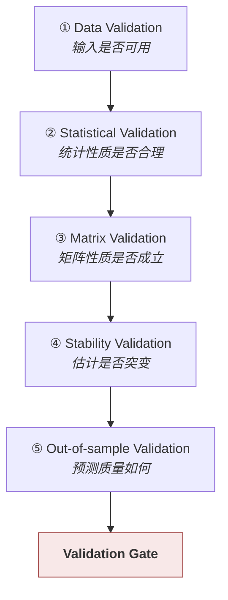

# 估计校验 · Estimation Validation

> 上游文档：docs/01-product/01-product-overview.md（v2.5）｜本文细化环节：**⑤** 支撑
> 业务需求：docs/01-product/02-business-requirements.md（v2.3）§26 Bias Control
> 本域上游：docs/07-return-risk/01-estimation-framework.md（v1.0）
>
> **文档版本**：v1.1 ｜ **产品阶段**：第一阶段

---

## 1. 文档目的与边界

### 1.1 本文档回答什么

> **估计在进入组合决策之前，如何被验证为可用？**

### 1.2 本文档不回答什么

| 不回答 | 归属 |
|---|---|
| 各估计量的公式与方法 | `02` / `03` / `04` |
| 方法注册、参数、预处理 | `05-estimation-methodology` |
| Factor 层的校验 | `04-factor/07-factor-validation` |
| 组合层的回测 | `08-backtest` |
| 策略评价 | `08-backtest` / `13-governance` |

---

## 2. Validation Objective

| # | 目的 |
|---|---|
| 1 | 发现**不稳定**的估计 |
| 2 | 发现**计算错误** |
| 3 | 发现**数据问题** |
| 4 | 比较不同方法 |
| 5 | 度量预测质量 |
| 6 | **阻止无效估计进入优化** |

### 2.1 第 6 项是本文档存在的根本理由

> **校验不是"事后分析"，而是一道 Gate。**

```
估计成功 ≠ 估计可用
    → 必须有一个明确的关卡决定"能否进入优化"
```

（`01` §12.3、本文档 §10）

---

## 3. 五类校验



### 3.1 前四类是**准入校验**，第五类是**质量评估** ⚠️

> **两者的作用时机与后果完全不同。**

| | 前四类（①–④） | 第五类（⑤ Out-of-sample） |
|---|---|---|
| 时机 | **每次估计后，进入优化前** | **周期性回顾**，不阻塞当次决策 |
| 后果 | 不通过 → **阻断** | 不通过 → 触发方法复核 |
| 需要的数据 | 当次估计与历史估计 | **需要等待未来实现值** |

**为什么第五类不能阻塞当次决策**：

```
判断"这次的 μ 估计准不准"需要观察未来 H 期的实际收益
    → 而决策必须在今天做出
    → 因此样本外校验只能评估【方法】的历史表现，不能校验【本次估计】
```

> **混淆两者会导致一个逻辑不可能的要求** —— "本次估计必须通过样本外检验才能使用"。

---

## 4. Data Validation

| 检查 | 说明 | 不通过 |
|---|---|---|
| 输入数据质量状态 | `03-data` 的 `VALID`/`WARNING`/`INVALID` | `INVALID` → `INSUFFICIENT_DATA` |
| **有效观测数** | `T ≥ min_observation_count` | `INSUFFICIENT_DATA` |
| **`T / N` 比值** | 协方差估计的高维小样本判据（`04` §7.1） | `WARNING` 或 `REJECTED` |
| **尾部样本数** | VaR/CVaR 专用（`03` §7.4） | `INSUFFICIENT_DATA` |
| 连续缺失长度 | `05` §7.3 | `WARNING` / `INSUFFICIENT_DATA` |
| Benchmark 可得性 | 超额口径必需 | `INSUFFICIENT_DATA` |
| `R_f` 可得性 | 相关方法必需 | `INSUFFICIENT_DATA` |
| **窗口跨越转型点** | `01` §18.2 | `WARNING` |
| **异常值处理后的观测减少量** | `05` §16 | 显著减少 → `WARNING` |

### 4.1 质量标记必须从输入传递到估计

> 沿用 `03-data/03-data-quality` §3.3 与 `04-factor/07-factor-validation` §3：`WARNING` 数据算出的估计同样标 `WARNING`。

---

## 5. Statistical Validation

### 5.1 取值范围

| 估计量 | 合理范围 | 超出 |
|---|---|---|
| **`σ`** | `> 0` | `≤ 0` → **`ESTIMATION_FAILED`**（`03` §11.1） |
| **`ρ_ij`** | `[−1, 1]` | 超出 → **`ESTIMATION_FAILED`**（计算错误） |
| **`Σ_ii`** | `≥ 0` | `< 0` → `ESTIMATION_FAILED` |
| **VaR / CVaR** | `CVaR ≥ VaR`（同置信水平） | 违反 → `ESTIMATION_FAILED` |
| **`μ`** | 无结构性上下界 | 统计性异常 → `WARNING` |

### 5.2 结构性越界与统计性异常的处理不同

> 沿用 `04-factor/07-factor-validation` §5.2：

| 类型 | 示例 | 处理 |
|---|---|---|
| **结构性越界** | `ρ = 1.3`、`σ < 0` | **`ESTIMATION_FAILED`** —— 必然是实现错误 |
| **统计性异常** | `μ` 年化 80% | **`WARNING`** —— 可能真实，须核查 |

### 5.3 交叉自洽检查

> **相关估计量之间存在数学关系，可互相验证。**

| 关系 | 检查 |
|---|---|
| `Σ_ii` 与 `σ_i²` | 必须相等（`04` §3.2） |
| `ρ_ij` 与 `Σ_ij` | `ρ_ij = Σ_ij / sqrt(Σ_ii Σ_jj)` |
| `Σ RCP` 恒等式 | 属 `06-portfolio/04` §4.1，不在本域 |
| `σ_d ≤ σ` | 通常成立；违反 → `WARNING` |
| `CVaR ≥ VaR` | 定义上必然 |
| **本域 `σ` 与 `04-factor` 的 `F-RISK-001`** | 同窗口同方法下应在容差内一致（`01` §3.1） |

### 5.4 与 `04-factor` 的交叉核对是重要的实现校验 ⚠️

> **两处独立实现算同一个量，比对结果能发现单侧实现的错误。**

```
本域用 Sample Volatility、36M 窗口、252 年化
04-factor 的 F-RISK-001 在同样设定下
    → 两者应在数值容差内一致
    → 不一致说明至少一侧有实现错误（如分母 N vs N−1）
```

> **这是本域少数能做"已知答案测试"的场合**，价值很高。

> **已定案 · 2026-08-27**：交叉核对容差 = **相对 1×10⁻⁶**（Policy A §A.4 的业务比对档）。
>
> **为什么比复现容差（1e-10）松四个数量级**：交叉核对比较的是**两条独立实现路径**的结果 —— 本域的 `risk_estimate` 与 `04-factor` 的 `F-RISK-001`。两者的窗口对齐、缺口处理、年化方式可能有实现层面的细微差异，**这些差异本身是被允许的**（两域各自定义其口径）。
>
> **1e-6 是「口径一致」的判据，不是「实现一致」的判据**：超过它说明两域的口径真的不同（如一方用了 EWMA、另一方用等权），须回到定义层解决；在它之内则说明只是浮点路径不同。
>
> **超差的处理**：不是取其一或取平均，而是**标记 `CROSS_CHECK_FAILED` 并阻断**该估计进入优化。两个不一致的风险度量中，无法判断哪个是对的。

---

## 6. Distribution 与横截面校验

| 检查 | 说明 | 异常信号 |
|---|---|---|
| **估计覆盖率** | 有多少基金的估计可得 | 骤降 → 数据或方法问题 |
| **横截面分布** | `μ`、`σ` 在 Universe 内的分布 | 与历史显著偏移 |
| **`INSUFFICIENT_DATA` 占比** | 不可估计的基金占比 | 骤增 → 上游数据问题 |
| **平均相关水平** | `ρ` 的均值 | 骤变 → 市场状态切换或对齐规则问题 |

### 6.1 覆盖率骤降是最有效的系统性问题探测器

> 沿用 `04-factor/07-factor-validation` §7.2：它能发现单基金校验发现不了的批量问题。

### 6.2 平均相关水平的骤变需要归因 ⚠️

```
本期平均相关从 0.45 升至 0.72
  可能是真实的（市场进入危机状态，相关性上升）
  也可能是对齐规则或缺失填充导致的（05 §6.4）
```

**两者的处置完全不同** —— 前者是需要如实反映的市场事实，后者是需要修复的实现问题。因此告警必须同时报告**观测数与对齐后丢弃的日期数**，使两者可区分。

---

## 7. Matrix Validation

> **执行 `04-correlation-covariance` §10 声明的必检项。**

| 检查 | 判定 |
|---|---|
| 维度与 `μ` 一致 | 不一致 → `REJECTED` |
| 对称性 | 超容差 → `ESTIMATION_FAILED` |
| 对角元 | `Σ_ii ≥ 0`；`ρ_ii = 1` |
| `ρ` 元素范围 | `[−1, 1]` |
| **半正定** | 最小特征值 ≥ −容差；显著负 → `ESTIMATION_FAILED` |
| **条件数** | 超阈值 → `WARNING` / `REJECTED` |
| NaN / Inf | 存在 → `ESTIMATION_FAILED` |
| **`T / N`** | 低于阈值 → `WARNING` |
| **极端相关对** | `\|ρ\| > 阈值` → 上报（`04` §8.2） |

### 7.1 半正定检查必须在投影**之前**执行 ⚠️

```
❌ 先做最近半正定投影 → 再检查半正定 → 必然通过
   → 检查失去意义

✅ 先检查原始矩阵 → 记录最小特征值 → 再按 Policy 决定是否投影
```

**投影后必须重新记录调整幅度**（`04` §14.1）。

---

## 8. Stability Validation

### 8.1 相邻期比较

```
Estimate(t)  vs  Estimate(t−1)
```

> **估计不应出现无法解释的突变。**

### 8.2 不同估计量的稳定性预期不同

| 估计量 | 稳定性预期 | 突变的含义 |
|---|---|---|
| **长窗口 `μ`** | **很高** —— 新增几个观测影响微小 | 几乎必然是数据或实现问题 |
| **`σ`** | 中等 —— 有聚集性但会切换 | 可能真实 |
| **`ρ` / `Σ`** | **较低** —— 市场状态切换时会显著变化 | 需归因 |

> **因此稳定性阈值必须按估计量类型分别配置**，与 `01` §15.1 的新鲜度阈值同理。

> **推荐默认 · 2026-08-27**：单期变动超过**该估计量历史变动的 3 倍标准差**触发稳定性告警。
>
> **用相对判据而非绝对值**：不同基金的 μ、σ 量级差异很大，绝对阈值（如「波动率变动超过 5%」）对低波动基金过松、对高波动基金过严。
>
> **告警不阻断** —— 估计突变可能是真实的市场状态变化。它的作用是提示人去看一眼，而不是替人做判断。

### 8.3 突变的合法原因

| 原因 | 说明 |
|---|---|
| **数据修订** | 上游 NAV 修订产生新 version |
| **窗口滚动** | 极端期滚入或滚出窗口 |
| **Universe 变化** | 成分基金增减改变横截面统计与矩阵维度 |
| **参数或方法变更** | 属配置变更，应可从版本号识别 |

> **突变告警必须关联可能原因**，而非仅报告"发生突变"（沿用 `04-factor/07-factor-validation` §8.3）。

### 8.4 稳定性好不等于估计准 ⚠️

> **这是一处必须澄清的地方。**

```
一个恒定返回历史长期均值的"估计"极其稳定
    → 但它不包含任何新信息
    → 稳定性校验会给它满分
```

**稳定性只用于发现异常，不用于评价方法优劣。** 后者属样本外校验（§9）。

---

## 9. Out-of-sample Validation

### 9.1 基本框架

```
在 T 时点用 available_at ≤ T 的数据产出估计
      ↓
等待 H 期
      ↓
观察 T 到 T+H 的实际实现值
      ↓
比较估计与实现
```

### 9.2 必须严格无前视

> **样本外校验最容易引入前视偏差。**

| 禁止 | 说明 |
|---|---|
| 用今天的方法版本回溯历史 | **版本前视** —— 当时用的可能是另一版方法 |
| 用今天的参数回溯 | **参数前视** |
| 用今天的 Universe | **生存偏差**（`01` §9） |
| 用修订后的历史数据 | 当时看到的是修订前版本 |

> **若不控制这四项，样本外校验的结论会系统性偏乐观** —— 这正是"回测很好、实盘不行"的一类成因。

### 9.3 Forecast Error 指标

| 指标 | 说明 |
|---|---|
| **MAE** | 平均绝对误差 |
| **MSE / RMSE** | 均方误差 / 均方根误差 |
| **MAPE** | 平均绝对百分比误差 —— **见 §9.4** |

```
Validation Metrics = TBD
```

> **推荐默认 · 2026-08-27**：风险估计用 **RMSE**，收益估计用 **MAE**。阈值待实证校准。
>
> **为什么两者不同**：收益估计的误差分布**厚尾** —— 少数极端期的巨大误差会主导 RMSE，使指标反映的是「最差的几期有多差」而非「典型误差有多大」。MAE 对此稳健。风险估计的误差分布相对温和，RMSE 的平方惩罚有助于凸显系统性低估。
>
> **本项的阈值属 `OPEN` 类** —— 须用历史数据实证后确定，见 `TBD-resolution-2.md` §6.3。

### 9.4 MAPE 在收益估计上不适用 ⚠️

```
MAPE = mean(|实际 − 估计| / |实际|)

收益率可以接近 0 甚至为 0
    → 分母趋零使 MAPE 爆炸
    → 一个实际收益 0.01%、估计 0.5% 的样本，MAPE 贡献 4900%
```

**收益估计应使用 MAE / RMSE 等绝对误差指标**，而非百分比误差。

### 9.5 收益估计的样本外表现天然很差 ⚠️

> **这是必须提前建立的预期，否则会导致错误的方法淘汰。**

```
单期收益的信噪比极低
    → 任何收益估计方法的 R² 都会很低
    → 这不代表方法无效
```

**正确的评价方式**：

| 错误 | 正确 |
|---|---|
| 看单次估计的误差 | 看**长期的方向性正确率**与**相对于基准方法的改善** |
| 追求高 R² | 与**等权基线**及**零估计基线**比较 |

> **必须设定基线**：`μ = 0`（无信息）与 `μ = 横截面均值`。若某方法长期不能超越这两个基线，它没有价值。

### 9.6 风险估计的样本外校验更有意义

```
Estimated Volatility  vs  Realized Volatility（未来 H 期实现）
```

> 波动率的可预测性显著高于收益（`03` §2.1），因此风险估计的样本外校验能给出有意义的判据。

**常见判据**：估计值与实现值的比值应围绕 1 分布，系统性偏离说明估计有偏。

### 9.7 VaR 的回测

| 检查 | 说明 |
|---|---|
| **Exception Count** | 实际损失超过 VaR 的次数 |
| **Exception Rate** | 超出次数 / 总期数，应接近 `1 − α` |
| **Coverage Test** | 统计检验超出率是否显著偏离预期 |

```
VaR Backtest Method = TBD
```

> **不自行规定监管标准。** 具体统计检验（如 Kupiec、Christoffersen）及其显著性水平待投研与风控确认。

> **推荐默认 · 2026-08-27**：**Kupiec POF 检验**（比例失败检验），显著性水平 **5%**。
>
> **依据**：Kupiec 检验直接检验「实际突破次数是否与置信水平相符」，是 VaR 回测的标准做法，且不需要额外参数。
>
> **一个已知局限须记录**：POF 检验只看**突破次数**，不看突破是否聚集。连续多日突破与分散突破在该检验下等价，但前者风险显著更高。若将来需要，可补 Christoffersen 独立性检验 —— 但那会引入第二个检验与多重检验问题，第一阶段不引入。

#### 9.7.1 Exception 的聚集性比总数更重要

```
250 期中超出 12 次（预期 12.5 次）→ 总数看起来正常
但若 12 次全部集中在同一周
    → 说明模型在市场压力期完全失效
    → 而这正是最需要它有效的时候
```

**因此 Coverage Test 之外还需检查独立性**（超出是否聚集）。

---

## 10. Validation Gate

### 10.1 只有通过 Gate 的估计可进入优化

```
Validation Status = INVALID / REJECTED
    → 不得作为 Optimization Input
    → 不得降级使用
```

### 10.2 Gate 的判定顺序

```
① 数据校验不通过        → INSUFFICIENT_DATA  → 阻断
② 结构性越界            → ESTIMATION_FAILED  → 阻断 + 告警
③ 矩阵性质不成立        → REJECTED           → 阻断
④ 稳定性突变            → WARNING            → 可用，须标记
⑤ 新鲜度超阈值          → STALE              → 阻断
⑥ 维度未对齐            → 本域负责对齐（01 §6.2）
        ↓
   APPROVED_FOR_USE
```

### 10.3 Gate 不通过时不得降级 ⚠️

> **与 `06-portfolio/03` §8.2「严禁静默降级」是同一条原则。**

```
❌ Σ 校验未通过 → 用上期的 Σ → 继续优化
❌ μ 校验未通过 → 令 μ = 0 → 退化为最小方差
```

**若要沿用上期估计或改用不需要该输入的目标，必须是显式决策并留痕**（`06-portfolio/03` §8.3）。

### 10.4 部分基金不可用时的处理

> **单只基金的估计失败不应阻断整个 Universe。**

```
Fund C 的 σ 校验失败
    → Fund C 移出本次估计范围（记录原因）
    → 其余基金正常
    → 但 Σ 必须重算（维度变化）
```

> **注意 `Σ` 必须重算而非删行删列** —— 删行删列不改变其余元素，但那些元素原本是在含 Fund C 的样本对齐下算出的（`05` §6.3），口径不一致。

---

## 11. Validation Status

| 状态 | 含义 | 可进入优化 |
|---|---|---|
| **`NOT_VALIDATED`** | 尚未校验 | ❌ |
| **`VALID`** | 全部通过 | ✅（配合 `01` §12.3 的其他条件） |
| **`WARNING`** | 通过但存在可疑 | ✅ 须携带标记 |
| **`INVALID`** | 结构性错误 | ❌ **须告警** |
| **`REJECTED`** | 未达校验标准 | ❌ |
| **`INSUFFICIENT_DATA`** | 数据不足 | ❌ |

### 11.1 `INVALID` 与 `INSUFFICIENT_DATA` 必须区分

> 沿用 `04-factor/07-factor-validation` §11.2：前者需修复并告警，后者是正常业务情形。

---

## 12. Minimum Sample Size

```
Minimum Observation Count = TBD
```

### 12.1 不同估计量的最小样本要求不同

| 估计量 | 相对要求 | 理由 |
|---|---|---|
| `μ` | 中 | 均值估计 |
| `σ` | 中 | 二阶矩 |
| **VaR / CVaR** | **高** | 尾部分位需要足够尾部样本（`03` §7.4） |
| **`Σ`** | **最高** | `T` 需显著大于 `N`（`04` §7.1） |

> **已定案 · 2026-08-27**：见 `TBD-resolution-2.md` Policy E §E.2。
>
> | 估计量 | 最小观测数 |
> |---|---|
> | 收益均值 μ | **60** |
> | 波动率 σ | **60** |
> | 相关系数 | **60** |
> | 协方差矩阵 | **`T ≥ 3N`**（比值约束，非固定值） |
> | 95% VaR / CVaR | **250** |
> | 99% VaR / CVaR | **1000** |
>
> **本表是准入校验的一部分**（§3.1 前四类）—— 不满足即 `INSUFFICIENT_DATA`，该估计不产出，**不降级为「低置信估计」**。理由与 `05-fund-evaluation` 的 `INSUFFICIENT_SAMPLE` 相同：带标记的值仍会被下游代码当作数值使用。
>
> **协方差的约束是比值，须单独提示** —— 它随 Universe 规模变化，因此「样本够不够」不能只看年数。

---

## 13. Bias Control

> **沿用 `02-business-requirements` §26。校验本身必须避免以下偏差。**

| 偏差 | 说明 | 本域的防范 |
|---|---|---|
| **Look-ahead Bias** | 使用当时不可得的信息 | `01` §8；样本外校验的四项控制（§9.2） |
| **Survivorship Bias** | 只用存续基金 | `01` §9；使用历史 Universe 快照 |
| **Selection Bias** | 只报告表现好的方法 | §13.1 |
| **Data Snooping** | 反复调参直到结果好看 | §13.2 |

### 13.1 Selection Bias：全部候选方法的结果都要留存

> **只记录最终采用的方法，会使"这个方法是从多少个候选里挑出来的"无法回答。**

```
测试了 20 种参数组合，采用了表现最好的一种
    → 若不记录其余 19 种，读者会以为这是唯一尝试
    → 而"20 选 1 的最优"在统计上远不如"唯一尝试且有效"可信
```

### 13.2 Data Snooping：调参次数本身是信息 ⚠️

> **在同一份历史数据上反复调参，最终必然能找到"表现好"的配置。**

**要求**：

| # | 要求 |
|---|---|
| 1 | 参数搜索的**范围与次数**必须记录 |
| 2 | 最终配置应在**独立时段**上验证（样本外的样本外） |
| 3 | **不得以"回测组合表现好"倒推"估计准确"**（上游 ⑤-B 明确） |

### 13.3 上游的明确禁止

> **上游 ⑤-B**：估计方法「有独立的稳定性评估流程（`07-return-risk`），**不得以"回测组合表现好"倒推"估计准确"**」。

**理由**：组合表现受权重规则、约束、换手成本等多重因素影响，把它归因于估计质量是一个无法成立的推断。**估计质量必须独立评估。**

---

## 14. Validation Output

| 字段 | 说明 |
|---|---|
| `validation_id` | 标识 |
| **`estimate_id`** | 被校验的估计 |
| **`validation_status`** | §11 |
| **逐条规则结果** | `rule_id` / `metric` / `actual_value` / `threshold` / `result` |
| **`failed_rules`** | 未通过的**全部**规则（不短路） |
| `warnings` | 触发的警告及原因 |
| **矩阵诊断量** | `min_eigenvalue` / `condition_number` / `T`、`N` |
| **交叉核对结果** | 与 `04-factor` 的偏差 |
| `validation_timestamp` | 校验时刻（运维用，非业务时点） |
| **`validation_policy_version`** | 政策版本 |

### 14.1 不得短路：全部规则都要校验

> 沿用 `05-fund-evaluation/05` §14.4：遇到第一个失败就返回，会丢失"还违反了哪些"，使排查失去依据。

---

## 15. Validation Policy

| 字段 | 说明 |
|---|---|
| `policy_id` / `version` | 标识与版本 |
| `effective_from` / `effective_to` | 生效区间 |
| `status` | `DRAFT` / `ACTIVE` / `DEPRECATED` / `RETIRED` |
| **`rules`** | 校验规则集（含阈值） |
| **`gate_rules`** | 哪些规则构成阻断条件（§10.2） |
| **`stability_thresholds`** | 按估计量类型（§8.2） |
| **`min_sample_sizes`** | 按估计量类型（§12.1） |
| **`matrix_thresholds`** | 特征值容差、条件数、`T/N` |
| **`oos_metrics` + `baselines`** | 样本外指标与基线（§9.5） |
| `var_backtest_method` | VaR 回测方法 |
| `cross_check_tolerance` | 与 `04-factor` 的核对容差 |

### 15.1 Validation Policy 不在九项 Strategy Version 之内

> **已在 `01` §14.3 登记为缺口。**

```
校验阈值放宽后，原本被拒的估计会通过并进入优化
    → 但快照中无任何字段记录这次变更
```

**当前缓解**：`validation_policy_version` 随校验结果落库；缺的是决策快照层面的登记（`TBD-EF-5`）。

---

## 16. Edge Cases

| 情形 | 处理 |
|---|---|
| 全部基金校验失败 | **阻断**，且这是系统问题信号，须告警 |
| 部分基金失败 | 移出并**重算 `Σ`**（§10.4），不删行删列 |
| 校验规则本身依赖的数据不可得 | 该规则 `NOT_AVAILABLE` → **视为不通过**，不得跳过 |
| 半正定检查在投影后执行 | **配置错误**（§7.1） |
| 样本外校验数据尚未到期 | 该项**暂不评估**，不阻塞当次决策（§3.1） |
| 稳定性突变但可归因于 Universe 变化 | `WARNING` 并标注原因（§8.3） |
| 估计通过校验但已 `STALE` | 不可用（`01` §15） |
| 交叉核对与 `04-factor` 偏差超容差 | **`INVALID`** —— 至少一侧实现有误（§5.4） |

### 16.1 规则依赖的数据不可得时不得跳过 ⚠️

> **与 `06-portfolio/05` §6.3、`06-portfolio/04` §7.3 是同一条原则。**

```
❌ 条件数算不出来 → 跳过该检查 → 视为通过
   → 把"没检查"当作"检查通过"
```

---

## 17. Auditability

> 本域审计总纲见 `01-estimation-framework` §19。

### 17.1 校验历史必须保留

> 与 `06-portfolio/05` §14.2 同理：

```
只保留当前状态："全部通过"
保留历史：       "条件数在过去 6 个月中有 4 次接近阈值"
    → 后者才能回答"阈值是否设置合理""是否有趋势性劣化"
```

### 17.2 被拒绝的估计必须留痕

> `REJECTED` / `INSUFFICIENT_DATA` 的估计必须记录状态与原因，否则"为什么这只基金没进优化"无法回答（`01` §19.2）。

### 17.3 方法比较与参数搜索的完整记录

> §13.1、§13.2 的要求 —— 全部候选方法的结果、参数搜索的范围与次数，都是判断结论可信度的必要信息。

---

## 18. Reproducibility

```
Estimate（含其全部版本引用）
+ Validation Policy Version（规则与阈值）
+ 校验时可得的历史估计序列（稳定性校验所需）
        ↓
    相同的校验结论
```

### 18.1 校验结论的可复现依赖"当时的阈值"

> **阈值放宽后重跑历史校验，会得到与当时不同的结论。**

```
当时：条件数 850，阈值 500 → REJECTED
今天：阈值放宽至 1000 → 同一矩阵变为 VALID
    → 若不记录 validation_policy_version，历史决策无法解释
```

**因此 `validation_policy_version` 必须随每条校验结果落库**，而非只记录最新政策。

### 18.2 稳定性校验的可复现需要历史估计序列

> 它比较 `Estimate(t)` 与 `Estimate(t−1)`，因此复现某次稳定性校验需要**当时可见的历史估计**。

```
若历史估计被后续重算覆盖
    → 稳定性校验的结论不可复现
```

**这与 `06-portfolio/06` §17.2 的路径依赖是同一类问题** —— 结论依赖历史状态，因此历史状态必须不可变。

### 18.3 样本外校验的可复现有额外要求

> 它需要"当时的估计"与"其后的实现值"两者。前者必须未被覆盖，后者必须使用**当时看到的**数据版本而非修订后的（§9.2）。

---

## 19. Summary

校验是一道 **Gate**，不是事后分析。

三条结构性区分：

- **前四类是准入校验、第五类是质量评估** —— 样本外校验需要等待未来实现值，因此**不能校验本次估计**，只能评估方法的历史表现；要求"本次估计通过样本外检验才能使用"是逻辑上不可能的
- **稳定性好不等于估计准** —— 一个恒返回长期均值的"估计"极其稳定却不含任何信息；稳定性只用于发现异常，不用于评价方法优劣
- **`INVALID`（算错了）与 `INSUFFICIENT_DATA`（没法算）必须区分** —— 前者需修复并告警

三处评价方法的判断：

- **收益估计的样本外表现天然很差** —— 单期收益信噪比极低，任何方法的 R² 都低；必须与 `μ = 0` 和横截面均值两个基线比较，而非追求高 R²
- **MAPE 在收益估计上不适用** —— 收益率可以接近 0，分母趋零使指标爆炸
- **VaR 的 Exception 聚集性比总数更重要** —— 250 期超出 12 次看似正常，但若全部集中在同一周，说明模型在最需要它有效时完全失效

三条防止自欺的要求：

- **不得以"回测组合表现好"倒推"估计准确"**（上游明确）—— 组合表现受权重规则、约束、成本等多重因素影响，归因于估计质量无法成立
- **全部候选方法的结果都要留存** —— "20 选 1 的最优"在统计上远不如"唯一尝试且有效"可信
- **规则依赖的数据不可得时不得跳过** —— 把"没检查"当作"检查通过"

一处执行顺序要求：**半正定检查必须在投影之前** —— 否则检查必然通过，失去意义。

---

## 20. Decisions

| # | 决策 | 理由 |
|---|---|---|
| D-1 | **前四类校验阻断、第五类不阻塞当次决策** | 样本外校验需等待未来实现值 |
| D-2 | 结构性越界判 `ESTIMATION_FAILED`，统计性异常判 `WARNING` | 沿用 `04-factor` 的原则 |
| D-3 | **与 `04-factor` 的交叉核对纳入校验** | 少数能做"已知答案测试"的场合 |
| D-4 | **半正定检查必须在投影之前执行** | 否则检查必然通过 |
| D-5 | **稳定性阈值按估计量类型分别配置** | 长窗口 `μ` 与 `ρ` 的稳定性预期差异很大 |
| D-6 | **稳定性只用于发现异常，不用于评价方法** | 恒定值最稳定但无信息 |
| D-7 | **收益估计必须与零估计和横截面均值两个基线比较** | 单期收益信噪比极低，绝对误差无参照 |
| D-8 | **收益估计不使用 MAPE** | 分母趋零使指标爆炸 |
| D-9 | **VaR 回测须同时检查超出的独立性** | 聚集的超出比总数超标更危险 |
| D-10 | **Gate 不通过不得降级** | 与"严禁静默降级"同一原则 |
| D-11 | **部分基金失败时 `Σ` 必须重算而非删行删列** | 剩余元素的样本对齐口径已改变 |
| D-12 | **规则依赖的数据不可得时视为不通过** | "没检查"≠"检查通过" |
| D-13 | 全部规则都要校验，**不短路** | 否则丢失"还违反了哪些" |
| D-14 | **候选方法与参数搜索次数必须记录** | 防 Selection Bias 与 Data Snooping |

---

## 21. Constraints

| # | 约束 | 来源 |
|---|---|---|
| C-1 | **只有通过 Gate 的估计可进入优化** | 本文档 §10.1 |
| C-2 | **不得以"回测组合表现好"倒推"估计准确"** | 上游 ⑤-B |
| C-3 | 样本外校验必须严格无前视（含版本与参数前视） | 上游 §4.2 ①-PIT、`02-business-requirements` §26 |
| C-4 | 必须使用历史 Universe 快照，含已清盘基金 | `02-business-requirements` §26.2 |
| C-5 | 质量标记必须从输入传递到估计 | `03-data/03-data-quality` §3.3 |
| C-6 | `INVALID` / `INSUFFICIENT_DATA` 的估计不得进入优化 | 本文档 §11 |
| C-7 | 本域**不引入** ML 作为校验手段 | 上游 §6.2.1 |
| C-8 | 校验不通过时不得降级或静默沿用上期估计 | `06-portfolio/03` §8.2 |

---

## 22. TBD

| # | 事项 | 影响 | 责任方 |
|---|---|---|---|
| ~~EV-1~~ | ~~与 `04-factor` 交叉核对的数值容差~~ —— **已定案**：见 Policy A 数值容差体系 | — | ✅ 2026-08-27 |
| ~~EV-2~~ | ~~各估计量的稳定性突变阈值~~ —— **推荐默认**：估计量单期变动超过 3 倍历史标准差触发稳定性告警 | — | ✅ 2026-08-27 |
| ~~EV-3~~ | ~~预测误差指标与判定阈值~~ —— **推荐默认**：预测误差指标 = RMSE（风险）与 MAE（收益） | — | ✅ 2026-08-27 |
| ~~EV-4~~ | ~~VaR 回测的统计检验方法与显著性水平~~ —— **推荐默认**：VaR 回测 = Kupiec POF 检验，显著性 5% | — | ✅ 2026-08-27 |
| ~~EV-5~~ | ~~各估计量的最小样本量~~ —— **已定案**：见 Policy E 最小样本量体系 | — | ✅ 2026-08-27 |
| EV-6 | 样本外校验的评估周期与方法淘汰规则 | 方法治理 | 投研 |
| EV-7 | Gate 各项的具体阈值 | 校验无法投产 | 投研 + 技术 |

---

## 23. Related Documents

| 关系 | 文档 |
|---|---|
| **上游** | `01-product/01-product-overview.md` v2.5（§4.2 ⑤-B "不得以回测倒推估计准确"）、`02-business-requirements.md` v2.3（§26 Bias Control） |
| **本域** | `01-estimation-framework`（状态与 Gate 的关系）、`02` / `03` / `04`（被校验的估计）、`05-estimation-methodology`（预处理留痕） |
| **参照** | `04-factor/07-factor-validation`（校验体系的结构与原则；交叉核对对象） |
| **下游** | `06-portfolio/03`（只消费 `APPROVED_FOR_USE` 的估计）、`08-backtest`（样本外校验与回测的边界） |

---

## 24. Change Log

| 版本 | 日期 | 变更内容 | 上游依赖 |
|---|---|---|---|
| **v1.1** | 2026-08-27 | **第二批定案（5 项）**。`EV-1` 交叉核对容差 **1e-6**，并厘清它是「口径一致」而非「实现一致」的判据；超差**阻断**不取平均；`EV-5` 最小样本量表见 Policy E，**协方差的约束是比值 `T ≥ 3N`**，「样本够不够」不能只看年数；`EV-2`/`EV-3`/`EV-4` 推荐默认（3 倍标准差告警、风险用 RMSE 收益用 MAE、Kupiec POF 5%）。 详见 `TBD-resolution-2.md` | `TBD-resolution-2.md` v1.0 |
| v1.0 | 2026-08-26 | 初始版本。**§3.1 前四类是准入校验、第五类是质量评估**——样本外校验不能校验本次估计，要求其阻塞当次决策是逻辑不可能；**§5.4 与 `04-factor` 的交叉核对**是少数能做已知答案测试的场合；**§6.2 平均相关水平骤变需区分市场事实与实现问题**；**§7.1 半正定检查必须在投影之前**；**§8.2 稳定性阈值按估计量类型分别配置**、**§8.4 稳定性好不等于估计准**；**§9.4 MAPE 在收益估计上不适用**、**§9.5 收益估计样本外表现天然很差**须与两个基线比较；**§9.7.1 VaR Exception 的聚集性比总数更重要**；**§10.4 部分基金失败时 `Σ` 必须重算而非删行删列**；**§13 Bias Control 四类**含 Selection Bias 与 Data Snooping 的具体要求；**§13.3 沿用上游"不得以回测组合表现好倒推估计准确"**；**§16.1 规则依赖的数据不可得时不得跳过**；**§18 可复现性**——校验结论依赖当时的阈值与当时可见的历史估计序列，历史状态必须不可变 | `01-product-overview.md` v2.5、`04-factor/07-factor-validation.md` v1.1、`06-portfolio` v1.0 |