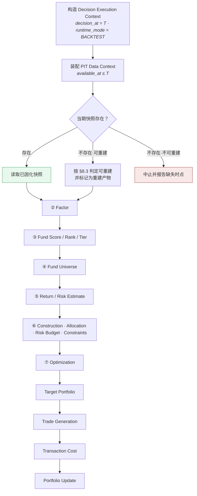

# 回测引擎 · Backtest Engine

> 上游文档：docs/01-product/01-product-overview.md（v2.5）｜本文细化环节：**⑧ Backtest**
> 业务需求：docs/01-product/02-business-requirements.md（v2.3）§21 Backtesting
> 架构依赖：docs/02-architecture/01-system-architecture.md（v2.2）§11 Backtest Architecture
>
> **文档版本**：v1.1 ｜ **产品阶段**：第一阶段

---

## 1. 文档目的与边界

### 1.1 本文档回答什么

> **回测如何在历史时间轴上重放投资决策过程？**

### 1.2 Backtest 是 Runtime，不是流程步骤 ⚠️

> **这是本域最重要的一条认知**（架构 §11.1、上游 §5.4）。

```
❌ 把回测理解为：
   历史数据 → 计算收益 → 称之为回测

✅ 正确理解：
   历史时间轴 → 重放决策过程 → 重建组合 → 模拟执行 → 度量结果
```

**回测与实盘是同一套 Strategy Domain Logic 的两种运行模式**，差异**只允许存在于数据源与时间轴**。

### 1.3 本域不重新实现任何业务规则

| 本域**不实现** | 归属 |
|---|---|
| Factor 计算 | `04-factor` |
| Peer Group / Fund Score / Ranking / Tier | `05-fund-evaluation` |
| Fund Universe 构建 | `05-fund-evaluation/05` |
| Return Estimate / Risk / Correlation / Covariance | `07-return-risk` |
| Portfolio Construction / Allocation / Optimization / Risk Budget / Constraints | `06-portfolio` |
| Rebalancing Policy | `06-portfolio/06` |
| Transaction Cost 模型 | **`05-transaction-cost`**（本域） |

> **违反信号**：`backtest-service` 内出现因子公式、评分权重合成、优化目标函数的实现代码（架构 §11.5）。

### 1.4 本文档不回答什么

| 不回答 | 归属 |
|---|---|
| 测什么、如何解读结果 | `02-backtest-methodology` |
| 前视偏差的识别与防范 | `03-look-ahead-bias` |
| 幸存者偏差的控制 | `04-survivorship-bias` |
| 交易成本模型 | `05-transaction-cost` |
| 报告结构 | `06-backtest-report` |

---

## 2. 本域六份文档与上游 Stage 的映射

> **本域六份文档不是六个新 Stage。** 上游 §4.0 规定 Stage 恰好 10 个，本域承载 **⑧ Backtest**。

| 本域文档 | 职责 |
|---|---|
| `01-backtest-engine` | 执行历史模拟 |
| `02-backtest-methodology` | 测什么、如何度量与解读 |
| `03-look-ahead-bias` | 防止未来信息泄露 |
| `04-survivorship-bias` | 防止当前样本偏差 |
| `05-transaction-cost` | 建模真实交易成本 |
| `06-backtest-report` | 定义输出与报告结构 |

---

## 3. Backtest vs Historical Analysis ⚠️

| | **Historical Analysis** | **Backtest** |
|---|---|---|
| 回答 | **发生了什么？** | **若当时应用该策略，会发生什么？** |
| 对象 | 基金的实际历史收益 | 策略在历史上**实际可投资**的组合收益 |
| 是否重放决策 | 否 | **是** |
| 是否受 PIT 约束 | 弱 | **强制** |

```
Historical Fund Return  = Fund A 过去 3 年涨了 X%
Backtest Return         = 若当时按规则选基并配权，组合涨了 X%
```

> **两者不可混淆。** 前者不受"当时能否知道""当时能否买到"的约束，后者必须严格受此约束。

---

## 4. Backtest vs Live Portfolio

> **沿用上游 §5.4 的强制规则：单一策略实现原则。**

| 维度 | Backtest | Live Portfolio |
|---|---|---|
| 数据源 | 历史数据快照（PIT） | 实时数据 |
| 时间轴 | 在历史上按调仓日逐期推进 | 沿真实时间前进 |
| **策略逻辑** | **与实盘完全相同** | **与回测完全相同** |
| 输出 | 绩效报告，用于验证 | 调仓指令，用于执行 |

### 4.1 Strategy Execution Interface 的四条约束

> 沿用架构 §11.2：

| # | 约束 |
|---|---|
| **SEI-1** | 领域逻辑**只通过注入的 Data Context 访问数据**，不自行建立数据连接 |
| **SEI-2** | 领域逻辑**不感知 `runtime_mode`** —— 它不知道自己运行在回测还是实盘 |
| **SEI-3** | 领域逻辑中**不得存在**任何"是否回测"的策略分支 |
| **SEI-4** | Live 与 Backtest 的差异**全部体现在注入的参数上**（`decision_at` 与 Data Context），不在逻辑内部 |

> **任何 `if (is_backtest)` 形式的分支都是原则的破坏信号，必须在 code review 中拒绝**（上游 §5.4）。

### 4.2 为什么必须共用一套实现

> **如果存在两套实现，回测结果对实盘就失去了参考意义** —— 实盘表现不及预期时，无法区分是**策略失效**还是**实现不一致**。这类问题在实践中极难定位。

---

## 5. Backtest Timeline

### 5.1 逐期推进

```
Decision Date T
     ↓  只使用 available_at ≤ T 的数据
执行完整策略链路（② → ⑦）
     ↓
Target Portfolio → 交易生成 → 交易成本
     ↓
Portfolio Held
     ↓
Next Rebalance Decision Point  T+n
     ↓  n 由 Rebalance Trigger 决定，【不是固定值】
重新执行策略
```

### 5.2 `T+n` 的 `n` 不是固定时间单位 ⚠️

> **沿用 `02-business-requirements` §21.2 与架构 §11.6。**

| 触发类型 | `n` 的确定 |
|---|---|
| **Periodic** | 由配置的调仓频率决定 |
| **Drift** | 权重偏离超阈值的那一天 |
| **Eligibility Event** | 成分基金失去可投资性的那一天 |
| **Constraint Breach** | 触碰约束上限的那一天 |

> **因此回测中各期持有时长不均等** —— 这是引擎必须支持的特性，不是可简化的等间隔循环。

### 5.3 非调仓日仍需推进估值

> **决策点是离散的，估值是连续的。**

```
调仓决策发生在 T、T+n、T+m…
但组合净值必须【每个交易日】重估
    → 否则无法计算日频收益序列
    → 也无法检测 Drift 触发（06-portfolio/06 §4）
```

**两条时间线必须分开**：**决策时间线**（离散、不均等）与**估值时间线**（逐交易日）。

---

## 6. Backtest Period

| 参数 | 取值 |
|---|---|
| **Start Date** | `TBD` |
| **End Date** | `TBD` |
| **Evaluation Frequency** | `TBD` |
| **Rebalancing Frequency** | 复用 `06-portfolio/06` 的 `Rebalancing Policy` |

> **以上参数当前为 TBD，投产前必须由业务负责人确认。**

> **推荐默认 · 2026-08-27**：默认回测区间 = **近 8 年**，默认调仓频率 = **季度**（同 `P1-16`）。业务方可改。
>
> **8 年的依据**：可覆盖至少一轮完整市场周期（含牛熊转换），且在 `BM-1` 的 70:30 划分下留出约 2.4 年的 OOS 段，满足 `BM-5` 的最小 OOS 样本期 1 年。
>
> **须扣除 Warm-up**（§5.3）：实际有效区间 = 8 年 − Warm-up。若因子最长窗口为 5Y，Warm-up 会吃掉 5 年，剩余不足 `BM-2` 要求的 3 年 —— **此时须延长回测区间而非缩短窗口**。这一联动在配置回测时必须倒推核对。

### 6.1 Start Date 不等于第一个组合产生日

> **见 `02-backtest-methodology` §5 Warm-up Period。**

```
Backtest Start = 2020-01-01
Return Estimate 需要 36M 历史
    → 第一个可产出组合的决策日是 2023-01-01
    → 2020–2022 是 Warm-up，不产生组合
```

### 6.2 回测区间应覆盖不同市场环境

> 沿用 `02-business-requirements` §21.9：区间应覆盖上涨、下跌、震荡，否则无法判断策略的环境依赖性。

---

## 7. Initial Portfolio

| 项 | 说明 | 取值 |
|---|---|---|
| **Initial Capital** | 初始资金 | `TBD` |
| **Initial Holdings** | 初始持仓 | 第一阶段为空（全现金起步） |
| **Initial Cash** | 初始现金 | = Initial Capital |
| **Initial Weight** | 初始权重 | 全部为 0 |

> **已定案 · 2026-08-27**：`Initial Capital` = **1 亿元**；第一阶段**不支持带初始持仓的回测**。
>
> **金额量级只影响成本占比的呈现，不影响策略结论** —— 除非触及最小交易金额或容量限制。1 亿是公募 FOF 的典型规模量级，使成本占比落在真实区间。
>
> **不支持带初始持仓的两个理由**：①须建模持仓的**成本基础**（用于赎回费的持有期阶梯，见 `TC-3`），而历史成本基础往往不可得；②带初始持仓的回测本质是**实盘迁移场景**的模拟，其目的与「评估策略」不同 —— 前者问「从现在这个组合出发该怎么调」，后者问「这个策略历史上表现如何」。混在一起会让结论难以解释。

### 7.1 首期建仓使用 `INITIAL` 模式

> **沿用 `06-portfolio/01` §11.2 与 `06-portfolio/05` §8：**

```
首期 Turnover = 50%（单边口径）
    → 换手率约束【不适用】于 INITIAL 模式
    → 否则第一期必然不可行，回测无法启动
```

> **这是回测启动最容易踩的坑** —— 若把换手率约束一律施加，回测在第一个决策日就返回 `INFEASIBLE`。

---

## 8. Investment Universe

### 8.1 必须使用历史时点 Universe

```
❌ Universe(current)
✅ Universe(T)  —— 该决策日当时的候选池
```

（详见 `04-survivorship-bias`）

### 8.2 快照优先原则（已定案）

> **沿用架构 §11.4：回测优先读取当期已固化的快照，仅在快照不存在且满足可重建条件时才允许重建。**

| 场景 | 处理 | 理由 |
|---|---|---|
| **快照存在** | **直接读取** | 严格可复现；天然避免幸存者偏差 |
| 快照不存在，PIT 数据完整 | 重建，**并标记为"重建产物"** | 可用但可信度低于快照 |
| 快照不存在，PIT 数据不完整 | **中止回测并报告缺失时点** | 强行推算会引入不可见的偏差 |

> **为什么快照优先**：重建依赖"所有上游历史数据都完整"这一前提。任一环节的历史数据缺失或被覆盖，重建结果就会与当时不同 —— **而这种不同在结果中不可见**。快照是当时状态的直接证据，重建是间接推断。

### 8.3 可重建条件的判定（落实 `TBD-ARCH-14`）⚠️

> **架构 §11.4 给出了三档处理，但未定义"PIT 数据完整"的具体判据。本节予以定义。**

**可重建的五项必要条件，全部满足才允许重建**：

| # | 条件 | 判据 |
|---|---|---|
| **R-1** | **数据完整性** | 该决策日所需的全部上游数据存在且 `available_at ≤ T` 的版本可查 |
| **R-2** | **数据未被不可逆覆盖** | 修订历史完整（`03-data/04-data-versioning`），能取到 `T` 时点当时的 `version` |
| **R-3** | **生命周期完整** | 该时点存续的基金（含后已清盘者）都在数据中（`04-survivorship-bias` §4） |
| **R-4** | **配置版本可解析** | 当时生效的全部 Policy 版本可查且定义未被删除 |
| **R-5** | **重建结果可自检** | 若同期存在**部分**快照（如有 Universe 无 Peer Group），重建结果须与已有部分一致 |

**任一条件不满足 → 中止回测并报告缺失时点，不得降级为"尽力重建"。**

### 8.4 重建产物必须在报告中标记

> **重建与快照的可信度不同，混在一起呈现会误导。**

```
Backtest Report 必须报告：
  快照期数     : X / N
  重建期数     : X / N
  重建期的清单 : [T1, T5, T12…]
```

> **重建期占比超过阈值时，整个回测的 Validation Status 应降级**（`06-backtest-report` §12）。

> **推荐默认 · 2026-08-27**：重建期占比 **> 10% 降级 WARNING**，**> 30% 判 `NOT_VERIFIED`**。业务方可改。
>
> **依据**：与 `03-data/01-data-source` `OPEN-8` 的 `INFERRED` 占比降级同档设计 —— **报告内各类降级阈值应保持一致的严格度**，否则使用者无法形成统一的可信度直觉。
>
> **重建期的含义**（`01-backtest-engine` §8.3）：快照缺失时按五项条件 R-1~R-5 重建。重建结果满足全部条件才可用，但**重建本身就意味着当时的状态是推断的而非记录的**。
>
> **30% 的门槛**：超过三分之一的期数依赖重建，回测已不能称为「基于历史快照」，其结论的性质发生了变化。

---

## 9. Decision Cycle

> **每个 Backtest Decision Date 执行的完整链路。**



### 9.1 每一步都必须经 Strategy Execution Interface

> **引擎负责编排与注入，不负责计算**（架构 §11.5）。

---

## 10. Execution Price

```
Backtest Trade Price = TBD
```

> **本参数当前为 TBD，投产前必须由业务负责人确认。**

### 10.1 候选与各自的隐含假设

| 候选 | 隐含假设 | 风险 |
|---|---|---|
| **决策日 NAV** | 决策当天即可按当日净值成交 | **构成前视** —— 决策日收盘净值在决策时点尚未公布 |
| **次日 NAV** | 决策后下一交易日成交 | 更接近现实；引入一日滞后 |
| **T+n NAV** | 按实际申赎确认规则 | 最真实；需要各基金的确认规则数据 |

### 10.2 用决策日 NAV 成交是一种隐蔽的前视 ⚠️

> **这是回测中最常见、也最容易被忽略的前视形式。**

```
决策日 T 收盘后才公布 T 日净值
  若回测在 T 日用 T 日净值决策【并】用 T 日净值成交
    → 决策时点实际上已"看到"了当日收盘结果
    → 相当于用当天涨跌决定当天买入
```

**正确做法**：决策使用 `available_at ≤ T` 的净值（通常是 `T−1` 或更早），成交使用**决策之后**才确定的价格。

### 10.3 基金申赎的确认时滞是真实约束

> **基金不是股票 —— 申购/赎回有确认日与到账日。**

```
申购：T 日提交 → T+1 确认份额 → 按 T 日或 T+1 日净值
赎回：T 日提交 → T+n 确认 → T+m 到账（m 可能是 3–7 天）
```

> 上游 §4.2 ⑧ 关键约束明确要求处理**"基金的申赎限制与到账时滞"**。第一阶段是否建模该时滞待确认；**若不建模，必须在报告中显式声明这一简化**。

> **已定案 · 2026-08-27**：执行价格 = **调仓日次日净值（T+1）**；建模**申购确认 T+1、赎回到账 T+2**。
>
> **依据 —— 用当日净值即前视**：
>
> ```
> 基金净值在【当日收盘后】才公布
>     → T 日做决策时，T 日净值不可得
>     → 用 T 日净值成交 = 用了决策时不知道的价格
>     → 这是前视偏差，且【在净值曲线上不可见】
> ```
>
> **T+1/T+2 是公募基金的实际规则**，不是保守假设：T 日提交申购，按 T 日净值确认（但 T 日净值 T+1 才知道），份额 T+1 可用；赎回资金 T+2 到账。
>
> **一个连带后果**：调仓不是瞬时的，卖出与买入之间存在资金在途期。这正是 `PC-5` 必须允许持有现金的原因。
>
> **QDII 等 T+2 确认的品种须单独配置** —— 其时滞更长，用统一的 T+1 会低估执行摩擦。

---

## 11. Portfolio State

> **每个估值时点维护的完整状态。**

| 字段 | 说明 |
|---|---|
| **`cash`** | 现金余额 |
| **`holdings`** | 逐基金的持有份额 |
| **`market_value`** | 逐基金的市值 |
| **`portfolio_value`** | 组合总值 |
| **`weights`** | 逐基金权重（由市值导出） |
| `unrealized_pnl` | 未实现损益 |
| `realized_pnl` | 已实现损益 |
| `cumulative_transaction_cost` | 累计交易成本 |
| **`pending_execution`** | 已下达未确认的调整（若建模时滞） |
| **`frozen_holdings`** | `NOT_TRADABLE` 的冻结持仓 |

### 11.1 持有份额是主，权重是导出量 ⚠️

> **这是回测状态设计的一处关键选择。**

```
❌ 只维护权重
   → 净值波动后权重自动漂移，但无法反推持有份额
   → 交易数量无法计算，成本无法准确计入

✅ 维护份额，权重由 (份额 × 净值) / 组合总值 导出
   → 漂移是份额不变、净值变化的自然结果
   → 交易 = 份额变化，成本按交易金额计
```

---

## 12. Portfolio Valuation

```
Portfolio Value = Cash + Σ (Holding_i × NAV_i)
```

### 12.1 估值使用哪一天的净值

> **估值日 `d` 的组合价值必须使用 `d` 日的净值** —— 这与决策的 PIT 要求不同。

```
决策（前瞻性行为）：只能用 available_at ≤ T 的数据
估值（事后记账）  ：使用估值日当天的实际净值
```

> **两者不矛盾** —— 估值是对"当时实际持有了什么、值多少"的记录，不是决策。但**估值结果不得反过来用于同日的决策**。

### 12.2 净值缺失时的估值

| 情形 | 处理 |
|---|---|
| 个别交易日缺净值 | 沿用最近可得净值（**须标记**） |
| 连续缺失超阈值 | 该期估值标 `WARNING` |
| 基金已清盘 | 见 `04-survivorship-bias` §5 |

> **已定案 · 2026-08-27**：估值时净值缺失 = **沿用最近可得净值**并标记该期 `STALE_VALUATION`；**连续超过 5 个交易日则中止回测**。
>
> **依据 —— 估值必须每期有值，但沿用须留痕**：
>
> ```
> 组合估值不能有空缺（否则净值曲线断裂，全部绩效指标不可算）
>     → 必须填一个值
>     → 唯一不引入前视的选择是【沿用最近可得】
>
> 但沿用会低估波动率（人为增加零收益期）
>     → 因此必须标记，并在报告中呈现 STALE 期占比
> ```
>
> **与 `07-return-risk/05` `EM-2`「缺口不填充」不矛盾**：那里是**估计**场景，剔除该期即可；这里是**估值**场景，组合在那一天确实有价值，不能剔除。**两个场景对同一现象的处理不同，因为它们的输出物不同。**
>
> **5 个交易日的门槛**与 Policy E 的缺口告警阈值一致。超过则说明数据源已不可用，继续回测只会产出一条虚假平滑的净值曲线。

---

## 13. Return Calculation

> **复用 `04-factor` 与 `03-data` 的既有定义，不新建。**

| 指标 | 定义来源 |
|---|---|
| Period Return | `03-data/05-data-normalization` §6 |
| Cumulative Return | `04-factor/03-factor-definition`（`F-RET-002`） |
| Annualized Return | `04-factor/03-factor-definition`（`F-RET-001`），年化因子 **252** |

### 13.1 组合收益基于组合净值序列

```
组合净值序列 = Portfolio Value 的时间序列（已扣交易成本）
组合收益     = 该序列的收益率
```

> **不是成分基金收益的加权平均** —— 后者忽略了交易成本、现金拖累与期内权重漂移。

---

## 14. Cash Treatment

```
Cash Return Assumption = TBD
```

### 14.1 三种候选及其影响

| 方案 | 说明 | 影响 |
|---|---|---|
| **零收益** | 现金不产生收益 | 现金拖累被**高估**（现实中活期仍有微利） |
| **`R_f` 收益** | 按无风险利率计息 | 更接近现实；须使用 PIT 的 `R_f`（`03-data` §3.1.5） |
| **货币基金收益** | 按某货币基金净值 | 最真实，但引入一只额外标的 |

> **已定案 · 2026-08-27**：现金收益 = **0**。
>
> **依据**：①第一阶段不引入货币基金作为现金替代品，因此组合中的「现金」就是**不产生收益的待投资金**；②假设正收益需要一个利率口径（用 `R_f`？用货币基金收益率？），而**这个口径的选择会直接影响持币策略的表现**，属于需要论证的决策而非默认假设。
>
> **零收益假设的方向是保守的** —— 它会让优化器倾向于少持现金，使回测结果不会因「假装现金也在赚钱」而虚高。
>
> **将来引入货币基金替代现金时**，那是一个正常的 Universe 成员，走完整的评价与选基流程，而不是给「现金」这个特殊科目加收益率。

### 14.2 现金比例本身是一个结果，不是配置

> 若组合允许持有现金（`06-portfolio/01` §10.2），现金权重由优化结果与交易残值共同决定，**回测不得为凑满 100% 而人为调整现金**。

---

## 15. Rebalancing

> **回测调用 `06-portfolio/06-rebalancing` 的 Policy，不在本域重新定义。**

| 本域负责 | `06-portfolio/06` 负责 |
|---|---|
| 在历史时间轴上**推进**到下一个 Decision Point | **定义**触发条件与阈值 |
| 提供 `Actual`（回测中的模拟实际持仓） | 定义 Drift 计算与四个阈值 |
| 执行生成的交易 | 定义换手率口径与成本收益判据 |

### 15.1 回测中的三态简化

> **`06-portfolio/06` §2 的三态在回测中的对应：**

| 实盘 | 回测中的对应 |
|---|---|
| `Target Portfolio` | 优化产出的目标权重 |
| **`Pending Execution`** | **仅在建模申赎时滞时存在**；否则为空 |
| `Actual Portfolio` | 模拟成交后的持仓 |

> **若不建模时滞，`Pending` 恒为空，交易即时完成** —— 这是一个简化，**必须在报告中声明**（`06-backtest-report` §14）。

---

## 16. Transaction Cost

> **调用 `05-transaction-cost`，本文档不重复定义。**

引擎的职责是：在每次交易发生时，**按该文档定义的模型计算成本并从组合价值中扣除**。

---

## 17. Error Handling

| 情形 | 处理 |
|---|---|
| **数据缺失** | 按 §8.3 判定；不可重建则中止 |
| **净值缺失** | 估值按 §12.2；决策输入缺失按 §17.1 |
| **估计无效**（未通过 `07-return-risk` 的 Gate） | 该期**不得使用**该估计；见 §17.2 |
| **优化不可行** | **见 §18（落实 `SVC-4` / `INT-5`）** |
| **约束违反** | 不得静默放行（`06-portfolio/05` §4.3） |
| **Benchmark 缺失** | 相对指标不可算；绝对指标仍可算，报告须标注 |
| **成本数据缺失** | 见 `05-transaction-cost` §11 |
| **历史不足** | Warm-up 期不产出组合（`02` §5） |

### 17.1 决策输入缺失与估值输入缺失的处理不同 ⚠️

```
决策输入缺失（如某基金 Factor 不可得）
    → 该基金本期不参与决策（移出候选集），组合照常构建
    → 这是【正常业务情形】

估值输入缺失（持仓基金无净值）
    → 无法计算组合价值
    → 必须按 §12.2 填充并标记，或中止
```

> **混淆两者会导致：因某只候选基金数据缺失而中止整个回测**，或**因持仓无法估值而静默跳过该日**。

### 17.2 估计未通过校验时不得降级

> 沿用 `07-return-risk/06` §10.3 与 `06-portfolio/03` §8.2：

```
❌ μ 校验失败 → 令 μ = 0 → 退化为最小方差 → 继续回测
   → 记录的策略与实际执行的不一致
```

**正确处理**：该期按 §18 的不可行流程处理。

---

## 18. 某期优化不可行的处理（落实 `SVC-4` / `INT-5`）⚠️

> **架构 §19.2 与 `02-service-architecture` `SVC-4`、`04-integration-architecture` `INT-5` 均将此项交由本域定义。**

### 18.1 实盘与回测的关键差异

```
实盘：INFEASIBLE → 上报 → 【Human Review】→ 四选一（06-portfolio/03 §8.3）
回测：无人可询问 —— 必须有事先定义的确定性规则
```

> **这正是本项必须由本域定义的原因** —— 实盘的闭环依赖人工介入，回测不能。

### 18.2 四种候选策略

| 策略 | 做法 | 后果 |
|---|---|---|
| **A：中止回测（推荐）** | 立即失败，报告不可行时点与当时约束集 | 最严格；暴露约束配置问题 |
| **B：本期不调仓** | 沿用上期权重，标记该期为"跳过" | 回测可继续，但**掩盖了策略在该市场状态下无法执行的事实** |
| **C：降级为等权** | 该期用等权组合 | **严禁** —— 记录的策略与实际执行不一致 |
| **D：自动放松约束** | 按优先级放松直至可行 | **严禁** —— 求解层改变了投资约束（上游 §5.3） |

### 18.3 本域的定案

> **第一阶段采用策略 A：中止回测。**

**理由**：

| # | 理由 |
|---|---|
| 1 | **不可行本身是重要信息** —— 它说明该策略在某些市场状态下无法执行，这是策略评估的一部分，不应被掩盖 |
| 2 | **策略 B 会系统性美化结果** —— 跳过的往往是市场极端时期，恰是策略最该被检验的时候 |
| 3 | **策略 C / D 违反上游强制规则** —— 严禁静默降级、严禁求解层放松约束 |

**若业务确需继续回测**，可选策略 B，但必须：

```
① 事先在 Backtest Configuration 中显式声明 infeasible_handling = SKIP_PERIOD
② 报告中列出全部跳过期次与当时的紧约束
③ 整个回测的 Validation Status 降为 WARNING
④ 跳过期数超阈值 → INVALID
```

> **已定案 · 2026-08-27**：**不允许策略 B（跳过不可交易期）**；任一期不可交易即**中止回测**。
>
> **依据 —— 跳过期数是 Tradability Bias 的直接来源**：
>
> ```
> 某期因基金暂停申购而无法建仓
>     → 策略 B：跳过该期，下期继续
>     → 等于假装那一期不存在
>     → 但那一期的市场变动【真实发生了】
>     → 回测净值曲线中缺了一段真实的盈亏
> ```
>
> **跳过的期数越多，回测结果与现实的偏离越大，且偏离方向不确定** —— 若跳过的恰是下跌期，结果被高估；若是上涨期，被低估。**方向不确定意味着无法用任何修正因子补偿。**
>
> **中止而非降级**：`08-backtest/01` §18 已确立「默认中止回测」的原则（落实 `SVC-4`/`INT-5`）。一个跳过了若干期的回测，其结论无法解释，比没有回测更危险。
>
> **正确的处理路径**是回到 Universe 层 —— 若某基金频繁不可交易，它就不该入池（`FSEL-4`）。

---

## 19. Backtest Run

| 字段 | 说明 |
|---|---|
| **`backtest_id`** | 唯一标识 |
| **`strategy_id`** / `portfolio_id` | 被测策略 |
| **`start_date`** / **`end_date`** | 回测区间 |
| **`warm_up_end_date`** | 首个产出组合的决策日 |
| **`configuration_version`** | 回测配置版本（§20） |
| **`data_version`** | 数据版本 |
| **九项 Strategy Version** | 完整记录 |
| **`code_version`** | 策略库、求解器、数值库版本 |
| `run_timestamp` | 运行时刻（运维用，非业务时点） |
| **`status`** | §21 |
| **`snapshot_vs_rebuilt_summary`** | 快照期与重建期统计（§8.4） |

---

## 20. Backtest Configuration

| 字段 | 说明 |
|---|---|
| `config_id` / `version` | 标识与版本 |
| **`start_date`** / **`end_date`** | 区间 |
| **`initial_capital`** | 初始资金 |
| **`benchmark`** | Portfolio Benchmark（复用 `06-portfolio/01` §7.2） |
| **`equal_weight_baseline`** | 等权基线配置（`02` §7） |
| **`rebalancing_policy_ref`** | 引用 `06-portfolio/06` |
| **`execution_price_rule`** | §10 |
| **`cash_return_assumption`** | §14 |
| **`transaction_cost_model_ref`** | 引用 `05-transaction-cost` |
| **`infeasible_handling`** | §18（默认 `ABORT`） |
| **`is_oos_split`** | IS/OOS 划分与 Parameter Freeze 时点（`02` §6） |
| **`snapshot_policy`** | 快照优先与可重建条件（§8） |
| `valuation_frequency` | 估值频率（默认逐交易日） |

---

## 21. Backtest State Machine

```
CREATED
   ↓
VALIDATING_CONFIGURATION
   ↓
RUNNING
   ↓
VALIDATING_RESULTS
   ↓
COMPLETED
```

**异常状态**：`FAILED`（执行错误）、`INVALID`（结果未通过校验）、`CANCELLED`（人工取消）、`ABORTED`（因不可重建或不可行而中止，§8.3 / §18）。

### 21.1 与 Execution Status 的关系

> 沿用架构 §10.5 的两类状态区分：本状态机是**执行状态**，与业务层的 Decision Status 不混用。

### 21.2 `COMPLETED` 不等于 `VALID`

> **回测跑完了，不代表结果可用。**

```
COMPLETED  → 执行完成
VALID      → 通过全部完整性检查（06-backtest-report §12）
```

**只有 `VALID` 的回测结果可用于策略比较与上线评估**（`06-backtest-report` §13）。

---

## 22. Reproducibility

```
Backtest Configuration Version
+ Data Snapshot（Data Version）
+ 九项 Strategy Version
+ Code Version（策略库 / 求解器 / 数值库）
+ 回测区间与 IS/OOS 划分
        ↓
    完全相同的 Backtest Result（在数值容差内）
```

### 22.1 快照 vs 重建会破坏可复现性 ⚠️

> **同一份配置在不同时间跑两次，结果可能不同 —— 若中间某期的快照被补齐或被删除。**

```
第一次运行：T5 无快照 → 重建
第二次运行：T5 的快照已补录 → 直接读取
    → 两次结果可能不同，但配置完全相同
```

**要求**：`Backtest Run` 必须记录**逐期的快照/重建标记**（§8.4），使两次运行的差异可被解释。

### 22.2 `Code Version` 是必需的第四要素

> 相同配置在不同求解器版本下可能产出不同权重（架构 §8.1、`06-portfolio/03` §12.3）。

---

## 23. Input / Output

### 23.1 Input

| 输入 | 来源 |
|---|---|
| **历史 Fund Data（PIT）** | `03-data` |
| **Peer Group / Universe 快照** | `05-fund-evaluation` |
| **Backtest Configuration** | 本文档 §20 |
| **九项 Strategy Version** | 各 Owner |
| Benchmark 序列 + Mapping 版本 | `03-data` |
| `Risk-free Rate`（PIT） | `03-data` |
| Rebalancing Policy | `06-portfolio/06` |
| Transaction Cost Model | `05-transaction-cost` |

### 23.2 Output

| 输出 | 说明 |
|---|---|
| **组合净值序列** | 逐估值日 |
| **逐期决策快照** | 每个 Decision Point 的完整闭包 |
| **交易明细** | 逐笔：日期、基金、方向、金额、成本 |
| **调仓历史** | 触发类型、前后权重、换手率、成本 |
| **偏差检查结果** | `03` / `04` 的检测输出 |
| **成本汇总** | Gross / Net / 成本侵蚀比例 |
| **Backtest Result** | 交由 `06-backtest-report` 组织 |

---

## 24. Edge Cases

| 情形 | 处理 |
|---|---|
| 首期换手率必然 100%（双边）/ 50%（单边） | `INITIAL` 模式，换手率约束不适用（§7.1） |
| Warm-up 期内 | 不产出组合，不计入绩效 |
| 某期 Universe 为空 | 中止（`05-fund-evaluation/05` §19） |
| 某期优化不可行 | 按 §18（默认中止） |
| 持仓基金在期内清盘 | `04-survivorship-bias` §5 |
| 持仓基金变 `NOT_TRADABLE` | 冻结，不计入换手（`06-portfolio/06` §6.4） |
| 目标基金 `HOLD_ONLY` 无法加仓 | 显式报告差额（`06-portfolio/06` §10.1） |
| 快照缺失且不可重建 | **中止并报告缺失时点**（§8.3） |
| 现金因交易残值出现负值 | **配置错误** —— 交易金额计算有误，中止并告警 |
| 回测区间跨越基金转型 | 用当时分类；转型前后不可直接比较 |

---

## 25. Auditability

### 25.1 逐期决策的追溯链

> **沿用架构 §10.4 的决策快照闭包。回测每期必须留存与实盘同等完整的快照。**

```
Decision Date T
    ├─ Universe（快照或重建，含标记）
    ├─ Fund Score / Rank / Tier
    ├─ Return Estimate（μ）+ Version
    ├─ Risk Estimate / Correlation / Covariance + Version
    ├─ Constraint Set + Risk Budget
    ├─ Optimization Objective + Result + 紧约束
    ├─ Target Weights
    ├─ Trades + Transaction Cost
    └─ Portfolio State（前 / 后）
```

### 25.2 必须能回答的五个问题

| 问题 | 查看 |
|---|---|
| **Fund A 为什么被选中？** | 该期 Fund Evaluation / Selection 快照 |
| **Fund A 为什么占 X%？** | 该期 Allocation / Optimization 结果与紧约束 |
| **Fund A 为什么被卖出？** | 该期 Rebalancing Trigger |
| **为什么净收益低于毛收益？** | Transaction Cost 明细 |
| **这次回测能复现吗？** | Configuration + Data Version + Policy Versions + Code Version |

### 25.3 中止事件同样要留痕

> `ABORTED` 的回测必须记录**中止原因、时点、当时的约束集或缺失数据清单** —— 它是策略评估的有效信息，不是"什么都没发生"。

---

## 26. Summary

**回测是 Runtime，不是流程步骤** —— 它在历史时间轴上重放决策过程，与实盘共用同一套 Strategy Domain Logic，差异只允许存在于数据源与时间轴。

三条时间轴上的要点：

- **`T+n` 的 `n` 不是固定值** —— 由 Rebalance Trigger 类型决定，回测中各期持有时长不均等
- **决策时间线与估值时间线必须分开** —— 前者离散不均等，后者逐交易日；否则无法计算日频收益，也无法检测 Drift
- **首期建仓必须用 `INITIAL` 模式** —— 否则换手率约束使回测在第一个决策日就返回 `INFEASIBLE`

三处引擎特有的设计判断：

- **维护份额而非权重** —— 权重是导出量；只维护权重则无法反推交易数量，成本无法准确计入
- **用决策日 NAV 成交是一种隐蔽的前视** —— 决策日收盘净值在决策时点尚未公布，相当于用当天涨跌决定当天买入
- **决策输入缺失与估值输入缺失的处理不同** —— 前者是正常业务情形（该基金不参与本期决策），后者必须填充并标记或中止

两项本域落实的待决项：

- **`TBD-ARCH-14` 可重建条件** —— 给出五项必要条件（R-1~R-5），任一不满足即中止，不得"尽力重建"；重建期占比须在报告中呈现
- **`SVC-4` / `INT-5` 某期不可行的处理** —— 第一阶段**中止回测**；实盘的 Human Review 闭环在回测中不存在，而"本期不调仓"会系统性美化结果（跳过的往往是市场极端时期，恰是策略最该被检验的时候）

一处可复现性的隐患：**快照被补齐或删除会使同一配置的两次运行结果不同** —— 因此必须记录逐期的快照/重建标记。

---

## 27. Decisions

| # | 决策 | 理由 |
|---|---|---|
| D-1 | **回测是 Runtime，与实盘共用领域逻辑** | 上游 §5.4；两套实现会使回测失去参考意义 |
| D-2 | 本域**不重新实现**任何业务规则 | 架构 §11.5 |
| D-3 | **决策与估值两条时间线分开** | 决策离散、估值连续 |
| D-4 | **`n` 不固定，由 Trigger 决定** | `02-business-requirements` §21.2 |
| D-5 | **快照优先，重建为例外并标记** | 快照是直接证据，重建是间接推断 |
| D-6 | **可重建条件定为五项必要条件**（落实 `TBD-ARCH-14`） | 任一不满足则重建结果与当时不同，且不可见 |
| D-7 | 重建期占比须在报告中呈现，超阈值降级 | 两者可信度不同 |
| D-8 | **首期用 `INITIAL` 模式**，换手率约束不适用 | 否则回测无法启动 |
| D-9 | **维护份额，权重为导出量** | 否则无法计算交易数量与成本 |
| D-10 | **执行价格不得用决策日 NAV** | 构成隐蔽前视 |
| D-11 | 组合收益基于组合净值序列，**非成分加权** | 后者忽略成本、现金拖累与期内漂移 |
| D-12 | **某期不可行时中止回测**（落实 `SVC-4`/`INT-5`） | 不可行本身是信息；跳过会系统性美化结果 |
| D-13 | **严禁降级为等权或自动放松约束** | 上游 §4.2 ⑦、§5.3 |
| D-14 | `COMPLETED` 与 `VALID` 分离 | 跑完不等于可用 |
| D-15 | 必须记录逐期快照/重建标记 | 否则两次运行的差异无法解释 |
| D-16 | **中止事件必须留痕** | 它是有效信息，不是"什么都没发生" |

---

## 28. Constraints

| # | 约束 | 来源 |
|---|---|---|
| C-1 | **回测必须复用实盘的同一套策略逻辑** | 上游 §5.4、§4.2 ⑧ |
| C-2 | 领域逻辑中**不得存在**"是否回测"的分支 | 架构 §11.2 SEI-3 |
| C-3 | 全部输入必须满足 `available_at ≤ decision_at` | 上游 §4.2 ①-PIT |
| C-4 | **每次建仓/加仓必须校验 `Investment Eligibility`** | `02-business-requirements` §21.8、§26.3 |
| C-5 | 快照缺失且不可重建时**必须中止** | 架构 §11.4 |
| C-6 | **不产生任何实盘指令** | 上游 §4.2 ⑧ |
| C-7 | **不是参数搜索工具** | 上游 §4.2 ⑧、`02` §11 |
| C-8 | 不引入 AI / ML | 上游 §6.2.1 |
| C-9 | 严禁静默降级（等权、上期权重、放松约束） | `06-portfolio/03` §8.2 |
| C-10 | 回测不负责交易执行、券商对接、实时持仓管理 | 上游 §6 Out of Scope |

---

## 29. TBD

| # | 事项 | 影响 | 责任方 |
|---|---|---|---|
| ~~BE-1~~ | ~~默认回测区间与调仓频率（= 上游 `TBD-P1-16`）~~ —— **推荐默认**：默认回测区间 8 年、调仓频率季度 | — | ✅ 2026-08-27 |
| ~~BE-2~~ | ~~Initial Capital；是否支持带初始持仓~~ —— **已定案**：`Initial Capital` = 1 亿元；第一阶段【不】支持带初始持仓的回测 | — | ✅ 2026-08-27 |
| ~~BE-3~~ | ~~重建期占比的降级阈值~~ —— **推荐默认**：重建期占比 > 10% 降级 WARNING，> 30% 判 `NOT_VERIFIED` | — | ✅ 2026-08-27 |
| ~~BE-4~~ | ~~执行价格规则；是否建模申赎确认与到账时滞~~ —— **已定案**：执行价格 = **调仓日次日净值**（T+1）；建模申购确认 T+1、赎回到账 T+2 | — | ✅ 2026-08-27 |
| ~~BE-5~~ | ~~估值时净值缺失的填充规则与阈值~~ —— **已定案**：估值时净值缺失 = **沿用最近可得净值**并标记该期为 `STALE_VALUATION`；连续超过 5 个交易日则中止回测 | — | ✅ 2026-08-27 |
| ~~BE-6~~ | ~~现金收益假设~~ —— **已定案**：现金收益 = **0** | — | ✅ 2026-08-27 |
| ~~BE-7~~ | ~~是否允许"本期不调仓"及跳过期数的 `INVALID` 阈值~~ —— **已定案**：【不】允许策略 B（跳过不可交易期）；任一期不可交易即中止回测 | — | ✅ 2026-08-27 |

---

## 30. Related Documents

| 关系 | 文档 |
|---|---|
| **上游** | `01-product/01-product-overview.md` v2.5（§4.2 ⑧、§5.4）、`02-business-requirements.md` v2.3（§21、§26） |
| **架构** | `02-architecture/01-system-architecture.md` v2.2（§11 Backtest Architecture、§10 决策快照）、`02-service-architecture.md` v1.2（`backtest-service`） |
| **本域** | `02-backtest-methodology`、`03-look-ahead-bias`、`04-survivorship-bias`、`05-transaction-cost`、`06-backtest-report` |
| **被复用的域** | `04-factor`、`05-fund-evaluation`、`06-portfolio`、`07-return-risk` |
| **数据** | `03-data/04-data-versioning`（PIT Query）、`03-data/01-data-source`（`R_f`、Benchmark） |

---

## 31. Change Log

| 版本 | 日期 | 变更内容 | 上游依赖 |
|---|---|---|---|
| **v1.1** | 2026-08-27 | **第二批定案（7 项）**。`BE-4` 执行价格 = **T+1 净值**并建模申购 T+1 / 赎回 T+2 —— 用当日净值即前视且在净值曲线上不可见；`BE-5` 净值缺失**沿用最近可得**并标 `STALE_VALUATION`，连续 > 5 日中止（与 `EM-2`「缺口不填充」不矛盾：估值场景不能剔除该期）；`BE-6` 现金收益 **0**（假设正收益需要一个会影响持币策略表现的利率口径）；`BE-7` **不允许跳过不可交易期** —— 跳过的偏离方向不确定，无法用任何修正因子补偿；`BE-2` 初始资金 1 亿且不支持带初始持仓；`BE-1`/`BE-3` 推荐默认。 详见 `TBD-resolution-2.md` | `TBD-resolution-2.md` v1.0 |
| v1.0 | 2026-08-26 | 初始版本。确立**回测是 Runtime 而非流程步骤**与 SEI 四条约束；**§5.3 决策时间线与估值时间线必须分开**；**§7.1 首期须用 `INITIAL` 模式**否则回测无法启动；**§8.3 落实 `TBD-ARCH-14`**——给出可重建的五项必要条件 R-1~R-5，任一不满足即中止；§8.4 重建期须在报告中呈现；**§10.2 用决策日 NAV 成交是隐蔽前视**、§10.3 基金申赎确认时滞是真实约束；**§11.1 维护份额而非权重**；**§17.1 决策输入缺失与估值输入缺失的处理不同**；**§18 落实 `SVC-4` / `INT-5`**——第一阶段某期不可行时中止回测，并说明"本期不调仓"会系统性美化结果的机制；**§22.1 快照被补齐或删除会破坏可复现性** | `01-product-overview.md` v2.5、`02-architecture/01-system-architecture.md` v2.2、`06-portfolio` v1.1、`07-return-risk` v1.0 |