# 实体关系模型 · Entity Relationship Model

> 上游文档：docs/01-product/01-product-overview.md（v2.5）｜本文定位：支撑层 · 概念与逻辑模型
> 实体语义来源：docs/03-data/02-data-domain-model.md（v1.3）及各业务域文档
> 本域上游：docs/11-database/01-postgresql.md（v1.0）
>
> **文档版本**：v1.2 ｜ **产品阶段**：第一阶段

---

## 1. Purpose & Scope

### 1.1 本文档回答什么

> **系统有哪些核心实体，它们之间是什么关系？**

### 1.2 ERD 是概念与逻辑模型，不是 DDL

```
Conceptual Model  →  Logical Model     ← 本文档
                          ↓
                  Physical Schema      ← 04-database-design
```

> **本文档不含字段类型、索引、分区** —— 那属 `04-database-design`。

### 1.3 实体定义来自业务域，本域不重新定义 ⚠️

> **沿用提示词 §21.3：若发现 Domain Model 与 ERD 冲突，不自行选择 —— 记录 TBD 并保持与上游一致。**

| 实体定义来源 | 域 |
|---|---|
| Fund、Share Class、Manager、NAV、Benchmark、Classification、Eligibility、`R_f` | `03-data/02-data-domain-model` v1.3 |
| Factor | `04-factor` |
| Peer Group、Evaluation、Score、Ranking、Tier、Universe | `05-fund-evaluation` |
| Portfolio、Allocation、Optimization、Risk Budget、Constraint、Rebalance | `06-portfolio` |
| Return / Risk Estimate、Covariance | `07-return-risk` |
| Backtest | `08-backtest` |

### 1.4 本文档不回答什么

| 不回答 | 归属 |
|---|---|
| 表结构、字段、索引、分区 | `04-database-design` |
| PostgreSQL 使用规范 | `01-postgresql` |
| 业务规则与计算逻辑 | 各业务域 |

---

## 2. ERD Modeling Principles

| # | 原则 |
|---|---|
| **P-1** | **实体粒度来自业务定义**，不因建表方便而合并或拆分 |
| **P-2** | **时间维度必须显式建模** —— 不只画当前状态 |
| **P-3** | **外部标识与内部实体分离** —— Provider ID 不是实体身份 |
| **P-4** | **快照是一等实体** —— 它是可复现性的载体，不是"中间结果" |
| **P-5** | 关系的**基数与可选性**必须标注 |
| **P-6** | 跨域关系必须显式说明其性质（引用 vs 派生） |

### 2.1 P-4 的意义 ⚠️

> **Peer Group、Universe、Decision Snapshot 常被当作"计算的中间产物"而不建模。**

```
它们是【评分/决策可复现的唯一依据】
    → Peer Group 不留存 → 历史评分不可复现（FR-PEER-002）
    → Universe 不留存 → 回测有幸存者偏差（02-business-requirements §26.2）
    → Decision Snapshot 不留存 → 历史决策不可重建（上游 §4.2 ⑨）
```

**因此三者都是一等实体，各有独立的生命周期与版本。**

---

## 3. Domain-to-Entity Mapping

| Schema | 数据域 | 核心实体数 |
|---|---|---|
| `raw` | Raw / Canonical Raw | 2 |
| `fund` | Fund Data、Classification、Eligibility | 9 |
| `market` | NAV / Benchmark / Risk-free Rate | 6 |
| `factor` | Factor Data | 3 |
| `evaluation` | Peer Group、Score、Universe | 7 |
| `portfolio` | Estimate、Portfolio、Decision、Rebalance | 12 |
| `backtest` | Backtest Data | 7 |
| `governance` | 版本、血缘、质量、审计 | 5 |

---

## 4. Core Entity Model

### 4.1 全域概览

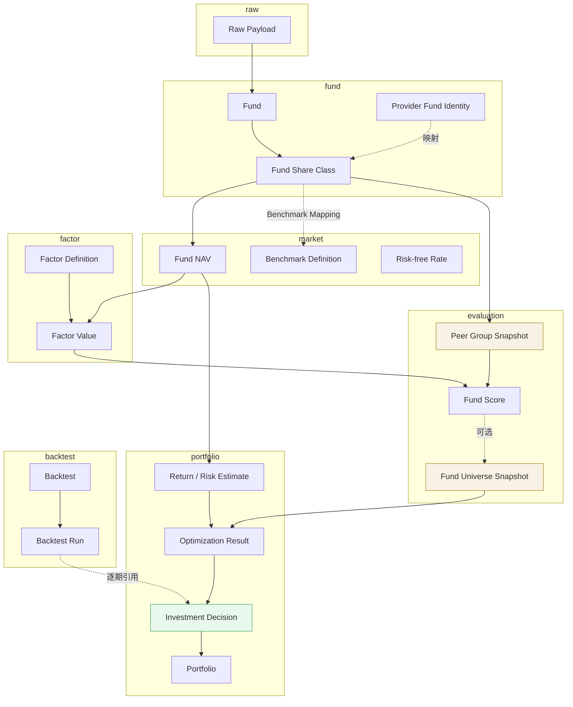

### 4.2 三条链的性质不同 ⚠️

| 链 | 性质 | 说明 |
|---|---|---|
| `Raw → Fund → NAV` | **数据流** | 实体逐层派生 |
| `NAV → Factor → Score → Universe` | **计算流** | 每层是上层的函数 |
| `Universe + Estimate → Optimization → Decision` | **决策流** | 产生不可变的快照 |

> **只有决策流的产物是"事件性"的**（一次决策产生一份快照，不再变更）；前两者是"状态性"的（可被修订，产生新 version）。

---

## 5. Fund Domain ERD

### 5.1 结构

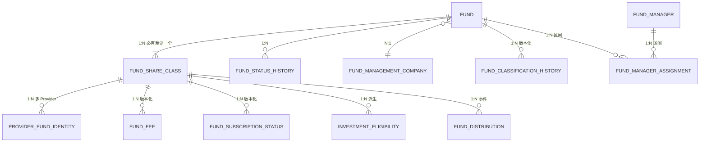

### 5.2 Fund 与 Share Class 必须分离 ⚠️

> **沿用 `03-data/02-data-domain-model` §3.1：`Fund Share Class` 是最小单位。**

| | Fund | Fund Share Class |
|---|---|---|
| 含义 | 基金**产品** | 份额**类别**（A/C/I） |
| 净值 | ❌ 无 | **✅ 各自独立** |
| 费率 | ❌ 无 | **✅ 各自不同** |
| 分类 | ✅ 有 | 继承 |
| **全平台的计算粒度** | ❌ | **✅** |

```
合并两者的后果：
  → A 类与 C 类费率不同 → 净值序列不同 → Factor 不同 → Score 不同
  → 合并后无法表达这一差异
```

### 5.3 Provider Fund Identity 是独立实体 ⚠️

> **沿用 `01-postgresql` §6.1、`03-data/01-data-source` §4 Fund Identity Resolution。**

```
Provider A Fund ID ─┐
Provider B Fund ID ─┼→ Provider Fund Identity ─→ Fund Share Class
Provider C Fund ID ─┘
```

| 要点 | 说明 |
|---|---|
| **基数** | 一个 Share Class 可有多个 Provider Identity |
| **唯一键** | `(provider_id, provider_fund_id)` |
| **不得作为 Share Class 的属性** | 那会限制为单 Provider |
| **映射本身可能变化** | 需 `valid_from` / `valid_to` |

#### 5.3.1 映射变化是真实场景

```
Provider 重新分配 ID、Provider 合并数据源、平台更换 Provider
    → 映射关系随时间变化
    → 若把 Provider ID 作为 Share Class 的列，变更会污染主数据
```

### 5.4 Manager Assignment 是区间实体，且支持共管

> **沿用 `03-data/02-data-domain-model`：`Fund Manager Tenure` 必须是历史记录，且含共管关系。**

| 特征 | 说明 |
|---|---|
| **区间型** | `valid_from` / `valid_to`（`01-postgresql` §10.8） |
| **共管** | 同一基金同一时段可有多位经理 —— **N:M 关系** |
| **约束** | 同一 `(fund, manager)` 的区间不重叠（`01-postgresql` §8.4） |

### 5.5 Classification 与 Status 都是版本化历史实体

> **沿用 P-2：不只画当前状态。**

```
Fund Classification History : 转型会改变分类 → 影响 Peer Group / Benchmark / Asset Class
Fund Status History         : 生命周期状态流转
```

> **两者都必须带 `available_at`** —— 分类调整的公告日晚于生效日是常态（`02-business-requirements` §26.1）。

### 5.6 Investment Eligibility 是派生实体 ⚠️

> **沿用 `03-data/02-data-domain-model` §3.1：它由 Lifecycle Status、Subscription Status 及流动性指标派生。**

| | Fund Lifecycle Status | **Investment Eligibility** |
|---|---|---|
| 性质 | **原始事实** | **派生结论** |
| 回答 | 基金处于什么状态 | 该时点能否交易 |
| 是否独立建模 | ✅ | **✅ 必须独立** |

```
"暂停申购" → 不可建仓、不可加仓，但仍可持有、仍可减仓
    → 单一 Lifecycle Status 无法表达
```

> **它虽是派生的，但必须持久化** —— 因为回测需要查询"当时的可投资性"（Tradability Bias 检查，`08-backtest/04` §11）。

---

## 6. Market / Benchmark ERD

### 6.1 Benchmark 必须四层建模 ⚠️

> **沿用 `03-data/01-data-source` §5 与提示词 §5.5：避免 `Fund → Benchmark` 的过度简化。**

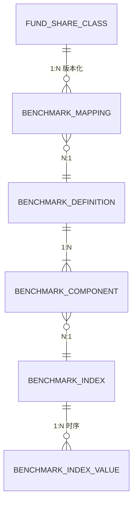

### 6.2 四层各自的职责

| 层 | 职责 | 例 |
|---|---|---|
| **Benchmark Mapping** | 基金 ↔ 基准的**映射关系**（版本化） | Fund A 在 2022 用基准 X，2024 转型后用 Y |
| **Benchmark Definition** | 基准的**构成定义** | "80% 沪深300 + 20% 中债" |
| **Benchmark Component** | 复合基准的**成分与权重** | 沪深300 @ 80% |
| **Benchmark Index** + **Index Value** | 指数本体与其**行情序列** | 沪深300 的日收盘 |

### 6.3 为什么必须能表达多成分 ⚠️

> **沿用上游 §4.2 ①-B 约束 2：Composite Benchmark 必须保留全部 Component 及其权重，不得简化为单一指数。**

```
若把 "80% 沪深300 + 20% 中债" 简化为 "沪深300"
    → 该基金的 Beta 被系统性【低估】
    → Alpha 被系统性【高估】
```

（`04-factor/03-factor-definition`）

### 6.4 Benchmark Mapping 独立于 Definition

> **一个基金的基准会变（转型），但基准定义本身不变。**

```
❌ 把映射关系放进 Benchmark Definition
   → 转型时要么改定义（污染其他基金），要么建新定义（重复）

✅ 映射独立且版本化
```

### 6.5 Risk-free Rate 是曲线，不是单值 ⚠️

> **沿用 `03-data/02-data-domain-model` §10：按 `Currency` × `Tenor` 建模。**

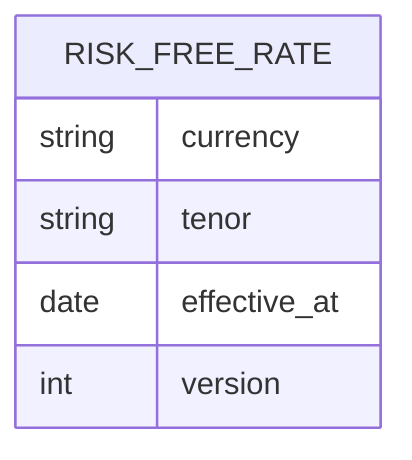

| 要点 | 说明 |
|---|---|
| **主键** | `(currency, tenor, effective_at, version)` |
| **不得退化为单一序列** | 支持第二币种时无法扩展，且历史 Factor 无法判断用的哪条曲线 |
| **不以基金为主体** | 本域唯一不以基金为主体的核心实体 |

### 6.6 NAV 是 Share Class 的属性，不是 Fund 的

> 沿用 §5.2。**这是 ERD 中最容易画错的一条关系。**

---

## 7. Data Governance ERD

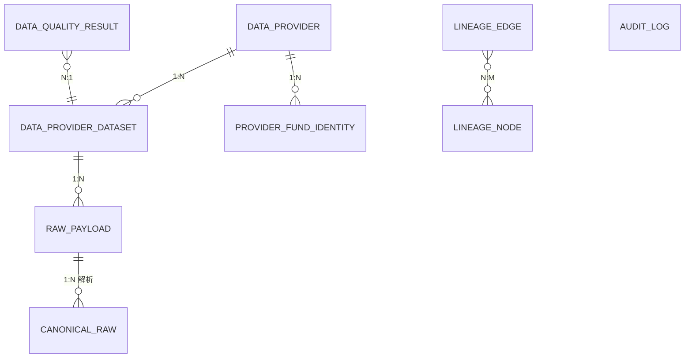

### 7.1 Raw Payload 与 Canonical Raw 分离

> **沿用 `03-data/01-data-source` §12：**

| | Raw Payload | Canonical Raw |
|---|---|---|
| 内容 | Provider 原始响应 | 已完成字段映射 |
| 可变性 | **不可修改** | Adapter 逻辑变更后可重新解析 |
| 关系 | 1 : N —— **同一 payload 可被多次重新解析** | |

> **这个 1:N 是关键** —— Adapter 修 bug 后重解析，必须保留原始 payload 才可能。

### 7.2 Lineage 用图结构建模

> **沿用 `03-data/07-data-lineage`：血缘是有向图，不是树。**

```
一个 Factor Result 可能有多个上游（NAV + Benchmark + R_f）
一个 NAV 可能被多个下游消费
    → N:M 关系 → 边表（LINEAGE_EDGE）
```

### 7.3 Audit Log 不建外键 ⚠️

> **审计记录必须在被审计对象删除后仍然存在。**

```
❌ audit_log.resource_id → FK 指向业务表
   → 业务对象删除时审计记录被级联删除或阻塞删除

✅ 存 (resource_type, resource_id) 的逻辑引用，不建 FK
```

> **这是 `01-postgresql` §7.5 允许逻辑外键的正当场景之一。**

---

## 8. Factor Domain ERD

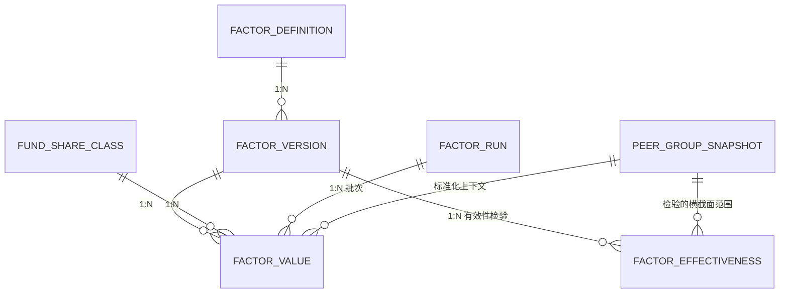

### 8.1 Factor Value 的唯一性需要五个维度 ⚠️

```
(share_class_id, factor_id, window, as_of_date, version)
```

> **`window` 不能省** —— 沿用 `04-factor/02-factor-taxonomy` §5：**窗口不进 Factor ID**，因此必须是独立维度。

### 8.2 依赖 MAR 的因子需要第六个维度 ⚠️

> **沿用上游 §5.5.2 与 `04-factor/08` §2.5.1：**

```
R_f 是市场数据 → 全平台唯一
    → (share_class, factor, window, date, version) 确定唯一 Sharpe

MAR 是评价配置 → 随 Evaluation Policy 不同
    → 同一键可能有【多个】Sortino 值
    → evaluation_policy_version 是【标识的一部分】
```

**ERD 的处理**：`FACTOR_VALUE` 增加可空的 `evaluation_policy_version`，并在唯一约束中包含它。

#### 8.2.1 这使唯一约束成为条件性的

```
不依赖 MAR 的因子：evaluation_policy_version 为 NULL
依赖 MAR 的因子  ：evaluation_policy_version 必填

→ 唯一约束需处理 NULL 语义（PostgreSQL 中 NULL 不参与唯一性比较）
```

> **这是一个真实的建模难点**，落表方案见 `04-database-design` §9.3。

### 8.3 Factor Run 是批次实体

> **它使"某次批量计算产出了哪些值"可追溯**，且是幂等键 `(decision_at, strategy_version)` 的载体。

### 8.4 `FACTOR_EFFECTIVENESS` 是新增实体（v1.1）

> **由 Policy ⑥ 引入**（`02-business-requirements` §5.2.1.1、`04-factor/07-factor-validation` §10.3.1、`TBD-resolution.md` Policy ⑥）：因子权重由有效性检验结果产出，检验结果因此必须是可查询、可版本化的一等实体。

| 属性 | 说明 |
|---|---|
| `factor_version_id` | 被检验的因子版本 |
| `peer_group_snapshot_id` | 检验所在的横截面范围 |
| `evaluation_window` | 检验窗口 |
| `sample_split` | **`IS` / `OOS`** —— 划分是硬要求 |
| `ic` / `icir` / `rank_ic` | 截面相关性指标 |
| `monotonicity_score` | 分层单调性 |
| `stability_score` | 因子自身时序稳定性 |
| `max_correlation_with_existing` | 冗余度 |
| **`effectiveness_verdict`** | **`VALID` / `INVALID`** |
| `validation_policy_version` | 判定所用的阈值版本 |

#### 8.4.1 为什么它不是 `FACTOR_VALUE` 的一列

```
FACTOR_VALUE      粒度 = (Fund, Factor, Window, Date)      —— 单基金
FACTOR_EFFECTIVENESS 粒度 = (Factor, PeerGroup, Window, Split) —— 横截面
```

> **有效性是因子的属性，不是某只基金的因子值的属性** —— IC 衡量的是「这个因子在这个组里区分得好不好」，与任何单只基金无关。放进 `FACTOR_VALUE` 会让同一份检验结果在数百万行上重复，且无法表达 IS/OOS 划分。

#### 8.4.2 `effectiveness_verdict` 依赖 `validation_policy_version`

> **同一份 IC 数值，在不同阈值下可得出不同结论。**

因此 `effectiveness_verdict` **不由 IC 唯一确定** —— 它是 `(检验数值, 判定阈值版本)` 的函数。这与 `FACTOR_VALUE` 依赖 `evaluation_policy_version` 是同一类问题（§8.1），处理方式也相同：把版本纳入实体属性，使结论可复现。

### 8.5 Peer Group 与 Factor Value 的关系是"上下文"而非"归属"

> `normalized_value` 依赖 Peer Group，`raw_value` 不依赖。**ERD 中这是一条弱关系**（引用，非组合）。

---

## 9. Evaluation Domain ERD

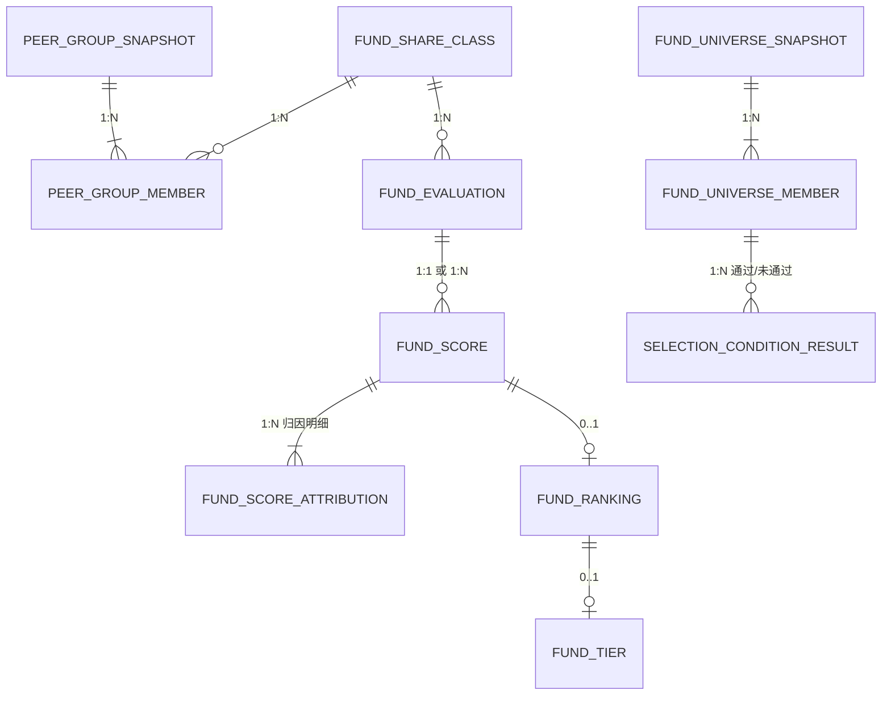

### 9.1 Peer Group Snapshot 是一等实体 ⚠️

> **沿用 §2.1 与 `05-fund-evaluation/01` §18.2：`Peer Group Version` 是可复现性的隐含要素。**

```
同一基金、同一时点、同一 Factor Version、同一 Policy Version
但 Peer Group 构成不同
    → 分位不同 → 标准化值不同 → 评价结果不同
```

**因此必须留存成员列表快照，而非仅留存构建规则。**

### 9.2 Universe 必须留存"未入池"的成员 ⚠️

> **沿用 `05-fund-evaluation/05` §14.3：被排除的基金同样记录。**

```
若只存入池成员
    → 无法验证是否有基金被错误排除
    → 而错误排除正是幸存者偏差的表现形式
    → 且无法回答"放宽某条件能新增多少基金"
```

**ERD 的处理**：`FUND_UNIVERSE_MEMBER` 含 `selection_status`（`SELECTED` / `REJECTED`），并关联逐条件的 `SELECTION_CONDITION_RESULT`。

### 9.3 Score Attribution 是独立实体，不是 JSONB

> **沿用 `05-fund-evaluation/02` §10：归因必须能回答"为什么是这个分数"。**

| 方案 | 权衡 |
|---|---|
| **独立明细表（推荐）** | ✅ 可按因子聚合分析；✅ 可查"哪个因子贡献最大" |
| JSONB 整体存储 | ❌ 无法跨基金按因子分析 |

> **判据**（`01-postgresql` §13.2）：进入 `WHERE` / `GROUP BY` 的字段必须结构化。归因分析需要按 `factor_id` 聚合。

### 9.4 Ranking 与 Tier 是 Score 的派生，基数为 0..1

> **沿用 `05-fund-evaluation/03` §9：** 评价合格 ≠ 排名合格。

```
Score 存在但 Peer Group 仅 1 只基金 → 无 Ranking
Ranking 存在但样本量不足           → 可能无 Tier
```

**因此关系是 `0..1` 而非 `1:1`。**

---

## 10. Portfolio Domain ERD

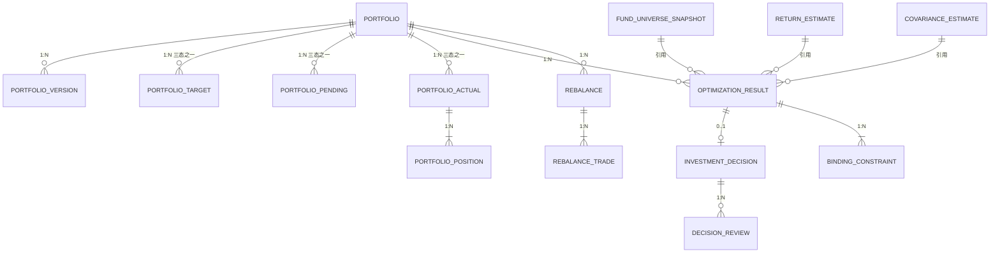

### 10.1 三态必须是三个实体，不是一个带状态字段的实体 ⚠️

> **沿用上游 ⑨-S 与 `06-portfolio/06` §2：**

```
❌ 一个 Portfolio Holdings 实体 + state 字段（TARGET/PENDING/ACTUAL）
   → 三者【同时存在】，不是状态流转
   → 回报延迟时必须同时有 Target 与 Actual

✅ 三个独立实体，各有独立的时间线
```

| 状态 | 来源 | 生命周期 |
|---|---|---|
| `Target` | Approved Investment Decision | 每次决策生效 |
| `Pending` | 已交付、未回报 | 交付后 / 回报前 |
| `Actual` | **外部执行系统回报** | 收到回报 + 净值波动持续变化 |

### 10.2 `Actual` 的持仓以份额为主

> **沿用 `08-backtest/01` §11.1、`10-api/04` §4.2.3：** 只维护权重则无法反推交易数量。

```
PORTFOLIO_POSITION : (share_class_id, shares, cost_basis, is_frozen)
权重是导出量，不存
```

#### 10.2.1 是否存冗余权重

| 方案 | 权衡 |
|---|---|
| 不存，每次计算 | ✅ 无一致性风险；❌ 查询需 JOIN 净值 |
| 存快照时的权重 | ✅ 查询快；⚠️ 但它随净值变化，**存的是"某时刻的权重"而非"当前权重"** |

> **已定案 · 2026-08-27**：`PORTFOLIO_POSITION` **冗余存储权重**；时点语义 = 该 `as_of_date` **收盘估值后**的权重。
>
> **依据 —— 「按基金查历史权重」是核心查询**：
>
> ```
> 不冗余：每次由市值重算
>     → 需连表到当日净值
>     → 且必须解析【当时可见的】净值版本（PIT）
>     → 一个简单的历史查询变成三表关联 + 版本解析
>
> 冗余：直接读
> ```
>
> **冗余的一致性风险由「权重与市值同一事务写入」消除** —— 两者出自同一次估值计算，不存在分别更新的场景。
>
> **时点语义必须明确为「收盘估值后」**：同一天内，调仓前后的权重不同。本字段记录的是**当日终态**，调仓过程中的中间态由 `rebalance_trade` 承载。

### 10.3 Optimization Result 与 Investment Decision 必须分离 ⚠️

> **沿用 `02-architecture/03-data-architecture` §3.2：**

```
Optimization Result 包含求解状态与诊断（含 INFEASIBLE 的情形）
    → INFEASIBLE 时【没有】Investment Decision
    → 但优化结果仍需留存（供事后分析约束是否过紧）
```

**因此关系是 `0..1`**：一次优化可能不产生决策。

### 10.4 Decision Review 是独立实体

> **沿用上游 §7.1.1：PM 的 Approve / Reject / Override 必须完整留痕。**

| 字段 | 说明 |
|---|---|
| `action` | `APPROVED` / `REJECTED` / `OVERRIDDEN` |
| **`reason`** | **必填** |
| **`original_weights` / `final_weights`** | Override 时必须同时保留 |

> **一次决策可能有多条 Review 记录**（如先 Reject 后重新提交），因此是 1:N。

### 10.5 Estimate 是独立实体，被优化引用而非包含

```
RETURN_ESTIMATE / COVARIANCE_ESTIMATE 有独立的生命周期
    → 一份估计可被多次优化引用
    → 优化结果引用估计的 ID，不复制其内容
```

> **沿用架构 §10 的快照闭包原则：引用而非复制。**

### 10.6 Constraint 与 Risk Budget 属 Policy，不属 Portfolio 实例

> **沿用 `06-portfolio/05` §7.1、`04` §10.1：** 它们是 `Portfolio Rule Version` 的组成部分。

```
❌ portfolio_constraint 表挂在 portfolio 下
   → 每个组合各存一份，规则变更需批量更新

✅ 挂在 Portfolio Rule Version 下，Portfolio 引用该版本
```

> **已定案 · 2026-08-27**：Constraint 与 Risk Budget 归属 **Portfolio Rule Version**，不归 Portfolio。
>
> **依据 —— 它们是策略配置的一部分**（九项 Strategy Version 的第 7 项）：
>
> ```
> 挂在 Portfolio 上：
>     同一策略的 N 个组合各存一份约束
>     → 改一条约束要改 N 处
>     → 且无法回答「这次决策用的是哪一版约束」
>
> 挂在 Portfolio Rule Version 上：
>     约束随策略版本变更
>     → 决策快照引用版本号即可复现当时的全部约束
> ```
>
> **组合特有的约束怎么办**：通过 `scope` + `scope_key` 表达（`06-portfolio/05` §2）—— 约束定义在版本上，其适用范围由 scope 限定，而非为每个组合复制一份定义。

---

## 11. Return & Risk ERD

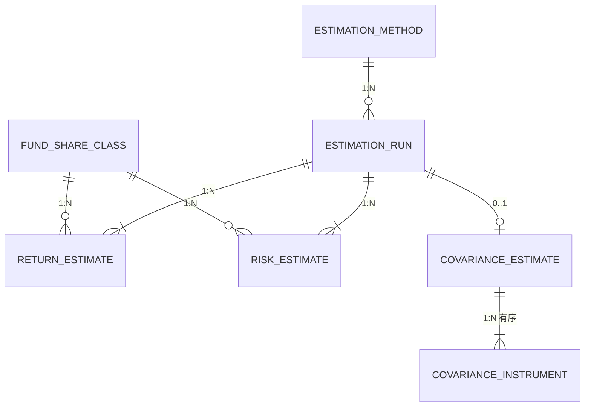

### 11.1 Covariance 是集合实体，不是逐基金实体 ⚠️

> **`μ` 与 `σ` 是逐基金的，`Σ` 是整个集合的。**

```
RETURN_ESTIMATE : 一行 = 一只基金
COVARIANCE_ESTIMATE : 一行 = 【一个 Universe 的整个矩阵】
```

### 11.2 `instrument_ids` 的顺序必须建模 ⚠️

> **沿用 `07-return-risk/04` §9.1：顺序是矩阵语义的一部分，错乱不会报错。**

| 方案 | 说明 |
|---|---|
| **`COVARIANCE_INSTRUMENT` 有序明细表（推荐）** | 显式存 `(estimate_id, ordinal, share_class_id)` |
| 仅存 JSONB 数组 | 顺序在 JSON 内，无法用外键校验成员有效性 |

**本域采用明细表 + 矩阵 JSONB 的组合**：明细表保证成员可校验与有序，JSONB 存数值。

### 11.3 Estimation Run 是批次实体

> 与 `FACTOR_RUN` 同理 —— 使"某次估计产出了什么"可追溯，且承载幂等键。

### 11.4 诊断量属于 Covariance Estimate 的属性

> **沿用 `07-return-risk/04` §14.2：只存矩阵不存诊断量，等于存了结论而没存可信度。**

```
min_eigenvalue / condition_number / t_over_n / psd_adjustment_applied
    → 是矩阵的属性，与矩阵同生命周期
```

---

## 12. Backtest ERD

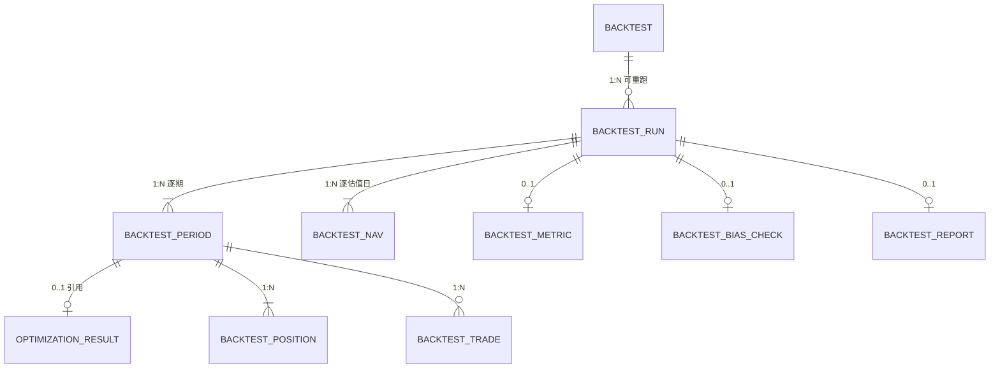

### 12.1 Backtest 与 Backtest Run 分离 ⚠️

> **沿用 `10-api/05` §4.3.2、`08-backtest/01` §22.1：**

```
一次配置可对应多次执行
    → 重跑产生新 Run，不覆盖历史
    → 因为同一配置两次运行结果可能不同（快照被补齐或删除）
```

### 12.2 决策时间线与估值时间线是两个实体 ⚠️

> **沿用 `08-backtest/01` §5.3：**

| 实体 | 频率 | 说明 |
|---|---|---|
| **`BACKTEST_PERIOD`** | **离散、不均等** | 每个 Rebalance Decision Point |
| **`BACKTEST_NAV`** | **逐交易日** | 组合净值序列 |

```
合并两者的后果：
  → 无法计算日频收益序列
  → 无法检测 Drift 触发
```

### 12.3 Bias Check 是一等实体，不是报告的一部分 ⚠️

> **沿用 `08-backtest/06` §12.2、`10-api/05` §4.6.4：**

```
未声明偏差处理方式的回测结果【不得作为决策依据】
    → Bias Check 决定结果能否被使用
    → 它是 Gate，不是报告的附录
```

**因此它独立建模，且可在报告生成前查询。**

### 12.4 回测的逐期快照引用而非复制 Optimization Result

> **沿用架构 §10 的引用原则。** 但需注意：

```
回测中的 Optimization Result 与实盘的是同一实体吗？
```

| 方案 | 权衡 |
|---|---|
| **同一实体 + `runtime_mode` 字段（推荐）** | ✅ 落实"单一策略实现"—— 同一逻辑产出同一结构<br/>⚠️ 需按 mode 隔离查询 |
| 分开建模 | ❌ 违反上游 §5.4 的单一实现原则；两套结构会发散 |

> **选择同一实体**，与上游 §5.4「回测与实盘共用同一套 Strategy Domain Logic」一致。

> **已定案 · 2026-08-27**：回测与实盘的决策实体**使用同一套表**，以 **`run_context`**（`LIVE` / `BACKTEST`）+ `backtest_id` 区分。
>
> **依据 —— `08-backtest/01` 已确立「回测是 Runtime 不是流程步骤」**：
>
> ```
> 分表 = 承认存在两条代码路径
>     → 而两条路径必然逐渐分叉
>     → 「回测与实盘共用同一套 Strategy Domain Logic」这一原则在存储层就被破坏了
>
> 同表 + run_context
>     → 写入路径完全相同，只是上下文标记不同
>     → 任何 if (is_backtest) 分支都会立刻显现为异常
> ```
>
> **查询隔离由分区与索引解决**，不由分表解决：`run_context` 作为分区键的一部分，使实盘查询天然不扫描回测数据。
>
> **`backtest_id` 在 `LIVE` 行中为 NULL**，并加约束 `CHECK ((run_context = 'BACKTEST') = (backtest_id IS NOT NULL))`。

---

## 13. Cross-Domain Relationships

### 13.1 实体依赖链

```
Fund Share Class
      ↓
Factor Value ──────┐
      ↓            │
Fund Score         │
      ↓            │
Fund Universe ─────┤
      ↓            │
Optimization ←─────┴── Return/Risk Estimate
      ↓
Investment Decision
      ↓
Backtest Period（回测中）/ Portfolio（实盘中）
```

### 13.2 跨域关系的两种性质

| 性质 | 说明 | 例 |
|---|---|---|
| **引用（Reference）** | 指向另一实体的**身份** | Optimization → Universe Snapshot |
| **派生（Derivation）** | 由另一实体**计算得出** | Factor Value ← NAV |

> **ERD 中两者都是关系，但含义不同**：引用要求被引用方不可删（FK `RESTRICT`），派生要求血缘可追溯（`governance.lineage`）。

### 13.3 `07-return-risk` 不消费 Factor ⚠️

> **沿用 `04-factor/01` §2.3、`07-return-risk/01` §3.1：**

```
❌ Return Estimate ← Factor Value
   → 会绕过 Return Estimate Version 的版本治理

✅ Return Estimate ← NAV（历史收益序列）
```

**ERD 中不得画 `FACTOR_VALUE → RETURN_ESTIMATE` 的关系** —— 这保证了两条数据流独立。

### 13.4 Peer Group 不依赖 Score ⚠️

> **沿用上游 §7.2：** 否则形成 `Score → Universe → Peer Group → Score` 的循环依赖。

**ERD 中的方向必须是**：

```
Fund Classification → Peer Group Snapshot → Fund Score
                                     ↑
                        【绝不能有从 Score 回来的边】
```

### 13.5 ERD 中不存在循环依赖

> **全域检查：** §13.1 的链是单向的，§13.3 与 §13.4 是两处最容易引入循环的地方，均已排除。

---

## 14. Source / Provider Relationships

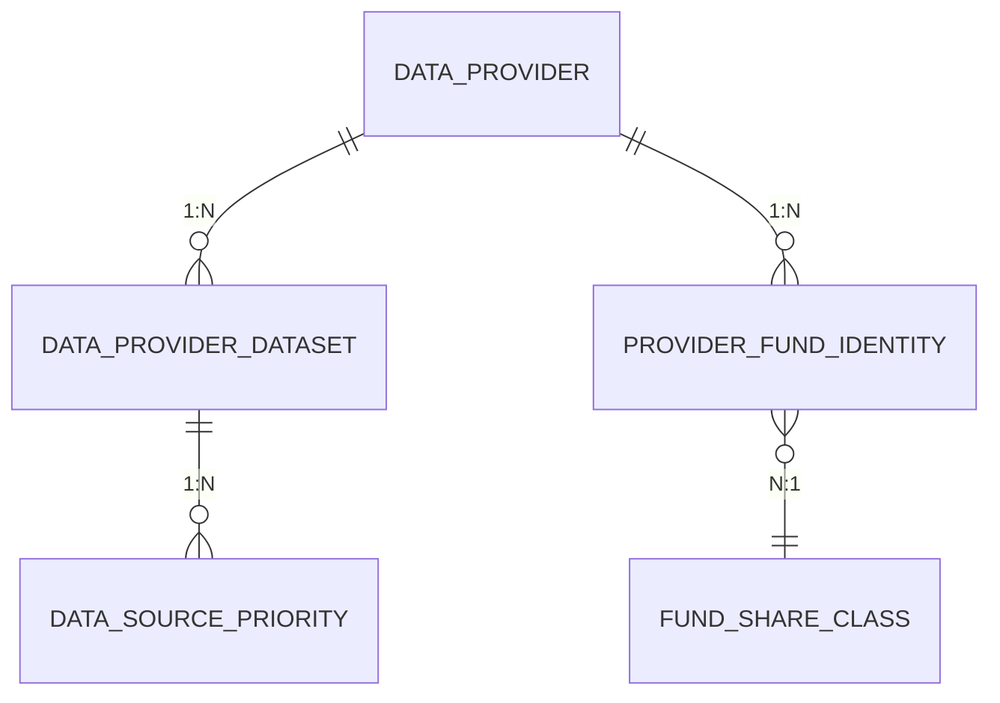

### 14.1 Provider 身份映射是 N:1，且带时效

```
(provider_id, provider_fund_id) → share_class_id
    + valid_from / valid_to
```

### 14.2 Source Priority 属数据治理

> **沿用 `03-data/01-data-source` §8 Source-of-Truth：** 同一字段来自多个 Provider 时的优先级。它是配置，随时间可变，因此版本化。

---

## 15. Temporal Relationships

### 15.1 两种时间模式

> **沿用 `01-postgresql` §10.8。**

| 模式 | 适用实体 |
|---|---|
| **三时点 + version**（事实型） | NAV、Factor Value、Score、Benchmark Index Value、`R_f` |
| **`valid_from` / `valid_to`**（状态型） | Manager Assignment、Classification History、Status History、Benchmark Mapping、Fee、Subscription Status |

### 15.2 状态型实体同样需要 `available_at` ⚠️

> **这是最容易漏掉的一点。**

```
经理任职：生效日 2026-08-20，公告日 2026-08-25
    → valid_from = 2026-08-20
    → available_at = 2026-08-25
    → 在 8-22 的决策中，该任职【不可见】
```

> **只有 `valid_from` 没有 `available_at`，会形成前视偏差**（`02-business-requirements` §26.1 的原始例子正是经理变更）。

### 15.3 快照类实体的时间语义

| 实体 | 时间字段 | 说明 |
|---|---|---|
| Peer Group Snapshot | `effective_at` + `version` | 组构成的版本 |
| Universe Snapshot | `decision_at` | 决策时点 |
| Decision Snapshot | `decision_at` | 同上 |
| Backtest Period | `decision_date` | 回测的历史时点 |

> **快照一旦产生即不可变** —— 无需 `updated_at` 的业务语义（仅保留用于运维）。

---

## 16. ERD Consistency Rules

> **完成 `04-database-design` 后必须逐项核对**（提示词 §19）。

| # | 规则 |
|---|---|
| **R-1** | ERD 中的每个 Entity 必须有对应的表，或有明确的不落表理由 |
| **R-2** | ERD 中的每条 Relationship 必须有对应的 FK 或已声明的逻辑 FK |
| **R-3** | ERD 的 Cardinality 必须与数据库约束一致（`1:N` → FK；`0..1` → 可空 FK；`N:M` → 关联表） |
| **R-4** | ERD 中标注为 Temporal 的实体必须有对应的时间列 |
| **R-5** | ERD 中标注为 Versioned 的实体必须有 `version` 列与唯一约束 |
| **R-6** | ERD 中不存在循环依赖 |

### 16.1 不落表的实体及理由

> **逐条核对结果**（与 `04-database-design` §5 的表清单对照）：

| 实体 | 是否落表 | 说明 |
|---|---|---|
| §5 Fund Domain 的 9 个实体 | ✅ | `04-database-design` §6 |
| §6 Market / Benchmark 的 6 个实体 | ✅ | 同上 §7 |
| §7 Data Governance 的 8 个实体 | ✅ | 同上 §8 |
| §8 Factor Domain 的 4 个实体 | ✅ | 同上 §9 |
| §9 Evaluation Domain 的 10 个实体 | ✅ | 同上 §10 |
| §10 Portfolio Domain 的 16 个实体 | ✅ | 同上 §11 |
| §11 Return & Risk 的 6 个实体（含 `ESTIMATION_METHOD`） | ✅ | 同上 §12 |
| §12 Backtest 的 9 个实体 | ✅ | 同上 §13 |
| **`Investment Eligibility`** | ✅ | **虽是派生，但回测需查历史**（§5.6） |
| **Correlation Matrix** | **❌** | **见 §16.1.1** |

> **唯一不落表的实体是 Correlation Matrix。**

#### 16.1.1 Correlation Matrix 不单独落表

> **沿用 `07-return-risk/04` §5.3：直接估计 `Σ`，由 `Σ` 导出 `ρ`。**

```
ρ_ij = Σ_ij / sqrt(Σ_ii × Σ_jj)
    → 相关矩阵可由协方差矩阵完全确定
    → 单独存储会产生一致性风险（两者可能不同步）
```

**决策**：只存 `Σ`，`ρ` 按需计算或作为 `COVARIANCE_ESTIMATE` 的冗余 JSONB 字段（同一行内，不会失配）。

---

## 17. Decisions

| # | 决策 | 理由 |
|---|---|---|
| D-1 | **Fund 与 Share Class 必须分离** | 合并后无法表达费率/净值差异 |
| D-2 | **Provider Fund Identity 是独立实体** | Provider ID 可变、可多源、可替换 |
| D-3 | Manager Assignment 是 **N:M 区间实体** | 支持共管 |
| D-4 | Classification / Status 建模为**历史实体** | 不只画当前状态 |
| D-5 | **Investment Eligibility 独立建模且持久化** | 回测需查历史可投资性 |
| D-6 | **Benchmark 四层建模** | 避免 `Fund → Benchmark` 过度简化 |
| D-7 | Benchmark Mapping 独立于 Definition | 转型时不污染定义 |
| D-8 | **`R_f` 按 `Currency` × `Tenor` 建模** | 不得退化为单一序列 |
| D-9 | Raw Payload : Canonical Raw = **1:N** | Adapter 变更后可重解析 |
| D-10 | **Lineage 用图结构（边表）** | 血缘是有向图不是树 |
| D-11 | **Audit Log 不建外键** | 被审计对象删除后仍须存在 |
| D-12 | Factor Value 唯一性含 **`window`** | 窗口不进 Factor ID |
| D-13 | **依赖 MAR 的因子需 `evaluation_policy_version` 参与唯一性** | 它是标识而非溯源 |
| D-14 | **Peer Group / Universe / Decision Snapshot 是一等实体** | 它们是可复现性的唯一载体 |
| D-15 | **Universe 必须留存未入池成员** | 否则无法验证错误排除 |
| D-16 | **Score Attribution 用明细表而非 JSONB** | 归因分析需按因子聚合 |
| D-17 | Ranking / Tier 与 Score 的基数是 **0..1** | 评价合格 ≠ 排名合格 |
| D-18 | **组合三态是三个实体** | 三者同时存在，非状态流转 |
| D-19 | 持仓以份额为主 | 权重无法反推交易数量 |
| D-20 | **Optimization Result 与 Investment Decision 分离（0..1）** | `INFEASIBLE` 时无决策但仍需留存 |
| D-21 | Decision Review 独立且 1:N | 可能多次复核 |
| D-22 | Estimate 被引用而非被包含 | 引用而非复制 |
| D-23 | **Covariance 是集合实体**，成员用有序明细表 | 顺序是矩阵语义的一部分 |
| D-24 | 诊断量属 Covariance Estimate 的属性 | 与矩阵同生命周期 |
| D-25 | **Backtest 与 Backtest Run 分离** | 重跑不覆盖历史 |
| D-26 | **决策时间线与估值时间线是两个实体** | 合并则无法算日频收益与检测 Drift |
| D-27 | **Bias Check 是一等实体** | 它是 Gate 不是报告附录 |
| D-28 | 回测与实盘的决策实体**用同一表 + `runtime_mode`** | 落实单一策略实现原则 |
| D-29 | **ERD 中不得画 `Factor → Return Estimate`** | 保证两条数据流独立 |
| D-30 | **ERD 中 Peer Group 不得依赖 Score** | 否则循环依赖 |
| D-31 | **Correlation Matrix 不单独落表** | 可由 `Σ` 完全确定，单独存有失配风险 |

---

## 18. Constraints

| # | 约束 | 来源 |
|---|---|---|
| C-1 | 实体定义来自业务域，本域**不重新定义** | 提示词 §1、§21.3 |
| C-2 | **不得凭空发明实体** —— 无上游定义则标 TBD 或声明为 persistence-only | 提示词 §21.2 |
| C-3 | Fund / Share Class / Provider ID 三者必须分离 | `03-data/02-data-domain-model` §3.1、§4.3 |
| C-4 | Composite Benchmark 必须能表达多成分及权重 | 上游 §4.2 ①-B |
| C-5 | **Peer Group 必须独立于 Fund Score** | 上游 §7.2 |
| C-6 | 快照必须留存成员列表，不能只留规则 | `FR-PEER-002`、上游 §4.2 ④ |
| C-7 | 状态型实体同样需要 `available_at` | `02-business-requirements` §26.1 |
| C-8 | ERD 中不存在循环依赖 | 本文档 §13.5 |
| C-9 | 本域**不含**字段类型、索引、分区 | 提示词 §5.1 |

---

## 19. TBD

| # | 事项 | 影响 | 责任方 |
|---|---|---|---|
| ~~ERD-1~~ | ~~`PORTFOLIO_POSITION` 是否冗余存储权重及其时点语义~~ —— **已定案**：`PORTFOLIO_POSITION` **冗余存储权重**，时点语义 = 该 `as_of_date` 收盘估值后 | — | ✅ 2026-08-27 |
| ~~ERD-2~~ | ~~Constraint / Risk Budget 的归属实体~~ —— **已定案**：Constraint / Risk Budget 归属 **Portfolio Rule Version**，不归 Portfolio | — | ✅ 2026-08-27 |
| ~~ERD-3~~ | ~~决策实体是否用同一表承载回测与实盘~~ —— **已定案**：回测与实盘的决策实体**用同一套表**，以 `run_context`（`LIVE` / `BACKTEST`）+ `backtest_id` 区分 | — | ✅ 2026-08-27 |
| ERD-4 | `governance` schema 的血缘粒度（Decision Level / Record Level） | 存储量（`03-data/07` §3） | 数据 + 技术 |
| ERD-5 | 是否需要 Persistence-only 的辅助实体（如任务队列状态） | 实现细节 | 技术 |

---

## 20. Related Documents

| 关系 | 文档 |
|---|---|
| **本域上游** | `11-database/01-postgresql.md` v1.0 |
| **实体语义来源** | `03-data/02-data-domain-model.md` v1.3、`03-data/01-data-source.md` v2.2（Provider、Benchmark）、`03-data/07-data-lineage.md` v1.0 |
| **各域实体** | `04-factor`、`05-fund-evaluation`、`06-portfolio`、`07-return-risk`、`08-backtest` |
| **架构** | `02-architecture/03-data-architecture.md` v1.1（数据域与 Ownership）、`01-system-architecture.md` v2.3（§10 快照闭包） |
| **本域下游** | `11-database/04-database-design.md`（物理落表） |

---

## 21. Change Log

| 版本 | 日期 | 变更内容 | 上游依赖 |
|---|---|---|---|
| **v1.2** | 2026-08-27 | **第二批定案（3 项）**。`ERD-1` `PORTFOLIO_POSITION` **冗余存权重**，时点语义为收盘估值后（不冗余会使简单历史查询变成三表关联 + PIT 版本解析）；`ERD-2` Constraint / Risk Budget 归属 **Portfolio Rule Version**，组合特有约束由 `scope` + `scope_key` 表达；`ERD-3` 回测与实盘**同表 + `run_context`** —— 分表等于承认存在两条代码路径，而那正是「回测是 Runtime 不是流程步骤」原则要避免的。 详见 `TBD-resolution-2.md` | `TBD-resolution-2.md` v1.0 |
| **v1.1** | 2026-08-27 | **Policy ⑥ 引入新实体**。Factor Domain ERD 新增 **`FACTOR_EFFECTIVENESS`**（IC / ICIR / 分层单调性 / 稳定性 / 冗余度 / `effectiveness_verdict`），关联 `FACTOR_VERSION` 与 `PEER_GROUP_SNAPSHOT`；新增 §8.4 及两个小节 —— 说明它为何不是 `FACTOR_VALUE` 的一列（粒度不同：横截面 vs 单基金），以及 `effectiveness_verdict` 依赖 `validation_policy_version`（同一 IC 在不同阈值下结论不同）。原 §8.4 顺移为 §8.5。详见 `TBD-resolution.md` Policy ⑥ | `04-factor/07-factor-validation` v1.2 |
| v1.0 | 2026-08-27 | 初始版本。**§2.1 快照是一等实体**（Peer Group / Universe / Decision Snapshot 是可复现性的唯一载体）；**§5.2 Fund 与 Share Class 分离**、**§5.3 Provider Fund Identity 独立**；§5.4 共管关系建模为 N:M 区间；**§5.6 Investment Eligibility 虽派生但须持久化**；**§6.1 Benchmark 四层建模**及 §6.4 Mapping 独立于 Definition；**§6.5 `R_f` 是曲线不是单值**；**§7.1 Raw : Canonical = 1:N**、**§7.3 Audit Log 不建外键**；**§8.1–8.2 Factor Value 的五维唯一性与依赖 MAR 者的第六维**；**§9.2 Universe 必须留存未入池成员**、**§9.3 Score Attribution 用明细表**、§9.4 Ranking/Tier 基数为 0..1；**§10.1 三态是三个实体**、**§10.3 Optimization 与 Decision 分离（0..1）**；**§11.1–11.2 Covariance 是集合实体且成员有序**；**§12.1 Backtest 与 Run 分离**、**§12.2 决策与估值两条时间线**、**§12.3 Bias Check 是一等实体**；**§13.3–13.4 两处循环依赖的排除**；**§15.2 状态型实体同样需要 `available_at`**；**§16.1 逐条核对 ERD 实体与表的对应**、**§16.1.1 Correlation Matrix 不单独落表** | `03-data/02-data-domain-model.md` v1.3、各业务域 v1.0–v1.1、`11-database/01-postgresql.md` v1.0 |