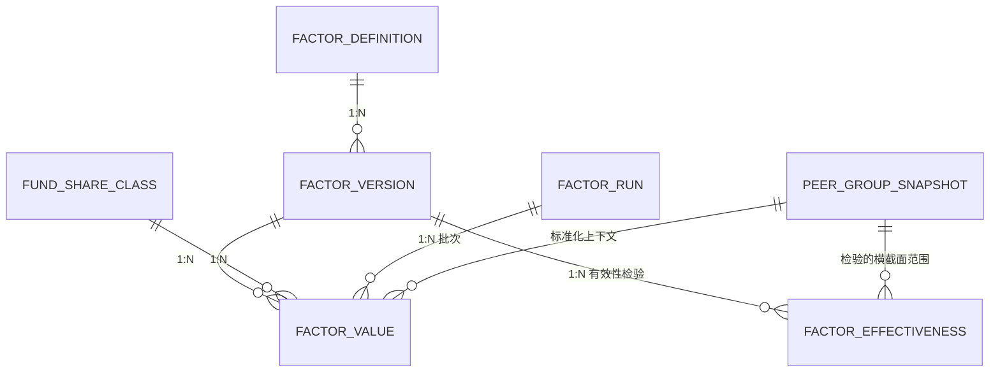

# Plan-2 上游约束清单 · Peer Group / Factor / 评价与候选池

> **用途**：为 Plan-2（M1.2 Peer Group + M1.3 因子 + M1.4 评价与候选池）的实现计划提供【精确的约束抽取】。
> **原则**：逐条给出出处（文件:行号 或 章节号）；字段设计一字不差抄录；文档未给值的标注「文档未给值」，**不猜**。
> **抽取日期**：2026-08-31

---

## 0. 阅读范围与文档缺口（先读这一节）

### 0.1 已读文档

| 文档 | 行数 | 说明 |
|---|---|---|
| `docs/04-factor/04-fund-classification.md` | 482 | 与 `docs/05-fund-evaluation/04-fund-classification.md` 逐字节相同 |
| `docs/04-factor/05-fund-selection.md` | 677 | 与 `docs/05-fund-evaluation/05-fund-selection.md` 逐字节相同 |
| `docs/04-factor/01-fund-evaluation.md` / `02-fund-scoring.md` / `03-fund-ranking.md` | 827 / 740 / 610 | 为补齐 `fund_score` / `fund_ranking` / `fund_tier` 的业务字段而读 |
| `docs/01-product/02-business-requirements.md` | 2583 | §5.2、§5.4、§7、§16、§17、§18 |
| `docs/01-product/04-functional-requirements.md` | —— | `FR-PEER-001~004`、`FR-ELIG-001~004`、`FR-UNIV-001~005` |
| `docs/11-database/04-database-design.md` | 1384 | §4.2–§4.5、§5、§9（factor）、§10（evaluation）、§15–§17、§23 |
| `docs/11-database/03-erd.md` | 1063 | §8（Factor Domain）、§9（Evaluation Domain）、§15、§16、§19 |
| `docs/02-architecture/01-system-architecture.md` | —— | §10.3 一致性边界、§10.4 最小闭包 |
| `docs/03-data/02-data-domain-model.md` | —— | §3.1、§9、§14 |
| `docs/superpowers/specs/2026-08-31-fund-platform-m1-design.md` | 693 | §3.2、§6.1、§6.3、§7 |

### 0.2 ⚠️ 目录命名陷阱（会误导实现）

> **`docs/04-factor/` 目录里放的不是因子域文档，而是 `05-fund-evaluation/` 的逐字节副本。**
> 两个目录都只含 `01-fund-evaluation` / `02-fund-scoring` / `03-fund-ranking` / `04-fund-classification` / `05-fund-selection` 五份评价域文档。

**因此 `04-factor/04-fund-classification.md` 定义的不是 `Fund Classification`，而是 `Fund Tier`** —— 该文档 §1.2（行 17–32）用最强措辞澄清了这一撞名：

> 「**这是本文档最重要的一条前置说明。文件名 `04-fund-classification.md` 与上游概念 `Fund Classification` 撞名，两者完全不是一回事。**」（`04-fund-classification.md:19`）

| | **`Fund Classification`** | **`Fund Tier`**（该文档） |
|---|---|---|
| 回答 | 这是一只**什么类型**的基金 | 这只基金**评价得怎么样** |
| 取值 | 股票型 / 债券型 / 混合型 … | **A+ / A / B / C / D** |
| 性质 | **客观属性**（基金合同决定） | **评价结论**（由 Score 派生） |
| 归属 | **`03-data`** 的数据实体 | 评价域 |
| 是否依赖 Score | **绝不** —— 它是 `Peer Group` 的构建依据 | **完全依赖** |
| 变更来源 | 基金转型 | 评分或组内分布变化 |

（`04-fund-classification.md:21-28`）

> 「混淆两者的后果：若把 `Fund Tier` 当作 `Fund Classification` 用于构建 `Peer Group`，将直接形成 `Score → Tier → Peer Group → Score` 的循环依赖」（`04-fund-classification.md:30`）

### 0.3 ⚠️ 被引用但仓库中不存在的文档（Plan-2 的实质阻塞）

以下文档在上游被反复引用，**但 `find docs -name "*.md"` 确认它们不存在**：

| 被引用的文档 | 引用处 | Plan-2 需要它提供什么 |
|---|---|---|
| `04-factor/02-factor-taxonomy` | `03-erd.md:410` | **`window` 的取值域**（"窗口不进 Factor ID，因此必须是独立维度"） |
| `04-factor/03-factor-definition` | `01-fund-evaluation.md:826`、`10-api/03-factor-api.md:382` | **`factor_definition` 表的字段清单** |
| `04-factor/04-factor-calculation` | `04-database-design.md:561` | `risk_free_rate_ref` 的 TR-2 定案 |
| `04-factor/05-factor-normalization` | `02-business-requirements.md:546`、`03-fund-ranking.md:「§9.3」` | 标准化方法与 `MIN_PEER_GROUP_SIZE` 的三处之一 |
| `04-factor/06-factor-versioning` | `02-fund-scoring.md:553` | `factor_version` 的升版规则 |
| `04-factor/07-factor-validation` | `04-database-design.md:615` | `factor_effectiveness`（M2+，Plan-2 不落） |
| `04-factor/08-factor-output` | `05-fund-selection.md:183`、`:467` | 筛选须用 Raw Value 的原始论证 |
| `11-database/02-*.md` | —— | 编号 02 缺失，`01-postgresql` 与 `03-erd` 之间 |
| `TBD-resolution.md` / `TBD-resolution-2.md` | 全域大量引用（如 `05-fund-selection.md:322`、`:655`） | 全部「已定案」条目的原文 |

> **影响**：`factor_definition` / `factor_version` / `factor_run` 三张表在**整个仓库中没有任何字段清单**（见 §3.1）。Plan-2 必须自行设计，或先补文档。

---

## 1. Fund Classification

### 1.1 分类体系的层级 —— **文档未定义**

**上游对 `Fund Classification` 只给了两件事：它的作用，和它的时点属性。层级结构没有任何一份文档定义。**

已有的表述：

| 出处 | 原文 |
|---|---|
| `02-business-requirements.md:225` | 「**`Fund Classification`** \| 这是一只什么类型的基金 \| 分组、Peer Group 构成、Benchmark 默认映射」 |
| `02-business-requirements.md:210-217` | 覆盖范围按**基金类型**列举：股票型 / 混合型 / 债券型 / 指数型 / ETF·ETF 联接 / QDII（QDII 为后续扩展） |
| `03-data/02-data-domain-model.md:67` | 「6 \| **Fund Classification** \| 基金的分类归属 \| **必须版本化**——转型会改变分类」 |
| `04-fund-classification.md:24` | 「取值 \| 股票型 / 债券型 / 混合型 …」（示例，非枚举定义） |

**没有找到的内容**（全仓 `grep -rn "classification_level\|一级分类\|二级分类\|三级分类\|classification_scheme" docs/` 只命中 Plan-1 的实现代码与 `04-database-design.md:696` 的 `classification_key`）：

- ❌ 分类是几级层级 —— **文档未给值**
- ❌ 每级的枚举取值 —— **文档未给值**
- ❌ 是否支持多套分类体系（`classification_scheme`）—— **文档未给值**（Plan-1 已在 `fund_classification_history` 落了 `classification_scheme VARCHAR(32)` + `classification_code VARCHAR(32)` 两列，这是实现侧的先行决定，不是文档定案）

### 1.2 Peer Group 应该划在哪一层 —— **文档未定，这是 Plan-2 的头号阻塞**

**定义（文档给了公式，没给参数）**：

```
Peer Group = Fund Classification  +  effective_at  +  参与规则
```
（`02-business-requirements.md:486`、`01-fund-evaluation.md:268` 两处完全一致）

**文档给出的唯一线索是示例，不是规则**：

- 「Peer Group = 主动股票型 · v3（Size = 200，N_effective = 120）」（`04-fund-classification.md:385`）
- 「Peer Group「主动股票型」内含：Profile = Active Equity 的基金 120 只 / Profile = Passive Equity 的基金 15 只」（`02-business-requirements.md:574-576`）
- 「Peer Group : 主动股票型 · 该时点共 N 只」（`01-fund-evaluation.md:628`）

> 「主动股票型」这一粒度在三处示例中反复出现，但**没有任何一条规范性语句把它定为 Peer Group 的划分层级**。

**反而文档明确说了「Peer Group 的粒度是未定的」**：

| 出处 | 原文 |
|---|---|
| `02-business-requirements.md:549` | `<OPEN-10: 长期低于 30 的分类是否应合并或采用更粗粒度的 Peer Group，待投研确认>` |
| `04-database-design.md:732` | 「`n_effective` … 也是事后分析『哪些分类长期低于 30』（`OPEN-10`）的唯一数据来源」 |
| `01-fund-evaluation.md:498` | 「**因此 `RISK_FREE` 模式在多币种 Peer Group 中不可用** —— 若将来启用该模式，Peer Group 的构建必须先按币种细分」 |

**物理设计侧唯一的落点**：`peer_group_snapshot` 的 Business Key 是 `(classification_key, effective_at, version)`（`04-database-design.md:696`）。**`classification_key` 的构成、类型、取值域，文档均未给值。**

> **结论**：Peer Group 划在分类的哪一层 = **文档未定**。阻塞对象见 §6 的 `BLOCK-1`。

### 1.3 Peer Group 的参与规则（**已定，可直接实现**）

沿用 `02-business-requirements.md:515-525` §7.3 表格，逐条抄录：

| 规则 | 内容 |
|---|---|
| **基础集合** | `Fund Coverage` 中属于该分类的全部基金 |
| **最低数据要求** | 该周期指标可计算（非 `UNAVAILABLE`）的基金才参与该指标的排名 |
| **是否包含已清盘基金** | **历史时点包含**——回测在 `T` 时点的 Peer Group 必须含当时存续的全部基金，包括后来清盘的（见 §26.2） |
| **是否包含不可投资基金** | **包含**——可投资性不影响评价。暂停申购的基金仍应被评分，只是不进入可建仓集合（见 §18） |
| **最小样本量** | **`MIN_PEER_GROUP_SIZE = 30`**（已定案 2026-08-27）。样本数低于该值时**不产出横截面派生量**（标准化值、分位、Tier），标 `INSUFFICIENT_SAMPLE`；原始因子值不受影响。详见 §7.3.1 |

补充约束：

- **同一基金的多个 Share Class 同时进入同一 Peer Group 参与排名**，去重发生在 Universe 层（`01-fund-evaluation.md:130`、`05-fund-selection.md:322`）。
- **Peer Group 内出现多个 Evaluation Profile 时，该组不产出跨 Profile 的统一排名，按 Profile 拆分为子排名集**（`02-business-requirements.md:571`）。子排名的样本量按 §7.3.1 单独判定（`:587`）。
- **同一 Peer Group 内的全部基金必须适用同一个 `MAR`**（`01-fund-evaluation.md:444`）；不一致时该组该 Factor `UNAVAILABLE` **并告警**（`:658`）。
- **`Peer Group` 的构成不得依赖 `Fund Score` 或 `Fund Universe`**（`02-business-requirements.md:491`、`FR-PEER-001` BR-1）。M1.2 的完成判据即「Peer Group 构建**不读取** Score / Universe（适应度测试断言）」（spec §7 M1.2）。

### 1.4 `MIN_PEER_GROUP_SIZE = 30` 的三处一致性要求

> 「**三处必须使用同一个值**：`04-factor/05-factor-normalization` §5.2、`05-fund-evaluation/03-fund-ranking` §9.3、`05-fund-evaluation/04-fund-classification` §8.5。**配置来源唯一**，不得三处各自定义。」（`02-business-requirements.md:546`）

> 「**阈值本身不落在这两张表** —— 它属 `governance.policy_version` 的 Peer Group Policy（`min_sample_size`），三处（标准化 / 排名 / 分层）共用同一配置来源。表里存的是判定**结果**，不是判定**参数**。」（`04-database-design.md:734`）

降级语义（`02-business-requirements.md:534-538` §7.3.1）：

| 条件 | 处理 |
|---|---|
| `n_effective ≥ 30` | 正常标准化 → 排名 → 分层 |
| **`n_effective < 30`** | **不做横截面标准化、不做 Ranking、不做 Percentile Classification**，输出 `INSUFFICIENT_SAMPLE` |
| `n_effective = 1` | `percentile = null` |

> 「**判定基数是 `n_effective`（该指标的有效参与数）而非 `peer_group_size`** —— 一个 50 只基金的组里若某指标只有 25 只可算，该指标仍属小样本。」（`02-business-requirements.md:542`）

### 1.5 分类的时间属性 —— **区间型（valid_from / valid_to），且必须带 available_at**

| 出处 | 原文 |
|---|---|
| `02-business-requirements.md:378-383` §5.4 | 「`Fund Classification` 本身带 PIT 属性：分类可能随时间变化（基金转型）／变更必须按 `effective_at` / `available_at` 记录／**回测必须使用当时的分类**，不得用当前分类回溯历史／分类变更同时触发 `Peer Group` 与 `Benchmark` 变更」 |
| `03-erd.md:906` §15.1 | 「**`valid_from` / `valid_to`**（状态型）\| Manager Assignment、**Classification History**、Status History、Benchmark Mapping、Fee、Subscription Status」 |
| `03-erd.md:247` §5.5 | 「**两者都必须带 `available_at`** —— 分类调整的公告日晚于生效日是常态」 |
| `03-data/02-data-domain-model.md:220` | 「转型的连锁影响：`Fund Classification` 变更 → `Peer Group` 变更 → `Benchmark Mapping` 变更。三者必须各自按 PIT 记录，回测跨越转型点时使用各自当时的版本」 |

**能否变更**：能。转型（`TRANSFORMED`）会改变分类，转型前后的 `Fund Classification` 与 `Benchmark Mapping` 分属不同版本（`03-data/02-data-domain-model.md:218`）。

**对 Peer Group 的传导要求**：

- 「回测在 `T` 时点必须使用 `available_at ≤ T` 的分类版本构成 Peer Group」（`02-business-requirements.md:556`）
- 「每个决策时点的 Peer Group 构成必须可重建」（`:557`）
- 「若历史 `Peer Group` 用当前成员构造，**全部分位、排名、Tier 都被污染**——且污染不可见（数值看起来完全正常）」（`01-fund-evaluation.md:271`）
- 「基金在评价期内转型 \| 用当时分类归组；转型前后的 Tier 不可直接比较」（`04-fund-classification.md:372`）

> **注**：Plan-1 已落 `fund.fund_classification_history`（`IntervalMixin`，`valid_from` / `valid_to` + 三来源时点），Plan-2 的 Peer Group 构建直接消费它。

### 1.6 Fund Tier（分层）的已定案内容 —— 用于 `evaluation.fund_tier` 表

**五档与分位阈值（已定案，本域不得改动 · `04-fund-classification.md:110-116`）**：

| Tier | 分位区间 | 含义 |
|---|---|---|
| **A+** | 前 5% | Excellent |
| **A** | 5% – 20% | Very Good |
| **B** | 20% – 50% | Good |
| **C** | 50% – 80% | Neutral |
| **D** | 后 20% | Weak |

**边界条件（上闭下开 · `04-fund-classification.md:194-200` §8.2）**：

| Tier | 边界条件 |
|---|---|
| **A+** | `percentile >= 95` |
| **A** | `80 <= percentile < 95` |
| **B** | `50 <= percentile < 80` |
| **C** | `20 <= percentile < 50` |
| **D** | `percentile < 20` |

> 「**§6.1 的『前 5%』对应 `percentile >= 95`** —— 因为本项目的 Percentile 约定是**越优越高**」（`:204`）。「**这是一处极易出错的换算**」（`:214`）。

**边界校验三项**（`:220-222`）：完备性（五个区间必须覆盖 `[0, 100]` 全部取值，无空隙）／互斥性（任一 percentile 值只能落入一个 Tier）／单调性（percentile 越高，Tier 越优）。

**小样本处理（已定案 · `:235-241` §8.5）**：`n_effective < 30` 时**不产出 Tier**：

| 输出字段 | 值 |
|---|---|
| `tier` | `null` |
| `n_effective` | 实际值 |
| **`classification_status`** | **`INSUFFICIENT_SAMPLE`** |

**其余硬约束**：

- **阈值配置化，严禁硬编码**（C-1，`:445`）
- **分层必须在 `Peer Group` 内，与排名同一样本集**（C-2，`:446`）
- **`Fund Tier` 必须与组内绝对水平（组内 Sharpe 中位数、组内 Maximum Drawdown 中位数）同屏展示，否则视为违规**（C-3，`:447`；§7.2 `:152-157`）
- **分层必须记录当时的阈值配置版本**（C-4，`:448`）
- **`Fund Tier` 不得用于构建 `Peer Group`**（C-7，`:451`）
- **Policy 变更不覆盖历史 Tier**（C-8，`:452`）
- `percentile = UNAVAILABLE` → **无 Tier，不得默认为最低档**（D-8，`:435`；`:368`）
- 「接近上一档」提示（距上档阈值 < 2 个百分点）**纯展示层增强，不落库为 Tier 的一部分，不进入 Universe 筛选条件，不参与任何计算**（`:335-339`）
- **第一阶段不引入 Tier 平滑机制**（D-7，`:434`）

---

## 2. Fund Selection / Eligibility Rules

### 2.1 Screening 与 Eligibility Rules 必须严格区分

`05-fund-selection.md:66-72` §4（与 `02-business-requirements.md:1116-1122` §17.1 一致）：

| | **探索性筛选（Screening）** | **正式准入规则（Eligibility Rules）** |
|---|---|---|
| 使用者 | 研究人员在界面上临时筛选 | 策略配置的一部分 |
| 是否版本化 | 否 | **是**，属 `Strategy Version` |
| 是否可回测 | 否 | **是** |
| **是否产生 Universe** | **否** | **是** |
| 典型形态 | "规模 > 10 亿" 点几下看看 | `Eligibility Rules v1.2` |

> 「**UI 上的一次筛选不构成 `Fund Universe`。** 只有正式的、版本化的 `Eligibility Rules` 才产生 Universe。」（`:74`）

### 2.2 Fund Universe 的四层收敛

```
Fund Coverage
    ↓  Evaluation Eligibility（01 §10）
Evaluated Funds
    ↓  Eligibility Rules（必要）
Eligible Funds
    ↓  Score / Tier 排序或阈值（可选）
Fund Universe（Stage ④ · 候选池）
```
（`05-fund-selection.md:80-92`；「**注意第三步是可选的**」`:94`）

### 2.3 规则的组成

**① 前置检查（六项 · `05-fund-selection.md:102-109` §6.1）**：

| # | 检查 | 不通过 |
|---|---|---|
| 1 | 基金在 `Fund Coverage` 中且该时点存续 | 排除 |
| 2 | `evaluation_status` ∈ {`COMPLETED`, `PARTIAL`} | 排除 |
| 3 | 必需的历史长度满足 | 排除 |
| 4 | `total_score` 可得（策略 B/C 时） | 排除 |
| 5 | `fund_tier` 可得（使用 Tier 条件时） | 排除 |
| 6 | **`Investment Eligibility` 状态** | 见 §9 |

**② Hard Filters 的七个维度（`05-fund-selection.md:157-165` §8.1）**：

| 类别 | 条件 |
|---|---|
| **基础** | 基金类型、成立时间、基金规模、经理任职时间 |
| **收益** | 1Y / 3Y / 5Y Return 阈值或分位 |
| **风险** | Maximum Drawdown、Volatility、VaR / CVaR 上限 |
| **风险收益** | Sharpe / Sortino / Calmar 下限、Alpha 下限、IR 下限 |
| **稳定性** | Win Rate 下限、Rolling 指标稳定性 |
| **评价结论** | `total_score` 阈值、`percentile` 阈值、`fund_tier` 条件 |
| **可投资性** | `Investment Eligibility` 状态（§9） |

**③ 阈值取值 —— 全部为 TBD（`05-fund-selection.md:169-179` §8.2）**：

```
Score Threshold      = TBD
Percentile Threshold = TBD
Tier Condition       = TBD
Sharpe Floor         = TBD
Max Drawdown Ceiling = TBD
```
> 「**以上参数当前均为 TBD，投产前必须由业务负责人确认。** 本域不自行设定具体数值。」
> `<TBD-FSEL-2: 各 Hard Filter 的具体阈值，待投研确认>`

**④ 使用 Raw Value 而非标准化值（`:183` §8.3）**：
> 「**筛选阈值应基于 Raw Value**」。例外：「`percentile` 与 `fund_tier` 本身就是相对量，用它们做筛选是有意为之（"取同类前 20%"），不属误用」（`:194`）。

**⑤ 规模双向约束（`:198-207` §8.4）**：下限（过小面临清盘风险与流动性问题）+ 上限（过大则策略容量受限、超额收益被稀释）；「**但不假设具体上界** —— 规模上限是 **Strategy-specific Capacity Rule**，随策略类型而变，必须可配置」。`<TBD-FSEL-3 = 上游 TBD-P1-7>`

**⑥ `data_completeness` 下限（已定案 · `:121`）**：
> 「入池 `data_completeness` 下限**沿用 `03-data/03-data-quality` `DQ-2` 的 0.8**，本域**不单独设值**。」
> 「**本域的职责是引用而非定义**。若入池需要比数据质量更严的门槛，那应表述为一个**独立的筛选条件**（如「近 1 年完整度 ≥ 0.9」），而不是给同一个指标设第二个阈值。」（`:125`）

**⑦ Investment Eligibility 的处理（`:244-250` §9.3）**：

| 状态 | Universe 处理 |
|---|---|
| `FULLY_ELIGIBLE` | 正常入池 |
| `HOLD_ONLY` / `LIMITED` / `EXIT_ONLY` | **入池并标注约束**，交由 `06-portfolio` 在优化时施加 |
| `NOT_TRADABLE` | **排除** —— 已清盘或不可交易 |

> ⚠️ **表与其下方的定案冲突，须以定案为准**：`:250` 「**已定案 · 2026-08-27**：`EXIT_ONLY` 基金**不入池**；但**已持仓的不强制卖出**。」 —— 即 §9.3 表格中 `EXIT_ONLY` 那一格已被推翻。

关键原则（`:225-240` §9.2）：
> 「**不可建仓 ≠ 移出 Universe** ⚠️ … ❌ 直接移出 Universe → 组合中已持有的该基金会被优化器判定为"不在可选集合" → 可能导致被强制清仓；✅ 保留在 Universe，但标注不可建仓」

**⑧ Universe 规模下限（推荐默认 · `:304-308` §11.1）**：
> 「Universe 最小规模 = **30**，与 `MIN_PEER_GROUP_SIZE` 同值。业务方可改。」
> 「**不满足时的处理**：Universe 标 `INSUFFICIENT_UNIVERSE` 并阻断本期组合构建，**不降级为「用更少的基金优化」**」
> 「Universe 规模低于下限时**显式失败并阻断**，不得静默产出过小的池子」（`:302`）

**⑨ 多 Share Class 去重（已定案 · `:322-341` §11.2）**：
```
同一 fund_id 下的多个 share_class：
    ① 排除不可申购的类别
    ② 在剩余类别中取【综合费率最低】者
    ③ 费率相同则取【规模最大】者
```
三条执行要求（`:337-341`）：

| # | 要求 |
|---|---|
| 1 | **去重结果须落库并留痕**（保留被排除的类别与排除原因），否则无法解释「为什么选了 C 类」 |
| 2 | 去重发生在 **Universe 构建之后、组合优化之前** —— Universe 仍含全部类别供分析查询 |
| 3 | 费率取**综合费率**（管理费 + 托管费 + 销售服务费），不只看管理费 |

**⑩ Soft Filters —— 第一阶段不实现**（`:271` §10）。
**⑪ Selection Constraints —— 除 `max_candidates`（策略 C 已含）、`min_candidates`（§11.1）、`duplicate_fund_constraints`（§11.2）外，`category_constraints` / `liquidity_constraints` / `strategy_constraints` 均「不实现」**（`:283-290`）。

### 2.4 逐条件结果如何记录

`05-fund-selection.md:392-435` §14 Selection Explainability，四条：

**§14.1 必须能回答两个问题**：**Why was this fund selected?** 与 **Why was this fund rejected?**

**§14.2 不得只保存布尔值**（`:400-413`）：
```
❌ selected = true / false

✅ 通过的条件：
     total_score >= X          ✓ (实际 X)
     fund_tier ∈ {A+, A}       ✓ (实际 A+)
     percentile >= X           ✓ (实际 X%)
     fund_size >= X            ✓ (实际 X)
   未通过的条件：（无）

✅ 被拒的基金同样记录：
     total_score >= X          ✗ (实际 X，差 X)
     其余条件                   ✓
```

> **落库含义**：每条 `selection_condition_result` 至少需要「条件标识 + 通过与否 + **实际值** + （未通过时）**差距**」。上游给的是示例格式，**具体列名文档未给值**。

**§14.3 被排除的基金必须同样留痕**（`:415-423`）：
> 「**这不是可选项**（`02-business-requirements` §17.5）。」
> ```
> 如果 90% 的基金因同一条件被排除
>     → 说明该条件可能设置不当
>     → 只有记录了排除原因才能发现
> ```

**§14.4 记录未通过的全部条件，而非首个**（`:425-435`）：
> 「**短路求值会丢失信息。** ❌ 遇到第一个不满足的条件就返回 → 无法知道该基金还差多少其他条件 → 无法回答"放宽某条件能新增多少基金"；✅ 评估全部条件后一并记录」

**存储侧的对应定案**（`04-database-design.md:788-801` §10.3.1）：
> 「**已定案 · 2026-08-27**：`selection_condition_result` **存全部条件**，不只存未通过项。
> **依据 —— `05-fund-selection` §14.4 已确立「记录未通过的全部条件不短路」**，本条是其存储侧的对应要求。
> ```
> 只存未通过项
>     → 无法回答「这只基金通过了哪些条件」
>     → 也无法区分「通过了」与「根本没评估」
>     → 而后者会在条件集变更时大量出现
> ```
> **须一并存 `condition_version`** —— 条件集本身会变更，不记录版本则历史结果无法解释。」

### 2.5 ⭐ `REJECTED` 成员必须保留 —— 三处确切表述（逐字抄录）

这是 Plan-2 最容易被"优化掉"的一条，故给出全部原文：

**① `05-fund-selection.md:415-423` §14.3**
> ### 14.3 被排除的基金必须同样留痕
>
> > **这不是可选项**（`02-business-requirements` §17.5）。
>
> ```
> 如果 90% 的基金因同一条件被排除
>     → 说明该条件可能设置不当
>     → 只有记录了排除原因才能发现
> ```

**② `03-erd.md:507-518` §9.2**
> ### 9.2 Universe 必须留存"未入池"的成员 ⚠️
>
> > **沿用 `05-fund-evaluation/05` §14.3：被排除的基金同样记录。**
>
> ```
> 若只存入池成员
>     → 无法验证是否有基金被错误排除
>     → 而错误排除正是幸存者偏差的表现形式
>     → 且无法回答"放宽某条件能新增多少基金"
> ```
>
> **ERD 的处理**：`FUND_UNIVERSE_MEMBER` 含 `selection_status`（`SELECTED` / `REJECTED`），并关联逐条件的 `SELECTION_CONDITION_RESULT`。

**③ `04-database-design.md:768-786` §10.3 / §10.3.1**
> | **`fund_universe_member`** | **含 `SELECTED` 与 `REJECTED` 两类** |
> | **`selection_condition_result`** | **逐条件的通过/未通过明细** |
>
> #### 10.3.1 存 `REJECTED` 成员使数据量翻数倍 ⚠️
>
> ```
> Universe 最终 50 只，但候选集可能 1,200 只
>     → 存全部候选的判定结果 = 1,200 行/次，而非 50 行
>     → 再乘以逐条件明细（假设 8 个条件）= 9,600 行/次
> ```
>
> **但这是必需的**（`05-fund-evaluation/05` §14.3）：
>
> ```
> 若 90% 基金因同一条件被排除，说明该条件可能设置不当
>     → 只有留痕才能发现
> ```

**④ 补充**：`05-fund-selection.md:552` Edge Case —— 「高分基金 `NOT_TRADABLE` \| 排除，但**在被拒清单中记录**，避免"消失得无声无息"」；`:620` D-8 —— 「`NOT_TRADABLE` 排除，但**在被拒清单中留痕**」。

**⑤ 快照完整性的硬判据**（`05-fund-selection.md:454-463` §15.1）：
> ### 15.1 未完整留痕的时点，其回测结果无效
> > **这是硬性判据**（`02-business-requirements` §17.6）。
> | 1 | 回测不可复现——无法还原当时的池子 |
> | 2 | **无法避免幸存者偏差**——若用今天的池子回溯历史，已清盘基金被系统性排除，回测被美化 |

### 2.6 三种构成策略 —— M1 只做哪种

**三种策略（已定案 · `05-fund-selection.md:133-137` §7 = `02-business-requirements.md:1140-1144` §17.2）**：

| 策略 | 构成方式 | 是否需要 Score |
|---|---|---|
| **A：Eligibility only** | 仅硬性准入规则 | **否** |
| **B：Eligibility + Score Threshold** | 准入 + `Score ≥ 阈值` | 是 |
| **C：Eligibility + Score Top-N** | 准入 + Score 排名前 N | 是 |

> 「**为什么必须支持策略 A**：`Equal Weight`、`Minimum Volatility`、`Risk Parity` 等策略只需要一个合格标的集合，并不需要 Score 排序。把 Score 写进 Universe 的定义，会让这些策略无法在本架构下表达」（`:141-143`）
> 「策略 A 下评分字段为空是正常的 … **这是正常情况，不构成留痕缺失**」（`:147`）

**M1 做哪种 —— spec 说了「不做三种」，但没点名做哪一种**：

`spec §6.1` Stage ④ 行：
> 「**④ Fund Universe** \| `Eligibility Rules` + 快照（含 `REJECTED` 成员与逐条件结果） \| **三种构成策略**、容量规则、探索性筛选路径」
> （右列 = 「M1 刻意不做（→ M2+）」）

`spec §7` M1.4 行：
> 「五子分 + 归因 + `Data Completeness`；排名 / 分位 / Tier；**`Eligibility Rules`**；Universe 快照（含 `REJECTED`）」

**推断与标注**：M1 做的是「仅 `Eligibility Rules`」，即**策略 A**。但 —— 全仓 `grep -rn "策略 A|universe_strategy|Strategy A" docs/superpowers/specs/ docs/02-architecture/` **零命中**，**spec 没有一处写下 "策略 A" 三个字**。M1 的 Universe 是否允许配置 B/C，**文档未明确**（见 §6 `BLOCK-3`）。

> **可以确定的是**：M1 的 `fund_universe_snapshot` 必须**能表达**策略 A（评分字段为空且不报错，`FR-UNIV-001` BR-3 与 AC），因此 `scoring_policy_version` / `total_score` 等列**必须可空**。

### 2.7 Selection Policy 的字段（`05-fund-selection.md:347-360` §12）

> ⚠️ 这是 **Policy 配置**的字段，归 `governance.policy_version`，**不是 `evaluation` schema 的表**。抄录以备实现 Eligibility Rules 配置时对照。

| 字段 | 说明 |
|---|---|
| `policy_id` | 标识 |
| `version` | 版本号（即 `Eligibility / Universe Version`） |
| `effective_from` / `effective_to` | 生效区间 |
| `status` | `DRAFT` / `ACTIVE` / `DEPRECATED` / `RETIRED` |
| **`universe_strategy`** | `A` / `B` / `C`（§7） |
| **`eligibility_rules`** | 硬性准入规则集合 |
| **`hard_filters`** | 各维度阈值 |
| `score_threshold` / `top_n` | 策略 B/C 时必填 |
| **`investment_eligibility_handling`** | 各状态的处理方式（§9.3） |
| `min_universe_size` / `max_universe_size` | 规模约束 |
| `duplicate_handling` | 多 Share Class 去重规则 |
| `data_completeness_floor` | 可信度下限 |

> 「**是 Strategy Version 的第 3 项**：`Strategy Version 第 3 项 = Eligibility / Universe Version = 准入规则 + Universe 构成策略`。本域**不新增版本类型**。」（`:362-371`）

### 2.8 Selection Result 的字段（`05-fund-selection.md:377-388` §13）

| 字段 | 说明 |
|---|---|
| `fund_id` | Share Class 粒度 |
| `as_of_date` / `decision_at` | 时点 |
| **`selection_status`** | `SELECTED` / `REJECTED` |
| **`selection_reason`** | **通过与未通过的条件清单**（§14） |
| `total_score` / `sub_scores` | 策略 B/C 时必填；策略 A 时为空 |
| `rank` / `percentile` | 同上 |
| `fund_tier` | 使用 Tier 条件时必填 |
| **`investment_eligibility`** | 该时点可投资性状态与约束标注 |
| `data_completeness` | 可信度 |
| **五项 Policy 版本引用** | §16 |

### 2.9 Universe 快照的字段（`05-fund-selection.md:443-452` §15 = `02-business-requirements.md:1187-1196` §17.6）

| 字段 | 说明 |
|---|---|
| `decision_at` | 时点 |
| **成员列表** | 该时点全部入池基金 |
| `eligibility_rules_version` | 可追溯 |
| `scoring_policy_version` | 策略 B/C 时必填；策略 A 时为空 |
| 评分与子分 | 同上 |
| **入池 / 出池原因** | 通过或未通过哪些条件 |
| `data_completeness` | 评分可信度 |
| **`investment_eligibility` 状态** | 该时点可投资性 |

**可复现性八要素**（`:475-487` §16.1）：
```
decision_at
+ Selection Policy Version（Eligibility / Universe Version）
+ Scoring Policy Version（策略 B/C 时）
+ Classification Policy Version（使用 Tier 条件时）
+ Ranking Policy Version（使用 Percentile 条件时）
+ Evaluation Policy Version
+ Factor Version
+ Peer Group Version
+ Data Version
        ↓
    相同 Universe
```

### 2.10 Selection 的处理流程（`05-fund-selection.md:525-540` §18.1）

```
① 取 Fund Coverage 在 decision_at 的成员（PIT）
② 前置检查（§6.1）→ Evaluated Funds
③ 施加 Eligibility Rules 与 Hard Filters → Eligible Funds
   · 评估全部条件，不短路
   · 逐只记录通过/未通过清单
④ 按 universe_strategy：
   A → 直接得到 Universe
   B → 叠加 Score 阈值
   C → 按 Score 取 Top-N
⑤ 施加 Investment Eligibility 处理（§9.3）
⑥ 去重（多 Share Class）
⑦ 校验 Universe 规模 ≥ min_universe_size
   · 不满足 → 显式失败并阻断，不得静默产出
⑧ 落 Universe 快照（含被拒基金的原因）
```

### 2.11 Edge Cases（`05-fund-selection.md:546-554` §19）

| 情形 | 处理 |
|---|---|
| Universe 为空 | **显式失败并阻断**，不得返回空池继续 |
| Universe 规模低于下限 | 同上 |
| 策略 C 但合格基金不足 N 只 | 取全部合格基金；须标注实际数量少于 N |
| 全部基金 `evaluation_status = FAILED` | 阻断，且这是**系统问题信号**，须告警 |
| 高分基金 `NOT_TRADABLE` | 排除，但**在被拒清单中记录**，避免"消失得无声无息" |
| 高分基金 `HOLD_ONLY` | **入池并标注不可建仓**，不得排除（§9.2） |
| 同一基金多 Share Class 全部合格 | 按去重规则处理（`TBD-FSEL-6`，已定案见 §2.3 ⑨） |

### 2.12 Universe 变动监控（`05-fund-selection.md:513` §17）

> 「**推荐默认 · 2026-08-27**：Universe 规模**单期变动 > 20%** 触发告警。」
> 「**依据**：规模骤变通常是**数据问题**而非市场变化 … 真实的市场变化（基金清盘、新发）是渐进的。」

### 2.13 Investment Eligibility 取值（`05-fund-selection.md:217-223` §9.1 = `02-business-requirements.md:1232-1238` §18.2 = `03-data/02-data-domain-model.md:400-406` §9.2，三处完全一致）

| 状态 | 可建仓 | 可加仓 | 可持有 | 可减仓 |
|---|:---:|:---:|:---:|:---:|
| `FULLY_ELIGIBLE` | ✓ | ✓ | ✓ | ✓ |
| `HOLD_ONLY`（暂停申购） | ✗ | ✗ | ✓ | ✓ |
| `LIMITED`（限制大额申购） | 受限 | 受限 | ✓ | ✓ |
| `EXIT_ONLY`（即将清盘/转型） | ✗ | ✗ | ✓ | ✓ |
| `NOT_TRADABLE`（已清盘/暂停赎回） | ✗ | ✗ | — | ✗ |

---

## 3. 13 张表的字段设计

### 3.0 先看三张分类表

#### 3.0.1 表的时间模式归类

`03-erd.md:903-906` §15.1 只给了两种模式，且**没有列出任何 `factor` / `evaluation` 表**：

| 模式 | 适用实体 |
|---|---|
| **三时点 + version**（事实型） | NAV、Factor Value、Score、Benchmark Index Value、`R_f` |
| **`valid_from` / `valid_to`**（状态型） | Manager Assignment、Classification History、Status History、Benchmark Mapping、Fee、Subscription Status |

`03-erd.md:921-930` §15.3 补充了快照类实体的时间语义：

| 实体 | 时间字段 | 说明 |
|---|---|---|
| Peer Group Snapshot | `effective_at` + `version` | 组构成的版本 |
| Universe Snapshot | `decision_at` | 决策时点 |
| Decision Snapshot | `decision_at` | 同上 |
| Backtest Period | `decision_date` | 回测的历史时点 |

> 「**快照一旦产生即不可变** —— 无需 `updated_at` 的业务语义（仅保留用于运维）。」（`03-erd.md:930`）

**据此对 Plan-2 的 13 张表归类**（⚠️ 归类依据来自上述两处 + `spec §6.3`，**不是文档逐表点名**）：

| 类别 | 表 | 依据 |
|---|---|---|
| **① 版本化事实表**（七列 + 两组 CHECK） | `factor.factor_value`、`evaluation.fund_score` | `03-erd.md:905` 点名 "Factor Value、Score"；`spec §6.3` 尾段「**全部版本化表在 M1 即采用 `04-database-design` §4.4 的标准列**…**及其两组 CHECK 约束**」 |
| **② 区间型表**（`valid_from` / `valid_to` + 时序列） | **无** | `03-erd.md:906` 的状态型清单**不含任何 `factor` / `evaluation` 表** |
| **③ 快照表**（快照 ID + 原子写入） | `evaluation.peer_group_snapshot`（`effective_at` + `version`）、`evaluation.fund_universe_snapshot`（`decision_at`） | `03-erd.md:925-926`；`01-system-architecture.md:839-841` B1/B2 |
| **④ 批次表**（快照的近亲） | `factor.factor_run` | `03-erd.md:438-440`「Factor Run 是批次实体…幂等键 `(decision_at, strategy_version)` 的载体」 |
| **⑤ 纯维度 / 明细表**（两者都不是） | `factor.factor_definition`、`factor.factor_version`、`evaluation.peer_group_member`、`fund_score_attribution`、`fund_ranking`、`fund_tier`、`fund_universe_member`、`selection_condition_result` | 明细表随主表快照/事实定位；维度表见 §3.1 |

> ⚠️ **`fund_ranking` / `fund_tier` 是否为版本化事实表 —— 文档未明确**。它们在 `03-erd.md:905` 的事实型清单里**没有出现**（只有 "Score"），但 `03-erd.md:531-540` §9.4 说它们是 Score 的 `0..1` 派生。见 §6 `BLOCK-5`。

#### 3.0.2 §4.4 版本化表的标准列（逐字抄录 · `04-database-design.md:123-133`）

```
effective_at            DATE          NOT NULL
available_at            TIMESTAMPTZ   NOT NULL   -- 解析后的权威字段，PIT 查询走它
availability_quality    availability_quality_enum NOT NULL
version                 INTEGER       NOT NULL DEFAULT 1

-- available_at 的三个来源依据（审计用，不参与查询）
published_at            TIMESTAMPTZ   NULL
provider_available_at   TIMESTAMPTZ   NULL
ingested_at             TIMESTAMPTZ   NOT NULL
```

```sql
CREATE TYPE availability_quality_enum AS ENUM ('EXACT', 'DERIVED', 'INFERRED');
```

**唯一约束**：`(business_key..., effective_at, version)`（`:139`）

**一致性约束**（`:156-162`）：
```sql
CHECK (
  (availability_quality = 'EXACT'    AND provider_available_at IS NOT NULL) OR
  (availability_quality = 'DERIVED'  AND provider_available_at IS NULL AND published_at IS NOT NULL) OR
  (availability_quality = 'INFERRED' AND provider_available_at IS NULL AND published_at IS NULL)
)
```

**时序约束**（`:168-174`，`03-data/01-data-source` §11.6）：
```sql
CHECK (
  (published_at          IS NULL OR published_at          >= effective_at) AND
  (provider_available_at IS NULL OR published_at IS NULL OR provider_available_at >= published_at) AND
  (ingested_at >= COALESCE(provider_available_at, published_at, ingested_at))
)
```

> **注**：Plan-1 的实现（`src/fip/platform/db/mixins.py`、迁移 `0015_available_at_source_floor.py`）已把时序约束扩为**五子句**（含 `available_at` 不得早于它自己声明的来源）。Plan-2 直接复用 `temporal_check_constraints()`，不重新推导。

#### 3.0.3 §4.5 区间型表的标准列（逐字抄录 · `04-database-design.md:180-190`）

```
valid_from              DATE          NOT NULL
valid_to                DATE          NULL        -- NULL 表示仍生效
available_at            TIMESTAMPTZ   NOT NULL    -- 见 03-erd §15.2
availability_quality    availability_quality_enum NOT NULL
published_at            TIMESTAMPTZ   NULL
provider_available_at   TIMESTAMPTZ   NULL
ingested_at             TIMESTAMPTZ   NOT NULL
```

**约束**：`CHECK (valid_to IS NULL OR valid_from < valid_to)` + §4.4.1 的两组约束

> **Plan-2 的 13 张表中没有一张属于此类**（§3.0.1）。

#### 3.0.4 审计列与 UPDATE 禁令（`04-database-design.md:96-119` §4.2/§4.3）

| 列 | 适用 | 说明 |
|---|---|---|
| `created_at` | **全部表** | `TIMESTAMPTZ NOT NULL DEFAULT now()` |
| `created_by` | 含人工操作的表 | 系统写入时为服务账号 |
| `updated_at` | **仅允许 UPDATE 的表** | 见 §4.3 |
| `updated_by` | 同上 | —— |

> 「**禁止 UPDATE 的表不设 `updated_at`** ⚠️ …这是一个有意的设计信号。」（`:105-113`）

| 表类别 | `updated_at` |
|---|---|
| NAV、Factor Value、Score、Universe、Decision、Backtest 结果 | **❌ 不设** |
| 主数据（Fund、Manager 等非版本化属性） | ✅ 设 |
| 状态流转表（`backtest.run.status`） | ✅ 设 |

> **对 Plan-2 的含义**：`factor_value`、`fund_score`、`fund_universe_snapshot` 及其明细表**一律不设 `updated_at`**。`factor_definition` / `factor_version` 属主数据，可设（**文档未逐表点名**）。

---

### 3.1 `factor` schema · 四张表

> ## ⚠️ 总体结论：四张表中**只有 `factor_value` 有字段清单**。
> `factor_definition` / `factor_version` / `factor_run` 在**全仓任何文档中都没有字段清单**，只有表名、ERD 关系与零星的键约束。定义它们的文档（`04-factor/03-factor-definition`）**不存在于仓库**（见 §0.3）。

#### 3.1.1 `factor.factor_definition` —— **只有 ERD，无字段清单**

**文档中关于此表的全部信息**：

| 出处 | 内容 |
|---|---|
| `04-database-design.md:203` | 表清单：`factor` schema 含 `factor_definition` |
| `03-erd.md:395` | `FACTOR_DEFINITION ||--o{ FACTOR_VERSION : "1:N"` |
| `11-database/01-postgresql.md:421` | 「明细 → 主表（如 `factor_value` → `factor_definition`）\| **`RESTRICT`**」 |
| `03-erd.md:956` | 「§8 Factor Domain 的 4 个实体 \| ✅ \| `04-database-design` §9」（确认落表） |
| `spec §6.3` | M1 落表 |

| 项 | 值 |
|---|---|
| PK | **文档未给值** |
| 字段清单 | **文档未给值** |
| Business Key | **文档未给值**（推测为 `factor_id`，因 `factor_value` 有 `factor_id` 列，但**文档未声明**） |
| 外键 | 无（它是被引用方） |
| 唯一约束 | **文档未给值** |
| 索引 | **文档未给值** |
| 时间模式 | **文档未给值**（不在 `03-erd.md:905/906` 任一清单中） |
| 分区 | 不在 `04-database-design.md:1103-1114` 的分区表汇总中 → **不分区** |
| `ON DELETE` | 作为被引用方：`factor_value → factor_definition` 为 `RESTRICT`（`01-postgresql.md:421`） |

**间接可推出的字段**（来自其他文档对因子属性的要求，**均非本表的字段声明**）：
- `preference_direction` 四取值 `HIGHER_IS_BETTER` / `LOWER_IS_BETTER` / `TARGET_RANGE` / 中性 —— `02-fund-scoring.md:173-186` §6.1「四种方向（沿用上游枚举）」，且「**方向必须由 Policy 声明，不得从字段名推断**」（`:186`）→ **方向属 Scoring Policy，不一定属 factor_definition**。
- Factor 类别 `RET` / `RISK` / `RAP` / `STAB` / `REL` —— `02-fund-scoring.md:119-125` §4.3。
- `usage`（Factor Usage）—— `02-business-requirements.md:939` §14.1「五种用途」；`10-api/03-factor-api.md:「§4.1.2」`「`usage` 决定因子能出现在哪里」。
- `window` **不进 Factor ID** —— `03-erd.md:410`「沿用 `04-factor/02-factor-taxonomy` §5：**窗口不进 Factor ID**，因此必须是独立维度」。

> **→ Plan-2 必须自行设计本表。见 §6 `BLOCK-2`。**

#### 3.1.2 `factor.factor_version` —— **只有 ERD，无字段清单**

**文档中关于此表的全部信息**：

| 出处 | 内容 |
|---|---|
| `04-database-design.md:203` | 表清单 |
| `03-erd.md:395` | `FACTOR_DEFINITION ||--o{ FACTOR_VERSION : "1:N"` |
| `03-erd.md:396` | `FACTOR_VERSION ||--o{ FACTOR_VALUE : "1:N"` |
| `03-erd.md:400` | `FACTOR_VERSION ||--o{ FACTOR_EFFECTIVENESS : "1:N 有效性检验"`（`factor_effectiveness` 属 M2+） |
| `04-database-design.md:620` | `factor_effectiveness` 的 Business Key 含 **`factor_version_id`** → 本表有代理主键 `id` |
| `03-erd.md:448` | 「`factor_version_id` \| 被检验的因子版本」 |

| 项 | 值 |
|---|---|
| PK | **文档未给值**（`factor_effectiveness` 引用 `factor_version_id`，暗示代理键 `id`；但**未直接声明**） |
| 字段清单 | **文档未给值** |
| 外键 | `factor_definition_id` → `factor.factor_definition`（由 ERD `1:N` 推出，`ON DELETE RESTRICT` 按 `01-postgresql.md:421` 明细→主表规则）—— **列名文档未给值** |
| 唯一约束 | **文档未给值** |
| 索引 | **文档未给值** |
| 时间模式 | **文档未给值** |
| 分区 | 不在分区汇总中 → **不分区** |

**⚠️ 一处必须在实现前解决的不一致**：
- `03-erd.md:396` 说 `FACTOR_VERSION ||--o{ FACTOR_VALUE`，即 `factor_value` 应有 **FK 指向 `factor_version.id`**；
- 但 `04-database-design.md:556` 给的 `factor_value` 关键列是 `` `factor_version` | `VARCHAR` | 因子口径版本 `` —— **一个 VARCHAR 字符串，不是 FK**。

> 两处对同一关系给了不同的物理表达。**文档未裁决**。见 §6 `BLOCK-4`。

**升版规则的出处**（`02-fund-scoring.md:553`）：「`MAR` 变更升 Evaluation Policy Version，**不升 Scoring Version`**……沿用 `04-factor/06-factor-versioning` §4.3」 —— **该文档不存在**，故 factor_version 的升版触发条件 **文档未给值**。

#### 3.1.3 `factor.factor_run` —— **只有 ERD + 一条幂等键，无字段清单**

**文档中关于此表的全部信息**：

| 出处 | 内容（逐字） |
|---|---|
| `03-erd.md:398` | `FACTOR_RUN ||--o{ FACTOR_VALUE : "1:N 批次"` |
| `03-erd.md:438-440` §8.3 | 「### 8.3 Factor Run 是批次实体<br/>> **它使"某次批量计算产出了哪些值"可追溯**，且是幂等键 `(decision_at, strategy_version)` 的载体。」 |
| `04-database-design.md:661` | `factor_value` 索引：`` `(factor_run_id)` \| 批次追溯 \| —— `` |
| `10-api/03-factor-api.md:73` | 「**两条路径都会破坏「因子值属于某次批量计算（`factor_run`）」这一结构** —— 而该结构正是可追溯性的基础。」 |

| 项 | 值 |
|---|---|
| PK | **文档未给值**（`factor_value.factor_run_id` 暗示代理键 `id`） |
| **幂等键 / Business Key** | **`(decision_at, strategy_version)`** ← 这是本表唯一被明确给出的键（`03-erd.md:440`） |
| 其余字段清单 | **文档未给值** |
| 外键 | 无（它是被引用方） |
| 唯一约束 | 幂等键 `(decision_at, strategy_version)` 应为 UNIQUE —— **文档未显式写 UNIQUE 二字** |
| 索引 | **文档未给值**（`factor_value` 侧有 `(factor_run_id)`） |
| 时间模式 | **文档未给值**；载有 `decision_at`，形态接近批次/快照 |
| 分区 | 不在分区汇总中 → **不分区** |

> **`strategy_version` 的构成**：`02-business-requirements.md:1819` §23.1「Strategy Version 的完整组成」为**九项**（`spec §3.2` 也称「九项 Strategy Version」）。`factor_version` 是第 1 项（Metric Version，`10-api/03-factor-api.md:677`），`Eligibility / Universe Version` 是第 3 项（`05-fund-selection.md:367`），`Scoring Version` 是第 4 项（`02-fund-scoring.md:497`）。**幂等键里的 `strategy_version` 存的是九项的整体标识还是仅 Metric Version —— 文档未给值。**

#### 3.1.4 `factor.factor_value` —— **有字段清单（本 schema 唯一一张）**

##### 表级属性（`04-database-design.md:535-543` §9.1 · 逐字）

| 项 | 说明 |
|---|---|
| **为什么存在** | 全部因子结果 |
| **PK** | `(share_class_id, factor_id, window, as_of_date, version)` |
| **数据量** | **~1.5 亿行 / ~6 GB** |
| **Partition** | **按 `as_of_date` 月分区** |
| Write Owner | `factor-service` |
| Read | `fund-service`、`backtest-service` |
| **UPDATE** | 禁止 |

同一 PK 在 `03-erd.md:404-408` §8.1 复述：
> ### 8.1 Factor Value 的唯一性需要五个维度 ⚠️
> ```
> (share_class_id, factor_id, window, as_of_date, version)
> ```
> > **`window` 不能省** —— 沿用 `04-factor/02-factor-taxonomy` §5：**窗口不进 Factor ID**，因此必须是独立维度。

##### 关键列（`04-database-design.md:547-557` §9.2 · 逐字抄录）

| 列 | 类型 | 说明 |
|---|---|---|
| **`raw_value`** | `NUMERIC(18,8)` | 可为 NULL（`UNAVAILABLE` 时） |
| **`normalized_value`** | `NUMERIC(12,8)` | 同上 |
| **`status`** | `VARCHAR` + CHECK | `VALID`/`WARNING`/`INVALID`/`UNAVAILABLE` |
| **`unavailable_reason`** | `VARCHAR` | 八类之一（`10-api/03` §4.3.5） |
| `peer_group_id` + `peer_group_version` | —— | **标准化上下文** |
| `risk_free_rate_ref` | JSONB 或列组 | 溯源 —— **须含 `currency`、`tenor`、`version`、`rate_source_quality`**（§9.2.1） |
| **`evaluation_policy_version`** | `VARCHAR` NULL | **见 §9.3** |
| `factor_version` | `VARCHAR` | 因子口径版本 |
| `data_version` | `VARCHAR` | 数据版本 |

> **注意**：上表未列出 PK 中的 `share_class_id` / `factor_id` / `window` / `as_of_date` / `version` 五列的**类型** —— **文档未给值**。同样未给 `factor_run_id` 的类型（仅在索引一节出现）。

##### `unavailable_reason` 的八类（`10-api/03-factor-api.md:369-378` §4.3.5 · 逐字）

| `unavailable_reason` | 含义 |
|---|---|
| `INSUFFICIENT_HISTORY` | 成立时长不足 |
| `BENCHMARK_UNAVAILABLE` | REL 类整类不可算 |
| `RISK_FREE_RATE_UNAVAILABLE` | `R_f` 不可得 |
| `MAR_NOT_CONFIGURED` | **`mar_policy` 未配置** —— 注意这**不是** `mar_policy = ZERO`（后者是已配置状态，因子正常返回）。见 §4.3.7 |
| **`ZERO_MAX_DRAWDOWN`** | **窗口内无回撤 —— 这是"好消息型"不可用** |
| **`ZERO_DOWNSIDE_VOLATILITY`** | **窗口内从未下跌** |
| `ZERO_TRACKING_ERROR` | 完全复制基准 |
| `ZERO_VOLATILITY` | 净值无波动（通常是数据问题） |

`status` 四值的语义（同文 `:358-363`）：

| `status` | 含义 | 是否需修复 |
|---|---|---|
| `VALID` | 正常 | — |
| `WARNING` | 可疑但可用 | 核查 |
| **`INVALID`** | **算了但算错了** | **是，须告警** |
| **`UNAVAILABLE`** | **没法算** | **否，正常业务情形** |

##### `risk_free_rate_ref` 的四个必备字段（`04-database-design.md:563-568` §9.2.1 · 逐字）

| 字段 | 为什么必须 |
|---|---|
| `currency` | 同一因子在不同计价币种基金上用的是不同曲线 |
| **`tenor`** | **同一基金的 1Y 与 3Y Sharpe 用不同 tenor** —— 缺它则无法验证期限匹配是否正确 |
| `version` | PIT 复现的依据 |
| **`rate_source_quality`** | 区分「这只基金确实差」与「它的 `R_f` 是插出来的」 |

> 「**`risk_free_rate_ref` 是溯源信息，不是标识的一部分** —— 这一点与 `evaluation_policy_version` 相反（§9.3）。`R_f` 由 `(currency, tenor, decision_at)` **唯一确定**，因此**不进唯一约束**」（`:570`）
> 「**`R_f` 是序列而非标量**，因此 `version` 记的是**解析基准**（截至 `decision_at` 的可见版本），不是窗口内每一期的 version 列表」（`:572`）
> **JSONB 还是列组：文档说「JSONB 或列组」，未裁决 —— 文档未给值。**

##### 唯一约束 —— 条件性（已定案 · `04-database-design.md:595-611` §9.3 · 逐字 SQL）

> **已定案 · 2026-08-27**：采用**方案 A —— 部分唯一索引**（Partial Unique Index）。

```sql
-- 不依赖 MAR 的因子
CREATE UNIQUE INDEX ux_factor_value_no_policy
  ON factor.factor_value (share_class_id, factor_id, window, effective_at, version)
  WHERE evaluation_policy_version IS NULL;

-- 依赖 MAR 的因子
CREATE UNIQUE INDEX ux_factor_value_with_policy
  ON factor.factor_value (share_class_id, factor_id, window, effective_at, version, evaluation_policy_version)
  WHERE evaluation_policy_version IS NOT NULL;
```

问题背景（`:578-585`）：
```
不依赖 MAR 的因子：evaluation_policy_version IS NULL
依赖 MAR 的因子  ：evaluation_policy_version 必填

PostgreSQL 中 NULL 不参与唯一性比较
    → UNIQUE(share_class_id, factor_id, window, as_of_date, version, evaluation_policy_version)
    → 对 NULL 行【不生效】→ 可插入重复
```
> **依据**：PostgreSQL **原生支持**部分索引，无需触发器（方案 B）或生成列（方案 C）。（`:609`）

> ### ⚠️ `as_of_date` vs `effective_at` —— 文档内部矛盾
> - PK 写的是 `as_of_date`（`04-database-design.md:538`、`03-erd.md:407`）
> - 分区键写的是 `as_of_date`（`:540`、`:1105`）
> - W2 索引写的是 `as_of_date`（`:659`、`:1021`）
> - **但两个部分唯一索引（同一文档 §9.3 的定案 SQL）写的是 `effective_at`**（`:600`、`:605`）
> - 而 §4.4 版本化表标准列规定的是 `effective_at DATE NOT NULL`（`:124`）
>
> **文档未裁决二者是同一列的两个名字还是两列。** 见 §6 `BLOCK-6`。

##### 索引（`04-database-design.md:656-661` §9.5 · 逐字）

| 索引 | 对应负载 | 说明 |
|---|---|---|
| PK | W1 | 单基金单因子时间序列 |
| **`(as_of_date, factor_id, share_class_id) INCLUDE (raw_value, normalized_value)`** | **W2** | **横截面 —— 索引覆盖** |
| `(peer_group_id, as_of_date, factor_id)` | W3 | Peer Group 内分位 |
| `(factor_run_id)` | 批次追溯 | —— |

加上 §15.1 的通用要求（`:1027`）：
> 「**PIT 点查** \| 全部版本化表 \| `(business_key, available_at, version DESC) INCLUDE (value)`」

风险提示（`:663-673` §9.5.1）：
> 「**W2 的索引可能仍不够** ⚠️ …单时点全市场 = 1.2 万基金 × 50 因子 = 60 万行 → 即使分区裁剪到单月分区 → 索引覆盖扫描 60 万行仍需可观时间。**必须由 `TBD-TECH-7` 的压测确定是否达标**」

##### 外键

| 外键 | 目标 | 策略 | 出处 |
|---|---|---|---|
| `share_class_id` | `fund.fund_share_class` | `RESTRICT` | `03-erd.md:397`；`01-postgresql.md:421` 明细→主表 |
| `factor_id`（或 `factor_version_id`） | `factor.factor_definition` / `factor.factor_version` | **`RESTRICT`** | `01-postgresql.md:421` 明确点名 `factor_value → factor_definition` |
| `factor_run_id` | `factor.factor_run` | **文档未给值**（按明细→主表规则应为 `RESTRICT`） | `03-erd.md:398` |
| `peer_group_id` | `evaluation.peer_group_snapshot` | **文档未给值**；`03-erd.md:474-476` §8.5 称「**Peer Group 与 Factor Value 的关系是"上下文"而非"归属"**…ERD 中这是一条**弱关系**（引用，非组合）」 | `03-erd.md:399` |

##### 分区（`04-database-design.md:1105`、`:675-684` §9.6）

| 表 | 分区键 | 间隔 | 依据 |
|---|---|---|---|
| **`factor_value`** | `as_of_date` | **月** | 1.5 亿行 + W2 裁剪 |

> 「W1（单基金 3 年序列）→ 跨 36 个月分区 → 略慢；W2（单时点横截面）→ 命中单分区 → 显著快。**选择优化 W2，因为它是选型的风险点**」（`:680-683`）
> 「分区表的索引：每个分区各自建；**全局唯一约束须含分区键**」（`:1046`）
> 「**大表建索引必须 `CONCURRENTLY`**」（`:1045`）

##### 其他硬约束

- **禁止 UPDATE**（`:543`），**不设 `updated_at`**（`:117`）
- **`raw_value` / `normalized_value` 可为 NULL，`UNAVAILABLE` 不得被任何填充值替代**（spec §7 M1.3 完成判据：「`UNAVAILABLE` 不被任何填充值替代」）
- 版本化事实表 → 采用 §4.4 七列 + 两组 CHECK（`spec §6.3` 尾段）

---

### 3.2 `evaluation` schema · 九张表

> **总体结论**：九张表**没有一张有完整字段清单**。`04-database-design.md` §10 给的是**表级属性**（PK / Business Key / 数据量 / 分区）与**少数关键列**；业务字段来自 `01`–`05` 五份评价文档的「Output / Result」章节，那些是**业务字段清单，不是 DDL**（类型、可空性、约束多数未给）。以下逐表标注。

#### 3.2.1 `evaluation.peer_group_snapshot` —— 【快照表】

##### 表级属性（`04-database-design.md:692-699` §10.1 · 逐字）

| 项 | 说明 |
|---|---|
| **为什么两张表** | 快照是实体，成员是明细；**成员列表必须完整留存** |
| `peer_group_snapshot` PK | `id BIGINT` |
| Business Key | `(classification_key, effective_at, version)` |
| `peer_group_member` PK | `(peer_group_snapshot_id, share_class_id)` |
| **数据量** | 快照千级；**成员 = 快照数 × 组规模** |
| Partition | 成员表按 `effective_at` 年分区 |

| 项 | 值 |
|---|---|
| PK | **`id BIGINT`** |
| Business Key / 唯一约束 | **`(classification_key, effective_at, version)`** |
| 时间字段 | `effective_at` + `version`（`03-erd.md:925`：「Peer Group Snapshot \| `effective_at` + `version` \| 组构成的版本」） |
| `classification_key` 类型与构成 | **文档未给值** |
| 其余字段（组规模、所用分类版本、`evaluation_profile`、`min_sample_size` 引用…） | **文档未给字段清单** |
| 外键 | 无入向（它是被引用方：`peer_group_member`、`factor_value`、`fund_score` 引用它） |
| 索引 | **文档未给值**；适用 §15.1 通用项「W8 快照读写 \| `*_snapshot` \| `(strategy_id, decision_at)`」（`:1026`）—— 但本表的时间列是 `effective_at` 不是 `decision_at`，**是否适用文档未裁决** |
| 分区 | **不分区**（`04-database-design.md:1103-1114` 分区汇总中只有 `peer_group_member`） |
| `updated_at` | **不设**（快照不可变，`03-erd.md:930`） |
| `ON DELETE` | 作为被引用方：**`RESTRICT`**（`:1079`「**快照引用** \| **`RESTRICT`** \| 被引用则不可删」） |

##### 必须成立的语义（`04-database-design.md:701-703` §10.1.1 · 逐字）

> #### 10.1.1 为什么不能只存构建规则
> > **沿用 `03-erd` §9.1、`FR-PEER-002`：** 规则加输入不等于结果可还原 —— 输入（分类数据）本身会变。

`03-erd.md:495-505` §9.1 的原始论证：
> ### 9.1 Peer Group Snapshot 是一等实体 ⚠️
> ```
> 同一基金、同一时点、同一 Factor Version、同一 Policy Version
> 但 Peer Group 构成不同
>     → 分位不同 → 标准化值不同 → 评价结果不同
> ```
> **因此必须留存成员列表快照，而非仅留存构建规则。**

##### 业务侧要求的内容（`FR-PEER-001` Output）
> 「该时点的 Peer Group 成员列表、组规模、**所用分类版本**。」
（`04-functional-requirements.md` FR-PEER-001 Output）—— **列名与类型文档未给值**。

`01-system-architecture.md:839` 对 B1 边界范围的界定：
> 「**B1 · Peer Group Snapshot** \| **组成员 + 所用分类版本** \| 原子 \| `fund-service`」

#### 3.2.2 `evaluation.peer_group_member` —— 【明细表 · 分区】

| 项 | 值 | 出处 |
|---|---|---|
| **PK** | **`(peer_group_snapshot_id, share_class_id)`** | `04-database-design.md:697` |
| 外键 | `peer_group_snapshot_id` → `peer_group_snapshot`（快照引用 → **`RESTRICT`**）；`share_class_id` → `fund.fund_share_class` | `03-erd.md:484-485`；`04-database-design.md:1079-1080` |
| **分区** | **按 `effective_at` 年分区** | `:699`、`:1110`「`peer_group_member` \| `effective_at` \| 年 \| 快照 × 组规模」 |
| 数据量 | 快照数 × 组规模 | `:698` |
| 唯一约束 | PK 即唯一；**分区表全局唯一约束须含分区键**（`:1046`）→ 与 PK 的两列可能冲突，**文档未裁决** |
| 索引 | W3 负载「Peer Group 分位 \| `factor_value`、**`peer_group_member`** \| `(peer_group_id, as_of_date, factor_id)`」（`:1022`）—— 该索引列**不属于本表的列**，`04-database-design.md` 此处表述含糊，**本表自身的索引清单文档未给值** |
| 其余字段 | **文档未给字段清单**（是否存入组时的分类值、是否存 `evaluation_profile` —— 均未给值） |
| 时间模式 | 明细表，随快照定位；本表自身**不是**版本化事实表也不是区间型表 |
| `updated_at` | **不设** |

> ⚠️ **`effective_at` 是分区键，但它不在 PK 里** —— PostgreSQL 要求分区表的 PK/UNIQUE 必须包含分区键。`04-database-design.md:697` 的 PK 与 `:699` 的分区键**互不相容，文档未裁决**。见 §6 `BLOCK-7`。

#### 3.2.3 `evaluation.fund_score` —— 【版本化事实表 · 分区】

##### 表级属性（`04-database-design.md:738-741` §10.2 · 逐字）

| 表 | 数据量 | 要点 |
|---|---|---|
| `fund_score` | ~3,000 万 | 总分 + 五子分 |
| **`fund_score_attribution`** | **~3,000 万 × 因子数** | **归因明细 —— 见 §10.2.1** |

| 项 | 值 | 出处 |
|---|---|---|
| PK | **文档未给值** | —— |
| Business Key | **文档未给值** | —— |
| 唯一约束 | **文档未给值** | —— |
| 索引 | **文档未给值**（仅通用 PIT 点查 `(business_key, available_at, version DESC) INCLUDE (value)`，`:1027`） | —— |
| **分区** | **`as_of_date` · 年 · 依据「3,000 万行」** | `:1107` |
| 时间模式 | **版本化事实表** —— `03-erd.md:905` 事实型清单点名 "Score" | —— |
| `updated_at` | **❌ 不设**（`:117` 点名 "Score"） | —— |
| 外键 | `share_class_id` → `fund.fund_share_class`；`fund_evaluation_id` → `evaluation.fund_evaluation`（**`fund_evaluation` 属 M2+**，`spec §6.3`）；`peer_group_snapshot_id`（弱引用） | `03-erd.md:486-488` |
| `ON DELETE` | 明细→主表 `RESTRICT` | `:1080` |

> ⚠️ **ERD 关系 `FUND_EVALUATION ||--o{ FUND_SCORE : "1:1 或 1:N"`（`03-erd.md:487`）指向一张 M1 不落的表**（`fund_evaluation` 在 `spec §6.3` 中列在「M2+ 补齐」）。Plan-2 的 `fund_score` 如何在没有 `fund_evaluation` 的情况下承载 `evaluation_status` / `data_completeness` —— **文档未给值**。见 §6 `BLOCK-8`。

##### 业务字段（来自 `02-fund-scoring.md`，**是业务清单不是 DDL**）

**五个子分（命名固定，不得更改 · `02-fund-scoring.md:95-101` §4.1）**：
```
Total Score
 ├── Return Score                 收益表现
 ├── Risk Score                   风险水平
 ├── Risk-Adjusted Score          风险调整后收益
 ├── Stability Score              表现稳定性
 └── Relative Performance Score   相对 Benchmark 表现
```
> 「**沿用上游 §4.2 ③-S，命名不得更改。**」（`:93`）

**子分与 Factor 类别的对应（`:119-125` §4.3）**：

| 子分 | Factor 类别 |
|---|---|
| Return Score | `RET` |
| Risk Score | `RISK`（含 Drawdown） |
| Risk-Adjusted Score | `RAP` |
| Stability Score | `STAB` |
| Relative Performance Score | `REL` |

> 费率归入 **Risk-Adjusted 子分**，**不独立成项**（已定案 · `:129`）。

**标尺**：`score_scale` = **0–100**（`02-fund-scoring.md:490` Scoring Policy 的 `score_scale`）。

**必须携带的版本引用（`:528-534` §12.2）**：

| 版本 | 用途 |
|---|---|
| `scoring_policy_version` | 用什么规则合成 |
| `evaluation_policy_version` | 用什么标准评价（含 MAR） |
| `factor_version`（Metric Version） | 因子口径 |
| **`peer_group_version`** | 标准化上下文 |
| `data_version` | 数据版本 |

> 「**缺 `peer_group_version` 则分数不可复现**」（`:536`）

**`data_completeness`（`:413-423` §9.4）**：
```
data_completeness = 可用指标数 / 应有指标数
```
> 「它是**输出的必备字段**，不是可选的附加信息。」

**缺失处理（`:379-390` §9.2，上游已定案）**：

| 处理方式 | 是否允许 | 对应策略名 |
|---|---|---|
| 该指标不参与评分，**权重按比例重分配**给同组其他可用指标 | ✅ **推荐** | `EXCLUDE_AND_RENORMALIZE` |
| 该子分标记 `UNAVAILABLE`，总分标注 `Data Completeness` | ✅ 允许 | `PARTIAL_SCORE` |
| 用同类均值 / 中位数填充 | ❌ **严禁** | —— |
| 按 0 分参与评分 | ❌ **严禁** | —— |

> **已定案 · `:「§9.3」`**：「子分内有效指标数 **< 2** 时该子分 `UNAVAILABLE`，**不做权重重分配**。」

**M1 的特例（`spec §6.2`）**：
> 「**Relative Performance Score = `UNAVAILABLE`** \| 上游 §4.2 ①-B 约束 3 规定：无法确定有效 Benchmark 时，依赖 Benchmark 的全部指标标记 `UNAVAILABLE`。**这不是缺陷，而是正好在 M1 就把 `UNAVAILABLE` 与 `Data Completeness` 机制跑通** —— 基于 4 个子分的 85 分与基于 5 个子分的 85 分必须可区分。」
> M1.4 完成判据：「Relative Performance Score 正确呈现为 `UNAVAILABLE` 且 `Data Completeness` 反映之」（`spec §7`）

> **上述业务字段的列名、类型（`NUMERIC(?, ?)`）、可空性、CHECK —— 文档均未给值。**

#### 3.2.4 `evaluation.fund_score_attribution` —— 【明细表 · 分区 · 存储策略仍为 TBD】

| 项 | 值 | 出处 |
|---|---|---|
| PK | **文档未给值** | —— |
| Business Key | **文档未给值** | —— |
| 数据量 | **~3,000 万 × 因子数**；「若每个 Score 有 15 个因子的归因 → 3,000 万 × 15 = **4.5 亿行** → 【超过 `factor_value`】」 | `:741`、`:745-748` |
| **分区** | **`as_of_date` · 月 · 依据「见 §10.2.1」** | `:1108` |
| 外键 | `fund_score_id` → `evaluation.fund_score`（ERD `FUND_SCORE ||--|{ FUND_SCORE_ATTRIBUTION : "1:N 归因明细"`，`03-erd.md:488`）；`factor_id` | —— |
| `ON DELETE` | 明细→主表 `RESTRICT`（`:1080`）；⚠️ 不属于 `:1081` 的「纯附属明细 CASCADE」名单（该名单只点名 `binding_constraint → optimization_result`） | —— |
| 索引 | **文档未给值** | —— |
| `updated_at` | **不设** | `:117` |

##### 必须是独立明细表，不得用 JSONB（`03-erd.md:520-529` §9.3 · 逐字）

> ### 9.3 Score Attribution 是独立实体，不是 JSONB
> > **沿用 `05-fund-evaluation/02` §10：归因必须能回答"为什么是这个分数"。**
>
> | 方案 | 权衡 |
> |---|---|
> | **独立明细表（推荐）** | ✅ 可按因子聚合分析；✅ 可查"哪个因子贡献最大" |
> | JSONB 整体存储 | ❌ 无法跨基金按因子分析 |
>
> > **判据**（`01-postgresql` §13.2）：进入 `WHERE` / `GROUP BY` 的字段必须结构化。归因分析需要按 `factor_id` 聚合。

##### ⚠️ 存储策略未定案（`04-database-design.md:751-761` §10.2.1）

| 选项 | 权衡 |
|---|---|
| **完整存储（明细表）** | ✅ 可按因子聚合分析<br/>❌ 数据量最大 |
| **JSONB 存储** | ✅ 量小<br/>❌ 无法按因子聚合（违反 `03-erd` §9.3） |
| **仅存当前 + 决策时点** | ✅ 量可控<br/>⚠️ 历史归因不完整 |

> `<TBD-DBD-3: `fund_score_attribution` 的存储策略与保留期，待归因查询需求与数据量实测确认>`
> 「**本域倾向完整明细表**（`03-erd` §9.3 的理由成立），但**必须先确认数据量可接受**。」

##### 每个因子必须保留的六项（`02-fund-scoring.md:447-454` §10.3 · 逐字 —— 这是本表最接近字段清单的内容）

| 字段 | 说明 |
|---|---|
| `factor_id` + `window` | 哪个因子、哪个窗口 |
| **`raw_value`** | 原始值（带量纲），用于人工核对 |
| **`normalized_score`** | 标准化后的分数 |
| **`direction`** | 该因子在本 Profile 下的方向 |
| **`weight`** | 权重 |
| **`weighted_contribution`** | `normalized_score × weight` |

> 「**`raw_value` 不可省略** —— 只有标准化值时用户看不懂"0.83 分"从何而来」（`:456`）

##### `UNAVAILABLE` 的因子同样要留痕（`02-fund-scoring.md:458-469` §10.4 · 逐字）

> 「被排除的因子必须记录**为什么被排除**，而非从归因中消失。」
> ```
> Sortino Ratio : UNAVAILABLE
>   原因        : MAR 未配置
>   原权重      : X%
>   重分配至    : Sharpe（+X%）、Calmar（+X%）
> ```
> 「否则用户无法解释"为什么 Sharpe 的贡献比配置的权重高"。」

> **→ 本表还需承载「排除原因 / 原权重 / 重分配去向」三类信息。具体列名与类型：文档未给值。**

**类型与约束**：`weight >= 0` 属数据库层 CHECK（`:1061`「`CHECK` \| 枚举域、**`weight >= 0`**、`valid_from < valid_to`」）；`Σ weight = 1` 属**应用层**（`:1068`「跨行；且形态随现金/冻结持仓变化」）。

#### 3.2.5 `evaluation.fund_ranking` —— 【明细/派生表 · 有两列明确定案】

##### 已明确定案的列（`04-database-design.md:705-733` §10.1.2 · 逐字）

> #### 10.1.2 `fund_ranking` 与 `fund_tier` 的横截面状态列（v1.6 定案）
> > **定案 · 2026-08-27**：`MIN_PEER_GROUP_SIZE = 30`

| 表 | 新增列 | 类型 |
|---|---|---|
| `fund_ranking` | **`ranking_status`** | `cross_section_status_enum NOT NULL` |
| `fund_ranking` | `n_effective` | `INTEGER NOT NULL` |
| `fund_tier` | **`classification_status`** | `cross_section_status_enum NOT NULL` |
| `fund_tier` | `n_effective` | `INTEGER NOT NULL` |

```sql
CREATE TYPE cross_section_status_enum AS ENUM ('NORMAL', 'INSUFFICIENT_SAMPLE');
```

**联动约束**（`:722-728` · 逐字）：
```sql
-- fund_ranking
CHECK (
  (ranking_status = 'NORMAL'              AND rank IS NOT NULL AND percentile IS NOT NULL) OR
  (ranking_status = 'INSUFFICIENT_SAMPLE' AND rank IS NULL     AND percentile IS NULL)
)
```

> 「**`INSUFFICIENT_SAMPLE` 的行仍然落库，不是不写行** —— 「该组该期该指标样本不足」本身是需要留存的事实。不落库会让历史查询无法区分「当时样本不足」与「当时根本没算」。」（`:730`）
> 「**`n_effective` 在两种状态下都必填** —— 它是判定依据，也是事后分析「哪些分类长期低于 30」（`OPEN-10`）的唯一数据来源。」（`:732`）
> 「**阈值本身不落在这两张表** —— 它属 `governance.policy_version` 的 Peer Group Policy（`min_sample_size`）…表里存的是判定**结果**，不是判定**参数**。」（`:734`）

> ⚠️ **`04-database-design.md` 没有给 `fund_tier` 的对应 CHECK SQL**，只给了 `fund_ranking` 的。`fund_tier` 的联动约束 —— **文档未给值**（可按同一形态推导为 `tier IS NULL`，但文档未写）。

##### 其余表级属性

| 项 | 值 |
|---|---|
| PK | **文档未给值** |
| Business Key | **文档未给值** |
| 唯一约束 | **文档未给值** |
| 索引 | **文档未给值** |
| 分区 | 不在 `:1103-1114` 分区汇总中 → **不分区** |
| 外键 | `fund_score_id` → `evaluation.fund_score`（ERD `FUND_SCORE ||--o| FUND_RANKING : "0..1"`，`03-erd.md:489`） |
| 基数 | **`0..1`**（不是 `1:1`），见下 |
| 时间模式 | **文档未明确**（不在 `03-erd.md:905` 事实型清单，也不在 `:906` 状态型清单） |
| `updated_at` | **文档未点名**；按 §4.3「Score」类推应不设 —— **文档未给值** |

##### 基数必须是 `0..1`（`03-erd.md:531-540` §9.4 · 逐字）

> ### 9.4 Ranking 与 Tier 是 Score 的派生，基数为 0..1
> > **沿用 `05-fund-evaluation/03` §9：** 评价合格 ≠ 排名合格。
> ```
> Score 存在但 Peer Group 仅 1 只基金 → 无 Ranking
> Ranking 存在但样本量不足           → 可能无 Tier
> ```
> **因此关系是 `0..1` 而非 `1:1`。**

##### 业务字段（`03-fund-ranking.md` §13.3 Output · 逐字）

| 字段 | 说明 |
|---|---|
| `fund_id` / `evaluation_period` / `as_of_date` | 标识 |
| **`rank`** | 序位 |
| **`n_effective`** | **有效参与数** |
| **`peer_group_size`** | 组规模（与 `n_effective` 可能不同） |
| **`percentile`** | 分位 |
| `ranking_metric` | 按什么排的 |
| `confidence_flag` | 样本量不足时标记低置信 |
| 版本引用 | §12.1 五要素 |

**可复现五要素**（`03-fund-ranking.md:「§12.1」`）：
```
as_of_date
+ evaluation_period
+ peer_group_id + peer_group_version
+ ranking_policy_version
+ scoring_policy_version（及其依赖的 evaluation_policy_version、factor_version、data_version）
        ↓
    相同排名
```

**计算约定（会影响列语义，必须固定）**：
- `Percentile = (N − Rank) / (N − 1) × 100%`，最优者 = 100%、最劣者 = 0%（`03-fund-ranking.md §7.1/§7.2`）
- `N = 1` → `Percentile = UNAVAILABLE`（`§7.3`）
- Tie Method = **`COMPETITION_RANK`**（已定案 · `§8.2`）：「并列同名次，后续名次跳过，如 1, 2, 2, 4」；理由是 `DENSE_RANK` 会让「最大名次 < N」，破坏分位分母口径
- 排名方向：**统一按"越优越靠前"**，Rank = 1 表示最优（`§6.3`）
- `n_effective` 是**有效参与数，不是组规模**（`§6.2`）
- **确定性要求**：「即使采用 `COMPETITION_RANK` / `DENSE_RANK`…**结果列表的输出顺序**仍需确定性排序」（`§8.4`）

`n_effective < 30` 时的输出（`03-fund-ranking.md §9.3.1` · 逐字）：

| 输出字段 | 值 |
|---|---|
| `rank` | `null` |
| `percentile` | `null` |
| `n_effective` | 实际值（如 17） |
| **`ranking_status`** | **`INSUFFICIENT_SAMPLE`** |

> 「**这不是错误状态** —— 样本不足是正常业务情形，`ranking_status` 与 `FAILED` 是两回事。新成立的细分类别天然样本少，**不应产生告警**。」

#### 3.2.6 `evaluation.fund_tier` —— 【明细/派生表 · 有两列明确定案】

| 项 | 值 | 出处 |
|---|---|---|
| **`classification_status`** | **`cross_section_status_enum NOT NULL`** | `04-database-design.md:713` |
| **`n_effective`** | **`INTEGER NOT NULL`** | `:714` |
| 联动 CHECK | **文档未给值**（仅给了 `fund_ranking` 的） | —— |
| PK / Business Key / 唯一约束 / 索引 | **文档未给值** | —— |
| 分区 | 不在分区汇总中 → **不分区** | `:1103-1114` |
| 外键 | `fund_ranking_id` → `evaluation.fund_ranking`（ERD `FUND_RANKING ||--o| FUND_TIER : "0..1"`，`03-erd.md:490`） | —— |
| 基数 | **`0..1`** | `03-erd.md:531-540` |
| 时间模式 | **文档未明确** | —— |

##### 业务字段（`04-fund-classification.md:260-271` §9 Classification Result · 逐字）

| 字段 | 说明 |
|---|---|
| `fund_id` / `evaluation_period` / `as_of_date` | 标识 |
| **`fund_tier`** | `A+` / `A` / `B` / `C` / `D` |
| `total_score` | 随 Tier 呈现 |
| `percentile` | 分层依据 |
| `rank` + `n_effective` | 序位与有效参与数 |
| `peer_group_id` + `peer_group_version` | 分层上下文 |
| **组内绝对水平**（Sharpe 中位数、MDD 中位数） | **§7.2 强制要求** |
| `data_completeness` | 可信度 |
| `confidence_flag` | 小样本标记 |
| **`classification_policy_version`** | 政策版本 |

> 「### 9.1 Tier 不得单独输出 —— **`fund_tier` 必须与 `percentile`、`total_score`、组内绝对水平一同输出。** 单独的 `"A+"` 是不可解释的。」（`:273-275`）

> **`fund_tier` 的枚举取值 `A+` / `A` / `B` / `C` / `D` 需要一个 PG 枚举或 CHECK —— 文档未给类型名，未写 `CREATE TYPE`。文档未给值。**
> **「组内 Sharpe 中位数 / MDD 中位数」落在本表还是 `peer_group_snapshot` —— 文档未裁决。** 见 §6 `BLOCK-9`。

##### 处理流程（`04-fund-classification.md:353-360` §12.1 · 逐字）
```
① 取 Ranking Output（percentile、rank、n_effective）
② 若 percentile = UNAVAILABLE → 该基金无 Tier
③ 若 n_effective < minimum_peer_group_size → 按小样本规则处理
④ 按 Classification Policy 的分位区间与边界约定判定 Tier
⑤ 取该 Peer Group 的组内绝对水平指标（Sharpe 中位数、MDD 中位数）
⑥ 落库：Tier + percentile + score + 组内绝对水平 + 版本引用
```

##### Edge Cases（`04-fund-classification.md:366-373` §13 · 逐字）

| 情形 | 处理 |
|---|---|
| `percentile = UNAVAILABLE`（N=1 或指标不可得） | **无 Tier**，不得默认为最低档 |
| `n_effective < 30` | **不产出 Tier**，`classification_status = INSUFFICIENT_SAMPLE`（§8.5） |
| `percentile` 恰好等于阈值（如 95.0） | 按 §8.2 的 `>=` 约定归入较优档（`A+`） |
| 全组分数相同 | 全部基金 percentile 相同 → 全部落入同一 Tier，**这是正确结果** |
| 基金在评价期内转型 | 用当时分类归组；转型前后的 Tier 不可直接比较 |
| `evaluation_status = PARTIAL` | 可产出 Tier，但 `data_completeness` 必须同屏呈现 |

#### 3.2.7 `evaluation.fund_universe_snapshot` —— 【快照表】

##### 表级属性（`04-database-design.md:765-769` §10.3 · 逐字）

| 表 | 要点 |
|---|---|
| `fund_universe_snapshot` | 一次 Universe 生成 |
| **`fund_universe_member`** | **含 `SELECTED` 与 `REJECTED` 两类** |
| **`selection_condition_result`** | **逐条件的通过/未通过明细** |

> **`04-database-design.md` §10.3 对这三张表只给了这一张「要点」表，没有 PK、Business Key、字段清单、索引、分区中的任何一项。**

| 项 | 值 | 出处 |
|---|---|---|
| PK | **文档未给值** | —— |
| Business Key | **文档未给值**（推测含 `decision_at`，但未声明） | —— |
| 时间字段 | **`decision_at`** | `03-erd.md:926`「Universe Snapshot \| `decision_at` \| 决策时点」 |
| 唯一约束 | **文档未给值** | —— |
| 索引 | 通用项「W8 快照读写 \| `*_snapshot` \| **`(strategy_id, decision_at)`**」（`:1026`）—— 本表是否有 `strategy_id` 列，**文档未给值** | —— |
| 分区 | 不在 `:1103-1114` 分区汇总中 → **不分区** | —— |
| `updated_at` | **❌ 不设**（`:117` 点名 "Universe"） | —— |
| `ON DELETE` | 作为被引用方：**`RESTRICT`**（快照引用） | `:1079` |
| 外键 | `peer_group_snapshot_id` → `peer_group_snapshot`（B2 引用 B1 的快照 ID，`01-system-architecture.md:848`） | —— |
| 索引克制要求 | 「**快照相关表只建必要的 PK 与 FK 索引**，不为"可能的查询"预建」 | `:1039` |

##### 必须含的内容（业务侧 · §2.9 已抄；架构侧 `01-system-architecture.md:840`）
> 「**B2 · Universe Snapshot** \| 成员 + 规则版本 + 评分版本 + 评分与子分 + 入出池原因 + Data Completeness + 可投资性 \| 原子 \| `fund-service`」

**策略 A 下评分字段为空必须不报错**（`FR-UNIV-001` BR-3 + AC；`05-fund-selection.md:147`）→ `scoring_policy_version` 等列**必须可空**。

**快照缺失时必须显式拒绝**（`FR-UNIV-002` BR-3 + AC）：
```
Given  某历史时点未留存快照
When   请求当时的 Universe
Then   系统明确返回"快照缺失"，不提供推算结果
```

**规模不足的状态**：`INSUFFICIENT_UNIVERSE`（`05-fund-selection.md:308`）—— 这是一个**快照级状态值**，是否落列、列名为何 —— **文档未给值**。

#### 3.2.8 `evaluation.fund_universe_member` —— 【明细表 · 含 REJECTED】

| 项 | 值 | 出处 |
|---|---|---|
| PK | **文档未给值** | —— |
| **必含列 `selection_status`** | **`SELECTED` / `REJECTED`** | `03-erd.md:518`「`FUND_UNIVERSE_MEMBER` 含 `selection_status`（`SELECTED` / `REJECTED`）」；`05-fund-selection.md:381` |
| 枚举类型名 | **文档未给值**（没有 `CREATE TYPE` 语句） | —— |
| 外键 | `fund_universe_snapshot_id` → `fund_universe_snapshot`（ERD `FUND_UNIVERSE_SNAPSHOT ||--|{ FUND_UNIVERSE_MEMBER : "1:N"`，`03-erd.md:491`）；`share_class_id` → `fund.fund_share_class` | —— |
| 唯一约束 | **文档未给值** | —— |
| 索引 | **文档未给值**；§15.2 要求「只建必要的 PK 与 FK 索引」（`:1039`） | —— |
| 分区 | 不在分区汇总中 → **不分区** | —— |
| `updated_at` | **❌ 不设** | `:117` |
| 数据量 | 「Universe 最终 50 只，但候选集可能 1,200 只 → 存全部候选的判定结果 = **1,200 行/次**，而非 50 行」 | `:774-776` |

##### 业务字段（`05-fund-selection.md:377-388` §13，§2.8 已完整抄录）

要点：`total_score` / `sub_scores` / `rank` / `percentile` **策略 B/C 时必填、策略 A 时为空** → **必须可空**；`fund_tier` 使用 Tier 条件时必填；`investment_eligibility` 记录**该时点可投资性状态与约束标注**；`data_completeness`；**五项 Policy 版本引用**。

> **`investment_eligibility` 在本表是「快照当时的取值副本」还是「指向 `fund.investment_eligibility` 的版本引用」—— 文档未裁决。** 见 §7 与 §6 `BLOCK-10`。

#### 3.2.9 `evaluation.selection_condition_result` —— 【明细表 · 存全部条件已定案】

| 项 | 值 | 出处 |
|---|---|---|
| PK | **文档未给值** | —— |
| 外键 | `fund_universe_member_id` → `fund_universe_member`（ERD `FUND_UNIVERSE_MEMBER ||--o{ SELECTION_CONDITION_RESULT : "1:N 通过/未通过"`，`03-erd.md:492`） | —— |
| **必含列 `condition_version`** | 「**须一并存 `condition_version`** —— 条件集本身会变更，不记录版本则历史结果无法解释。」 | `04-database-design.md:801` |
| 其余字段（条件标识、通过与否、实际值、差距） | **文档未给字段清单**，仅有 §14.2 的示例格式（§2.4） | —— |
| 唯一约束 | **文档未给值** | —— |
| 索引 | **文档未给值** | —— |
| 分区 | 不在分区汇总中 → **不分区** | —— |
| `updated_at` | **❌ 不设** | `:117` |
| 数据量 | 「1,200 行/次 × 逐条件明细（假设 8 个条件）= **9,600 行/次**」；「条件数为个位数到十几个，乘以 Universe 规模与决策周期数，量级远低于 `factor_value`」 | `:776`、`:799` |
| 表的复杂度定位 | 「51 张中约半数是结构简单的维度表与明细表（…`selection_condition_result` 等），**建表成本很低**」 | `spec §6.3` |

##### 存全部条件（已定案 · `04-database-design.md:788-801` §10.3.1，§2.4 已完整抄录）

要点：`TBD-DBD-4` **已关闭** —— 「`selection_condition_result` **存全部条件**，不只存未通过项」（`:1350`）。理由：只存未通过项则「无法区分『通过了』与『根本没评估』，而后者会在条件集变更时大量出现」。

---

## 4. 快照的原子性要求

### 4.1 原始要求（`02-business-requirements` §8.4 → `01-system-architecture.md:827-855` §10.3 · 逐字）

> ### 10.3 一致性边界
>
> > **上游 §8.4 要求：决策快照必须处于同一个一致性边界内，能够在单一事务中完整写入。**
>
> **前提**：5 个 Domain Service 是**逻辑边界**，第一阶段**共享同一个数据库实例**。因此跨 Domain Service 的写入仍在同一事务管理器下，"单一事务"是可实现的。
>
> **三级一致性边界**：
>
> | 边界 | 范围 | 原子性要求 | 写入者 |
> |---|---|---|---|
> | **B1 · Peer Group Snapshot** | 组成员 + 所用分类版本 | 原子 | `fund-service` |
> | **B2 · Universe Snapshot** | 成员 + 规则版本 + 评分版本 + 评分与子分 + 入出池原因 + Data Completeness + 可投资性 | 原子 | `fund-service` |
> | **B3 · Decision Snapshot** | 见 §10.4 | **原子** | `portfolio-service` |
>
> **边界之间的关系**：
>
> ```
> B1 (Peer Group Snapshot)   ← 原子写入，产生快照 ID
>         ↓  被引用
> B2 (Universe Snapshot)     ← 原子写入，引用 B1 的快照 ID
>         ↓  被引用
> B3 (Decision Snapshot)     ← 原子写入，引用 B2 的快照 ID + 本阶段全部产出
> ```
>
> > **关键设计**：B3 **不复制** B1/B2 的内容，而是**引用其快照 ID**。因此 B3 的事务只需覆盖 `portfolio-service` 自己产生的数据 + 若干引用键——这使"单一事务"在实践中既可行又轻量。
> >
> > 三个边界各自原子，且按顺序依赖。**任一边界写入失败，其下游边界不会产生——链条自然中断，不存在"半个决策"。**

### 4.2 spec 侧的复述（`spec §3.2` · 逐字）

> ```
> B1  Peer Group Snapshot   原子写入 → 产生快照 ID
>         ↓ 被引用
> B2  Universe Snapshot     原子写入，引用 B1 的 ID
>         ↓ 被引用
> B3  Decision Snapshot     原子写入，引用 B2 的 ID + 本阶段全部产出
> ```
>
> **B3 引用而非复制 B1/B2 的内容** —— 这使「单一事务」在实践中既可行又轻量。
>
> 失败处理：**快照写入不完整 → 整体回滚，本次决策视为未产生，指令不下发。**

M1.4 的完成判据（`spec §7`）：
> 「Relative Performance Score 正确呈现为 `UNAVAILABLE` 且 `Data Completeness` 反映之；**B1→B2 边界原子性验证通过**」

### 4.3 Plan-2 需要落实的具体写入顺序

**顺序**（不可颠倒 —— `02-business-requirements.md:505-513` §7.2「正确的顺序」）：
```
Fund Coverage
     ↓  Fund Classification（客观属性，不依赖 Score）
Peer Group          ← B1，原子写入，产生快照 ID
     ↓  Factor 在 Peer Group 内标准化
Fund Score
     ↓  Eligibility Rules（可选叠加 Score 排序）
Fund Universe       ← B2，原子写入，引用 B1 的 ID
```

**B1 的事务范围**：`peer_group_snapshot` 1 行 + `peer_group_member` N 行（组规模），**一并提交**。依据：「成员列表必须完整留存」（`04-database-design.md:694`）、「B1 范围 = 组成员 + 所用分类版本」（`01-system-architecture.md:839`）。

**B2 的事务范围**：`fund_universe_snapshot` 1 行 + `fund_universe_member` M 行（**含 `REJECTED`，M ≈ 1,200 而非 50**）+ `selection_condition_result` M × K 行（K = 条件数，**存全部条件**），**一并提交**，并**引用** B1 的 `peer_group_snapshot.id`。

**一致性边界的三条落地约束**：

| # | 约束 | 出处 |
|---|---|---|
| 1 | **快照引用的 FK 一律 `ON DELETE RESTRICT`** —— 「被引用则不可删」 | `04-database-design.md:1079` |
| 2 | **快照相关表只建必要的 PK 与 FK 索引**，不为"可能的查询"预建（W5 是写入路径，索引放大写入成本） | `:1029-1039` |
| 3 | **快照一旦产生即不可变** —— 无 `updated_at` 的业务语义 | `03-erd.md:930`；`04-database-design.md:117` |

**B1/B2 之间不是同一个事务**：文档说的是「三个边界**各自**原子，且按顺序依赖」（`01-system-architecture.md:855`）。**不要求 B1 与 B2 在同一事务里** —— B2 只需在自己的事务内引用一个**已提交的** B1 快照 ID。

**失败语义**：
- B1 写入失败 → B2 不产生（链条中断）
- B2 写入不完整 → **整体回滚，本次决策视为未产生**（`spec §3.2`）
- Universe 为空或规模 < `min_universe_size` → **显式失败并阻断，不得静默产出**（`05-fund-selection.md:302`、`:548-549`）；标 `INSUFFICIENT_UNIVERSE`（`:308`）

### 4.4 未完整留痕 = 回测无效（硬判据）

> 「**未完整留痕的时点，其回测结果无效**——否则回测不可复现，且无法避免幸存者偏差」（`02-business-requirements.md:1198` §17.6）
> 「**这是硬性判据**」（`05-fund-selection.md:456` §15.1）
> 「未留存快照的时点，系统必须**拒绝提供推算结果**」（`FR-PEER-002`；`FR-UNIV-002` BR-3）
> 「**快照优于按 PIT 重算** —— 数据 Restatement 后重算得到的是"今天的值"，而审计要求的是"当时看到的值"」（`05-fund-selection.md:465-467` §15.2）

---

## 5. `factor` 四张表的关系

### 5.1 ERD 关系（`03-erd.md:393-402` §8 · 逐字）


（后两行的 `FACTOR_EFFECTIVENESS` 属 **M2+**，Plan-2 不落 —— `spec §6.3`）

### 5.2 谁引用谁

```
factor_definition        （因子是什么 —— 维度表，被引用方）
        ↑ 1:N
factor_version           （因子口径的哪一版 —— 维度表）
        ↑ 1:N
factor_value  ←──────── factor_run          （这批值出自哪次批量计算）
    ↑                       1:N 批次
    │ 1:N
fund_share_class         （算的是哪只份额）

peer_group_snapshot ──→ factor_value        （标准化上下文 · 弱关系）
```

**四条入向边全部落在 `factor_value` 上**：`factor_value` 是唯一的事实表，其余三张都是它的上下文。

**关系性质的一处重要限定**（`03-erd.md:474-476` §8.5 · 逐字）：
> ### 8.5 Peer Group 与 Factor Value 的关系是"上下文"而非"归属"
> > `normalized_value` 依赖 Peer Group，`raw_value` 不依赖。**ERD 中这是一条弱关系**（引用，非组合）。

> **落地含义**：`raw_value` 在 `n_effective < 30` 时照常产出，只有 `normalized_value` 不产出（`02-business-requirements.md:544`「**Raw Value 不受影响** —— 样本不足只影响**横截面派生量**」）。

**ON DELETE**：`factor_value → factor_definition` 为 **`RESTRICT`**（`01-postgresql.md:421` 明确点名）。

### 5.3 一次 factor run 的粒度

**文档给出的唯一定义**（`03-erd.md:438-440` §8.3 · 逐字）：
> ### 8.3 Factor Run 是批次实体
> > **它使"某次批量计算产出了哪些值"可追溯**，且是幂等键 `(decision_at, strategy_version)` 的载体。

**因此一次 run 的粒度 = `(decision_at, strategy_version)`** —— 即「一个决策时点 × 一个策略版本」跑出的**全部**因子值（跨全部基金 × 全部因子 × 全部窗口），而不是「一只基金一个因子一次」。

支撑：
- `factor_value` 上有 `(factor_run_id)` 索引，用途标注为「**批次追溯**」（`04-database-design.md:661`）
- 「**因子值属于某次批量计算（`factor_run`）**这一结构 …正是可追溯性的基础」（`10-api/03-factor-api.md:73`）

**仍未定的部分**：
- `strategy_version` 在幂等键里存的是**九项 Strategy Version 的整体标识**还是**仅 Metric Version（= `factor_version`）** —— **文档未给值**
- 一次 run 是否可以只覆盖部分 Peer Group / 部分因子（增量重算）—— **文档未给值**
- `factor_run` 的状态列（`RUNNING` / `COMPLETED` / `FAILED`）—— **文档未给值**；`spec §3.3` 定义了 Execution Status 五值（`RUNNING` / `COMPLETED` / `BLOCKED` / `FAILED` / `CANCELLED`），但**未说它落在 `factor_run` 上**

### 5.4 `factor_value` 的主键包含什么

**五个维度（`04-database-design.md:538`、`03-erd.md:407` 两处完全一致）**：
```
(share_class_id, factor_id, window, as_of_date, version)
```

**为什么 `window` 必须在里面**（`03-erd.md:410` · 逐字）：
> **`window` 不能省** —— 沿用 `04-factor/02-factor-taxonomy` §5：**窗口不进 Factor ID**，因此必须是独立维度。

**第六个维度是条件性的**（`03-erd.md:412-434` §8.2 · 逐字）：
> ```
> R_f 是市场数据 → 全平台唯一
>     → (share_class, factor, window, date, version) 确定唯一 Sharpe
>
> MAR 是评价配置 → 随 Evaluation Policy 不同
>     → 同一键可能有【多个】Sortino 值
>     → evaluation_policy_version 是【标识的一部分】
> ```
> **ERD 的处理**：`FACTOR_VALUE` 增加可空的 `evaluation_policy_version`，并在唯一约束中包含它。
>
> #### 8.2.1 这使唯一约束成为条件性的
> ```
> 不依赖 MAR 的因子：evaluation_policy_version 为 NULL
> 依赖 MAR 的因子  ：evaluation_policy_version 必填
>
> → 唯一约束需处理 NULL 语义（PostgreSQL 中 NULL 不参与唯一性比较）
> ```

**落表方案已定案 —— 两个部分唯一索引**（`04-database-design.md:595-607`，§3.1.4 已逐字抄录 SQL）。

**标识 vs 溯源的分界线**（`04-database-design.md:570` · 逐字）：
> **`risk_free_rate_ref` 是溯源信息，不是标识的一部分** —— 这一点与 `evaluation_policy_version` 相反（§9.3）。`R_f` 由 `(currency, tenor, decision_at)` **唯一确定**，因此不进唯一约束；而 `MAR` 由 Policy 版本决定，同一 `(Fund, Factor, Window, Date)` 在不同 Policy 版本下有不同的值。

> ⚠️ **PK 用 `as_of_date`、定案的唯一索引用 `effective_at`** —— 同一文档内两处不一致，见 §3.1.4 与 §6 `BLOCK-6`。

---

## 6. TBD / 待确认项汇总

### 6.1 上游文档中明确编号的未决项（与 Plan-2 相关）

| # | 事项（逐字） | 影响 | 责任方 / 阻塞对象 | 出处 |
|---|---|---|---|---|
| **FSEL-2** | **各 Hard Filter 的具体阈值** | 筛选无法投产 | 投研 | `05-fund-selection.md:651`；阈值清单见 `:169-179` |
| **FSEL-3** | 各策略类型的容量规则（= 上游 `TBD-P1-7`） | 规模上限 | 投研 | `05-fund-selection.md:652`、`:207` |
| **FC-4** | Tier 变动的告警阈值（如单期降档比例骤增） | 监控 | 投研 + 运维 | `04-fund-classification.md:463` |
| **DBD-3** | **`fund_score_attribution` 的存储策略**（与保留期） | 可能超过 `factor_value` 的数据量 | 技术 + 投研 | `04-database-design.md:759`、`:1349` |
| **OPEN-9** | `30` 的实证验证 —— 历史上有多少比例的 (Peer Group, 期) 组合会被降级，待数据回溯 | Peer Group 降级面 | 数据回溯 | `02-business-requirements.md:548` |
| **OPEN-10** | **长期低于 30 的分类是否应合并或采用更粗粒度的 Peer Group**，待投研确认 | **Peer Group 粒度** | 投研 | `02-business-requirements.md:549` |
| **TBD-P1-7** | 各策略类型的容量规则待投研确认 | 规模上限 | 投研 | `02-business-requirements.md:1175` |
| **TBD-P1-8** | ETF 流动性各项阈值待投研确认 | `Investment Eligibility` 降级判定 | 投研 | `02-business-requirements.md:1264` |
| **TBD-P1-22** | Active Equity / Bond / Hybrid 的 Beta 目标区间取值待投研确认 | `TARGET_RANGE` 方向的因子 | 投研 | `02-business-requirements.md:273` |
| **TBD-TECH-7** | 各负载的性能门槛（W2 压测） | **「决定本设计是否成立」** | 技术 | `04-database-design.md:673`、`:1357` |
| **TBD-PG-7** | W2 优化方案 | 同上 | 技术 | `04-database-design.md:1357` |
| **ERD-5** | 是否需要 Persistence-only 的辅助实体（如任务队列状态） | 实现细节 | 技术 | `03-erd.md:1042` |

### 6.2 已定案、**不要再当作 TBD** 的项（易被误判）

| # | 定案内容 | 出处 |
|---|---|---|
| ~~FC-1~~ | 第一阶段**不**为 A+/A 追加绝对门槛 | `04-fund-classification.md:460` |
| ~~FC-2~~ | `n_effective < 30` 时**不产出 Tier**，`classification_status = INSUFFICIENT_SAMPLE` | `:461` |
| ~~FC-3~~ | 「接近上一档」提示（< 2 个百分点）—— **纯展示层，不落库** | `:462` |
| ~~FSEL-1~~ | 入池 `data_completeness` 下限**沿用 DQ-2 的 0.8**，不单独设值 | `05-fund-selection.md:650` |
| ~~FSEL-4~~ | `EXIT_ONLY` **不入池**，但已持仓不强制卖出 | `:653` |
| ~~FSEL-5~~ | Universe 最小规模 = **30** | `:654` |
| ~~FSEL-6~~ | 去重规则：排除不可申购 → 综合费率最低 → 规模最大；**须落库留痕** | `:655` |
| ~~FSEL-7~~ | Universe 规模单期变动 > **20%** 告警 | `:656` |
| ~~FE-1~~ | 多 Share Class **同时进入**同一 Peer Group，去重在 Universe 层 | `01-fund-evaluation.md:797` |
| ~~DBD-2~~ | 条件性唯一约束采用**方案 A：部分唯一索引** | `04-database-design.md:1348` |
| ~~DBD-4~~ | `selection_condition_result` **存全部条件** | `:1350` |
| ~~P1-1~~ | `MIN_PEER_GROUP_SIZE = 30` | `02-business-requirements.md:525` |
| ~~P1-2~~ | Peer Group 内多 Profile → **按 Profile 拆分子排名**，不产出统一排名 | `02-business-requirements.md:571` |
| ~~Tie Method~~ | **`COMPETITION_RANK`** | `03-fund-ranking.md §8.2` |
| ~~Tier 阈值~~ | 分位 **5 / 20 / 50 / 80**，边界高分位端闭合（`>=`） | `04-fund-classification.md:110-116`、`:194-200` |
| ~~Percentile 公式~~ | `(N − Rank) / (N − 1) × 100%` | `03-fund-ranking.md §7.1` |

### 6.3 本次抽取新发现的**文档缺口 / 内部矛盾**（编号 BLOCK-*，供 Plan-2 决策）

| # | 问题 | 阻塞对象 | 证据 |
|---|---|---|---|
| **BLOCK-1** | **Fund Classification 的层级结构完全未定义**；Peer Group 划在哪一层没有规范性语句，只有「主动股票型」的三处示例 | **M1.2 全部** —— `peer_group_snapshot.classification_key` 无法设计 | §1.1、§1.2；`04-database-design.md:696` |
| **BLOCK-2** | **`factor_definition` 无字段清单**，定义它的 `04-factor/03-factor-definition` 不在仓库 | **M1.3 建表** | §0.3、§3.1.1 |
| **BLOCK-3** | **M1 做哪种 Universe 构成策略未点名**。spec 只说「三种构成策略」不做，未说做 A | M1.4 的 `universe_strategy` 落地 | §2.6；`spec §6.1`、`§7` |
| **BLOCK-4** | **`factor_value` 与 `factor_version` 的关系物理表达不一致**：ERD 说 FK（`03-erd.md:396`），DB 设计说 `factor_version VARCHAR`（`04-database-design.md:556`） | M1.3 建表 | §3.1.2 |
| **BLOCK-5** | **`fund_ranking` / `fund_tier` 是否为版本化事实表未明确** —— 不在 `03-erd.md:905` 事实型清单，也不在 `:906` 状态型清单 | 是否落 §4.4 七列 + 两组 CHECK | §3.0.1 |
| **BLOCK-6** | **`factor_value` 的 `as_of_date` vs `effective_at`**：PK / 分区 / W2 索引用前者，同文件 §9.3 定案的两个唯一索引用后者，§4.4 标准列也是后者 | M1.3 建表 + 分区 | §3.1.4、§5.4 |
| **BLOCK-7** | **`peer_group_member` 的 PK `(peer_group_snapshot_id, share_class_id)` 不含分区键 `effective_at`** —— PostgreSQL 分区表要求 PK/UNIQUE 含分区键 | M1.2 建表 | §3.2.2；`04-database-design.md:697`/`:699`/`:1046` |
| **BLOCK-8** | **ERD 让 `fund_score` 依赖 `fund_evaluation`，但后者是 M2+ 表**；M1 的 `evaluation_status` / `data_completeness` 落在哪张表未定 | M1.4 建表 | §3.2.3；`03-erd.md:487` vs `spec §6.3` |
| **BLOCK-9** | **`fund_tier` 的「组内 Sharpe 中位数 / MDD 中位数」落在哪张表未裁决**（本表 vs `peer_group_snapshot`）；`fund_tier` 的联动 CHECK 只给了 `fund_ranking` 的版本 | M1.4 建表 | §3.2.6；`04-database-design.md:722-728` |
| **BLOCK-10** | **`fund_universe_member.investment_eligibility` 是取值副本还是版本引用未裁决** | M1.4 建表 + PIT 语义 | §3.2.8、§7 |
| **BLOCK-11** | **`selection_condition_result` 除 `condition_version` 外无任何字段名**；§14.2 只给了示例格式（条件表达式 + ✓/✗ + 实际值 + 差距） | M1.4 建表 | §2.4、§3.2.9 |
| **BLOCK-12** | **`cross_section_status_enum` 之外，本次要落的其他枚举都没有 `CREATE TYPE`**：`selection_status`（SELECTED/REJECTED）、`fund_tier`（A+/A/B/C/D）、`factor_value.status`（VALID/WARNING/INVALID/UNAVAILABLE）、`unavailable_reason`（八类） | M1.3 + M1.4 建表 | §3.1.4、§3.2.6、§3.2.8 |
| **BLOCK-13** | **`factor_run.strategy_version` 的语义未定**（九项整体 vs 仅 Metric Version）；`factor_run` 是否带执行状态列未定 | M1.3 建表 + 幂等 | §5.3 |
| **BLOCK-14** | **`risk_free_rate_ref` 用 JSONB 还是列组未裁决**（`04-database-design.md:554` 原文即「JSONB 或列组」） | M1.3 建表 | §3.1.4 |

> **已确认可用的先例**：`availability_quality_enum` 已在迁移 `0001_schemas_and_enums.py` 中创建；8 个 schema 已建；`temporal_check_constraints()` / `interval_check()` / `VersionedMixin` / `IntervalMixin` 已在 `src/fip/platform/db/mixins.py` 就位（Plan-1 产出）。`cross_section_status_enum` 及 BLOCK-12 的其余枚举**尚不存在**，Plan-2 需新建。

---

## 7. 核对回答：`fund.investment_eligibility` 与 `evaluation.fund_universe_snapshot` / `fund_universe_member` 是什么关系？

### 7.1 结论

> **是两件不同的事，不是同一件事的两个层次。**
> 两者是**正交的两个维度**：`investment_eligibility` 是**数据域的客观事实**（这只基金此刻能不能交易），`fund_universe_*` 是**评价域的决策产物**（这次选基把哪些基金放进了候选池）。
> 它们的关系是**「前者是后者的输入之一」**，而不是「粗粒度 / 细粒度」或「汇总 / 明细」。

### 7.2 依据（六条，逐条给出处）

**① 两个维度被文档明文声明为「正交」**

> 「一只基金可以同时是"高分入池"且"当前不可买入"—— **两个维度正交**。」（`02-business-requirements.md:1160` §17.3；`05-fund-selection.md:52` 同句）
> 「**可投资性是筛选维度，与评价维度正交**」（`05-fund-selection.md:213` §9）

`02-business-requirements.md:1154-1158` §17.3 把三者并列为**必须区分的三个概念**：

| 概念 | 含义 |
|---|---|
| 进入 `Fund Universe` | **可以**被选（评价维度） |
| 组合持仓 | 优化器实际给予正权重 |
| **`Investment Eligibility`** | 在该时点**能否实际建仓**（可投资性维度，见 §18） |

**② 归属的域不同、Owner 不同**

| | `fund.investment_eligibility` | `evaluation.fund_universe_*` |
|---|---|---|
| Schema | `fund` | `evaluation` |
| 域 | **Data Domain**（`03-data`） | **Fund Evaluation Domain**（Stage ④） |
| Write Owner | **`data-service`** | **`fund-service`** |
| 出处 | `04-database-design.md:269`；`03-data/02-data-domain-model.md:83` | `01-system-architecture.md:840`（B2 写入者 = `fund-service`） |

> 「**`Investment Eligibility` 是本域的派生产出**，由 Lifecycle + 申赎状态 + 流动性派生，**与 `Eligibility Rules`（属 `05-fund-evaluation`）严格分离**」（`03-data/02-data-domain-model.md:596` §14）

**③ 一个是「派生自数据的事实」，一个是「施加规则后的结论」**

`investment_eligibility` 的输入是**客观状态**（`03-data/02-data-domain-model.md:385-396` §9.1）：
```
Fund Lifecycle Status ─┐
Subscription/Redemption Status ─┤→ Investment Eligibility（派生）
流动性指标（ETF：成交额·价差） ─┤
最低申购金额 ─┘
```
它**不含任何策略配置**。而 `fund_universe_*` 由**版本化的 `Eligibility Rules`**（Strategy Version 第 3 项）产生：

> 「只有正式的、**版本化的** `Eligibility Rules` 才产生 Universe」（`02-business-requirements.md:1124`）
> 「`Eligibility Rules` \| **版本化的策略配置**」——被列为**应用层**承担的规则，不是数据库 invariant（`04-database-design.md:1070` §16.2）

**④ 名字相近但被文档明确区分：`Investment Eligibility` ≠ `Eligibility Rules`**

这是最容易混淆的一点，`03-data/02-data-domain-model.md:596` 用「**严格分离**」四个字点名。前者是**基金的一个属性**，后者是**筛选规则的集合**。`Investment Eligibility` 只是 `Eligibility Rules` 的**七个筛选维度之一**：

> 「| **可投资性** | `Investment Eligibility` 状态（§9）|」（`05-fund-selection.md:165` §8.1 的最后一行；`02-business-requirements.md:1171` 同）
> 「§6.1 前置检查 | 6 | **`Investment Eligibility` 状态** | 见 §9」（`05-fund-selection.md:109`）
> `FR-ELIG-004`：「系统必须支持**将可投资性作为 `Eligibility Rules` 的条件之一** | 可配置为准入条件；**与评价维度正交** | P0」

**⑤ 消费方向是单向的：eligibility → universe，从不反向**

`fund-service` 读 `investment_eligibility` 作为准入条件之一（`04-database-design.md:270`「Read | `fund-service`（**准入**）、`portfolio-service`（建仓校验）、`backtest-service`（Tradability 检查）」）。反过来，`investment_eligibility` 的判定**不读取任何 Universe 数据** —— 它的四个输入见 ③。

**⑥ 时间模型不同，正因为它们回答的问题不同**

| | `fund.investment_eligibility` | `fund_universe_snapshot` |
|---|---|---|
| 时间模式 | **三时点 + version**（版本化事实表） | **快照**（`decision_at`） |
| PK | **`(share_class_id, effective_at, version)`** | 文档未给值 |
| 索引 | `(share_class_id, available_at, version DESC)` | 文档未给值 |
| 出处 | `04-database-design.md:267`、`:271` | `03-erd.md:926` |

`version` 在 `investment_eligibility` 里的语义（Plan-1 实现注释，`src/fip/services/data_service/models/fund.py:232-247`）：
> 「不是 IntervalMixin：区间模型没有地方安放「同一份修订后的结论」…**`version` 记录的正是「这条结论出自哪一版派生规则」**」

对应文档原文（`04-database-design.md:274-280` §6.4.1）：
> #### 6.4.1 它是派生的，但不能每次重算
> ```
> 若不持久化，回测查"2022-03-31 的可投资性"需要重算
>     → 依赖当时的 Subscription Status 与流动性指标是否完整
>     → 且重算规则可能已变（版本前视）
> ```

而 Universe 快照解决的是**另一个**复现问题：
> 「**采用快照而非按 PIT 重算** —— Restatement 后重算得到的是今天的值」（`05-fund-selection.md:625` D-13）
> 「**无法避免幸存者偏差**——若用今天的池子回溯历史，已清盘基金被系统性排除」（`:463`）

### 7.3 两者在 Plan-2 中的接口

**Universe 构建对 `investment_eligibility` 的三种消费**（`05-fund-selection.md:244-250` §9.3 + `:250` 定案）：

| `investment_eligibility` 取值 | Universe 侧动作 |
|---|---|
| `FULLY_ELIGIBLE` | 正常入池 → `selection_status = SELECTED` |
| `HOLD_ONLY` / `LIMITED` | **入池并标注约束** → `SELECTED` + 约束标注，交由 `06-portfolio` 施加 |
| `EXIT_ONLY` | **不入池**（已定案 2026-08-27，推翻了 §9.3 表格原值）；已持仓不强制卖出 |
| `NOT_TRADABLE` | **排除** → `selection_status = REJECTED`，**且必须在被拒清单中留痕** |

**PIT 约束**：
> 「`Investment Eligibility` 必须按 **`available_at ≤ decision_at`** 判定。暂停申购公告的**发布时刻**是 `available_at`，暂停**生效日**是 `effective_at`。」（`02-business-requirements.md:1268-1270` §18.5）
> `FR-ELIG-001` BR-3：「判定必须满足 PIT——依据 `available_at ≤ decision_at` 的最新状态」

**因此 Plan-2 的 `fund_universe_member.investment_eligibility` 列**必须记录「该时点可投资性状态与约束标注」（`05-fund-selection.md:386`）—— 但**它是取值的快照副本还是指向 `fund.investment_eligibility` 的 `(share_class_id, effective_at, version)` 引用，文档未裁决**（`BLOCK-10`）。

> **两种做法的取舍（供 Plan-2 决策，非文档结论）**：存版本引用符合 B3「引用而非复制」的架构偏好（`01-system-architecture.md:853`）；存取值副本符合 §17.6 快照字段清单里「**`Investment Eligibility` 状态** | 该时点可投资性」的字面表述（`02-business-requirements.md:1196`）。

### 7.4 一句话对照

```
fund.investment_eligibility
    「2026-08-24 这天，这只份额【客观上】能不能建仓/加仓/持有/减仓？」
    —— data-service 从 Lifecycle + 申赎 + 流动性派生出的事实，与任何策略无关

evaluation.fund_universe_snapshot / _member
    「2026-08-24 这次选基，按 Eligibility Rules v1.2，哪些份额进了池、哪些没进、各自因为哪些条件？」
    —— fund-service 施加版本化策略后的决策产物，把上面那个事实【作为七个维度之一】消费掉

→ 前者变了，后者需要重跑才会变；后者变了，前者纹丝不动。这是两件事，不是两个层次。
```

---

## 8. 变更记录

| 版本 | 日期 | 内容 |
|---|---|---|
| v1.0 | 2026-08-31 | 初次抽取。覆盖 `04-factor/04`、`04-factor/05`、`02-business-requirements` §5/§7/§16/§17/§18、`04-functional-requirements` FR-PEER/FR-ELIG/FR-UNIV、`11-database/03-erd` §8/§9/§15/§16、`11-database/04-database-design` §4/§9/§10/§15/§16/§17/§23、`01-system-architecture` §10.3/§10.4。标注 14 项 BLOCK 与 12 项上游 TBD。 |
